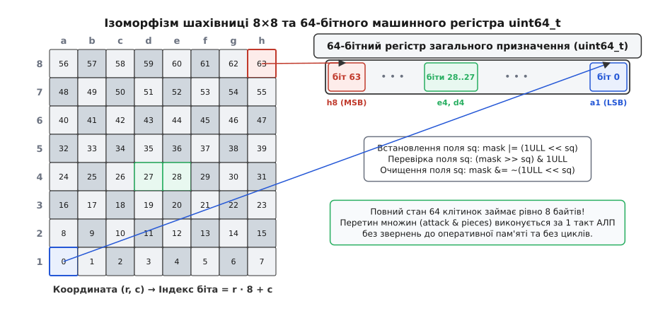
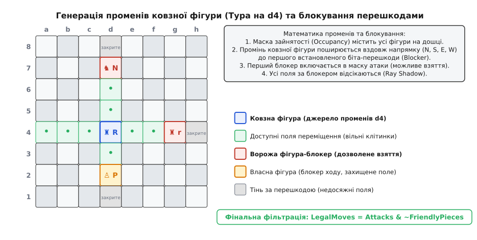
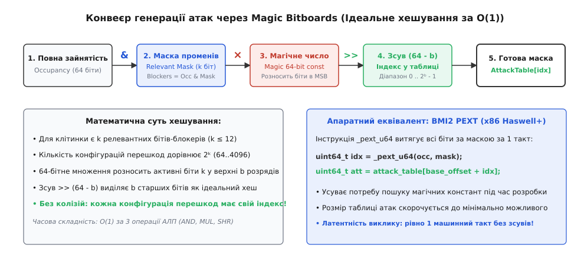
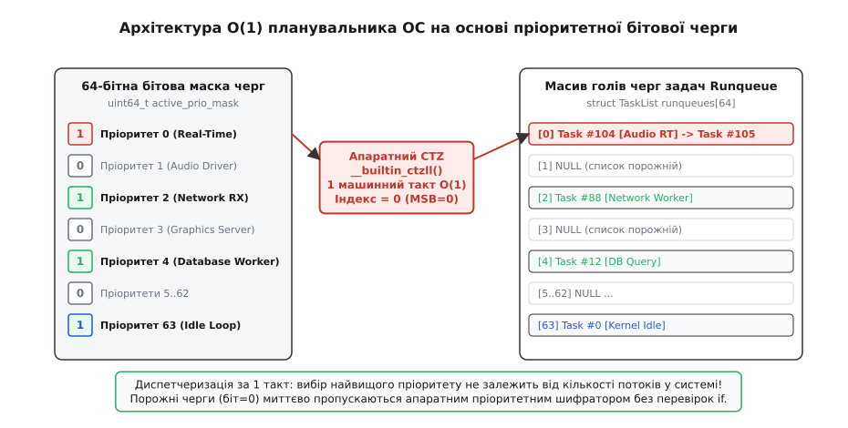

# Бітборди та бітові черги (Bitboards)

<preknowlist>
- [Побітові операції та маски](root:sf-algorithms/bitwise-operations) — порозрядні І/АБО/НІ, зсуви та маскування двійкових розрядів.
- [Підрахунок одиничних бітів (popcount)](root:sf-algorithms/popcount) — обчислення ваги Геммінга в машинному слові.
- [Апаратний пошук бітів: CLZ, CTZ, Popcount](root:sf-algorithms/bit-scan-clz-ctz) — сканування провідних та кінцевих нулів за один машинний такт.
- [Кеш-пам'ять процесора](root:hw-arch/cache) — ієрархія пам'яті, кеш-лінії та вплив промахів L1D на затримки.
- [Передбачення переходів](root:hw-arch/branch-prediction) — спекулятивне виконання та штрафи конвеєра за хибні розгалуження.
</preknowlist>

Коли шаховий рушій виконує альфа-бета пошук у глибину на 30 півходів, йому необхідно генерувати та оцінювати від 50 до 100 мільйонів позицій щосекунди на кожному процесорному ядрі. Якщо стан дошки зберігати у вигляді традиційного двовимірного масиву структур `char board[8][8]` або масиву покажчиків на об'єкти, кожне збереження стану під час спуску деревом пошуку переміщує щонайменше 64–512 байтів пам'яті. Перевірка доступних ходів та атак на клітинки вимагає сотень ітерацій у вкладених циклах із розгалуженнями `if`, що породжує промахи блока передбачення переходів (*branch mispredictions*). Кожен такий промах скидає суперскалярний конвеєр процесора на 15–20 тактів. У результаті генерація ходів для однієї позиції затягується на сотні наносекунд, скорочуючи глибину перебору в рази.

Щоб подолати цю проблему, розробники перенесли представлення дискретних системних просторів у регістри процесора: 64 клітинки дошки або 64 рівні системного стану кодуються бітами одного 64-бітного цілого числа — бітборда (*bitboard* або бітової черги).

---

### Ізоморфізм шахівниці та 64-бітного регістра

Бітборд базується на взаємно однозначному відображенні (бієктивному ізоморфізмі, від грецького *isos* — рівний, та *morphe* — форма) між 64 клітинками шахівниці `8×8` та 64 двійковими розрядами беззнакового машинного слова `uint64_t`.

Кожна клітинка однозначно задається парою координат `(rank, file)`, де `rank` — номер горизонталі (від 0 для 1-ї лінії до 7 для 8-ї лінії), а `file` — номер вертикалі (від 0 для вертикалі `a` до 7 для вертикалі `h`). Порядковий номер розряду `index` у 64-бітному слові обчислюється формулою:

```
index = rank · 8 + file
```

У результаті:
- Молодший значущий біт 0 (LSB) відповідає полю `a1` (лівий нижній кут);
- Біт 7 відповідає полю `h1` (правий нижній кут);
- Біт 56 відповідає полю `a8` (лівий верхній кут);
- Старший значущий біт 63 (MSB) відповідає полю `h8` (правий верхній кут).


*Ізоморфізм 64-бітного простору: пряме відображення шахових координат на розряди регістра uint64_t та базові побітові маніпуляції.*

Повний стан шахівниці більше не потребує виділення динамічних масивів. Він зберігається у вигляді фіксованого набору з 12 бітбордів для фігур (білі та чорні пішаки, коні, слони, тури, ферзі, королі) плюс кілька службових бітбордів (зайняті білі поля, зайняті чорні поля, сумарна зайнятість). Усі 12 бітбордів сумарно займають рівно 96 байтів пам'яті, що дозволяє їм повністю поміститися в регістровому файлі або в гарячому кеші першого рівня (L1D).

Детально про створення бітбордів та їхнє перше застосування на 64-бітних мейнфреймах ICL та суперкомп'ютерах Cray читайте в історичній довідці [історію виникнення бітбордів від програми «Каїсса» до ядра Linux](root:sf-algorithms/chess-bitboard/hist-bitboard-origins.md).

---

### Операції над множинами: алгебра бітових масок

Головна перевага бітборда над масивом об'єктів полягає в тому, що теоретико-множинні операції над простором (перетин, об'єднання, доповнення, різниця) виконуються паралельно для всіх 64 клітинок рівно за один машинний такт АЛП через побітову логіку:

```
Об'єднання множин (Union):       Occupied = WhitePieces ∨ BlackPieces
Перетин множин (Intersection):   AttackedByBoth = WhiteAttacks ∧ BlackAttacks
Різниця множин (Difference):     LegalMoves = TargetSquares ∧ ¬FriendlyPieces
Доповнення множини (Complement): EmptySquares = ¬Occupied
```

#### Базові геометричні маски

Для ізоляції окремих ліній дошки використовуються статичні 64-бітні константи:

1. **Маски вертикалей (Files):**
   - Вертикаль `A` (стовпчик 0): `FILE_A = 0x0101010101010101` (біти 0, 8, 16, 24, 32, 40, 48, 56);
   - Вертикаль `H` (стовпчик 7): `FILE_H = 0x8080808080808080` (біти 7, 15, 23, 31, 39, 47, 55, 63);
   - Вертикаль `B`: `FILE_A << 1`, вертикаль `C`: `FILE_A << 2` тощо;
2. **Маски горизонталей (Ranks):**
   - Горизонталь 1 (ряд 0): `RANK_1 = 0x00000000000000FF`;
   - Горизонталь 2 (ряд 1): `RANK_2 = 0x000000000000FF00`;
   - Горизонталь 8 (ряд 7): `RANK_8 = 0xFF00000000000000`.

Завдяки цим маскам запитання на зразок «чи є на вертикалі D хоча б один білий пішак?» розв'язується одним виразом `(white_pawns & FILE_D) != 0` без жодного обходу комірок у циклі.

---

### Рух пішаків та стрибкових фігур

Генерація переміщень шахових фігур ділиться на дві принципово різні категорії: паралельні зсуви (пішаки та стрибкові фігури) та розрахунок променів із зупинкою на перешкодах (ковзні фігури).

#### Зсуви для пішаків

Пішаки білих рухаються вперед на одну клітинку в напрямку зростання індексів (від рангу 1 до рангу 8). Оскільки кожна горизонталь містить 8 клітинок, крок на одне поле вперед відповідає зсуву бітборда ліворуч на 8 бітів:

```
WhitePawnSinglePush = (WhitePawns ≪ 8) ∧ ¬Occupied
```

Взяття пішаком виконується по діагоналі: ліворуч (зсув на 7 бітів) або праворуч (зсув на 9 бітів). При зсуві числа на 7 бітів виникає крайовий ефект: біт на вертикалі `H` може «перескочити» на вертикаль `A` наступного рядка (арифметичне переповнення рядка). Щоб запобігти такому спотворенню топології дошки, вихідний бітборд попередньо фільтрується маскою:

```
WhitePawnLeftCaptures  = ((WhitePawns ∧ ¬FILE_A) ≪ 7) ∧ BlackPieces
WhitePawnRightCaptures = ((WhitePawns ∧ ¬FILE_H) ≪ 9) ∧ BlackPieces
```

Ці три побітові операції обчислюють усі можливі ходи та взяття для всіх 8 пішаків білих одночасно за 3 машинні такти.

#### Стрибкові фігури: коні та королі

Кінь здійснює стрибок на клітинки з координатами `(±1, ±2)` та `(±2, ±1)`, а король — на будь-яку з 8 сусідніх клітинок. Траєкторія стрибка не перекривається іншими фігурами на проміжних полях.

Тому для коней та королів маски всіх можливих атак обчислюються один раз під час запуску програми й зберігаються у вигляді статичних таблиць:

:::tabs
```c
#include <stdint.h>

static uint64_t knight_attack_table[64];
static uint64_t king_attack_table[64];
```
```cpp
#include <cstdint>
#include <array>

static std::array<uint64_t, 64> knight_attack_table{};
static std::array<uint64_t, 64> king_attack_table{};
```
:::

Отримання дозволених ходів для коня на полі `sq` вимагає лише одного вибіркового читання з пам'яті та фільтрації зайнятих дружніх полів:

```
KnightMoves(sq) = knight_attack_table[sq] ∧ ¬FriendlyPieces
```

---

### Ковзні фігури: проблема блокування променів

Найскладнішою задачею бітбордів є генерація ходів для лінійних фігур (тури, слони, ферзі). Промінь дії ковзної фігури поширюється в заданому напрямку клітинка за клітинкою, доки не зустріне першу зайняту фігуру-перешкоду (блокер).


*Поширення променів ковзної фігури: тура на d4 виявляє блокери на d7, d2, g4. Клітинки за блокерами потрапляють у зону тіні (Ray Shadow) і відсікаються.*

Якщо блокером є ворожа фігура, це поле включається до маски атаки (дозволене взяття). Якщо блокером є власна фігура, поле не є дозволеним ходом, але захищається. Усі клітинки, розташовані за першим блокером уздовж лінії променя, стають недосяжними (знаходяться в «тіні променя»).

#### Еволюція методів обчислення блокерів

У розвитку генераторів ходів для ковзних фігур сформувалося кілька підходів:

1. **Класичне трасування променів (Ray Casting):** Цикл рухається по клітинках променя до першого блокера. Просто в реалізації, але містить повільні умовні переходи `if`;
2. **Паралельний префікс Когге-Стоуна (Kogge-Stone Algorithm):** Промінь поширюється за допомогою каскадних побітових зсувів `(b | (b << 8) | (b << 16) ...) & ~occupied`. Усуває розгалуження, але потребує десятків інструкцій АЛП на кожен напрямок;
3. **Магічні бітборди (Magic Bitboards):** Ідеальне безелезійне хешування, яке перетворює маску блокерів на індекс передрахованої таблиці атак за 3 такти процесора;
4. **Апаратна інструкція BMI2 PEXT (`_pext_u64`):** Апаратне витягування бітів за маскою за 1 такт на сучасних мікропроцесорах (Intel Haswell+, AMD Zen 3+).

---

### Magic Bitboards: ідеальне хешування за O(1)

Метод Magic Bitboards зводить обчислення атак ковзної фігури до швидкої формули хешування:

```
Blockers = Occupancy ∧ RelevantMask[square]
Index    = (Blockers · MagicConstant[square]) ≫ (64 - Shift[square])
Attacks  = AttackTable[BaseOffset[square] + Index]
```


*Конвеєр Magic Bitboards: маскування релевантних блокерів, 64-бітне множення на магічну константу, правий зсув та отримання готової маски атак за O(1).*

#### Механізм роботи

1. Для заданого поля `square` визначається маска релевантних блокерів `RelevantMask[square]`. Вона містить лише внутрішні поля уздовж ліній дії фігури (без крайніх полів дошки, оскільки наявність чи відсутність фігури на самому краю не змінює досяжність променя до цього краю);
2. Кількість встановлених бітів у масці становить `k` (для тури `k ≤ 12`, для слона `k ≤ 9`). Кількість можливих станів блокерів дорівнює `2ᵏ` (від 64 до 4096 варіантів);
3. 64-бітне цілочисельне множення `Blockers * MagicConstant` розносить активні біти перешкод у верхні розряди регістра;
4. Логічний зсув праворуч `>> (64 - Shift)` виділяє `Shift` старших бітів як числовий індекс у таблиці передрахованих атак;
5. За правильно підібраної магічної константи всі `2ᵏ` можливих комбінацій перешкод дають унікальні індекси без колізій результатів.

Детальний математичний аналіз ін'єктивності хеш-функції, оцінку колізій та алгоритм генерації констант методом Монте-Карло наведено у вставці [математичне обґрунтування ідеального хешування у Magic Bitboards](root:sf-algorithms/chess-bitboard/math-magic-bitboards.md).

Повний програмний код генератора ходів та диспетчера задач наведено у проектній вставці [практичну реалізацію генератора ходів та O(1) диспетчера задач](root:sf-algorithms/chess-bitboard/proj-sliding-and-scheduler.md).

---

### Бітові черги в операційних системах та апаратурі

Принцип бітборда — використання бітової маски для миттєвого пошуку та модифікації дискретних станів — лежить в основі системного програмування ядра ОС та мережевого обладнання.

#### O(1) планувальник задач (Runqueue Priority Bitmap)

У ядрах операційних систем (Linux `O(1)` Scheduler, FreeRTOS, Zephyr RTOS) задачі мають фіксовані рівні пріоритетів (наприклад, 0..63, де 0 — найвищий реальний час, а 63 — фоновий потік).

Замість того, щоб перебирати черги потоків у пошуку задачі з найвищим пріоритетом, планувальник використовує 64-бітну бітову чергу `uint64_t active_mask`:
- Коли задача з пріоритетом `P` стає готовою до виконання, встановлюється біт: `active_mask |= (1ULL << P)`;
- Коли черга рівня `P` стає порожньою, біт скидається: `active_mask &= ~(1ULL << P)`;
- Вибір наступної задачі для виконання зводиться до пошуку номера наймолодшого встановленого біта: `highest_prio = CTZ(active_mask)`.


*Архітектура диспетчера пріоритетів: 64-бітна маска active_mask під'єднана до апаратного блоку CTZ, вибираючи активну чергу за 1 такт незалежно від кількості задач.*

Диспетчеризація виконується строго за сталий час `O(1)` за 1 такт процесора без циклічного сканування порожніх рівнів.

Специфікацію типів, функцій та інваріантів бітової черги наведено у довідці [специфікацію системного інтерфейсу пріоритетної бітової черги](root:sf-algorithms/chess-bitboard/api-bit-queue.md).

#### Інші системні застосування бітових масок

- **Апаратні контролери переривань (ARM NVIC, x86 APIC):** Регістри `ISER` (Interrupt Set-Enable) та `ISPR` (Interrupt Set-Pending) зберігають стан сотень апаратних ліній переривань у вигляді бітових масок, де апаратний пріоритетний шифратор обирає вектор виклику за частки наносекунди;
- **Двійкові розподілювачі пам'яті (Buddy Allocators):** Ядро Linux використовує бітмапи вільних сторінок фізичної пам'яті для миттєвого пошуку сусідніх блоків пам'яті (*buddies*) під час злиття через операцію `XOR`;
- **Фільтри пакетів та таблиці маршрутизації (DPDK, XDP):** Швидкісні мережеві комутатори представляють активні правила фільтрації пакетів як бітові вектори, перевіряючи збіги заголовків за один прохід векторних регістрів SIMD.

---

### Канонічний цикл обходу та спустошення бітборда

Коли бітборд або бітова черга містить множину активних елементів (наприклад, 4 білих коней або 3 активні пріоритети), програмі необхідно послідовно витягти індекси всіх встановлених бітів.

Канонічний шаблон обходу виконується за допомогою двох операцій:
1. **`CTZ(bb)` (Count Trailing Zeros):** Отримання індексу молодшого встановленого біта за 1 такт;
2. **`bb &= (bb - 1)` (Reset Lowest Set Bit, BLSR):** Витирання молодшого встановленого біта за 1 такт.

:::tabs
```c
#include <stdint.h>

void handle_element(int sq);

void process_bitboard(uint64_t bb) {
    while (bb != 0) {
        int sq = __builtin_ctzll(bb); /* 1. Отримуємо індекс чергового елемента */
        handle_element(sq);           /* 2. Обробляємо елемент */
        bb &= (bb - 1);               /* 3. Скидаємо молодший біт за 1 такт */
    }
}
```
```cpp
#include <cstdint>
#include <bit>

template <typename Callback>
void process_bitboard(uint64_t bb, Callback&& handle_element) {
    while (bb != 0) {
        const int sq = std::countr_zero(bb); /* 1. Отримуємо індекс елемента */
        handle_element(sq);                  /* 2. Обробляємо елемент */
        bb &= (bb - 1);                      /* 3. Скидаємо молодший біт за 1 такт */
    }
}
```
:::

Кількість ітерацій цього циклу дорівнює точній кількості встановлених бітів (зазвичай 1–4 ітерації), тоді як обхід класичного масиву завжди вимагав би 64 ітерацій.

#### Апаратне відображення бітових інструкцій

Сучасні системи команд містять спеціалізовані інструкції для маніпуляцій із розрядами бітбордів:

| Операція над бітбордом | x86-64 (BMI1/BMI2) | ARM64 | RISC-V (Zbb) | Призначення |
| :--- | :--- | :--- | :--- | :--- |
| `__builtin_ctzll(x)` | `TZCNT r64, r64` | `RBIT` + `CLZ` | `CTZ rd, rs` | Номер наймолодшого біта |
| `__builtin_clzll(x)` | `LZCNT r64, r64` | `CLZ rd, rn` | `CLZ rd, rs` | Кількість провідних нулів |
| `__builtin_popcountll(x)` | `POPCNT r64, r64` | `CNT` (NEON) | `CPOP rd, rs` | Підрахунок кількості одиниць |
| `x & (x - 1)` | `BLSR r64, r64` | `SUB` + `AND` | `ANDN` / `SUB` | Скидання молодшого біта |
| `x & -x` | `BLSI r64, r64` | `NEG` + `AND` | `AND` + `NEG` | Ізоляція молодшого біта |
| `x ^ (x - 1)` | `BLSMSK r64, r64` | `SUB` + `EOR` | `XOR` / `SUB` | Маска від молодшого біта до LSB |
| `_pext_u64(x, m)` | `PEXT r64, r64, r64` | Емуляція | Емуляція | Паралельне витягування бітів |

---

### Мікроархітектурна ефективність та векторизація

Перехід на бітборди кардинально змінює навантаження на підсистеми процесора:

1. **Регістровий файл замість пам'яті:** Усі операції над дошкою відбуваються у внутрішніх регістрах процесора (`RAX`, `RBX`, `RCX` тощо). Латентність читання та запису становить 0 тактів очікування шини пам'яті (проти 4–5 тактів для звернення до L1D-кешу);
2. **Ліквідація промахів передбачення переходів:** Оскільки побітові оператори `&`, `|`, `^`, `~` виконуються лінійно над усім 64-бітним словом без умовних операторів `if`, суперскалярний конвеєр працює без зупинок та скидань;
3. **Векторизація SIMD (AVX2, AVX-512, ARM NEON):** Векторні регістри розміром 256 або 512 бітів дозволяють обробляти 4 або 8 бітбордів одночасно за одну машинну інструкцію (наприклад, перевірка перетину фігур для чотирьох типів військ однією командою `VPANDQ`).

> 🔧 **Навіщо це.**
> Бітборди та бітові черги перетворюють масивні задачі пошуку в просторі на порозрядну двійкову логіку АЛП. Застосування цієї техніки в шахових рушіях (Stockfish), планувальниках операційних систем (Linux, FreeRTOS), розподілювачах пам'яті та мережевих стеках дозволяє замінити сотні рядків коду з циклами та розгалуженнями на 2–3 машинні інструкції, досягаючи максимальної швидкодії, на яку здатне сучасне апаратне забезпечення.
