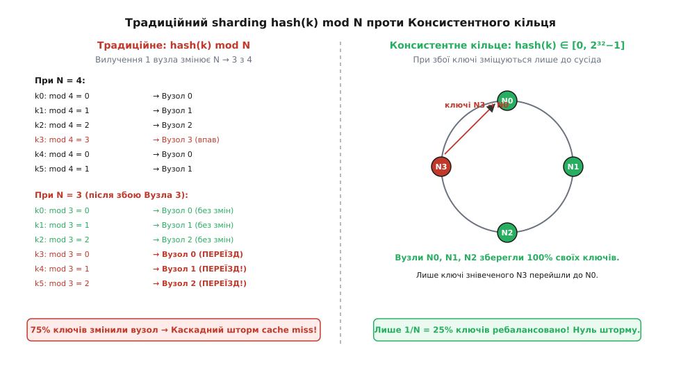
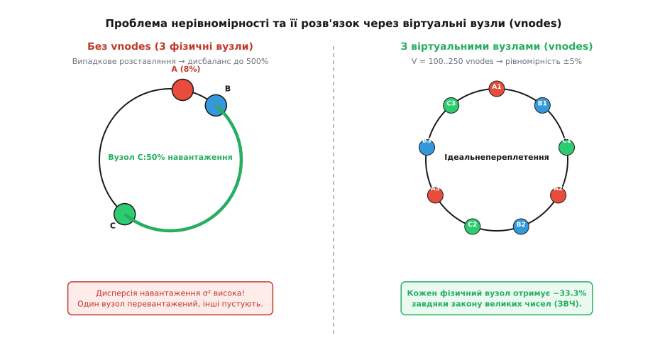

# Консистентне хешування

<preknowlist>
- [Хеш-таблиця](topic:sf-algorithms/hash-table) — хеш-функція h(k) mod N, розподіл за кошиками, колізії.
- [Сховище «ключ — значення»](topic:sf-algorithms/key-value-store) — розподілене кешування, шардинг за ключем.
</preknowlist>

Уявіть масштабну веб-систему: сотні тисяч користувачів одночасно дивляться відео, завантажують фотографії або авторизуються на сайті. Щоб не перевантажувати єдину центральну базу даних, перед нею ставлять шар розподіленого кешування — кластер із десятків або сотень серверів (наприклад, Memcached чи Redis). Кожен запит користувача містить ключ (наприклад, ID сесії `user_9174` або URL відеоролика), і система мусить миттєво визначити: **на якому саме з N серверів зберігаються дані для цього ключа?**

Найпростіше й найочевидніше рішення, яке спадає на думку будь-якому програмісту, — використати звичайну арифметику остачі від ділення. Обчислюємо хеш-код від ключа й ділимо його на кількість серверів N:

```
індекс_сервера = hash(ключ) mod N
```

Якщо хеш-функція якісно розсіює значення, ключі рівномірно розподіляться по всіх N серверах. Кожен сервер отримає приблизно 1/N частину загального навантаження. Система працює ідеально, поки конфігурація кластера залишається абсолютно статичною.

Але в реальних розподілених системах статичності не існує. Сервери виходять з ладу через апаратні збої, вимикаються на планову заміну оперативної пам'яті або ж інженери додають нові сервери, щоб упоратися зі зростаючим трафіком. І ось тут звичайна формула остачі від ділення створює катастрофу.

Уявіть, що у вас було 10 серверів (N = 10), і один із них раптово вийшов з ладу. Тепер активних серверів стало 9 (N = 9). Обчислимо, що станеться з адресою ключа, для якого `hash(key) = 14`:

```
При N = 10:   14 mod 10 = 4   →  сервер 4
При N = 9:    14 mod 9  = 5   →  сервер 5
```

Оскільки дільник змінився з 10 на 9, значення остачі від ділення перераховується майже для **кожного** ключа в системі! Математично можна довести (через китайську теорему про остачі, бо N і N − 1 завжди взаємно прості), що при зміні кількості серверів з N на N − 1 на місці лишається рівно частка `1/N` ключів — для N = 10 це рівно 10%. Тобто рівно **90% усіх ключів змінять свій приписаний сервер**.

Наслідки для веб-системи є нищівними. Мільйони кешованих об'єктів миттєво стають недосяжними, бо додаток шукає їх на нових серверах, де їх ще немає. Виникає каскадний шторм промахів кешу (англ. *cache miss storm* або *thundering herd*): усі запити користувачів одночасно пробивають шар кешування й падають безпосередньо на центральну базу даних. База даних миттєво перевантажується й лягає, викликаючи повну відмову всього сервісу.


*Зліва: у традиційній схемі hash(k) mod N падіння одного вузла змінює дільник N для всіх ключів, викликаючи переїзд рівно 90% даних (N = 10 → 9) і каскадний шторм промахів кешу. Справа: у консистентному кільці ключі зі збійного вузла N3 переходять тільки до сусіднього вузла N0, тоді як вузли N0, N1, N2 зберігають 100% своїх ключів недоторканими.*

Щоб подолати цю фундаментальну ваду, потрібен алгоритм розподілу, у якому додавання чи вилучення одного сервера викликає ребалансування **лише мінімальної частки даних**, залишаючи решту прив'язок повністю стабільними. Саме цим алгоритмом і є **консистентне хешування** (англ. *consistent hashing*).

---

## Фізична та логічна модель: простір як закрите кільце

Щоб позбутися прив'язки до фіксованої кількості серверів N, змінімо спосіб мислення про простір хешування. Уявімо весь діапазон можливих значень хеш-функції не у вигляді масиву від 0 до N-1, а як **замкнене безперервне кільце** (абстрактну окружність).

Припустимо, наша хеш-функція повертає 32-бітне ціле беззнакове число. Це означає, що простір значень лежить у діапазоні від `0` до `2³² - 1` (приблизно від 0 до 4.29 мільярдів). Уявимо цей діапазон замкненим у коло за годинниковою стрілкою: число `0` розташоване на самому верху (на 12 годин), значення зростають за годинниковою стрілкою, а число `2³² - 1` плавно замикається назад у точці `0`.

Головна новаторська ідея консистентного хешування полягає у тому, що **і сервери, і дані проектуються на це саме числове кільце за допомогою однієї й тієї ж хеш-функції**.

![Кільце хешування [0, 2³²-1]: додавання вузла N_new](img/ring-rebalance.svg)
*Кільце хешування в діапазоні [0, 2³²-1]. Фізичні вузли A, B, C та новий вузол N_new розміщені на колі за їхнім хешем. Ключ K1 шукає найближчий вузол за годинниковою стрілкою. При додаванні N_new лише ключі з зеленого сектора (A, N_new] мігрують від B до N_new, решта кілець залишаються незмінними.*

### Крок 1: Проєкція серверів на кільце
Кожен фізичний сервер має унікальний ідентифікатор — наприклад, свою IP-адресу (`"192.168.1.10"`) або хостнейм (`"cache-node-01"`). Ми проганяємо цей ідентифікатор крізь хеш-функцію:

```
позиція_сервера = hash("cache-node-01")
```

Отримане 32-бітне число визначає точну геометричну точку сервера на кільці. Оскільки хеш-функція якісно перемішує значення, декілька серверів будуть випадковим чином розкинуті по різних кутках кола.

### Крок 2: Проєкція даних на кільце
Коли в систему приходить ключ даних (наприклад, `"photo_8842.jpg"`), ми проганяємо його крізь **ту саму** хеш-функцію:

```
позиція_ключа = hash("photo_8842.jpg")
```

Ключ також отримує свою конкретну точку на тому ж самому кільці.

### Крок 3: Правило призначення (Clockwise Successor)
Як тепер визначити, який сервер відповідає за зберігання цього ключа?

Правило дуже просте: **від точки ключа ми рухаємося за годинниковою стрілкою вздовж кільця, поки не зустрінемо найперший сервер**. Цей сервер і є відповідальним за даний ключ (його називають *за годинниковим наступником* або *clockwise successor*).

Якщо ключ опинився між сервером A та сервером B (за годинниковою стрілкою від A до B), то його долею опікується сервер B. Якщо ключ виявився за останнім сервером на колі, ми робимо перехід через нульову точку (12 годин) і призначаємо його найпершому серверу на кільці.

---

## Чому це працює: механіка плавного ребалансування

Тепер подивімося, що відбувається, коли конфігурація кластера змінюється.

### Додавання нового сервера
Уявимо, що на кільці вже живуть сервери A, B і C. Нам потрібно додати новий сервер N_new.

1. Ми обчислюємо `hash("N_new")` і ставимо новий сервер на кільце. Припустимо, він опинився на дузі між сервером A та сервером B.
2. Хто тепер відповідає за ключі? 
   - Усі ключі, які раніше лежали між B і C, як і раніше, рухаються за годинниковою стрілкою до C. Вони **не змінили** свій сервер!
   - Усі ключі між C і A продовжують належати A. Вони **не змінили** свій сервер!
   - Змінилися лише ключі на дузі між A та N_new: раніше під час руху за годинниковою стрілкою вони минали порожнє місце й йшли аж до B, а тепер першим на їхньому шляху трапляється N_new!
3. Отже, новий сервер N_new «відрізає» на свою користь лише частину ключів у свого безпосереднього сусіда B. **Жоден інший сервер у кластері не втратив і не отримав жодного ключа.**

### Вилучення сервера
Якщо сервер B виходить з ладу або вимикається:
1. Точка B просто зникає з кільця.
2. Усі ключі, які раніше належали B (тобто лежали на дузі між A та B), тепер під час руху за годинниковою стрілкою продовжують рух далі й влучають у наступний сервер C.
3. Усі інші дуги кільця залишаються абсолютно нерухомими.

Математично, при наявності N серверів додавання або вилучення одного вузла викликає ребалансування приблизно **1/N частини всіх ключів в системі**. Для 100 серверів це означає, що при падінні одного вузла ребалансується лише 1% даних, а 99% кешу продовжує працювати без жодних промахів!

Історію створення цього математичного канону групою вчених MIT у 1997 році та заснування компанії Akamai розкрито в [статті Каргера та Akamai 1997 року](topic:sf-algorithms/consistent-hashing/hist-consistent-hashing.md).

---

## Проблема нерівномірності та розв'язок через Віртуальні Вузли (Vnodes)

Ідея з кільцем виглядає досконалою на папері, але при першій спробі запрограмувати її в лоб інженери стикаються з серйозною практичною перешкодою.

Якщо у вас у кластері всього 4 або 5 фізичних серверів, то випадкова хеш-функція розмістить їх на колі дуже нерівномірно. Один сервер може опинитися поруч із іншим, а між третім і четвертим утвориться величезна порожня дуга, що покриває 60% всього кола. У результаті сервер з найбільшою дугою буде знемагати від перевантаження (отримає 60% усіх ключів), тоді як його сусід буде простоювати з 5% навантаження.

З теорії ймовірностей відомо, що при розміщенні N випадкових точок на колі найдовша дуга в середньому в `ln N` разів більша за середнє значення. Дисперсія навантаження виявляється неприпустимо високою.


*Зліва: без віртуальних вузлів 3 фізичні сервери розташовуються нерівномірно, створюючи гігантські прогалини (вузол C отримує 50% навантаження, A — лише 8%). Справа: при розгортанні V=100...250 віртуальних вузлів на кожен сервер (A1..A3, B1..B3, C1..C3) дрібні дуги переплітаються по всьому колу, даючи ідеальну рівномірність ~33.3% за законом великих чисел.*

Розв'язком цієї проблеми стала концепція **віртуальних вузлів (англ. *virtual nodes* або *vnodes*)**.

### Як працюють vnodes?
Замість того щоб представляти кожен фізичний сервер на кільці **однією** точкою, ми створюємо для кожного сервера масив із `V` (наприклад, 100 або 250) **віртуальних вузлів**.

Для фізичного сервера `Server_A` ми обчислюємо хеші від кількох різних псевдонімів:

```
vnode_A_1 = hash("Server_A#1")
vnode_A_2 = hash("Server_A#2")
...
vnode_A_100 = hash("Server_A#100")
```

Усі ці 100 віртуальних точок одного сервера розміщуються у різних куточках кільця. Якщо в кластері 10 фізичних серверів і `V = 100`, то на колі з'являється 1000 дрібних точок.

Завдяки **Закону великих чисел (ЗВЧ)**, сотні дрібних дуг серверів A, B, C детально переплітаються між собою по всьому периметру кола. Сума 100 дрібних випадкових дуг одного сервера дуже сильно концентрується навколо середнього значення. Коефіцієнт варіації навантаження падає пропорційно `1/√V` (сама дисперсія — пропорційно `1/V`). При `V = 100` відхилення навантаження між серверами не перевищує 5–10%.

### Гетерогенні сервери (підтримка різної потужності)
Віртуальні вузли чудово розв'язують ще одну реальну інженерну задачу — гетерогенність обладнання. Якщо сервер `Server_X` у 2 рази потужніший за `Server_Y` (має удвічі більше ядер та ОЗП), ми просто виділяємо йому 200 vnodes замість 100. Сервер X отримає удвічі більше дрібних дуг на колі й відповідно вдвічі більше ключів даних.

Докладний математичний вивід дисперсії дуг та доведення закону `1/√V` наведено у [розподілі по колу та віртуальних вузлах](topic:sf-algorithms/consistent-hashing/math-ring-distribution.md).

---

## Алгоритмічна складність та пошук за `O(log M)`

З точки зору структур даних, кільце консистентного хешування зберігається як відсортована колекція (або збалансоване дерево пошуку), де ключем є хеш vnode, а значенням — ідентифікатор фізичного сервера:

```
ring: Map<uint32_t, PhysicalNodeID>
```

Розгляньмо асимптотичну складність основних операцій для кластера з `N` фізичних серверів та `V` віртуальних вузлів на кожен сервер (загальне число точок на кільці `M = N·V`):

1. **Пошук відповідального сервера (`get_node(key)`):**
   - Обчислюємо `key_hash = hash(key)` за `O(1)`.
   - Виконуємо двійковий пошук (`std::lower_bound` у C++ чи `bisect_left` у Python) у відсортованій мапі vnodes за `O(log M) = O(log(N·V))`.
   - Оскільки `log(N·V) = log N + log V`, для 1000 серверів із 250 vnodes (`M = 250 000`) двійковий пошук вимагає всього близько 18 порівнянь! Це надзвичайно швидко.

2. **Додавання нового сервера (`add_node(server)`):**
   - Генеруємо `V` нових хешів для vnodes.
   - Вставляємо `V` точок у відсортовану структуру за `O(V log M)`.

3. **Вилучення сервера (`remove_node(server)`):**
   - Видаляємо `V` віртуальних точок з кільця за `O(V log M)`.

Покроковий розбір вихідного коду реалізації кільця мовами C++ та Python представлено у [реалізації кільця консистентного хешування](topic:sf-algorithms/consistent-hashing/proj-consistent-hash-ring.md).

---

## Практичне застосування в реальних архітектурах

Сьогодні консистентне хешування є фундаментальним інженерним паттерном, на якому тримається інфраструктура найбільших IT-компаній світу:

- **Memcached (libketama):** Клієнтська бібліотека Ketama реалізує кільце з vnodes на боці додатка, дозволяючи динамічно масштабувати Memcached-кластери без втрати кешу.
- **Amazon DynamoDB, Apache Cassandra, Riak:** У розподілених NoSQL базах даних кожен вузол відповідає за свій діапазон хеш-кільця. Кільце використовується не лише для шардингу, а й для **реплікації**: репліки ключа записуються на `k` наступних серверів за годинниковою стрілкою.
- **Envoy Proxy / HAProxy / NGINX:** Балансувальники мікросервісної архітектури використовують консистентне хешування для забезпечення *sticky sessions* (прив'язки сесії конкретного користувача до одного й того ж пода чи мікросервісу).
- **Discord:** Використовує консистентне хешування для розподілу мільйонів одночасних голосувань та WebSocket-з'єднань між серверами обробки.

---

## Порівняння методів шардингу

Щоб остаточно закріпити розуміння, порівняймо три основні підходи до розподілу даних у кластерах:

| Властивість | Модульне хешування (`hash mod N`) | Консистентне кільце (Consistent Hashing) | Рандеву-хешування (HRW / Rendezvous) |
| :--- | :--- | :--- | :--- |
| **Складність пошуку** | `O(1)` | `O(log(N·V))` | `O(N)` |
| **Частка даних при зміні N** | `(N-1)/N` (до 99% втрат) | `1/N` (теоретичний мінімум) | `1/N` (теоретичний мінімум) |
| **Рівномірність навантаження** | Ідеальна | Висока (завдяки vnodes) | Ідеальна |
| **Витрати пам'яті** | `O(1)` | `O(N·V)` (для зберігання кільця) | `O(N)` (список серверів) |
| **Типове застосування** | Статичні хеш-таблиці в ОЗП | Динамічні NoSQL БД, CDN, кеші | Малі балансувальники, роутинг |

---

## Підсумок

**Консистентне хешування** розв'язало фундаментальну суперечність розподілених систем: як розподіляти дані за допомогою хешування, не стаючи заручником фіксованої кількості серверів N.

Завдяки замиканню простору хешування у безперервне коло та використанню правила «пошуку за годинниковою стрілкою», вихід з ладу або додавання нових серверів торкається лише **1/N частки даних**. А розгортання **віртуальних вузлів (vnodes)** перетворює випадковий розкид на рівномірне й підконтрольне навантаження з мінімальною дисперсією.
