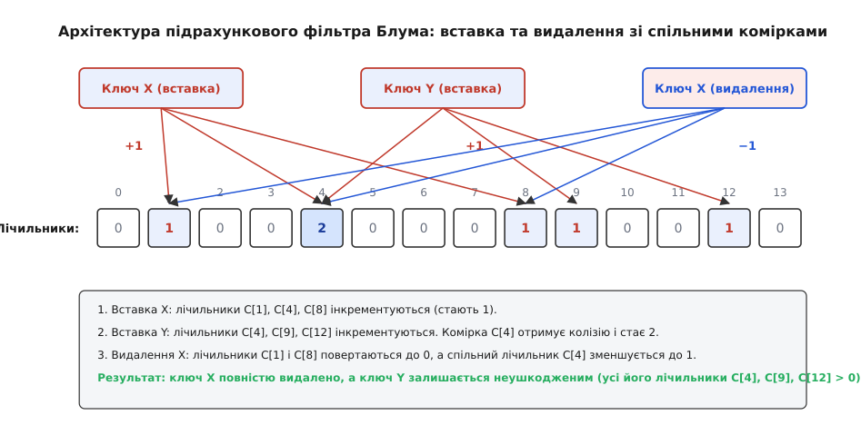
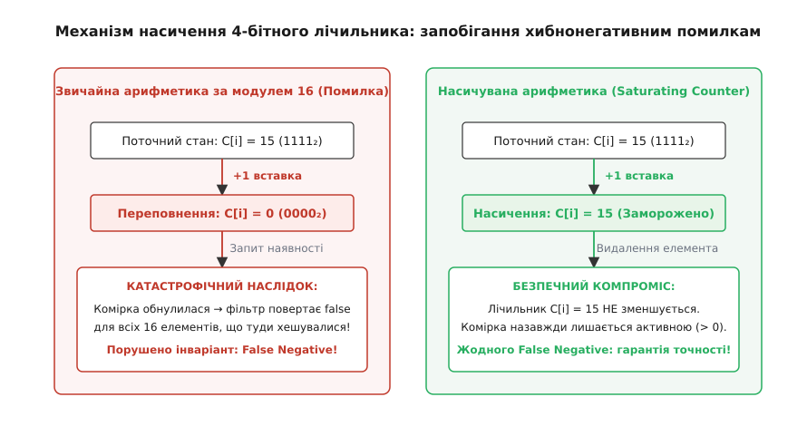
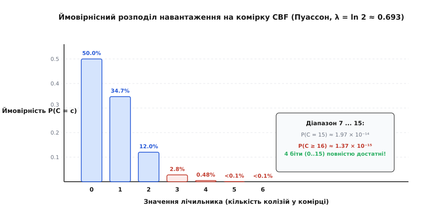

# Підрахунковий фільтр Блума (Counting Bloom Filter)

У розподіленій системі веб-кешування обсяг збережених сторінок динамічно змінюється кожні кілька мілісекунд: нові об'єкти витісняють застарілі дані за алгоритмом LRU (Least Recently Used), а неактуальні записи примусово інвалідуються. Якщо для швидкої перевірки наявності сторінки на сусідніх кеш-серверах використати класичний фільтр Блума, система швидко зіткнеться з нерозв'язною проблемою: класичний фільтр принципово не підтримує операцію видалення елементів. Спроба просто скинути відповідні `k` бітів з `1` у `0` при витісненні об'єкта миттєво знищує прапорці інших ключів, які випадково ділили ці самі біти через колізії хешування. У результаті для легітимних сторінок, які все ще залишаються в кеші, фільтр починає повертати хибнонегативні відповіді (False Negatives), що руйнує фундаментальну гарантію коректності структури даних.

<preknowlist>
- [Хеш-таблиця](root:sf-algorithms/hash-table) — базові принципи гешування та робота з колізіями.
- [Фільтр Блума](root:sf-algorithms/bloom-filter) — класичний бітовий ймовірнісний фільтр без підтримки видалення.
- [Біти, байти та порядок байтів](root:sf-algorithms/bits-bytes-endianness) — побітові операції, маски та упакування ніблів.
- [Розподіл Пуассона](root:hw-sensing/poisson-statistics) — статистика рідкісних подій та моделювання навантаження урн.
- [Фільтр зозулі (Cuckoo Filter)](root:sf-algorithms/cuckoo-filter) — альтернативна динамічна структура з підтримкою видалення.
</preknowlist>

Для розв'язання цієї дилеми бітовий масив замінюють масивом невеликих лічильників (зазвичай розрядністю 4 біти на комірку). Кожен лічильник зберігає точну кількість активних елементів, які наразі претендують на цю позицію. Операція вставки збільшує лічильники на одиницю, пошук перевіряє їхню ненульованість, а видалення зменшує лічильники на одиницю, відновлюючи нульовий стан лише тоді, коли всі елементи, що хешувалися в цю комірку, були остаточно вилучені.

Історію створення цієї структури, народженої під час боротьби з широкомовними мережевими штормами у протоколі ICP веб-кешів кінця 1990-х років, розібрано у вставці [Історія створення підрахункового фільтра Блума](root:sf-algorithms/counting-bloom-filter/hist-counting-bloom.md).

## Дилема видалення та втрата ентропії у класичному фільтрі

У класичному фільтрі Блума множина елементів `S = {x_1, x_2, ..., x_n}` відображається у бітовий вектор `B` довжиною `m` за допомогою `k` незалежних хеш-функцій. Кожен біт `B[j]` є результатом логічного «АБО» (диз'юнкції) над усіма подіями хешування:

```text
B[j] = ⋁_{x ∈ S} ⋁_{i=1}^k [ h_i(x) == j ]
```

Коли два різні ключі `x` та `y` мають однакове значення хеш-функції `h_a(x) == h_b(y) == j`, вони спільно встановлюють біт `B[j] = 1`. Логічна диз'юнкція є незворотною операцією (втрата ентропії стану): знаючи лише те, що `B[j] == 1`, неможливо визначити, скільки саме елементів привели до встановлення цього біта — один, п'ять чи десять.

Якщо спробувати видалити елемент `x`, примусово встановивши `B[h_i(x)] = 0` для всіх його `k` хеш-індексів, біт `B[j]` обнулиться. Якщо цей самий біт ділив елемент `y`, наступний виклик `contains(y)` перевірить позицію `j`, виявить там значення `0` і поверне `false`.

Виникає помилка **False Negative (хибнонегативне спрацьовування)**: структура стверджує, що елемента `y` немає у множині, хоча він ніколи не видалявся.

У критичних розподілених системах (наприклад, індексах розподілених баз даних чи кешах маршрутизації) помилка False Negative є неприпустимою катастрофою:
* У сховищах LSM-Tree (Log-Structured Merge-tree) фільтр Блума гарантує, що якщо він повернув `false`, SSTable-файл на диску можна безпечно пропустити без читання. Поява False Negative означає, що запит користувача поверне «запис не знайдено», проігнорувавши дійсні дані на диску.
* У мережевих кешах проксі поява False Negative призводить до повторного завантаження вже наявного файлу з віддаленого сервера-джерела, знецінюючи сенс кешування.

Саме неможливість безпечного видалення у бітовому масиві вимагає переходу до підрахункової моделі.

## Архітектура структури та організація пам'яті

Підрахунковий фільтр Блума (Counting Bloom Filter, CBF) замінює кожен біт вектора `B` цілочисельним лічильником `C[j]`. Структура складається з масиву `C` розміром `m` лічильників та набору з `k` незалежних хеш-функцій `h_1(x), h_2(x), ..., h_k(x)`.


*Архітектура та базові операції підрахункового фільтра Блума: вставка елементів із колізіями, перевірка ненульових лічильників та безпечне покрокове видалення.*

Кожна комірка масиву є 4-бітним цілим числом без знаку, що здатне зберігати значення від `0` до `15`. Для мінімізації накладних витрат пам'яті лічильники пакуються по два в кожен фізичний байт:
* Лічильник із парним індексом `2i` розміщується у молодшому ніблі (біти `0..3`) байта `i`.
* Лічильник із непарним індексом `2i + 1` розміщується у старшому ніблі (біти `4..7`) байта `i`.

Таке компонування дозволяє виділити рівно `ceil(m / 2)` байтів суцільної пам'яті. Зчитування та модифікація окремих ніблів виконуються за допомогою швидких побітових масок `0x0F` та `0xF0` і бітових зсувів на 4 позиції:

```text
// Зчитування парного лічильника:
val_even = storage[idx >> 1] & 0x0F;

// Зчитування непарного лічильника:
val_odd  = (storage[idx >> 1] >> 4) & 0x0F;

// Запис парного лічильника:
storage[idx >> 1] = (storage[idx >> 1] & 0xF0) | (val & 0x0F);

// Запис непарного лічильника:
storage[idx >> 1] = (storage[idx >> 1] & 0x0F) | ((val & 0x0F) << 4);
```

Спроба звертатися до окремих лічильників через побітові поля структур C (`struct { uint8_t c1:4; uint8_t c2:4; }`) є небезпечним антипатерном, оскільки стандарт мови C залишає порядок розміщення бітових полів у межах байта на розсуд компілятора (залежно від ABI та архітектури x86/ARM/RISC-V). Прямі побітові маски гарантують 100% бінарну переносність коду між різними платформами та файловими знімками.

Повну програмну реалізацію бітового пакування ніблів та алгоритмів фільтра на мовах C та C++ наведено у вставці [Практична реалізація підрахункового фільтра Блума на C та C++](root:sf-algorithms/counting-bloom-filter/proj-counting-bloom-filter.md).

## Подвійне хешування Кірша-Міценмахера

У високопродуктивних системах обчислення `k` незалежних хеш-функцій (наприклад, SHA-256 або навіть кількох проходів MurmurHash3) стає головним обчислювальним вузьким місцем.

Для мінімізації витрат CPU застосовується теорема Кірша-Міценмахера (Kirsch-Mitzenmacher Optimization): для довільного ключа `x` достатньо обчислити лише дві 32-бітні базові хеш-функції `h_1(x)` та `h_2(x)`. Послідовність із `k` індексів генерується через лінійну комбінацію:

```text
g_i(x) = ( h_1(x) + i · h_2(x) ) mod m          де 0 ≤ i < k
```

Адам Кірш та Майкл Міценмахер математично довели, що така схема забезпечує асимптотично таку саму ймовірність колізій і False Positive Rate, як і `k` повністю незалежних випадкових хеш-функцій.

Для коректної роботи схеми крок `h_2(x)` не повинен дорівнювати нулю (якщо `h_2(x) == 0`, його замінюють на `1`). Якщо розмір таблиці `m` обрано як ступінь двійки (`m = 2^p`), значення `h_2(x)` роблять непарним (`h_2(x) | 1`), що гарантує взаємну простоту з `m` і повний обхід усіх можливих індексів без передчасного зациклення.

## Базові операції та їхня алгоритмічна поведінка

Підрахунковий фільтр підтримує три фундаментальні операції з постійною часовою складністю `O(k)`:

### 1. Вставка елемента (Insert)

При додаванні ключа `x` обчислюються `k` індексів `idx_i = g_i(x)` (де `0 ≤ i < k`). Для кожного отриманого індексу поточне значення лічильника `C[idx_i]` зчитується з пам'яті:
* Якщо `C[idx_i] < 15`, значення інкрементується: `C[idx_i] = C[idx_i] + 1`.
* Якщо `C[idx_i] == 15`, лічильник залишається рівним `15` (досягнуто стан насичення).

Після оновлення всіх `k` комірок внутрішній лічильник активних елементів фільтра збільшується на одиницю.

### 2. Перевірка наявності (Lookup / Contains)

Для перевірки належності ключа `x` алгоритм послідовно інспектує комірки за індексами `idx_i = g_i(x)`:
* Якщо хоча б одна з перевірених комірок містить нуль (`C[idx_i] == 0`), алгоритм негайно перериває обхід і повертає `false`. Елемент **гарантовано відсутній** у множині, оскільки якби він додавався раніше, відповідний лічильник мав би значення щонайменше 1.
* Якщо всі `k` лічильників строго більші за нуль (`C[idx_i] > 0`), алгоритм повертає `true`. Елемент **можливо присутній** у множині. Як і в класичному фільтрі Блума, існує ненульова ймовірність False Positive через випадковий збіг колізій від інших незалежних ключів.

Завдяки ранньому перериванню при першому нульовому лічильнику середня кількість перевірок для відсутніх елементів становить менше 2 звернень до пам'яті.

### 3. Видалення елемента (Delete / Remove)

Операція видалення ключа `x` виконується у два етапи:
1. Спочатку обов'язково викликається перевірка `contains(x)`: якщо фільтр повертає `false`, видалення припиняється зі статусом помилки `ElementNotFound`.
2. Якщо перевірка успішна, обчислюються `k` індексів `idx_i = g_i(x)`:
   * Для кожної комірки зі значенням `1 ≤ C[idx_i] < 15` виконується декремент: `C[idx_i] = C[idx_i] - 1`.
   * Якщо комірка має значення `C[idx_i] == 15` (насичена), вона **не змінюється**, оскільки точна кількість переповнень невідома.

Повний опис інтерфейсу функцій, кодів помилок та правил виклику наведено у вставці [Специфікація API підрахункового фільтра Блума](root:sf-algorithms/counting-bloom-filter/api-counting-bloom-filter.md).

## Проблема переповнення та насичувані лічильники (Saturating Counters)

Найнебезпечнішою інженерною пасткою при реалізації підрахункового фільтра є поведінка лічильників при досягненні максимального значення.


*Механізм насичення лічильників (Saturating Counters): запобігання критичним помилкам False Negative шляхом фіксації значення на максимумі 15.*

У типових процесорних архітектурах додавання одиниці до максимального 4-бітного числа `15` (`1111_2 + 1`) призводить до скидання в нуль (`0000_2`) через циклічне перенесення за модулем 16. Якщо лічильник скинеться в `0`, то для всіх 16 елементів, які раніше хешувалися в цю комірку, операція `contains()` почне повертати `false`. Це створює заборонену помилку False Negative і повністю компрометує фільтр.

Щоб уникнути катастрофічного скидання, використовують **насичувану арифметику (Saturating Counters)**:
1. При інкременті лічильник зупиняється на значенні `15` і більше не збільшується.
2. При декременті насичений лічильник **заборонено зменшувати**. Оскільки система втратила інформацію про те, скільки саме колізій відбулося понад поріг (16, 20 чи 100), будь-яке зменшення може передчасно обнулити комірку для інших дійсних ключів.

Заморожена на максимумі `15` комірка поводиться як постійно встановлений біт `1` у класичному фільтрі Блума: вона назавжди зберігає здатність підтверджувати присутність ключів, сплачуючи за це лише локальним мікроскопічним підвищенням загальної ймовірності False Positive.

Якщо частка насичених комірок у масиві становить `s`, то ефективна ймовірність хибнопозитивної відповіді `p'` змінюється за формулою:

```text
p' = ( s + (1 - s) · (1 - e^(-k · n / m)) )^k
```

Оскільки при правильному розрахунку параметрів частка насичених комірок становить менше `10^(-14)`, вплив насичення на загальну точність фільтра є практично невідчутним.

## Математичне обґрунтування достатності 4-бітних лічильників

Чому розробники підрахункового фільтра обрали саме 4 біти, а не 2, 3 чи 8? Відповідь дає класична ймовірнісна модель розміщення кульок по урнах (Balls into Bins).


*Розподіл ймовірностей значень лічильників за законом Пуассона при оптимальному навантаженні λ = ln 2 ≈ 0.693.*

Нехай у фільтр із `m` комірок додається `n` ключів за допомогою `k` хеш-функцій. Загальна кількість операцій інкременту дорівнює `k · n`. При оптимальному виборі параметрів фільтра Блума, коли ймовірність хибнопозитивної відповіді мінімізується, кількість хеш-функцій вибирається як `k = (m / n) · ln 2`.

Середнє навантаження на одну комірку (математичне сподівання кількості потраплянь `λ`) дорівнює:

```text
λ = (k · n) / m = ln 2 ≈ 0.693147
```

Кількість потраплянь у фіксовану комірку підпорядковується біноміальному розподілу, який при великих `m` практично ідеально апроксимується розподілом Пуассона з параметром `λ`:

```text
P(C = c) = (λ^c · e^(-λ)) / c!
```

Для значень `c` від 0 до 16 маємо такий спектр ймовірностей:
* Порожня комірка (`c = 0`): `P(0) = e^(-0.693) = 0.5000` (рівно половина комірок вільна).
* Один елемент (`c = 1`): `P(1) = 0.693 · 0.5 = 0.3466`.
* Два елементи (`c = 2`): `P(2) = 0.1201`.
* Три елементи (`c = 3`): `P(3) = 0.0278`.
* Чотири елементи (`c = 4`): `P(4) = 0.0048` (менше піввідсотка).
* П'ять елементів (`c = 5`): `P(5) = 0.00066`.

Ймовірність того, що конкретна комірка досягне значення `16` або більше, обчислюється через хвіст розподілу Пуассона:

```text
P(C ≥ 16) = ∑_{c=16}^{∞} (λ^c · e^(-λ)) / c! ≈ 1.371 × 10^(-15)
```

Застосовуючи нерівність об'єднання подій (Union Bound) для всього масиву з `m = 10 000 000` комірок (10 мільйонів комірок), отримуємо ймовірність того, що **хоча б одна** комірка у всьому фільтрі переповниться:

```text
P(max C_i ≥ 16) ≤ m · P(C ≥ 16) = 10^7 · 1.371 × 10^(-15) = 1.371 × 10^(-8)
```

Імовірність зіткнутися з переповненням хоча б одного 4-бітного лічильника у фільтрі на десять мільйонів комірок становить близько `0.00000137%` (один шанс на 73 мільйони). Це робить 4-бітну розрядність математично достатньою та абсолютно надійною для будь-яких промислових застосувань.

Для порівняння, при використанні 3-бітних лічильників (максимум `7`, переповнення при `c ≥ 8`) ймовірність переповнення комірки становить `P(C ≥ 8) ≈ 1.25 × 10^(-6)`. Для масиву з 10 мільйонів комірок це гарантує понад 12 переповнених комірок при кожному заповненні фільтра, що неприпустимо для надійних систем. Використання ж 5 або 8 бітів на комірку є невиправданим марнотратством оперативної пам'яті, оскільки ймовірність перевищити поріг 15 уже прямує до абсолютного нуля.

Повне строге виведення формул переповнення, нерівностей Чернова та асимптотик Гонне-Райсеса наведено у вставці [Математичне виведення ймовірностей переповнення лічильників CBF](root:sf-algorithms/counting-bloom-filter/math-overflow-probability.md).

## Динамічна рівновага у потокових системах (Модель M/M/∞)

У реальних серверах кешування елементи не просто накопичуються: нові об'єкти постійно додаються з інтенсивністю `λ_in`, а старі витісняються з інтенсивністю `μ_out`.

Такий динамічний процес моделюється марковською системою масового обслуговування `M/M/∞`:
* Якщо середній час життя об'єкта в кеші дорівнює `T`, а швидкість додавання нових ключів становить `r` елементів на секунду, то середня кількість активних елементів у стаціонарному стані за формулою Літтла становить `n = r · T`.
* У стаціонарному режимі розподіл значень лічильників залишається пуассонівським із незмінним параметром `λ = ln 2`.

Проте в нескінченному часовому горизонті `t → ∞` навіть події з мікроскопічною ймовірністю `1.37 × 10^(-15)` врешті-решт відбуватимуться. Через заборону декременту насичених комірок фільтр поступово зазнає «старіння» (Filter Aging): частка заморожених лічильників повільно зростає, поступово погіршуючи точність фільтра.

Для усунення ефекту старіння у високонавантажених сервісах застосовують **ротацію поколінь (Generational CBF)**:
1. Система підтримує два підрахункових фільтри: активний `CBF_current` та архівний `CBF_previous`.
2. Кожні `T` годин поточний фільтр переноситься в архів, а на його місці створюється новий повністю обнулений `CBF_current`.
3. Операція пошуку опитує обидва фільтри: `contains = CBF_current.contains(x) || CBF_previous.contains(x)`.
4. Цей підхід гарантує повне очищення від накопичених насичень без переривання обслуговування запитів.

## Ціна модифікації: компроміс пам'яті та кеш-локальності

Головною платою за можливість динамічного видалення елементів є **4-кратне збільшення споживання оперативної пам'яті**:
* Класичний фільтр Блума вимагає близько `9.6` бітів на один ключ для досягнення ймовірності хибнопозитивної відповіді `p = 0.01` (1%).
* Підрахунковий фільтр Блума з 4-бітними лічильниками для збереження тієї ж самої ймовірності `p = 0.01` вимагає `9.6 · 4 = 38.4` біта на ключ (близько 4.8 байта на ключ).

| Параметр | Класичний Bloom Filter | Counting Bloom Filter (4 біти) |
| :--- | :--- | :--- |
| **Підтримка видалення (Delete)** | Ні (принципово неможлива) | Так (повна підтримка) |
| **Бітів на елемент при p = 1%** | `9.6` бітів | `38.4` бітів |
| **Пам'ять для 10 000 000 ключів** | `11.4` МБ | `45.8` МБ |
| **Операція на комірку** | Побітове OR / AND | Зчитування нібла, інкремент/декремент, запис |
| **Ризик False Negative** | 0% (суворо відсутній) | 0% (при насичуваній арифметиці) |

Крім обсягу пам'яті, підрахунковий фільтр створює підвищене навантаження на підсистему кеш-пам'яті процесора. Для кожного ключа алгоритм виконує `k` псевдовипадкових звернень до різних ділянок масиву. Якщо для класичного фільтра ці звернення є однобітовими операціями читання, то для CBF кожна операція вставки чи видалення вимагає циклу Read-Modify-Write над байтом пам'яті.

## Пастка некоректного видалення (False Deletions)

Критичною експлуатаційною вимогою до підрахункового фільтра Блума є сувора заборона видалення неіснуючих ключів.

Припустимо, клієнтський застосунок викликає функцію `remove(key)` для ключа, якого насправді ніколи не було у множині, але для якого фільтр випадково видав хибнопозитивну відповідь `contains(key) == true`. Алгоритм знайде `k` ненульових комірок і зменшить кожну з них на одиницю.

Оскільки у збалансованому фільтрі понад 69% активних комірок мають значення `C == 1`, їхнє зменшення негайно перетворить їх на нулі:

```text
1111_2 -> 0001_2 (C=1) - 1 = 0000_2 (C=0)
```

У результаті всі інші дійсні ключі, які хешувалися в ці комірки, будуть безповоротно пошкоджені. Під час наступного пошуку будь-якого з цих дійсних ключів фільтр побачить нуль і поверне `false` — виникне заборонена помилка False Negative для абсолютно легітимних даних.

**Фундаментальне правило**: операція `remove()` у підрахунковому фільтрі Блума може викликатися виключно за умови, що факт фізичної наявності елемента підтверджено первинним авторитетним сховищем даних (базою даних, дисковим індексом або хеш-таблицею).

## Захист від атак типу Hash-DoS за допомогою криптографічних солей

Якщо підрахунковий фільтр Блума приймає ключі з ненадійних зовнішніх джерел (наприклад, заголовки HTTP або ідентифікатори сесій від користувачів мережі), зловмисник може навмисно скомпонувати послідовність ключів, що мають однакові значення хеш-функцій.

Штучно генеруючи колізії, атакуючий може примусово загнати вибрані комірки фільтра у стан насичення (`15`), викликавши швидке «забруднення» пам'яті та стрибок імовірності False Positive до 100%.

Для захисту від атак алгоритмічної складності (Hash DoS) у публічних сервісах стандартні некриптографічні хеші замінюють на параметризовані алгоритми з випадковим 128-бітним секретним ключем (сіллю), такі як **SipHash-2-4** або **HighwayHash**. Секретний ключ генерується при старті процесу з криптографічного генератора `/dev/urandom`, що робить передбачення колізій для зовнішнього спостерігача обчислювально неможливим.

## Блокова організація та L1-кеш оптимізація (Blocked CBF)

У класичному підрахунковому фільтрі виконання `k` хеш-перевірок розпорошує запити по всьому адресному простору пам'яті. Для великих фільтрів (від сотень мегабайтів) це спричиняє до `k` холодних промахів кешу L3 DRAM на кожну операцію.

Для усунення цієї проблеми застосовують блокову оптимізацію (Blocked Counting Bloom Filter):
1. Масив лічильників розбивається на незалежні 64-байтові блоки (розмір кеш-лінії L1D процесора).
2. Кожен 64-байтовий блок містить рівно 128 4-бітних лічильників.
3. Перший хеш `h_1(x)` обирає номер блоку, а наступні `k` індексів обчислюються локально всередині знайденого 64-байтового відрізка.

Завдяки цьому весь блок завантажується в процесорний кеш за одне звернення до пам'яті, скорочуючи загальну затримку операції `contains()` з 250 наносекунд до менш ніж 30 наносекунд.

## Апаратна реалізація в кремнії (ASIC, FPGA та TCAM)

У магістральних комутаторах ядра мережі (обробка трафіку 400 Гбіт/с і 800 Гбіт/с) підрахунковий фільтр реалізується безпосередньо в апаратній логіці ASIC або FPGA:
* Масив лічильників зберігається у високошвидкісній внутрішньокристальній пам'яті SRAM (Block RAM / UltraRAM), що працює на тактовій частоті понад 1 ГГц.
* Для виконання `k` перевірок масив розбивається на `k` незалежних апаратних банків пам'яті (Bank Partitioning).
* Операції хешування, читання, інкременту та декременту виконуються повністю паралельно на конвеєрі за 1 такт тактового генератора без блокування сусідніх банків.

Така конвеєризація забезпечує обробку понад 1.2 мільярда пакетів на секунду, що недосяжно для будь-якої програмної реалізації на базі процесорів загального призначення.

## Оптимізації та еволюційні нащадки

Для подолання 4-кратного оверхеду пам'яті та розширення функціональності було розроблено кілька спеціалізованих структур даних:

### 1. d-left Counting Bloom Filter (dl-CBF)

Розроблений Флавіо Бономі, Майклом Мітценмахером, Ріною Паніграхі, Сушілом Сінгхом та Джорджем Варгасом (Flavio Bonomi, Michael Mitzenmacher, Rina Panigrahy, Sushil Singh, George Varghese) у 2006 році, d-left CBF спирається на алгоритм хешування d-left (техніка вибору з кількох варіантів / Power of Two Choices):
* Масив розбивається на `d` рівних підмасивів (підтаблиць).
* Кожен ключ хешується в одну комірку в кожній із `d` підтаблиць.
* Елемент поміщається у найменш заповнену комірку (при рівності обирається крайня ліва, звідки й назва d-left).
* Замість лічильників комірка зберігає компактний відбиток (fingerprint) ключа.

Завдяки рівномірному балансуванню завантаження d-left CBF скорочує споживання пам'яті до `1.5–2.0` бітів на ключ порівняно зі звичайним CBF, забезпечуючи при цьому підтримку операцій вставки та видалення.

### 2. Variable-Increment Counting Bloom Filter (VI-CBF)

У звичайному CBF при кожній вставці лічильник завжди збільшується на фіксовану величину `+1`. У Variable-Increment CBF значення інкременту є псевдовипадковим числом `D(x) ∈ {1, 2, ..., L}`, детерміновано обчисленим від хешу ключа `x`:
* При вставці: `C[idx_i] = C[idx_i] + D_i(x)`.
* При видаленні: `C[idx_i] = C[idx_i] - D_i(x)`.
* При перевірці перевіряється умова `C[idx_i] ≥ D_i(x)`.

Змінний інкремент значно знижує ймовірність False Positive при колізіях, оскільки випадковий сторонній ключ повинен не просто потрапити в ненульові комірки, а й задовольнити нерівність `C[idx_i] ≥ D_i(y)` для всіх `k` позицій одночасно.

### 3. Spectral Bloom Filter (SBF)

Запропонований Саріелем Коеном та Йосі Матіасом у 2003 році, спектральний фільтр Блума розширює CBF для роботи з мультимножинами (де елементи можуть повторюватися багатократно).

SBF дозволяє не лише перевіряти наявність ключа, а й оцінювати його точну частоту появи в потоці за допомогою **мінімального оцінювача (Minimum Estimator)**:

```text
f_est(x) = min { C[h_1(x)], C[h_2(x)], ..., C[h_k(x)] }
```

Оскільки колізії можуть лише збільшити окремі лічильники, мінімум серед усіх `k` значень дає найточнішу верхню границю частоти появи ключа `x`.

### 4. Динамічно масштабований фільтр (Scalable CBF)

Коли кількість активних елементів перевищує початкову місткість `n`, коефіцієнт навантаження `λ` зростає, підвищуючи ймовірність помилки `p`.

Масштабований фільтр (Scalable Counting Bloom Filter) організовує багаторівневу ієрархію:
* При заповненні поточного рівня створюється новий шар більшої місткості `n_i = s · n_{i-1}` із посиленою точністю `p_i = p_0 · r^i` (де `r ≈ 0.85`).
* Нові вставки додаються виключно у найновіший шар, а перевірка опитує всі наявні шари паралельно.

## Повний інженерний розрахунок параметрів для високонавантаженої системи

Продемонструємо повний практичний розрахунок параметрів підрахункового фільтра на прикладі високопродуктивного веб-кешу:

### 1. Вихідні вимоги до системи
* Очікувана кількість активних URL-адрес у кеші: `n = 50 000 000` (50 мільйонів ключів).
* Допустима ймовірність хибнопозитивного спрацьовування: `p = 0.005` (0.5%).

### 2. Розрахунок кількості комірок `m`
Застосовуємо фундаментальну формулу мінімізації обсягу фільтра:

```text
m = - (n · ln p) / (ln 2)² = - (50 000 000 · ln 0.005) / (0.693147)²
m = - (50 000 000 · (-5.298317)) / 0.480453 ≈ 551 386 420 комірок
```

Округлимо до найближчого парного числа: `m = 551 386 420` 4-бітних лічильників.

### 3. Розрахунок оперативної пам'яті
Оскільки два 4-бітних лічильники пакуються в один байт:

```text
byte_size = m / 2 = 551 386 420 / 2 = 275 693 210 байтів ≈ 262.9 МБ
```

Для порівняння: класичний однобітовий фільтр Блума для тих самих вимог зайняв би `m / 8 ≈ 65.7` МБ оперативної пам'яті. Різниця становить рівно `4×`.

### 4. Оптимальна кількість хеш-функцій `k`

```text
k = (m / n) · ln 2 = (551 386 420 / 50 000 000) · 0.693147 ≈ 11.0277 · 0.693147 ≈ 7.64
```

Обираємо ціле число `k = 8`.

### 5. Очікувана надійність лічильників
Ймовірність переповнення окремої комірки понад значення `15`:

```text
P(C ≥ 16) ≈ 1.371 × 10^(-15)
```

Ймовірність появи хоча б однієї замороженої комірки в усьому масиві з 551 млн елементів:

```text
P(max C_i ≥ 16) ≤ 551 386 420 · 1.371 × 10^(-15) ≈ 7.56 × 10^(-7)
```

Шанс зіткнутися з переповненням хоча б одного лічильника у такому гігантському фільтрі становить менше 1 на 1.3 мільйона, що гарантує абсолютно бездоганну цілодобову роботу сервісу.

## Порівняльний аналіз динамічних імовірнісних фільтрів

У таблиці наведено зіставлення основних структур даних, що підтримують динамічне видалення елементів:

| Структура даних | Розмір (бітів/ключ при p=1%) | Швидкість пошуку | Швидкість видалення | Локальність кешу CPU | Переповнення (Overflow) |
| :--- | :--- | :--- | :--- | :--- | :--- |
| **Counting Bloom Filter** | `~38.4` | `O(k)` | `O(k)` | Низька (`k` промахів) | Заморожування на 15 |
| **d-left CBF** | `~16.0` | `O(d)` | `O(d)` | Середня (`d` промахів) | Витіснення / Помилка |
| **Cuckoo Filter** | `~12.0` | `O(1)` (2 перевірки) | `O(1)` | Висока (2 кеш-рядки) | Каскадне витіснення |
| **Quotient Filter** | `~13.5` | `O(1)` | `O(1)` | Дуже висока (1 кластер) | Зсув у сусідні слоти |
| **Класичний Bloom** | `~9.6` | `O(k)` | **Немає** | Низька (`k` промахів) | Немає лічильників |

Хоча фільтри Cuckoo та Quotient є компактнішими за обсягом пам'яті, підрахунковий фільтр Блума зберігає критичні інженерні переваги:
1. **Гарантований постійний час вставки `O(k)`**: у CBF ніколи не виникає каскадних витіснень або нескінченних циклів перестановок (як у Cuckoo Filter при високому заповненні). Це забезпечує передбачуваність затримки (Deterministic Latency) для систем жорсткого реального часу (Hard Real-Time).
2. **Апаратна простота**: алгоритм ідеально реалізується в кремнії мережевих ASIC/FPGA через паралельні конвеєри без необхідності переміщення чужих записів.
3. **Можливість покомпонентного об'єднання (Union)**: два CBF однакового розміру можна об'єднати поелементним додаванням лічильників, тоді як Cuckoo-фільтри не підтримують пряме злиття без повної перебудови.

## Практичні сфери застосування у розподілених системах

1. **Мережеві маршрутизатори та моніторинг трафіку**:
   Високошвидкісні комутатори використовують CBF для відстеження активних TCP-з'єднань у ковзному часовому вікні. При відкритті сесії (пакет SYN) кортеж з'єднання додається у фільтр, а при закритті (пакет FIN/RST) або вичерпанні тайм-ауту видаляється, запобігаючи переповненню таблиць маршрутизації.

2. **Проксі-сервери та Summary Cache**:
   Кеш-сервери підтримують CBF у локальній пам'яті для обліку доданих і витіснених URL-адрес. Для передачі сусідам CBF проєктується в компактний однобітовий зріз, заощаджуючи мережевий трафік.

3. **Фільтри допуску в кеш (Cache Admission Policies)**:
   У сучасних сховищах даних (наприклад, RocksDB та Apache Cassandra) підрахунковий фільтр відфільтровує «одноразові» запити (One-Hit Wonders): об'єкт записується у дорогий оперативний або SSD-кеш лише тоді, коли його лічильник у CBF досягає значення 2 або більше. Це зменшує коефіцієнт посилення запису (Write Amplification) на накопичувачі NVMe у 2–3 рази та суттєво продовжує їхній ресурс зносостійкості.

4. **Дедуплікація потокових даних у реальному часі**:
   При обробці нескінченних потоків подій (наприклад, у Kafka або Flink) CBF утримує ідентифікатори повідомлень за останні N хвилин, забезпечуючи гарантовану фільтрацію дублікатів із константними витратами пам'яті.

5. **Розподілені реєстри та пули транзакцій (Mempool Tracking)**:
   Вузли блокчейн-мереж (Bitcoin Core, Ethereum Geth) використовують підрахункові фільтри для обліку непідтверджених транзакцій у пулі пам'яті (Mempool). Коли нова транзакція надходить із P2P-мережі, вона реєструється в CBF. Після включення транзакції у щойно змащений блок її ідентифікатор видаляється з фільтра, що дозволяє миттєво відкидати спроби подвійних витрат (Double-Spending) без важких дискових пошуків і захищає процесорні ресурси ноди від лавинних повторних ретрансляцій.
