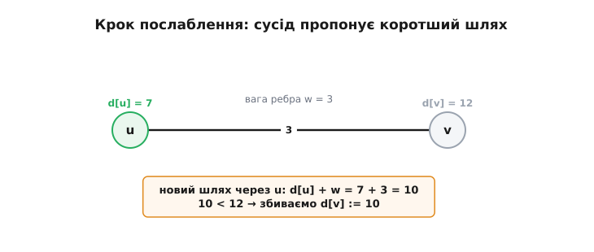
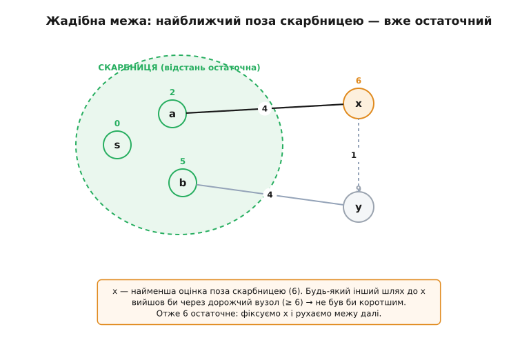
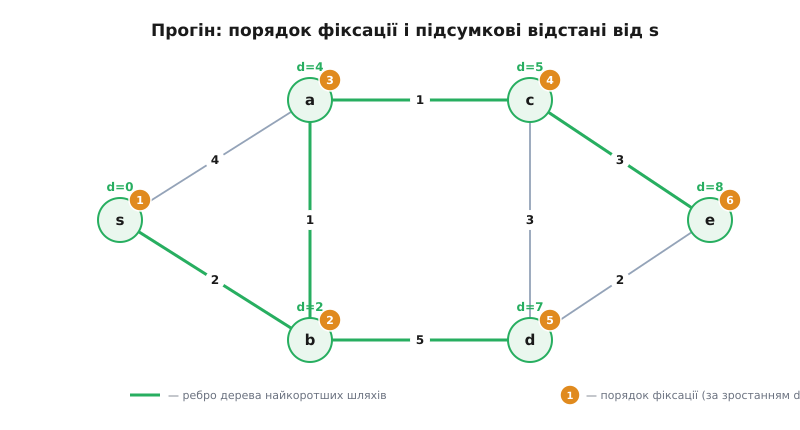

# Алгоритм Дейкстри

Уяви карту, де міста з'єднані дорогами, і кожна дорога має свою «ціну» — кілометри, хвилини, витрату пального. Стоячи в одному місті, хочеш знати найдешевший шлях до кожного іншого. Наївна думка — «перебрати всі маршрути й вибрати найкоротший» — розбивається об розмір: маршрутів між двома точками в мало-мальськи великій мережі астрономічно багато, їх не перелічити за життя. Потрібен спосіб знайти найкоротші відстані **не перебираючи шляхи взагалі**. Саме це робить алгоритм Дейкстри (нідерл. *Dijkstra*, на честь автора): він видає найкоротшу відстань від однієї заданої вершини до **всіх** решти за один ощадливий прохід, ні разу не розглянувши цілий маршрут як єдине ціле.

Ключове слово тут — **ваги ребер невід'ємні**. Дорога може коштувати 3 або 0, але не «−5»: у задачах, де Дейкстра доречний (відстані, час, затримка каналу зв'язку), від'ємної ціни просто не буває. Ця обставина не дрібна деталь, а той самий стрижень, на якому тримається вся ідея, — до нього ще повернемось.

### Що таке «граф» і «найкоротший шлях»

Граф (гр. *gráphō* — пишу, креслю) — це просто набір **вершин** (точок) і **ребер** (з'єднань між ними). Місто — вершина, дорога — ребро. Коли ребру приписано число — його **вагу** (тут: ціну проїзду), — граф звуть **зваженим**. Довжина шляху — це сума ваг ребер уздовж нього, а **найкоротший шлях** від вершини `s` до вершини `t` — той із можливих шляхів, у якого ця сума найменша.

Задача, яку розв'язує Дейкстра, ширша за «від `s` до одного `t`»: він знаходить найкоротші відстані від `s` **одразу до всіх** вершин (англ. *single-source shortest paths* — «найкоротші шляхи з однієї вершини»). Виявляється, шукати відстань до одного пункту призначення не легше, ніж до всіх, — по дорозі до далекого міста однаково доводиться з'ясувати відстані до ближчих, тож алгоритм просто не зупиняється й добудовує решту.

### Головна дія: послаблення

Уся машина зроблена з однієї-єдиної операції, і зрозумівши її, ти зрозумів алгоритм. Кожній вершині `v` тримаємо число `d[v]` — **найкоротшу відому наразі відстань** від старту до `v`. Слово «наразі» тут важить усе: це не остаточна відповідь, а найкраща оцінка, яку ми **поки** знайшли; спершу вона завідомо завищена, і по ходу справи ми її **збиваємо вниз**, коли натрапляємо на коротший обхід.

Спочатку про старт `s` знаємо чесно: `d[s] = 0` (до себе йти нічого). Про решту не знаємо **нічого**, тож ставимо `d[v] = ∞` (нескінченність) — «поки що недосяжно». А далі повторюємо один хід. Хай ми стоїмо у вершині `u`, чия відстань `d[u]` вже відома, і з неї веде ребро вагою `w` до сусіда `v`. Тоді шлях «дійти до `u`, потім по цьому ребру до `v`» коштує `d[u] + w`. Якщо це **менше** за поточну оцінку `d[v]` — ми щойно знайшли до `v` дешевший обхід, тож оцінку збиваємо:

:::tabs
```c
// Послаблення ребра u → v вагою w.
// dist[] — поточні найкоротші відомі відстані; INF — нескінченність.
if (dist[u] + w < dist[v]) {
    dist[v] = dist[u] + w;   // знайшли коротший шлях до v — оновлюємо
    prev[v] = u;             // запам'ятовуємо, звідки прийшли (для відновлення маршруту)
}
```
```python
# Послаблення ребра u → v вагою w.
# dist[] — поточні найкоротші відомі відстані; float('inf') — нескінченність.
if dist[u] + w < dist[v]:
    dist[v] = dist[u] + w    # знайшли коротший шлях до v — оновлюємо
    prev[v] = u              # запам'ятовуємо, звідки прийшли (для відновлення маршруту)
```
:::

Цю операцію звуть **послабленням** (англ. *relaxation*) ребра. Назва — з механіки: уяви оцінку `d[v]` як натягнуту вгору (завищену) гумку, а кожне послаблення трохи її **відпускає** ближче до правди — до справжньої найкоротшої відстані, нижче якої вона вже не опуститься.


*Крок послаблення — єдина дія алгоритму. Через уже зафіксовану вершину `u` (d = 7) веде ребро вагою 3 до `v`. Новий шлях коштує 7 + 3 = 10, а це менше за стару оцінку 12, тож `d[v]` збиваємо до 10. Якби вийшло не менше — оцінку лишили б як є.*

> 🔧 **Навіщо це.** Послаблення — це те місце, де мережа «дізнається» про короткі шляхи, не розглядаючи їх цілком. Ми ніколи не будуємо маршрут «`s → … → v`» повністю: ми лише раз по раз питаємо «а чи не дешевше дійти до `v` через ось цього сусіда?». Довгий шлях складається з коротких кроків, і, послабивши кожне ребро в правильному порядку, ми складаємо правильну відповідь із локальних порівнянь. Уся хитрість Дейкстри — **у якому саме порядку** послабляти, щоб кожне ребро знадобилося лише раз.

### Жадібний порядок: бери найближчу нефіксовану

Якби ми послабляли ребра абияк, оцінки врешті теж дійшли б до правди, але могли б виправлятися по багато разів — марна робота. Дейкстра знаходить порядок, за якого **кожна вершина фіксується остаточно рівно раз**, і робить це **жадібно** (на кожному кроці — локально найвигідніший вибір, без озирання на майбутнє).

Розділимо вершини на дві множини. Одна — **зафіксовані** (їхня найкоротша відстань уже точно відома, чіпати не будемо); назвемо її скарбницею. Друга — усі решта, з поки що лише оцінками. Спочатку скарбниця порожня, а оцінки такі: `d[s] = 0`, решта `∞`. І тепер — саме правило Дейкстри:

**Серед усіх нефіксованих вершин візьми ту, чия оцінка `d` найменша, оголоси її відстань остаточною (перенеси у скарбницю) і послаб усі ребра, що з неї виходять.** Повторюй, доки нефіксовані не скінчаться.

Чому це взагалі законно — фіксувати відстань, ще не роздивившись усю решту графа? Ось де вмикається невід'ємність ваг. Візьмімо нефіксовану вершину `x` із найменшою оцінкою `d[x]` серед нефіксованих. Стверджую: коротшого шляху до `x`, ніж `d[x]`, **не існує** — тож оцінку можна сміливо робити остаточною. Уяви будь-який інший шлях від `s` до `x`. Він мусить колись **вийти зі скарбниці назовні** — переступити через якусь нефіксовану вершину `y` (бо `x` теж поза скарбницею). Але `x` — найменша оцінка серед нефіксованих, тож `d[y] ≥ d[x]`. А оскільки ваги невід'ємні, решта того шляху після `y` **нічого не відніме** — тільки додасть (або лишить як є). Виходить, будь-який обхідний шлях коштує щонайменше `d[y] ≥ d[x]` — не менше за прямий. Отже, `d[x]` уже найкраще можливе, і фіксувати його безпечно.


*Чому найближчу можна фіксувати. Скарбниця (зелена зона) — вершини з остаточною відстанню. Кандидат `x` має найменшу оцінку (6) серед тих, що поза нею. Будь-який інший маршрут до `x` мусив би вийти зі скарбниці через дорожчу вершину (оцінка ≥ 6), а невід'ємні ваги далі лише додають — тож коротшим він бути не може. Значить, 6 остаточне.*

Ось де ламається аналогія й видно межу методу. Якби ребро могло мати **від'ємну** вагу, обхідний шлях через дорожчу `y` міг би далі впасти в мінус і врешті виявитися дешевшим — і фіксувати `x` наосліп стало б помилкою. Тому Дейкстра **не працює** з від'ємними вагами; для них є інші алгоритми (наприклад, [Беллмана–Форда](root:sf-algorithms/bellman-ford), що чесно перебирає послаблення багато разів і від'ємні ребра терпить). На невід'ємних же вагах жадібний вибір — не наближення, а строго доведена правда.

> 🔧 **Навіщо це.** Ця межа — не буквоїдство, а те, що вирішує, годиться Дейкстра для твоєї задачі чи ні. Відстані, час у дорозі, затримка чи вартість каналу зв'язку — завжди `≥ 0`, тут Дейкстра ідеальний. Та щойно з'являються величини, що можуть бути від'ємними (виграш, який покриває витрату; курсова різниця; «повернені» кошти), — жадібний вибір стає небезпечним, і треба брати інший інструмент. Знати, **чому** саме невід'ємність робить фіксацію законною, — значить не наступити на цю пастку.

### Прогін руками

Візьмемо маленький граф і пройдімо алгоритм крок за кроком. Вершини `s, a, b, c, d, e`; ребра (неорієнтовані, вага в дужках): `s–a (4)`, `s–b (2)`, `b–a (1)`, `a–c (1)`, `b–d (5)`, `c–d (3)`, `c–e (3)`, `d–e (2)`. Стартуємо зі `s`.

Заводимо оцінки: `d[s]=0`, решта `∞`. Скарбниця порожня. Далі щоразу беремо нефіксовану вершину з найменшою оцінкою й послабляємо її ребра.

```text
Крок 0.  оцінки: s=0  a=∞  b=∞  c=∞  d=∞  e=∞
         найменша нефіксована → s(0). Фіксуємо s. Послабляємо ребра s:
         s→a: 0+4=4 < ∞  ⇒ d[a]=4
         s→b: 0+2=2 < ∞  ⇒ d[b]=2

Крок 1.  оцінки: a=4  b=2  c=∞  d=∞  e=∞   (s зафіксовано)
         найменша → b(2). Фіксуємо b. Послабляємо ребра b:
         b→a: 2+1=3 < 4  ⇒ d[a]=3   (знайшли коротший обхід до a через b!)
         b→d: 2+5=7 < ∞  ⇒ d[d]=7

Крок 2.  оцінки: a=3  c=∞  d=7  e=∞        (s,b зафіксовано)
         найменша → a(3). Фіксуємо a. Послабляємо ребра a:
         a→c: 3+1=4 < ∞  ⇒ d[c]=4

Крок 3.  оцінки: c=4  d=7  e=∞             (s,b,a зафіксовано)
         найменша → c(4). Фіксуємо c. Послабляємо ребра c:
         c→d: 4+3=7,  не < 7  ⇒ d[d] лишається 7
         c→e: 4+3=7 < ∞  ⇒ d[e]=7

Крок 4.  оцінки: d=7  e=7                  (s,b,a,c зафіксовано)
         найменша → d(7) (за нічиєї беремо будь-яку). Фіксуємо d. Ребра d:
         d→e: 7+2=9,  не < 7  ⇒ d[e] лишається 7

Крок 5.  оцінки: e=7. Фіксуємо e. Ребер на нефіксоване нема. Кінець.
```

Підсумкові найкоротші відстані від `s`: `s=0, b=2, a=3, c=4, d=7, e=7`. Зверни увагу на крок 1: оцінка `a` спершу була 4 (прямим ребром `s–a`), та через `b` знайшовся коротший обхід `s→b→a` вагою 3 — і послаблення це підхопило. Це і є той момент, заради якого все затіяно: пряме ребро не конче найкоротший шлях.


*Підсумок прогону. Під кожною вершиною — остаточна відстань від `s`; помаранчевий кружечок — порядковий номер, у якому її зафіксовано (за зростанням `d`: спершу `s`, тоді `b`, `a`, `c`, `d`, `e`). Жирні зелені ребра утворюють дерево найкоротших шляхів — по них ведуть найдешевші маршрути від `s` до кожної вершини.*

Помітив, що вершини лягають у скарбницю **за зростанням** відстані (0, 2, 3, 4, 7, 7)? Це не збіг, а прямий наслідок правила «бери найменшу нефіксовану»: щойно зафіксована вершина завжди не ближча за попередню. Дейкстра ніби пускає з `s` хвилю, що розходиться в порядку зростання відстані й «накриває» вершини одну за одною.

### Як відновити сам маршрут

Досі ми рахували лише **відстані** — числа. Та зазвичай треба ще й **сам шлях**: якими ребрами їхати. Для цього в коді послаблення була рядок `prev[v] = u` — щоразу, збиваючи оцінку `v` через `u`, ми запам'ятовуємо, що **до `v` найвигідніше приходити з `u`**. Ці стрілки «звідки прийшли» утворюють дерево: рушаючи від пункту призначення й ідучи за `prev` назад, ми піднімаємось до `s` — і, розвернувши список, дістаємо сам маршрут.

:::tabs
```c
// Відновлення шляху від s до t за масивом prev[].
// Ідемо від t назад по prev до s, складаючи вершини у стек, тоді читаємо навпаки.
int path[MAX], n = 0;
for (int v = t; v != NONE; v = prev[v])
    path[n++] = v;               // t, prev[t], prev[prev[t]], … , s
// тепер path[] містить шлях у зворотному порядку: path[n-1] = s, path[0] = t
for (int i = n - 1; i >= 0; --i)
    printf("%d ", path[i]);      // друкуємо від s до t
```
```python
# Відновлення шляху від s до t за масивом prev[].
# Ідемо від t назад по prev до s, складаючи вершини у список, тоді читаємо навпаки.
path = []
v = t
while v is not None:             # t, prev[t], prev[prev[t]], … , s
    path.append(v)
    v = prev[v]
path.reverse()                   # тепер path[] у прямому порядку: path[0] = s, path[-1] = t
print(*path)                     # друкуємо від s до t
```
:::

Отже, один прогін Дейкстри дає одразу і найкоротші **відстані** до всіх вершин, і, через `prev[]`, самі найкоротші **шляхи** — дерево маршрутів із коренем у `s`.

### Скільки це коштує й де вузьке місце

Кожну вершину ми фіксуємо один раз і при цьому один раз проходимо всі її вихідні ребра — отже, кожне ребро послабляється рівно раз. Роботи з послабленнями рівно стільки, скільки ребер. Уся ціна впирається в іншу дію: **«знайти нефіксовану вершину з найменшою оцінкою»**, яку ми виконуємо на кожному з кроків.

Якщо шукати цей мінімум щоразу простим переглядом усього масиву оцінок, то на графі з `V` вершин виходить `V` переглядів по `V` елементів — разом близько `V²` дій. Для щільної мережі, де ребер і так майже `V²`, це цілком доречно. Та коли граф **розріджений** (ребер небагато, як у дорожній мережі — з кожного перехрестя виходить кілька доріг, а не тисячі), квадрат від кількості вершин стає задорогим, а вся річ у тім, що ми раз по раз лінійно шукаємо мінімум.

Рятунок — структура даних, яка **сама** щоразу швидко віддає найменший елемент: [черга з пріоритетом на основі купи](root:sf-algorithms/priority-queue-adt). Вона тримає нефіксовані вершини так, що дістати найменшу оцінку коштує не `V` дій, а лише `log V`; так само дешево коштує «понизити оцінку» вершини після вдалого послаблення. З купою повна ціна Дейкстри падає приблизно до `(V + E)·log V` (де `E` — кількість ребер) — на розріджених графах це на порядки швидше за квадрат.

```text
без купи (простий пошук мінімуму):     ~ V²
з купою (черга з пріоритетом):         ~ (V + E)·log V
```

> 🔧 **Навіщо це.** Вибір між цими двома реалізаціями — не академічна тонкість, а практичне рішення під конкретну мережу. Планувальник маршрутів по вулицях міста має справу з **розрідженим** графом (перехресть багато, доріг з кожного — жменя), тож там беруть версію з купою й виграють на порядок. А в маленькій щільній задачі на кілька десятків вершин квадратна версія простіша й нічим не гірша. Розуміння, що вузьке місце — саме пошук мінімуму, підказує, який варіант брати, замість сліпо тягти найскладніший.

### Де це живе

Найпряміше застосування — **маршрутизація**: як дані знаходять шлях мережею від відправника до отримувача, обираючи найдешевший маршрут за якоюсь метрикою (затримка, «вартість» лінії). Класичні протоколи маршрутизації [будують таблиці маршрутів саме Дейкстрою](root:com-transport/routing-algorithms): кожен вузол знає карту мережі й проганяє Дейкстру, щоб з'ясувати найкоротший шлях до кожного іншого вузла. Та сама ідея — під капотом навігаторів (найкоротша чи найшвидша дорога на карті доріг), у розкладці провідників на друкованій платі, у планувальниках руху роботів по сітці клітин. Скрізь, де є мережа з невід'ємними «цінами» переходів і треба найдешевший шлях, Дейкстра — перший інструмент, який пробують.

### Звідки він узявся

Алгоритм придумав **Едсгер Вібе Дейкстра** (нідерл. *Edsger Wybe Dijkstra*) — нідерландський науковець, один із засновників теоретичного програмування. Історія його появи навдивовижу буденна: 1956 року, ще працюючи програмістом в Амстердамському математичному центрі, Дейкстра обмірковував задачу найкоротшого шляху **подумки**, сидячи на терасі кав'ярні під час походу по крамницях, — і, за його власними словами, [винайшов алгоритм приблизно за двадцять хвилин, без олівця й паперу](root:sf-algorithms/dijkstra/hist-dijkstra.md). Опублікував він його аж 1959 року в журналі *Numerische Mathematik* коротенькою заміткою на три сторінки. Ця невимушеність народження нікого не має вводити в оману: за простотою стоїть строго доведена правильність, і алгоритм майже без змін служить уже понад пів століття.

### Стисло

Алгоритм Дейкстри знаходить найкоротші відстані від однієї вершини до **всіх** решти в графі з **невід'ємними** вагами ребер — не перебираючи маршрути, а складаючи відповідь із локальних порівнянь. Уся машина зроблена з однієї дії — **послаблення**: якщо шлях до сусіда через уже відому вершину виходить дешевшим за поточну оцінку, оцінку збиваємо. Порядок послаблень **жадібний**: щоразу фіксуємо нефіксовану вершину з **найменшою** оцінкою, і саме невід'ємність ваг доводить, що її відстань уже остаточна (будь-який обхід іде через дорожчу вершину й далі тільки додає). Вершини лягають у скарбницю за зростанням відстані, а стрілки `prev[]` дають ще й самі маршрути. Ціна впирається в пошук найменшої оцінки: простим переглядом — близько `V²`, [чергою з пріоритетом на купі](root:sf-algorithms/priority-queue-adt) — близько `(V+E)·log V`, що виграшно на розріджених мережах. Звідси й місце Дейкстри — [маршрутизація](root:com-transport/routing-algorithms), навігація, планування руху: усюди, де мережа має невід'ємні ціни переходів і треба найдешевший шлях.

---
