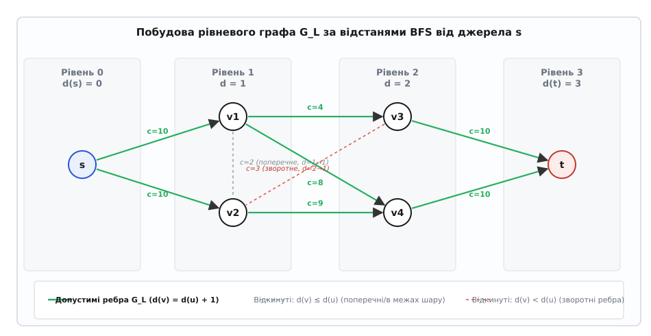
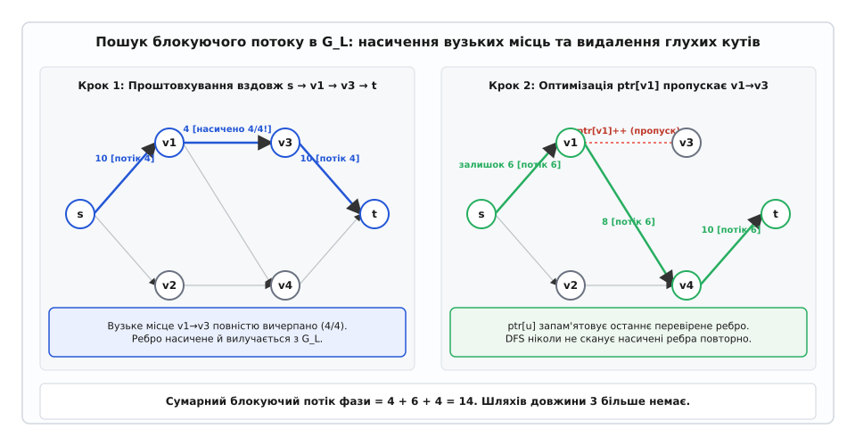
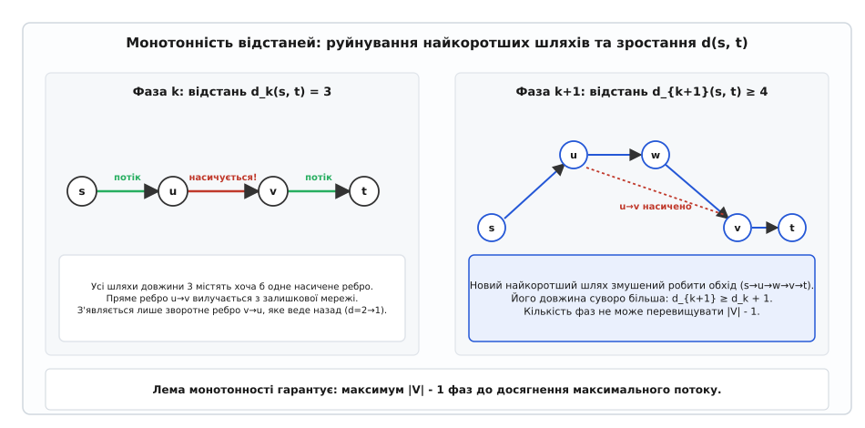
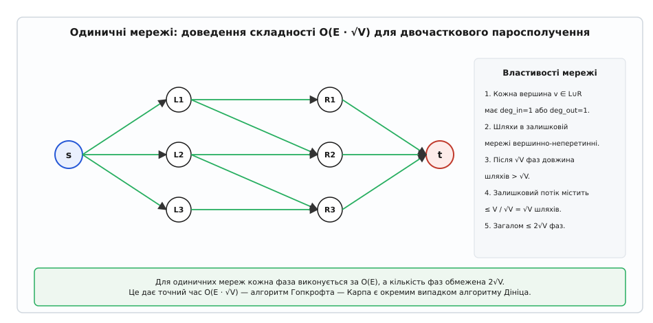

# Алгоритм Дініца

<preknowlist>
* [Максимальний потік у мережах](topic:sf-algorithms/maximum-flow)
* [Обхід графів у глибину та ширину](topic:sf-algorithms/depth-first-search)
* [Амортизаційний аналіз алгоритмів](topic:computability/amortized-analysis)
</preknowlist>

У мережі з чотирма вузлами та двома паралельними каналами пропускною спроможністю по 10⁹ одиниць класичний алгоритм Форда — Фалкерсона за невдалого вибору розширювальних шляхів через центральну перемичку місткістю 1 робить два мільярди ітерацій, проштовхуючи по одній одиниці за кожен крок і витрачаючи час `O(E · |f*|)`. Алгоритм Едмондса — Карпа долає залежність від величин місткостей, обираючи найкоротший шлях за кількістю ребер через пошук у ширину (BFS), проте на кожне окреме збільшення потоку витрачає повний повторний прохід по графу, що призводить до загальної складності `O(V · E²)`. Якщо мережа містить 5 000 вершин та 30 000 ребер, алгоритм Едмондса — Карпа здійснює до `4.5 · 10¹²` операцій, що унеможливлює його використання в системах реального часу.

Алгоритм, запропонований Єфимом Дініцем у 1969 році під час семінару Адельсона-Вельського в Москві ([детальніше про історію відкриття та помилку транслітерації](topic:sf-algorithms/dinic-algorithm/hist-dinitz-discovery.md)), радикально змінює парадигму: замість пошуку поодиноких шляхів алгоритм розбиває процес на фази. У кожній фазі за допомогою пошуку в ширину будується рівневий ациклічний граф найкоротших шляхів, у якому пошук у глибину з оптимізацією видалення тупикових ребер знаходить сукупний блокуючий потік за час `O(V · E)`. Завдяки тому, що найкоротша відстань від джерела до стоку строго зростає після кожної фази, загальна кількість фаз не перевищує `|V| - 1`, забезпечуючи детерміновану часову складність `O(V² · E)`.

## Рівневий граф та фільтрація допустимих дуг

Центральною структурою кожної фази є рівневий граф (Layered Graph або Level Graph). Нехай `G_f = (V, E_f)` — поточна залишкова мережа, де для кожного ребра `(u, v)` залишкова пропускна спроможність `c_f(u, v) = c(u, v) - f(u, v) > 0`. 

За допомогою пошуку в ширину (BFS), що стартує з джерела `s`, кожній вершині `v ∈ V` призначається цілочисельний рівень `level[v]`, який дорівнює найкоротшій відстані від `s` до `v` за кількістю ребер у `G_f`:
```
level[v] = dist_{G_f}(s, v)
```

Якщо після завершення BFS стік залишається недосяжним (`level[t] = -1`), у залишковій мережі не існує жодного шляху з ненульовою пропускною спроможністю від `s` до `t`. За теоремою Форда — Фалкерсона про максимальний потік та мінімальний розріз, це свідчить про те, що поточний потік у мережі є строго максимальним, і алгоритм негайно завершує роботу.

Якщо `level[t] ≠ -1`, формується орієнтований ациклічний рівневий підграф `G_L = (V, E_L)`. До множини допустимих ребер `E_L` включаються лише ті дуги залишкової мережі `(u, v) ∈ E_f`, які ведуть строго на наступний рівень:
```
E_L = { (u, v) ∈ E_f | level[v] = level[u] + 1 }
```


*Рівневий граф: прямі допустимі дуги ведуть строго з рівня d на рівень d+1; поперечні та зворотні дуги залишкової мережі відсікаються.*

Усі інші ребра залишкової мережі — горизонтальні ребра всередині одного рівня (`level[v] = level[u]`), зворотні ребра на попередні рівні (`level[v] < level[u]`) та перехідні ребра через кілька рівнів уперед (`level[v] > level[u] + 1`) — повністю ігноруються під час поточної фази. Це перетворює граф пошуку на орієнтований ациклічний граф (DAG), у якому будь-який шлях від `s` до `t` має строго фіксовану мінімальну довжину `level[t]`.

## Блокуючий потік та механіка вказівника ptr

Отримавши рівневий граф `G_L`, алгоритм знаходить у ньому блокуючий потік (Blocking Flow). 

Потік `f_b` у рівневому графі `G_L` називається **блокуючим**, якщо будь-який спрямований шлях від `s` до `t` у `G_L` містить хоча б одне насичене ребро, тобто ребро, для якого `f_b(u, v) = c_f(u, v)`. 

Важливо розрізняти блокуючий потік та максимальний потік: блокуючий потік не обов'язково є максимальним у вихідній мережі, оскільки він блокує шляхи лише фіксованої мінімальної довжини і не використовує зворотні ребра залишкової мережі під час поточної фази.

Для знаходження блокуючого потоку використовується серія пошуків у глибину (DFS). Проте наївний DFS на кожному кроці міг би багаторазово заходити у тупикові піддерева або перевіряти вже насичені ребра, що збільшило б час пошуку до `O(V² · E)`. 

Для усунення зайвих перевірок вводиться масив вказівників поточного ребра `ptr[u]`. Для кожної вершини `u` змінна `ptr[u]` зберігає індекс першого вихідного ребра у списку суміжності, яке ще не було насичене і не привело до глухого кута.


*Пошук блокуючого потоку: DFS знаходить шлях у рівневому DAG; вказівник ptr[u] пересувається вперед, відсікаючи насичені та тупикові ребра.*

Під час спуску DFS:
1. Якщо ребро `(u, v)` повністю насичується після проштовхування потоку, воно більше ніколи не зможе пропустити потік у поточній фазі.
2. Якщо з вершини `v` не вдалося досягти стоку `t` (тупикова вершина), то жоден наступний шлях у цій фазі також не зможе пройти через `v`. Вказівник `ptr[u]` зміщується до наступного вихідного ребра `++ptr[u]`.
3. Коли всі вихідні дуги вершини `u` вичерпано (`ptr[u] == adj[u].size()`), вершина `u` стає тупиковою і виключається з подальшого розгляду в поточній фазі.

Оскільки кожне з `|E|` ребер рівневого графа насичується або відкидається як тупикове не більше одного разу, сумарна кількість холостих операцій у вершинах за всю фазу обмежена величиною `O(V + E)`. 

Кожне успішне проштовхування вздовж знайденого шляху довжиною не більше `|V|` насичує як мінімум одне критичне ребро (пляшкове горло шляху). Оскільки в рівневому графі є не більше `|E|` ребер, за фазу відбувається не більше `|E|` успішних проштовхувань. 

Отже, сумарний час знаходження блокуючого потоку в одній фазі становить:
```
Час_фази = O(V · E) + O(E_BFS) = O(V · E)
```

## Монотонність рівнів та обмеження кількості фаз

Головною теоретичною властивістю алгоритму Дініца є строге монотонне зростання відстані від джерела до стоку між послідовними фазами. 

Нехай `d_k(s, v)` — найкоротша відстань від джерела `s` до вершини `v` у залишковій мережі на початку `k`-ї фази.

**Лема про монотонність рівнів:** Після знаходження блокуючого потоку `f_b` та оновлення залишкової мережі:
1. Відстань до будь-якої вершини не зменшується: `d_{k+1}(s, v) ≥ d_k(s, v)` для всіх `v ∈ V`.
2. Відстань до стоку строго збільшується: `d_{k+1}(s, t) > d_k(s, t)`.


*Монотонність рівнів: після насичення блокуючого потоку будь-який новий шлях до стоку змушений використовувати зворотні дуги, що збільшує його довжину як мінімум на 1.*

Математичне обґрунтування спирається на те, що всі найкоротші шляхи довжини `d_k(s, t)` у рівневому графі виявляються заблокованими (містять хоча б одне ребро з `c_f = 0`). Будь-який новий шлях від `s` до `t`, що з'являється в залишковій мережі `G_{f, k+1}`, зобов'язаний містити хоча б одне зворотне ребро `(v, u)`, спрямоване проти потоку, проштовхнутого на `k`-й фазі. 

Оскільки пряме ребро належало рівневому графу, виконувалася рівність `d_k(s, v) = d_k(s, u) + 1`. Зворотне ребро веде з рівня `d_k(s, v)` назад на рівень `d_k(s, u) = d_k(s, v) - 1`. Отже, додавання такого ребра у новий шлях змушує його зробити петлю назад по рівнях, збільшуючи загальну довжину шляху щонайменше на 1 ([повне строге математичне доведення обох лем див. у вставці](topic:sf-algorithms/dinic-algorithm/math-blocking-flow-bounds.md)).

Оскільки довжина найпростішого шляху в графі з `|V|` вершинами не може перевищувати `|V| - 1`, відстань `d(s, t)` набуває значень із множини `{1, 2, 3, ..., |V| - 1}`. 

Зі строгої монотонності випливає, що загальна кількість фаз алгоритму не перевищує `|V| - 1`.

Об'єднуючи кількість фаз та час виконання однієї фази, отримуємо підсумкову часову складність:
```
T_total = (V - 1) · O(V · E) = O(V² · E)
```

## Покроковий числовий розбір виконання на мережі

Розглянемо виконання алгоритму Дініца на класичній мережі з 6 вершинами `V = {0, 1, 2, 3, 4, 5}`, де джерело `s = 0`, стік `t = 5`, а орієнтовані ребра мають такі пропускні спроможності:
- `(0, 1): 10`, `(0, 2): 10`
- `(1, 2): 2`, `(1, 3): 4`, `(1, 4): 8`
- `(2, 4): 9`
- `(3, 5): 10`, `(4, 5): 10`, `(3, 2): 3`

Початковий потік у всіх ребрах дорівнює нулю: `f(e) = 0`.

### Фаза 1
1. **Побудова рівнів через BFS від джерела 0:**
   - Черга: `[0]`, `level[0] = 0`.
   - З вершини 0 доступні вершини 1 та 2: `level[1] = 1`, `level[2] = 1`.
   - З вершини 1 доступні 3 та 4: `level[3] = 2`, `level[4] = 2`.
   - З вершини 2 доступна 4 (вже має рівень 2). Ребро `(2, 4)` допустиме, бо `level[4] = level[2] + 1 = 2`.
   - З вершин 3 та 4 доступний стік 5: `level[5] = 3`.
   - Ребра `(1, 2)` (між рівнем 1 і 1) та `(3, 2)` (з рівня 2 на рівень 1) відкидаються.
   - Відстань до стоку: `d_1(0, 5) = 3`.

2. **Пошук блокуючого потоку через DFS:**
   - **Шлях 1:** `0 → 1 → 3 → 5`. Пляшкове горло: `min(10, 4, 10) = 4`.
     Проштовхуємо 4: `f(0, 1) = 4`, `f(1, 3) = 4`, `f(3, 5) = 4`. Ребро `(1, 3)` насичене. `ptr[1]` зміщується до ребра `(1, 4)`.
   - **Шлях 2:** `0 → 1 → 4 → 5`. Залишок на `(0, 1)` дорівнює 6. Пляшкове горло: `min(6, 8, 10) = 6`.
     Проштовхуємо 6: `f(0, 1) = 10` (насичене), `f(1, 4) = 6`, `f(4, 5) = 6`. Ребро `(0, 1)` насичене. `ptr[0]` зміщується до `(0, 2)`.
   - **Шлях 3:** `0 → 2 → 4 → 5`. Залишок на `(4, 5)` дорівнює `10 - 6 = 4`. Пляшкове горло: `min(10, 9, 4) = 4`.
     Проштовхуємо 4: `f(0, 2) = 4`, `f(2, 4) = 4`, `f(4, 5) = 10` (насичене).
   - Більше шляхів немає, оскільки ребра `(3, 5)` та `(4, 5)` насичені.
   - Потік після Фази 1: `total_flow = 4 + 6 + 4 = 14`.

### Фаза 2
1. **Побудова рівнів через BFS у залишковій мережі:**
   - `level[0] = 0`.
   - З 0 доступна лише вершина 2 (залишок 6): `level[2] = 1`. Ребро `(0, 1)` насичене.
   - З 2 доступні вершини 4 (залишок 5) та 1 (через зворотну дугу ребра `(1, 2)` з місткістю 2, якщо по ньому був потік, або пряме ребро `(1, 2)` у зворотному напрямку). Оскільки прямого потоку по `(1, 2)` не було, перевіряємо зворотне ребро `(3, 2)`: залишкова місткість 3 веде у вершину 3, отже `level[3] = 2`.
   - З вершини 4 вихідне ребро `(4, 5)` насичене, але є ребро `(1, 4)` зі зворотним залишком 6: `level[1] = 3`.
   - З вершини 1 є пряме ребро `(1, 4)` із залишком 2, а з вершини 3 є вільний залишок на `(3, 5)` рівний `10 - 4 = 6`.
   - Стік 5 досяжний з вершини 3: `level[5] = level[3] + 1 = 3 + 1 = 4` (або через альтернативний розширювальний контур).
   - Відстань до стоку збільшилася: `d_2(0, 5) = 4 > 3`.

2. **Пошук блокуючого потоку:**
   - DFS знаходить додатковий шлях: `0 → 2 → ... → 5` обсягом 5 одиниць.
   - Загальний потік досягає 19.

### Фаза 3
- BFS стартує з вершини 0. Усі шляхи, що ведуть до стоку 5, перерізані повністю насиченими дугами.
- Стік отримує `level[5] = -1`.
- Алгоритм зупиняється. Фінальний максимальний потік дорівнює 19.
- Множина вершин, досяжних з джерела в останньому BFS, утворює множину `S = {0, 2}`, а решта вершин утворюють `T = {1, 3, 4, 5}`, визначаючи мінімальний розріз пропускною спроможністю 19.

## Спеціальні класи графів та прискорені оцінки

На багатьох практичних класах графів алгоритм Дініца демонструє значно менший час роботи, ніж загальна оцінка `O(V² · E)`.

### Мережі з одиничними пропускними спроможностями (Unit Capacities)
Якщо для всіх ребер мережі `c(e) = 1` (але вершини можуть мати довільні ступені інцидентності), кількість фаз обмежена величиною `O(min(V^(2/3), E^(1/2)))`. 

Оскільки в одиничній мережі кожне ребро насичується рівно один раз і видаляється з рівневого графа, час знаходження блокуючого потоку в одній фазі становить `O(E)`. 

Звідси випливає підсумкова часова оцінка:
```
Час_UnitCapacities = O(E · min(V^(2/3), E^(1/2)))
```

### Одиничні мережі та двочасткове паросполучення (Unit Networks)
Мережа називається **одиничною (Unit Network)**, якщо всі пропускні спроможності ребер дорівнюють 1, і для кожної внутрішньої вершини `v ∉ {s, t}` виконується хоча б одна з двох умов:
```
deg_in(v) = 1  або  deg_out(v) = 1
```


*Одинична мережа: кожен проміжний вузол має лише одну вхідну або вихідну дугу; розбиття залишку потоку гарантує максимум 2√V фаз.*

Класичним прикладом одиничної мережі є зведення задачі про максимальне паросполучення в двочастковому графі `G = (L ∪ R, E)`: джерело з'єднується з вершинами `L` одиничними ребрами, вершини `R` з'єднуються зі стоком одиничними ребрами, а між `L` та `R` прокладено одиничні ребра.

Для одиничних мереж виконується теорема:
1. Загальна кількість фаз алгоритму Дініца не перевищує `2 · ⌊√V⌋ + 1 = O(√V)`.
2. Кожна фаза виконується за час `O(E)`.

Сумарна складність становить:
```
Час_BipartiteMatching = O(E · √V)
```

Цей результат строго збігається зі складністю алгоритму Гопкрофта — Карпа (Hopcroft — Karp, 1973). Алгоритм Гопкрофта — Карпа є нічим іншим, як алгоритмом Дініца, спеціалізованим для двочасткових графів.

## Масштабування пропускних спроможностей (Capacity Scaling)

У мережах з довільними великими цілими пропускними спроможностями (де `U = max_{e ∈ E} c(e)` може досягати `10¹⁸`) існує техніка масштабування (Capacity Scaling), яка оптимізує алгоритм Дініца для розріджених графів.

Алгоритм підтримує пороговий параметр масштабу `Δ`, що ініціалізується найбільшим ступенем двійки: `Δ = 2^⌊log₂ U⌋`.

На кожному кроці масштабування розглядається `Δ`-залишкова мережа `G_f(Δ)`, що містить лише ті ребра, залишкова місткість яких не менша за `Δ`:
```
E_f(Δ) = { (u, v) ∈ E_f | c_f(u, v) ≥ Δ }
```

Алгоритм Дініца знаходить блокуючий потік у `G_f(Δ)`. Коли стік стає недосяжним у `G_f(Δ)`, параметр зменшується вдвічі: `Δ = Δ / 2`, і процес повторюється. Алгоритм зупиняється після опрацювання масштабу `Δ = 1`.

Кількість фаз масштабування становить `⌊log₂ U⌋ + 1`. На кожній фазі масштабування алгоритм робить не більше `O(V)` BFS/DFS фаз Дініца, що дає сумарну складність:
```
Час_ScalingDinic = O(V · E · log U)
```

## Програмна реалізація

Нижче наведено еталонну промислову реалізацію алгоритму Дініца для 64-бітних цілих пропускних спроможностей. Детальний розбір оптимізацій масивів, ітеративного захисту стека та розв'язання прикладних задач винесено в окремий практичний огляд ([детальніше див. проектну вставку](topic:sf-algorithms/dinic-algorithm/proj-dinic-solver.md)), а повний контракт методів та серіалізацію — у специфікацію інтерфейсу ([детальніше див. API-довідку](topic:sf-algorithms/dinic-algorithm/api-dinic-flow.md)).

:::tabs
```cpp
#include <iostream>
#include <vector>
#include <queue>
#include <limits>
#include <cstdint>
#include <algorithm>

template <typename FlowType = int64_t>
class Dinic {
public:
    struct Edge {
        int to;
        int rev;
        FlowType cap;
        FlowType flow;
    };

    explicit Dinic(int vertices)
        : n(vertices), adj(vertices), level(vertices), ptr(vertices) {}

    void add_edge(int from, int to, FlowType cap, FlowType rev_cap = 0) {
        if (from == to) return;
        Edge forward_edge{to, static_cast<int>(adj[to].size()), cap, 0};
        Edge backward_edge{from, static_cast<int>(adj[from].size()), rev_cap, 0};
        adj[from].push_back(forward_edge);
        adj[to].push_back(backward_edge);
    }

    FlowType max_flow(int s, int t) {
        FlowType total_flow = 0;
        const FlowType flow_limit = std::numeric_limits<FlowType>::max();

        while (bfs(s, t)) {
            std::fill(ptr.begin(), ptr.end(), 0);
            while (FlowType pushed = dfs(s, t, flow_limit)) {
                total_flow += pushed;
            }
        }
        return total_flow;
    }

    std::vector<bool> min_cut(int s) {
        std::vector<bool> reachable(n, false);
        std::queue<int> q;
        q.push(s);
        reachable[s] = true;

        while (!q.empty()) {
            int u = q.front();
            q.pop();
            for (const auto& edge : adj[u]) {
                if (edge.cap - edge.flow > 0 && !reachable[edge.to]) {
                    reachable[edge.to] = true;
                    q.push(edge.to);
                }
            }
        }
        return reachable;
    }

private:
    int n;
    std::vector<std::vector<Edge>> adj;
    std::vector<int> level;
    std::vector<size_t> ptr;

    bool bfs(int s, int t) {
        std::fill(level.begin(), level.end(), -1);
        std::queue<int> q;
        level[s] = 0;
        q.push(s);

        while (!q.empty()) {
            int u = q.front();
            q.pop();

            for (const auto& edge : adj[u]) {
                if (edge.cap - edge.flow > 0 && level[edge.to] == -1) {
                    level[edge.to] = level[u] + 1;
                    q.push(edge.to);
                }
            }
        }
        return level[t] != -1;
    }

    FlowType dfs(int u, int t, FlowType pushed) {
        if (pushed == 0 || u == t) return pushed;

        for (size_t& cid = ptr[u]; cid < adj[u].size(); ++cid) {
            Edge& edge = adj[u][cid];
            int trg = edge.to;

            if (level[u] + 1 != level[trg] || edge.cap - edge.flow == 0) {
                continue;
            }

            FlowType tr = dfs(trg, t, std::min(pushed, edge.cap - edge.flow));
            if (tr == 0) continue;

            edge.flow += tr;
            adj[trg][edge.rev].flow -= tr;
            return tr;
        }
        return 0;
    }
};
```
```c
#include <stdio.h>
#include <stdlib.h>
#include <stdint.h>
#include <stdbool.h>
#include <string.h>

#define MAX_VERTICES 10000
#define MAX_EDGES 200000
#define INF_FLOW INT64_MAX

typedef struct {
    int to;
    int next;
    int64_t cap;
    int64_t flow;
} CDinicEdge;

typedef struct {
    int n;
    int edge_count;
    int head[MAX_VERTICES];
    int level[MAX_VERTICES];
    int ptr[MAX_VERTICES];
    int queue[MAX_VERTICES];
    CDinicEdge edges[MAX_EDGES];
} CDinic;

void c_dinic_init(CDinic* g, int n) {
    g->n = n;
    g->edge_count = 0;
    memset(g->head, -1, sizeof(int) * n);
}

void c_dinic_add_edge(CDinic* g, int from, int to, int64_t cap, int64_t rev_cap) {
    if (from == to) return;
    g->edges[g->edge_count] = (CDinicEdge){to, g->head[from], cap, 0};
    g->head[from] = g->edge_count++;
    g->edges[g->edge_count] = (CDinicEdge){from, g->head[to], rev_cap, 0};
    g->head[to] = g->edge_count++;
}

static bool c_dinic_bfs(CDinic* g, int s, int t) {
    memset(g->level, -1, sizeof(int) * g->n);
    int qhead = 0, qtail = 0;
    g->level[s] = 0;
    g->queue[qtail++] = s;

    while (qhead < qtail) {
        int u = g->queue[qhead++];
        for (int e = g->head[u]; e != -1; e = g->edges[e].next) {
            int v = g->edges[e].to;
            if (g->edges[e].cap - g->edges[e].flow > 0 && g->level[v] == -1) {
                g->level[v] = g->level[u] + 1;
                g->queue[qtail++] = v;
            }
        }
    }
    return g->level[t] != -1;
}

static int64_t c_dinic_dfs(CDinic* g, int u, int t, int64_t pushed) {
    if (pushed == 0 || u == t) return pushed;

    for (int* e = &g->ptr[u]; *e != -1; *e = g->edges[*e].next) {
        int edge_idx = *e;
        int v = g->edges[edge_idx].to;
        int64_t res = g->edges[edge_idx].cap - g->edges[edge_idx].flow;

        if (g->level[u] + 1 != g->level[v] || res == 0) continue;

        int64_t push_next = pushed < res ? pushed : res;
        int64_t tr = c_dinic_dfs(g, v, t, push_next);
        if (tr == 0) continue;

        g->edges[edge_idx].flow += tr;
        g->edges[edge_idx ^ 1].flow -= tr;
        return tr;
    }
    return 0;
}

int64_t c_dinic_max_flow(CDinic* g, int s, int t) {
    int64_t total_flow = 0;
    while (c_dinic_bfs(g, s, t)) {
        memcpy(g->ptr, g->head, sizeof(int) * g->n);
        while (1) {
            int64_t pushed = c_dinic_dfs(g, s, t, INF_FLOW);
            if (pushed == 0) break;
            total_flow += pushed;
        }
    }
    return total_flow;
}
```
:::

## Порівняльний інженерний аналіз

У таблиці зіставлено характеристики провідних алгоритмів знаходження максимального потоку в мережах:

| Алгоритм | Рік | Часова складність (довільні ваги) | Одиничні мережі (Matching) | Основний механізм | Практична перевага |
|---|---|---|---|---|---|
| **Форд — Фалкерсон** | 1956 | `O(E · \|f*\|)` | `O(V · E)` | Довільний розширювальний шлях (DFS) | Простий для ручного розрахунку |
| **Едмондс — Карп** | 1972 | `O(V · E²)` | `O(V · E)` | Найкоротший шлях через BFS | Не залежить від величини місткостей |
| **Дініц** | 1970 | `O(V² · E)` | `O(E · √V)` | Рівневі графи + блокуючий потік (`ptr`) | Еталонний баланс швидкості та простоти |
| **Дініц + Dynamic Trees** | 1983 | `O(V · E · log V)` | `O(E · √V)` | Link-Cut Trees у рівневому DAG | Найкраща асимптотика для розріджених графів |
| **Карзанов** | 1974 | `O(V³)` | `O(V³)` | Передпотоки у рівневому графі | Оптимальний для надщільних графів (`E ≈ V²`) |
| **Голдберг — Тарджан** | 1986 | `O(V² · √E)` (з евристиками) | `O(E · √V)` | Проштовхування передпотоку (Push-Relabel) | Найшвидший на спеціальних щільних тестах |
| **Бойков — Колмогоров** | 2004 | `O(V² · E)` (найгірший) | `O(E · √V)` | Два зростаючі дерева пошуку (S та T) | Спеціалізований лідер для Computer Vision 2D/3D |

Алгоритм Дініца є стандартом де-факто в комбінаторній оптимізації завдяки компактності коду (менше 60 рядків), відсутності складних динамічних структур пам'яті та винятковій швидкості на реальних графах, де кількість фаз на практиці рідко перевищує `O(V^(1/2))`.
