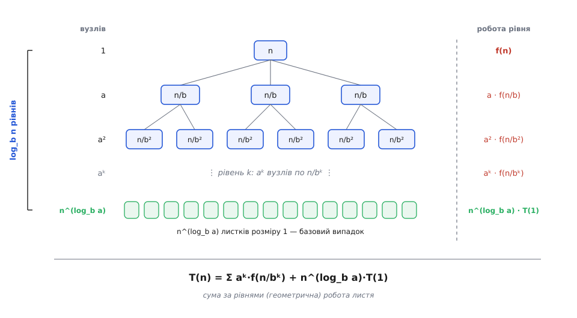
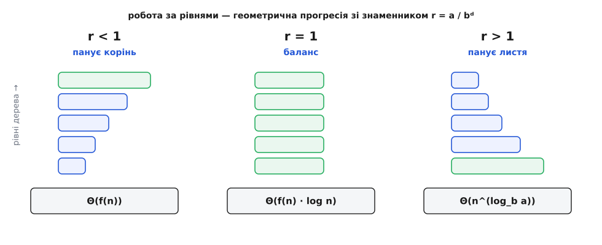
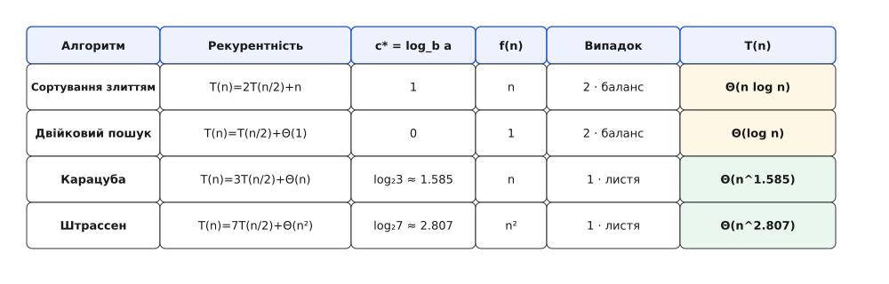

# 🧮 Математика вартості поділу

Дерево рекурсії для сортування злиттям можна скласти руками: намалював рівні, порахував роботу на кожному, перемножив. Але щоразу малювати руками — не діло. Потрібна машинка, у яку заклав три числа поділу й дістав відповідь: куди сходить вартість. Ця машинка є, зветься **майстер-теоремою**, і вся вона виростає з однієї-єдиної суми — суми **геометричної прогресії**. Далі — про те, звідки береться та сума, чому в неї рівно три режими, і чому кожен режим — це окремий випадок теореми. А наприкінці окремо: чому поділ дає не просто швидку, а ще й **правильну** відповідь.

## Що саме ми оцінюємо

Вартість будь-якого поділу пишеться одним рядком — **рекурентністю** (рівнянням, де вартість задачі виражена через вартість її ж менших копій):

```
T(n) = a · T(n/b) + f(n)
```

Три величини, і кожна каже своє про будову поділу.

```
a     — на скільки підзадач розпадається задача (скільки гілок росте з вузла)
b     — у скільки разів кожна підзадача менша за батьківську (крок здрібнення)
f(n)  — робота НЕ на рекурсію: сам поділ на частини плюс зліплювання розв'язків
```

Наголосимо на різниці між `a` і `b`, бо в ній вся суть. `b` каже, як швидко **розмір** тане: за `b = 2` кожен крок ділить навпіл. `a` каже, скільки **штук** цього меншого розміру доводиться розв'язувати. Ці два числа не зобов'язані збігатися, і саме їхнє **суперництво** вирішує все. Сортування злиттям ділить навпіл (`b = 2`) і бере **обидві** половини (`a = 2`) — розмір і кількість тягнуть у різні боки нарівні. [Двійковий пошук](topic:sf-algorithms/binary-search) теж ділить навпіл (`b = 2`), але одну половину викидає й лізе лише в другу (`a = 1`) — тут кількість не росте зовсім. Множення Карацуби ділить навпіл (`b = 2`), а підзадач бере аж **три** (`a = 3`) — кількість переганяє здрібнення. Три різні долі вартості, і всі три випливуть із того самого рівняння.

Останній доданок, `f(n)`, — це ціна одного вузла за вирахуванням дітей: скільки коштує розрубати цей шматок і потім склеїти відповіді його підзадач. Для сортування злиттям `f(n) = n` (лінійне злиття), для двійкового пошуку `f(n)` стала (одне порівняння з серединою), для множення `f(n) = n` (додавання проміжних добутків), для перемноження матриць `f(n) = n²` (додавання блоків). Уся боротьба точитиметься між цим `f(n)` і тим, що набігає з листя дерева, — тож перше, що треба навчитися рахувати, це листя.

Щоб говорити про «росте як» без зайвого педантизму, вживаємо [асимптотичні позначення](topic:computability/asymptotic-complexity): `Θ(g)` — росте точно як `g` (і згори, і знизу), `O(g)` — не швидше за `g`, `Ω(g)` — не повільніше. Рекурентність дає точний рахунок; майстер-теорема стисне його в одне `Θ`.

## Дерево рекурсії, тепер строго

Розгорнемо рекурентність у дерево — але цього разу не для конкретного прикладу, а в буквах, щоб рахунок годився для будь-яких `a`, `b`, `f`. Корінь — задача розміру `n`. З нього росте `a` дітей, кожна розміру `n/b`. З кожної дитини — знову `a` онуків розміру `n/b²`. Спускаймося й записуймо, що діється на рівні з номером `k` (корінь — рівень 0).

```
рівень k:   вузлів  aᵏ      кожен розміру  n/bᵏ
```

Кількість вузлів множиться на `a` з кожним кроком униз (`a⁰, a¹, a², …`), а розмір ділиться на `b` (`n, n/b, n/b², …`). Обидві прогресії геометричні — одна росте, друга спадає. Скільки ж усього рівнів? Спуск триває, поки розмір не впаде до одиниці:

```
n / bᴸ = 1   ⟹   bᴸ = n   ⟹   L = log_b n
```

Глибина дерева — [логарифм `n` за основою `b`](topic:math-information/binary-logarithm): рівно стільки разів `n` ділиться на `b`, поки лишиться одиниця. За `b = 2` це знайомий двійковий логарифм; за іншого `b` — той самий логарифм, тільки основа інша.


*Рекурентність, розгорнута в дерево. На рівні k сидить aᵏ вузлів, кожен розміру n/bᵏ, тож робота рівня (без рекурсії) — aᵏ·f(n/bᵏ). Глибина — log_b n. Дно дерева — n^(log_b a) листків: саме стільки базових задач доводиться розв'язати прямо.*

Тепер найважливіший рахунок усієї теми — **скільки листків** унизу. Листки — це вузли найнижчого рівня `L`, а вузлів там `aᴸ`:

```
листків = aᴸ = a^(log_b n)
```

Цей вираз незручний: показник — логарифм. Перепишемо його в чистіший вигляд. Візьмімо логарифм за основою `b` від обох боків рівності `листків = a^(log_b n)`:

```
log_b(листків) = (log_b n) · (log_b a)     — винесли показник наперед логарифма
```

Права частина симетрична: добуток `log_b n` на `log_b a` не змінюється, як їх місцями не переставляй. А `(log_b a)·(log_b n)` — це рівно `log_b(n^(log_b a))`. Отже логарифми рівні, отже рівні й самі числа:

```
листків = a^(log_b n) = n^(log_b a)
```

Ця тотожність — серце всього. Показник `log_b a` з'являтиметься так часто, що дамо йому ім'я: **критичний показник** (позначмо `c* = log_b a`). Він каже, як швидко росте кількість листя від розміру входу, — а листя, як зараз побачимо, часто й визначає всю вартість. Порахуймо його для наших прикладів:

```
сортування злиттям:  c* = log₂ 2 = 1        листків ≈ n
двійковий пошук:     c* = log₂ 1 = 0        листків ≈ n⁰ = 1
Карацуба:            c* = log₂ 3 ≈ 1.585    листків ≈ n^1.585
Штрассен:            c* = log₂ 7 ≈ 2.807    листків ≈ n^2.807
```

Один викинутий множник (`a = 1` у двійковому пошуку) — і листя всього одне: жодного розгалуження, стовбур без крони. Одна зайва гілка (`a = 3` замість двох у Карацуби) — і листя вже не `n`, а `n^1.585`. Критичний показник надзвичайно чутливий до `a`: він логарифм від нього.

## Сума за рівнями — і геометрична прогресія

Загальна вартість — це сума роботи всіх вузлів. Згрупуймо її за рівнями: на рівні `k` сидить `aᵏ` вузлів, кожен коштує `f(n/bᵏ)` (без рекурсії), тож рівень дає `aᵏ · f(n/bᵏ)`. Складімо всі рівні:

```
T(n) = Σ (k від 0 до L−1)  aᵏ · f(n/bᵏ)   +   n^(log_b a) · T(1)
             └──── робота внутрішніх вузлів ────┘     └─ робота листя ─┘
```

Щоб побачити, що це за сума, підставмо найтиповіший вигляд роботи — степеневий, `f(n) = nᵈ` (для злиття `d = 1`, для матриць `d = 2`, для сталої роботи `d = 0`). Тоді доданок рівня `k` розкладається так:

```
aᵏ · f(n/bᵏ) = aᵏ · (n/bᵏ)ᵈ = nᵈ · aᵏ/bᵏᵈ = nᵈ · (a/bᵈ)ᵏ = f(n) · rᵏ,   де  r = a/bᵈ
```

І ось воно: вартість рівнів — **геометрична прогресія** зі знаменником `r = a/bᵈ`. Кожен наступний рівень у `r` разів «важчий» (чи легший) за попередній. Уся доля вартості залежить від одного числа — більше `r` за одиницю, менше чи рівно.

Придивімося, що таке `r`. У чисельнику `a` — як швидко множиться **кількість** вузлів. У знаменнику `bᵈ` — як швидко тане **робота одного вузла** (розмір падає в `b`, а робота від розміру — степінь `d`). `r` — це перегони між ними:

```
r > 1   кількість вузлів росте швидше, ніж дешевшає вузол → важчає донизу → панує листя
r = 1   кількість і здешевлення врівноважені → усі рівні коштують однаково → баланс
r < 1   вузол дешевшає швидше, ніж множаться вузли → легшає донизу → панує корінь
```

І — краса — ці три режими `r` це рівно порівняння критичного показника `c* = log_b a` з показником роботи `d`. Бо `r = a/bᵈ`, і

```
r > 1  ⟺  a > bᵈ  ⟺  log_b a > d  ⟺  c* > d     (листя переважує f)
r = 1  ⟺  a = bᵈ  ⟺  c* = d                      (нічия)
r < 1  ⟺  a < bᵈ  ⟺  c* < d                      (f переважує листя)
```

Тобто питання «хто панує» — це буквально питання «що більше: критичний показник `c*` чи показник роботи `d`». Порівняв два числа — і знаєш долю. Лишилося довести, що сума прогресії справді поводиться, як обіцяно в кожному режимі. Для цього потрібна сама формула суми.

## Звідки береться сума прогресії

Сума `S = 1 + r + r² + … + rᵐ` рахується одним старим трюком. Помножмо всю суму на `r` — кожен доданок зсунеться на місце вправо:

```
S   =  1 + r + r² + … + rᵐ
r·S =      r + r² + … + rᵐ + r^(m+1)
```

Відняньмо перший рядок від другого. Усе всередині взаємно знищиться — лишаться тільки крайні:

```
r·S − S = r^(m+1) − 1
S·(r − 1) = r^(m+1) − 1
S = (r^(m+1) − 1) / (r − 1)          (для r ≠ 1)
```

Тепер прочитаймо цю формулу в трьох режимах — і кожен дасть свій випадок майстер-теореми.

**Знаменник `r < 1` (панує корінь).** Тоді `rᵐ` з ростом `m` тане до нуля, і сума не розбігається, хоч скільки доданків додавай — вона обмежена зверху сталою:

```
S = 1 + r + r² + … < 1/(1 − r) = стала
```

Отже вся вартість рівнів — це `f(n) · S = Θ(f(n))`: перший доданок (робота кореня) з точністю до сталого множника з'їдає всю решту. Спускаючись деревом, ми щоразу робимо дедалі менше, тож основний тягар — угорі. Листя тут дрібне (`c* < d`, листя росте повільніше за `f`) і в підсумок не втручається.

**Знаменник `r = 1` (баланс).** Формула ділення на нуль тут не годиться, але сума й без неї очевидна: `L` доданків, кожен дорівнює `1`. Отже `S = L = log_b n`, і вартість — `f(n) · log_b n`. Кожен рівень коштує однаково — по `f(n)`, — а рівнів `log_b n`, звідси й логарифмічний множник. Класика: сортування злиттям, де на кожному з `log₂n` рівнів зливається в сумі `n` елементів.

**Знаменник `r > 1` (панує листя).** Тепер `rᵐ` вибухає, і в сумі `(r^(m+1) − 1)/(r − 1)` заправляє останній, найбільший доданок — робота найнижчого рівня. Візьмімо повну висоту `m = L = log_b n` і подивімося, чому дорівнює цей вершечок:

```
f(n) · rᴸ = nᵈ · (a/bᵈ)ᴸ = nᵈ · aᴸ / (bᴸ)ᵈ = nᵈ · aᴸ / nᵈ = aᴸ = n^(log_b a)
```

Розмірний множник `nᵈ` скоротився начисто, і лишилося рівно число листків, `n^(log_b a)`. Тобто коли `r > 1`, вартість збирає **дно** дерева: `T(n) = Θ(n^(log_b a))`. Незліченні дрібні листки внизу переважують усе, що робиться вгорі. Саме сюди потрапляють і Карацуба, і Штрассен — їхня вартість це вартість їхнього листя.

Три режими прогресії — три долі вартості. Більше нічого рахувати не треба: усе вже пораховано, лишилось назвати.


*Чому випадків рівно три. Робота за рівнями — геометрична прогресія зі знаменником r = a/bᵈ. r<1: рівні легшають донизу, сума впирається в корінь. r=1: усі рівні рівні, набігає множник log n. r>1: рівні важчають донизу, сума впирається в листя. Порівняти c*=log_b a з показником роботи d — і знаєш, який це режим.*

## Майстер-теорема

Тепер назвемо три режими їхніми іменами. Порівнюємо роботу `f(n)` з листяним показником `n^(log_b a)` — і читаємо відповідь. (Спосіб уперше виклали Джон Бентлі, Доротея Блостейн — тоді Гакен — і Джеймс Сакс 1980 року як «загальний метод для рекурентностей поділу»; назву «майстер-теорема» закріпив популярний підручник Кормена, Лейзерсона, Рівеста й Стайна — доказовий статус: усталений результат.)

**Випадок 1 — панує листя.** Якщо `f(n)` росте **строго повільніше** за листя, тобто `f(n) = O(n^(log_b a − ε))` для якогось `ε > 0`, то

```
T(n) = Θ(n^(log_b a))
```

Дно дерева переважує все. Це наш режим `r > 1`.

**Випадок 2 — баланс.** Якщо `f(n)` росте **точно як** листя, `f(n) = Θ(n^(log_b a))`, то додається логарифмічний множник:

```
T(n) = Θ(n^(log_b a) · log n)
```

Це режим `r = 1`. (Ширша форма: якщо `f(n) = Θ(n^(log_b a) · logᵏn)`, то `T(n) = Θ(n^(log_b a) · log^(k+1) n)` — зайвий логарифм у роботі стає ще одним логарифмом у відповіді.)

**Випадок 3 — панує корінь.** Якщо `f(n)` росте **строго швидше** за листя, `f(n) = Ω(n^(log_b a + ε))`, **і** до того ж виконано умову регулярності `a·f(n/b) ≤ c·f(n)` для якогось `c < 1` при великих `n`, то

```
T(n) = Θ(f(n))
```

Заправляє корінь. Це режим `r < 1`.

Дві тонкощі, які легко проґавити. Перша — чому в перших двох випадках стоїть той дивний **`ε`-зазор** («строго повільніше», «строго швидше»). Бо порівняння степенів має бути з запасом на цілий множник `n^ε`, а не абияк. Між випадками лишаються шпарини: функція `f(n) = n^(log_b a) / log n` росте повільніше за листя, але **не** на множник `n^ε` — вона застрягла між випадками 1 і 2, і майстер-теорема на неї не відповідає. Так само `f(n) = n^(log_b a)·log n` зависає між 2 і 3 (хоч його й ловить ширша форма випадку 2). Майстер-теорема — не всесильний оракул, а рецепт для степеневого `f`; для щілин між випадками є важчий інструмент — теорема Акри-Баззі, що бере й нерівні поділи, і підлоги-стелі `⌊n/b⌋`.

Друга тонкість — **умова регулярності** у випадку 3. Здавалося б, досить `f` рости швидше за листя. Але степеневе порівняння дивиться на межу, а нам треба, щоб робота **справді** спадала донизу деревом на кожному кроці — інакше сума не збіжиться до кореня. Умова `a·f(n/b) ≤ c·f(n)`, `c < 1`, це буквально й вимагає: робота всього наступного рівня (`a` копій по `f(n/b)`) — це стала частка `c < 1` роботи поточного. Тобто прогресія й справді геометрично спадна (`r < 1` мовою степенів). Для звичайних `f` вона виконується сама собою; вигадані патологічні `f` можуть її зламати — тоді випадок 3 не діє.

Байдуже, чи `n` — точний степінь `b`. Підлоги й стелі (`⌈n/b⌉`) змінюють проміжні розміри лише на одиницю й не зачіпають асимптотику; строго це доводить та ж Акра-Баззі. Тож рахуємо так, ніби ділиться націло.

## Покрокові виведення

Тепер прогін через рецепт — чотири класичні алгоритми, кожен окремим випадком.

**Сортування злиттям.** Ділимо навпіл, беремо обидві половини, зливаємо лінійно:

```
T(n) = 2·T(n/2) + n
a = 2,  b = 2,  f(n) = n = n¹
c* = log₂ 2 = 1  →  листя ~ n¹
f(n) = n¹ = n^c*   →  Випадок 2 (баланс, r = 1)
T(n) = Θ(n^1 · log n) = Θ(n · log n)
```

Робота на кожному з `log₂n` рівнів однакова (`n`), звідки й `n·log n`. Той самий результат дала й пряма сума з дерева — рецепт лише зробив його механічним.

**Двійковий пошук.** Половину відкидаємо, ліземо в одну, робота — одне порівняння:

```
T(n) = 1·T(n/2) + Θ(1)
a = 1,  b = 2,  f(n) = 1 = n⁰
c* = log₂ 1 = 0  →  листя ~ n⁰ = 1
f(n) = n⁰ = n^c*   →  Випадок 2 (баланс)
T(n) = Θ(n⁰ · log n) = Θ(log n)
```

Дерево тут виродилося в стовбур без гілок (`a = 1`): один вузол на рівні, рівнів `log₂n`, робота стала — звідси чистий `log n`.

**Множення Карацуби.** Довге число розбивають на старшу й молодшу половини цифр. Шкільний спосіб для добутку двох таких чисел потребує **чотирьох** перемножень половинок (старша·старша, старша·молодша, молодша·старша, молодша·молодша). Карацуба помітив, що середні два потрібні лише в сумі, а цю суму можна дістати одним зайвим множенням `(старша+молодша)·(старша+молодша)` і двома відніманнями — разом **три** множення замість чотирьох. Одна зекономлена гілка (`a: 4 → 3`), а решта — додавання, `f(n) = Θ(n)`:

```
T(n) = 3·T(n/2) + Θ(n)
a = 3,  b = 2,  f(n) = n = n¹
c* = log₂ 3 ≈ 1.585  →  листя ~ n^1.585
f(n) = n¹,  а 1 < 1.585,  тобто f = O(n^(c*−ε))  →  Випадок 1 (панує листя)
T(n) = Θ(n^(log₂ 3)) ≈ Θ(n^1.585)
```

Уся вартість — це листя. Зменшення `a` з 4 до 3 зсунуло показник з `log₂4 = 2` на `log₂3 ≈ 1.585`: множення тисячоцифрових чисел із квадратичного стає майже лінійним. (Це той самий результат, яким двадцятитрирічний Анатолій Карацуба 1960 року спростував гіпотезу Андрія Колмогорова, що швидше за `n²` множити не можна — доказовий статус: усталений факт, опубліковано 1962.)

**Множення матриць за Штрассеном.** Дві матриці `n×n` ріжуть на чотири блоки `n/2×n/2`. Шкільний блоковий добуток потребує **восьми** множень блоків (звідки й кубічна вартість `n³`). Штрассен знайшов схему з **семи** множень блоків і кількох додавань. Додавання блоків — це `f(n) = Θ(n²)`:

```
T(n) = 7·T(n/2) + Θ(n²)
a = 7,  b = 2,  f(n) = n²
c* = log₂ 7 ≈ 2.807  →  листя ~ n^2.807
f(n) = n²,  а 2 < 2.807,  тобто f = O(n^(c*−ε))  →  Випадок 1 (панує листя)
T(n) = Θ(n^(log₂ 7)) ≈ Θ(n^2.807)
```

Знову панує листя, і знову вся хитрість — в одному зекономленому множенні (`a: 8 → 7`), що зсунуло показник з `log₂8 = 3` на `log₂7 ≈ 2.807`. (Фолькер Штрассен, 1969 — перший пролом кубічної стіни множення матриць; доказовий статус: усталений факт.)


*Той самий рецепт на чотирьох алгоритмах. Порахувати c* = log_b a, порівняти з показником роботи f(n), назвати випадок — і виписати T(n). Баланс дає логарифмічний множник; панування листя дає степінь log_b a; зменшення числа гілок a на одиницю (4→3 у Карацуби, 8→7 у Штрассена) щоразу збиває показник.*

## Чому поділ дає правильну відповідь

Ми весь час рахували, **скільки** коштує поділ. Але звідки певність, що він узагалі дає **правильний** результат? Що дві правильно складені половини після злиття дадуть правильно складене ціле? Це не самоочевидно — і доводиться це [математичною індукцією](topic:math-logic/mathematical-induction), причому в її сильній формі (за всіма меншими розмірами відразу, а не лише за попереднім).

Твердження: `divide_and_conquer(P)` повертає правильну відповідь для будь-якої задачі `P`. Ведемо індукцію за розміром `n = |P|`.

**База.** Для найдрібніших `P` (розмір нижче порога) спрацьовує гілка прямого розв'язку `solve_directly`. Її правильність перевіряють окремо, руками, — це фундамент, на який спирається все інше (одинак уже впорядкований; сума двох чисел — це просто їхня сума).

**Крок.** Хай `P` більше за поріг. Припустимо — сильне припущення — що процедура правильна для **всіх** розмірів, менших за `n`. Поділ дає підзадачі, кожна **строго менша** за `n`. Значить, за припущенням, кожен рекурсивний виклик повертає правильну відповідь своєї підзадачі. Якщо зліплювання правильно збирає ціле з правильних частин, то й відповідь для `P` правильна. ∎

Доведення зводиться до двох зобов'язань, які треба закрити для кожного конкретного алгоритму: **база правильна** і **зліплювання правильне за умови, що частини правильні**. Більше нічого. Для сортування злиттям це означає: одинак відсортований (база) та злиття двох відсортованих купок дає відсортовану купку (зліплювання) — а це вже маленький окремий інваріант, який доводять на самому злитті: беручи щоразу меншу з двох верхівок, порушити порядок неможливо.

Дві речі варто розгледіти. Перша: чому саме **сильна** індукція. Бо крок спирається не на розмір `n−1`, а на **всі** менші розміри одразу — підзадача може бути вдвічі меншою, і треба, щоб гіпотеза покривала і `n/2`, і `n/b`, і будь-що між базою й `n`. Звичайна індукція «від попереднього» цього б не дала. Друга: та сама вимога — розмір підзадачі **строго менший** — не лише впускає індукцію, а й **зупиняє** рекурсію. Розмір — величина, що спадає з кожним заглибленням і має дно (базу), тож нескінченно вниз падати нема куди. Один і той самий факт — «менше при кожному поділі» — і робить доведення правильності можливим, і гарантує, що поділ завершиться. Без нього немає ні того, ні того: якби підзадача не меншала, і машинка вартості не мала б висоти `log_b n`, і сама рекурсія крутилася б вічно.

Ось чому вся парадигма тримається на трьох числах `a`, `b`, `f(n)`: `b` задає висоту дерева (і водночас — спадну міру, що доводить завершення й правильність), `a` — його розгалуженість (а з нею критичний показник листя), а `f(n)` — що робиться в кожному вузлі. Порівняв `f` з листям — знаєш вартість; переконався, що розмір строго меншає, — знаєш, що відповідь правильна й процес скінченний. Уся математика поділу вміщається в цю одну картину.
