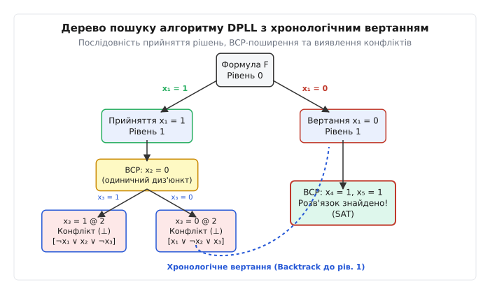
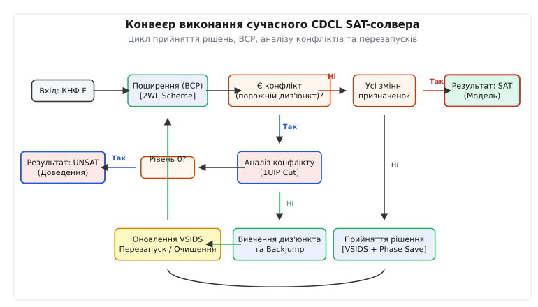
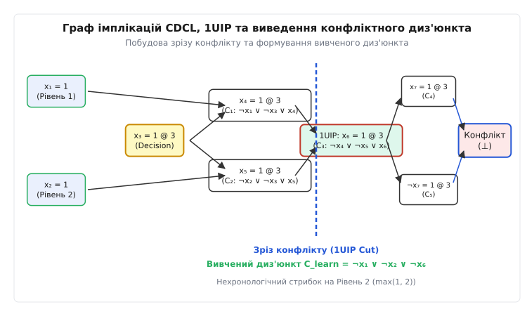
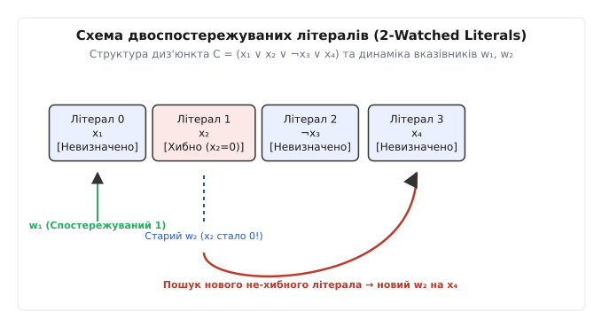

<preknowlist>
- [Перетворення Цейтіна](topic:math-logic/tseytin-transformation) — лінійне кодування довільних булевих формул у КНФ.
- [Horn-SAT і здійсненність](topic:math-logic/horn-sat) — лінійне розв'язання спеціального класу КНФ за допомогою поширення одиничного літерала.
- [Теорема Кука — Левіна](topic:computability/cook-levin-theorem) — доведення NP-повноти SAT та фундаментальна роль проблеми здійсненності.
- [Проблема NP-повноти](topic:computability/np-completeness) — класи складності P, NP та ідея зниження задач до SAT.
</preknowlist>

# Алгоритми DPLL та CDCL у SAT-солверах

Автоматизована перевірка логічних схем сучасних мікропроцесорів та верифікація складного програмного забезпечення стикаються з експоненційним вибухом комбінаторного простору: наївно перебрати `2ⁿ` варіантів для формули з 50 булевими змінними вимагає перевірки `2⁵⁰ ≈ 10¹⁵` наборів значень. Перехід від повного перебору до алгоритму DPLL (Davis-Putnam-Logemann-Loveland), а згодом до CDCL (Conflict-Driven Clause Learning) перетворив проблему здійсненності булевих формул (SAT) із теоретичного експоненційного бар'єра NP-повноти на потужне промислове обчислювальне ядро, здатне опрацьовувати КНФ-формули з мільйонами змінних та сотнями мільйонів обмежень.

## 1. Постановка проблеми здійсненності та Кон'юнктивна Нормальна Форма (КНФ)

Проблема здійсненності булевих формул (SAT) полягає у з'ясуванні, чи існує таке призначення булевих значень («істина» `1` або «хиба» `0`) вхідним змінним `X = {x₁, x₂, ..., x_n}`, за якого вся формула `F` оцінюється як істинна (`F = 1`).

Більшість сучасних алгоритмів очікують вхідну формулу у кон'юнктивній нормальній формі (КНФ). Формула у КНФ є кон'юнкцією (операцією І, `∧`) диз'юнктів (операцій АБО, `∨`), де кожен диз'юнкт містить множину літералів — змінних або їхніх заперечень:

```
F_cnf = C₁ ∧ C₂ ∧ ... ∧ C_m
C_i = (l_i1 ∨ l_i2 ∨ ... ∨ l_ik)
```

де кожен літерал `l` належить множині `{x_j, ¬x_j}`. Формула оцінюється як істинна тоді і тільки тоді, коли кожен її диз'юнкт оцінюється як істинний. Якщо хоча б один диз'юнкт оцінюється як хибний (`C_i = 0`), вся формула стає хибною. Формула, у якій довільний диз'юнкт не містить жодного літерала, називається **порожнім диз'юнктом** і позначається як `⊥` (конфлікт).

Будь-яка логічна формула чи схемний опис може бути ефективно зведений до КНФ без експоненційного зростання розміру за допомогою [Перетворення Цейтіна](topic:math-logic/tseytin-transformation).

У системній реалізації SAT-солверів кожна змінна `x_i` нумерується цілим додатним індексом `i ∈ {1, ..., N}`. Для забезпечення максимально швидкої адресації в оперативній пам'яті комп'ютера літерали кодуються за допомогою беззнакових цілих чисел: стверджувальний літерал `x_i` подається як `2i`, а його заперечення `¬x_i` — як `2i + 1`. Таке кодування дозволяє обчислювати заперечення літерала за допомогою швидкої побітової операції виключного АБО з одиницею (`¬l = l ^ 1`), а номер змінної — побітовим зсувом праворуч (`var = l >> 1`).

## 2. Механіка та алгоритмічна структура DPLL

Алгоритм DPLL, розроблений у 1962 році Мартіном Девісом, Джорджем Логеманном та Дональдом Ловеландом, поєднує рекурсивний пошук у глибину (Backtracking Search) із двома фундаментальними правилами спрощення формул.

### Поширення одиничного літерала (Unit Propagation / BCP)

Якщо у процесі часткового призначення змінних диз'юнкт `C` містить лише один неоцінений (невизначений) літерал, а всі інші літерали цього диз'юнкта вже оцінені як хибні, такий диз'юнкт називається **одиничним диз'юнктом (Unit Clause)**.

Щоб формула залишалася здійсненною, єдиний невизначений літерал одиничного диз'юнкта вимушено мусить бути оцінений як істинний. Це значення фіксується на поточному рівні прийняття рішення, що може утворити нові одиничні диз'юнкти в інших частинах формули. Цей каскадний процес вимушених призначень називається **поширенням обмежень (Boolean Constraint Propagation, BCP)**.

```
Початковий диз'юнкт: C = (¬x₁ ∨ ¬x₂ ∨ x₃)
Поточні призначення: x₁ = 1, x₂ = 1
Визначені літерали:  ¬x₁ = 0, ¬x₂ = 0
Диз'юнкт стає одиничним: (0 ∨ 0 ∨ x₃)  ==>  Вимушене BCP-призначення: x₃ = 1
```

Механізм BCP працює як циклічна черга поширень. Солвер підтримує стек викликів (trail), до якого почергово додаються всі призначені літерали. Для кожного новопризначеного літерала переглядаються всі диз'юнкти, у яких цей літерал входить у протилежній полярності. Якщо якийсь диз'юнкт під дією цього призначення втрачає передостанній не-хибний літерал, останній літерал стає одиничним і штовхається у стек для подальшого опрацювання.

### Усунення чистих літералів (Pure Literal Elimination)

Якщо змінна `x` входить до формули тільки у вигляді стверджувального літерала `x` (або тільки у вигляді заперечення `¬x`) в усіх незадоволених диз'юнктах, вона називається **чистим літералом (Pure Literal)**. Змінну `x` можна відразу оцінити так, щоб зробити цей літерал істинним, без ризику порушити будь-які інші обмеження.

У сучасних високопродуктивних SAT-солверах пошук чистих літералів під час активного розв'язання зазвичай виключають з основного циклу обчислень. Причиною є те, що динамічне відстеження появи чистих літералів вимагає підрахунку глобальних лічильників для кожної змінної, що сповільнює роботу системи значно сильніше, ніж потенційна користь від скорочення декількох гілок дерева пошуку.

### Цикл прийняття рішень та хронологічне вертання

Якщо правило BCP розповсюджено повністю, а чисті літерали усунуто, але невизначені змінні ще залишилися, алгоритм робить **прийняття рішення (Decision)**: обирає невизначену змінну `x` і збільшує поточний рівень прийняття рішення (Decision Level `d`). Змінній надається одне з двох значень (наприклад, `x = 1`), після чого знову запускається каскад BCP.

Якщо на якомусь рівні BCP призводить до утворення порожнього диз'юнкта (всі літерали диз'юнкта оцінені як хибні), виникає **конфлікт**. Алгоритм DPLL виконує **хронологічне вертання (Chronological Backtracking)**: скасовує всі призначення до останнього рішення на рівні `d`, змінює значення цієї змінної на протилежне (`x = 0`) і продовжує пошук. Якщо ж конфлікт виникає на рівні рішення 0 (коли ніде вертатися), формула оголошується нездійсненною (UNSAT).


*Послідовність прийняття рішень, BCP-поширення та хронологічне вертання в алгоритмі DPLL.*

Розглянемо детальний покроковий приклад роботи DPLL на формулі `F`:

```
C₁ = (x₁ ∨ x₂)
C₂ = (¬x₁ ∨ x₃)
C₃ = (¬x₂ ∨ ¬x₃)
C₄ = (x₁ ∨ ¬x₃)
```

1. **Рівень 0:** Одиничних диз'юнктів немає. Солвер робить рішення на рівні 1: `x₁ = 1 @ 1`.
2. **BCP на рівні 1:**
   - Диз'юнкт `C₂ = (¬x₁ ∨ x₃)` перетворюється на `(0 ∨ x₃)` і стає одиничним. Звідси вимушено `x₃ = 1 @ 1`.
   - Диз'юнкт `C₃ = (¬x₂ ∨ ¬x₃)` при `x₃ = 1` перетворюється на `(¬x₂ ∨ 0)` і стає одиничним. Звідси вимушено `x₂ = 0 @ 1`.
   - Перевіряємо диз'юнкт `C₁ = (x₁ ∨ x₂)`: він задоволений, бо `x₁ = 1`.
   - Перевіряємо диз'юнкт `C₄ = (x₁ ∨ ¬x₃)`: при `x₁ = 1` він задоволений.
3. Усі змінні призначено (`x₁ = 1, x₂ = 0, x₃ = 1`), усі диз'юнкти задоволені. Алгоритм зупиняється та повертає стан `SAT`.

Детальний аналіз хронологічного розвитку цих ідей від перших праць Девіса та Патнема наведено у вставці [📜 Історія SAT-солверів: від алгоритму Девіса — Патнема до революції CDCL](topic:sf-algorithms/dpll-cdcl/hist-dpll-cdcl.md).

## 3. Обмеження DPLL та бар'єр експоненційного блукання

Незважаючи на елегантність, алгоритм DPLL володіє критичним недоліком: хронологічне вертання завжди повертає стан пошуку строго на один рівень назад (`d` до `d - 1`).

Якщо справжня причина конфлікту полягає у несумісності рішень, прийнятих на рівнях 1 та 2, але конфлікт проявився лише на рівні 50, DPLL буде випробовувати всі можливі `2⁴⁸` комбінацій значень змінних на рівнях від 3 до 50, кожного разу повторюючи абсолютно той самий конфлікт у різних піддеревах. Це явище називається **комбінаторним блуканням (thrashing)**.

До того ж, DPLL не зберігає жодної інформації про причини невдач. Покинувши тупикову гілку, алгоритм повністю «забуває» виявлену суперечність. Математичне доведення того, чому DPLL вимагає експоненційного часу на формулах сімейства «Принцип дірок» (Pigeonhole Principle `PHP_n`), детально розібрано у вставці [🧮 Математичні основи DPLL та CDCL: резолюція, граф імплікацій та некоректність хронологічного вертання](topic:sf-algorithms/dpll-cdcl/math-dpll-cdcl.md).

## 4. Архітектура CDCL: Аналіз конфліктів та 1UIP

Алгоритм CDCL (Conflict-Driven Clause Learning), запропонований у 1996 році, розв'язав проблему блукання шляхом об'єднання деревного пошуку DPLL з математичним виведенням конфліктних диз'юнктів.

```
          ┌────────────────────────────────────────┐
          │                                        │
┌─────────▼─────────┐     ┌──────────────┐     ┌───┴──────────┐     ┌──────────────┐
│  Прийняття рішення │ ──> │ Поширення    │ ──> │ Є конфлікт?  │ ──> │ Усі змінні   │ ──> SAT
│  [VSIDS + Phase]  │     │ (BCP / 2WL)  │     └──────┬───────┘     │ призначено?  │
└───────────────────┘     └──────────────┘            │             └──────────────┘
                                                      │ (Так)
                                               ┌──────▼───────┐
                                               │ Аналіз       │
                                               │ конфлікту    │
                                               └──────┬───────┘
                                                      │
                                               ┌──────▼───────┐
                                               │ Вивчення     │ ──> UNSAT (якщо рівень 0)
                                               │ диз'юнкта    │
                                               │ та Backjump  │
                                               └──────────────┘
```


*Загальний конвеєр роботи CDCL-солвера: BCP, аналіз конфліктів, нехронологічний стрибок та евристика VSIDS.*

### Граф імплікацій (Implication Graph)

Під час виконання BCP солвер будує причинно-наслідковий спрямований ациклічний граф (Implication Graph). Вершинами графа є призначені літерали із зазначенням рівня прийняття рішення `l = v @ d`. Спрямовані ребра ведуть від літералів-причин до літерала-наслідку, а міткою ребра є диз'юнкт, який спричинив BCP-поширення.

Для кожної змінної `x_i`, яка була призначена в результаті BCP, солвер зберігає вказівник на диз'юнкт-причину (`reason[x_i]`). Якщо зміну було зроблено в результаті рішення, `reason[x_i] = NULL`.

Коли при BCP виникає суперечність (два протилежні літерали `x` та `¬x` одночасно стають істинними у якомусь диз'юнкті `C_conf`), у граф додається спеціальна конфліктна вершина `⊥`.

### 1UIP (First Unique Implication Point) та зріз конфлікту

Щоб сформувати новий диз'юнкт, солвер аналізує причинні шляхи від останньої прийнятої змінної на поточному рівні `d_curr` до конфліктної вершини `⊥`.

Вершина `u` називається **Unique Implication Point (UIP)**, якщо будь-який шлях у графі імплікацій від змінної рішення поточного рівня до конфлікту `⊥` проходить через `u`. Сама змінна рішення поточного рівня завжди є тривіальним UIP.

**Перша єдина точка імплікації (1UIP)** — це UIP, що знаходиться найближче до конфліктної вершини `⊥`. Вибір 1UIP забезпечує побудову найменшого та найефективнішого конфліктного диз'юнкта (1UIP Cut).


*Формування графа імплікацій, побудова зрізу 1UIP та виведення нового конфліктного диз'юнкта.*

Алгоритм обчислення 1UIP диз'юнкта працює у зворотному напрямку за стеком рішень (trail):
1. Ініціалізується поточний диз'юнкт `C_curr = C_conf`.
2. Підраховується кількість літералів у `C_curr`, які належать поточному рівню прийняття рішення `d_curr`.
3. Доки ця кількість більша за 1:
   - Обирається літерал `l` з `C_curr`, призначений останнім на рівні `d_curr`.
   - Виконується резолюція `C_curr = Res_var(l)(C_curr, reason[var(l)])`.
   - Оновлюється кількість літералів поточного рівня.
4. Отриманий диз'юнкт `C_learn` містить строго один літерал поточного рівня, який відповідає запереченню `1UIP` (`¬1UIP`), та підмножину літералів із попередніх рівнів рішення.

```
C_learn = (¬1UIP ∨ ¬l₁ ∨ ¬l₂ ∨ ... ∨ ¬l_k)
```

де `l₁, l₂, ..., l_k` — літерали з **попередніх** рівнів прийняття рішень (`d < d_curr`).

## 5. Нехронологічне вертання (Backjumping)

Отримана форма вивченого диз'юнкта `C_learn` володіє унікальною властивістю: вона містить **строго один літерал** з поточного рівня прийняття рішення (а саме `¬1UIP`), тоді як усі інші літерали належать попереднім рівням.

Рівень, на який мусить повернутися солвер, називається **рівнем ствердження (Assertion Level)** і обчислюється як максимальний рівень серед усіх інших літералів вивченого диз'юнкта:

```
d_assert = max(level(l₁), level(l₂), ..., level(l_k))
```

Якщо диз'юнкт містить тільки один літерал (1UIP), то `d_assert = 0`.

Замість вертання на один рівень (`d_curr - 1`), CDCL робить **нехронологічний стрибок (Backjump)** одразу на рівень `d_assert`, скасовуючи всі рішення та BCP-призначення на проміжних рівнях.

Одразу після стрибка на рівень `d_assert` вивчений диз'юнкт `C_learn` стає **одиничним диз'юнктом**, оскільки всі літерали `¬l_j` вже оцінені як хибні на попередніх рівнях. Внаслідок цього BCP негайно вимушує значення `1UIP` із протилежною полярністю на рівні `d_assert` **без здійснення нового прийняття рішення**. Це повністю виключає повторний вхід у суперечливу область пошуку.

## 6. Схема двоспостережуваних літералів (2-Watched Literals)

У будь-якому SAT-солвері операція поширення обмежень (BCP) займає понад 80–90% загального часу обчислень. Наївна перевірка стану всіх літералів у кожному диз'юнкті під час кожного призначення та кожного вертання створює колосальне навантаження на підсистему пам'яті.

У 2001 році розробники солвера zChaff розробили **схему двоспостережуваних літералів (2-Watched Literals, 2WL)**, яка кардинально змінила продуктивність BCP.

### Інваріанти 2WL

Для кожного диз'юнкта `C`, який містить 2 або більше літералів, солвер вибирає та відстежує точечними вказівниками рівно два літерали `w₁` та `w₂`.

1. **Інваріант спостереження:** якщо літерал, який не є ані `w₁`, ані `w₂`, змінює своє значення (наприклад, стає хибним), диз'юнкт `C` взагалі не потребує жодної обробки.
2. **Інваріант вимушеності:** диз'юнкт може стати одиничним або порожнім (конфліктним) тільки тоді, коли один із двох спостережуваних літералів оцінюється як хибний.
3. **Обробка події:** коли один зі спостережуваних літералів (наприклад, `w₂`) стає хибним, солвер сканує решту літералів диз'юнкта у пошуках іншого не-хибного літерала.
   - Якщо такий літерал `l_new` знайдено, вказівник `w₂` переміщується на `l_new`, і диз'юнкт видаляється зі списку спостереження старого літерала та додається до списку спостереження `l_new`.
   - Якщо іншого не-хибного літерала немає, а перший спостережуваний літерал `w₁` є невизначеним, диз'юнкт `C` негайно стає одиничним, і `w₁` призначається через BCP.
   - Якщо ж `w₁` також є хибним, фіксується конфлікт.


*Структура двоспостережуваних літералів 2WL та динаміка зміщення вказівників при обробці BCP.*

### Дивовижна властивість при вертанні

Під час вертання (backtracking або backjumping) скасування призначень змінних **не вимагає жодного оновлення вказівників 2WL**. Вказівники залишаються на своїх місцях, оскільки зміна значення з `0` на невизначене не порушує інваріант того, що спостережувані літерали є не-хибними на момент їх встановлення. Це знижує трудомісткість вертання до `O(1)`.

## 7. Динамічні евристики розгалуження, перезапуски та збереження фази

Сучасний CDCL-солвер спирається на три динамічні системи керування пошуком.

### Евристика VSIDS (Variable State Independent Decaying Sum)

Замість обчислення статичної частоти змінних у початковій формулі, евристика VSIDS підраховує активність змінних на основі їх участі у конфліктах:
1. Кожна змінна `x` має плаваючу оцінку активності `Score(x)`.
2. Кожного разу, коли виводиться новий конфліктний диз'юнкт, активність усіх змінних, що входять до графа імплікацій цього конфлікту, збільшується на величину `Δ`.
3. Після кожного конфлікту величина `Δ` мультиплікативно збільшується: `Δ = Δ · (1 / γ)`, де `γ ∈ [0.8, 0.95]` — коефіцієнт згасання. Це експоненційно знецінює старі конфлікти і надає перевагу змінним, що беруть участь у поточних локальних суперечностях.
4. Якщо якась оцінка `Score(x)` перевищує порог `1e100`, всі оцінки масштаблуються діленням на `1e100` для запобігання переповненню типу `double`.
5. Солвер завжди обирає невизначену змінну з найвищим значенням `Score(x)`.

### Збереження фази (Phase Saving)

При прийнятті рішення щодо змінної `x` солвер повинен також обрати її полярність (`x = 1` чи `x = 0`). Евристика збереження фази (Pipatsrisawat & Darwiche, 2007) запам'ятовує останнє значення, яке мала змінна `x` під час попереднього BCP. Коли змінна обирається знову, солвер призначає їй саме це збережене значення. Це запобігає руйнуванню вже сформованих часткових розв'язків у суміжних піддеревах і скорочує час повторного входження у суміжні компоненти здійсненності.

### Перезапуски (Restarts) та видалення вивчених диз'юнктів

Якщо солвер потрапляє у неефективну область простору пошуку, він виконує **перезапуск (Restart)**: скасовує всі прийняті рішення та повертається на рівень 0. Збережені вивчені диз'юнкти та оновлені оцінки VSIDS при цьому **не видаляються**. Завдяки зміненим оцінкам VSIDS після перезапуску солвер будує зовсім інше дерево пошуку, спираючись на накопичений досвід. Періодичність перезапусків задається послідовностями Любі (Luby sequence) або геометричною прогресією.

Для запобігання переповненню пам'яті вивченими диз'юнктами солвер періодично проводити очищення бази (Clause Database Reduction), видаляючи диз'юнкти з високим значенням LBD (Literal Block Distance — кількістю різних рівнів прийняття рішень у диз'юнкті).

Диз'юнкти з `LBD = 2` називаються **Glue Clauses**. Вони зв'язують між собою два різні рівні прийняття рішень і ніколи не видаляються з бази даних солвера, оскільки вони забезпечують найшвидший аналіз конфліктів у майбутньому.

## 8. Препроцесинг та інпроцесинг КНФ-формул

У сучасних CDCL-солвера розв'язання починається і періодично переривається фазами **препроцесингу (Preprocessing)** та **інпроцесингу (Inprocessing)**. Головна мета цих фаз — зменшити кількість змінних та дизюнктів у КНФ до початку активного дерева пошуку.

Основними технологіями інпроцесингу є:
1. **Усунення змінних (Variable Elimination / Bounded Variable Elimination):** якщо для змінної `x` кількість виведених резольвент за всіма диз'юнктами з `x` та `¬x` є меншою за початкову кількість диз'юнктів із цією змінною, змінна `x` повністю вилучається з формули методом резолюції.
2. **Субсумція (Subsumption):** якщо диз'юнкт `C₁` є підмножиною диз'юнкта `C₂` (`C₁ ⊆ C₂`), то диз'юнкт `C₂` є логічно надлишковим і видаляється з формули.
3. **Елімінація еквівалентних літералів (Equivalent Literal Substitution):** якщо у графі імплікацій виявляється сильна компонента зв'язності між літералами `a → b` та `b → a`, змінні `a` та `b` оголошуються еквівалентними, і одна з них замінюється іншою по всій формулі.
4. **Вівіфікація (Vivification):** спроба скоротити існуючі диз'юнкти шляхом тимчасового призначення заперечень їхніх літералів та виконання BCP. Якщо під час BCP виникає конфлікт, диз'юнкт скорочується.

## 9. Архітектура DPLL(T) та SMT-солвери

Технологія CDCL є центральним мотором у **SMT-солверах (Satisfiability Modulo Theories)**, таких як Z3, CVC5 та Yices.

У рамках архітектури **DPLL(T)** CDCL-солвер опрацьовує абстрактний булевий скелет формули, де кожноме атомному предикату теорії (наприклад, `a + 2b ≤ 5` або `array_select(A, i) == v`) зіставляється булева змінна `b_i`.

1. **CDCL-ядро** робить прийняття рішень та BCP над булевими змінними.
2. Коли формується часткове призначення булевих змінних, воно передається спеціалізованому **T-солверу (Theory Solver)**, який перевіряє сумісність виразів у відповідній математичній теорії.
3. Якщо T-солвер виявляє суперечність (наприклад, `x > 5 ∧ x < 2`), він формує **T-вивчений диз'юнкт (Theory Lemma)** і повертає його у CDCL-ядро як конфліктний диз'юнкт.
4. CDCL-ядро виконує нехронологічний стрибок 1UIP і продовжує пошук.

## 10. Паралельні SAT-солвери: Portfolio та Divide-and-Conquer

Сучасні багатоядерні процесори та кластери вимагають ефективної паралелізації розв'язання SAT. Застосовуються дві парадигми:

1. **Портфельний підхід (Portfolio SAT Solving):** декілька екземплярів CDCL-солвера запускаються паралельно з різними початковими евристиками VSIDS, схемами перезапусків та фазами препроцесингу. Солвери обмінюються короткими вивченими диз'юнктами (`LBD ≤ 2`) через спільну оперативну пам'ять чи lock-free буфери.
2. **Розділяй-і-володарюй (Cube-and-Conquer):** спеціальний Lookahead SAT-солвер будує дерево кубів (коротких призначень змінних), розбиваючи простір пошуку на тисячі незалежних підзадач. Кожна підзадача передається окремому потоку CDCL-солвера.

## 11. Практичні застосування та інструментальний стек

Технології CDCL є фундаментом сучасного автоматизованого інжинірингу:
- **Формальна верифікація апаратури (EDA):** перевірка еквівалентності логічних схем (Equivalence Checking) та Bounded Model Checking (CBMC) під час проектування процесорів.
- **Аналіз програмного забезпечення:** виявлення уразливостей переповнення буфера, статичний аналіз коду та автоматична генерація тестів (Symbolic Execution).
- **Менеджери пакетів та системи залежностей:** менеджери пакетів у сучасних операційних системах та мовах програмування (такі як `cargo`, `opam`, `conda`, `zypper`) зводять розв'язання конфліктів версій пакетів до проблеми SAT і розв'язують її вбудованими CDCL-солверами.

Програмна реалізація базового SAT-солвера мовами C та C++ з прикладами використання наведена у вставці [⚙️ Реалізація SAT-солвера: від базового DPLL до розширеного CDCL з 2WL](topic:sf-algorithms/dpll-cdcl/proj-dpll-cdcl.md).

Специфікація стандарту DIMACS CNF та C/C++ API для інтеграції солверів у власні додатки описана у вставці [📋 Інтерфейс SAT-солверів та специфікація формату DIMACS CNF](topic:sf-algorithms/dpll-cdcl/api-dpll-cdcl.md).
