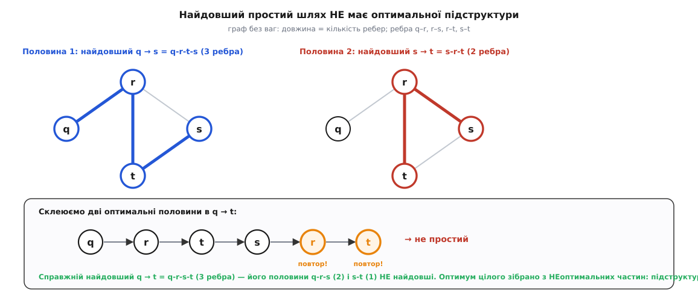
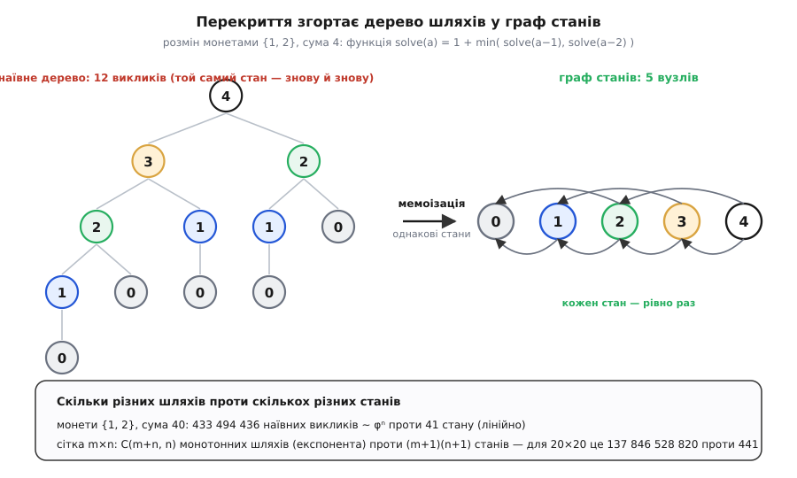

# 🧮 Математика оптимальної підструктури

Оптимальна підструктура — не інтуїція, а твердження, яке для конкретної задачі можна **довести або спростувати**. Тут строго доведено аргумент «вирізати й вклеїти» для найкоротших шляхів, показано малий граф, де для найдовшого простого шляху той самий аргумент падає, і виведено формулу, чому динамічне програмування коштує стільки, скільки в задачі **станів**, а не скільки **шляхів**.

## Що саме треба довести

Задача має оптимальну підструктуру, якщо оптимальний розв'язок цілого **містить у собі** оптимальні розв'язки підзадач. Наголос — на «містить у собі»: мало того, щоб ціле розкладалося на частини; треба, щоб ті частини самі були оптимальні для своїх підзадач. Найчистіше це видно на шляхах у графі, тож зафіксуймо позначення (означення шляху, простого шляху й ваги — [теорія графів](root:math-combinatorics/graph-theory)).

Нехай `G = (V, E)` — граф із вагами ребер `w: E → ℝ` (орієнтований чи ні — байдуже). Вага шляху — сума ваг його ребер:

```
шлях  p = ⟨v₀, v₁, …, vₖ⟩
w(p) = w(v₀,v₁) + w(v₁,v₂) + … + w(vₖ₋₁,vₖ)
```

Відстань `δ(u, v)` — найменша вага серед усіх шляхів з `u` до `v`; припустімо, від'ємних циклів немає, тож цей мінімум існує й скінченний. Підшлях від `i`-ї до `j`-ї вершини позначимо `pᵢⱼ = ⟨vᵢ, …, vⱼ⟩`. **Оптимальний** (найкоротший) шлях — той, чия вага дорівнює `δ`.

## Аргумент «вирізати й вклеїти»

**Теорема.** Нехай `p = ⟨v₀, …, vₖ⟩` — найкоротший шлях з `v₀` до `vₖ`. Тоді будь-який його підшлях `pᵢⱼ` (для `0 ≤ i ≤ j ≤ k`) — найкоротший шлях з `vᵢ` до `vⱼ`.

**Доведення (від супротивного).** Розріжемо `p` у точках `vᵢ` та `vⱼ` на три куски й запишемо його вагу як їхню суму:

```
       p₀ᵢ          pᵢⱼ          pⱼₖ
v₀ ~~~~~~~~~▸ vᵢ ~~~~~~~▸ vⱼ ~~~~~~~▸ vₖ

w(p) = w(p₀ᵢ) + w(pᵢⱼ) + w(pⱼₖ)
```

Припустімо, що середній кусок `pᵢⱼ` — **не** найкоротший з `vᵢ` до `vⱼ`. Тоді між тими самими кінцями існує коротший шлях `p′ᵢⱼ`, тобто `w(p′ᵢⱼ) < w(pᵢⱼ)`. Виріжемо `pᵢⱼ` і вклеїмо на його місце `p′ᵢⱼ` — дістанемо новий маршрут `p′` з `v₀` до `vₖ`:

```
w(p′) = w(p₀ᵢ) + w(p′ᵢⱼ) + w(pⱼₖ)
      < w(p₀ᵢ) + w(pᵢⱼ)  + w(pⱼₖ) = w(p)
```

Отже `w(p′) < w(p)`. Але `p′` веде з `v₀` у `vₖ`, тож не може бути коротший за найкоротший: `w(p) = δ(v₀, vₖ) ≤ w(p′)`. Дві нерівності разом дають `w(p′) < w(p) ≤ w(p′)`, тобто `w(p′) < w(p′)` — суперечність. Значить, припущення хибне: `pᵢⱼ` таки найкоротший. ∎

## Де аргумент падає: найдовший простий шлях

Уся сила доведення — в останньому кроці: вклеєний маршрут `p′` був **законним суперником** оригіналу, і нерівність `δ ≤ w(p′)` не давала йому бути коротшим за оптимум. Для найкоротшого шляху `p′` законний завжди, бо оптимізуємо **без обмежень на форму**: навіть якби `p′` двічі заходив в одну вершину, це був би зайвий цикл, який за відсутності від'ємних циклів викидають, не збільшивши ваги. Саме на цій дрібниці все й тримається — і саме вона ламається, щойно мету змінити на **найдовший простий шлях**.

Простий означає «без повторення вершин». Це вже глобальне обмеження на весь маршрут, і вклеювання здатне його порушити: склеєний із двох простих половин маршрут запросто повторить вершину — і перестане бути простим. Тоді склейка вже не суперник, останній крок доведення нема на що сперти, і властивості немає не через недогляд, а по суті. Ось граф, де це видно на пальцях — чотири вершини, ребра без ваг (довжина = кількість ребер):

```
ребра:  q–r,  r–s,  r–t,  s–t
```

Спитаймо про найдовший простий шлях з `q` до `t` і спробуймо зібрати його «через `s`» — з найдовшої половини `q→s` та найдовшої половини `s→t`. Повний перебір простих шляхів дає:

```
найдовший простий  q → s :  q-r-t-s   (3 ребра)
найдовший простий  s → t :  s-r-t     (2 ребра)
склейка   half₁ ⊕ half₂  :  q-r-t-s-r-t
```

Склейка проходить `r` і `t` **двічі** — це вже не простий шлях, а прогулянка; п'ять «ребер» тут ілюзорні. Оптимальні половини не збираються в оптимальне ціле. Ба більше: справжній найдовший простий `q→t` — це `q-r-s-t` (теж 3 ребра), а його половини щодо `s` — це `q-r-s` (2 ребра) і `s-t` (1 ребро), і **жодна не найдовша** для своєї підзадачі. Оптимум цілого зібрано саме з **неоптимальних** частин — точна протилежність оптимальній підструктурі.


*Найдовший простий шлях не має оптимальної підструктури. Дві оптимальні половини — найдовший `q→s` (синій, `q-r-t-s`) і найдовший `s→t` (червоний, `s-r-t`) — при склеюванні дають прогулянку `q-r-t-s-r-t`, що повторює `r` і `t`: уже не простий шлях. А справжній оптимум `q-r-s-t` складено з половин `q-r-s` і `s-t`, жодна з яких не найдовша. Оптимум цілого — з неоптимальних частин.*

Це не примха одного графа. Задача про найдовший простий шлях [NP-складна](root:computability/np-completeness): окремим випадком у ній сидить пошук гамільтонового шляху — найдовший простий шлях, що проходить усі `n` вершин, це і є гамільтонів, — а для нього поліноміального алгоритму не відомо. Тож поки `P ≠ NP`, коректної рекурентності по підшляхах для неї просто не існує; провал оптимальної підструктури тут структурний, а не тимчасовий. Натомість для **найкоротшого** шляху підструктура є — на ній прямо стоять [алгоритм Дейкстри](root:sf-algorithms/dijkstra) і [Беллмана–Форда](root:sf-algorithms/bellman-ford).

## Скільки коштує динамічне програмування

Друга обіцяна теорема — чому час читається формулою «кількість станів × робота на перехід». Спершу формалізуймо, що таке «стан».

Динамічне програмування — це орієнтований ациклічний граф залежностей `D = (S, A)` на множині станів `S`: дуга `(s′ → s)` означає, що обчислення стану `s` безпосередньо читає значення стану `s′`. Ациклічний — бо кожен стан спирається лише на дрібніші підзадачі (це і є топологічний порядок обчислення). Нехай `τ(s)` — **робота на перехід** у стан `s`: скільки операцій треба, щоб із уже готових попередників скласти значення `s` (по суті — кількість вхідних у `s` дуг, з точністю до сталої).

**Теорема.** Якщо кожен стан обчислюється з пам'яттю (перший раз рахуємо й запам'ятовуємо, далі беремо готове), то повний час дорівнює

```
T = Θ( Σ τ(s) )   — сума по всіх станах s ∈ S
```

Зокрема, якщо робота на перехід усюди не більша за `τ`, то `T = O(|S| · τ)`; і водночас `T = Ω(|S|)`, бо кожен стан треба порахувати хоч раз.

**Доведення.** Ключ — у слові «запам'ятовуємо». Тіло рекурентності для кожного стану виконується **рівно один раз**: перший виклик рахує значення й кладе в кеш, усі наступні виклики того самого стану повертають готове за `O(1)`. Тому весь час розкладається на дві купки:

```
T =  Σ τ(s)              ← перше обчислення кожного стану (по разу)
   + (кеш-влучань) · O(1) ← повторні виклики вже готових станів
```

Кеш-влучань не більше, ніж усіх звернень до попередників, а їх рівно `|A| = Σ (кількість попередників s) ≤ Σ τ(s)`. Отже друга купка не перевищує першої, і `T = Θ(Σ τ(s))`. Знизу кожен стан коштує хоча б своє перше обчислення, тож оцінка `Θ` точна. ∎ *(Табуляція знизу вгору дає те саме без кеш-перевірок: простий цикл по станах, кожен по `τ(s)` роботи.)*

Прикладаємо формулу до двох задач (`Θ`/`O`/`Ω` — [асимптотична складність](root:computability/asymptotic-complexity)).

**Розмін монет** (`k` номіналів, сума `amount`). Стан — одне число `a` від `0` до `amount`, тож `|S| = amount + 1`. Перехід перебирає монети `c ≤ a`, отже `τ(a) ≤ k`. За теоремою:

```
T = Σ τ(a)  ≤  (amount + 1) · k  =  O(amount · k)
```

**Сітка m×n** (шляхи в таблиці, редакційна відстань, найдовша спільна підпослідовність — усі однакові за формою). Стан — клітина `(i, j)`, тож `|S| = (m+1)(n+1) = Θ(m·n)`. Кожна клітина дивиться лише на кількох сусідів згори/зліва, тож `τ = O(1)`:

```
T = Θ(m · n)
```

## Чому експонента шляхів згортається в поліном станів

Лишилось пояснити, звідки виграш. Наївна рекурсія без пам'яті будує **дерево викликів**, і в цьому дереві по одному листку на кожну повну послідовність рішень — тобто на кожен **шлях** розв'язку. Таких шляхів експоненційно багато. Пам'ять ототожнює всі виклики того самого стану в один вузол: дерево (розміром = кількість шляхів) стягується у граф станів `D` (розміром = `|S|`). Прискорення — це і є відношення

```
(кількість шляхів) / (кількість станів)
```

Порахуймо обидва боки на числах.

**Монети {1, 2}.** Кількість наївних викликів `solve(a)` задовольняє ту саму рекурентність, що й сама функція: `U(a) = U(a−1) + U(a−2)` — рекурентність Фібоначчі. Тож дерево росте як `Θ(φᵃ)`, де `φ = (1 + √5) / 2 ≈ 1.618` — золотий перетин. А різних станів усього `a + 1`. На конкретних числах:

```
сума a       наївних викликів      станів (a+1)
  10                  232                 11
  20               28 656                 21
  40          433 494 436                 41
```

Сорок центів наївно — понад чотириста мільйонів викликів; з пам'яттю — сорок один крок.

**Сітка m×n.** Скільки монотонних шляхів веде з кутка `(0,0)` у куток `(m,n)`, крокуючи лише вправо й униз? Кожен шлях — послідовність із `m` кроків «вправо» та `n` кроків «униз»; лишається вибрати, на яких із `m+n` позицій стоять кроки «униз»:

```
кількість шляхів = C(m+n, n) = (m+n)! / (m! · n!)
```

Це росте експоненційно (для квадрата `n×n` центральний біноміальний коефіцієнт `~ 4ⁿ / √(πn)`), тоді як станів лише `(m+1)(n+1)`. Для сітки 20×20:

```
шляхів:  C(40, 20) = 137 846 528 820
станів:  21 · 21    =           441
```

Сто тридцять сім мільярдів проти чотирьохсот сорока одного — той самий розв'язок, але динамічне програмування платить за різні **стани**, а не за різні **шляхи**. У цьому переході від «стільки, скільки шляхів» до «стільки, скільки станів» і сховано всю його силу.


*Перекривні підзадачі згортають експоненту в поліном. Наївна рекурсія `solve(a)` для монет {1, 2} будує дерево з листком на кожен розв'язок-шлях (12 викликів уже для суми 4, `Θ(φⁿ)` загалом); пам'ять ототожнює однакові стани й стягує дерево у граф із п'яти вузлів — по одному на суму 0…4. Час платиться за кількість станів, а не шляхів: для сітки 20×20 — 441 стан проти 137 мільярдів монотонних шляхів.*
