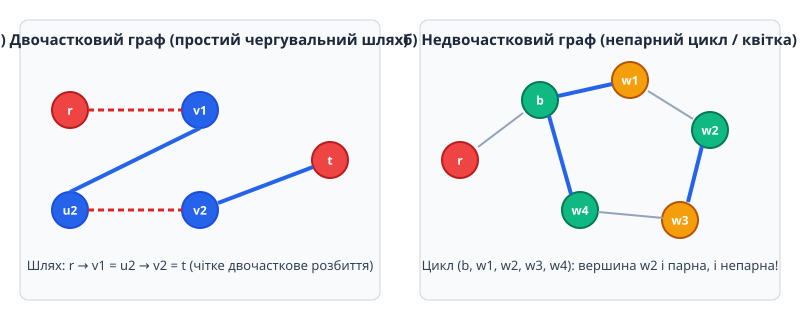
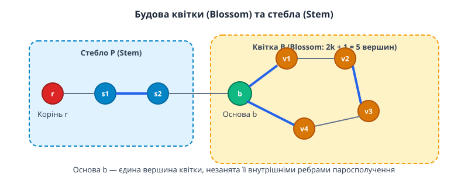
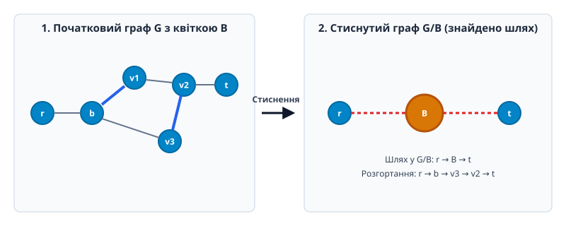
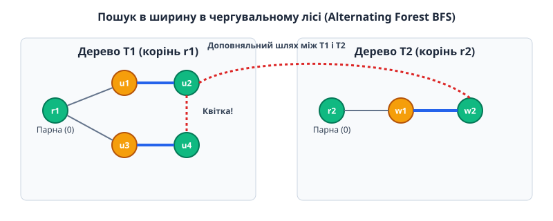

# Алгоритм Едмондса

<preknowlist>
- [Двочастковий граф](topic:sf-algorithms/bipartite-graph) — граф, множина вершин якого розбивається на дві неперетинні частини.
- [Досконале паросполучення](topic:sf-algorithms/perfect-matching) — паросполучення, яке покриває всі вершини графа.
- [Асимптотична складність](topic:computability/asymptotic-complexity) — оцінка часу виконання алгоритму при зростанні розміру вхідних даних.
</preknowlist>

У п'ятивершинному графі-циклі `C5` із вершинами `0, 1, 2, 3, 4` та наявним паросполученням із двох ребер `(1, 2)` і `(3, 4)` вершина `0` залишається вільною, проте класичний пошук чергувального шляху застрягає в пастці. Коли алгоритм починає обхід із вільної вершини `0`, ребро `(0, 1)` веде до вершини `1`, яка через ребро паросполучення `(1, 2)` приводить до вершини `2` на парній відстані 2. Водночас перший рукав обходу від `0` іде через ребро `(0, 4)`, далі по ребрах паросполучення `(4, 3)` і приходить у ту саму вершину `2` через ребро `(3, 2)` вже на непарній відстані 3. Внаслідок виникнення непарного циклу (квітки) вершина `2` виявляється одночасно парною й непарною відносно початкового кореня. Усі стандартні обходи в ширину чи глибину потрапляють у зациклення або помилково вважають вершину `2` блокованою, втрачаючи можливість знайти доповняльний шлях і побудувати максимальне паросполучення.


*Порівняння шукача чергувальних шляхів у двочастковому графі та виникнення непарного циклу (квітки) у загальному графі.*

## Проблема непарних циклів у недвочасткових графах

Фундаментальна теорема Бержа (англ. *Berge's matching theorem*), сформульована Норманом Бержем у 1957 році, дає точний комбінаторний критерій оптимальності паросполучення. Вона стверджує, що паросполучення `M` у графі `G` є максимальним за кількістю ребер тоді й лише тоді, коли у `G` не існує жодного доповняльного шляху (англ. *augmenting path*) відносно `M`.

Доведення теореми Бержа базується на розгляді симетричної різниці `M1 ⊕ M2 = (M1 \ M2) ∪ (M2 \ M1)` двох паросполучень. Якщо припустити, що `M1` є меншим за розміром, ніж `M2` (`|M1| < |M2|`), то підграф, утворений ребрами `M1 ⊕ M2`, розбивається на декілька незв'язаних компонентів, кожна з яких є або простим шляхом, або простим циклом. Оскільки кожна вершина може бути інцидентна максимум одному ребру з `M1` і одному ребру з `M2`, ступінь будь-якої вершини у `M1 ⊕ M2` не перевищує 2. Усі цикли в `M1 ⊕ M2` обов'язково мають парну довжину із ребрами, що чергуються з `M1` та `M2`. Оскільки `|M2| > |M1|`, у `M1 ⊕ M2` мусить існувати принаймні одна компонента-шлях, яка містить більше ребер з `M2`, ніж з `M1`. Такий шлях є строго доповняльним відносно `M1`.

Доповняльний шлях — це простий ланцюг у графі, який задовольняє три суворі умови:
1. Обидва кінцеві вузли шляху є вільними вершинами (тобто вони не інцидентні жодному ребру з поточного паросполучення `M`).
2. Ребра вздовж шляху строго чергуються: вільне ребро (не з `M`), ребро з `M`, вільне ребро, ребро з `M` і так далі.
3. Загальна кількість ребер у шляху є непарною (`2k + 1`), причому кількість вільних ребер на 1 більша за кількість ребер паросполучення.

Якщо такий шлях знайдено, ми можемо виконати операцію симетричної різниці (інвертування статусу ребер): усі вільні ребра шляху включаються до паросполучення, а всі ребра з `M`, що входили до шляху, виключаються. В результаті потужність паросполучення збільшується рівно на одиницю: `|M_new| = |M_old| + 1`.

У двочасткових графах множину вершин можна розбити на дві частки `L` та `R` так, що кожне ребро з'єднує вершину з `L` із вершиною з `R`. Завдяки такій геометрії будь-який цикл у двочастковому графі має строго парну довжину. Якщо ми будуємо чергувальне дерево (англ. *alternating tree*) з коренем у вільній вершині `r ∈ L`, всі вершини на парній відстані від `r` належать частці `L`, а всі вершини на непарній відстані належать частці `R`. Пошук у ширину (BFS) чітко розподіляє вершини на два диз'юнктні рівні:
- **Парні вершини (тип 0 / Outer):** Знаходяться на відстанях `0, 2, 4, ...` від кореня. Вони є потенційними джерелами продовження пошуку через вільні ребра.
- **Непарні вершини (тип 1 / Inner):** Знаходяться на відстанях `1, 3, 5, ...` від кореня. Кожна така вершина має єдиний вихід через ребро паросполучення `M` до свого парного партнера.

Якщо під час сканування ребер від парної вершини `u` ми знаходимо ребро `(u, v)` до вільної вершини `v`, або до іншої парної вершини `v` з окремого дерева, ми миттєво отримуємо коректний доповняльний шлях. Якщо ж `v` належить тому самому дереву і є непарною, це ребро перетворюється на перехресне ребро, яке можна безпечно пропустити.

У загальних (недвочасткових) графах ця гармонійна двочасткова сумісність ламається через наявність непарних циклів довжини `2k + 1`. Якщо чергувальний шлях входить у непарний цикл, він може обійти його в двох протилежних напрямках. Один напрямок дає парну довжину шляху до вершини `w`, а інший — непарну довжину.

Внаслідок цього виникають три руйнівні ефекти для звичайних алгоритмів обходу:
1. **Конфлікт подвійної парності:** Вершина `w` у непарному циклі одночасно претендує на роль парної та непарної вершини відносно початкового кореня `r`.
2. **Руйнування масиву відвіданих вершин:** Якщо позначити вершину як «відвідану» на непарному кроці, алгоритм відкине її при наступному досягненні на парному кроці, пропустивши потенційний доповняльний шлях. Якщо ж позначити її як парну, алгоритм пропустить момент, коли через неї проходить шлях до вільної вершини.
3. **Утворення зациклень та заблоковані гілки:** Дозволивши повторне відвідування вершин, обхід потрапляє у нескінченний цикл обертання вздовж непарного контура. Спроба ж суворого блокування непарних вершин призводить до втрати коротких чергувальних шляхів, що веде до хибного висновку про максимальність неоптимального паросполучення.

Для розв'язання цієї проблеми Джек Едмондс у 1965 році запропонував алгоритм стиснення квіток (англ. *Blossom Algorithm*), який дозволяє локалізувати непарні цикли, тимчасово згортати їх у єдині псевдовершини та продовжувати пошук так, ніби граф є двочастковим.

## Анатомія квітки та стебла: класифікація вершин і непарна симетрія

Для точного математичного опису механізму Едмондса введемо суворі визначення базових геометрично-комбінаторних об'єктів чергувального лісу.

Нехай `G = (V, E)` — неорієнтований граф, `M ⊆ E` — поточне паросполучення.

**Означення (Стебло / Stem):** Стебло `P` — це чергувальний шлях парної довжини `2m` (де `m ≥ 0`), який починається у вільній вершині `r` (корені дерева) і закінчується у вершині `b`. Усі внутрішні вершини стебла покриті паросполученням `M`. Якщо `m = 0`, стебло складається з єдиної вільної вершини `r = b`.

**Означення (Квітка / Blossom):** Квітка `B` відносно паросполучення `M` — це простий непарний цикл у графі `G`, який складається з `2k + 1` вершин (де `k ≥ 1`) і має наступні властивості:
- Цикл `B` містить рівно `k` ребер паросполучення `M` і `k + 1` ребер, що не належать `M`.
- У циклі `B` існує єдина вершина `b`, яка називається **основою квітки** (англ. *base of the blossom*). Основа `b` є єдиною вершиною циклу, не покритою ребрами з `M ∩ E(B)`.
- Основа `b` є кінцевою вершиною стебла `P`. Усі інші `2k` вершин циклу `B` розбиваються на `k` суміжних пар, з'єднаних ребрами з `M`.


*Анатомія квітки B та стебла P: основа b є єдиною не покритою внутрішніми ребрами паросполучення вершиною циклу.*

Головна алгебраїчна властивість квітки полягає у її непарній симетрії. Розглянемо довільну вершину `w` всередині квітки `B`, відмінну від основи `b`. Оскільки `B` є непарним циклом довжини `2k + 1`, у ньому існують два прості шляхи між основою `b` та вершиною `w`:
1. **Парний чергувальний шлях `Q1`:** Проходить через `2j` ребер, починаючись і закінчуючись ребрами, що належать паросполученню `M` (або є порожнім, якщо `w = b`).
2. **Непарний чергувальний шлях `Q2`:** Проходить через `2(k - j) + 1` ребер, починаючись і закінчуючись вільними ребрами.

Оскільки від кореня `r` до основи `b` веде стебло `P` парної довжини, об'єднання стебла `P` із парним шляхом `Q1` дає чергувальний шлях ПАРНОЇ довжини від кореня `r` до вершини `w`. Це означає, що кожна вершина квітки може виступати у ролі парної вершини (зовнішнього вузла), з якого можна продовжувати пошук доповняльного шляху у зовнішній граф через вільні ребра.

Більш того, квітки можуть бути вкладеними одна в одну (англ. *nested blossoms*). Якщо під час розширення чергувального лісу утворюється новий непарний цикл, який містить раніше стиснуті квітки як свої елементи, алгоритм стискає їх рекурсивно у нову, ширшу псевдовершину.

## Операція стиснення квітки: еквівалентність та підйом шляху

Основою алгоритму Едмондса є алгебраїчна операція **стиснення квітки** (англ. *blossom contraction*).

Коли алгоритм під час побудови чергувального лісу знаходить ребро `(u, v)` між двома парними вершинами `u` та `v`, які належать одному й тому самому чергувальному дереву з коренем `r`, це свідчить про виявлення непарного циклу.

Алгоритм виконує наступні кроки:
1. Знаходить найменшого спільного предка (LCA) вершин `u` та `v` у чергувальному дереві. Цей предок `b = LCA(u, v)` стає **основою квітки**.
2. Усі вершини та ребра непарного циклу, утвореного шляхом від `b` до `u`, шляхом від `b` до `v` та ребром `(u, v)`, об'єднуються в одну псевдовершину `b_B`.
3. Усі зовнішні ребра, що з'єднували вершини `w ∈ V(B)` із вершинами `x ∉ V(B)`, у стиснутому графі `G / B` тепер вважаються інцидентними псевдовершині `b_B`.


*Стиснення непарного циклу в псевдовершину B, знаходження доповняльного шляху в G/B та його підйом у початковий граф G.*

Фундаментальний результат Едмондса формулюється у вигляді теореми про еквівалентність стиснення:

**Теорема (Едмондс, 1965):** Нехай `B` — квітка відносно паросполучення `M` у графі `G`. Граф `G` містить доповняльний шлях відносно `M` тоді й лише тоді, коли стиснутий граф `G / B` містить доповняльний шлях відносно стиснутого паросполучення `M / B`.

Детальне математичне доведення цієї теореми, а також формулу Татта — Бержа та ЛП-двоїстість для непарних розрізів винесено в окремий матеріал: [Математична двоїстість та теорема про згортання квіток](topic:sf-algorithms/edmonds-algorithm/math-blossom-duality.md).

### Шляхи через вкладені квітки (Nested Blossom Unshrinking)

У складних графах одна квітка може утворюватися всередині іншої вже стиснутої квітки. Це веде до виникнення ієрархічного дерева квіток (англ. *blossom tree*), де псевдовершини вищого рівня містять псевдовершини нижчого рівня.

Розгортання доповняльного шляху крізь ієрархію квіток виконується рекурсивно знизу вгору або зверху вниз:
1. Якщо доповняльний шлях `P'` проходить через псевдовершину верхнього рівня `B_top`, визначаються точні точки входу `w_in` та виходу `w_out` у початкових вершинах графів нижчого рівня.
2. Алгоритм розгортає `B_top` у непарний цикл, знаходить внутрішню основу `b_sub` і формує парний чергувальний шлях між `w_in` та `w_out`.
3. Якщо будь-який вузол на цьому внутрішньому шляху сам є псевдовершиною `B_sub`, процедура підйому повторюється рекурсивно.
4. В результаті виходить суцільний, нерозривний чергувальний шлях у первинній вершині графів `G` без жодних псевдовузлів.

## Алгоритм чергувального лісу: розмітка вершин та пошук в ширину

Практичне виконання алгоритму Едмондса базується на побудові **чергувального лісу** (англ. *alternating forest*) за допомогою пошуку в ширину (BFS).

### Класифікація станів вершин

У кожен момент часу кожна вершина `v ∈ V` знаходиться в одному з трьох станів:
1. **Невідвідана (`Unvisited` / `-1`):** Вершина ще не включена до чергувального лісу.
2. **Парна (`Even` / `Outer` / `0`):** Вершина знаходиться на парній відстані від кореня свого дерева. Усі вільні вершини на початку BFS розмічаються як парні і стають коренями дерев.
3. **Непарна (`Odd` / `Inner` / `1`):** Вершина знаходиться на непарній відстані від кореня. Усі непарні вершини обов'язково покриті паросполученням, і їхній єдиний вихід у дереві веде до їхнього парного партнера.


*Класифікація вершин чергувального лісу на парні (0) та непарні (1), виявлення квіток і доповняльних шляхів.*

### Алгоритм пошуку в ширину (BFS Ітерація)

1. **Ініціалізація:** Очищаються масиви типів `type[v] = -1`, масив батьків `parent[v] = -1` та масив баз `base[v] = v`. Усі вершини `v`, що є вільними відносно поточного паросполучення `M`, оголошуються парними (`type[v] = 0`) і додаються в чергу BFS.
2. **Вибір вершини з черги:** Поки черга не порожня, витягується чергова парна вершина `u` (`type[u] == 0`).
3. **Сканування суміжних ребер:** Для кожного ребра `(u, v) ∈ E`:
   - **Випадок 3.1 (`u` і `v` в одній квітці):** Якщо `base[u] == base[v]`, ребро належить вже стиснутій квітці і пропускається.
   - **Випадок 3.2 (`v` є непарною вершиною `type[v] == 1`):** Ребро ігнорується, оскільки шлях до `v` через непарну вершину не дає коротшого парного шляху.
   - **Випадок 3.3 (`v` невідвідана `type[v] == -1`):**
     * Якщо `v` є покритою паросполученням `M`, то її партнер `w = M[v]` стає парним (`type[w] = 0`), а самій вершині `v` присвоюється непарний тип (`type[v] = 1`). У масив батьків записується `parent[v] = u`, а `w` додається в чергу BFS.
     * Якщо `v` є ВІЛЬНОЮ вершиною, знайдено доповняльний шлях між коренем дерева та `v`! Пошук зупиняється, і запускається процедура інвертування паросполучення.
   - **Випадок 3.4 (`v` є парною вершиною `type[v] == 0`):**
     * Якщо `v` належить ІНШОМУ чергувальному дереву (з іншим коренем `r2 ≠ r1`), знайдено доповняльний шлях між двома вільними коренями `r1` та `r2` через ребро `(u, v)`.
     * Якщо `v` належить ТОМУ САМОМУ чергувальному дереву, виявлено **непарний цикл (квітку)**!

### Двостороння стискальна система неперетинних множин (DSU)

Під час сканування та згортання квіток ключову роль відіграє функція `dsu_find(u)`, яка повертає актуальну основу квітки для будь-якого вузла. Масив `base[u]` динамічно оновлюється під час стиснення:
```
int dsu_find(int u) {
    if (base[u] == u) return u;
    return base[u] = dsu_find(base[u]);
}
```
Завдяки стисненню шляхів (англ. *path compression*) операції пошуку бази виконуються за аммортизований час `O(α(V))`, де `α` — обернена функція Аккермана, що на практиці є константою `< 5`.

### Алгоритм пошуку найменшого спільного предка (LCA) з епохальними мітками

При виявленні непарного циклу між парними вершинами `u` та `v` необхідно швидко знайти їхній найменший спільний предок `LCA(u, v)` у чергувальному дереві.

Простий підйом від `u` до кореня з позначенням відвіданих предків вимагав би очищення масиву відвіданих вершин розміру `O(V)` на кожну квітку, що призвело б до затримки `O(V^2)` на ітерацію. Для оптимізації застосовується техніка міток епохи (англ. *epoch timestamping*):
1. Підтримується глобальний лічильник `timer_lca`, який інкрементується при кожному виклику `find_lca`.
2. Алгоритм піднімається паралельно від `u` та `v` по вказівниках `parent[match[x]]`, переходячи до баз `dsu_find(x)`.
3. На кожному кроці вершина `x` позначається значенням `visited[x] = timer_lca`. Перша вершина, яка зустрічає вже встановлене значення `visited[x] == timer_lca`, і є шуканим предком `LCA(u, v)`.

Оскільки підйом зупиняється одразу при зустрічі спільного предка, часова складність пошуку LCA дорівнює довжині непарного циклу квітки, тобто `O(|B|)`.

### Алгоритм стиснення виявленої квітки

Знайшовши основу квітки `a = LCA(u, v)`:
1. Запускається підпрограма `mark_blossom(u, v, a)` та `mark_blossom(v, u, a)`:
   - Усі вершини вздовж шляху від `u` до `a` та від `v` до `a` отримують оновлену базу `base[x] = a`.
   - Усі непарні вершини `x` (`type[x] == 1`) на цих шляхах змінюють свій тип на парний (`type[x] = 0`) і додаються в чергу BFS. Це є критичним кроком: перетворення непарних вершин на парні відкриває нові ребра для сканування, які раніше були заблоковані!
   - У масив `parent` записуються орієнтовані посилання для майбутнього розгортання шляху.

## Алгоритм розгортання шляху та інвертування паросполучення

Після того як BFS виявляє ребро `(u, v)`, що замикає доповняльний шлях між двома вільними вершинами (або від вільного кореня до вільної вершини `v`), алгоритм переходить до фази **збільшення паросполучення** (англ. *augmentation*).

### Процедура інвертування (Augmentation Rollout)

Шлях `P` від відновленої вільної вершини `v` до кореня `r` розгортається шляхом послідовного підйому по масиву `parent`:

```
Поки v ≠ -1:
    p = parent[v]
    next_p = match[p]
    match[v] = p
    match[p] = v
    v = next_p
```

Завдяки оновленню баз у масиві `base` через DSU (англ. *Disjoint Set Union*), якщо шлях проходить через стиснуті квітки, внутрішній підйом автоматично обходить непарні цикли по їхніх парних рукавах.

Оскільки у доповняльному шляху кількість ребер, що не належали `M`, була рівно на 1 більшою за кількість ребер з `M`, після інвертування статусу кожного ребра загальний розмір паросполучення `|M|` збільшується рівно на 1:

```
|M_new| = |M_old| + 1    [збільшення потужності паросполучення]
```

Після успішного збільшення всі тимчасові масиви стану чергувального лісу (`type`, `parent`, `base`) скидаються, і алгоритм починає нову ітерацію BFS для решти вільних вершин. Якщо черга BFS вичерпується без знаходження жодного доповняльного шляху, поточне паросполучення `M` є максимальним.

Повну програмну реалізацію алгоритму Едмондса з DSU та обробкою квіток мовами C і C++ наведено у практичному проектному розділі: [Практична реалізація алгоритму Едмондса мовами C та C++](topic:sf-algorithms/edmonds-algorithm/proj-edmonds-matching.md).

## Покроковий приклад виконання алгоритму на недвочастковому графі

Для остаточного закріплення інтуїції алгоритму розглянемо конкретний приклад роботи алгоритму Едмондса на недвочастковому графі з 6 вершин `V = {0, 1, 2, 3, 4, 5}` та наступною множиною ребер `E`:

```
E = { (0, 1), (1, 2), (2, 3), (3, 1), (3, 4), (4, 5) }
```

Зауважимо, що вершини `{1, 2, 3}` утворюють трикутник (непарний цикл `C3`).

### Крок 1. Початковий стан

Нехай початкове паросполучення `M` є порожнім (`M = ∅`). Усі 6 вершин є вільними.

### Крок 2. Перша фаза BFS (від кореня 0)

1. Запускаємо BFS з вільної вершини `r = 0`. Встановлюємо `type[0] = 0` (парна) і додаємо `0` в чергу BFS.
2. Скануємо ребро `(0, 1)`: вершина `1` невідвідана (`type[1] = -1`), але оскільки `1` є вільною у `M`, ми негайно отримуємо доповняльний шлях довжиною 1: `0 — 1`.
3. Інвертуємо ребро: додаємо `(0, 1)` до `M`. Тепер `M = { (0, 1) }`.

### Крок 3. Друга фаза BFS (від кореня 2)

1. Запускаємо BFS з вільної вершини `r = 2`. Встановлюємо `type[2] = 0` і додаємо `2` в чергу BFS.
2. Скануємо ребро `(2, 3)`: вершина `3` є вільною, тому отримуємо доповняльний шлях `2 — 3`.
3. Інвертуємо ребро: додаємо `(2, 3)` до `M`. Тепер `M = { (2, 3), (0, 1) }`.
4. Вільними залишаються лише дві вершини: `4` та `5`.

### Крок 4. Третя фаза BFS (від кореня 4)

1. Запускаємо BFS з вільної вершини `r = 4`. Встановлюємо `type[4] = 0` і додаємо `4` в чергу BFS.
2. Скануємо ребро `(4, 5)`: вершина `5` вільна! Знову одразу знаходимо доповняльний шлях `4 — 5`.
3. Оновлюємо паросполучення: `M = { (0, 1), (2, 3), (4, 5) }`.
4. Усі вершини покриті паросполученням. Отримано досконале паросполучення потужності 3.

### Крок 5. Складніший випадок (початкове ребро всередині циклу)

Уявимо тепер, що початкове паросполучення було обране невдало: `M = { (1, 2) }`. Вузол `0`, `3`, `4`, `5` є вільними.

1. Запускаємо BFS з вільної вершини `r = 0`. Призначаємо `type[0] = 0`.
2. Скануємо `(0, 1)`: `1` покрита ребром `(1, 2) ∈ M`. Призначаємо `type[1] = 1` (непарна), `type[2] = 0` (парна), додаємо `2` в чергу.
3. Скануємо від парної вершини `2` ребро `(2, 3)`: `3` є вільною вершиною! Знайдено доповняльний шлях `0 — 1 = 2 — 3`.
4. Інвертуємо шлях: видаляємо `(1, 2)` з `M`, додаємо `(0, 1)` та `(2, 3)`. Нове паросполучення: `M = { (0, 1), (2, 3) }`.
5. Потім BFS з вільної вершини `4` знаходить ребро `(4, 5)` і додає його до `M`. Отримуємо досконале паросполучення з 3 ребер.

Цей покроковий сценарій ілюструє, як чергувальний ліс та механізм парності повертають оптимальний розв'язок незалежно від початкового стану.

## Аналіз складності, оптимізації та варіанти алгоритму

Часова та просторова складність алгоритму Едмондса визначається кількістю ітерацій розширення паросполучення та ефективністю структур даних для маніпуляції квітками.

### Класична складність та алгоритмічні оцінки

1. **Найпростіша реалізація (`O(V^4)`):** У первинній роботі Едмондса (1965) при виявленні квітки граф фізично перебудовувався за `O(V + E)`, а стиснуті вершини згорталися явно. Оскільки може бути виконано до `O(V)` збільшень паросполучення, кожне з яких робить до `O(V)` стиснень квіток, загальний час становив `O(V^4)`.
2. **Оптимізована реалізація з DSU (`O(V^3)` або `O(V · E)`):** Використання системи неперетинних множин (DSU) дозволяє виконувати стиснення квіток «на льоту» без фізичної перебудови списків суміжності. Для кожного з `O(V)` фаз збільшення пошук BFS відвідує кожне ребро `O(1)` разів, а операції DSU з аммортизованою затримкою `α(V)` дають загальну складність:
```
T(V, E) = O(V · E · α(V)) ≈ O(V · E)    [для розріджених графів]
T(V) = O(V^3)                           [для щільних графів]
```

### Алгоритм Мікалі — Вазірані (Micali-Vazirani Algorithm)

У 1980 році Сільвіо Мікалі та Віджай Вазірані опублікували алгоритм, який знизив часову складність знаходження найбільшого паросполучення у довільних недвочасткових графах до `O(E · √V)`.

Головна концептуальна ідея Мікалі — Вазірані полягає у проведенні фазового пошуку найкоротших доповняльних шляхів, аналогічно до алгоритму Хопкрофта — Карпа для двочасткових графів:
1. **Побудова рівневого графа (Level Graph):** На кожній фазі за допомогою модифікованого BFS будується рівневий граф від усіх вільних вершин одночасно. Рівень вершини `level[v]` відповідає найкоротшій відстані від якоїсь вільної вершини.
2. **Аналіз аномальних ребер (Anomaly Edges):** Оскільки у недвочасткових графах ребра можуть з'єднувати вершини одного й того самого рівня (`level[u] == level[v]`), такі ребра утворюють т.зв. ребра аномалії (англ. *anomaly edges*). Ребро аномалії сигналізує про виявлення квітки на даному рівні.
3. **Обробка квіток у рівневому графі:** Мікалі та Вазірані ввели нові структури даних — `bud` (бутон) та `petal` (пелюстка), які дозволяють підтримувати динамічний розріз квіток за час `O(E)` на фазу.
4. **Одночасний пошук множини шляхів:** За допомогою DFS у рівневому графі шукається МНОЖИНА вершино-диз'юнктних найкоротших доповняльних шляхів. Оскільки довжина найкоротшого шляху зростає принаймні на 1 з кожною фазою, сумарна кількість фаз обмежена `O(√V)`, що гарантує підсумкову складність `O(E · √V)`.

### Зважені паросполучення та двоїсті модифікації (Weighted Blossom Algorithm)

У зваженому графі кожному ребру `e ∈ E` зіставляється вага `w(e)`. Метою є знаходження паросполучення `M`, яке максимізує суму `∑_{e ∈ M} w(e)`.

Едмондс узагальнив алгоритм квіток для зваженого випадку через двоїсті змінні `y[v]` для вершин та `z[S]` для непарних квіток `S`:
- **Потенціали вершин `y[v]`:** Підтримуються рівними додатним числам.
- **Потенціали квіток `z[S]`:** Ініціалізуються нулями `z[S] = 0`.
- **Умова ослаблення (Slack condition):** Ребро `(u, v)` називається тугим (англ. *tight*), якщо:
```
y[u] + y[v] + ∑_{S: (u,v) ∈ E(S)} z[S] = w(u, v)
```
Пошук чергувального лісу виконується СТРОГО по тугим ребрах. Якщо BFS зупиняється без знаходження доповняльного шляху, алгоритм коригує дуальні змінні `y` та `z` на величину `δ = min(δ1, δ2, δ3, δ4)`, розширюючи множину тугих ребер або розгортаючи квітки з `z[S] = 0`.

Гарольд Ґабов (Harold Gabow) у 1990 році реалізував зважений алгоритм Едмондса за допомогою пріоритетних черг (купи Фібоначчі), досягнувши часової складності `O(V E + V^2 log V)` або `O(V E log V)`.

### Табличне порівняння алгоритмів пошуку паросполучень

| Алгоритм | Клас графів | Часова складність | Просторова складність | Ключова ідея |
| :--- | :--- | :--- | :--- | :--- |
| **Угорський алгоритм (Kuhn)** | Двочасткові | `O(V^3)` | `O(V^2)` | Потенціали Куна — Егерварі |
| **Хопкрофта — Карпа** | Двочасткові | `O(E · √V)` | `O(V + E)` | Блокуючий потік чергувальних шляхів |
| **Едмондса (Blossom)** | Довільні | `O(V · E)` | `O(V + E)` | Стиснення непарних циклів (квіток) |
| **Мікалі — Вазірані** | Довільні | `O(E · √V)` | `O(V + E)` | Рівневі чергувальні фази |
| **Зважений Едмондс (Galil/Gabow)**| Довільні зважені | `O(V E log V)` | `O(V + E)` | Двоїсті змінні квіток `z[S]` та купи |

Для детального ознайомлення з програмним інтерфейсом розв'язувача, структурою даних C/C++ API та формальними контрактами зверніться до документа: [Специфікація інтерфейсу розв'язувача паросполучень](topic:sf-algorithms/edmonds-algorithm/api-matching-solver.md).

## Практичне застосування та зв'язок із двоїстістю лінійного програмування

Задачі пошуку найбільшого паросполучення в недвочасткових графах виникають у багатьох галузях науки та інженерії, де взаємодії об'єктів мають непарну симетрію.

> 🔧 **Навіщо це.**
> Алгоритм Едмондса є критичним обчислювальним ядром у наступних прикладах практичного розроблення:
> 1. **Медичні програми парного обміну нирками (Kidney Exchange Programs):** При донорській трансплантації нирок пари «донор-реціпієнт» нерідко мають імунологічну несумісність. Якщо донор пари A сумісний із реціпієнтом пари B, а донор пари B сумісний із реціпієнтом пари A, утворюється ребро між парами A і B. Проте при залученні 3-сторонніх або 5-сторонніх непарних ланцюгів граф сумісності стає недвочастковим, і знаходження максимальної кількості врятованих пацієнтів вимагає виконання алгоритму Едмондса.
> 2. **Маршрутизація та Задача китайського листоноші (Chinese Postman Problem):** Для знаходження найкоротшого замкненого маршруту, який проходить через кожне ребро графа принаймні один раз, необхідно додати дублюючі ребра між вершинами з непарним ступенем. Знаходження мінімальної сумарної ваги таких ребер зводиться до алгоритму зваженого паросполучення Едмондса на вершинній множині непарних ступенів.
> 3. **Наближений алгоритм Крістофідеса для задачі коммівояжера (Christofides TSP Algorithm):** Найвідоміший алгоритм із гарантованим коефіцієнтом наближення `3/2` для метричної задачі коммівояжера будує мінімальне кістякове дерево, після чого обчислює мінімальне зважене паросполучення на вершинах із непарним ступенем за допомогою алгоритму Едмондса.
> 4. **Розподіл обчислювальних ресурсів у кластерах:** При оптимізації зв'язку «точка-точка» між серверними вузлами в неієрархічних мережах (peer-to-peer), де будь-які два вузли можуть утворювати парний обчислювальний канал.

Для глибшого розуміння генезису алгоритму, його зв'язку з відкриттям класу **P** та поліедральної комбінаторики читайте історичний огляд: [Історія виникнення алгоритму квіток та поліедральної комбінаторики](topic:sf-algorithms/edmonds-algorithm/hist-edmonds-blossoms.md).
