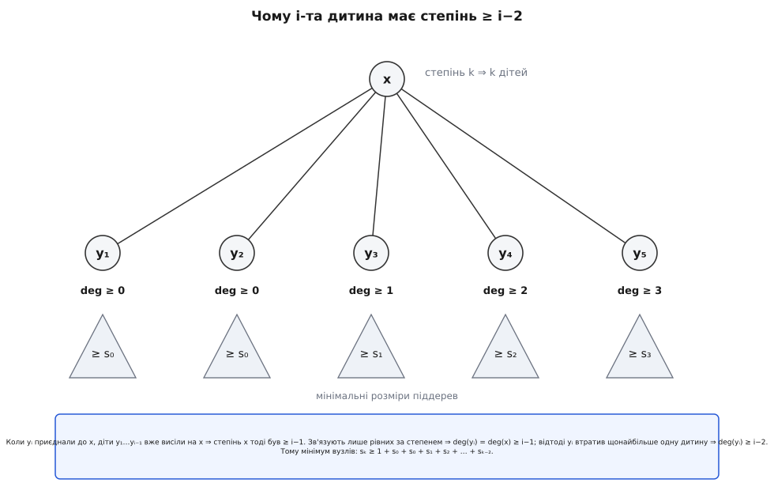
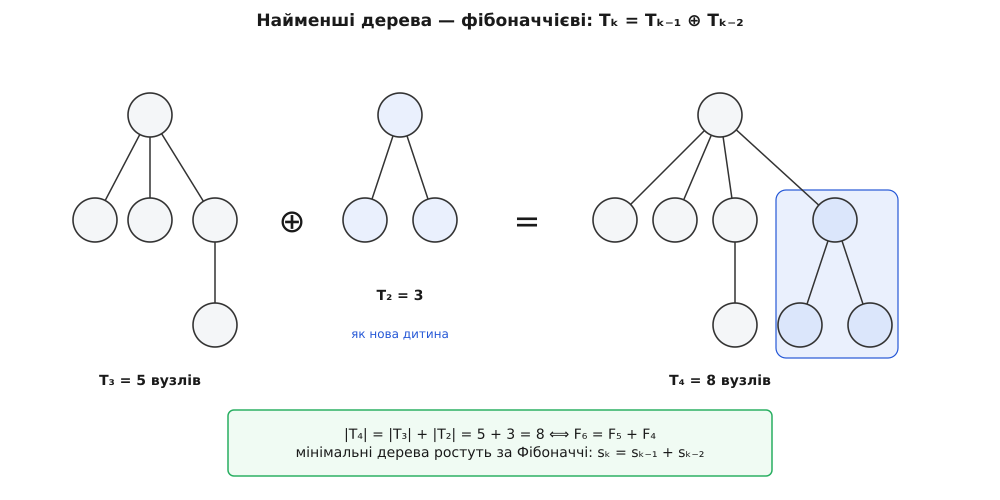

# 🧮 Межа степеня й амортизація: усі викладки

Тут доведено дві числові обіцянки, на яких тримається структура: що найбільший степінь вузла не перевищує ≈ 1.44·log₂ n, і що амортизовані вартості справді такі — O(1) на вставку, злиття та зменшення ключа, O(log n) на вилучення. Обидві виростають з одного-єдиного правила дисципліни розрізів: **не-корінь, утративши другу дитину, сам вилітає в корені**. Інакше кажучи, поки вузол не є коренем, він встигає позбутися щонайбільше однієї дитини — за другу його негайно виривають. Це все, що нам знадобиться; далі — самі викладки.

## Крок 1. i-та дитина має степінь ≥ i−2

Зафіксуймо якийсь вузол x, і нехай його поточний степінь дорівнює k — тобто зараз під ним висить рівно k дітей. Позначимо їх y₁, y₂, …, yₖ, **упорядкувавши за часом приєднання**: y₁ приєднали до x найраніше, yₖ — найпізніше. Твердження, яке доведемо:

```
deg(y₁) ≥ 0     (тривіально)
deg(yᵢ) ≥ i − 2   для  i = 2, 3, …, k
```

Доведення спирається на два факти про те, звідки взагалі беруться діти.

**Факт про зв'язування.** Вузол стає чиєюсь дитиною лише в один момент — під час ущільнення, коли два **корені однакового степеня** зв'язують, і той, чий ключ більший, іде під того, чий менший. Отже, в ту мить, коли yᵢ стало дитиною x, вони мали **однаковий степінь**:

```
deg(yᵢ) = deg(x)   у момент приєднання yᵢ.
```

**Факт про лічбу.** У ту саму мить діти y₁, …, yᵢ₋₁ вже висіли на x — адже за нашим упорядкуванням їх приєднали раніше за yᵢ. Значить, x тоді мав щонайменше i−1 дітей:

```
deg(x) ≥ i − 1   у момент приєднання yᵢ.
```

Складаємо два факти: у момент приєднання deg(yᵢ) = deg(x) ≥ i−1. А відтоді yᵢ увесь час був не-коренем (він же висить під x). За правилом дисципліни не-корінь втрачає щонайбільше одну дитину, перш ніж його самого виріжуть; yᵢ досі на місці, отже, він утратив не більш ніж одну:

```
deg(yᵢ)  ≥  (i − 1) − 1  =  i − 2.
```

Для i = 1 нижня межа порожня (степінь і так ≥ 0). Твердження доведено. Ось уся картина степенів, дитина за дитиною:

```
дитина:    y₁   y₂   y₃   y₄   …   yₖ
deg ≥ :     0    0    1    2   …   k−2
```



*Зв'язують лише рівних за степенем, а в момент приєднання yᵢ під x уже висіли y₁…yᵢ₋₁ — тому deg(yᵢ) тоді був ≥ i−1. Одна дозволена втрата зменшує це щонайбільше на одиницю: deg(yᵢ) ≥ i−2. Найгірший, найощадливіший на вузли випадок — коли кожна нерівність точна.*

## Крок 2. Піддерево степеня k має щонайменше F₍ₖ₊₂₎ вузлів

Тепер від степенів переходимо до **кількості вузлів**. Введімо величину sₖ — **найменше можливе число вузлів** у піддереві, чий корінь має степінь k (мінімум береться по всіх станах, у яких купа взагалі може опинитися за будь-якої послідовності операцій). Прямо з означення sₖ **не спадає** зі зростанням k: дерево з коренем більшого степеня не може мати менше вузлів, ніж дозволяє менший степінь, бо з нього завжди можна прибрати одне піддерево-дитину й дістати корінь меншого степеня з меншим числом вузлів. Дрібні випадки очевидні: s₀ = 1 (сам вузол), s₁ = 2 (вузол та єдина дитина).

Візьмімо тепер вузол степеня k з найощадливішим піддеревом — рівно sₖ вузлів. Його k дітей мають, за Кроком 1, степені щонайменше 0, 0, 1, 2, …, k−2, а їхні піддерева — щонайменше s₀, s₀, s₁, …, sₖ₋₂ вузлів кожне (тут і працює монотонність sₖ). Додаємо сам корінь:

```
sₖ  ≥  1 + s₀ + (s₀ + s₁ + s₂ + … + sₖ₋₂)
    =  2 + (s₀ + s₁ + … + sₖ₋₂).
```

Стверджуємо: sₖ ≥ F₍ₖ₊₂₎, де F — [числа Фібоначчі](root:math-number-theory/fibonacci-numbers) з індексацією F₀ = 0, F₁ = 1, F₂ = 1, F₃ = 2, F₄ = 3, F₅ = 5, … (кожне — сума двох попередніх). Доводитимемо [індукцією](root:math-logic/mathematical-induction) по k; для цього спершу знадобиться одна тотожність про суму Фібоначчі.

**Допоміжна тотожність.** Сума перших чисел Фібоначчі:

```
F₀ + F₁ + … + F_m  =  F₍ₘ₊₂₎ − 1.
```

Доводиться згортанням телескопа: кожне Fᵢ = F₍ᵢ₊₂₎ − F₍ᵢ₊₁₎ (просто переписана рекурента), тож сума ланцюгом скорочується до F₍ₘ₊₂₎ − F₁ = F₍ₘ₊₂₎ − 1.

**Індукція по k.** База: s₀ = 1 = F₂ і s₁ = 2 = F₃ — обидві рівності виконано. Крок: припустимо sⱼ ≥ F₍ⱼ₊₂₎ для всіх j < k і підставмо в нерівність вище:

```
sₖ  ≥  2 + (s₀ + s₁ + … + sₖ₋₂)
    ≥  2 + (F₂ + F₃ + … + F_k)                (припущення індукції)
    =  2 + [ (F₀ + F₁ + … + F_k) − F₀ − F₁ ]
    =  2 + [ (F₍ₖ₊₂₎ − 1) − 0 − 1 ]           (допоміжна тотожність)
    =  F₍ₖ₊₂₎.
```

Індукція замикається точно — доданок «2» з'їдає рівно ту «−2», що лишилася від тотожності. Отже, **sₖ ≥ F₍ₖ₊₂₎**.

Із цього виходить ще й гарний наслідок. Віднявши сусідні оцінки для мінімальних дерев (sₖ = 2 + Σ₀..ₖ₋₂ і sₖ₋₁ = 2 + Σ₀..ₖ₋₃), дістаємо

```
sₖ − sₖ₋₁ = sₖ₋₂   ⟺   sₖ = sₖ₋₁ + sₖ₋₂,
```

тобто найощадливіші дерева ростуть **точно за рекурентою Фібоначчі**, і межа sₖ ≥ F₍ₖ₊₂₎ насправді **досяжна** — існують дерева рівно з F₍ₖ₊₂₎ вузлів. Їх легко описати рекурсивно: щоб з мінімального дерева степеня k−1 зробити мінімальне степеня k, треба додати кореню ще одну дитину найменшого дозволеного степеня k−2 — а нею є мінімальне дерево степеня k−2. Виходить складання Tₖ = Tₖ₋₁ ⊕ Tₖ₋₂ — те саме, за яким живуть самі числа Фібоначчі.



*Найменше дерево степеня 4 — це найменше дерево степеня 3, якому кореню причепили нову дитину: найменше дерево степеня 2. Розміри складаються 5 + 3 = 8 — рівно як F₆ = F₅ + F₄. Тому оцінка й носить ім'я Фібоначчі: найгірший для бушистості випадок відтворює саму послідовність.*

Ось перші значення поруч зі степеневими орієнтирами — видно, як sₖ затиснуте між φᵏ знизу (доведемо далі) і 2ᵏ згори (стільки має біноміальне дерево — інша, найщільніша крайність):

```
k          0     1     2     3     4      5      6      7
sₖ = F₍ₖ₊₂₎ 1     2     3     5     8     13     21     34
φᵏ         1.00  1.62  2.62  4.24  6.85  11.09  17.94  29.03
2ᵏ         1     2     4     8    16     32     64    128
```

## Крок 3. Від Фібоначчі до золотого перетину: D(n) ≤ 1.44·log₂ n

Числа Фібоначчі ростуть експоненційно, і основа цього росту — **золотий перетин** φ = (1 + √5)/2 ≈ 1.618034, додатний корінь рівняння x² − x − 1 = 0. З рівняння одразу маємо ключову властивість, якою скористаємось:

```
φ² = φ + 1.
```

**Лема.** F₍ₖ₊₂₎ ≥ φᵏ для всіх k ≥ 0. Індукція. База: F₂ = 1 = φ⁰ і F₃ = 2 ≥ φ¹ ≈ 1.618 — обидві правильні. Крок для k ≥ 2, розписавши F₍ₖ₊₂₎ за рекурентою і застосувавши припущення до двох попередніх:

```
F₍ₖ₊₂₎ = F₍ₖ₊₁₎ + F_k
       ≥ φᵏ⁻¹ + φᵏ⁻²            (припущення індукції)
       = φᵏ⁻² · (φ + 1)
       = φᵏ⁻² · φ²              (бо φ + 1 = φ²)
       = φᵏ.
```

Отже, зшиваючи Крок 2 і цю лему: **sₖ ≥ φᵏ**. А тепер — головний висновок. Нехай у купі n вузлів, і нехай D(n) — найбільший степінь, що взагалі трапляється серед її вузлів. Той вузол максимального степеня несе під собою піддерево з щонайменше s₍D₎ ≥ φ^D вузлів, і все воно вміщається в купі, тож

```
n  ≥  φ^D(n).
```

Логарифмуємо за основою φ і переводимо в двійковий логарифм:

```
D(n) ≤ log_φ n = log₂ n / log₂ φ
log₂ φ = 0.694242…
1 / log₂ φ = 1.440420…
D(n) ≤ 1.4404 · log₂ n = O(log n).
```

Це та сама логарифмічна межа, що й для дерев, зібраних самими зв'язуваннями (де sₖ ≥ 2ᵏ давало D ≤ log₂ n), лише зі слабшою сталою: основа впала з 2 до φ, тож той самий степінь набирається меншою кількістю вузлів, і межа степеня трохи вища — але й далі **логарифмічна**. Практичний наслідок один і критичний: масив, у який ущільнення розкладає дерева за степенем, має лише O(log n) комірок, і після ущільнення в лісі лишається O(log n) коренів. На цьому тримається вартість вилучення мінімуму.

## Крок 4. Амортизація методом потенціалу

Лишилось порахувати самі вартості. Скористаємось [методом потенціалу](root:computability/amortized-analysis): припишемо купі число Φ — «скарбничку», що більшає, коли ми лишаємо неприбраний безлад, і меншає, коли лад наводимо. Амортизована вартість операції — це її справжня вартість плюс приріст потенціалу: âᵢ = cᵢ + Φᵢ − Φᵢ₋₁. Оскільки на порожній купі Φ = 0 і Φ ніколи не від'ємний, сума амортизованих вартостей мажорує суму справжніх — тож будь-яка оцінка âᵢ згори є чесною межею.

Потенціал беремо такий:

```
Φ = t + 2m,
```

де t — кількість дерев у кореневому списку, m — кількість позначених вузлів. Коефіцієнт «2» біля позначок не випадковий — чому саме двійка, побачимо на зменшенні ключа. Домовмося ще про масштаб одиниці потенціалу: виберімо її настільки великою, щоб справжня стала робота одного розрізу й обробка одного кореня в ущільненні коштували щонайбільше 1 одиницю. Тоді cᵢ можна писати прямо в цих одиницях. Пройдімося операціями.

**Вставка.** Справжня робота O(1): новий однокореневий вузол кидаємо в кореневий список. Дерев побільшало на одне, позначок не чіпали: Δt = +1, Δm = 0, ΔΦ = +1.

```
â = c + ΔΦ = O(1) + 1 = O(1).
```

**Мінімум** (підглянути). Справжня O(1), структура не змінюється, ΔΦ = 0 ⇒ â = O(1).

**Злиття** (union). Зчіплюємо два кореневі списки — справжня O(1). Дерева й позначки просто складаються, тож потенціал об'єднаної купи дорівнює сумі потенціалів доданків: ΔΦ = 0 відносно двох окремих куп ⇒ â = O(1).

**Вилучення мінімуму.** Нехай перед операцією в лісі t дерев, а D = D(n) = O(log n) — межа степеня з Кроку 3. Прибираємо корінь-мінімум, його ≤ D дітей піднімаємо в кореневий список, а тоді ущільнення проходить увесь список і зв'язує рівних. Справжня вартість — це число опрацьованих коренів плюс число зв'язувань, разом щонайбільше t + D одиниць. Після ущільнення на кожен степінь лишається щонайбільше одне дерево, тож t′ ≤ D + 1; позначок не побільшало (зв'язування навіть знімає позначку з нового не-кореня), тож m′ ≤ m. Рахуємо:

```
ΔΦ = (t′ − t) + 2(m′ − m) ≤ (D + 1 − t) + 0 = D + 1 − t
â  = c + ΔΦ ≤ (t + D) + (D + 1 − t) = 2D + 1 = O(D) = O(log n).
```

Дивовижа в тому, що **t скоротилося**. Довгий кореневий список нічого не коштує амортизовано, бо кожен зайвий корінь колись поклала в скарбничку та операція (вставка чи розріз), яка його породила, — плата за прохід уже внесена наперед.

**Зменшення ключа.** Нехай ця операція спричинила c розрізів усього — розріз самого вузла плюс каскадні розрізи вгору. Справжня вартість O(c) ≤ c одиниць. Тепер потенціал.

*Дерева.* Кожен розріз виносить один вузол у кореневий список окремим деревом: Δt = +c.

*Позначки.* Каскад ішов через позначені вузли: кожен із c−1 каскадних розрізів знімає позначку (−(c−1)); каскад завершується тим, що один непозначений вузол дістає позначку (щонайбільше +1); сам вихідний вузол позначку хіба що втрачає (≤ 0). Разом:

```
Δm ≤ 1 − (c − 1) = 2 − c.
```

Складаємо потенціал і амортизовану вартість:

```
ΔΦ = Δt + 2·Δm ≤ c + 2(2 − c) = 4 − c
â  = c + ΔΦ ≤ c + (4 − c) = 4 = O(1).
```

І знову довжина каскаду **c скоротилася** — попри назву-водоспад, зменшення ключа виходить сталим амортизовано.

**Чому саме коефіцієнт 2.** Перевіримо, що двійка біля позначок — не забаганка, а мінімум, за якого викладки взагалі сходяться. Візьмімо Φ = t + a·m із довільним a і повторімо підрахунок зменшення ключа:

```
ΔΦ = Δt + a·Δm ≤ c + a(2 − c)
â  = c + ΔΦ ≤ 2c + a(2 − c) = c·(2 − a) + 2a.
```

Щоб â не залежало від c (інакше довгий каскад був би дорогим), коефіцієнт при c мусить бути ≤ 0, тобто **a ≥ 2**. За a = 2 член із c зникає й лишається â ≤ 4. Двійка — найменше, що годиться, і сенс її прозорий: кожна позначка мусить наперед оплатити два борги вузла, коли того нарешті виріжуть, — одну одиницю за нове дерево, яким він стане в кореневому списку, і одну за те, що, вилетівши, він обкрадає свого батька й тим підживлює каскад далі.

**Вилучення довільного вузла.** Не потребує нового механізму: зменшуємо ключ вузла до −∞ (амортизовано O(1)) — він миттю відрізається в корінь і стає найменшим, — а тоді звичайне вилучення мінімуму його прибирає (амортизовано O(log n)). Разом O(log n).

Зберімо всі рядки разом:

```
операція        справжня      Δt        Δm        ΔΦ = Δt + 2Δm     амортизовано
вставка         O(1)          +1         0            +1               O(1)
мінімум         O(1)           0         0             0               O(1)
злиття          O(1)           0         0             0               O(1)
зменшити ключ   O(c)          +c       ≤ 2 − c       ≤ 4 − c           O(1)
вилучити мін.   O(t + D)    ≤ D+1 − t   ≤ 0        ≤ D + 1 − t         O(log n)
вилучити вузол  = зменшити ключ(−∞) + вилучити мінімум                O(log n)
```

Обидва «дорогі» доданки — довгий кореневий список t і довгий каскад c — щоразу скорочуються з потенціалом, який їх заздалегідь оплатив. Це і є вся арифметика, що перетворює ліниве відкладання ладу на строгі O(1) та O(log n).
