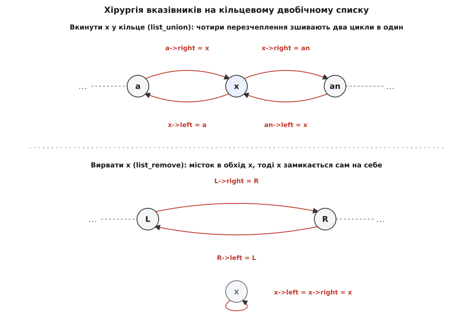

# ⚙️ Фібоначчієва купа: реалізація на C

Ось уся купа кодом, який компілюється, — вузол, кільцеві списки на голих вказівниках і кожна операція від зчеплення дерев до каскадного розрізу, — зібрана так, щоб було видно, де саме на вказівниках найлегше схибити. Теорія каже, *що* має статися; тут воно стає рядками C, і виявляється: майже вся складність не в алгоритмі, а в акуратному зчепленні й розчепленні кілець.

Мова тут не за звичкою. Купа — це структура на вказівниках з ручним керуванням пам'яттю, до того ж вона сидить усередині гарячого циклу мережевих алгоритмів, де кожне зайве розіменування коштує. Потрібна мова, де вузол — це рівно шість полів поспіль у пам'яті, а зчеплення кільця — три присвоєння, а не виклик з прихованими накладними. Тому C.

## Що будуємо

Набір операцій — рівно той, що його обіцяє структура:

- `insert` — вкинути новий ключ;
- `minimum` — підглянути найменший, не чіпаючи купи;
- `union` — злити дві купи в одну;
- `extract_min` — вилучити найменший, заразом ущільнивши ліс;
- `decrease_key` — зменшити ключ вузла, з розрізом і, якщо треба, каскадом;
- `delete` — вилучити **будь-який** вузол, не лише найменший.

Одна деталь інтерфейсу вирішальна: `insert` повертає вказівник на створений вузол. Без нього потім не буде за що вхопитися, щоб зменшити ключ чи вилучити саме цей елемент, — адже в купі нема пошуку за ключем. Викликач тримає вказівник сам.

## Одна примітива, на якій тримається все: кільце

Перше, що варто зробити перед будь-якою операцією, — прибрати з коду всі перевірки `NULL`-кінців списку. Купа наскрізь побудована на **кільцевих двобічно зв'язаних списках** (кореневий список, списки дітей), і найдешевший спосіб з ними працювати — домовитися, що **самотній вузол замкнений сам на себе**: `left` і `right` показують на нього ж. Тоді список ніколи не буває «порожнім кінцем»: у ньому завжди принаймні один вузол, який знає лівого й правого сусіда, — навіть якщо це він сам.

Виграш від цієї домовленості величезний: **дві** примітиви покривають усі зчеплення в усій купі, і жодна не потребує окремого випадку на список з одного вузла.

```c
#include <stdio.h>
#include <stdlib.h>
#include <stdbool.h>
#include <limits.h>
#include <math.h>

typedef struct Node {
    int  key;                  // ключ (за ним упорядкування)
    int  degree;               // кількість безпосередніх дітей
    bool mark;                 // чи втратив дитину, відколи став не-коренем
    struct Node *parent;       // батько (NULL у кореня)
    struct Node *child;        // одна з дітей (решта — через її кільце)
    struct Node *left, *right; // сусіди в кільці (кореневому чи дитячому)
} Node;

// Вкинути кільце вузла b одразу після a (обидва — у якихось кільцях).
// Коли b самотній, це просто вставляє b між a та a->right.
static void list_union(Node *a, Node *b) {
    Node *a_next = a->right;
    Node *b_prev = b->left;
    a->right = b;
    b->left  = a;
    b_prev->right = a_next;
    a_next->left  = b_prev;
}

// Вирвати x із його кільця; x лишається замкненим сам на себе.
static void list_remove(Node *x) {
    x->left->right = x->right;
    x->right->left = x->left;
    x->left = x->right = x;    // тепер x — самотнє кільце
}
```

Придивімося, чому цих двох досить. `list_union(a, b)` зшиває два кільця в одне: розриває зв'язок `a → a_next`, розриває `b_prev → b`, і перехрещує кінці так, що виходить один суцільний цикл. Якщо `b` самотній (`b->left == b`), то `b_prev == b`, і те саме присвоєння просто вставляє `b` між `a` та його правим сусідом — той самий код, ніякого `if`. Тому «вкинути новий вузол у кореневий список» і «злити два кореневі списки» — це **один** виклик.

`list_remove(x)` містком з'єднує сусідів `x` в обхід нього, а тоді замикає сам `x` на себе — щоб вирваний вузол одразу став правильним самотнім кільцем, готовим переїхати кудись іще. Якщо `x` був єдиний у кільці (`x->left == x`), обидва місткові присвоєння — тотожності, і виходить чистий no-op: безпечно.



*Уся робота з кільцями — це ці дві дії. Вкинути: чотири перезчеплення зшивають два цикли в один. Вирвати: місток в обхід вузла плюс замикання його самого на себе. Самотній вузол замкнений на себе — тому обидві примітиви працюють і для списку з одним елементом, без жодної перевірки на `NULL`.*

Створення вузла тримається тієї ж домовленості — новачок одразу замкнений сам на себе:

```c
static Node *make_node(int key) {
    Node *x = malloc(sizeof(Node));
    x->key = key;  x->degree = 0;  x->mark = false;
    x->parent = NULL;  x->child = NULL;
    x->left = x->right = x;         // самотнє кільце з одного вузла
    return x;
}
```

Сама купа — це лише вказівник на найменший корінь і лічильник вузлів (він знадобиться, щоб оцінити найбільший можливий степінь):

```c
typedef struct { Node *min; int n; } FibHeap;

static FibHeap *fib_make(void) {
    FibHeap *h = malloc(sizeof(FibHeap));
    h->min = NULL;  h->n = 0;
    return h;
}
```

## Дешева трійця: insert, minimum, union

Три операції — сталого часу, бо кожна лише зчіплює кільця й, можливо, пересуває `min`. Ніякого впорядкування.

```c
// Вставити ключ. Повертає вузол — щоб потім можна було decrease/delete.
static Node *fib_insert(FibHeap *h, int key) {
    Node *x = make_node(key);
    if (h->min == NULL) {
        h->min = x;                 // x уже сам собі кореневий список
    } else {
        list_union(h->min, x);      // вкинути в кореневий список
        if (x->key < h->min->key) h->min = x;
    }
    h->n++;
    return x;
}

// Підглянути мінімум — вказівник уже націлено.
static Node *fib_minimum(FibHeap *h) { return h->min; }

// Злити дві купи: зшити кореневі списки, лишити менший min. Поглинає b.
static FibHeap *fib_union(FibHeap *a, FibHeap *b) {
    if (a->min == NULL) { free(a); return b; }
    if (b->min == NULL) { free(b); return a; }
    list_union(a->min, b->min);     // два ліси зростаються в один
    if (b->min->key < a->min->key) a->min = b->min;
    a->n += b->n;
    free(b);
    return a;
}
```

Весь тягар зсунуто в одну-єдину операцію — вилучення мінімуму. Саме там борг за всі ці дешеві вкидання й повертають.

## Вилучення мінімуму й ущільнення

Вилучити мінімум — це три дії: підняти дітей вирваного кореня в кореневий список, прибрати сам корінь, а тоді, скориставшись тим, що ми **однаково змушені** пройти весь кореневий список у пошуках нового мінімуму, заразом стиснути ліс. Стиснення (ущільнення) підкоряється одному правилу: **не лишити двох дерев однакового степеня**.

Спершу дві допоміжні дії. Найбільший можливий степінь обмежений зверху: дерево степеня k має щонайменше φᵏ вузлів (φ ≈ 1.618 — золотий перетин, і саме тут у гру входять [числа Фібоначчі](root:math-number-theory/fibonacci-numbers)), тож `k ≤ log_φ n ≈ 1.44·log₂ n`. Отже, для масиву «дерево такого-то степеня» досить `O(log n)` комірок:

```c
static int max_degree(int n) {
    if (n < 2) return 1;
    double phi = (1.0 + sqrt(5.0)) / 2.0;   // золотий перетин
    return (int)(log((double)n) / log(phi)) + 1;   // з запасом на одиницю
}
```

І саме **зчеплення** двох дерев одного степеня: те, чий корінь має більший ключ, стає дитиною меншого (властивість купи не страждає), степінь переможця росте на одиницю.

```c
// Зробити y дитиною x (обидва були коренями, x->key <= y->key).
static void fib_link(Node *y, Node *x) {
    list_remove(y);                 // y виходить із кореневого списку
    y->parent = x;
    if (x->child == NULL) x->child = y;   // y уже самотнє кільце
    else list_union(x->child, y);         // вкинути y в дитяче кільце x
    x->degree++;
    y->mark = false;                // свіжа дитина — без позначки
}
```

Тепер саме ущільнення. Тонкість, на якій легко впасти: **linking переплітає кореневий список під час обходу** — щойно ми зчепимо два дерева, кільце вже не те, і йти «наживо» по `right`-вказівниках не можна. Тому спершу знімаємо **знімок** кореневого списку в масив, а вже тоді обробляємо його, не боячись, що земля попливе під ногами.

```c
static void fib_consolidate(FibHeap *h) {
    int Dn = max_degree(h->n);
    Node **A = calloc(Dn + 1, sizeof(Node *));   // A[d] — корінь степеня d або NULL

    // Знімок кореневого списку (linking переплете кільце на ходу).
    int nroots = 0;
    Node *w = h->min;
    do { nroots++; w = w->right; } while (w != h->min);
    Node **roots = malloc(nroots * sizeof(Node *));
    w = h->min;
    for (int i = 0; i < nroots; i++) { roots[i] = w; w = w->right; }

    // Розкладаємо дерева за степенем; двоє одного степеня — зчіплюємо.
    for (int i = 0; i < nroots; i++) {
        Node *x = roots[i];
        int d = x->degree;
        while (A[d] != NULL) {
            Node *y = A[d];                       // уже є дерево степеня d
            if (y->key < x->key) { Node *t = x; x = y; y = t; }  // x — менший ключ
            fib_link(y, x);                       // y під x; степінь x виріс
            A[d] = NULL;
            d++;                                  // переїхали в наступну комірку
        }
        A[d] = x;
    }

    // Зібрати кореневий список наново з масиву й заново знайти min.
    h->min = NULL;
    for (int i = 0; i <= Dn; i++) {
        if (A[i] == NULL) continue;
        A[i]->left = A[i]->right = A[i];          // від'єднати від старих сусідів
        if (h->min == NULL) h->min = A[i];
        else {
            list_union(h->min, A[i]);
            if (A[i]->key < h->min->key) h->min = A[i];
        }
    }
    free(A);  free(roots);
}
```

Чому наприкінці кореневий список **збирають наново**, а не лишають як є? Бо вцілілі в `A[]` корені досі носять `left`/`right`, що вказують у розтерзане linking'ом старе кільце. Найпростіше й найнадійніше — від'єднати кожного (`left = right = self`) і зшити чистий новий цикл. Заразом і `min` знаходиться дорогою.

Маючи ці дві дії, саме вилучення мінімуму коротке:

```c
static Node *fib_extract_min(FibHeap *h) {
    Node *z = h->min;
    if (z == NULL) return NULL;

    if (z->child != NULL) {              // піднімаємо дітей z у кореневий список
        Node *c = z->child;
        do { c->parent = NULL; c = c->right; } while (c != z->child);
        list_union(z, z->child);         // ціле дитяче кільце — в кореневе
    }

    if (z->right == z) {                 // z був єдиним коренем (уже без дітей)
        h->min = NULL;
    } else {
        h->min = z->right;               // тимчасово; consolidate виправить
        list_remove(z);
        fib_consolidate(h);
    }
    h->n--;
    return z;
}
```

Зверни увагу на порядок: перевірку «z був єдиний» роблять **після** підняття дітей. Якщо в z були діти, після `list_union(z, z->child)` вузол `z->right` — це вже перша дитина, тож ми правильно йдемо в гілку `else`, вирываємо `z` і ущільнюємо ліс, у якому тепер сидять колишні діти.

## Зменшення ключа: розріз і каскад

Заради цієї операції все й будувалося. Зменшили ключ; якщо він і далі не менший за батьків — купа лишилась купою. Якщо став меншим — **відрізаємо** вузол разом з піддеревом і переносимо в кореневий список: щойно він корінь, порушувати нема чого.

Розріз — та сама хірургія кілець, тільки з двома додатковими дрібницями, на яких спотикаються найчастіше: правильно зняти батьків вказівник `child`, якщо він указував саме на цей вузол, і зробити це **до** `list_remove`, поки `x->right` іще веде до сусіда.

```c
static void fib_cut(FibHeap *h, Node *x, Node *y) {
    // 1. Від'єднати x від дитячого кільця y.
    if (y->child == x)                          // саме x був «тим самим» вказівником?
        y->child = (x->right == x) ? NULL : x->right;   // перевести на сусіда або обнулити
    list_remove(x);
    y->degree--;
    // 2. x стає окремим деревом у кореневому списку.
    list_union(h->min, x);
    x->parent = NULL;
    x->mark = false;                            // корені не позначають
}
```

Розрізи обкрадають батьків, і якщо дозволити це безкарно, дерева виродяться в ниточки. Тримає їх бушистими правило **позначки**: перша втрата дитини — просто позначка; друга — виліт самого вузла в корінь, а розріз **котиться вгору** тим самим правилом. Це й є каскадний розріз, і в коді він природно рекурсивний:

```c
static void fib_cascading_cut(FibHeap *h, Node *y) {
    Node *z = y->parent;
    if (z != NULL) {
        if (!y->mark) {
            y->mark = true;             // перша втрата — лише позначка
        } else {
            fib_cut(h, y, z);           // друга втрата — ріжемо y теж
            fib_cascading_cut(h, z);    // і котимося до батька
        }
    }
}
```

Саме зменшення ключа зшиває це докупи. Після можливого розрізу лишається оновити `min`, якщо новий корінь виявився найменшим, — а от корені, що прилетіли каскадом, перевіряти на мінімум не треба: за властивістю купи вони не менші за той корінь, під яким сиділи, отже, не менші за поточний `min`.

```c
static void fib_decrease_key(FibHeap *h, Node *x, int newkey) {
    if (newkey > x->key) return;        // тільки зменшення
    x->key = newkey;
    Node *y = x->parent;
    if (y != NULL && x->key < y->key) { // порядок порушено — ріжемо
        fib_cut(h, x, y);
        fib_cascading_cut(h, y);
    }
    if (x->key < h->min->key) h->min = x;
}
```

## Вилучення будь-якого вузла через −∞

Маючи дешеве зменшення ключа й готове вилучення мінімуму, вилучення довільного вузла дістається задарма, одним ходом: зменшуємо його ключ до −∞ — він миттю відрізається в корінь і стає новим мінімумом, — а тоді звичайне вилучення мінімуму його прибирає.

```c
static void fib_delete(FibHeap *h, Node *x) {
    fib_decrease_key(h, x, INT_MIN);    // −∞
    Node *z = fib_extract_min(h);       // тепер x — це min
    free(z);
}
```

`INT_MIN` тут грає роль −∞ і працює, **поки жоден справжній ключ не дорівнює `INT_MIN`**. У бойовому коді для цього тримають окремий прапорець «мінус безмежність» на вузлі або гарантують, що таких ключів у купі нема.

## Демонстрація

Зберемо все й проженемо просту послідовність. Викликач тримає вказівники на ті вузли, які збирається пізніше зменшити чи вилучити.

```c
int main(void) {
    FibHeap *h = fib_make();
    int keys[] = {7,3,17,24,23,26,46,30,18,52,41,44,21,39,45};
    Node *n46 = NULL, *n30 = NULL;
    for (int i = 0; i < 15; i++) {
        Node *nd = fib_insert(h, keys[i]);
        if (keys[i] == 46) n46 = nd;
        if (keys[i] == 30) n30 = nd;
    }

    printf("min = %d\n", fib_minimum(h)->key);                 // 3

    Node *a = fib_extract_min(h); printf("вилучено %d\n", a->key); free(a);  // 3
    Node *b = fib_extract_min(h); printf("вилучено %d\n", b->key); free(b);  // 7

    fib_decrease_key(h, n46, 5);                               // 46 → 5
    Node *c = fib_extract_min(h); printf("вилучено %d\n", c->key); free(c);  // 5

    fib_delete(h, n30);                                        // прибрати вузол 30
    Node *d = fib_extract_min(h); printf("вилучено %d\n", d->key); free(d);  // 17

    printf("решта:");
    Node *m;
    while ((m = fib_extract_min(h)) != NULL) { printf(" %d", m->key); free(m); }
    printf("\n");
    free(h);
    return 0;
}
```

Компілюємо (потрібен `-lm` через `sqrt`/`log`) — `gcc fib.c -lm` — і дістаємо:

```
min = 3
вилучено 3
вилучено 7
вилучено 5
вилучено 17
решта: 18 21 23 24 26 39 41 44 45 52
```

Порядок вилучень — надійний спосіб перевірити купу: `extract_min` завжди віддає поточний глобальний мінімум, тож після зменшення 46 до 5 наступним виходить саме 5, а спорожнення купи наприкінці дає рівно неспадну послідовність.

## Складність по операціях

Складімо вартості. Дві колонки не збігаються, і ця розбіжність — головна практична правда про фібоначчієву купу: **окремий** виклик може бути дорогим, а гарантія стосується [амортизованої](root:computability/amortized-analysis) вартості — усередненої по всій послідовності операцій.

```
Операція       Тіло                             Амортизовано   Один найгірший виклик
insert         вкинути в кільце                 O(1)           O(1)
minimum        повернути min                    O(1)           O(1)
union          зшити два кільця                 O(1)           O(1)
extract_min    підняти дітей + ущільнення       O(log n)       O(n)
decrease_key   розріз + каскад угору            O(1)           O(log n)
delete         decrease_key(−∞) + extract_min   O(log n)       O(n)
```

Один `extract_min` може коштувати `O(n)`, коли кореневий список за час роботи розрісся й ущільнення мусить пройти його весь; але кожен зайвий корінь колись **вкинула** туди вставка чи розріз і сплатила за нього наперед, тож усереднено виходить `O(log n)`. Дзеркально: один `decrease_key` може прокотити каскад через `O(log n)` вузлів, але кожен такий розріз уже оплачено позначкою, поставленою колись раніше, — усереднено `O(1)`. Саме на цій різниці «дорого зрідка, дешево постійно» й тримається весь виграш структури.

## Пастки

Майже всі помилки в цьому коді — не в алгоритмі, а в дрібницях зчеплення. Ось ті, на яких спотикаються найчастіше.

- **Кільце, а не `NULL`-кінці.** Новий вузол мусить бути замкнений сам на себе (`left = right = self`). Забути це — і перше ж `list_union` прочитає сміття замість сусіда. Уся вигода двох примітивів тримається на цій домовленості.
- **Порядок у `fib_cut`.** Батьків вказівник `child` знімають *до* `list_remove(x)`: після вирвання `x->right` вже не веде до сусіда, і `y->child` лишиться показувати на вузол, якого в кільці більше нема.
- **Знімок перед ущільненням.** Linking переплітає кореневе кільце на ходу; обхід «наживо» по `right` зіб'ється. Спершу зібрати всі корені в масив, тоді обробляти.
- **Кореневий список збирають наново.** Уцілілі в `A[]` корені носять застарілі сусідні вказівники — кожного від'єднати (`left = right = self`) перед `list_union`, інакше в новому кільці лишаться зчеплення зі старими, уже-дітьми.
- **`min` і `degree` — руками.** Ніщо не оновлює їх само. `min` переставляти після кожної дії, що могла народити менший корінь; `degree` міняти в парі з фактичним зчепленням (`link`: `++`) чи розрізом (`cut`: `--`). Розбіжність `degree` з реальним числом дітей ламає ущільнення.
- **`mark` — тільки на не-коренях.** `link` і `cut` знімають позначку, коли вузол стає (від)дитиною або коренем. Забути зняти — і згодом фальшива позначка спричинить зайвий каскад.
- **Розмір масиву `A`.** Індексуємо за степенем, а він доходить до `log_φ n`; замалий масив дасть вихід за межі під час linking. Межу рахують з `n`, із запасом.
- **−∞ у `delete`.** `INT_MIN` як −∞ безпечний, лише поки жоден справжній ключ не дорівнює `INT_MIN`; інакше `extract_min` після `decrease_key` вилучить не той вузол.
