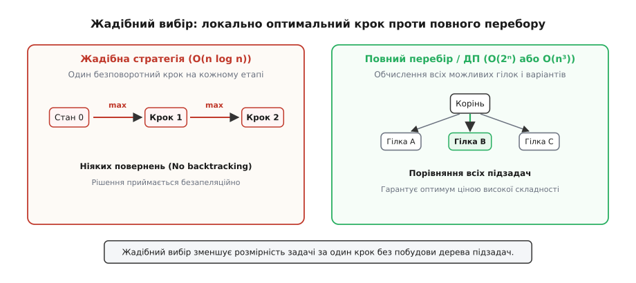
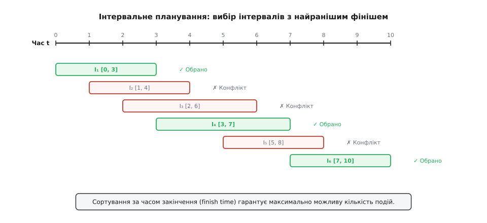
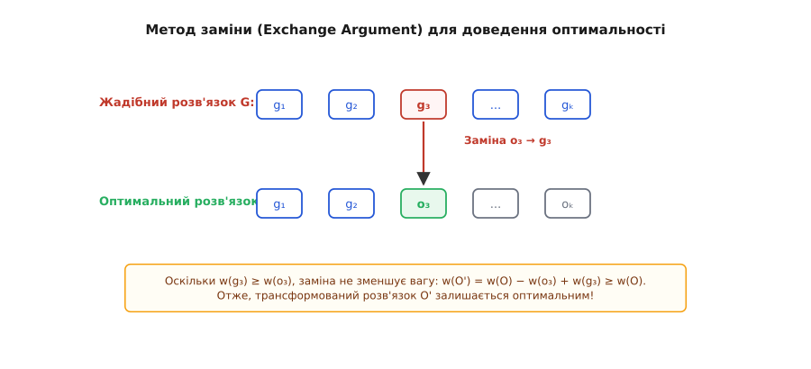

# Жадібні алгоритми

<preknowlist>
- [Асимптотична складність (нотація O великого)](topic:computability/asymptotic-complexity) — O(n log n), оцінка часу виконання та обсягу пам'яті.
- [Динамічне програмування](topic:sf-algorithms/dynamic-programming) — порівняння з локально-оптимальним вибором проти повного перебору підзадач.
</preknowlist>

Уявіть собі пішохода, який у густому ранковому тумані намагається піднятися на найвищу вершину незнайомого гірського масиву. Зіткнувшись із тим, що далі трьох кроків нічого не видно, він вирішує дотримуватися найпростішого правила: на кожному розпутті робити крок у напрямку найкрутішого підйому безпосередньо під ногами. Він не зупиняється для складання детальної карти всього регіону, не розраховує тисячі можливих маршрутів і не повертається назад, якщо стежка стає пологішою. Він робить локально найкращий вибір просто зараз.

Саме в цьому полягає суть **жадібної стратегії** в комп'ютерних науках. Жадібний алгоритм — це підхід до розв'язання задач комбінаторної оптимізації, в якому на кожному кроці приймається локально найвигідніше (найдешевше, найшвидше або найцінніше) рішення в надії, що послідовність таких локальних виборів приведе до глобального оптимального результату.

Головна перевага жадібного підходу — **колосальна обчислювальна економія**. Замість побудови складних дерев рішень, аналізу мільйонів варіантів або збереження проміжних станів у пам'яті, жадібний алгоритм рухається строго вперед. Він зменшує розмірність задачі за один крок, досягаючи вражаючої швидкодії O(n log n) або O(n) там, де повний перебір вимагав би експоненційного часу O(2ⁿ) чи факторіального O(n!).

Проте у цієї привабливої простоти є зворотний бік: жадібність сліпа. Зробивши локальний вибір, алгоритм спалює за собою мости й більше ніколи не переглядає прийнятих рішень. Якщо локально вигідний крок заводить у глухий кут або блокує доступ до кращих майбутніх альтернатив, алгоритм зазнає краху. Тому головне мистецтво алгоритміста полягає не стільки в написанні жадібного коду, скільки у здатності **строго довести**, що для даної задачі локальна жадібність гарантовано дає абсолютний глобальний оптимум.

---

## 1. Анатомія жадібного підходу: два стовпи оптимальності

Щоб жадібний алгоритм давав точний глобальний оптимум, задача повинна мати дві фундаментальні математичні властивості: **властивість жадібного вибору** та **оптимальну підструктуру**.

```
                           ┌──────────────────────────────────────────────┐
                           │          Контекст оптимізації                │
                           └──────────────────────┬───────────────────────┘
                                                  │
                                                  ▼
                        ┌───────────────────────────────────────────────────┐
                        │      1. Властивість жадібного вибору             │
                        │ Локально найкращий крок є частиною глобального     │
                        │ оптимуму (без погляду в майбутнє).               │
                        └─────────────────────────┬─────────────────────────┘
                                                  │
                                                  ▼
                        ┌───────────────────────────────────────────────────┐
                        │        2. Оптимальна підструктура                 │
                        │ Після локального вибору залишається точно така ж   │
                        │ підзадача меншого розміру.                        │
                        └───────────────────────────────────────────────────┘
```

### Властивість жадібного вибору (Greedy-Choice Property)
Це можливість сформулювати глобально оптимальний розв'язок, роблячи локально оптимальний (жадібний) вибір на кожному кроці. На відміну від [Динамічного програмування](topic:sf-algorithms/dynamic-programming), де розв'язок поточної підзадачі залежить від вже обчислених підзадач меншого розміру (рух знизу вгору або зверху вниз із порівнянням варіантів), жадібний алгоритм робить вибір **до** розв'язання будь-яких підзадач. 

Алгоритм обирає елемент, який здається найкращим у дану секунду, і тим самим безповоротно зменшує вихідну задачу до однієї єдиної підзадачі меншої розмірності.

### Оптимальна підструктура (Optimal Substructure)
Задача має оптимальну підструктуру, якщо оптимальний розв'язок всієї задачі містить у собі оптимальні розв'язки її підзадач. Для жадібного алгоритму це означає наступне: якщо ми зробили перший жадібний вибір g₁, то об'єднання цього вибору з оптимальним розв'язком решти задачі дає оптимальний розв'язок вихідної задачі.

Наочно різницю між локально жадібним кроком та повним перебором рішень показує наступна схема:


*Рис. 1. Жадібна стратегія обирає єдиний локально найкращий крок і зменшує розмірність задачі без повернень. Повний перебір або динамічне програмування вимушені будувати й оцінювати всі гілки підзадач.*

### Жадібні алгоритми проти ДП та пошуку з поверненням

Щоб чітко уявити місце жадібних алгоритмів серед інших парадигм проектирования, порівняємо їхню поведінку під час вирішення однієї й тієї ж проблеми:

- **Пошук із поверненням (Backtracking):** Перебирає всі можливі варіанти. Зробивши крок, алгоритм йде вглиб; якщо виявлено недопустимий стан або поганий результат, він повертається назад (backtrack) і випробовує інші гілки. Складність — зазвичай O(2ⁿ) або O(n!).
- **Динамічне програмування (Dynamic Programming):** Порівнює результати всіх допустимих альтернативних виборів на кожному кроці, зберігаючи рішення перекриваних підзадач у таблиці. Вносячи елемент пам'яті, ДП гарантує точний оптимум ціною часової складності O(n · W) та додаткової пам'яті.
- **Жадібний алгоритм (Greedy Algorithm):** Не перебирає альтернативи й не будує таблиць. Він робить один-єдиний локально вигідний вибір і переходить до наступного кроку. Складність — зазвичай O(n log n) або O(n), додаткова пам'ять — O(1).

---

## 2. Класичний приклад: Інтервальне планування (Interval Scheduling)

Найкращим способом зрозуміти механізм жадібного вибору є класична задача про **інтервальне планування** (Interval Scheduling Problem).

### Постановка задачі
Уявіть, що ви керуєте орендою конференц-залу. Протягом дня надійшло n заявок на проведення заходів. Кожна заявка i описується часом початку sᵢ та часом закінчення fᵢ (sᵢ < fᵢ). Одночасно в залі може проходити лише один захід. Якщо дві події перетинаються в часі (наприклад, одна триває від 10:00 до 12:00, а інша від 11:00 до 13:00), ви змушені відхилити принаймні одну з них.

**Мета:** Вибрати таку підмножину подій максимального розміру, щоб жодні дві обрані події не перетиналися за часом.

```
Часова вісь: 0 ─── 1 ─── 2 ─── 3 ─── 4 ─── 5 ─── 6 ─── 7 ─── 8 ─── 9 ─── 10
Подія 1:     [======] (0..3)   -> ОБРАНО (найраніший фініш f=3)
Подія 2:        [======] (1..4) -> КОНФЛІКТ
Подія 3:           [==========] (2..6) -> КОНФЛІКТ
Подія 4:                [==========] (3..7) -> ОБРАНО (старт 3 >= фініш 3, новий фініш f=7)
Подія 5:                     [======] (5..8) -> КОНФЛІКТ
Подія 6:                         [==========] (7..10) -> ОБРАНО (старт 7 >= фініш 7)
```

### Пастки інтуїції: чому очевидні евристики зазнають поразки

Коли людина вперше стикається з цією задачею, природні інтуїтивні здогадки часто виявляються помилковими:

1. **Евристика 1: Обирати найкоротшу подію (найменша тривалість fᵢ − sᵢ).**  
   *Чому це помилка?* Уявимо одну коротку подію [4, 6] і дві довші події [1, 5] та [5, 9]. Коротка подія [4, 6] перетинається з обома довшими. Жадібний вибір за тривалістю візьме [4, 6] (всього 1 подія), тоді як оптимум — взяти дві події [1, 5] та [5, 9].

2. **Евристика 2: Обирати подію з найранішим початком (найменше sᵢ).**  
   *Чому це помилка?* Уявимо першу подію [0, 100], яка покриває увесь день, і десять коротких подій [1, 2], [2, 3], ..., [9, 10]. Вибір найранішого початку візьме [0, 100] (1 подія) і заблокує всі інші, втрачаючи оптимум з 10 подій.

3. **Евристика 3: Обирати подію з найменшою кількістю конфліктів.**  
   *Чому це помилка?* Існують конструйовані набори інтервалів, де подія з найменшою кількістю перетинів заводить алгоритм у локальну пастку, блокуючи дві більші групи несумісних між собою подій.

### Правильний жадібний критерій: Найраніший час закінчення (Earliest Finish Time)

Правильне жадібне правило звучить так: **На кожному кроці обирай сумісну подію, яка закінчується найраніше за всіх (мінімальне fᵢ).**

**Логічне «ЧОМУ»:** Обираючи подію, що закінчується найраніше, ми залишаємо максимально можливий залишок часу для всіх наступних подій. Це дає найбільшу свободу вибору на майбутнє.


*Рис. 2. Процес вибору інтервалів за часом закінчення. Заходи, що конфліктують із вже обраними, відкидаються.*

### Кроки алгоритму
1. Впорядкувати всі n інтервалів за зростанням часу закінчення fᵢ.
2. Додати перший інтервал у список обраних, запам'ятати його час закінчення `last_finish = f₁`.
3. Послідовно переглянути решту інтервалів: якщо `sᵢ ≥ last_finish`, додати інтервал до розв'язку та оновити `last_finish = fᵢ`.

Часова складність алгоритму диктується сортуванням: **O(n log n)**. Сам жадібний прохід виконується за **O(n)**.

---

## 3. Коли жадібність ламається: Розмін монет і рюкзак

Незважаючи на високу швидкість, жадібний алгоритм непридатний для багатьох задач. Розглянемо два класичні приклади, де локальна жадібність опиняється в тупику.

### Задача про розмін монет (Coin Change Problem)

Необхідно видати решту сумою N, використовуючи мінімальну кількість монет заданих номіналів.

- **Канонічна система номіналів (наприклад, гривні: 1, 2, 5, 10, 20, 50, 100, 200, 500):**  
  Жадібна стратегія «щоразу брати найбільшу монету, яка не перевищує залишок» працює **ідеально та дає точний оптимум**.
  *Приклад:* Видати 87 грн → 50 + 20 + 10 + 5 + 2 (всього 5 монет).

- **Неканонічна система номіналів (наприклад: {1, 3, 4}):**  
  Необхідно видати суму **6**.
  - **Жадібний вибір:** Бере найбільшу монету 4, залишок 2. Потім бере 1 і 1. Разом: **4 + 1 + 1 (3 монети)**.
  - **Глобальний оптимум:** Взяти дві монети по 3. Разом: **3 + 3 (2 монети)**.

Жадібний вибір монети 4 виявився «надто жадібним»: він залишив незручний залишок 2, який довелося заповнювати дрібними одиницями. У неканонічних системах локальний оптимум не гарантує глобального. Для знаходження істинного мінімуму необхідно застосовувати [Динамічне програмування](topic:sf-algorithms/dynamic-programming).

### Дробовий рюкзак проти 0/1 Рюкзака

Порівняння двох варіантів задачі про рюкзак чітко проводить межу застосовності жадібного підходу:

```
                            Задачі про рюкзак
                                    │
           ┌────────────────────────┴────────────────────────┐
           ▼                                                 ▼
  Дробовий рюкзак (Fractional)                      Дискретний 0/1 рюкзак
  Предмети можна ділити (пісок, олія).              Предмет беруть цілком або ні.
  Жадібність за питомою цінністю (v/w)              Жадібність ЛАМАЄТЬСЯ через
  ДАЄ ТОЧНИЙ ОПТИМУМ за O(n log n).                 порожній залишок місткості.
                                                    Вимагає ДП O(n·W).
```

1. **Дробовий рюкзак (Fractional Knapsack):**  
   Предмети можна ділити на будь-які дробові частини (наприклад, сипучі продукти чи рідини). Кожен предмет має вагу wᵢ та цінність vᵢ.  
   *Жадібне правило:* Сортуємо предмети за **питомою цінністю** pᵢ = vᵢ / wᵢ (ціна за 1 кг) і беремо предмети з найбільшою питомою цінністю повністю, а останній — скільки влізе.  
   **Результат:** Жадібний алгоритм гарантує точний оптимум за час O(n log n).

2. **Дискретний 0/1 Рюкзак (0/1 Knapsack):**  
   Кожен предмет є неподільним (цілісний прилад, неподільна деталь): його можна або взяти повністю, або залишити.  
   *Чому жадібність за vᵢ / wᵢ ламається?* Припустимо, місткість рюкзака W = 50 кг.
   - Предмет 1: вага 10 кг, цінність 60 (питома = 6.0)
   - Предмет 2: вага 20 кг, цінність 100 (питома = 5.0)
   - Предмет 3: вага 30 кг, цінність 120 (питома = 4.0)

   Жадібний алгоритм обере Предмет 1 (вага 10, цінність 60) через найвищу питому цінність. Впевнившись, що залишилося 40 кг місткості, він додасть Предмет 2 (вага 20, цінність 100). Залишиться 20 кг вільних, але Предмет 3 (30 кг) вже не влазить! Підсумок жадібного вибору: Предмети 1 і 2, загальна цінність = **160**.

   Проте оптимум — ігнорувати Предмет 1 і взяти Предмети 2 і 3 (загальна вага 20 + 30 = 50 кг, загальна цінність = **220**). Порожнє місце, залишене після вибору Предмета 1, знівелювало його високу питому цінність.

---

## 4. Доведення оптимальності: Метод заміни (Exchange Argument)

Як математично переконатися, що ваш жадібний алгоритм правильний? Стандартним і найпотужнішим інструментом доведення є **метод заміни** (Exchange Argument).

### Схема доведення методом заміни
1. **Припущення від супротивного:** Позначимо розв'язок, згенерований жадібним алгоритмом, як G = {g₁, g₂, ..., gₖ}. Припустимо, що G не є оптимальним, і існує певний справжній гіпотетичний оптимум O = {o₁, o₂, ..., oₘ}.
2. **Пошук першої відмінності:** Знайдемо перший крок (індекс i), на якому жадібний розв'язок G та оптимальний розв'язок O розходяться: gᵢ ≠ oᵢ.
3. **Конструювання заміни:** Замінимо елемент oᵢ у розв'язку O на жадібний елемент gᵢ, утворивши новий розв'язок O'.
4. **Доведення непогіршення:** Доведемо, що новий розв'язок O' є допустимим і його якість (вага/цінність) **не гірша** за якість O: cost(O') ≥ cost(O).
5. **Індуктивний перехід:** Повторюючи заміну для всіх відмінностей, ми трансформуємо гіпотетичний оптимум O у жадібний розв'язок G, не зменшуючи підсумкової якості. Отже, G також є оптимальним розв'язком!


*Рис. 3. Візуалізація методом заміни: послідовна заміна відмінностей у гіпотетичному оптимумі O елементами жадібного розв'язку G без втрати загальної якості.*

Детальне формальне алгебраїчне доведення теореми Радо — Едмондса та структури матроїдів винесено в окрему математичну вставку: [Теорія матроїдів та формальне доведення оптимальності жадібного вибору](topic:sf-algorithms/greedy-algorithms/math-matroid-greedy.md).

---

## 5. Зведена таблиця складності та характеристик

Порівняємо основні властивості трьох ключових парадигм оптимізаційних алгоритмів:

| Критерій | Жадібні алгоритми (Greedy) | Динамічне програмування (DP) | Пошук із поверненням (Backtracking) |
| :--- | :--- | :--- | :--- |
| **Часова складність** | Зазвичай O(n log n) або O(n) | Поліноміальна / псевдополіноміальна O(n · W) | Експоненційна O(2ⁿ) або O(n!) |
| **Пам'ять (Space)** | O(1) або O(n) | O(n) або O(n · W) (таблиця станів) | O(n) (стек рекурсії) |
| **Принцип вибору** | Локально найкращий без повернень | Порівняння всіх допустимих підзадач | Систематичний повний перебір |
| **Гарантія оптимуму** | Лише якщо виконуються аксіоми матроїдів | Завжди (якщо є оптимальна підструктура) | Завжди (повний перебір) |
| **Складність розробки** | Код дуже простий, складне доведення | Середня (пошук рекурентного рівняння) | Проста формалізація, низька швидкість |

---

## 6. Практичне застосування в реальних системах

> 🔧 **Навіщо це.**
> Жадібні алгоритми є основою безлічі високопродуктивних підсистем у сучасних операційних системах, мережевих протоколах і архіваторах:
>
> 1. **Мережева маршрутизація (Протокол OSPF):** Протоколи маршрутизації в інтернеті використовують алгоритм Дейкстри — жадібний алгоритм для знаходження найкоротших шляхів у графі мережі. Маршрутизатори оновлюють таблиці за O((V + E) log V), забезпечуючи передачу пакетів з найменшою латентністю.
> 2. **Стиснення даних без втрат (ZIP, PNG, MP3, JPEG):** Кодування Гаффмана будує кодове дерево мінімальної надлишковості за допомогою жадібного об'єднання вузлів з найменшою частотою появу символів.
> 3. **Мінімальні остовні дерева в електротехніці та топології мікросхем:** Алгоритми Краскала та Прима застосовуються під час розведення доріжок на друкованих платах та проектування топологій магістральних мереж з найменшою витратою матеріалу.
> 4. **Планувальники операційних систем (OS Schedulers):** Жадібні евристики (Shortest Job First, Earliest Deadline First) застосовуються для мінімізації середнього часу очікування процесів у чергах виконання CPU та I/O.

---

## Допоміжні матеріали

Для глибокого занурення у тематику жадібних алгоритмів пропонуємо переглянути спеціалізовані вставки:

- 📜 **Історія та першоджерела:** [Еволюція жадібних алгоритмів: від практичних евристик до теорії матроїдів](topic:sf-algorithms/greedy-algorithms/hist-greedy-algorithms.md) — детальний нарис про відкриття Борувки, Краскала, Дейкстри, Гаффмана та Едмондса.
- 🧮 **Математичний апарат:** [Теорія матроїдів та формальне доведення оптимальності жадібного вибору](topic:sf-algorithms/greedy-algorithms/math-matroid-greedy.md) — аксіоми матроїдів, теорема Радо-Едмондса та строге доведення методом заміни.
- ⚙️ **Практичний код:** [Практичні приклади жадібних алгоритмів: інтервальне планування та розмін монет](topic:sf-algorithms/greedy-algorithms/proj-greedy-examples.md) — готові виробничі реалізації інтервального планувальника та грошового розміну мовами C++ та Python у `:::tabs`.
