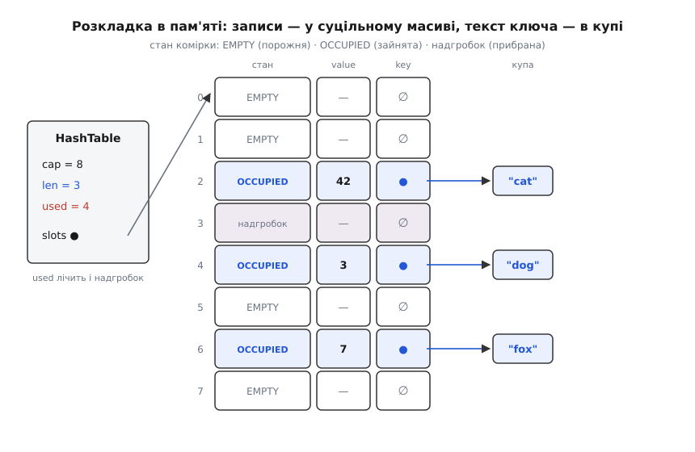

# ⚙️ Хеш-таблиця на відкритій адресації: робочий код на C

Ось повна, готова до компіляції хеш-таблиця на C — з хешем FNV-1a, лінійним пробуванням, надгробками при видаленні й автоматичним розширенням, — де весь устрій тримається на одній тонкій різниці: **порожня** комірка й **прибрана** комірка мусять поводитися по-різному, і варто їх сплутати, як частина ключів мовчки зникає. Мова тут не примха. Відкрита адресація виграє саме тим, що всі записи лежать суцільним масивом у пам'яті, а це територія C, де кожен байт розкладки на видноті й керований вручну.

## Задача

Зробити сховище «рядок → число» з трьома операціями: `put(key, value)` кладе або оновлює пару, `get(key)` повертає значення (чи звістку «немає»), `delete(key)` прибирає пару. Ключі — рядки довільної довжини, значення для прикладу — цілі. Вимоги, що визначають реалізацію:

- хеш-код рахувати функцією **FNV-1a** (швидка, добре перемішує);
- місткість таблиці — **степінь двійки**, а згортання хеш-коду в індекс — маскуванням молодших бітів;
- колізії розводити **лінійним пробуванням** — усе всередині одного масиву;
- видаляти через **надгробки**, щоб не рвати ланцюжки проб;
- коли заповнення переростає **α > 0.7**, подвоювати масив і **перехешовувати** все наново.

## Ідея та розкладка в пам'яті

Комірка масиву буває у трьох станах, і всі троє потрібні. **Порожня** (EMPTY) — тут ніколи нічого не лежало. **Зайнята** (OCCUPIED) — тримає живий запис. **Надгробок** (DELETED) — тут був запис, але його прибрали. Два останні очевидні; існування третього — уся сіль відкритої адресації, і причину видно нижче, коли доходимо до видалення.

Записи не розкидані по купі, як у ланцюжках, а лежать **суцільним масивом однакових комірок**. Кожна комірка — це маленька структура фіксованого розміру: покажчик на текст ключа, саме значення й байт стану. На купі живе тільки **текст ключа** (він змінної довжини — інакше не влізе в комірку сталого розміру); усе інше — прямо в масиві, впритул одне до одного. Саме тому проби так люблять кеш: сусідні комірки — це сусідні адреси, які процесор затягує однією лінією кеша.


*Структура `HashTable` тримає покажчик на масив і три лічильники. Масив — суцільна смуга комірок сталого розміру; у кожній зайнятій комірці — покажчик на текст ключа десь у купі, саме значення й стан. Порожні комірки й надгробки не мають ключа (`∅`). Ключове спостереження — два різні лічильники заповнення: `len` рахує лише живі записи, а `used` — ще й надгробки, бо для довжини проб надгробок нічим не кращий за зайняту комірку.*

## Крок 1: дані

Стан комірки — звичайний `enum`, причому `EMPTY` навмисно дорівнює нулю: тоді `calloc`, що обнуляє пам'ять, віддає масив, у якому **всі комірки вже порожні**, а покажчики ключів — нульові. Жодної окремої ініціалізації комірок не треба.

```c
#include <stdint.h>
#include <stdlib.h>
#include <string.h>
#include <stdbool.h>
#include <stdio.h>

typedef enum { EMPTY = 0, OCCUPIED, DELETED } State;   // EMPTY=0 → calloc дає порожні

typedef struct {
    char  *key;      // копія тексту ключа в купі; NULL, коли комірка не зайнята
    long   value;    // навантаження; тут — ціле, для прикладу
    State  state;    // EMPTY / OCCUPIED / DELETED (надгробок)
} Slot;

typedef struct {
    Slot  *slots;    // суцільний масив комірок
    size_t cap;      // місткість — ЗАВЖДИ степінь двійки
    size_t len;      // живих записів (OCCUPIED)
    size_t used;     // OCCUPIED + DELETED — скільки комірок «не порожні»
} HashTable;
```

Два лічильники, `len` і `used`, — не надмір. `len` каже, скільки в таблиці справжніх пар (це відповідь на «а скільки в мене елементів?»). А от рішення про розширення ухвалюють за `used`, і чому — стане ясно на кроці видалення; поки досить запам'ятати, що надгробок «займає» пробу так само, як зайнята комірка, тож для навантаження на таблицю рахується саме він.

```c
static void ht_init(HashTable *t, size_t cap) {
    t->cap  = cap;                          // степінь двійки, напр. 8
    t->len  = t->used = 0;
    t->slots = calloc(cap, sizeof(Slot));   // усі комірки → EMPTY(0), key=NULL
}

static void ht_free(HashTable *t) {
    for (size_t i = 0; i < t->cap; ++i)
        if (t->slots[i].state == OCCUPIED)
            free(t->slots[i].key);          // звільняємо лише живі ключі
    free(t->slots);
    t->slots = NULL; t->cap = t->len = t->used = 0;
}
```

Оскільки таблиця **володіє** копією кожного ключа, потрібна дрібна допоміжна функція, що робить цю копію. Використати можна й `strdup`, але власний рядок робить володіння очевидним і не залежить від POSIX:

```c
static char *dup_key(const char *s) {
    size_t n = strlen(s) + 1;               // +1 на завершальний '\0'
    char  *p = malloc(n);
    memcpy(p, s, n);
    return p;                               // у бойовому коді тут перевіряють p != NULL
}
```

## Крок 2: хеш і згортання

FNV-1a (Fowler–Noll–Vo, варіант «1a») — некриптографічний хеш, зведений до двох дій на кожен байт: спершу **XOR** байта в накопичувач, потім множення на велику просту сталу. Порядок «спершу XOR, потім множення» і є та відмінність варіанта 1a від початкового FNV-1 (там навпаки), що дає трохи кращу **лавину** — зміна одного біта ключа перевертає більше бітів результату. Дві магічні константи для 64-бітної версії — не з голови: це стандартні *offset basis* і *FNV prime*.

```c
static uint64_t fnv1a(const char *key) {
    uint64_t h = 14695981039346656037ULL;   // FNV offset basis (64-біт)
    for (const unsigned char *p = (const unsigned char *)key; *p; ++p) {
        h ^= (uint64_t)*p;                   // 1a: спершу XOR байта…
        h *= 1099511628211ULL;               // …потім множення на FNV-просте
    }
    return h;
}
```

> 🔧 **Навіщо це.** Хеш повертає широке 64-бітне число, а комірок лише `cap`. Згорнути одне в інше треба взяттям остачі `h % cap`. Але коли `cap` — степінь двійки, остача дорівнює простому **маскуванню молодших бітів**: `h & (cap − 1)`. Наприклад, при `cap = 8` маска `0b111` лишає три молодші біти — рівно діапазон 0…7. Це одна машинна інструкція замість ділення, і саме заради неї місткість тримають степенем двійки. Плата — таблиця бере до уваги лише молодші біти хеш-коду, тож хеш мусить добре перемішувати саме їх; FNV-1a це вміє, а от наївний хеш зі слабкими молодшими бітами на такій таблиці провалиться.

## Крок 3: пошук

Пошук задає взірець для всіх операцій — це і є прохід послідовністю проб. Стартуємо з комірки `h & mask` і йдемо по колу: `h`, `h+1`, `h+2`, … Три можливі підсумки на кожній пробі, і кожен важливий:

- **зайнята й ключ збігся** — знайшли, повертаємо значення;
- **надгробок** або **зайнята чужим ключем** — переступаємо, пробуємо далі;
- **порожня** — тут прохід уривається: якби ключ був у таблиці, він осів би не пізніше цієї комірки, отже, його немає.

```c
static bool ht_get(const HashTable *t, const char *key, long *out) {
    size_t mask = t->cap - 1;                 // cap — степінь двійки
    size_t idx  = fnv1a(key) & mask;          // згортання = маскування
    for (size_t i = 0; i < t->cap; ++i) {
        Slot *s = &t->slots[(idx + i) & mask];// лінійна проба по колу
        if (s->state == EMPTY)                // порожньо → ключа немає
            return false;
        if (s->state == OCCUPIED && strcmp(s->key, key) == 0) {
            if (out) *out = s->value;
            return true;
        }
        // DELETED або чужий OCCUPIED → переступаємо, проба далі
    }
    return false;                             // оминули всю таблицю — не знайшли
}
```

Тут уже видно, чому надгробок мусить відрізнятися від порожньої комірки: рядок `if (s->state == EMPTY) return false;` — це і є те місце, де порожнеча уриває пошук. Надгробок навмисно **не** уриває його, а пропускає далі. Плутати ці два стани — зробити частину записів невидимими.

## Крок 4: вставка

Вставка складніша, бо вона поєднує пошук (раптом ключ уже є — тоді оновлюємо) з розміщенням (якщо ключа немає — куди його покласти). І саме тут криється найтонша пастка всієї структури.

Йдучи пробами, ми можемо натрапити на надгробок. Спокуса — одразу сісти в нього: місце ж вільне. Але це помилка. Той самий ключ може лежати **далі** за пробами, за цим надгробком; якщо сісти в надгробок і зупинитися, у таблиці з'явиться **дублікат** — дві комірки з тим самим ключем, і `get` знаходитиме то одну, то іншу. Тому правило таке: **запам'ятати перший надгробок, але прохід не уривати** — дійти або до свого ключа (тоді оновити його на місці), або до порожньої комірки (тоді ключа в таблиці точно немає, і аж тепер можна осісти в запам'ятаний надгробок, а як його не було — у цю порожню).

```c
static void resize(HashTable *t, size_t new_cap);   // прототип; тіло — на кроці 6

static void put(HashTable *t, const char *key, long value) {
    // поріг: α = used/cap ≥ 0.7 ?  (used лічить і надгробки — вони теж займають пробу)
    if ((t->used + 1) * 10 >= t->cap * 7)
        resize(t, t->cap * 2);

    size_t mask       = t->cap - 1;
    size_t idx        = fnv1a(key) & mask;
    size_t first_tomb = 0;
    bool   have_tomb  = false;                // ще не бачили надгробка

    for (size_t i = 0; i < t->cap; ++i) {
        size_t j = (idx + i) & mask;
        Slot  *s = &t->slots[j];

        if (s->state == EMPTY) {              // дійшли до порожньої → ключа немає
            Slot *dst = have_tomb ? &t->slots[first_tomb] : s;
            if (!have_tomb) t->used++;        // зайняли РАНІШЕ порожню комірку
            dst->key   = dup_key(key);        // …а надгробок вже рахувався в used
            dst->value = value;
            dst->state = OCCUPIED;
            t->len++;
            return;
        }
        if (s->state == DELETED) {
            if (!have_tomb) { have_tomb = true; first_tomb = j; }  // лише ПЕРШИЙ
            continue;                         // але йдемо далі — ключ може бути попереду!
        }
        if (strcmp(s->key, key) == 0) {       // OCCUPIED і той самий ключ → оновлюємо
            s->value = value;
            return;
        }
        // чужий ключ — колізія, наступна проба
    }
}
```

Придивіться до обліку `used`. Коли сідаємо в **порожню** комірку — вона раніше не рахувалася, тож `used++`. Коли сідаємо в **надгробок** — він уже входив у `used` (його поставили при видаленні й не знімали), тож `used` не міняється: один надгробок перетворився на один живий запис. `len` росте завжди. Ця бухгалтерія — не педантизм: від неї залежить, коли спрацює розширення.

## Крок 5: видалення й пастка надгробків

Тепер причина всієї мороки з третім станом. Наївне видалення — знайти ключ і зробити комірку порожньою — **рве послідовності проб**. Уявіть, що ключ B при вставці не вмістився у свою комірку 3 (вона була зайнята) і пройшов пробою до комірки 4. Якщо тепер видалити те, що сиділо в комірці 3, і лишити її **порожньою**, то пошук B почне з комірки 3, побачить порожнечу — і за правилом кроку 3 здасться, вирішивши, що B немає. А B лежить поруч, у 4, тепер недосяжний.

Вихід — не спорожняти комірку, а ставити в неї **надгробок**: стан `DELETED`. Для пошуку він прозорий (переступаємо й ідемо далі), для вставки — вільне місце. Так шлях проб лишається цілим.

```c
static bool ht_delete(HashTable *t, const char *key) {
    size_t mask = t->cap - 1;
    size_t idx  = fnv1a(key) & mask;
    for (size_t i = 0; i < t->cap; ++i) {
        Slot *s = &t->slots[(idx + i) & mask];
        if (s->state == EMPTY)                // впёрлись у порожню → ключа немає
            return false;
        if (s->state == OCCUPIED && strcmp(s->key, key) == 0) {
            free(s->key);
            s->key   = NULL;
            s->state = DELETED;               // НАДГРОБОК, а не EMPTY!
            t->len--;                         // живих записів менше…
            // …але used НЕ чіпаємо: надгробок і далі подовжує проби
            return true;
        }
    }
    return false;
}
```

Рядок `s->state = DELETED;` замість `s->state = EMPTY;` — це вся різниця між робочою таблицею й такою, що губить ключі. І `t->len--` без `t->used--` — теж навмисне: жива пара зникла, але комірка, з погляду проб, і далі «зайнята», тож на навантаження вона досі впливає.

## Крок 6: розширення й перехешування

Заповнюючись, відкрита адресація деградує різко: коли вільних комірок обмаль, проба мусить обійти майже всю таблицю, перш ніж натрапити на порожнечу. Тому, щойно `used/cap` переростає поріг (тут 0.7), масив **подвоюють**. Але адреса кожного ключа — це `fnv1a(key) & (cap − 1)`, і вона залежить від `cap`; зі зміною місткості всі адреси інші. Тому таблицю не «доточують», а заводять новий масив і **проганяють крізь нього кожен живий ключ наново**. Надгробки при цьому просто не переносять — вони зникають безкоштовно, і накопичений мотлох виметається сам собою.

У свіжий масив вставляти простіше, ніж загальним `put`: там гарантовано немає ні надгробків, ні дублікатів, тож досить знайти першу порожню комірку. І ключі можна **перенести вказівником**, не копіюючи текст удруге:

```c
// вставка у СВІЖУ таблицю: без надгробків, без дублікатів; ключ уже наш
static void insert_raw(HashTable *t, char *key, long value) {
    size_t mask = t->cap - 1;
    size_t idx  = fnv1a(key) & mask;
    for (size_t i = 0; ; ++i) {               // порожня комірка тут ГАРАНТОВАНО є
        Slot *s = &t->slots[(idx + i) & mask];
        if (s->state == EMPTY) {
            s->key = key; s->value = value; s->state = OCCUPIED;
            t->len++; t->used++;
            return;
        }
    }
}

static void resize(HashTable *t, size_t new_cap) {
    Slot  *old     = t->slots;
    size_t old_cap = t->cap;

    t->slots = calloc(new_cap, sizeof(Slot)); // нові комірки — усі EMPTY
    t->cap   = new_cap;
    t->len   = t->used = 0;                    // порахуємо заново під час переносу

    for (size_t i = 0; i < old_cap; ++i)
        if (old[i].state == OCCUPIED)          // ЛИШЕ живі — надгробки зникають
            insert_raw(t, old[i].key, old[i].value);  // переносимо вказівник ключа
    free(old);                                 // ключі перенесено; звільняємо тільки масив
}
```

Зверніть увагу: `resize` не робить `dup_key` — він **забирає** наявні покажчики ключів зі старого масиву в новий, а тоді звільняє лише сам масив (`free(old)`), не чіпаючи текстів ключів. Жодного зайвого копіювання, жодного витоку.

## Демонстрація

Маленька програма, що ганяє всі три операції, оновлення наявного ключа й навантаження, що вимусить розширення:

```c
int main(void) {
    HashTable t;
    ht_init(&t, 8);

    put(&t, "cat", 1);
    put(&t, "act", 2);
    put(&t, "dog", 3);
    put(&t, "cat", 42);                        // оновлення наявного ключа

    long v;
    printf("cat = %ld\n", ht_get(&t, "cat", &v) ? v : -1);   // 42
    printf("act = %ld\n", ht_get(&t, "act", &v) ? v : -1);   // 2

    ht_delete(&t, "act");                      // ставить надгробок
    printf("act? %d\n", ht_get(&t, "act", &v));               // 0 — немає
    printf("dog = %ld\n", ht_get(&t, "dog", &v) ? v : -1);   // 3 — досі знаходиться

    char k[16];
    for (int i = 0; i < 100; ++i) {            // 100 вставок → кілька розширень
        sprintf(k, "n%d", i);
        put(&t, k, i);
    }
    printf("len=%zu used=%zu cap=%zu\n", t.len, t.used, t.cap);

    ht_free(&t);
    return 0;
}
```

## Пастки

- **Порожня ≠ надгробок.** Це вісь усього: `EMPTY` уриває пошук, `DELETED` — ні. Одну неуважну заміну `DELETED` на `EMPTY` при видаленні компілятор не помітить, а таблиця почне зрідка «губити» ключі, що осіли за прибраною коміркою, — найгидкіший різновид бага, бо ламається лише певний порядок операцій.
- **Перший надгробок — але прохід не уривати.** Вставка сідає в перший зустрінутий надгробок **тільки** після того, як переконалася, що ключа немає далі; сісти одразу — завести дублікат. Обидві половини правила обов'язкові.
- **Поріг рахують за `used`, не за `len`.** Якщо стежити лише за живими записами, то навантаження з рівною кількістю вставок і видалень (де `len` майже не росте) накопичить надгробки, проби видовжаться, а розширення так і не спрацює. Саме `used` ловить надгробки й тягне таблицю на перебудову, де їх виметуть. Тонкість-навпаки: коли `used` високий, а `len` малий (сама лише купа надгробків), розумніше перехешувати в масив **того самого** розміру — вимести мотлох, не роздуваючи пам'ять; наш `resize` для простоти завжди подвоює.
- **Повна таблиця зациклює пробу.** Якщо дати таблиці заповнитися вщерть, у циклі проб не лишиться жодної `EMPTY`-комірки — і `while (1)` крутитиметься вічно. Захист простий і вбудований: політика розширення тримає `used` під порогом, тож порожні комірки є завжди, а межа `i < cap` у `get`/`delete` — ще й страхувальний пояс.
- **Слабкі молодші біти.** Маскування бере лише молодші біти хеш-коду. FNV-1a їх мішає добре, але якщо взяти кепський хеш (наприклад, самі лише лічильники як ключі без перемішування), усе скупчиться в кількох комірках. На таблиці зі степенем двійки якість молодших бітів критична.
- **Володіння пам'яттю.** Таблиця копіює ключ при вставці (`dup_key`) і звільняє його при видаленні та в `ht_free`; `resize` переносить покажчики, не копіюючи. Плутанина тут дає або витік, або подвійне звільнення. Бойовий код ще й перевіряє `malloc`/`calloc` на `NULL` — тут це опущено заради ясності.

## Складність

Поки хеш розсіює рівномірно й поріг тримає `α` подалі від одиниці, кожна операція — це кілька проб, тобто **стала** робота. Розширення коштує O(n) за один спалах, але між двома розширеннями таблиця подвоюється, тож на серію вставок цей спалах розмазується в сталу частку — звідси «амортизовано» ([чому саме подвоєння дає сталу ціну](topic:computability/amortized-analysis)). Найгірший випадок — усі ключі в одну адресу: проби вироджуються в лінійний обхід.

```
Операція   Середнє (рівномірний хеш)   Найгірший випадок
put        O(1) амортизовано           O(n)
get        O(1)                        O(n)
delete     O(1)                        O(n)
```

Число проб при заповненні `α` для лінійного пробування росте приблизно як ½·(1 + 1/(1−α)²) — тому поріг тримають низьким (0.7), а не підпускають `α` до одиниці, де ця величина злітає в небо.
