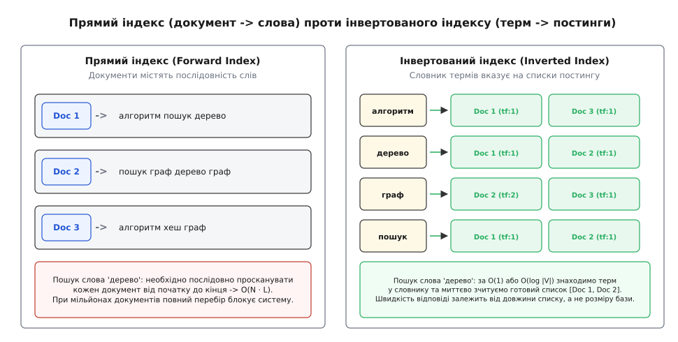
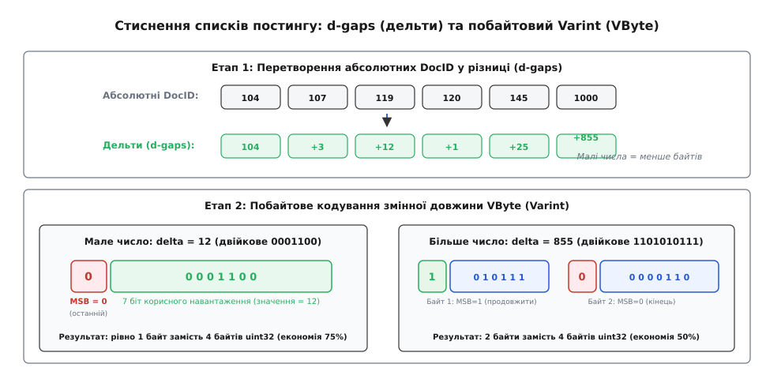
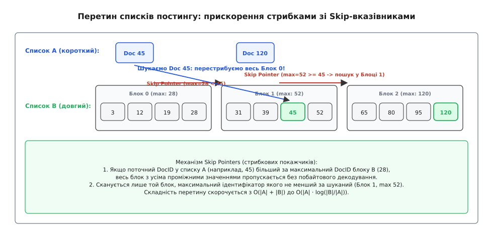
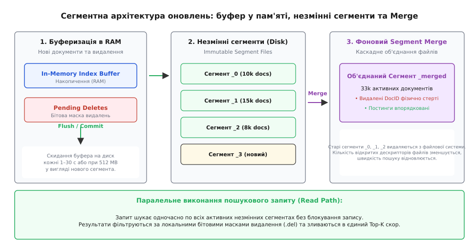

# Інвертований індекс

<preknowlist>
- [Хеш-таблиця](root:sf-algorithms/hash-table) — організація пар «ключ — значення» з доступом за середній O(1) час.
- [Двійковий пошук](root:sf-algorithms/binary-search) — знаходження елемента у відсортованому масиві за O(log N) кроків.
- [B-дерево](root:sf-data/b-tree) — самобалансоване дискове дерево пошуку зі сторінковою організацією.
- [LSM-дерево](root:sf-data/lsm-tree) — журнально-структурована модель зі скиданням незмінних SSTable на диск.
- [Косинусна відстань](root:sf-algorithms/cosine-distance) — геометрична метрика кутової близькості векторів у багатовимірному просторі.
</preknowlist>

Коли користувач вводить у пошуковий рядок фразу «алгоритм стиснення постингу» серед бази з мільярда веб-сторінок, система повинна повернути релевантні результати за 10–20 мілісекунд. Якщо сканувати кожен документ послідовно від початку до кінця (як це робить утиліта `grep`), системі довелося б прочитати з диска терабайти сирого тексту. При пропускній здатності найшвидших NVMe-накопичувачів у 5–7 GB/s повний перебір тривав би десятки секунд на один запит, що повністю блокує інтерактивну роботу.

Вихід із цієї обчислювальної пастки полягає у зміні напрямку відображення даних: замість перегляду списку слів у кожному документі будується заздалегідь підготовлений реєстр, де для кожного унікального слова зберігається відсортований перелік адрес лише тих документів, де це слово зустрічається. Така структура даних називається **інвертованим індексом** (Inverted Index).

---

## 1. Прямий індекс проти інвертованого індексу

Будь-яка початкова колекція документів у базі даних організована як **прямий індекс** (Forward Index): кожному ідентифікатору документа `DocID` зіставлено його повний текстовий вміст або масив знайдених у ньому токенів.

```
Прямий індекс (Forward Index):
Doc 1 ──> [ "алгоритм", "пошук", "дерево" ]
Doc 2 ──> [ "пошук", "граф", "дерево", "граф" ]
Doc 3 ──> [ "алгоритм", "хеш", "граф" ]
```

Прямий індекс зручний для вибірки та відображення самого документа за його відомим числовим ключем `DocID`. Проте виконання пошукового запиту за прямим індексом вимагає повного сканування колекції з часовою складністю `O(N · L)`, де `N` — кількість документів, а `L` — середня кількість слів у тексті.

**Інвертований індекс** (Inverted Index) розгортає це відношення у протилежний бік:

```
Інвертований індекс (Inverted Index):
"алгоритм" ──> [ Doc 1, Doc 3 ]
"граф"     ──> [ Doc 2, Doc 3 ]
"дерево"   ──> [ Doc 1, Doc 2 ]
"пошук"    ──> [ Doc 1, Doc 2 ]
"хеш"      ──> [ Doc 3 ]
```


*Прямий індекс (документ -> слова) проти інвертованого індексу (терм -> постинги).*

Фундаментально інвертований індекс складається з двох взаємопов'язаних компонентів:
1. **Словник термів** (Dictionary / Lexicon / Vocabulary) — відсортований масив, префіксне дерево (Trie / FST) або хеш-таблиця всіх унікальних слів корпусу. Словник є відносно компактним і зазвичай повністю розміщується в оперативній пам'яті (RAM);
2. **Списки постингу** (Posting Lists / Inverted Lists) — масиви впорядкованих записів (постингів), що вказують на конкретні документи, де зустрічається відповідний терм.

Завдяки такій структурі час пошуку одного слова скорочується від розміру всієї бази даних `N` до часу знаходження терма в словнику (`O(1)` або `O(log |V|)`, де `|V|` — розмір словника) плюс час послідовного читання його постингового списку.

> 📜 Про те, як Ганс Петер Лун створив автоіндексацію на перфокартах IBM, а Джерард Солтон та Стівен Робертсон заклали фундамент сучасного пошуку, читайте у вставці [Історія створення інвертованого індексу](root:sf-algorithms/inverted-index/hist-ir-origins.md).

---

## 2. Конвеєр попередньої обробки тексту (Text Processing Pipeline)

Сирий текст природної мови не можна безпосередньо заносити до словника індексу. Людська мова рясніє пунктуацією, відмінковими закінченнями, різним регістром літер та службовими словами. Перш ніж побудувати постингові списки, текст кожного документа проходить через послідовний конвеєр нормалізації (**Analysis Pipeline**).

```
Конвеєр аналізу тексту:
[ Сирий текст ] ──> [ Токенізація ] ──> [ Нормалізація ] ──> [ Фільтрація ] ──> [ Стемінг ] ──> [ Терми ]
```

### 1. Токенізація (Tokenization)
Токенізатор розбиває суцільний потік символів на окремі неподільні одиниці — токени. Це значно складніший процес, ніж простий поділ за пробілами:
* **Пунктуація та дефіси:** слова «повнотекстовий», «Wi-Fi», «C++» та адреси «user@example.com» вимагають спеціальних правил сегментації;
* **Багатомовний Unicode (UAX #29):** у східноазійських мовах (китайська, японська) слова не розділяються пробілами взагалі, що вимагає словникового сегментування (наприклад, алгоритмів Jieba або Kuromoji);
* **Збереження зміщень:** токенізатор фіксує початкове та кінцеве зміщення кожного токена у вихідному тексті (start/end character offsets), що необхідно для підсвічування знайдених фрагментів (Search Snippets / Highlighting).

### 2. Нормалізація регістру та діакритики (Normalization)
* **Зведення регістру (Case Folding):** перетворення всіх літер на малі («Алгоритм» → «алгоритм») для забезпечення нечутливості пошуку до регістру (case-insensitive);
* **Зняття діакритики (Accent Stripping / Unicode Normalization):** зведення символів з наголосами та діакритичними знаками до базових форм (наприклад, форма NFKC в Unicode).

### 3. Видалення стоп-слів (Stop Words Removal)
Службові слова («і», «в», «на», «що», «як», «the», «is») присутні практично в кожному документі колекції. Збереження постингових списків для таких слів призводить до гігантського роздування індексу без жодної користі для точності ранжування.

Фільтр стоп-слів видаляє їх на етапі індексації. Проте у сучасних системах повне видалення стоп-слів часто вимикають або замінюють динамічним відсіканням за WAND, оскільки видалення слів унеможливлює точний пошук цитат і сталих виразів (наприклад, фрази «to be or not to be»).

### 4. Морфологічний аналіз: стемінг проти лематизації
Щоб користувач за запитом «дерева» знаходив документи зі словом «дерево» чи «деревом», слова зводять до єдиної канонічної форми:
* **Стемінг (Stemming):** евристичний алгоритм, що за набором правил послідовно відтинає суфікси та закінчення без звернення до словника (наприклад, алгоритми Мартіна Портера або Snowball). Стемінг працює надзвичайно швидко, але схильний до помилок надлишкового усічення (over-stemming, коли різні слова зводяться до одного кореня) або недостатнього усічення (under-stemming);
* **Лематизація (Lemmatization):** повноцінний словниковий морфологічний аналіз, що визначає частину мови (POS-tagging) та повертає словникову форму слова (лему). Лематизація дає вищу лінгвістичну точність, але потребує словників обсягом у десятки мегабайтів і витрачає більше процесорного часу.

---

## 3. Анатомія елемента постингу (Posting Entry Structure)

Постинговий список терма — це не просто масив ідентифікаторів документів. Залежно від підтримуваного типу пошуку та моделі ранжування кожен елемент постингу містить кілька рівнів метаданих.

```
Рівні деталізації постингового запису:
1. Boolean Posting:
   [ DocID ]
2. Frequency Posting:
   [ DocID, TF ]
3. Positional Posting:
   [ DocID, TF, [pos₁, pos₂, ..., pos_{tf}] ]
4. Full Payload Posting:
   [ DocID, TF, [ (pos₁, start_char, end_char, payload_bytes), ... ] ]
```

Розглянемо складники постингу:
* **`DocID` (Ідентифікатор документа):** ціле число (32 або 64 біти), що унікально ідентифікує документ у колекції. Списки постингу **завжди зберігаються суворо впорядкованими за зростанням `DocID`** (`d₁ < d₂ < d₃ < ...`);
* **`TF` (Term Frequency / Частота терма):** кількість входжень терма в даний документ. Необхідна для обчислення релевантності за формулами TF-IDF та Okapi BM25;
* **`Positions` (Позиції входжень):** масив порядкових номерів слів у тексті документа (наприклад, 1-ше, 14-те, 89-те слово). Позиції критично необхідні для двох операцій:
  1. **Фразовий пошук (Phrase Query):** знаходження документів, де слова стоять строго поруч (наприклад, `"швидкий пошук"` вимагає `pos("пошук") == pos("швидкий") + 1`);
  2. **Оператори близькості (Proximity / Span Queries):** запити на зразок `алгоритм NEAR/5 граф` (слова мають знаходитися на відстані не більше 5 позицій одне від одного);
* **`Payloads` (Корисні навантаження):** довільні масиви байтів, прив'язані до конкретного входження слова. Використовуються для збереження вагових коефіцієнтів розмітки (наприклад, прапорець, що слово стоїть у тегу `<h1>`, жирному шрифті чи мета-тегах).

### Ціна повноти інформації
Збереження позицій та зміщень збільшує фізичний розмір постингового індексу в 3–5 разів порівняно з простим списком частот. Тому в промислових сховищах структуру файлів розбивають на кілька окремих компонентів (наприклад, файл `.doc` для ідентифікаторів і частот та файл `.pos` для позицій), завантажуючи позиції з диска лише тоді, коли користувач явно виконав фразовий запит.

---

## 4. Стиснення списків постингу (Posting List Compression)

Списку постингу для частих слів можуть містити мільйони записів. Якщо зберігати кожен `DocID` та `TF` у нестисненому вигляді як 32-бітне ціле число (4 байти), список на 10 мільйонів входжень займе 80 MB пам'яті на один терм. Оскільки весь індекс налічує мільйони термів, стиснення постингових списків є життєво необхідним для розміщення індексу в RAM та зменшення дискового I/O.

### 1. Дельта-кодування (d-gaps)
Фундаментальною властивістю списку постингу є монотонне зростання ідентифікаторів документів:

```
Абсолютні DocID:  [ 1004, 1007, 1019, 1020, 1045, 1900 ]
```

Замість абсолютних значень зберігають різниці між сусідніми елементами — **d-gaps** (`Δ_i = d_i - d_{i-1}` при `d_0 = 0`):

```
Дельти (d-gaps):   [ 1004,   +3,  +12,   +1,  +25,  +855 ]
```

Більшість дельт у щільних списках є дуже малими числами (від 1 до 16). Малі числа вимагають для свого представлення значно менше бітів, ніж початкові 32-розрядні ідентифікатори.


*Стиснення списків постингу: d-gaps (дельти) та побайтовий Varint (VByte).*

### 2. Побайтове кодування змінної довжини: Varint / VByte
Схема **VByte** розбиває число на групи по 7 бітів. Кожна група записується в окремий байт, а старший 8-й біт (`MSB`) слугує бітом продовження (**continuation bit**):
* `MSB = 1` — це не останній байт числа, далі слідують наступні 7 біт;
* `MSB = 0` — це фінальний байт числа.

```
Кодування дельти Δ = 12 (0001100 у двійковій системі):
- Число < 128, тому вміщується в 7 біт.
- Байт: 0 0001100 (MSB = 0, 1 байт у підсумку).

Кодування дельти Δ = 855 (1101010111 у двійковій системі):
- Молодші 7 біт: 0101111 (87). Встановлюємо MSB: 1 0101111 (0xD7).
- Зсув на 7: залишається 6 (110). Фінальний байт: 0 0000110 (0x06).
- Результат: [ 0xD7, 0x06 ] (рівно 2 байти замість 4).
```

VByte забезпечує компресію списків на 60–75% і має надзвичайно просту та швидку процедуру програмного декодування.

### 3. Побітові коди: Elias-gamma та Elias-delta
Для ще щільнішого стиснення застосовують побітове кодування Пітера Еліаса:
* **Elias-γ (гамма-код):** число `x` розбивається на ступінь двійки `2^k` та залишок. Довжина `k` записується в унарному коді (`k` нулів та одиниця), після чого записуються `k` бітів залишку. Число `1` кодується 1 бітом (`1`), число `2` — 3 бітами (`010`), число `3` — 3 бітами (`011`);
* **Elias-δ (дельта-код):** довжина `k + 1` сама кодується гамма-кодом, що значно компактніше пакує великі числа.

Побітові коди дають максимальний коефіцієнт стиснення, проте декодуються повільніше через необхідність постійних побітових маскувань та зсувів у пам'яті.

### 4. Векторне блокове стиснення: SIMD-PForDelta та SIMD-BP128
Сучасні високонавантажені рушії використовують блокове пакування бітів (**Bit Packing**). Список постингу розбивається на блоки фіксованого розміру (зазвичай 128 чисел):
1. **Frame of Reference (FoR):** для блоку зі 128 дельт знаходиться мінімальне значення та максимальна кількість бітів `b`, необхідна для представлення найбільшого числа блоку (`b = ceil(log2(max_delta))`). Усі 128 чисел записуються підряд фіксованою розрядністю `b` бітів;
2. **PForDelta (Patched Frame of Reference):** якщо 90% чисел вміщуються у 4 біти, а кілька чисел є аномально великими дельтами (винятками / patches), вибирається `b = 4`. Аномалії записуються в окремий масив винятків у кінці блоку;
3. **SIMD-декодування:** інструкції векторних процесорів (Intel AVX2 / AVX-512 та ARM NEON) здатні розпакувати весь 128-елементний блок у пам'ять за 10–15 тактів процесора без жодного розгалуження (branchless), досягаючи швидкості понад **3–4 мільярди чисел на секунду** на одне процесорне ядро.

> ⚙️ Повний робочий код рушія з побайтовим VByte кодуванням, скіп-ітератором та оцінкою релевантності мовами C та C++ наведено у вставці [Практична реалізація рушія інвертованого індексу](root:sf-algorithms/inverted-index/proj-search-engine.md).

---

## 5. Алгоритми виконання запитів: Перетин та об'єднання

Головне завдання обчислювального ядра пошуку — швидко виконати булеві операції над списками постингу декількох термів запиту.

### 1. Лінійне злиття списків (Merge Intersection)
Для кон'юнктивного запиту `term1 AND term2` алгоритм ініціалізує два ітератори на початку обох постингових списків:
1. Порівнюються поточні ідентифікатори `it1.doc_id` та `it2.doc_id`;
2. Якщо `it1.doc_id == it2.doc_id`, знайдено документ, що містить обидва слова. Він додається до результатів, а обидва ітератори зсуваються вперед (`next()`);
3. Якщо `it1.doc_id < it2.doc_id`, перший ітератор зсувається вперед (`it1.next()`);
4. Якщо `it1.doc_id > it2.doc_id`, другий ітератор зсувається вперед (`it2.next()`).

Часова складність класичного лінійного злиття становить `O(|L₁| + |L₂|)`, де `|L₁|` та `|L₂|` — довжини постингових списків.

```
Трасування лінійного злиття:
Список 1 ("алгоритм"): [ 3,  7, 18, 42, 85 ]
Список 2 ("пошук"):    [ 2, 18, 30, 42, 99 ]

Крок 1: it1 = 3,  it2 = 2  -> it1 > it2 -> it2++
Крок 2: it1 = 3,  it2 = 18 -> it1 < it2 -> it1++
Крок 3: it1 = 7,  it2 = 18 -> it1 < it2 -> it1++
Крок 4: it1 = 18, it2 = 18 -> ЗБІГ! Doc 18 -> it1++, it2++
Крок 5: it1 = 42, it2 = 30 -> it1 > it2 -> it2++
Крок 6: it1 = 42, it2 = 42 -> ЗБІГ! Doc 42 -> it1++, it2++
...
```

### 2. Стрибкові покажчики (Skip Pointers / Skip Lists)
Якщо один список є дуже коротким (наприклад, 10 документів для рідкісного терма), а другий — довгим (100 000 документів для популярного слова), покроковий перебір довгого списку виконує 99 990 непотрібних кроків читання з пам'яті.

Для оптимізації довгий постинговий список розбивають на блоки розміром `√|L|` (або фіксовано по 128 елементів) та будують над ними **скіп-індекс** (Skip Index). Для кожного блоку зберігається максимальний `DocID` у ньому та зміщення в байтовому потоці.


*Перетин списків постингу: прискорення стрибками зі Skip-вказівниками.*

Під час виконання `it1.advance(target_doc)` ітератор порівнює `target_doc` із максимальним значенням у поточному блоці:
* Якщо `target_doc > skips[block].max_doc_id`, весь блок пропускається за один крок (без розпакування чисел);
* Ітератор негайно переносить байтовий покажчик на початок наступного блоку;
* Лінійне декодування виконується лише всередині того єдиного блоку, який безпосередньо містить шуканий `DocID`.

Завдяки скіп-покажчикам складність перетину скорочується від лінійної до сублінійної:

```
O( |L_короткий| · log( |L_довгий| ÷ |L_короткий| ) )
```

---

## 6. Алгоритми динамічного відсікання: WAND та Block-Max WAND

Коли користувач вводить багатослівний запит із 5–10 слів, диз'юнктивний запит `OR` знаходить сотні тисяч документів. Проте користувача цікавлять лише `Top-K` найрелевантніших результатів (наприклад, перші 10 чи 20 документів на екрані). Повне обчислення скору BM25 для кожного зі 100 000 кандидатів є марною витратою ресурсів процесора.

Алгоритм **WAND** (Weak AND / Weighted AND, Broder et al., 2003) дозволяє динамічно відкидати неконкурентні документи без обчислення їхнього фінального балу.

### Механіка алгоритму WAND
1. Для кожного слова запиту `t` наперед відома верхня теоретична межа його внеску в оцінку релевантності:
   ```
   U_t = max_{D} BM25(t, D) = IDF(t) · (k₁ + 1)
   ```
2. Пошуковий рушій веде пріоритетну чергу (Min-Heap) з `K` найкращих знайдених на даний момент документів. Мінімальний бал документа в цій черзі слугує порогом відсікання `θ` (**threshold**);
3. Усі ітератори термів запиту сортуються за зростанням їхніх поточних `DocID`:
   ```
   it₁ ≤ it₂ ≤ it₃ ≤ ... ≤ it_m
   ```
4. Алгоритм підсумовує верхні межі `U_t` по черзі від першого ітератора, доки накопичена сума не перевищить поріг `θ`:
   ```
   ∑_{i=1}^{p} U_{it_i} ≥ θ
   ```
   Ітератор під номером `p` називається **опорним** (**pivot iterator**), а його ідентифікатор — `pivot_doc = it_p.doc_id`;
5. Якщо сума верхніх меж навіть перших `p-1` термів менша за `θ`, це математично доводить: жоден документ із номером, меншим за `pivot_doc`, **фізично не здатний набрати бал, вищий за θ**, навіть якщо містить усі ці терми одночасно;
6. Перший ітератор миттєво робить стрибок `it1.advance(pivot_doc)`, перестрибуючи тисячі непотрібних документів.

Сучасне вдосконалення **Block-Max WAND (BMW)** зберігає максимальні оцінки релевантності окремо для кожного фізичного блоку зі 128 документів. Це дозволяє відсікати понад 95% дискових блоків без їхнього читання, забезпечуючи час відповіді Top-K пошуку менше 5–10 мілісекунд на багатомільйонних базах даних.

---

## 7. Моделі ранжування релевантності: TF-IDF та Okapi BM25

Знайти документи, що містять шукані слова — це лише половина завдання. Головна складність полягає в тому, щоб розташувати найбільш корисні документи на початку видачі.

### 1. Модель векторного простору та TF-IDF
У класичній моделі TF-IDF релевантність слова визначається добутком двох складових:
* **`TF(t, D)` (Term Frequency):** міра локальної важливості слова всередині документа. Чим частіше слово повторюється в тексті, тим більша ймовірність, що документ присвячений цій темі;
* **`IDF(t)` (Inverse Document Frequency):** міра глобальної інформативності слова в усьому корпусі з `N` документів:
  ```
  IDF(t) = ln( N ÷ n_t )
  ```
  де `n_t` — кількість документів, що містять слово `t`.

Проте класичний TF-IDF має дві критичні вади:
1. **Лінійне зростання TF:** документ, у якому слово повторено 100 разів, отримує в 100 разів вищий бал, ніж документ з 1 згадкою, що заохочує спам та SEO-маніпуляції;
2. **Дискримінація за довжиною:** довгі документи містять більше слів, тому випадково набирають вищі бали, ніж короткі, але сфокусовані статті.

### 2. Ймовірнісна модель Okapi BM25
Алгоритм **Okapi BM25** усуває ці недоліки, вводячи нелінійне насичення частоти та нормалізацію довжини тексту:

```
BM25(D, Q) = ∑_{t ∈ Q} IDF(t) · [ f_{t,D} · (k₁ + 1) ] ÷ [ f_{t,D} + k₁ · (1 - b + b · (|D| / L_avg)) ]
```

де:
* `f_{t,D}` — кількість входжень терма `t` у документ `D`;
* `|D|` — довжина документа в токенах;
* `L_avg` — середня довжина документа у всій колекції;
* `k₁` (зазвичай `1.2 – 2.0`) — коефіцієнт насичення частоти. При збільшенні частоти внесок TF асимптотично наближається до верхньої межі `k₁ + 1`;
* `b` (зазвичай `0.75`) — коефіцієнт штрафу за довжину документа. При `b = 1` довжина штрафується пропорційно, при `b = 0` нормалізація довжини вимикається.

```
Згладжений розрахунок IDF у BM25:
IDF(t) = ln( (N - n_t + 0.5) ÷ (n_t + 0.5) + 1 )
```

> 🧮 Повне математичне виведення формули Okapi BM25 із 2-пуассонівської моделі та принципів Робертсона — Спарк Джонс дивіться у вставці [Математичне обґрунтування Okapi BM25](root:sf-algorithms/inverted-index/math-bm25-ranking.md).

---

## 8. Архітектура оновлень: Сегментна модель (Segment-Based Model)

Інвертований індекс на диску — це надзвичайно щільна, спресована бінарна структура. Кожен постинговий список займає суміжний блок пам'яті.

Якщо спробувати модифікувати такий індекс «на місці» (in-place update) при додаванні кожного нового документа, системі довелося б перезаписувати сотні тисяч постингових списків на диску, зсуваючи суміжні байти. Це викликає катастрофічне підсилення запису (**Write Amplification**) і повністю паралізує базу даних.

Для розв'язання цієї проблеми в архітектурі **Apache Lucene** та **Elasticsearch** реалізовано **сегментну лог-структуровану модель** (Segment-based Immutable Architecture).


*Сегментна архітектура оновлень: буфер у пам'яті, незмінні сегменти та Merge.*

### Життєвий цикл даних у сегментній моделі

#### 1. Буферизація в пам'яті (In-Memory Index Buffer)
Усі нові документи та оновлення спочатку записуються в динамічний буфер в оперативній пам'яті (`IndexWriter Buffer`) та дописуються в журнал випереджального запису (`WAL / Translog`) для захисту від збоїв живлення.

#### 2. Скидання незмінного сегмента (Flush / Commit)
Коли буфер у пам'яті заповнюється (наприклад, досягає 512 MB) або спливає часовий інтервал (наприклад, кожні 1–30 секунд), буфер «заморожується» і послідовно скидається на диск як новий автономний **незмінний сегмент** (`Immutable Segment`).

Сегмент є повноцінним, завершеним інвертованим індексом зі своїм словником, постинговими списками та скіп-структурами. **Після запису на диск файл сегмента ніколи більше не модифікується**.

#### 3. Видалення через бітові маски (Tombstones / Deletion Bitmaps)
Оскільки сегменти незмінні, операція видалення документа `DELETE doc_id` не переписує файли постингу. Замість цього номер видаленого документа записується в окрему бітову маску видалень (`.del` файл або Roaring Bitmap). Під час виконання пошуку документи, позначені в бітовій масці видалень, просто відфільтровуються з фінальної видачі.

#### 4. Паралельне читання без блокувань (Lock-Free Search)
Пошуковий запит виконується паралельно по всіх активних незмінних сегментах індексу. Оскільки дискові файли сегментів не змінюються, потоки читання не потребують жодних блокувань (м'ютексів чи shared locks) проти потоків запису. Результати з усіх сегментів об'єднуються у спільну пріоритетну чергу Top-K.

#### 5. Фонове каскадне злиття (Segment Merge / Compaction)
Із плином часу кількість дрібних сегментів на диску зростає, що збільшує кількість відкритих файлових дескрипторів та уповільнює пошук. Окремий фоновий потік періодично запускає процедуру злиття (**Merge**):
* Кілька дрібних сегментів зчитуються та зливаються в один великий сегмент методом лінійного злиття відсортованих списків;
* Документи, позначені у бітових масках видалення, фізично відкидаються і більше не потрапляють у новий сегмент (відбувається повне очищення простору на диску);
* Після завершення запису нового сегмента старі файли атомарно видаляються з файлової системи.

---

## 9. Пам'ять словника, розподіленість та межі застосування

### 1. Збереження словника в RAM: скінченні автомати FST
Якщо колекція містить сотні мільйонів унікальних слів (включаючи артикули товарів, хеші та власні назви), сам словник термів може займати гігабайти пам'яті.

Для стиснення словника в RAM застосовують **скінченні перетворювачі станів** (Finite State Transducers, FST). FST об'єднує спільні префікси та спільні суфікси слів у єдиний орієнтований ациклічний граф (DAG). Це дозволяє стиснути словник термів у 5–10 разів порівняно зі звичайною хеш-таблицею та виконувати пошук слів і префіксів за час `O(довжина_слова)` без завантаження всього словника у пам'ять.

### 2. Розподілене шардування (Distributed Indexing)
Коли індекс перевищує ємність одного сервера (терабайти й петабайти даних), застосовують шардування:
* **Шардування за документами (Document Partitioning / Local Index):** кожен вузол кластера індексує свою підмножину документів. Пошуковий запит транслюється на всі вузли паралельно (Scatter-Gather), а координатор зливає їхні списки Top-K. Це домінуюча архітектура в сучасних системах (Elasticsearch, Solr);
* **Шардування за термами (Term Partitioning / Global Index):** кожен вузол відповідає за певну літеру або діапазон слів словника. Вимагає менше вузлів для простих запитів, але стає вузьким місцем при багатослівних запитах через необхідність мережевого пересилання постингових списків між серверами.

### 3. Колоночне збереження числових полів (DocValues / Columnar Storage)
Хоча інвертований індекс ідеально підходить для знаходження документів за словами (`WHERE text CONTAINS "ноутбук"`), він принципово не пристосований для операцій сортування за числовими атрибутами (`ORDER BY price ASC`) або аналітичних агрегацій (`GROUP BY category`).

Якщо для сортування 100 000 знайдених документів використовувати інвертований індекс, системі довелося б завантажувати цільові поля з вихідних документів на диску (Field Cache), що миттєво переповнює пам'ять.

Для розв'язання цієї проблеми поряд з інвертованим індексом створюється **колоночний індекс значень** (**DocValues** / `.dvd` + `.dvm`):
* Для кожного документа значення числового або категоріального поля зберігається у щільному, неперервному стовпчастому масиві за індексом `DocID`;
* Під час сортування за ціною процесор послідовно читає `prices[doc_id]` прямим доступом до масиву з пам'яті або `mmap` без звернення до дискових записів;
* Значення упаковються блоковим бітовим стисненням (Bit-Packing) або словниковим кодуванням (Dictionary Encoding для категорій).

### 4. Нечіткий пошук та автодоповнення: автомати Левенштейна
Користувачі часто припускаються друкарських помилок або шукають слова з підстановочними знаками (Wildcards, наприклад `алгори*` або `стем?нг`).

Для виконання таких запитів без повного перебору всього словника застосовують перетин автоматів:
* **Автомати Левенштейна (Levenshtein Automata):** за пошуковим словом із помилкою будується скінченний автомат, що розпізнає всі рядки на відстані редагування `d ≤ 2`;
* **Перетин FST словника та автомата:** алгоритм одночасно здійснює обхід графа словника термів та переходів автомата Левенштейна. Усі невідповідні гілки словника відсікаються на ранніх символах, що дозволяє знайти всі термі-кандидати в гігантському словнику за частки мілісекунди;
* **N-грамні індекси (3-grams):** для підрядкових запитів (`*пошук*`) слова розбиваються на триграми (`пош`, `ошу`, `шук`), а пошук виконується як кон'юнктивний перетин постингових списків цих триграм.

### 5. Межі застосовності: Інвертований індекс проти щільних векторів (Dense Vector Search)
Інвертований індекс ідеально розв'язує задачу точного лексичного збігу (**Exact Match**): пошук артикулів товарів, назв моделей, уривків коду, серійних номерів та специфічних технічних термінів.

Проте інвертований індекс має фундаментальні семантичні обмеження:
* **Проблема синонімії:** якщо користувач шукає «ремонт авто», інвертований індекс не знайде документ зі словом «лагодження машини», якщо в ньому немає точного збігу слів;
* **Проблема омонімії:** слово «замок» знайде як фортеці, так і дверні механізми.

Сучасний семантичний пошук на основі векторних нейромережевих ембедингів (Dense Vectors) та графів найближчих сусідів (HNSW / k-NN) проектує текст у багатовимірний смисловий простір, де синоніми мають близькі координати. Проте векторний пошук потребує в рази більше пам'яті й обчислень на GPU та погано працює з точними кодами й рідкісними назвами.

Найкращі промислові системи сьогодні поєднують обидва підходи у **гібридному пошуку** (Hybrid Search), де інвертований індекс (BM25) та векторний індекс (HNSW) працюють паралельно, а їхні результати об'єднуються алгоритмом рангового злиття (Reciprocal Rank Fusion, RRF).

---

> 🔧 **Навіщо це.**
> Інвертований індекс — це незамінний фундамент сучасної цифрової інфраструктури. Кожного разу, коли ви шукаєте помилку в логах через `Elasticsearch / Kibana`, вводите запит у пошуку інтернет-магазину на базі `Tantivy`, шукаєте функцію у вихідному коді на `GitHub` або робите повнотекстовий запит `to_tsvector` у базі даних `PostgreSQL`, за лаштунками працює саме інвертований індекс зі своїми дельта-стисненими постинговими списками, скіп-вказівниками та незмінними дисковими сегментами.
