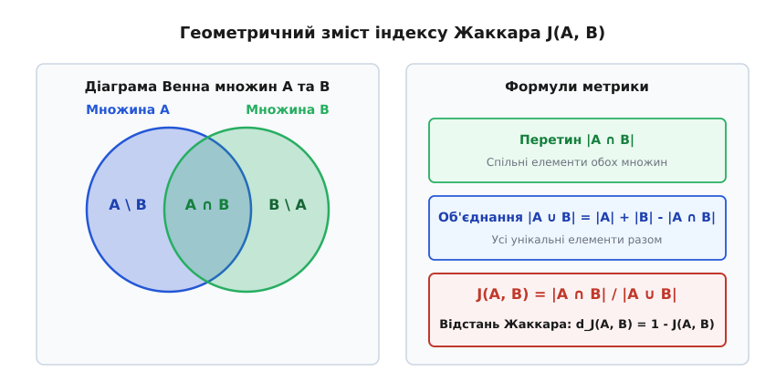
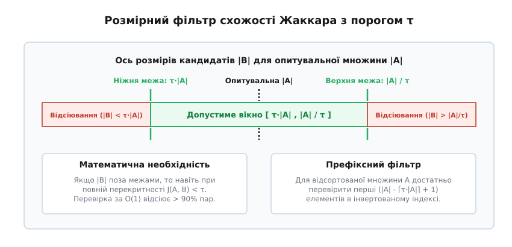
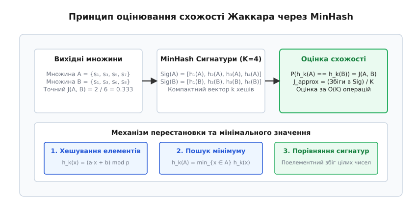

# Індекс Жаккара

<preknowlist>
- [Теорія множин](topic:math-logic/set-theory) — поняття елементів, перетину (∩), об'єднання (∪) та потужності (|A|).
- [Хеш-таблиця](topic:sf-algorithms/hash-table) — швидка перевірка належності елементів та пошук за сталою складністю O(1).
- [Асимптотична складність](topic:computability/asymptotic-complexity) — O-нотація для вимірювання часової складності та обсягу пам'яті.
- [Locality-Sensitive Hashing](topic:sf-algorithms/locality-sensitive-hashing) — імовірнісне хешування для пошуку близьких об'єктів у високовимірних просторах.
- [Відстань Хеммінга](topic:com-modulation/hamming-distance) — оцінювання відмінностей у послідовностях однакової довжини.
</preknowlist>

У системі автоматичного виявлення дублікатів веб-сторінок, аналізі вихідного коду на запозичення чи перевірці текстових документів на плагіат виникає фундаментальне завдання — кількісно оцінити ступінь схожості двох дискретних об'єктів. Спроба порівнювати об'єкти за простим числом спільних елементів — наприклад, за наявністю 10 одинакових унікальних слів — призводить до викривлених і непридатних на практиці результатів. Для короткого текстового повідомлення із 12 слів така кількість спільних слів означає майже повне запозичення (83% тексту), тоді як для об'ємного академічного підручника на 100 000 слів ті самі 10 слів складають 0.01% обсягу і є випадковим статистичним шумом. Позбавлений нормування підрахунок повністю ігнорує масштаб порівнюваних об'єктів.

Традиційні позиційні метрики відстаней, такі як [відстань Хеммінга](topic:com-modulation/hamming-distance) чи редакторська відстань Левенштейна, також виявляються непридатними для порівняння великих неструктурованих об'єктів. Відстань Хеммінга вимагає суворо однакової довжини векторів та прив'язки до позицій, тож додавання єдиного пробілу на початку тексту зсуває всі наступні символи й дає максимально можливу відмінність між майже ідентичними документами. Відстань Левенштейна враховує вставки та видалення, проте її обчислювальна складність `O(N · M)` стає абсолютно неприйнятною при порівнянні файлів розміром у сотні кілобайтів чи мегабайтів.

Щоб отримати стійку до перестановок та розсувів нормовану міру схожості, об'єкти представляють у вигляді дискретних множин унікальних елементів, а схожість вимірюють відносно загального обсягу унікальних елементів, які містяться в обох об'єктах разом. Отриманий показник нормується на відрізку `[0, 1]`, де `0` означає повну відсутність спільних елементів, а `1` — повну ідентичність множин.

## Означення та інтуїція метрики

Коефіцієнт схожості Жаккара (фр. *coefficient de communauté*, англ. *Jaccard similarity index*; уведений швейцарським ботаніком Полем Жаккаром, *Paul Jaccard*, 1901) обчислюється як відношення потужності перетину двох скінченних множин `A` та `B` до потужності їхнього об'єднання:

```
J(A, B) = |A ∩ B| / |A ∪ B|
```

Якщо обидві множини є порожніми (`A = ∅` та `B = ∅`), індекс Жаккара за домовленістю приймають рівним `1.0`, оскільки порожні множини є математично тотожними. Якщо одна множина порожня, а інша ні, індекс дорівнює `0.0`.

Для геометричного уявлення метрики зручно розглянути діаграму Венна. Перетин `A ∩ B` відповідає спільній області перекриття двох кіл, тоді як об'єднання `A ∪ B` охоплює всю площу, яку покривають обидва кола разом.


*Геометричний зміст індексу Жаккара як відношення розміру перетину |A ∩ B| до розміру об'єднання |A ∪ B|.*

Потужність об'єднання виражають через потужності окремих множин та їхнього перетину за принципом включення-виключення:

```
|A ∪ B| = |A| + |B| - |A ∩ B|
```

Підстановка цієї тотожності у формулу Жаккара дає альтернативний спосіб обчислення, який не вимагає фізичної побудови множини об'єднання в пам'яті:

```
J(A, B) = |A ∩ B| / (|A| + |B| - |A ∩ B|)
```

Ця форма має критичне значення для оптимізації алгоритмів: щоб обчислити `J(A, B)`, достатньо знати розміри обох вихідних множин `|A|` та `|B|` і порахувати лише кількість елементів у їхньому перетині `|A ∩ B|`.

На основі індексу схожості визначають **відстань Жаккара** (англ. *Jaccard distance*), яка вимірює ступінь відмінності між множинами:

```
d_J(A, B) = 1 - J(A, B) = (|A ∪ B| - |A ∩ B|) / |A ∪ B| = |A Δ B| / |A ∪ B|
```

де `A Δ B = (A \ B) ∪ (B \ A)` — симетрична різниця множин, що складається з елементів, які належать рівно одній із двох множин. Відстань Жаккара приймає значення від `0` (для однакових множин) до `1` (для множин без спільних елементів) і задовольняє всім аксіомам метричного простору, включно з нерівністю трикутника `d_J(A, C) ≤ d_J(A, B) + d_J(B, C)`.

Докладний розбір виникнення показника у фітогеографії, його подальшого розширення для векторних просторів та застосування у ранніх пошукових системах висвітлено в [📜 Історії виникнення та еволюції індексу Жаккара](topic:sf-algorithms/jaccard-index/hist-jaccard.md).

## Обчислення для дискретних даних та тексту

Щоб застосувати індекс Жаккара до неструктурованих текстів, вихідні дані перетворюють на множини дискретних фрагментів за допомогою процедури **шинглування** (англ. *shingling*, від *shingle* — ґонт, луска).

Підрядкові `k`-грами (англ. *k-grams*) будують шляхом просування ковзного вікна довжиною `k` символів або слів уздовж тексту. При символьному шинглуванні з `k = 3` для слова `"алгоритм"` утворюється множина 3-грам `{"алг", "лго", "гор", "ори", "рит", "итм"}`. При словесному шинглуванні з `k = 2` елементами множини стають пари сусідніх слів.

Вибір параметра `k` визначає чутливість та вибірковість метрики:
- При занадто малому `k` (наприклад, `k = 1` або `k = 2` символи) більшість можливих `k`-грам швидко вичерпується і зустрічається практично у будь-якому тексті. Це призводить до високого рівня хибнопозитивних збігів між абсолютно різними документами.
- При занадто великому `k` (наприклад, `k = 20` слів) будь-яка дрібна о друкарська помилка або заміна одного слова повністю руйнує відповідну `k`-граму, унаслідок чого метрика втрачає стійкість до незначних модифікацій.
- На практиці для коротких текстів та коду використовують символьні `k`-грами розміром `k = 4..9`, а для об'ємних статей — словесні `k`-грами розміром `k = 2..5`.

### Покроковий приклад розрахунку

Розглянемо два текстові фрагменти та обчислимо їхню схожість за 2-грамами слів:
- Документ A: `"швидкий бурий лис стрибає"`
- Документ B: `"швидкий сірий лис стрибає високо"`

Розбиття на 2-грами слів:
- Множина `A = {"швидкий бурий", "бурий лис", "лис стрибає"}` (`|A| = 3`)
- Множина `B = {"швидкий сірий", "сірий лис", "лис стрибає", "стрибає високо"}` (`|B| = 4`)

Обчислення перетину та об'єднання:
```
A ∩ B = {"лис стрибає"}                           [|A ∩ B| = 1]
A ∪ B = {"швидкий бурий", "бурий лис", "лис стрибає", 
         "швидкий сірий", "сірий лис", "стрибає високо"} [|A ∪ B| = 6]
```

Значення індексу Жаккара та відстані:
```
J(A, B) = 1 / 6 ≈ 0.1667           [16.67% схожості]
d_J(A, B) = 1 - 0.1667 = 0.8333     [83.33% відмінності]
```

### Алгоритмічні підходи до точного обчислення

Залежно від структури даних та обсягу алфавіту використовують три основні алгоритмічні моделі точного розрахунку перетину:

1. **Хеш-множини (для нерозпорядкованих елементів):** Елементи меншої множини `A` поміщають у хеш-таблицю. Потім ітеруються по елементах більшої множини `B` та перевіряють їхню наявність у хеш-таблиці.
   - Часова складність: `O(|A| + |B|)` у середньому.
   - Просторова складність: `O(|A|)` додаткової пам'яті.
   - Недолік: хаотичні стрибки по покажчиках у хеш-таблиці руйнують кеш-локальність L1/L2 сучасних процесорів.

2. **Впорядковані масиви (метод двох вказівників):** Якщо елементи обох множин попередньо відсортовано (наприклад, 64-бітні хеші `k`-грам), обчислення перетину виконується за один послідовний прохід двома вказівниками подібно до фази злиття у сортуванні злиттям (*Merge Sort*).
   - Часова складність: `O(|A| + |B|)` у найгіршому випадку.
   - Додаткова пам'ять: `O(1)` без виділення нових динамічних блоків.
   - Перевага: послідовний доступ до неперервних блоків пам'яті дозволяє апаратному префетчеру CPU заздалегідь завантажувати дані в кеш.

3. **Бітові вектори та SIMD (для фіксованого універсуму):** Якщо універсум елементів `U` має фіксований розмір (наприклад, `N ≤ 1024` бінарних ознак), множини кодують бітовими масками (*Bitsets*). Перетин обчислюють побітовим І (`AND`), а об'єднання — побітовим АБО (`OR`). Кількість встановлених одиничних бітів знаходять апаратними інструкціями `popcount` (наприклад, `__builtin_popcountll` у GCC або інструкціями `POPCNT` / `AVX-512 VPOPCNTDQ` на процесорах x86_64).
   - Часова складність: `O(|U| / 64)` операцій.
   - Продуктивність: обробка мільйонів елементів за мікросекунди завдяки векторації.

Строгий математичний доказ метричних властивостей, топології простору Жаккара, нерівності трикутника та зв'язку з іншими функціями відстаней наведено у вставці [🧮 Математичні властивості та метричний простір Жаккара](topic:sf-algorithms/jaccard-index/math-jaccard-properties.md).

## Масштабування: Пошук за схожістю у великих масивах

Пряме порівняння кожної пари об'єктів у колекції з `N` елементів вимагає `N · (N - 1) / 2 = O(N²)` операцій. Для бази даних з 1 000 000 документів це означає пів трильйона порівнянь. Навіть при швидкості 1 мікросекунда на порівняння повний перебір триватиме понад 5 діб.

Для побудови масштабованих систем пошуку за схожістю (англ. *Similarity Join* та *All-Pairs Similarity Search*) застосовують комбінацію точних відсіювальних фільтрів та імовірнісних структур даних.


*Розмірне вікно та префіксний фільтр для швидкого відсіювання завідомо несхожих кандидатів без обчислення перетину.*

### Розмірний фільтр (Size Filtering)

Нехай шукаються всі пари множин `(A, B)`, схожість яких не нижча за заданий поріг `τ` (`J(A, B) ≥ τ`, де `0 < τ ≤ 1`). З математичного означення випливає суворе обмеження на співвідношення розмірів таких множин. Оскільки перетин `|A ∩ B|` не може перевищувати розмір найменшої з двох множин `min(|A|, |B|)`, максимальна можлива схожість досягається при повному включенні меншої множини в більшу:

```
J(A, B) = |A ∩ B| / |A ∪ B| ≤ min(|A|, |B|) / max(|A|, |B|)
```

Звідси випливає, що умова `J(A, B) ≥ τ` може виконуватися лише тоді, коли розмір кандидата `|B|` лежить у замкненому інтервалі довкола розміру опитувальної множини `|A|`:

```
τ · |A| ≤ |B| ≤ |A| / τ
```

Якщо розмір множини `|B|` виходить за ці межі, то навіть при 100% входженні її елементів у `A` коефіцієнт Жаккара гарантовано буде меншим за `τ`. Перевірка цієї умови виконується за `O(1)` операцій за допомогою звичайного порівняння двох цілих чисел. У реальних текстових колекціях розмірний фільтр відсіює понад 90% потенційних пар кандидатів без жодного звернення до їхнього вмісту.

### Префіксний фільтр (Prefix Filtering)

Для додаткового звуження кола кандидатів елементи кожної множини впорядковують за універсальним порядком (наприклад, за зростанням їхньої глобальної частоти в колекції — від найрідкісніших до найчастіших).

Якщо дві відсортовані множини `A` та `B` мають схожість `J(A, B) ≥ τ`, то розмір їхнього перетину повинен задовольняти нерівність `|A ∩ B| ≥ ⌈τ / (1 + τ) · (|A| + |B|)⌉`. Звідси випливає **теорема про префікс**: множини `A` та `B` зобов'язані мати принаймні один спільний елемент у своїх перших `p_A` та `p_B` елементах (префіксах), де довжина префікса обчислюється як:

```
p_A = |A| - ⌈τ · |A|⌉ + 1
```

Побудувавши інвертований індекс (англ. *inverted index*) лише для префіксів документів, систему позбавляють необхідності перевіряти документи, які не мають жодного спільного рідкісного елемента у префіксному вікні.

### Позиційний та довжинний фільтри (Positional and Length Filtering)

У сучасних високооптимізованих алгоритмах пошуку (наприклад, PPJoin та AllPairs) префіксний фільтр доповнюють позиційними оцінками. Під час проходження інвертованого індексу враховують точну позицію `i`, у якій елемент зустрівся в префіксі опитувальної множини `A`, та позицію `j` в індексованому документі `B`. Якщо залишковий потенціал елементів після позицій `i` та `j` недостатній для набрання необхідного перетину `⌈τ / (1 + τ) · (|A| + |B|)⌉`, кандидат `B` негайно відкидається ще до повного сканування списку.

### Імовірнісна оптимізація через MinHash та LSH

Коли розмірність даних перевищує мільйони унікальних елементів, навіть фільтрований інвертований індекс стає занадто великим для оперативної пам'яті. У таких масштабах застосовують алгоритм **MinHash** (англ. *Minimum Hash*), що належить до класу [Locality-Sensitive Hashing (LSH)](topic:sf-algorithms/locality-sensitive-hashing).


*Імовірнісне оцінювання коефіцієнта Жаккара за допомогою мінімальних хеш-значень у випадкових перестановках.*

MinHash стискає множину довільного розміру до компактного вектора фіксованої довжини `K` цілих чисел — **сигнатури MinHash**. Для цього вибирають `K` незалежних хеш-функцій `h₁, h₂, ..., h_K`. Для кожної хеш-функції `h_k` обчислюють мінімальне значення хешу серед усіх елементів множини:

```
h_k(A) = min_{x ∈ A} h_k(x)
```

Математично доведено, що ймовірність збігу значень MinHash для двох множин `A` та `B` точно дорівнює їхньому коефіцієнту Жаккара:

```
P(h_k(A) = h_k(B)) = J(A, B)
```

Тому незміщена оцінка схожості двох множин визначається просто як частка елементів MinHash-сигнатур, які збігаються за однаковими індексами:

```
J_approx(A, B) = (1 / K) · ∑_{k=1}^{K} I(h_k(A) = h_k(B))
```

де `I(·)` — індикаторна функція, яка дорівнює `1`, якщо хеші збігаються, і `0` в іншому разі. Порівняння двох сигнатур довжиною `K = 128` вимагає всього 128 операцій порівняння цілих чисел в оперативній пам'яті незалежно від того, чи містили вихідні множини по 100 елементів, чи по 1 000 000 слів.

Дисперсія оцінювача MinHash становить `Var(J_hat) = J · (1 - J) / K`, що дає стандартну похибку менше ніж `5%` при `K = 100`. Збільшення `K` до `400` знижує похибку до `2.5%`.

Для подальшого прискорення сигнатури MinHash об'єднують у `L` смуг по `r` хешів у кожній (`K = L · r`). Якщо дві сигнатури тотожні бодай у одній смузі, відповідна пара потрапляє в один бакет хеш-таблиці й стає кандидатом на перевірку. Це дозволяє здійснювати пошук схожих документів за сублінійний час `O(K · N^{1/r})`.

Повна практична реалізація алгоритмів шинглування, інвертованого індексу з префіксним фільтром та генератора MinHash-сигнатур представлена у вставці [⚙️ Практична реалізація швидкого пошуку за схожістю Жаккара](topic:sf-algorithms/jaccard-index/proj-jaccard-search.md).

## Порівняльний аналіз із суміжними метриками

Залежно від природи даних та предметної області використовують інші математичні показники схожості, кожен з яких має свої особливості порівняно з індексом Жаккара.

| Метрика | Формула / Вираз | Основна область застосування | Відмінність від Жаккара |
| :--- | :--- | :--- | :--- |
| **Індекс Жаккара** | `|A ∩ B| / |A ∪ B|` | Інформаційний пошук, дедублікація, геноміка | Базова нормована міра перекриття множин |
| **Коефіцієнт Соренсена-Дайса** | `2·|A ∩ B| / (|A| + |B|)` | Біоінформатика, сегментація зображень | Штрафує відмінності менше, віддає більшу вагу перетину |
| **Косинусна схожість** | `(A · B) / (||A|| · ||B||)` | Обробка природної мови (NLP), вектори TF-IDF | Враховує частоти (ваги) слів, а не лише факт наявності |
| **Коефіцієнт Танімото** | `(x · y) / (||x||² + ||y||² - x · y)` | Хемоінформатика, аналіз молекул | Неперервне узагальнення Жаккара для дійсних векторів |
| **Коефіцієнт перекриття** | `|A ∩ B| / min(|A|, |B|)` | Виявлення підмножин та запозичень | Дорівнює 1.0, якщо одна множина повністю вкладена в іншу |

### Коефіцієнт Соренсена-Дайса (Sørensen-Dice Coefficient)

Коефіцієнт Соренсена-Дайса обчислюється як відношення подвоєного розміру перетину до суми розмірів двох множин:

```
S(A, B) = 2 · |A ∩ B| / (|A| + |B|)
```

Між індексом Жаккара `J` та коефіцієнтом Соренсена-Дайса `S` існує суворий взаємно однозначний алгебраїчний зв'язок:

```
S = 2·J / (1 + J)    <=>    J = S / (2 - S)
```

Обидва показники є монотонними перетвореннями один одного, тому вони дають ідентичний ранжирувальний порядок при пошуку найподібніших об'єктів. Однак на відміну від відстані Жаккара `d_J = 1 - J`, величина `d_S = 1 - S` не задовольняє нерівності трикутника і не утворює метричного простору.

### Косинусна схожість (Cosine Similarity)

Косинусна схожість порівнює кут між двома векторами у багатовимірному просторі:

```
Cos(u, v) = (u · v) / (||u||₂ · ||v||₂)
```

Для бінарних векторів ознак (де значення елементів дорівнюють `0` або `1`) косинусна схожість зводиться до виразу `|A ∩ B| / (√|A| · √|B|)`. Головна відмінність полягає в тому, що косинусна схожість призначена для неперервних векторів із ваговими коефіцієнтами (наприклад, значень TF-IDF або ембедингів нейромереж), тоді як індекс Жаккара оптимізовано для строго дискретних множин унікальних ідентифікаторів.

### Коефіцієнт Танімото (Tanimoto Coefficient)

Коефіцієнт Танімото розширює формулу Жаккара на вектори з довільними дійсними значеннями елементів `x, y ∈ ℝ^D`:

```
T(x, y) = (x · y) / (||x||² + ||y||² - x · y)
```

У хемоінформатиці під коефіцієнтом Танімото часто розуміють класичний індекс Жаккара, застосований до бінарних молярних відбитків (*Fingerprints*). Для неперервних векторів ознак коефіцієнт Танімото зберігає геометричні властивості нормування Жаккара.

### Коефіцієнт перекриття (Overlap Coefficient)

Коефіцієнт перекриття (або коефіцієнт Шимкевича-Сімпсона) визначається як:

```
Overlap(A, B) = |A ∩ B| / min(|A|, |B|)
```

Цей показник дорівнює `1.0`, якщо одна із множин повністю входить до складу іншої (наприклад, `A ⊂ B`), незалежно від того, наскільки більшою є множина `B`. Його використовують у задачах виявлення запозичень коротких цитат у довгих документах, де індекс Жаккара дав би мале значення через великий знаменник `|A ∪ B|`.

> 🔧 **Навіщо це.**
> Індекс Жаккара є базовим інструментом для вирішення системних інженерних задач високого навантаження:
> 1. **Дедублікація вебу у пошукових системах:** Сканери пошукових роботів обчислюють MinHash-сигнатури для кожного знайденого URL і миттєво відсіюють дзеркала сайтів, передруки новин та згенерований спам ще до етапу індексації.
> 2. **Аналіз вихідного коду:** Системи перевірки студентських робіт та виявлення порушень ліцензій (наприклад, Black Duck або Moss) шинглюють синтаксичні дерева (AST) програм і виявляють плагіат навіть після перейменування змінних та зміни форматування.
> 3. **Біоінформатика та метагеноміка:** Утиліти `Mash` та `sourmash` будують сигнатури Жаккара з `k`-мерних послідовностей нуклеотидів ДНК (`k-mers`) і порівнюють геноми нових бактерій із глобальними базами даних National Center for Biotechnology Information (NCBI) за секунди замість днів повного вирівнювання послідовностей (*Sequence Alignment*).

Детальний описовий довідник структур даних, конфігураційних параметрів, функцій C API та обгортки C++ RAII для роботи з індексом Жаккара подано у вставці [📋 Довідник інтерфейсу та структур даних Jaccard Engine](topic:sf-algorithms/jaccard-index/api-jaccard-engine.md).

## Підсумки та вибір підходу

При виборі алгоритмічної стратегії для розрахунку індексу Жаккара орієнтуються на обсяг даних та вимоги до точності:

1. **Для малого обсягу (тисячі об'єктів):** використовують точний розрахунок через хеш-множини або відсортовані масиви.
2. **Для середнього обсягу (мільйони пар):** будують точний Similarity Join на основі розмірного та префіксного фільтрів.
3. **Для надвеликого обсягу (мільярди документів):** застосовують імовірнісне сигнатурування MinHash у поєднанні з таблицями LSH.
