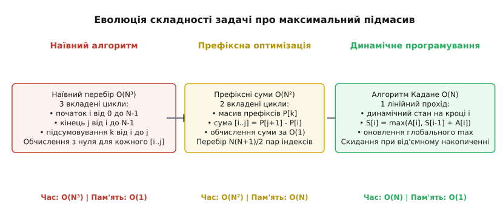
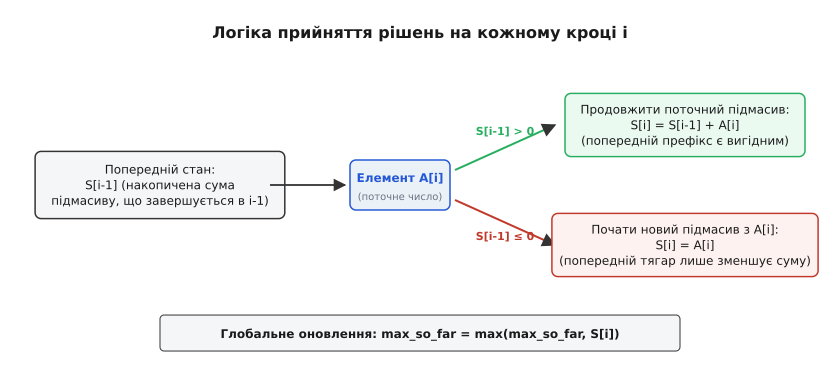
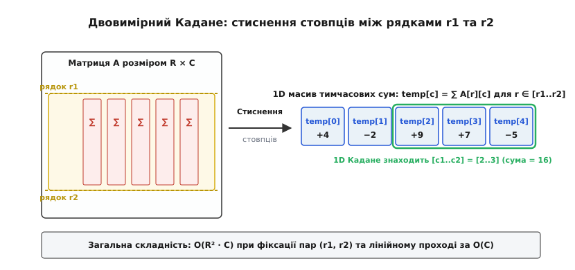
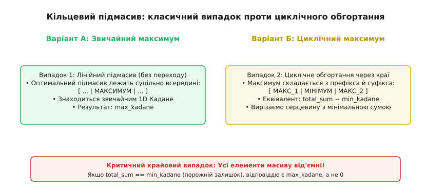

# Алгоритм Кадане (Kadane's Algorithm)

<preknowlist>
- [Асимптотична складність алгоритмів](topic:computability/asymptotic-complexity) — O-нотація, поліноміальний та експоненціальний ріст систем.
- [Амортизаційний аналіз](topic:computability/amortized-analysis) — методи оцінки сукупної вартості послідовності операцій.
</preknowlist>

У цифровій обробці сигналів, кількісному аналізі біржових часових рядів та аналізі медичних зображень регулярно виникає задача виділення найбільш енергетично вираженого неперервного інтервалу. Якщо вхідний числовий потік містить як додатні сплески корисної активності, так і від'ємні шумові завади, виникає потреба знайти неперервний відрізок послідовності, сума чисел на якому є максимально можливою.

Ця класична оптимізаційна постановка відома як **задача про пошук підмасиву з максимальною сумою** (Maximum Subarray Problem). Наївне розв'язання задачі вимагає перебору всіх можливих пар меж і підсумовування елементів усередині кожної з них, що створює кубічну складність `O(N³)`. Використання таблиці префіксних сум дозволяє знизити час до квадратичного `O(N²)`, а техніка «розділяй і володарюй» — до квазілінійного `O(N log N)`.

Алгоритм Кадане (Kadane's Algorithm) розв'язує цю задачу за строго лінійний час `O(N)` при використанні константної додаткової пам'яті `O(1)`. Він є канонічним зразком динамічного програмування з оптимізацією пам'яті: замість збереження повної таблиці розміром `N` алгоритм підтримує лише одне числове значення — локальний максимум підмасиву, що завершується в поточній позиції.


*Порівняння обчислювальної складності: від наївного кубічного перебору через квадратичні префіксні суми до лінійного алгоритму Кадане.*

---

## 1. Анатомія задачі та еволюція підходів

Нехай задано одновимірний масив дійсних або цілих чисел `A = [A[0], A[1], ..., A[N-1]]`. Необхідно знайти неперервний непорожній підмасив `A[i .. j]`, де `0 ≤ i ≤ j < N`, такий, що сума його елементів є максимальною серед усіх можливих виборів меж `(i, j)`:

```
S(i, j) = ∑_{k=i}^{j} A[k]
```

### Кубічний перебір O(N³)
Найпростіший прямий підхід полягає в переборі всіх можливих індексів початку `i` від `0` до `N-1`, індексів кінця `j` від `i` до `N-1`, та обчисленні суми елементів внутрішнім циклом від `i` до `j`:

```
Total_Operations = ∑_{i=0}^{N-1} ∑_{j=i}^{N-1} (j - i + 1) = (N³ + 3N² + 2N) / 6 = O(N³)
```

Для масиву з `N = 10 000` елементів кубічний алгоритм виконує близько `1.66 · 10¹¹` операцій додавання, що вимагає кількох хвилин процесорного часу навіть на сучасних багатоядерних процесорах. Причина неефективності кубічного підходу полягає в багаторазовому повторному обчисленні одних і тих самих проміжних сум: переходячи від відрізка `A[i .. j]` до `A[i .. j+1]`, наївний алгоритм підсумовує всі `j - i + 1` елементів з самого початку, повністю ігноруючи вже накопичений результат попереднього кроку.

### Квадратична оптимізація через префіксні суми O(N²)
Зауважимо, що суму підмасиву `A[i .. j]` можна представити як різницю двох префіксних сум:

```
Prefix[x] = ∑_{k=0}^{x-1} A[k],   де Prefix[0] = 0
S(i, j) = Prefix[j + 1] - Prefix[i]
```

Попередньо обчисливши масив префіксів за `O(N)`, ми можемо знайти суму будь-якого відрізка за `O(1)`. Перебір пар `(i, j)` займає:

```
Pairs = N · (N + 1) / 2 = O(N²)
```

Для `N = 10 000` це скорочує кількість операцій до `5 · 10⁷` (частки секунди), проте для масивів телеметрії з `N = 10⁷` квадратичний алгоритм вимагає `5 · 10¹³` операцій, що є неприйнятним для обробки даних у реальному часі.

### Підхід «Розділяй і володарюй» O(N log N)
Парадигма декомпозиції розділяє вхідний інтервал `A[left .. right]` навпіл відносно центрального індексу `mid = (left + right) / 2`. Будь-який неперервний підмасив належить до одного з трьох взаємовиключних класів:
1. Повністю лежить у лівій половині `A[left .. mid]`.
2. Повністю лежить у правій половині `A[mid + 1 .. right]`.
3. Перетинає середину, тобто містить як елемент `A[mid]`, так і `A[mid + 1]`.

Перші два випадки знаходяться шляхом рекурсивного виклику для лівої та правої половин. Для знаходження максимального підмасиву, що перетинає середину, алгоритм сканує ліву половину від `mid` ліворуч до `left`, знаходячи максимальний суфікс `max_left_suffix`, та праву половину від `mid + 1` праворуч до `right`, знаходячи максимальний префікс `max_right_prefix`. Їхня сума `max_left_suffix + max_right_prefix` дає найкращий комбінований перетин за лінійний час `O(R - L)`.

Рекурентне рівняння часу виконання алгоритму «розділяй і володарюй» має вигляд:

```
T(N) = 2 · T(N / 2) + O(N)
```

За основною теоремою про рекурентні співвідношення (Master Theorem) для параметрів `a = 2, b = 2, f(N) = O(N)` розв'язок відповідає випадку рівності `log_b(a) = 1`, що дає асимптотику `O(N log N)`. Докладніше про історію появи цих ідей та їхній розвиток у роботах Ульфа Ґренандера, Майкла Шамоса та Джона Бентлі можна прочитати в [історичному нарисі: від матриць Ґренандера до семінару Кадане](topic:sf-algorithms/kadane-algorithm/hist-kadane-origin.md).

---

## 2. Математичний інваріант алгоритму Кадане

Джозеф Кадане запропонував підхід, який дозволяє усунути зайві гілки перебору і розв'язати задачу за один лінійний прохід `O(N)` зі сталою пам'яттю `O(1)`.

Нехай `M[i]` — максимальна сума неперервного підмасиву, який **обов'язково завершується в індексі `i`**.

Розглянемо вибір для елемента `A[i]`:
- Підмасив, що завершується в позиції `i`, може або складатися з одного-єдиного елемента `A[i]` (початок нового відрізка),
- або бути продовженням оптимального підмасиву, що завершувався в позиції `i - 1`, тобто мати суму `M[i - 1] + A[i]`.

Оскільки нам потрібна максимальна сума, отримуємо базове рекурентне рівняння динамічного програмування:

```
M[i] = max(A[i], M[i - 1] + A[i])
```

Виносячи `A[i]` за дужки оператора максимуму, отримуємо еквівалентний запис:

```
M[i] = A[i] + max(0, M[i - 1])
```

Глобальний максимум `MaxSum` усього масиву дорівнює найбільшому значенню серед усіх можливих точок завершення `i`:

```
MaxSum = max_{0 ≤ i < N} M[i]
```


*Скінченний автомат динамічного програмування: вибір між продовженням накопичення та скиданням від'ємного тягаря.*

### Принцип оптимальності Беллмана та відсікання баласту
Ключовий теоретичний висновок полягає в тому, що від'ємна сума попереднього підмасиву є деструктивною для будь-якого наступного продовження. Якщо `M[i-1] < 0`, то додавання `M[i-1]` до елемента `A[i]` гарантовано дасть величину `M[i-1] + A[i] < A[i]`. Це означає, що будь-який підмасив, який містить цей від'ємний префікс, буде строго гіршим за підмасив, розпочатий безпосередньо з елемента `A[i]`.

Таким чином, оптимальна підструктура задачі дозволяє локально приймати безповоротне жадібне рішення:
- Якщо `M[i-1] ≥ 0`, ми продовжуємо накопичувати суму: `M[i] = M[i-1] + A[i]`.
- Якщо `M[i-1] < 0`, ми скидаємо попередній відрізок і встановлюємо `M[i] = A[i]`.

### Еквівалентність пошуку мінімального префікса
Алгоритм Кадане можна розглядати через призму префіксних сум. Нехай `Prefix[k]` — префіксна сума перших `k` елементів: `Prefix[k] = ∑_{j=0}^{k-1} A[j]`, причому `Prefix[0] = 0`. Сума довільного підмасиву від індексу `start` до індексу `end` виражається як:

```
S(start, end) = Prefix[end + 1] - Prefix[start]
```

Для фіксованого правого краю `end` максимізація значення `S(start, end)` еквівалентна **мінімізації значення `Prefix[start]`** серед усіх допустимих точок початку `0 ≤ start ≤ end`. Отже:

```
M[end] = Prefix[end + 1] - min_{0 ≤ start ≤ end} Prefix[start]
```

Оскільки накопичений мінімум префіксних сум `min_prefix` оновлюється за один крок `min_prefix = min(min_prefix, Prefix[end + 1])`, відстеження мінімального префікса виконується за `O(1)` на кожен елемент, що є алгебраїчно ізоморфним до рекурентної схеми Кадане.

### Теорема про нижню межу складності (Adversary Lower Bound)
Чи можливо знайти максимальний підмасив швидше, ніж за `O(N)`?

Доведемо за допомогою моделі супротивника (Adversary Argument), що будь-який детермінований або ймовірнісний алгоритм, який правильно розв'язує задачу про максимальний підмасив для довільного масиву розміром `N`, зобов'язаний виконати щонайменше `N` запитів до елементів масиву.

Припустимо, що деякий алгоритм завершив роботу, перевіривши лише `N - 1` елементів і пропустивши елемент `A[k]`. Нехай для всіх перевірених елементів знайдений максимум дорівнює деякому значенню `M`. Супротивник може підставити на неперевірену позицію `k` значення `A[k] = M + 1000`. У такому випадку оптимальний підмасив обов'язково повинен містити елемент `A[k]`, а його сума буде строго більшою за `M`. Якщо ж супротивник підставить `A[k] = -1000`, оптимальний підмасив може бути зовсім іншим.

Оскільки без перевірки елемента `A[k]` алгоритм не може відрізнити ці два випадки, будь-який коректний алгоритм повинен опитати кожен елемент масиву щонайменше один раз. Таким чином, точна нижня межа становить `Ω(N)` операцій доступу до пам'яті, що доводить абсолютну асимптотичну оптимальність алгоритму Кадане.

Суворе математичне доведення коректності за індукцією, еквівалентність формулюванню через різниці префіксних сум, властивості моноідальних напівкілець та нижні межі складності розібрано в [математичному виведенні коректності та моноідальної структури](topic:sf-algorithms/kadane-algorithm/math-kadane-proof.md).

---

## 3. Базова реалізація та покрокове трасування

Оскільки для обчислення `M[i]` потрібне лише значення `M[i-1]`, нам немає потреби зберігати весь масив `M[0 .. N-1]`. Достатньо двох скалярних змінних:
- `current_sum`: поточне значення `M[i]`.
- `max_sum`: максимальне значення серед усіх перевірених `M[k]` для `k ≤ i`.

:::tabs
```c
#include <stdio.h>

long long kadane_basic(const int* arr, int n) {
    if (arr == NULL || n <= 0) {
        return 0;
    }

    long long current_sum = arr[0];
    long long max_sum = arr[0];

    for (int i = 1; i < n; ++i) {
        /* Якщо попередня сума від'ємна, скидаємо до arr[i] */
        if (current_sum < 0) {
            current_sum = arr[i];
        } else {
            current_sum += arr[i];
        }

        /* Оновлюємо глобальний оптимум */
        if (current_sum > max_sum) {
            max_sum = current_sum;
        }
    }

    return max_sum;
}
```
```cpp
#include <vector>
#include <span>
#include <algorithm>

[[nodiscard]] long long kadane_basic(std::span<const int> arr) noexcept {
    if (arr.empty()) {
        return 0;
    }

    long long current_sum = arr[0];
    long long max_sum = arr[0];

    for (std::size_t i = 1; i < arr.size(); ++i) {
        current_sum = std::max<long long>(arr[i], current_sum + arr[i]);
        max_sum = std::max(max_sum, current_sum);
    }

    return max_sum;
}
```
:::

### Покрокове трасування класичного прикладу
Розглянемо канонічний масив із підручника Джона Бентлі: `[-2, 1, -3, 4, -1, 2, 1, -5, 4]`.

| Індекс `i` | Елемент `A[i]` | Стан `current_sum` до додавання | Дія алгоритму | Новий `current_sum` | Глобальний `max_sum` | Оптимальний активний підмасив |
| :--- | :--- | :--- | :--- | :--- | :--- | :--- |
| `0` | `-2` | — | Ініціалізація першим елементом | `-2` | `-2` | `[-2]` |
| `1` | `1` | `-2 < 0` | Скидання від'ємного баласту, старт з `A[1]` | `1` | `1` | `[1]` |
| `2` | `-3` | `1 ≥ 0` | Продовження: `1 + (-3)` | `-2` | `1` | `[1, -3]` |
| `3` | `4` | `-2 < 0` | Скидання від'ємного баласту, старт з `A[3]` | `4` | `4` | `[4]` |
| `4` | `-1` | `4 ≥ 0` | Продовження: `4 + (-1)` | `3` | `4` | `[4, -1]` |
| `5` | `2` | `3 ≥ 0` | Продовження: `3 + 2` | `5` | `5` | `[4, -1, 2]` |
| `6` | `1` | `5 ≥ 0` | Продовження: `5 + 1` | `6` | **`6`** | **`[4, -1, 2, 1]`** |
| `7` | `-5` | `6 ≥ 0` | Продовження: `6 + (-5)` | `1` | `6` | `[4, -1, 2, 1, -5]` |
| `8` | `4` | `1 ≥ 0` | Продовження: `1 + 4` | `5` | `6` | `[4, -1, 2, 1, -5, 4]` |

Алгоритм завершує роботу зі значенням `max_sum = 6`, яке відповідає підмасиву `[4, -1, 2, 1]` на індексах від `3` до `6`.

Зверніть увагу на ітерацію `i = 7`: після додавання `-5` сума зменшилася до `1`, проте оскільки `1 ≥ 0`, алгоритм не скинув накопичення, що дозволило на ітерації `i = 8` додати елемент `4` і отримати суму `5`. Хоча ця сума не перевищила глобальний максимум `6`, алгоритм коректно зберіг можливість потенційного зростання.

---

## 4. Відстеження координат меж оптимального підмасиву

У практичних інженерних системах (наприклад, при виділенні аномальних часових проміжків у журналі подій) недостатньо знати лише суму: потрібно отримати індекси початку `best_start` та кінця `best_end`.

Для цього вводяться змінні:
- `current_start`: індекс першого елемента підмасиву, сума якого наразі відстежується в `current_sum`.
- `best_start`, `best_end`: зафіксовані межі найкращого підмасиву.

Коли `current_sum` опускається нижче нуля, на наступній ітерації `current_start` зміщується на поточний індекс `i`. Щойно `current_sum` перевищує `max_sum`, координати фіксуються: `best_start = current_start`, `best_end = i`.

Якщо в масиві існує кілька неперетинних підмасивів з однаковою максимальною сумою (наприклад, `[3, -10, 3]`), умова строгого оновлення `current_sum > max_sum` завжди фіксує найперший знайдений відрізок `[0 .. 0]`. Якщо замінити її на нестрогу нерівність `current_sum ≥ max_sum`, алгоритм поверне останній за порядком підмасив `[2 .. 2]`.

:::tabs
```c
#include <stdio.h>

typedef struct {
    long long max_sum;
    int start;
    int end;
} SubarrayIndices;

SubarrayIndices kadane_track_bounds(const int* arr, int n) {
    SubarrayIndices res = {0, -1, -1};
    if (arr == NULL || n <= 0) return res;

    long long current_sum = arr[0];
    long long max_sum = arr[0];
    int current_start = 0;
    int best_start = 0;
    int best_end = 0;

    for (int i = 1; i < n; ++i) {
        if (current_sum < 0) {
            current_sum = arr[i];
            current_start = i;
        } else {
            current_sum += arr[i];
        }

        if (current_sum > max_sum) {
            max_sum = current_sum;
            best_start = current_start;
            best_end = i;
        }
    }

    res.max_sum = max_sum;
    res.start = best_start;
    res.end = best_end;
    return res;
}
```
```cpp
#include <vector>
#include <optional>
#include <span>
#include <cstddef>

struct SubarrayIndices {
    long long max_sum{0};
    std::size_t start{0};
    std::size_t end{0};
};

[[nodiscard]] std::optional<SubarrayIndices> kadane_track_bounds(std::span<const int> arr) noexcept {
    if (arr.empty()) {
        return std::nullopt;
    }

    long long current_sum = arr[0];
    long long max_sum = arr[0];
    std::size_t current_start = 0;
    std::size_t best_start = 0;
    std::size_t best_end = 0;

    for (std::size_t i = 1; i < arr.size(); ++i) {
        if (current_sum < 0) {
            current_sum = arr[i];
            current_start = i;
        } else {
            current_sum += arr[i];
        }

        if (current_sum > max_sum) {
            max_sum = current_sum;
            best_start = current_start;
            best_end = i;
        }
    }

    return SubarrayIndices{max_sum, best_start, best_end};
}
```
:::

---

## 5. Граничні випадки та числова стійкість

Під час практичної реалізації необхідно звертати увагу на специфіку вимог до порожніх підмасивів, поведінку на суто від'ємних даних та похибки заокруглення чисел із рухомою комою.

### Масив із суто від'ємними числами
Нехай на вхід подано масив `[-8, -3, -6, -2, -5]`.
Існує дві різні постановки задачі:
1. **Непорожній підмасив (Strict Non-Empty):** Дозволено обирати лише підмасиви довжиною щонайменше 1. У цьому випадку алгоритм має повернути `max_sum = -2` (підмасив з одного елемента `[-2]`).
   Наведена вище реалізація з ініціалізацією `current_sum = arr[0]` та `max_sum = arr[0]` гарантовано повертає найбільший від'ємний елемент.
2. **Дозвіл на порожній підмасив (Empty Subarray Allowed):** За конвенцією порожній підмасив має нульову суму `0`. Якщо всі елементи масиву від'ємні, найкращим вибором є не брати жодного елемента, повертаючи `0`.
   Для підтримки цієї конвенції достатньо ініціалізувати `max_sum = 0` та `current_sum = 0`.

### Масиви з нулями та політика вибору рівних сум
Нулі не змінюють величину накопиченої суми `current_sum + 0 = current_sum`, проте можуть подовжувати довжину оптимального підмасиву. Якщо системі важливо обирати найкоротший підмасив із максимальною сумою, умову оновлення змінюють на строгу нерівність `current_sum > max_sum`. Якщо ж пріоритетом є максимальне розширення інтервалу, використовують нестрогу нерівність `current_sum ≥ max_sum`.

### Захист від переповнення розрядної сітки
У промислових системах аналізу даних масиви можуть містити сотні мільйонів елементів. Якщо окремі числа мають порядок `10⁹`, їхнє накопичення швидко призведе до арифметичного переповнення стандартного 32-бітного знакового цілого типу `int` (`INT_MAX ≈ 2.14 · 10⁹`), викликаючи невизначену поведінку (Undefined Behavior у мовах C/C++). Тому для акумуляторів `current_sum` та `max_sum` завжди використовують 64-бітні типи `long long` або `int64_t`.

### Стійкість обчислень із рухомою комою та суматор Кехена
При обробці масивів дійсних чисел типів `float` або `double` великої довжини (`N > 10⁷`) накопичення послідовної суми призводить до катастрофічної втрати точності (Catastrophic Cancellation). Додавання малого числа до великого накопиченого значення призводить до відкидання молодших бітів мантиси за стандартом IEEE 754.

Для усунення цієї систематичної похибки в чутливих задачах сейсмографії та обробки аудіосигналів застосовують алгоритм компенсованого сумування Кехена (Kahan Compensated Summation), який паралельно веде змінну корекції втрачених бітів `c`:

```
y = arr[i] - c
t = current_sum + y
c = (t - current_sum) - y
current_sum = t
```

---

## 6. Двовимірне розширення: максимальний підпрямокутник у матриці

Задача про максимальний підпрямокутник у матриці розміром `R × C` полягає в знаходженні координат `(r1, r2, c1, c2)`, таких, що сума елементів підматриці `∑_{r=r1}^{r2} ∑_{c=c1}^{c2} Matrix[r][c]` є максимальною.


*Проєкція двовимірної підматриці на одновимірний масив стовпців між рядками r1 та r2.*

### Метод стиснення стовпців (Column Compression)
Прямий перебір усіх можливих прямокутних підматриць вимагає фіксації чотирьох меж `(r1, r2, c1, c2)` та підсумовування елементів усередині кожного прямокутника, що створює кубічно-квадратичну складність `O(R³ · C³)`. Використання 2D префіксних сум знижує час до `O(R² · C²)`.

Алгоритм Кадане дозволяє розв'язати 2D задачу за `O(R² · C)` часу при додатковій пам'яті `O(C)`:
1. Фіксуємо пару рядків: верхню межу `r1` (від `0` до `R-1`) та нижню межу `r2` (від `r1` до `R-1`).
2. Для поточної смуги між `r1` та `r2` підтримуємо одновимірний масив `ColumnSum` розміром `C`, де елемент `ColumnSum[c]` є сумою стовпця `c` від рядка `r1` до рядка `r2`:

```
ColumnSum[c] = ∑_{r=r1}^{r2} Matrix[r][c]
```

3. Коли `r2` інкрементується на 1, масив `ColumnSum` оновлюється за `O(C)` дій: `ColumnSum[c] += Matrix[r2][c]`.
4. Застосовуємо одновимірний алгоритм Кадане до масиву `ColumnSum`, що за `O(C)` знаходить оптимальні межі стовпців `[c1 .. c2]`.

Розглянемо приклад числової матриці розміром 3 × 4:
```
[  1,  2, -1, -4 ]
[ -8, -3,  4,  2 ]
[  3,  8, 10, -3 ]
```

- Для смуги `r1 = 0, r2 = 0`: вектор стовпчиків `col_sum = [1, 2, -1, -4]`. 1D Кадане дає підмасив `[1, 2]` із сумою `3`.
- Для смуги `r1 = 0, r2 = 1`: додаємо другий рядок `[-8, -3, 4, 2]`. Вектор стає `col_sum = [-7, -1, 3, -2]`. 1D Кадане знаходить максимум `3`.
- Для смуги `r1 = 0, r2 = 2`: додаємо третій рядок `[3, 8, 10, -3]`. Вектор стає `col_sum = [-4, 7, 13, -5]`. 1D Кадане знаходить підмасив `[7, 13]` із сумою `20`.
- Для смуги `r1 = 1, r2 = 2`: сумуємо другий та третій рядки: `col_sum = [-5, 5, 14, -1]`. 1D Кадане знаходить підмасив `[5, 14]` із сумою `19`.
- Для смуги `r1 = 2, r2 = 2`: беремо лише третій рядок: `col_sum = [3, 8, 10, -3]`. 1D Кадане знаходить підмасив `[3, 8, 10]` із сумою `21`.

Порівняння всіх можливих смуг показує, що глобальний максимум матриці дорівнює `21` і досягається на прямокутнику `[2 .. 2] × [0 .. 2]`.

:::tabs
```c
#include <stdio.h>
#include <stdlib.h>
#include <string.h>

long long kadane_2d(const int* matrix, int rows, int cols) {
    if (matrix == NULL || rows <= 0 || cols <= 0) return 0;

    int* col_sum = (int*)malloc(sizeof(int) * cols);
    if (col_sum == NULL) return 0;

    long long global_max = matrix[0];

    for (int r1 = 0; r1 < rows; ++r1) {
        memset(col_sum, 0, sizeof(int) * cols);

        for (int r2 = r1; r2 < rows; ++r2) {
            for (int c = 0; c < cols; ++c) {
                col_sum[c] += matrix[r2 * cols + c];
            }

            /* 1D Кадане над зрізом стовпців */
            long long current_sum = col_sum[0];
            long long local_max = col_sum[0];

            for (int c = 1; c < cols; ++c) {
                current_sum = (current_sum < 0) ? col_sum[c] : current_sum + col_sum[c];
                if (current_sum > local_max) local_max = current_sum;
            }

            if (r1 == 0 && r2 == 0) {
                global_max = local_max;
            } else if (local_max > global_max) {
                global_max = local_max;
            }
        }
    }

    free(col_sum);
    return global_max;
}
```
```cpp
#include <vector>
#include <algorithm>
#include <cstddef>

[[nodiscard]] long long kadane_2d(const std::vector<std::vector<int>>& matrix) {
    if (matrix.empty() || matrix[0].empty()) {
        return 0;
    }

    const std::size_t rows = matrix.size();
    const std::size_t cols = matrix[0].size();
    std::vector<int> col_sum(cols, 0);
    long long global_max = matrix[0][0];

    for (std::size_t r1 = 0; r1 < rows; ++r1) {
        std::fill(col_sum.begin(), col_sum.end(), 0);

        for (std::size_t r2 = r1; r2 < rows; ++r2) {
            for (std::size_t c = 0; c < cols; ++c) {
                col_sum[c] += matrix[r2][c];
            }

            long long current_sum = col_sum[0];
            long long local_max = col_sum[0];

            for (std::size_t c = 1; c < cols; ++c) {
                current_sum = std::max<long long>(col_sum[c], current_sum + col_sum[c]);
                local_max = std::max(local_max, current_sum);
            }

            if (r1 == 0 && r2 == 0) {
                global_max = local_max;
            } else {
                global_max = std::max(global_max, local_max);
            }
        }
    }

    return global_max;
}
```
:::

### Оптимізація орієнтації матриці
Якщо кількість стовпців матриці значно перевищує кількість рядків (`Cols >> Rows`), зовнішній цикл перебирає `Rows · (Rows + 1) / 2` пар рядків, виконуючи всередині `O(Cols)` операцій, що дає `O(R² · C)`. Якщо ж навпаки `Rows >> Cols`, матрицю вигідно попередньо транспонувати або перебирати пари стовпців, скорочуючи складність до `O(C² · R)`. У загальному випадку час дорівнює `O(min(R, C)² · max(R, C))`.

---

## 7. Кільцевий масив (Maximum Circular Subarray Sum)

У круговому (циклічному) масиві останній елемент `A[N-1]` вважається суміжним із першим елементом `A[0]`. Підмасив може перетинати межу між кінцем і початком масиву, поєднуючи деякий суфікс `A[i .. N-1]` із деяким префіксом `A[0 .. j]`.


*Двоїстість у круговому масиві: обгорнутий максимальний підмасив як доповнення мінімального лінійного підмасиву.*

### Двоїстість максимуму та мінімуму
Оптимальний підмасив у круговому масиві належить до одного з двох типів:
1. **Звичайний неперервний лінійний підмасив:** не перетинає умовну межу між `A[N-1]` та `A[0]`. Його сума знаходиться стандартним алгоритмом Кадане: `Max_Linear = kadane_max(A)`.
2. **Обгорнутий (циклічний) підмасив:** складається з суфікса та префікса. Необрана середина масиву `A[j+1 .. i-1]` є неперервним звичайним підмасивом.

Оскільки сума обгорнутого підмасиву дорівнює повній сумі масиву `TotalSum` мінус сума необраної середини, для максимізації обгорнутого підмасиву потрібно **мінімізувати суму середини**:

```
Max_Circular = TotalSum - kadane_min(A)
```

де `kadane_min(A)` — мінімальна сума підмасиву в масиві `A`, яка обчислюється аналогічно до звичайного Кадане з інверсією правила вибору: `min_ending_here = min(A[i], min_ending_here + A[i])`.

Підсумковий результат:

```
Global_Max = max(Max_Linear, TotalSum - kadane_min(A))
```

Розглянемо роботу для кругового масиву `[5, -3, 5]`:
- Повна сума: `TotalSum = 5 + (-3) + 5 = 7`.
- Звичайний лінійний максимум Кадане: `Max_Linear = 5`.
- Звичайний лінійний мінімум Кадане: `kadane_min(A) = -3` (підмасив `[-3]`).
- Обгорнутий максимум: `TotalSum - kadane_min(A) = 7 - (-3) = 10`.
- Оскільки `10 > 5`, оптимальним є обгорнутий підмасив із першого та останнього елементів: `5 + 5 = 10`.

### Пастка суто від'ємного масиву
Якщо всі елементи масиву від'ємні (наприклад, `[-3, -2, -3]`), `TotalSum = -8`, а мінімальний підмасив обере весь масив повністю: `kadane_min(A) = -8`. Різниця дає `TotalSum - kadane_min(A) = -8 - (-8) = 0`, що відповідає вибору порожнього підмасиву. Якщо за умовою задачі підмасив має бути непорожнім, перевіряється умова `if (Max_Linear < 0)` і повертається `Max_Linear` (у цьому випадку `-2`).

Повний код та тести цієї модифікації винесено в [практичних реалізаціях модифікацій алгоритму на C та C++](topic:sf-algorithms/kadane-algorithm/proj-kadane-variants.md).

---

## 8. Мультиплікативний аналог: максимальний добуток підмасиву

Задача про пошук підмасиву з максимальним добутком (Maximum Product Subarray) вимагає знайти неперервний підмасив `A[i .. j]`, для якого добуток елементів `∏_{k=i}^{j} A[k]` є максимальним.

### Чому однієї змінної недостатньо
На відміну від додавання, операція множення не зберігає монотонність на від'ємних числах: множення великого за модулем від'ємного числа на інше від'ємне число утворює велике додатне число:

```
(-10) · (-20) = +200
```

Тому алгоритм повинен на кожному кроці паралельно підтримувати **два** динамічні стани:
1. `max_product_ending_here`: максимальний добуток підмасиву, що завершується в `i`.
2. `min_product_ending_here`: мінімальний (найбільш від'ємний) добуток підмасиву, що завершується в `i`.

### Правила оновлення станів
Коли черговий елемент `A[i]` є від'ємним (`A[i] < 0`), ролі максимуму та мінімуму міняються місцями перед обчисленням:

```
if A[i] < 0:
    swap(max_product_ending_here, min_product_ending_here)

max_product_ending_here = max(A[i], max_product_ending_here · A[i])
min_product_ending_here = min(A[i], min_product_ending_here · A[i])
```

Якщо `A[i] == 0`, обидва стани стають рівними `0`, що природно перезапускає пошук підмасиву на наступній ітерації, оскільки будь-який підмасив, що перетинає нуль, матиме нульовий добуток.

Розглянемо трасування масиву `[2, 3, -2, 4, -1]`:
- `i = 0, A[0] = 2`: `max_prod = 2`, `min_prod = 2`, `global_max = 2`.
- `i = 1, A[1] = 3`: `max_prod = max(3, 2·3) = 6`, `min_prod = min(3, 2·3) = 3`, `global_max = 6`.
- `i = 2, A[2] = -2`: елемент від'ємний, виконуємо `swap(max_prod, min_prod)` (`max_prod=3, min_prod=6`). Потім: `max_prod = max(-2, 3·(-2)) = -2`, `min_prod = min(-2, 6·(-2)) = -12`, `global_max = 6`.
- `i = 3, A[3] = 4`: `max_prod = max(4, -2·4) = 4`, `min_prod = min(4, -12·4) = -48`, `global_max = 6`.
- `i = 4, A[4] = -1`: елемент від'ємний, робимо `swap` (`max_prod=-48, min_prod=4`). Потім: `max_prod = max(-1, -48·(-1)) = 48`, `min_prod = min(-1, 4·(-1)) = -4`, `global_max = 48`.

Алгоритм знаходить глобальний максимум `48`, який відповідає підмасиву всього ряду `[2, 3, -2, 4, -1]`.

Цікаво зазначити, що для випадку суто додатних чисел задача зводиться до звичайного адитивного Кадане через логарифмічне перетворення: `log(∏ A[k]) = ∑ log(A[k])`. Оскільки функція логарифма є строго монотонно зростаючою, максимізація суми логарифмів еквівалентна максимізації добутку початкових елементів.

---

## 9. Паралелізм, дерева відрізків та моноідальне злиття

Послідовний алгоритм Кадане має пряму залежність за даними між сусідніми кроками (RAW Hazard): обчислення `M[i]` неможливо розпочати доти, доки не отримано результат `M[i-1]`. Це унеможливлює пряме розпаралелювання циклу між ядрами процесора або автовекторизацію через SIMD.

Для подолання цієї перешкоди алгоритм формалізують як операцію над асоціативним моноідом станів. Кожен неперервний відрізок масиву представляється 4-компонентним кортежем:

```
Node = (TotalSum, MaxPrefix, MaxSuffix, MaxSubarray)
```

де:
- `TotalSum`: повна сума всіх елементів відрізка.
- `MaxPrefix`: максимальна сума неперервного префікса відрізка.
- `MaxSuffix`: максимальна сума неперервного суфікса відрізка.
- `MaxSubarray`: максимальна сума довільного неперервного підмасиву всередині відрізка.

Операція злиття двох суміжних вузлів `L` та `R` визначається формулами:

```
(L ⊕ R).TotalSum = L.TotalSum + R.TotalSum
(L ⊕ R).MaxPrefix = max(L.MaxPrefix, L.TotalSum + R.MaxPrefix)
(L ⊕ R).MaxSuffix = max(R.MaxSuffix, R.TotalSum + L.MaxSuffix)
(L ⊕ R).MaxSubarray = max(L.MaxSubarray, R.MaxSubarray, L.MaxSuffix + R.MaxPrefix)
```

Оскільки операція `⊕` є строго асоціативною `(A ⊕ B) ⊕ C = A ⊕ (B ⊕ C)`, масив можна розбити на `P` незалежних блоків, обчислити стан кожного блоку паралельно за `O(N / P)` за допомогою OpenMP, після чого виконати деревоподібну редукцію за `O(log P)`. На графічних процесорах (GPU/CUDA) ця операція лягає на швидкі варп-примітиви `__shfl_down_sync`, забезпечуючи обробку мільярдів елементів на секунду.

Ця сама моноідальна структура дозволяє побудувати динамічне дерево відрізків (Segment Tree), яке підтримує запити знаходження максимального підмасиву на довільних відрізках `[L .. R]` та точкові оновлення елементів масиву за час `O(log N)`. Коли елемент масиву `A[k]` змінює своє значення у потоковому режимі, оновлюються лише `log N` батьківських вузлів від листка до кореня, що є критично важливим для інтерактивних панелей моніторингу та біржових терміналів.

Повні практичні реалізації дерева відрізків, паралельної версії OpenMP, безгілкової оптимізації (Branchless) та суматора Кехена для чисел із рухомою комою наведено у [практичних реалізаціях модифікацій алгоритму на C та C++](topic:sf-algorithms/kadane-algorithm/proj-kadane-variants.md).

---

## 10. Низькорівневі апаратні оптимізації та конвеєр процесора

На сучасних суперскалярних процесорах продуктивність простого циклу визначається не кількістю арифметичних операцій, а передбачуваністю розгалужень (Branch Prediction), ефективністю роботи кеш-пам'яті даних та відсутністю конфліктів між ядрами.

### Усунення промахів передбачення переходів (Branchless Kadane)
У класичній реалізації умова `if (current_sum < 0)` компілюється в інструкцію умовного переходу (`jge` або `jl` на архітектурі x86-64). Якщо вхідний числовий потік є випадковим білим шумом із чергуванням додатних і від'ємних чисел, блок передбачення розгалужень процесора (Branch Target Buffer) систематично помиляється (до 20–30% промахів). Кожна помилка передбачення призводить до скидання конвеєра інструкцій (Pipeline Flush) і втрати 15–20 тактів процесора.

Для досягнення детермінованого часу виконання розгалуження замінюють на безгілкові інструкції умовної передачі даних: `cmovg` / `cmovl` у наборі команд x86-64 або `csel` в архітектурі ARM64:

```
current_sum = (current_sum < 0) ? arr[i] : (current_sum + arr[i]);
max_sum = (current_sum > max_sum) ? current_sum : max_sum;
```

Сучасні компілятори GCC і Clang при прапорах оптимізації `-O3 -march=native` перетворюють цей код на лінійну послідовність інструкцій без жодного умовного стрибка, що стабілізує швидкість обробки на рівні 1 такту на елемент.

### Утилізація кешу L1D та захист від False Sharing
Оскільки алгоритм Кадане здійснює суто послідовний доступ до пам'яті з одиничним кроком (`stride = 1`), апаратний блок попередньої вибірки (Hardware Prefetcher) процесора безпомилково завантажує наступні 64-байтні кеш-лінії з L3/RAM у швидкий L1D кеш до того, як вони будуть запитані інструкцією зчитування. Це забезпечує пропускну здатність обробки, обмежену лише швидкістю контролера оперативної пам'яті (DDR5/LPDDR5).

Розгортання циклу (Loop Unrolling) на 4 або 8 кроків у поєднанні з регістрами SSE/AVX дозволяє суперскалярному ядру процесора паралельно виконувати кілька інструкцій завантаження пам'яті через позачергове виконання (Out-of-Order Execution), повністю насичуючи виконавчі порти арифметико-логічного пристрою (ALU).

У багатопотокових реалізаціях OpenMP кожен потік обчислює локальний 4-компонентний кортеж у масиві проміжних результатів. Якщо структури потоків розташовані в пам'яті впритул одна до одної, виникає ефект хибного розділення (False Sharing), коли запис одного ядра призводить до інвалідації кеш-лінії сусіднього ядра в протоколі когерентності MESI. Доповнення розміру структури кожного потоку до 64 байтів (вирівнювання `alignas(64)`) повністю ізолює роботу ядер і забезпечує лінійне прискорення від кількості потоків.

---

## 11. Порівняльний аналіз складності та характеристик

У таблиці нижче зведено алгоритмічні та апаратні характеристики всіх розглянутих варіантів задачі:

| Алгоритм / Модифікація | Часова складність | Додаткова пам'ять | Кількість проходів | Робота з від'ємними числами |
| :--- | :--- | :--- | :--- | :--- |
| **Наївний перебір 1D** | `O(N³)` | `O(1)` | `N(N+1)/2` зрізів | Повна підтримка |
| **Префіксні суми 1D** | `O(N²)` | `O(N)` | 2 проходи | Повна підтримка |
| **Розділяй і володарюй 1D** | `O(N log N)` | `O(log N)` стек | `log N` рівнів | Повна підтримка |
| **Алгоритм Кадане 1D** | **`O(N)`** | **`O(1)`** | **1 прохід** | Повна підтримка |
| **Кільцевий Кадане (Circular)** | `O(N)` | `O(1)` | 1 спільний прохід | Потребує захисту від порожнього вибору |
| **Максимальний добуток 1D** | `O(N)` | `O(1)` | 1 прохід | Подвійний стан `(max, min)` |
| **2D Кадане (матриця R × C)** | `O(R² · C)` | `O(C)` | `R(R+1)/2` ітерацій | Повна підтримка |
| **Дерево відрізків над моноідом** | `O(log N)` запит | `O(N)` | Деревоподібна редукція | Підтримка динамічних оновлень |
| **Паралельний Кадане (OpenMP)** | `O(N / P + log P)` | `O(P)` | Паралельний map-reduce | Підтримка багатоядерних CPU |

---

## 12. Практичні застосування та інженерні сценарії

Алгоритм Кадане та його теоретичні узагальнення формують основу для розв'язання багатьох прикладних інженерних задач у різних галузях:

1. **Кількісні фінанси та аналіз ринків:**
   - Розрахунок максимального кумулятивного прибутку (Maximum Cumulative Gain) та максимального просідання капіталу (Maximum Drawdown) за часовий ряд цін активів.
   - Виявлення періодів найвищої волатильності або стійких трендових рухів серед тисяч фінансових інструментів у реальному часі.

2. **Біоінформатика та геноміка:**
   - Пошук так званих «островів CpG» (CpG islands) та GC-багатих ділянок у послідовностях ДНК: кожному нуклеотиду призначається вага (позитивна для C і G, негативна для A і T), після чого алгоритм Кадане за один прохід локалізує регуляторні сегменти геному довжиною в десятки мільйонів пар основ.
   - Оцінка максимального локального вирівнювання послідовностей (зв'язок із алгоритмом Сміта — Ватермана).

3. **Комп'ютерний зір та медична діагностика:**
   - Швидка локалізація підозрілих новоутворень та зон підвищеної яскравості на МРТ та КТ сканах за допомогою двовимірного алгоритму пошуку максимальної підматриці.
   - Виділення прямокутних рамок об'єктів (Bounding Box Detection) на інтегральних зображеннях у реальному часі.

4. **Телекомунікації та радарні комплекси:**
   - Виявлення корисного сигналу відомого профілю на фоні адитивного білого гаусового шуму (AWGN) у системах радіолокації та гідроакустики.

5. **Обмеження за довжиною підмасиву (Bounded-Length Kadane):**
   - У прикладних системах часто вимагається знайти підмасив з максимальною сумою довжиною від `L` до `R` елементів (`L ≤ len ≤ R`). Для цього алгоритм Кадане поєднують зі структурою монотонної деки (Monotonic Queue) над префіксними сумами, що дозволяє підтримувати мінімальний префікс у ковзному вікні за амортизований час `O(1)` на елемент і розв'язувати задачу за `O(N)`.

6. **Пошук K неперетинних підмасивів з максимальною сукупною сумою (K-Disjoint Maximum Subarrays):**
   - У задачах планування виробничих процесів або оптимізації рекламних кампаній виникає потреба знайти не один, а `K` неперетинних підмасивів, сума елементів яких є максимальною. Ця задача розв'язується за час `O(K · N)` за допомогою динамічного програмування з таблицею станів `DP[k][i]` або алгоритму Рузіча (Ruzzo-Tompa), що поєднує парадигму Кадане зі структурою стека.

7. **Задача про підмасив із максимальним середнім значенням (Maximum Average Subarray):**
   - Знаходження підмасиву довжиною не менше `K`, середнє арифметичне якого є максимальним. Задача зводиться до перевірки гіпотетичного середнього `M` шляхом віднімання `M` від кожного елемента масиву: `A'[i] = A[i] - M`. Якщо максимальний підмасив довжиною `≥ K` у масиві `A'` має суму `≥ 0`, шукане середнє не менше за `M`. Поєднання бінарного пошуку за значенням `M` із лінійним проходом Кадане дає точний розв'язок за час `O(N · log((max - min) / eps))`.

> 🔧 **Навіщо це.** Алгоритм Кадане є ідеальним інженерним рішенням у задачах реального часу з потоковими даними. Завдяки нульовому споживанню динамічної пам'яті `O(1)` та суто послідовному зчитуванню пам'яті з одиничним кроком (stride-1), алгоритм повністю утилізує апаратні кеші процесора L1/L2 і виконується на граничній пропускній здатності оперативної пам'яті.
