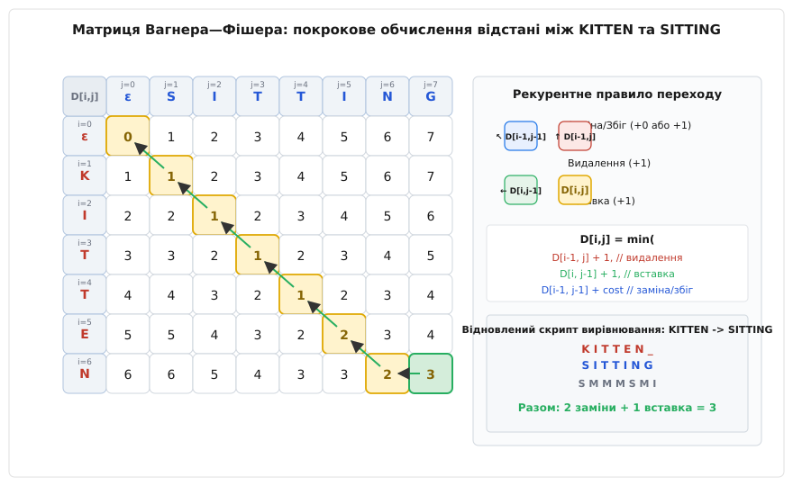
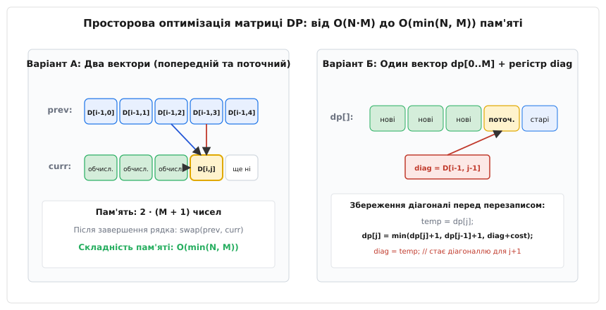
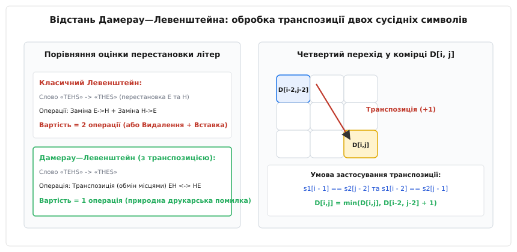
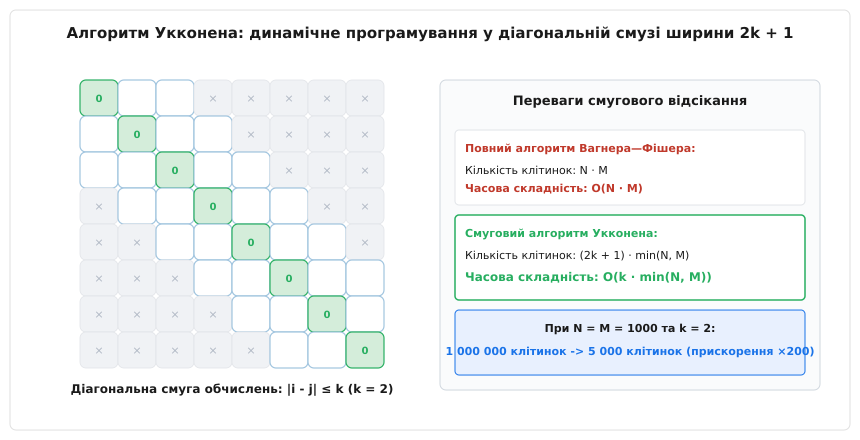
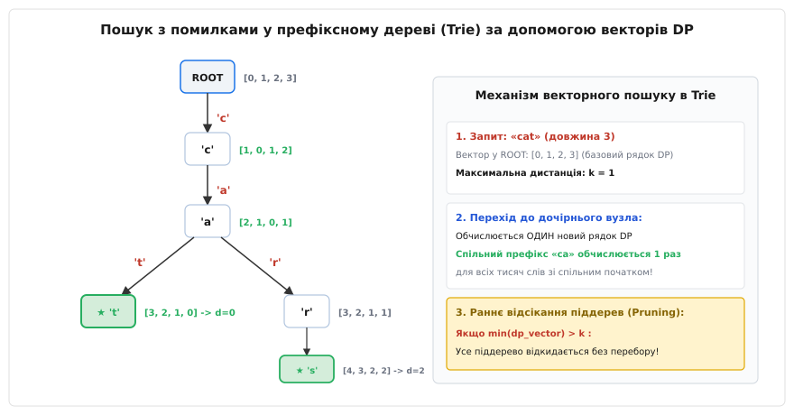

# Відстань Левенштейна

<preknowlist>
* [Динамічний масив](root:sf-algorithms/array)
* [Косинусна відстань](root:sf-algorithms/cosine-distance)
* [Асимптотична складність](root:computability/asymptotic-complexity)
</preknowlist>

Сканер розпізнавання тексту зчитує відсканований рядок `"computre"`, який необхідно зіставити зі словниковим записом `"computer"`. Просте посимвольне порівняння (відстань Хеммінга) фіксує незбіг на двох останніх позиціях, а у випадку пропуску однієї літери на початку слова — наприклад, `"omputer"` проти `"computer"` — відстань Хеммінга дає максимальну помилку 8 для слова довжиною 8, оскільки кожен наступний символ виявляється зміщеним на одну позицію праворуч. Порівняння рядків через жорсткий збіг індексів ламається при першій же вставці або втраті символу. Для вимірювання реальної схожості послідовностей необхідна метрика, інваріантна до локальних зсувів.

Такою метрикою є **відстань Левенштейна** (Levenshtein Distance), також відома як редакторська відстань (Edit Distance). Вона визначається як мінімальна кількість елементарних операцій редагування — **видалення** символу, **вставки** нового символу або **заміни** одного символу на інший — необхідних для трансформації одного рядка в інший.

Історію створення цієї метрики Володимиром Левенштейном у 1965 році для синхронізації каналів зв'язку та відкриття Дамерау щодо класифікації друкарських описок описано у вставці [Історія виникнення метрики](root:sf-algorithms/levenshtein-distance/hist-levenshtein.md).

## Елементарні операції редагування

Нехай задано вихідний рядок `s1` довжиною `N = |s1|` та цільовий рядок `s2` довжиною `M = |s2|`. Перетворення рядка `s1` на `s2` здійснюється за допомогою послідовності з трьох базових операцій, кожна з яких має одиничну вартість:

1. **Видалення (Deletion):** Вилучення одного символу з рядка `s1` (зменшує довжину рядка на 1).
2. **Вставка (Insertion):** Додавання одного символу в будь-яку позицію рядка `s1` (збільшує довжину на 1).
3. **Заміна (Substitution):** Заміна одного символу рядка `s1` на довільний символ алфавіту (довжина рядка не змінюється).

Якщо символ у рядку `s1` на поточній позиції збігається із символом у `s2`, вартість заміни дорівнює нулю (операція збігу / Match). Відстань Левенштейна `d_L(s1, s2)` дорівнює мінімальній сумарній вартості ланцюга операцій, що трансформує `s1` у `s2`.

Формальні доведення того, що ця функція строго задовольняє всі чотири аксіоми метричного простору (невід'ємність, тотожність нерозрізних, симетрію та нерівність трикутника), а також аналіз меж відстані наведено у вставці [Математичні властивості та доведення метрики](root:sf-algorithms/levenshtein-distance/math-levenshtein-metric.md).

## Рекурентне співвідношення та принцип Беллмана

Прямий перебір усіх можливих варіантів редагування має експоненціальну складність `O(3^(N+M))`. Однак задача володіє властивістю оптимальної підструктури: оптимальне перетворення рядка `s1` довжиною `N` на рядок `s2` довжиною `M` складається з оптимальних перетворень їхніх префіксів.

Позначимо через `D[i, j]` відстань Левенштейна між префіксом першого рядка `s1[1 .. i]` довжиною `i` та префіксом другого рядка `s2[1 .. j]` довжиною `j`. 

Базові випадки відповідають перетворенню непорожнього префікса на порожній рядок `ε` і навпаки:
- `D[0, 0] = 0` — відстань між двома порожніми рядками дорівнює нулю.
- `D[i, 0] = i` для всіх `0 ≤ i ≤ N` — щоб перетворити префікс довжини `i` на порожній рядок, необхідно виконати рівно `i` операцій видалення.
- `D[0, j] = j` для всіх `0 ≤ j ≤ M` — щоб перетворити порожній рядок на префікс довжини `j`, необхідно виконати рівно `j` операцій вставки.

Для довільних індексів `1 ≤ i ≤ N` та `1 ≤ j ≤ M` значення `D[i, j]` обчислюється через мінімум із трьох можливих попередніх станів:

```
cost = 0, якщо s1[i] == s2[j], інакше cost = 1

D[i, j] = min(
    D[i - 1, j] + 1,        // Видалення символу s1[i]
    D[i, j - 1] + 1,        // Вставка символу s2[j]
    D[i - 1, j - 1] + cost  // Заміна s1[i] -> s2[j] (або збіг)
)
```

Кожен із трьох переходів у рекурентному рівнянні відповідає завершенню перетворення останнього символу префікса:
1. Перехід згори від клітинки `D[i-1, j]` відповідає гіпотезі, що символ `s1[i]` є зайвим і повинен бути видалений з першого рядка. При цьому ми сплачуємо штраф одиницю за видалення та зводимо задачу до перетворення меншого префікса `s1[1 .. i-1]` у префікс `s2[1 .. j]`.
2. Перехід зліва від клітинки `D[i, j-1]` відповідає гіпотезі, що символ `s2[j]` відсутній у першому рядку і його необхідно вставити в кінець префікса `s1[1 .. i]`. За це ми сплачуємо штраф одиницю і зводимо задачу до зіставлення префікса `s1[1 .. i]` із префіксом `s2[1 .. j-1]`.
3. Перехід по діагоналі від клітинки `D[i-1, j-1]` зіставляє символ `s1[i]` із символом `s2[j]`. Якщо ці символи збігаються, операція не потребує штрафу, і ми безкоштовно переносимо значення з діагоналі. Якщо символи різні, ми сплачуємо одиницю за операцію заміни.

Принцип динамічного програмування гарантує, що значення в клітинці `D[i, j]` є глобально мінімальною вартістю перетворення префіксів, оскільки воно обирає найкращий із трьох взаємно вичерпних варіантів узгодження останніх символів. Жоден локально жадібний вибір не здатний гарантувати оптимальність, оскільки локальна заміна може закрити шлях до значно вигіднішого збігу довгого суфікса на наступних кроках.

## Алгоритм Вагнера—Фішера та матриця динамічного програмування

Алгоритм Вагнера—Фішера послідовно заповнює таблицю `D` розміром `(N + 1) × (M + 1)` рядок за рядком (або стовпчик за стовпчиком). Кожна комірка `D[i, j]` потребує інформації лише з трьох сусідніх комірок: верхньої `D[i-1, j]`, лівої `D[i, j-1]` та діагональної верхньої-лівої `D[i-1, j-1]`.

Розглянемо класичний приклад обчислення відстані між словами `s1 = "KITTEN"` (`N = 6`) та `s2 = "SITTING"` (`M = 7`):


*Матриця Вагнера—Фішера: покрокове заповнення таблиці DP для рядків KITTEN та SITTING. Жовтим виділено оптимальний шлях зворотного проходу, зеленим — фінальну відстань D[6, 7] = 3.*

Покрокове заповнення матриці здійснюється за такими правилами:
1. Ініціалізується нульовий рядок значеннями `0, 1, 2, 3, 4, 5, 6, 7` та нульовий стовпчик значеннями `0, 1, 2, 3, 4, 5, 6`.
2. Комірка `D[1, 1]` порівнює літери `'K'` та `'S'`: оскільки вони різні, `cost = 1`. Обчислюється `min(D[0, 1] + 1, D[1, 0] + 1, D[0, 0] + 1) = min(2, 2, 1) = 1`.
3. Комірка `D[2, 2]` порівнює літери `'I'` та `'I'`: літери однакові, `cost = 0`. Обчислюється `min(D[1, 2] + 1, D[2, 1] + 1, D[1, 1] + 0) = min(3, 3, 1) = 1`.
4. Комірка `D[3, 3]` порівнює літери `'T'` та `'T'`: знову збіг, `cost = 0`. Значення `D[3, 3] = min(D[2, 3] + 1, D[3, 2] + 1, D[2, 2] + 0) = min(3, 3, 1) = 1`.
5. Комірка `D[4, 4]` порівнює четверту літеру `'T'` першого слова з четвертою літерою `'T'` другого слова: збіг дає `D[4, 4] = 1`.
6. Комірка `D[5, 5]` порівнює літеру `'E'` з літерою `'I'`: різні літери вимагають заміни, тому `D[5, 5] = D[4, 4] + 1 = 2`.
7. Комірка `D[6, 6]` порівнює літеру `'N'` з літерою `'N'`: збіг переносить значення `D[5, 5] = 2` у клітинку `D[6, 6] = 2`.
8. Фінальна комірка `D[6, 7]` відповідає додаванню останньої літери `'G'` другого рядка: оскільки перший рядок вичерпано, виконується операція вставки `D[6, 6] + 1 = 3`.

Відстань Левенштейна між `"KITTEN"` та `"SITTING"` становить 3 операції.

## Відновлення шляху редагування (Backtracking)

Значення в комірці `D[N, M]` дає числову відстань, але не вказує, які саме операції слід виконати. Для побудови вирівнювання виконується зворотний прохід від комірки `(N, M)` до `(0, 0)`:

- Якщо `D[i, j] == D[i - 1, j - 1] + cost` (де `cost = 0` при збігу або `1` при заміні), ми переходимо в `(i - 1, j - 1)`: це відповідає операції заміни або збігу символів `s1[i]` та `s2[j]`.
- Якщо `D[i, j] == D[i - 1, j] + 1`, ми переходимо в `(i - 1, j)`: це відповідає видаленню символу `s1[i]` (у другому рядку ставиться пропуск `-`).
- Якщо `D[i, j] == D[i, j - 1] + 1`, ми переходимо в `(i, j - 1)`: це відповідає вставці символу `s2[j]` (у першому рядку ставиться пропуск `-`).

Для нашого прикладу зворотний прохід формує оптимальне вирівнювання:
```
s1:  K  I  T  T  E  N  -
s2:  S  I  T  T  I  N  G
Op:  S  M  M  M  S  M  I
```
Разом: заміна `K -> S`, три збіги `I, T, T`, заміна `E -> I`, збіг `N` та вставка `G` в кінець. Разом: 2 заміни + 1 вставка = 3 операції.

У практичних застосунках (наприклад, у біоінформатиці для вирівнювання послідовностей ДНК та білків) результат кодується у форматі CIGAR (Compact Idiosyncratic Gapped Alignment Report). Для наведеного вирівнювання CIGAR-рядок виглядає як `1S3M1S1M1I` (одна заміна, три збіги, одна заміна, один збіг, одна вставка).

Повні програмні реалізації матричного алгоритму та відновлення вирівнювання мовами C та C++ наведено у вставці [Практична реалізація та оптимізації](root:sf-algorithms/levenshtein-distance/proj-levenshtein-dp.md).

## Механізм обробки крайових випадків та несиметричних рядків

Аналіз поведінки матриці динамічного програмування на специфічних класах вхідних рядків дозволяє виявити важливі інваріанти алгоритму Вагнера—Фішера:

1. **Один рядок є префіксом іншого:** Якщо рядок s1 є префіксом s2 (наприклад, `"cat"` та `"caterpillar"`), діагональ збігів веде до клітинки `D[3, 3] = 0`. Від цієї точки оптимальний шлях рухається суворо горизонтально праворуч, додаючи по одиниці за кожну вставку суфікса. Фінальна відстань строго дорівнює різниці довжин `|s2| - |s1|`.
2. **Рядки не мають жодного спільного символу:** Якщо алфавіти рядків не перетинаються (наприклад, `"abc"` та `"def"`), рекурентний перехід обирає заміну для всіх перших `min(N, M)` символів і вставки/видалення для залишку. Фінальна відстань строго дорівнює `max(N, M)`.
3. **Повністю інвертовані рядки:** Для рядків `"abcde"` та `"edcba"` відстань становить 4 операції (дві заміни та збереження центрального символу `'c'`).

## Евристики розв'язання колізій при зворотній розмітці

При виконанні бектрекінгу часто виникають ситуації, коли поточне значення `D[i, j]` може бути однаково успішно досягнуте з двох або трьох сусідніх комірок (колізія рівної вартості). Порядок вибору предка визначає структуру побудованого вирівнювання:

- **Пріоритет заміни / збігу над вставками:** Мінімізує кількість пропусків (Gaps), створюючи щільні блоки зіставлення. Це критично для систем OCR, де літери спотворюються частіше, ніж губляться.
- **Пріоритет групування вставок і видалень:** Сприяє формуванню суцільних протяжних пропусків замість багатьох розрізнених поодиноких дефісів. У біоінформатиці такий підхід називається афінною системою штрафів за пропуски (Affine Gap Penalty), оскільки біологічна мутація часто вилучає або вставляє цілий фрагмент нуклеотидів за один еволюційний крок.

## Просторова оптимізація від `O(N · M)` до `O(min(N, M))`

Для обчислення комірки `D[i, j]` у поточному рядку потрібні лише значення з поточного рядка ліворуч (`D[i, j-1]`) та зі строго попереднього рядка зверху (`D[i-1, j]` та `D[i-1, j-1]`). Рядки `i - 2` та вище більше ніколи не використовуються.

Це дозволяє скоротити використання пам'яті двома способами:


*Схеми просторової оптимізації: Варіант А використовує два вектори однакової довжини зі свопом вказівників. Варіант Б використовує єдиний вектор dp[0..M] та скалярний регістр diag для збереження діагонального елемента.*

1. **Два вектори (Попередній та Поточний):** Виділяються два масиви довжини `M + 1` (`prev` та `curr`). Після заповнення `curr` вказівники міняються місцями (`swap(prev, curr)`). Пам'ять: `2 · (M + 1)`.
2. **Єдиний одновимірний вектор з регістром `diag`:** Виділяється єдиний масив `dp[0 .. M]`. Перед тим як перезаписати комірку `dp[j]` новим значенням `D[i, j]`, її старе значення (яке є `D[i-1, j]`) зберігається у тимчасовій змінній `temp`. Значення `diag`, збережене з попереднього кроку `j - 1`, містить `D[i-1, j-1]`. Після оновлення `dp[j] = min(...)` значення `diag` оновлюється: `diag = temp`.

Якщо `N < M`, рядки міняються місцями, тому просторова складність становить `O(min(N, M))` цілих чисел. Для слів довжиною 1000 символів це зменшує вимоги до оперативної пам'яті з 4 МБ до 4 КБ, що дозволяє масиву повністю поміститися у швидкісний L1-кеш процесора.

## Відстань Дамерау—Левенштейна: врахування транспозиції

У людському тексті найпоширенішою помилкою є перестановка двох сусідніх літер місцями внаслідок швидкого друку (наприклад, `"teh"` замість `"the"` або `"caft"` замість `"caft"`). Класичний Левенштейн оцінює перестановку двох літер у 2 операції (дві заміни або одне видалення та одну вставку).

Модифікація **Дамерау—Левенштейна** (Damerau—Levenshtein Distance) додає четверту елементарну операцію:
- **Транспозиція (Transposition):** Обмін місцями двох сусідніх символів `s1[i-1]` та `s1[i]` з вартістю 1 операція.


*Відстань Дамерау—Левенштейна: додавання четвертого переходу з комірки D[i-2, j-2] при виконанні умови рівності перехресних символів s1[i-1] == s2[j-2] та s1[i-2] == s2[j-1].*

Рекурентне співвідношення розширюється четвертим кандидатом:

```
D[i, j] = min(
    D[i - 1, j] + 1,        // видалення
    D[i, j - 1] + 1,        // вставка
    D[i - 1, j - 1] + cost  // заміна / збіг
)

якщо i > 1 та j > 1 та s1[i] == s2[j - 1] та s1[i - 1] == s2[j]:
    D[i, j] = min(D[i, j], D[i - 2, j - 2] + 1)  // транспозиція
```

Існує дві версії алгоритму Дамерау—Левенштейна:
- **Обмежена відстань (Optimal String Alignment, OSA):** Забороняє багаторазове редагування тієї самої підстроки (кожен символ може брати участь у транспозиції щонайбільше один раз). Вона обчислюється квадратичним алгоритмом `O(N · M)`, але формально не задовольняє нерівність трикутника для деяких специфічних комбінацій. Наприклад, для перетворення `"CA"` на `"ABC"` шлях через проміжне слово `"AC"` дає відстань 1 + 1 = 2, тоді як пряме обчислення OSA повертає 3, оскільки символ `'C'` не може бути повторно модифікований після транспозиції.
- **Необмежена відстань Дамерау—Левенштейна:** Дозволяє необмежену кількість операцій над транспонованими символами, задовольняє всі аксіоми метрики, але вимагає збереження масиву останніх позицій кожного символу алфавіту за алгоритмом Лоуранса—Вагнера.

## Алгоритм Укконена: смугове відсікання за порогом `k`

У більшості прикладних задач (перевірка орфографії, автодоповнення) нас цікавить лише питання: чи знаходиться відстань між рядками в межах невеликого фіксованого порогу `k` (наприклад, `k = 1` або `k = 2`), або вона перевищує `k`.

Якщо `|N - M| > k`, два рядки принципово не можуть мати відстань `≤ k`, оскільки для вирівнювання довжин потрібно щонайменше `|N - M|` вставок або видалень. У такому разі алгоритм миттєво повертає `k + 1` за час `O(1)`.

Якщо довжини підходять, алгоритм Еско Укконена обчислює лише ті комірки матриці, які відхиляються від головної діагоналі не більше ніж на `k`: `|i - j| ≤ k`.


*Алгоритм Укконена: діагональна смуга обчислень шириною 2k + 1. Усі комірки за межами пунктирних ліній ігноруються, що скорочує кількість операцій з O(N · M) до O(k · min(N, M)).*

Переваги алгоритму Укконена:
- Замість `N · M` клітинок обчислюється лише `(2k + 1) · min(N, M)` клітинок.
- Часова складність знижується з квадратичної `O(N · M)` до лінійної відносно довжини слова: `O(k · min(N, M))`.
- Якщо на черговому рядку всі значення всередині смуги перевищують поріг `k` (`min_{j} curr[j] > k`), алгоритм негайно перериває роботу (ранній вихід).

## Пошук з помилками у словнику: Trie та автомати Левенштейна

При пошуку слова в словнику на 500 000 записів виклик функції Левенштейна для кожного слова окремо є надто повільним. Багато слів мають спільні префікси (наприклад, `"car"`, `"cart"`, `"carbon"`, `"card"`).

Об'єднання префіксного дерева (Trie) з вектором динамічного програмування дозволяє обчислювати відстань одночасно для всіх слів словника:


*Пошук з помилками у префіксному дереві: кожен вузол отримує вектор DP від батьківського вузла. Гілки з мінімальним значенням вектора > k відсікаються без перебору.*

Механізм пошуку в Trie:
1. Корінь дерева отримує базовий вектор `[0, 1, 2, ..., |Query|]`.
2. При переході ребровом із символом `c` дочірній вузол генерує **лише один новий рядок DP** на основі вектора батьківського вузла та символу `c`.
3. Спільний префікс обчислюється рівно один раз для всіх тисяч слів, що починаються з цього префікса.
4. **Раннє відсікання гілок (Pruning):** Якщо мінімальне число у згенерованому векторі строго більше за поріг `k` (`min(dp_vector) > k`), усе піддерево цього вузла відкидається, оскільки жодне слово в цьому піддереві гарантовано не дасть відстань `≤ k`.

Повний опис інтерфейсу, структур конфігурації та приклад інтеграції Trie-пошуку наведено у вставці [Інтерфейс бібліотеки нечіткого пошуку](root:sf-algorithms/levenshtein-distance/api-fuzzy-search.md).

## Порівняння метрик текстової схожості

Для правильного вибору алгоритму в інженерній практиці необхідно розрізняти властивості споріднених метрик:

- **Відстань Хеммінга:** Працює виключно для рядків однакової довжини і враховує лише операцію заміни символу. Має складність `O(N)`, проте абсолютно безпорадна перед вставками та видаленнями.
- **Відстань Левенштейна:** Підтримує довільні довжини рядків, виправляє зсуви синхронізації через вставки та видалення, обчислюється за час `O(N · M)` або `O(k · N)`.
- **Відстань Дамерау—Левенштейна:** Розширює метрику Левенштейна операцією перестановки двох сусідніх літер з одиничною вартістю, що робить її ідеальним вибором для виправлення друкарських помилок людини.
- **Найдовша спільна підпослідовність (LCS):** Використовує лише видалення та вставки (заміна заборонена або має подвійну вартість). Застосовується в утилітах порівняння вихідного коду (diff, Git).
- **Метрика Джаро—Вінклера (Jaro-Winkler):** Неперервна нормалізована оцінка від 0 до 1, оптимізована для порівняння коротких власних назв та прізвищ. Вона надає більшу вагу збігам на початку слова.


## Математичні інваріанти та властивості матриці динамічного програмування

Для глибокого розуміння природи алгоритму Вагнера—Фішера слід проаналізувати фундаментальні властивості та числові інваріанти матриці D:

### 1. Лемма про одиничний градієнт сусідніх комірок

Для будь-яких допустимих індексів i та j різниця між сусідніми значеннями в матриці DP обмежена одиницею:

- Різниця по горизонталі: `|D[i, j] - D[i, j - 1]| <= 1`
- Різниця по вертикалі: `|D[i, j] - D[i - 1, j]| <= 1`
- Різниця по діагоналі: `|D[i, j] - D[i - 1, j - 1]| <= 1`

Ця властивість гарантує, що значення матриці змінюються абсолютно неперервно і плавно, без різких стрибків, що є фундаментом для смугових методів та бітових векторних алгоритмів Маєрса.

### 2. Діагональна монотонність

Значення вздовж будь-якої діагоналі матриці (де різниця індексів j мінус i є сталою величиною) є монотонно неспадною послідовністю цілих чисел:

`D[i + 1, j + 1] >= D[i, j]`

Діагональ може або зберегти своє значення (у випадку збігу символів `s1[i] == s2[j]`), або збільшитися на одиницю при незбігу. Спад значення вздовж діагоналі математично неможливий, оскільки додавання нових символів до обох рядків ніколи не може зменшити мінімальну кількість необхідних дій редагування.

## Необмежена відстань Дамерау—Левенштейна та алгоритм Лоуранса—Вагнера

У практичних застосунках часто виникає потреба обчислювати повну, необмежену версію відстані Дамерау—Левенштейна, яка дозволяє переставляти символи місцями, навіть якщо між ними відбувалися інші вставки чи видалення.

На відміну від обмеженої моделі OSA, яка дивиться лише на дві сусідні комірки `D[i-2, j-2]`, алгоритм Лоуранса—Вагнера використовує додатковий масив `last_row` розміром з потужність алфавіту (256 елементів для ASCII або хеш-таблиця для Unicode). Цей масив зберігає номер останнього рядка, у якому зустрічався кожен символ алфавіту.

Рекурентне рівняння Лоуранса—Вагнера знаходить попереднє входження символу `s2[j]` у першому рядку на позиції `k` та попереднє входження символу `s1[i]` у другому рядку на позиції `l`. Вартість узагальненої транспозиції обчислюється як:

`D[i, j] = min(..., D[k - 1, l - 1] + (i - k - 1) + 1 + (j - l - 1))`

де доданки `(i - k - 1)` та `(j - l - 1)` точно враховують кількість видалень та вставок, необхідних для зближення двох перестановочних символів. Необмежена версія Дамерау—Левенштейна є дійсною метрикою і строго задовольняє нерівність трикутника для абсолютно будь-яких рядків.

## Архітектура індексації великих баз даних: N-грами, BK-дерева та VP-дерева

Масштабування нечіткого пошуку на колекції з десятків мільйонів документів вимагає створення спеціалізованих індексних структур, оскільки лінійне сканування бази даних навіть за допомогою швидкісних автоматів призводить до неприпустимих затримок відповіді. У промислових пошукових рушіях та реляційних СУБД застосовуються два фундаментальні підходи до індексації:

### 1. Дерева Беркхарда—Келлера (BK-Trees) та дерева орієнтирів (VP-Trees)

Дерево Беркхарда—Келлера є спеціалізованою структурою даних для дискретних метричних просторів, яка використовує аксіому нерівності трикутника для швидкого відсікання нерелевантних піддерев. Кожен вузол дерева містить довільне слово зі словника, а його дочірні ребра маркуються цілочисельними значеннями відстані Левенштейна від поточного слова до нащадків.

При надходженні пошукового запиту q з радіусом k алгоритм обчислює відстань d = dL(root, q) від кореневого слова до запиту. За нерівністю трикутника будь-яке слово w у піддереві, що задовольняє умову dL(w, q) <= k, обов'язково повинно мати відстань до кореня dL(root, w) у межах від d - k до d + k. Усі дочірні гілки дерева, чиї ваги ребер виходять за межі цього інтервалу, повністю ігноруються без обчислення відстані до їхніх елементів.

Дерева опорних точок (Vantage Point Trees, VP-Trees) розвивають цю ідею для неперервних просторів та великих алфавітів, розбиваючи простір на сферичні оболонки навколо кількох фіксованих точок-орієнтирів.

### 2. Триграмна фільтрація та інвертовані індекси

У реляційних базах даних (наприклад, розширення pg_trgm у PostgreSQL) класичним стандартом є попереднє розбиття слів на множини триграм (підрядків фіксованої довжини 3 символи). Наприклад, для слова `"kitten"` формується набір триграм `{"  k", " ki", "kit", "itt", "tte", "ten", "en "}`.

Якщо два рядки знаходяться на відстані Левенштейна не більше k, кількість їхніх спільних триграм обмежена знизу аналітичною формулою. СУБД виконує надзвичайно швидкий пошук через інвертований індекс GIN або GiST за множиною спільних триграм, вибираючи лише кілька десятків кандидатів із мільйонної таблиці. На фінальному етапі для відібраних кандидатів запускається точний смуговий алгоритм Укконена, що гарантує час відповіді запиту менше однієї мілісекунди.


## Алгоритми вирівнювання послідовностей: глобальне, локальне та напівглобальне вирівнювання

У прикладних задачах аналізу текстів та молекулярної біології використовуються три основні постановки задачі вирівнювання:

1. **Глобальне вирівнювання (Global Alignment, Нідельман—Вунш / Вагнер—Фішер):** Вимагає узгодження обох послідовностей по всій їхній довжині від першого до останнього символу. Граничні умови ініціалізують перший рядок та перший стовпчик зростаючими значеннями `0, 1, 2, ..., N`. Цей підхід ідеальний для порівняння слів однакової або близької довжини та гомологічних білків.
2. **Локальне вирівнювання (Local Alignment, алгоритм Сміта—Ватермана):** Знаходить найбільш схожі фрагменти всередині двох довгих послідовностей без штрафу за неузгоджені кінці. Матриця D ніколи не приймає від'ємних значень (додається четвертий варіант `max(0, ...)`), а нульовий рядок та стовпчик заповнюються нулями.
3. **Напівглобальне вирівнювання (Semi-global / End-free Alignment):** Дозволяє вільні пропуски на початку або в кінці одного з рядків. Використовується при пошуку короткого слова-зразка всередині великого тексту (Approximate Substring Matching).

## Розрахунок нормованої метрики схожості та коефіцієнтів подібності

У багатьох аналітичних системах числову відстань Левенштейна dL перетворюють на відносний коефіцієнт схожості Sim у діапазоні від 0 (повна відсутність схожості) до 1 (абсолютна графічна тотожність):

- **Нормування за максимальною довжиною:** `Sim(s1, s2) = 1 - (dL(s1, s2) / max(|s1|, |s2|))`
- **Нормування за сумою довжин:** `Sim_sum(s1, s2) = 1 - (2 * dL(s1, s2) / (|s1| + |s2| + dL(s1, s2)))`

Таке нормування дозволяє безпосередньо порівнювати між собою якість збігу пар слів різної довжини, що є обов'язковою вимогою при ранжуванні результатів пошукових запитів в електронній комерції та пошукових порталах.


## Обчислювальна складність та умовна нижня оцінка SETH

Тривалий час залишалося відкритим фундаментальне теоретичне питання: чи можна розробити алгоритм обчислення відстані Левенштейна, який би працював строго швидше за квадратичний час для довільних рядків, наприклад за час порядку O(N^(2 - eps)) для деякого додатного числа eps?

У 2015 році вчені Артюрс Бакшіс та Петро Індік із Массачусетського технологічного інституту (MIT) опублікували фундаментальну працю, у якій довели: якщо гіпотеза про сильну експоненціальну складність (Strong Exponential Time Hypothesis, SETH) для задачі булевої здійсненності CNF-SAT є вірною, то алгоритм обчислення відстані Левенштейна за час O(N^(2 - eps)) не може існувати в принципі.

Цей результат підтвердив, що квадратична складність алгоритму Вагнера—Фішера O(N · M) є асимптотично оптимальною для загального випадку. Будь-які подальші прискорення можливі виключно через уведення евристичних обмежень, таких як поріг максимальної відстані k (алгоритм Укконена), індексування префіксів або використання апаратного паралелізму інструкцій SIMD та GPU.


## Практичні аспекти вибору порогових значень

У реальних діалогових системах та пошукових порталах поріг максимальної відстані k обирається залежно від довжини пошукового запиту користувача:
- Для коротких слів довжиною від одного до трьох символів поріг k встановлюється рівним нулю (дозволяється лише точний збіг), оскільки заміна хоча б однієї літери у трилітерному слові кардинально змінює його лексичне значення та породжує сотні нерелевантних результатів.
- Для слів середньої довжини від чотирьох до шести символів використовується поріг k = 1, що покриває понад 80% типових механічних описок на клавіатурі.
- Для довгих слів довжиною від семи символів і більше встановлюється поріг k = 2, що дозволяє виправляти комбіновані друкарські помилки без відчутного зниження точності видачі.

## Сфери застосування та практичні компроміси

| Галузь | Специфіка задачі | Використовуваний алгоритм |
|---|---|---|
| **Спелчекери та пошукові підказки** (Google, Elasticsearch) | Пошук слів за словником із похибкою `k ≤ 2` | Автомати Левенштейна + Префіксні дерева (FST / Trie) |
| **Біоінформатика** (BLAST, FASTA, DNA alignment) | Вирівнювання ланцюгів ДНК довжиною `10^6` нуклеотидів | Зважений алгоритм Нідельмана—Вунша / Сміта—Ватермана |
| **Контроль версій та diff-утиліти** (Git, diff) | Порядкове порівняння текстових файлів | Алгоритм Маєрса `O(ND)` на базі операцій видалення/вставки (LCS) |
| **Оптичне розпізнавання тексту** (Tesseract OCR) | Виправлення помилок сканування з урахуванням оптичної схожості літер | Зважена відстань Левенштейна з матрицею вартостей замін |
| **Нечітке зіставлення в базах даних** (PostgreSQL pg_trgm, Levenshtein) | Пошук дублікатів клієнтів (Fuzzy Deduplication) | Комбінація N-грамного індексу та фільтрації Левенштейна |

> 🔧 **Навіщо це.**
> Відстань Левенштейна перетворює абстрактну нечіткість тексту на точне метричне число. У реальних системах ніколи не викликають повний алгоритм `O(N · M)` над усією базою даних. Завжди застосовують каскадну фільтрацію: спочатку дешевий фільтр за довжиною рядка `| |u| - |v| | ≤ k` та N-грамний індекс для відбору сотні ймовірних кандидатів, а потім швидкий смуговий алгоритм Укконена або Trie-автомат для точного ранжування. Це дозволяє здійснювати миттєвий автопошук за мільйонними базами даних без навантаження на процесор.
