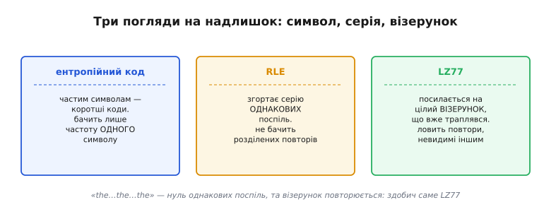
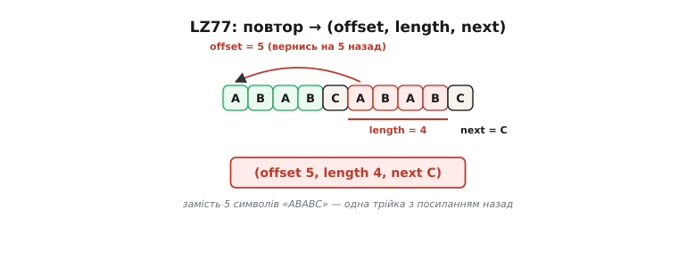
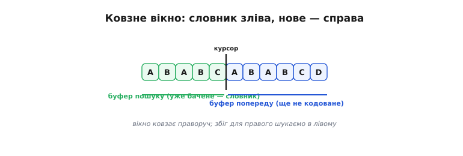

# LZ77

<preknowlist>
- [Ентропійні коди](root:math-information/entropy) — стиснення, що зважує частоту кожного окремого символу; його межа — ентропія Шеннона.
- [Код Гаффмана](root:math-information/huffman-coding) — найвідоміший ентропійний код: частій літері короткий код, рідкісній — довший.
- [RLE](root:sf-algorithms/rle) — згортання серії однакових символів поспіль у пару «символ + скільки разів».
</preknowlist>

### Надлишок, якого посимвольний код не бачить

[Ентропійні коди](root:math-information/entropy) дивляться на дані крізь вузьку шпарину — вони бачать **окремий символ** і його частоту. [Гаффман](root:math-information/huffman-coding) дає частій літері короткий код, рідкісній довгий — і на цьому весь його зір кінчається. [RLE](root:sf-algorithms/rle) бачить трохи більше: серію **однакових** символів поспіль. Та обидва сліпі до найпоширенішого роду надлишку в реальних даних — **повтореного шматка**.

Поглянь на рядок «the cat sat on the mat». Однакових символів поспіль тут катма — RLE безсилий. Частоти літер помірно нерівні — Гаффман вижме хіба чверть. Але людське око одразу бачить, що «the » повторилося, і «at» теж не вперше. Цілий **візерунок із кількох байтів** трапляється знову — а посимвольний код цього не помічає в принципі, бо рахує літери поодинці, не пам'ятаючи, що вже бачив таку саму низку.


*Три погляди на надлишок. Ентропійний код важить частоту **одного** символу; RLE згортає серію **однакових поспіль**; LZ77 посилається на цілий **візерунок**, що вже траплявся. Рядок «the…the…the» не має жодної пари однакових сусідів, та візерунок повторюється — і це здобич саме LZ77.*

Ось задача, що її розв'язали 1977 року двоє ізраїльських інженерів — **Авраам Лемпель** і **Якоб Зів** (англ. *Abraham Lempel*, *Jacob Ziv*; звідси й назва — **LZ**, від їхніх прізвищ, і **77** — рік статті). Їхня думка проста до краю: якщо шматок даних **уже зустрічався раніше**, не пиши його вдруге — пошли **посилання назад** на те місце, де він був. Це і є **словникове стиснення** (*dictionary compression*): словником слугують самі **вже бачені дані**, а кодом — вказівка «вернись туди й візьми звідти стільки-то».

### Посилання назад замість повтору

Як саме виглядає таке посилання? Двома числами. **Зсув** (*offset*, англ. «зміщення») — на скільки символів вернутися назад від поточного місця, щоб дійти до початку повтору. **Довжина** (*length*) — скільки символів звідти скопіювати. Пара **(зсув, довжина)** повністю замінює цілий повторений шматок: замість десятка байтів — два невеликі числа.

Але є тонкість. Що робити, коли наступний символ ще ніде не траплявся — нема куди посилатися? Тоді посилання не побудуєш, і символ доводиться записати **як є**. Класичний LZ77 розв'язав це елегантно: кожен крок видає не пару, а **трійку (зсув, довжина, наступний символ)**. Спершу посилання на повтор, а одразу за ним — **один новий символ**, той, що йде відразу по знайденому збігу й розриває його. Так навіть коли повтору нема зовсім (зсув і довжина нульові), трійка все одно несе хоч один свіжий символ — і кодувальник ніколи не застрягає.


*Душа LZ77. Низка «ABAB» на п'ятій позиції вже траплялася п'ять символів тому. Замість писати її заново — трійка: вернись на **5** назад, візьми **4** символи, а далі додай новий **C**. П'ять символів «ABABC» стиснулися в одне посилання плюс один свіжий байт.*

Прочитаймо трійку `(5, 4, C)` як декодер. «Вернись на 5 символів назад» — стаємо на початок попереднього «ABAB». «Візьми 4» — копіюємо `A`, `B`, `A`, `B`. «Далі C» — дописуємо новий символ `C`. Вийшло `ABABC` — точно те, що було. Жодного словника зберігати не треба: словник — це **сам уже відновлений вихід**, і обидві сторони, кодувальник і декодер, будують його однаково.

### Ковзне вікно: словник, що їде разом з даними

Постає природне питання: а як **далеко** назад дозволено посилатися? Можна було б — на весь файл від початку. Та що довший файл, то довше шукати в ньому збіг і то більше бітів треба на зсув (щоб занумерувати позицію в гігабайтному файлі, потрібно багато бітів). Тому LZ77 дивиться назад не на все, а лише на **останні N символів** — крізь так зване **ковзне вікно** (*sliding window*).

Вікно ділиться курсором на дві частини. Зліва від курсора — **буфер пошуку** (*search buffer*): уже закодовані, уже бачені дані, наш робочий словник. Справа — **буфер попереду** (*look-ahead buffer*): символи, які ще тільки належить закодувати. Кодувальник дивиться на початок правого буфера й шукає **найдовший** його збіг у лівому. Знайшов — видає трійку й **посуває курсор уперед** рівно на стільки символів, скільки з'їла трійка. Вікно ковзає праворуч уздовж даних, словник їде разом із ним — звідси й назва.


*Ковзне вікно. Курсор ділить дані на **буфер пошуку** (зліва — уже бачене, наш словник) і **буфер попереду** (справа — те, що кодуємо). Збіг для початку правого буфера шукаємо в лівому; після кожної трійки курсор їде праворуч, і вікно ковзає вздовж даних.*

> 🔧 **Навіщо це.** Розмір вікна — головний регулятор LZ77, і його крутять усі формати на цьому стиску. Що ширше вікно, то далі назад можна дотягтися — отже, ловляться **далекі** повтори (скажімо, той самий абзац-шаблон, що трапляється раз на сторінку), і стиск кращий. Платиш за це двома речами: вікно треба **тримати в пам'яті**, а збіг у ньому — **довше шукати**. Тому на дрібному процесорі чи в жорсткому реальному часі беруть вікно поменше — гірший стиск, зате швидко й ощадно до пам'яті; для архіватора на потужній машині вікно роблять великим. Формат [DEFLATE](root:sf-algorithms/deflate) (серце zip, gzip і PNG) спинився на **32 кілобайтах** — перевірений компроміс між силою стиску та швидкістю й апетитом до пам'яті.

### Закодуймо рядок із повторами руками

Прикладами слова оживають, тож закодуймо рядок цілком. Візьмемо щось із виразним повтором:

```
A B R A C A D A B R A
```

Кодувальник іде зліва направо. На кожному кроці він дивиться на буфер попереду (те, що праворуч від курсора) і шукає найдовший збіг **позаду**, у вже закодованому. Спочатку позаду порожньо, тож перші символи доводиться писати як є — трійками з нульовим посиланням:

```
крок 1: позаду нічого           → (0, 0, A)    словник: A
крок 2: попереду BRACA…, B нема  → (0, 0, B)    словник: AB
крок 3: попереду RACA…, R нема   → (0, 0, R)    словник: ABR
крок 4: попереду ACAD…, A є!     ┐
        але далі AC, а позаду AB │ збіг лише «A», довжина 1
        найдовший збіг — сам «A» ┘ → (3, 1, C)  словник: ABRACA…  (вернись на 3, візьми «A», далі C)
крок 5: попереду ADABRA, «A» є   ┐
        далі «AD»? позаду «AC» — ні; найдовший збіг знову «A» (на 2 назад)
                                  └ → (2, 1, D)  словник: ABRACAD
крок 6: попереду ABRA — а це ж   ┐
        точно початок! на 7 назад │ «ABRA» = 4 символи поспіль збігаються
        збіг «ABRA», довжина 4    ┘ → (7, 4, —)  словник: ABRACADABRA  (кінець)
```

Дивись на крок 6 — у ньому вся сила методу. Хвіст «ABRA» дослівно повторює початок рядка, що був **сім символів тому**. Замість чотирьох символів кодувальник пише одне посилання `(7, 4)` — «вернись на сім, візьми чотири». Чотири байти стиснулися в одну коротку трійку. Декодер відновить усе точно, бо на момент кроку 6 він уже має в себе відновлене «ABRACAD» — і просто скопіює з нього потрібні чотири символи.

Ось як виглядав би декодер у прошивці — він навіть простіший за кодувальник, бо нічого не шукає, лише копіює назад:

:::tabs
```c
// Декодер LZ77: розгортає потік трійок (offset, length, next) назад у дані.
// out — буфер виходу, який заразом служить «словником»: копіюємо з нього ж.
size_t lz77_decode(const Triple *in, size_t n_triples, uint8_t *out) {
    size_t o = 0;                       // скільки символів уже відновлено
    for (size_t i = 0; i < n_triples; i++) {
        size_t off = in[i].offset;      // на скільки назад
        size_t len = in[i].length;      // скільки копіювати
        // копіюємо len символів із уже відновленого хвоста (по одному —
        // це важливо: збіг може накладатися сам на себе, див. нижче)
        for (size_t k = 0; k < len; k++)
            out[o + k] = out[o - off + k];
        o += len;
        if (in[i].has_next)             // і дописуємо свіжий символ, якщо він є
            out[o++] = in[i].next;
    }
    return o;
}
```
```python
# Декодер LZ77: розгортає потік трійок (offset, length, next) назад у дані.
# out — буфер виходу, який заразом служить «словником»: копіюємо з нього ж.
def lz77_decode(triples):
    out = bytearray()                     # росте разом зі «словником»
    for off, length, nxt in triples:
        # копіюємо length символів із уже відновленого хвоста (по одному —
        # це важливо: збіг може накладатися сам на себе, див. нижче)
        for _ in range(length):
            out.append(out[len(out) - off])
        if nxt is not None:               # і дописуємо свіжий символ, якщо він є
            out.append(nxt)
    return bytes(out)
```
:::

Зверни увагу на коментар «по одному»: копіювати треба **посимвольно зліва направо**, а не одним блоком. Бо збіг у LZ77 цілком може **накладатися сам на себе** — зсув менший за довжину. Скажімо, трійка `(1, 5, …)` означає «вернись на один символ і скопіюй п'ять»: копіюючи по одному, ми розмножуємо цей один символ уп'ятеро (так LZ77 кодує те саме, що й RLE, — серію однакового). Якби копіювали блоком, такий збіг зламався б. Дрібниця в коді — а без неї декодер дасть сміття.

### Чому LZ77 ловить те, що іншим невидиме

Сила LZ77 — саме в **довжині** того, на що він посилається. Один збіг може накрити не два-три символи, як RLE, а цілі **слова, рядки, абзаци** — будь-який шматок, що вже траплявся, хай навіть усередині нього всі символи різні. Через те він чудово тисне те, де іншим нема за що зачепитися:

- **Текст** — слова й закінчення повторюються повсякчас («-ння», «який», «тому»); кожен повтор стає коротким посиланням.
- **Програмний код** — ключові слова, відступи, цілі скопійовані рядки.
- **Структуровані дані** — HTML, JSON, XML: ті самі теги й ключі знову й знову.
- **Логи телеметрії** — однакові префікси й шаблони повідомлень у кожному рядку.

У всіх цих даних повтори **розкидані**, перемежовані несхожим, — тому RLE (якому потрібні однакові **поспіль**) і ентропійний код (що рахує символи поодинці) їх не бачать. А LZ77 саме на них і живе. Та сама причина пояснює і його межу: на даних **без повторів** — на вже стиснутому файлі, на справжньому шумі — посилатися нема на що, кожен символ новий, і LZ77 не стискає нічого (ба навіть трохи роздуває, бо на кожен новий символ іде трійка з порожнім посиланням).

> 🔧 **Навіщо це.** Звідси випливає, як LZ77 застосовують на практиці: майже **ніколи наодинці**. Сам він прибирає **повтори** — перетворює дані на потік посилань і нечастих свіжих символів. Але самі ці посилання й символи теж нерівномірні: одні зсуви й довжини трапляються частіше за інші. Тут і вступає [ентропійний код](root:math-information/huffman-coding): він дотискає вихід LZ77, віддаючи частим числам коротші коди. Зв'язка «LZ77 ловить повтори → Гаффман дотискає решту» лежить в основі практично всіх архіваторів — і саме так влаштований [DEFLATE](root:sf-algorithms/deflate).

### Від трійки до LZSS і DEFLATE

У класичній трійці є дрібна, але прикра вада. Свіжий символ чіпляється до **кожного** посилання — навіть коли довкола суцільні повтори й ніякого свіжого символу там, по суті, не треба. А ще буває, що збіг короткий — на один-два символи; тоді посилання на нього займає **більше** місця, ніж зайняли б самі ці символи дослівно, і трійка програє.

Обидві вади знімає поширений нащадок LZ77 — **LZSS** (Lempel–Ziv–Storer–Szymanski, за прізвищами Лемпеля, Зіва та двох інженерів, що його доопрацювали). Замість жорсткої трійки LZSS перед кожним елементом ставить **один біт-прапорець**: `0` — далі йде дослівний символ (літерал), `1` — далі йде пара (зсув, довжина). Тепер символи й посилання незалежні: коли вигідне посилання — пишемо пару, коли вигідніший дослівний символ (бо збіг закороткий) — пишемо його. Короткі, невигідні збіги LZSS просто **не використовує**, лишаючи символ як є, — і ніколи не програє через них.

Саме LZSS, а не голий LZ77, лежить в основі справжніх форматів. Найвідоміший — уже згаданий **DEFLATE**: він бере LZSS, щоб виловити повтори, а тоді **дотискає** і літерали, і посилання [кодом Гаффмана](root:math-information/huffman-coding). Ця двоступенева зв'язка — словниковий крок плюс ентропійний — і стискає zip-архіви, gzip-сторінки та зображення PNG. LZ77 був першою цеглиною; на ній виросла половина стиснення, яким ми користуємося щодня.
