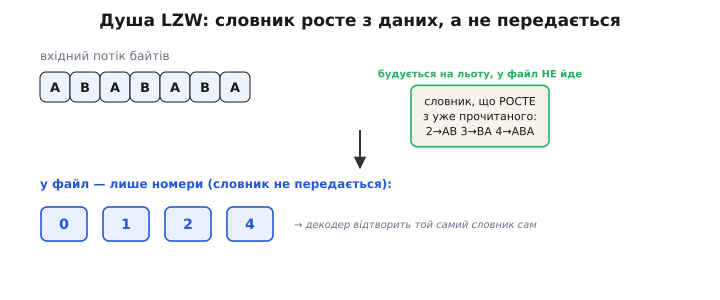
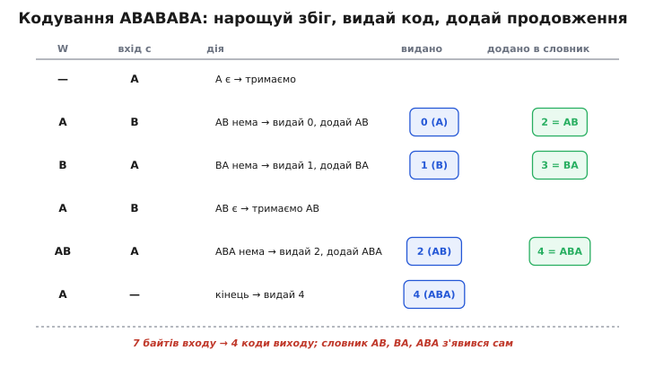
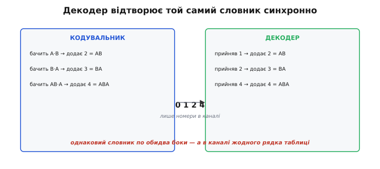
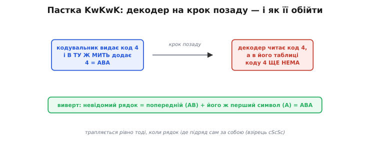

# LZW

<preknowlist>
- [Навіщо стискати](topic:math-information/why-compress) — що таке стиснення без втрат і чому в даних узагалі є надмірність, яку можна прибрати.
- [LZ77](topic:sf-algorithms/lz77) — словниковий підхід: повтори заносять раз у словник і далі підставляють короткий номер замість цілого шматка.
</preknowlist>

Більшість словникових стискачів мають прикру турботу: вони знаходять у даних повтори, складають із них словник — і цей словник доводиться **комусь передати**, інакше той, хто розпаковує, не знатиме, що означає кожен номер. Словник їсть місце, і на коротких файлах може з'їсти весь виграш. LZW (англ. *Lempel-Ziv-Welch*, на честь трьох авторів) знімає цю турботу одним зухвалим ходом: словник **не передається зовсім**. Кодувальник будує його на льоту з байтів, що вже пройшли потоком, а декодер будує **точно такий самий** словник із тих самих байтів — синхронно, на крок позаду. У канал летять самі номери. Це робить LZW простим і швидким, і саме тому він десятиліттями сидів у GIF, TIFF та Unix `compress` — усюди, де треба стиснути потік за один прохід, без зайвого заголовка.

### Стара біда: словник доводиться передавати

Щоб відчути, що винайшов LZW, спершу побачмо проблему, яку він обходить. Будь-яке словникове стиснення тримається на простій думці: якщо той самий шматок даних трапляється багато разів, занесімо його раз у словник і далі підставляймо короткий номер замість цілого шматка. Виграш очевидний, поки номер коротший за сам рядок.

Та постає питання, яке псує всю красу: **звідки декодер візьме словник?** Номер №7 для нього порожній звук, поки він не знає, який рядок за ним стоїть. Найпрямолінійніший вихід — прикласти словник до файлу. Але це коштує: він займає місце, і на невеликих даних його опис може переважити саму економію. До того ж, щоб скласти такий словник, дані треба прочитати **двічі** — раз, щоб знайти повтори, і вдруге, щоб закодувати. Два проходи й важка шапка — ось ціна наївного словника.

LZW ставить питання інакше: а що, якби словник можна було **не передавати взагалі**? Якби обидва боки будували його незалежно, з тих самих даних, за тим самим правилом — і завжди отримували однакову таблицю? Тоді в канал ішли б самі номери, заголовок зник би, а прохід лишився б **один**.

### Ідея: словник росте з потоку

Думка, що робить це можливим, проста до зухвалості. Декодер бачить **ті самі байти**, що й кодувальник, — лише трохи згодом, коли їх розпакує. Якщо правило поповнення словника спирається **лише на вже пройдені дані**, декодер може застосувати те саме правило до тих самих даних і дістати **той самий** словник. Передавати його не треба — він відтворюється на льоту по обидва боки.

*Душа LZW. Кодувальник нарощує словник із байтів, що вже пройшли потоком (рядки AB, BA, ABA з'являються самі), а у файл віддає **лише номери**. Сам словник нікуди не йде — декодер відбудує його з тих самих байтів за тим самим правилом. Звідси й один прохід, і відсутність важкого заголовка.*

Лишається домовитися про дві речі, спільні для обох боків. По-перше, з **чого починати**, щоб словник не був порожній на старті: інакше перший же байт нема як закодувати. LZW стартує з повного набору **одиночних символів** — для байтових даних це 256 записів, коди від 0 до 255, по одному на кожне можливе значення байта. Цей початковий словник однаковий завжди, тож обидва боки просто знають його напам'ять. По-друге, **яке правило** додає нові, довші записи. Саме воно — серце алгоритму.

### Правило кодувальника: нарощуй збіг, тоді видавай

Кодувальник тримає в руці один **поточний рядок** `W` і читає вхід байт за байтом. На кожен новий символ `c` він питає одне: чи є продовжений рядок `W+c` уже в словнику?

- Якщо **є** — збіг можна подовжити: робимо `W ← W+c` і читаємо далі, не видаючи нічого. Так `W` жадібно росте, поки відповідає чомусь відомому.
- Якщо **нема** — час видати код. Виплюнь у вихід **номер рядка `W`** (він точно в словнику — ми ж нарощували його, лишаючись усередині таблиці), тоді **додай новий запис `W+c`** під наступним вільним номером і почни новий рядок із самого `c`: `W ← c`.

Коли вхід скінчився — видай номер того `W`, що лишився в руці. Подивімось це на найпростішому промовистому прикладі — рядку `ABABABA`. Щоб не тягти всі 256 байтів, уявімо, що алфавіт тут лише з двох літер: код `A` = 0, код `B` = 1, наступний вільний номер — 2.

*Кодування ABABABA крок за кроком. Поки продовження `W+c` знаходиться в словнику, рядок `W` росте мовчки; щойно `W+c` нема — кодувальник видає номер `W` і заводить новий запис `W+c`. Сім байтів входу обернулися на чотири коди, а словник AB, BA, ABA склався сам, без жодного зусилля з боку даних.*

Простежмо вголос. `W` порожній, читаємо `A` — рядок `A` у словнику є, тримаємо `W=A`. Читаємо `B`: рядка `AB` ще нема — **видаємо 0** (`A`), **додаємо `AB`=2**, `W=B`. Читаємо `A`: `BA` нема — **видаємо 1** (`B`), **додаємо `BA`=3**, `W=A`. Читаємо `B`: `AB` **уже є** — не видаємо нічого, лише ростемо: `W=AB`. Читаємо `A`: `ABA` нема — **видаємо 2** (`AB`), **додаємо `ABA`=4**, `W=A`. Читаємо `B`: `AB` знову є — `W=AB`. Читаємо останнє `A`: `ABA` **тепер теж є** (номер 4) — `W=ABA`. Вхід скінчився — видаємо номер того, що в руці: **4** (`ABA`). Увесь вихід — `0 1 2 4`.

Зверни увагу на головне: **словник AB, BA, ABA склався сам**, із самих вхідних байтів, без жодної підказки ззовні. Кодувальник ніде не записав цю таблицю у вихід — він її просто **виростив**. І рядки в ній довшають мірою того, як той самий візерунок повторюється: спершу пари (`AB`, `BA`), тоді трійка (`ABA`). Що довше тягнеться повтор, то довший шмат ловить один код — звідси й стиск: сім байтів обернулися на чотири номери.

> 🔧 **Навіщо це.** Один прохід і нульовий словник у заголовку — ось чому LZW так любили там, де дані течуть **потоком**: у файлових архіваторах, у драйверах дисків (для чого Велч його й задумав), у форматах картинок. Кодувальникові не треба бачити весь вхід наперед, щоб почати тиснути, — він починає з першого ж байта. Для вбудованої системи це означає малу й передбачувану пам'ять: таблиця фіксованого розміру, ніяких двох читань, ніякого буфера на цілий файл.

### Декодер відбудовує той самий словник

Тепер найкрасивіше: як декодер дістає той самий словник, не отримавши його. Він теж стартує з тих самих 256 одиночних символів і теж тримає в руці **попередній** розкодований рядок. Прийнявши черговий номер, він переводить його в рядок за своєю таблицею й виводить, а тоді додає новий запис — попередній рядок плюс **перший символ** щойно розкодованого. Чому цей доданий запис збігається з тим, що додав кодувальник? Бо кодувальник додавав `W+c` — щойно виданий рядок плюс перший символ **наступного**; а для декодера «наступний» — це рівно той рядок, що він розкодує з наступного номера. Тож обидва боки додають той самий запис, лише декодер — на крок пізніше, коли прийде наступний код.

*Дзеркало без передачі. Кодувальник додає запис, побачивши два символи; декодер додає **той самий** запис, прийнявши наступний номер, — на крок пізніше. У каналі за весь час пройшли тільки номери `0 1 2 4`, жодного рядка таблиці. Словник не передано — його відтворено двічі незалежно.*

Саме в цьому «на крок пізніше» ховається єдине тонке місце. Прокрутімо декодер на нашому потоці `0 1 2 4`: `0`→`A`, `1`→`B`, `2`→`AB`, а на номері `4` декодер спіткнеться — коду 4 в його таблиці **ще немає**, він якраз збирався його завести.

### Пастка KwKwK: декодер на крок позаду

Це не помилка, а той самий «крок позаду». Кодувальник **додає** запис і **видає** його номер майже в одну мить; декодер же про новий запис дізнається лише з наступного коду — а тут наступний код і є цей-таки 4. Замкнене коло: щоб розкодувати 4, декодерові потрібен запис 4, а щоб створити запис 4, треба спершу розкодувати 4.

*Пастка KwKwK і вихід із неї. Кодувальник створює запис і одразу видає його номер; декодер дізнається про запис лише з наступного коду — і саме цей наступний код збігається з щойно створеним. Вихід: невідомий рядок дорівнює **попередньому рядку плюс його ж перший символ**. Трапляється рівно тоді, коли той самий рядок iде підряд сам за собою.*

Розв'язати коло дозволяє думка про те, **коли** взагалі цей випадок може статися. Декодер натикається на ще-не-створений номер лише тоді, коли рядок `W` тягнеться у вхід **сам за собою**, з тим самим першим символом на стику — класично це позначають взірцем `cScSc`. А раз так, невідомий рядок завжди має один і той самий вигляд: це **попередній розкодований рядок плюс його власний перший символ**. У нас `prev=AB`, отже шуканий рядок — `AB`+`A` = `ABA`. Декодер бере цю формулу, виводить `ABA`, заводить запис 4 = `ABA` — і таблиці остаточно сходяться. Розкодований потік `A`·`B`·`AB`·`ABA` = `ABABABA`, точно як на вході.

Ця пастка — найчастіше джерело багів у саморобному LZW-декодері: на «нормальних» даних усе працює, а на рядку з повтором підряд декодер падає, бо натрапив на код, якого ще нема. Хто знає про неї, додає один `if` і робить декодер бездоганним. Строгий доказ, що `cScSc` — **єдиний** особливий випадок декодера, — у [детальному розборі](topic:sf-algorithms/lzw/detail).

### Де живе LZW

Простота, швидкість і один прохід без важкого заголовка зробили LZW робочим конем кінця 1980-х і 1990-х. Він не притискається до [ентропійної межі](topic:math-information/entropy) так щільно, як [арифметичне кодування](topic:math-information/arithmetic-coding), і не ловить близькі повтори так гнучко, як [LZ77](topic:sf-algorithms/lz77), зате реалізується в кілька десятків рядків і працює дуже швидко на скромному залізі. Найвідоміший його дім — **GIF** (1987): формат стискає піксельні індекси саме через LZW, і це блискуче лягає на палітрову графіку з великими однотонними зонами, де словник швидко набирає довгі повтори. Звідси ж його межа: фотографію GIF тисне кепсько — повторів обмаль, словнику нема за що зачепитися. Той самий рушій працює в **TIFF**, у **PDF** (як один із варіантів стиснення) і в Unix `compress` з його файлами `.Z`. Спільне в усіх — потокова природа: дані надходять, словник росте, номери летять, нічого не треба перечитувати двічі.

З LZW пов'язана й повчальна історія. Алгоритм 1984 року описав **Террі Велч** (англ. *Terry A. Welch*), довівши до робочого вигляду словниковий підхід [Авраама Лемпеля та Якоба Зіва](topic:sf-algorithms/lz77) — звідси й назва Lempel-Ziv-Welch. Та ще до публікації Велч подав патентну заявку, і коли наприкінці 1994 року власник патенту (Unisys) несподівано зажадав ліцензій за GIF, спільнота у відповідь швидко зробила вільний **PNG**, що стискає [алгоритмом DEFLATE](topic:sf-algorithms/deflate) на основі LZ77, не обтяженим патентом. Патент давно сплив (у США — 2003 року), та епізод став хрестоматійним прикладом того, як патент на алгоритм здатен підштовхнути цілу галузь шукати вільну заміну.
