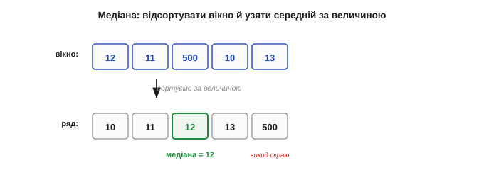
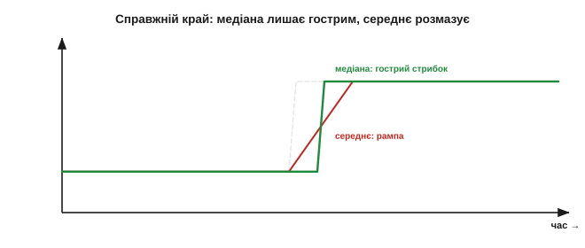
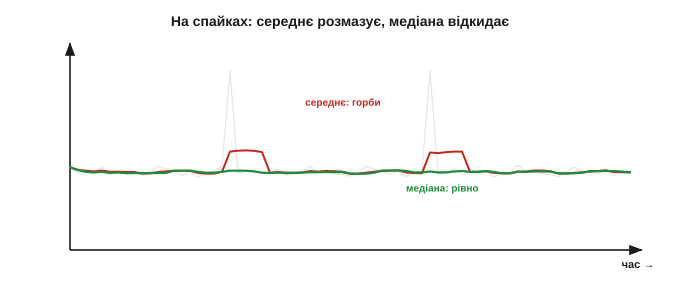
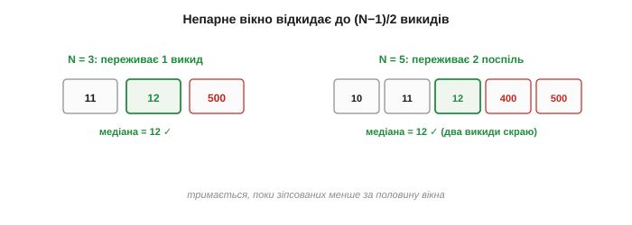
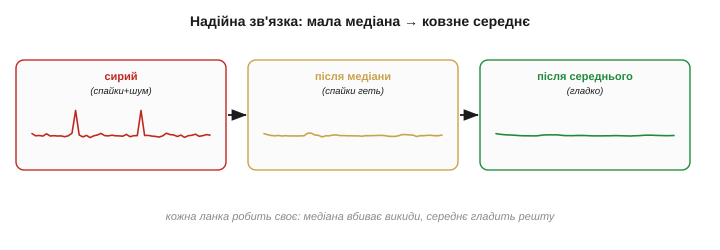

# Медіанний фільтр

[Ковзне середнє](root:com-signal/moving-average) має одну фатальну для викидів рису: воно бере **середнє** вікна, а середнє чутливе до будь-якого дикого значення. Медіанний фільтр міняє цю рису одним рухом — бере не середнє, а **медіану**: середній **за величиною** елемент, коли відліки вікна вишикувати по порядку. Ця крихітна заміна перетворює фільтр із жертви викидів на їхнього вбивцю — і заразом дарує здатність, якої середнє не має взагалі: зберігати **гострі краї**. Це найкращий інструмент проти спайків.

### Ідея: середній за величиною, а не середнє

Медіана (лат. *mediāna* — серединна) — поняття зі шкільної статистики. Візьміть значення вікна, **відсортуйте** їх за величиною й беріть **те, що посередині**. Якщо у вікні п'ять чисел, медіана — третє за порядком; половина значень менша за неї, половина більша.


*Медіана проти середнього. Відліки вікна вишиковують по величині й беруть **центральний**. На відміну від середнього, медіана не «зважує» крайні значення — їй байдуже, наскільки великий найбільший: він просто стоїть скраю ряду, а в центрі — звичайне значення.*

**Приклад (медіана ігнорує дикий викид).** Вікно з п'яти відліків: 10, 11, 12, 11 — і раптом викид 500. Порівняймо середнє й медіану:

```
відсортовано: 10, 11, 11, 12, 500
медіана = 11        (центральний елемент)
середнє = (10+11+12+11+500)/5 = 108.8
```

Середнє підстрибнуло до **108.8** — викид потягнув його за собою. А медіана лишилась **11**, наче 500 і не було. Один погляд — і ясно, котрий фільтр пережив спайк.

За цим стоїть глибока статистична властивість — **точка зламу** (*breakdown point*): яку частку даних треба зіпсувати, щоб результат «поплив» куди завгодно. У середнього вона **нульова**: достатньо **одного** як завгодно дикого значення. У медіани — аж **50%**: щоб її зрушити, треба зіпсувати **половину** вікна. Це найстійкіша до викидів оцінка центру, яка взагалі існує. Причина в тому, що середнє мінімізує суму **квадратів** відхилень (тому квадрат великого викиду його й тягне), а медіана — суму **модулів**, де викид важить лінійно, а не квадратично, і шкодить незрівнянно менше.

### Чому викид безсилий проти медіани

Секрет у тому, **де** опиняється викид після сортування. Хай яким він великий — це лише **одне** значення, і воно стає на **край** упорядкованого ряду. А медіана дивиться на **центр** — і центр не зрушить, скільки б не роздувся крайній елемент. Тому **один** викид у вікні медіана відкидає **повністю**, незалежно від його величини; навіть кілька викидів безсилі, поки їх менше за половину вікна.

Цей тип спотворення — поодинокі дикі значення серед чистих — має класичну назву **«сіль-перець»** (*salt-and-pepper*), бо на зображенні він виглядає як випадкові білі й чорні крапки. Давачам він приходить як збій передачі, [привид багатопроменевості](root:hw-sensing/distance-errors), випадкова наводка чи бите зчитування. Спільне в нього одне: значення не «трохи не те», а **геть стороннє**, що не має з істиною нічого спільного. Саме проти такого медіана й незамінна: вона не намагається врахувати стороннє значення, як середнє, а просто його **не помічає**.

Узяти найтиповіший приклад: [ультразвуковий далекомір](root:hw-sensing/ultrasonic-tof-method) зрідка кидає привид-метр серед чесних показів. Ковзне середнє розмаже цей метр на півсекунди хибної відстані; а медіана трьох викине його безслідно — серед сусідніх «1.0 м, 1.0 м, 2.0 м» центральним лишиться чесний 1.0 м. Один рядок коду — і найнебезпечніша біда далекоміра, що жене робота в стіну, знешкоджена. Тому медіану й ставлять першою ланкою майже на кожен далекомір.


*Чому медіана незворушна. Хоч би яким великим був викид, після сортування він — крайній елемент ряду, а медіана бере центральний. Тому середнє спайк тягне за собою (червона стрілка), а медіана його просто не помічає: центр ряду від крайнього значення не залежить.*

Зверніть увагу: це принципово **нелінійна** операція. Сортування й вибір середини не зведеш до додавань і множень, тож лінійною аналоговою схемою медіану не зробиш — на практиці це чисто **цифровий** трюк, і в цьому його сила.

### Гострі краї лишаються гострими

Друга — і дивовижна — чеснота медіани: вона **зберігає різкі переходи**. Коли величина по-справжньому стрибнула на новий рівень, [ковзне середнє розмазує цей стрибок у пологу рампу](root:com-signal/moving-average), а медіана тримає його **гострим**. Бо щойно більшість відліків вікна перейде на новий рівень, медіана **миттєво** перестрибне туди слідом — не плавно, а різко, зберігши форму краю.

Механізм цього варто бачити чітко. Поки вікно сидить на старому рівні, медіана дорівнює старому рівню. Поки воно вже на новому — медіана дорівнює новому. А **в момент переходу**, коли вікно навпіл лежить на обох рівнях, центральний елемент **перескакує** з одного рівня на інший рівно тоді, коли більшість відліків стане новою. Тож медіана міняється не плавно, а одним стрибком, лише трохи запізнившись, — і край лишається майже таким самим різким, як був. Те, що для середнього було пологою рампою, для медіани — майже вертикальний стрибок.


*Збереження краю. На справжній різкій зміні (сіра сходинка) ковзне середнє дає пологу рампу (червоне), а медіана стрибає майже так само різко, як вхід (зелене). Медіана відрізняє **справжній** стрибок від випадкового спайка: перший вона зберігає, другий викидає.*

Це робить медіану улюбленцем там, де важливі саме **межі**: у обробці зображень вона прибирає «сіль-перець» (поодинокі биті пікселі), не розмиваючи контурів, а в сигналах зберігає чесні стрибки величини, гасячи лише фальшиві спайки. Уміння відрізнити **різку правду** від **різкої брехні** — те, чого лінійне усереднення не вміє в принципі.

### Медіана проти середнього: різні фахи

Поставивши два фільтри поряд, бачимо, що це не суперники, а **фахівці різного профілю**.


*Два фахи. На сигналі з викидами й різким краєм: середнє (червоне) розмазує і спайки в горби, і край у рампу; медіана (зелене) спайки **викидає**, а край **зберігає**. Зате на дрібному рівномірному тремтінні середнє згладжує тонше, бо усереднює, а медіана лише вибирає один наявний відлік.*

- **Медіана** — фахівець проти **викидів** (імпульсного шуму, «сіль-перцю») і **охоронець країв**. Та проти дрібного рівномірного тремтіння вона слабша за середнє: медіана **вибирає** одне з наявних значень, а не **усереднює**, тож не може дати число «між» відліками й шум давить гірше.
- **Середнє** — фахівець проти **рівномірного тремтіння**: усереднюючи, воно дає плавне число й тисне гаусів шум як √N. Та воно розмазує і спайки, і справжні краї.

> 🔧 **Навіщо це.** Просте правило вибору: рідкі дикі **спайки** (збої, [привиди багатопроменевості](root:hw-sensing/distance-errors), наводки) — **медіана**; дрібне рівномірне **тремтіння** — **середнє**. Сплутаєте — або розмажете спайк середнім, або погано згладите шум медіаною. А коли в потоці є **і те, й те** (а так буває найчастіше), їх **поєднують** у зв'язку, де кожна ланка б'є свій тип шуму.

Якщо сказати строго, вибір між ними — це вибір під **форму** шуму. Коли шум гаусів (рівний дзвін без диких хвостів), оптимальне саме середнє, і медіана йому програє. А коли шум **важкохвостий** — рідкі, але великі викиди (а так поводяться збої, наводки, привиди), — середнє стає ненадійним, і медіана бере гору. Реальний давач часто має **і те, й те**: дрібний гаусів шум плюс зрідка дикий спайк, — і саме тому зв'язка «медіана плюс середнє» працює так добре, адже кожна ланка б'є свій тип шуму.

### Розмір вікна й непарне N

Вікно медіани зазвичай беруть **непарним** (3, 5, 7) — щоб був однозначний центральний елемент. Скільки викидів воно витримає? Медіана переживає до **(N−1)/2** викидів у вікні: вікно 3 відкине один спайк, вікно 5 — два поспіль, вікно 7 — три.


*Місткість медіани за викидами. Непарне вікно дає чіткий центр. Вікно N=3 переживає один викид, N=5 — два поспіль, N=7 — три: медіана тримається, поки «зіпсованих» значень менше за половину вікна. Більше вікно — стійкіше, але повільніше й дорожче.*

**Приклад (скільки спайків поспіль витримає).** Вікно N = 5. Гранична кількість викидів, які медіана ще відкине:

```
(N − 1) / 2 = (5 − 1) / 2 = 2 викиди поспіль
```

Якщо ж спайків у вікні стане три (більшість!), медіана «здасться» й видасть уже зіпсоване значення. Тому ширину вікна добирають під очікувану «густоту» викидів: рідкі поодинокі — досить N=3, частіші пачки — потрібне ширше.

Дрібні деталі. Якщо вікно **парне**, чіткого центру немає, і за медіану беруть середнє двох центральних — але тоді знову з'являється чутливість до значень, тож для медіани природніше **непарне** N. Затримка в медіани теж є (приблизно пів вікна, як у середнього), та проявляється інакше — не як рампа, а як **запізнення стрибка**. А найдешевший випадок — **медіана трьох** (N=3): вона прибирає поодинокі спайки буквально кількома порівняннями й майже без затримки, тому її часто ставлять навіть туди, де про фільтри особливо й не думають, — як копійчаний запобіжник від дикого числа.

### Ціна: треба сортувати

За все платять, і медіана — обчисленнями. На відміну від ковзного середнього з його ковзною сумою O(1), медіану не оновиш одним додаванням: щоб знайти центральний елемент, вікно треба щокроку **сортувати** (чи бодай частково впорядкувати) — це O(N log N) або O(N) дій. Простого «додав новий, відняв старий» тут немає.

Варто чесно пояснити, **чому** так. Сума — величина **адитивна**: додав новий доданок, відняв старий, і вона оновлена. А медіана залежить від **порядку** всіх значень, і заміна одного відліку може зрушити центр непередбачувано — простої формули оновлення немає. Існують хитрі структури даних, що тримають вікно впорядкованим і оновлюють медіану швидко, та на крихітних вікнах вони не варті заходу: дешевше щоразу впорядкувати п'ять чисел наново, ніж тримати складну структуру заради економії кількох порівнянь.

Як саме впорядкувати маленьке вікно — теж має значення. Для N=3,5,7 повноцінний алгоритм сортування зайвий: беруть **сортувальну мережу** — наперед записану послідовність порівнянь-обмінів, що впорядковує рівно стільки елементів за **фіксоване** число кроків (для трьох — лише три порівняння). Без циклів, без рекурсії, передбачувано за часом — ідеально для реального часу на МК. Є й хитріші схеми, що шукають **лише** центральний елемент, не сортуючи решту повністю; та для крихітних вікон різниця дрібна, і сортувальна мережа з кількох порівнянь — звичне рішення.

> 🔧 **Навіщо це.** Тримайте вікно медіани **малим** (3, 5, 7). Для таких розмірів сортування — це лічені порівняння, копійки навіть на кволому МК. А от медіана з вікном 50 щокроку сортуватиме півсотні чисел — задорого. Якщо проти викидів потрібне широке згладжування, не роздувайте медіану, а поставте **малу медіану перед середнім** — і кожен робитиме своє дешево.

### Поєднання: медіана, потім середнє

Звідси й найкорисніший прийом усього розділу — **зв'язка**. Спершу **мала медіана** (N=3 чи 5) **вибиває викиди**, лишаючи чистий від спайків, але ще тремтливий потік; потім [ковзне середнє](root:com-signal/moving-average) **догладжує** залишковий шум. Кожен фільтр робить те, що вміє найкраще, і за дешеву ціну.


*Надійний згладжувач. Сирий потік із викидами й шумом → мала медіана (вибиває спайки) → ковзне середнє (гладить решту) → чистий сигнал. Те, з чим поодинці не впорається жоден, разом дають надійний результат — той самий «ланцюг фільтрів», де кожна ланка чистить свій тип брехні.*

Це і є той [ланцюг фільтрів](root:com-signal/signal-noise) у дії: фільтрація — не пошук одного «найкращого» інструмента, а складання конвеєра під конкретну суміш брехні. Медіана плюс середнє — найпоширеніша така зв'язка, бо покриває обидві найчастіші біди давача: і спайки, і тремтіння.

Порядок у зв'язці не випадковий — **спершу** медіана, **потім** середнє. Якби спочатку усереднити, кожен спайк уже **розмазався** б на сусідів, і медіані не було б що вибивати: вона побачила б не один викид, а цілий зіпсований горб. А прибравши спайк **до** усереднення, ми подаємо в середнє вже чистий потік, де лишилося тільки дрібне тремтіння, з яким воно й має справлятися. Кожну ланку ще й налаштовують окремо: ширину медіани — під густоту викидів, ширину середнього — під рівень шуму й допустиму затримку.

Не варто, проте, вважати медіану чарівною. Проти **рівномірного** шуму вона помітно слабша за середнє (бере один наявний відлік, а не усереднює), тож сама лишає його майже стільки ж. На повільно змінному сигналі вона ще й зрідка дає легку **«сходинковість»** — затримується на одному значенні, тоді стрибає, — бо вибирає дискретні наявні відліки, а не плавне проміжне.

> 🔧 **Навіщо це.** Не ставте медіану скрізь «про всяк випадок». Якщо викидів нема, а є лише дрібне тремтіння, медіана згладить його гірше за просте середнє, та ще й додасть сходинок. Медіана — **спеціальний** інструмент під спайки: немає спайків — немає й приводу її брати.

Є й елегантна **проміжна** ідея, що поєднує обидва фахи в одному кроці, — **усічене середнє** (*trimmed mean*): відсортувати вікно, відкинути кілька найбільших і найменших значень (там сидять викиди) і усереднити **решту**. Відкинеш по одному з країв — і поодинокий спайк зникне, як у медіани, а усереднення вцілілих дасть плавність, як у середнього. Це ніби «медіана з пом'якшенням»: за один прохід і викид прибрано, і шум згладжено. Плата — те саме сортування, тож і його тримають на малих вікнах.

Найважливіше місце медіани — **на вході в керування**. Один привид, що проскочив у [регулятор](root:com-signal/discrete-pid), дає різкий поштовх мотору — небезпечний ривок на рівному місці. Мала медіана перед регулятором коштує копійки, а гарантує, що жоден поодинокий збій давача не перетвориться на команду. Тому її ставлять не для краси показу, а як **запобіжник** між брехливим давачем і виконавчим механізмом, що сліпо йому вірить.

Підсумок: медіанний фільтр — нелінійний фахівець проти викидів і охоронець гострих країв; дешевий на малих вікнах, дорогий на широких, і слабший за середнє проти дрібного шуму. Він і [ковзне середнє](root:com-signal/moving-average) чудово доповнюють одне одного. Тож медіану варто тримати в арсеналі завжди — як дешевий нелінійний запобіжник проти диких значень, що його жодним лінійним фільтром не заміниш. Та обидва — і медіана, і середнє — вимагають **буфера** з N відліків і кількох дій на крок; там, де навіть цього забагато, виручає майже без пам'яті й одним множенням найдешевший зі згладжувачів — [експоненційне згладжування](root:com-signal/ema).

---
