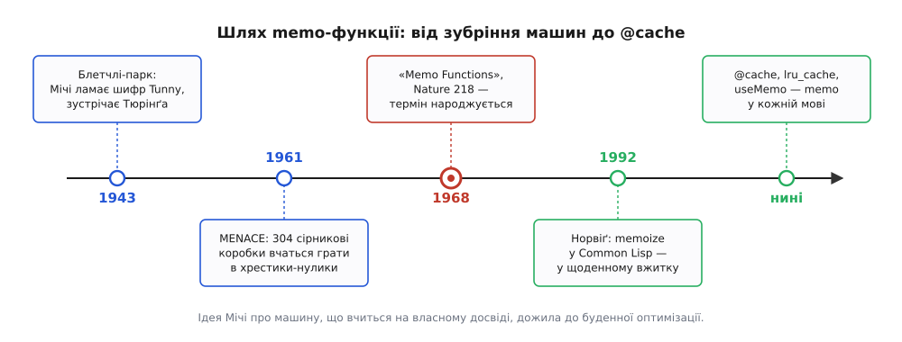

# 📜 Memo-функції: як Дональд Мічі навчив функцію пам'ятати

Машина, яка тільки рахує, ніколи не стає кмітливішою. Постав їй те саме питання вдруге — і вона знову, слухняно й безпам'ятно, повторить усю роботу від початку, наче бачить задачу вперше. У цьому є щось безглузде: жива істота, розв'язавши щось раз, наступного разу впізнає задачу й відповість із пам'яті, а машина — ні. Ідея memo-функцій виросла саме з цього роздратування, тільки прийшла вона не з боку «як пришвидшити програму», а з несподіванішого краю — з питання, чи здатна машина взагалі вчитися на власному досвіді. Людина, яка це питання поставила, півжиття гналася за ним різними стежками, і memo-функція — лиш один із його кристаликів.

## Людина, що прийшла до машин від шифрів

Дональда Мічі (Donald Michie, 1923–2007) важко вписати в одну графу. Народився він у Рангуні, тодішній британській Бірмі; вчився в школі Рагбі, а до Оксфорда потрапив зі стипендією на… класичну філологію — латину й греку, а не математику. Війна перекреслила ці плани. Навесні 1943-го юний класик хотів записатися на курс японської для розвідки, курс виявився повний — і його натомість навчили криптографії та за кілька тижнів відправили до Блетчлі-парку.

Там сталося головне. Мічі потрапив не на славетний злам «Енігми», а на інший фронт — на «Tunny», британську назву німецького телеграфного шифру Лоренца. Спершу до «Тестері», потім до «Ньюменрі» — відділу Макса Ньюмена (Max Newman), де разом із Джеком Ґудом (Jack Good) шукали спосіб зламувати шифр статистикою й машинами; саме звідти виріс «Колос» (Colossus). А ще в Блетчлі був Алан Тюрінг (Alan Turing) — вони грали в шахи й годинами говорили про те, чи може машина мислити. Ці розмови запали Мічі в душу назавжди: злам шифру — це ж пошук закономірності в горі накопичених даних, і якщо машина вміє знаходити візерунок, то, можливо, вміє й учитися.

Дорога до цієї думки була кружна. Після війни Мічі повернувся в Оксфорд, але вже не до класики: він перекваліфікувався в біолога й здобув 1953 року докторат із генетики ссавців (розводив мишей — ще з довоєнного захоплення). Спадковість, зрештою, теж про пам'ять: інформація, яку передають і зберігають. І лише потім, 1965-го, він очолив в Единбурзькому університеті кафедру машинного інтелекту й сприйняття (Department of Machine Intelligence and Perception) — одну з перших у світі домівок штучного інтелекту. Класик, шифрувальник, генетик, урешті — піонер ШІ: усі ці ролі сходяться в одному питанні, про пам'ять і навчання.

## MENACE: машина, що вчиться сірниками

Ще до memo-функцій Мічі побудував найдивовижнішу навчальну машину свого часу — без жодної електроніки. 1961 року він із Роджером Чемберсом (Roger Chambers) склав MENACE (Machine Educable Noughts And Crosses Engine) — «машину, здатну навчитися грати в хрестики-нулики» — з 304 сірникових коробок. Кожна коробка відповідала одній позиції на дошці, а різнокольорові намистини всередині — можливим ходам із неї. Машина «ходила», витягаючи навмання намистину; програвала партію — намистини тих ходів викидали, вигравала — досипали ще. Партія за партією погані ходи вимивалися, добрі множилися, і купка коробок поволі вчилася грати бездоганно.

Це чисте [навчання з підкріпленням](root:sf-ml/reinforcement-learning) — машина коригує поведінку за наслідками власних спроб — задовго до того, як термін став модним. Але для нашої історії важить інше: MENACE навчається, **накопичуючи досвід у таблиці** й **зазираючи в неї** перед кожним рішенням. Пораховане не перераховують щоразу — його пам'ятають. Саме цю пружину Мічі за кілька років переніс із сірникових коробок усередину звичайної функції.

## Стаття 1968 року: правило і зубрівка

Виклад цієї ідеї з'явився в журналі Nature, том 218, с. 19–22, від 6 квітня 1968 року, під назвою «"Memo" Functions and Machine Learning». Уже сам заголовок каже головне: memo-функції стоять поряд не з «оптимізацією», а з машинним навчанням.

Задум Мічі напрочуд простий і глибокий водночас. Обчислення будь-якої функції, каже він, має складатися з двох частин: «правила» (rule — обчислювальна процедура, як здобути відповідь) і «зубрівки» (rote — таблиці вже відомих відповідей). Функція вільна відповісти правилом, зубрівкою або їхньою сумішшю — суто з того, як вигідніше цієї миті. І ключове речення: **кожне обчислення за правилом лишає свіжий запис у зубрівці**. Тобто зубрівка не задана наперед — вона наростає з роботи самого правила. Що більше функцію кличуть, то повнішою стає її пам'ять і то рідше доводиться щось насправді рахувати.

Ось чому для Мічі це було навчання, а не трюк. Функція буквально вчиться на власному досвіді: сьогодні вона обчислює, завтра — пригадує обчислене. Це той самий рух, що й у MENACE, тільки замість намистин — рядок у таблиці. Мічі йшов і далі: він припускав, що саме правило може бути самозмінним і підганяти себе під те, що вже накопичено в зубрівці, — зародок думки про програми, які переписують себе за даними. Свою ідею він прямо поставив у ряд зі знаменитою шашковою програмою Артура Семюела (Arthur Samuel, 1959), яка вчилася, запам'ятовуючи оцінки позицій, — тим самим механічним «зазубрюванням» уже баченого. Показував усе це Мічі мовою POP-2 — единбурзькою мовою, де, за його ж словами, потрібний засіб уже був готовий у вигляді півдесятка бібліотечних процедур. Що машина вчиться, коли накопичує й перевикористовує власні висновки, — це [машинне навчання](root:sf-ml/what-is-ml) у найпрямішому сенсі, і Мічі побачив його там, де ми сьогодні бачимо буденний кеш.

## Чому «memo», а не «memor»

Назва «memo-функція» — не випадкова гра слів, а точний вибір класика. «Memo» — це скорочення від латинського **memorandum**, а memorandum у латині є герундивом дієслова memorare: буквально «те, що належить запам'ятати». Мічі, який колись їхав до Оксфорда саме по латину, узяв слово, що вже означає «річ, варту записати на згадку», і зробив із нього дію: memoization — це «перетворення результату функції на memo», на нотатку, приберігану на майбутнє.

Звідси й дивне на око написання. Технічний термін — memoization (британською memoisation) — стоїть навмисно без тієї «р», що є в буденному memorization («заучування напам'ять»). Обидва слова родичі, обидва тягнуться від латинського memor, «пам'ятливий»; але зайва літера відрізняє машинний акт від людського. Функція не «зазубрює вірш» — вона лишає собі службову записку. Документованого зізнання, що Мічі свідомо прибрав «р» задля цієї різниці, не збереглося, тож припишімо написання радше логіці самого кореня «memo»: слово вийшло таким тому, що виросло з «нотатки», а не із «заучування». Плутанина memoization/memorization відтоді супроводжує термін вічно — і щоразу правильне написання нагадує, звідки він узявся.

## Як слово вийшло за межі Единбурга

Мову POP-2 давно забули, а слово лишилося — і це окрема мораль. З Единбурга memo-функції перекочували передусім у світ Lisp, де думка «обгорнути будь-яку функцію пам'яттю» лягала природно. Вирішальним був підручник Пітера Норвіґа (Peter Norvig) «Paradigms of Artificial Intelligence Programming» (1992): там memoize — це готова функція вищого порядку, що бере будь-яку іншу функцію й повертає її версію з кешем. Відтоді прийом розійшовся мовами: сьогодні це `@functools.cache` у Python, `useMemo` в React, безліч бібліотек-декораторів — і майже ніхто вже не згадує ні Мічі, ні сірникові коробки, ні Nature 1968 року.

*Півстоліття однієї ідеї. Від злому шифру й сірникових коробок, через статтю 1968 року, де техніку названо, до Норвіґового універсального memoize — і до рядка `@cache` у сучасній мові. Задум мандрував від «машинного навчання» до буденної оптимізації, не втративши суті.*

Тут варто уникнути звичного спрощення, ніби «Мічі винайшов мемоізацію». Зберігати вже пораховане, щоб не рахувати вдруге, люди вміли задовго до нього — таблиці логарифмів, синусів чи простих чисел і є заздалегідь заповнена «зубрівка». Семюелова шашкова програма запам'ятовувала оцінки позицій ще 1959-го. Що зробив саме Мічі — то це **дав ідеї ім'я, теорію й місце в мові програмування**: показав, що будь-яку чисту функцію можна автоматично наділити пам'яттю, і побачив у цьому не хитрість, а форму навчання. А через чверть століття Норвіґ перетворив це на багаторазовий інструмент. Винахід, як завжди, колективний: стародавні таблиці, Семюелове зазубрювання, найменування й теорія Мічі, універсальна обгортка Норвіґа — і аж тоді звичний нам `@cache`.

## Що лишилося від задуму

Іронія в тому, що memo-функцію ми сьогодні кличемо, коли треба «щоб не тупило», — а Мічі бачив у ній машину, що вчиться. Обидва прочитання правдиві. Коли `@cache` над повільною функцією раптом робить її миттєвою, всередині діється рівно те, що описав класик-шифрувальник: функція вперше зустрічає задачу, розв'язує її по-справжньому — і запам'ятовує, щоб більше ніколи не розв'язувати заново. Це і є найскромніший різновид навчання: не забувати того, що вже колись зрозумів.
