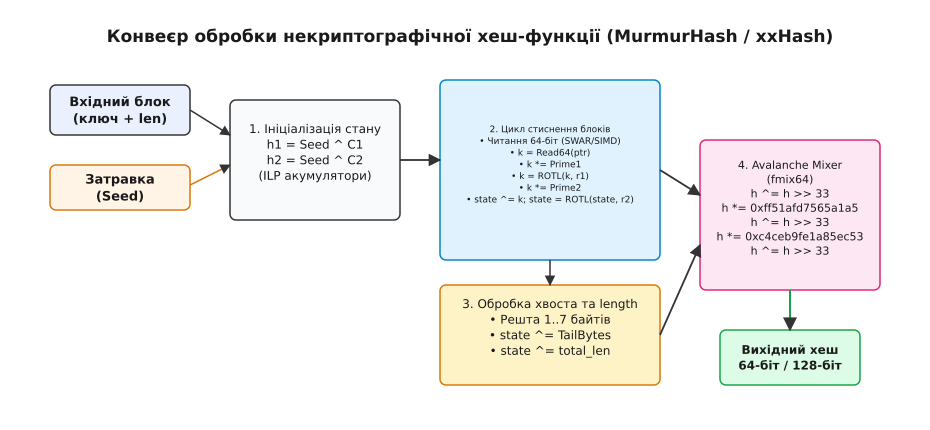
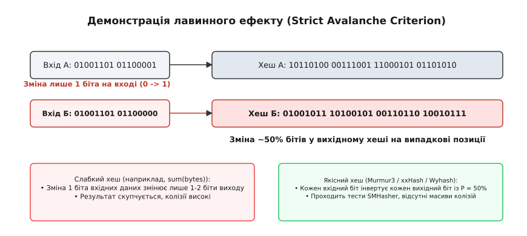
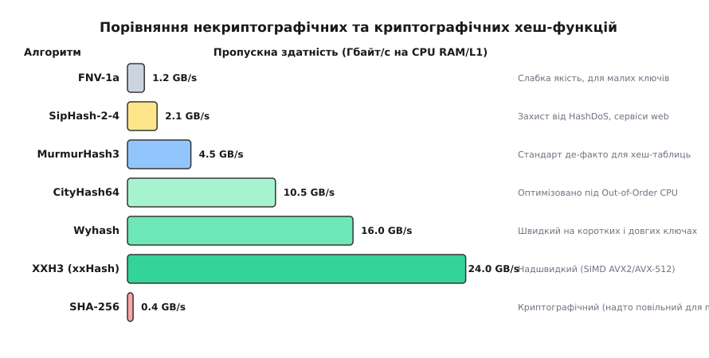

# Некриптографічні хеш-функції

<preknowlist>
- [Масив](topic:sf-algorithms/array) — суцільна пам'ять та адресація за індексом за сталий час.
- [Хеш-таблиця](topic:sf-algorithms/hash-table) — викувати індекс із ключа, відкрита адресація та розв'язання колізій.
- [Модульна арифметика](topic:math-number-theory/modular-arithmetic) — остача від ділення, побітові зсуви, циклічні ротації та маски.
- [Асимптотична складність](topic:computability/asymptotic-complexity) — пропускна здатність, такти на байт (cpb) та швидкодія RAM.
</preknowlist>

Високонавантажений мережевий маршрутизатор обробляє потік 100 Гбіт/с, аналізуючи десятки мільйонів мережевих пакетів щосекунди. Для кожного пакета апаратний або програмний контролер повинен миттєво визначити напрямок маршрутизації за таблицею з'єднань, де ключем є 5-кортеж (IP-адреса джерела, IP-адреса призначення, порт джерела, порт призначення та ідентифікатор протоколу). У той самий час ін-меморі база даних (наприклад, Redis або високоефективна таблиця `std::unordered_map` у системному веб-сервісі) на кожен HTTP-запит виконує сотні пошуків за рядковими ключами типу `"user_session_948271"`.

Якби для індексації елементів у таких системах застосували класичні криптографічні хеш-функції (наприклад, SHA-256, SHA-3 чи BLAKE3), це призвело б до катастрофічного дефіциту обчислювальних ресурсів. Обчислення SHA-256 вимагає виконання 64 послідовних раундів складних побітових підстановок над 512-бітними блоками й витрачає від 400 до 800 тактів процесора на один короткий ключ. Оскільки читання з кешу процесора першого рівня (L1 Data Cache) коштує всього 4 такти CPU, витрата пів тисячі тактів лише на обчислення хешу ключа означає, що 99% часу процесор простоює в очікуванні математичних розрахунків.

З іншого боку, наївне обчислення хешу — наприклад, додавання ASCII-кодів символів `sum(bytes)` або просте поліноміальне зсування — призводить до масових колізій. Структуровані вхідні дані (наприклад, ідентифікатори `"user_1"`, `"user_2"`, `"user_3"` або мережеві адреси з одного піддіапазону) отримують однакові або сусідні адреси в пам'яті. Це згортає хеш-таблицю в довгий однозв'язний список і перетворює теоретично сталий час пошуку `O(1)` на лінійне сканування `O(N)`.

Діру між повільною криптографією та наївними колізійними хешами закриває клас **некриптографічних хеш-функцій** (Non-Cryptographic Hash Functions). Це спеціально спроектовані алгоритми, які свідомо не надають математичних гарантій криптографічної стійкості до підробки (Preimage Resistance та Collision Resistance проти зловмисника із безмежним доступом), проте забезпечують граничну швидкодію обчислення (понад 15–30 Гбайт/с на сучасних CPU або 5–15 тактів на короткий ключ) за умови ідеального статистичного розсіювання бітів.

## Анатомія та конвеєр обробки даних

З точки зору архітектури процесора, сучасна некриптографічна хеш-функція являє собою послідовний конвеєр обробки байтового потоку, розділений на чотири чіткі фази.


*Етапи обробки даних у сучасній некриптографічній хеш-функції: ініціалізація, цикл стиснення, хвіст та Avalanche Mixer.*

### Фаза 1. Ініціалізація стану та роль затравки (Seed)

Обчислення починається зі створення внутрішнього вектора акумуляторів стану (state accumulators). У найпростіших 32-бітних хешах стан складається з одного 32-бітного цілого числа `h1`. У сучасних 64-бітних та 128-бітних алгоритмах (наприклад, XXH3, CityHash або Wyhash) стан утворюється з 4–8 паралельних 64-бітних змінних `h1, h2, h3, h4`.

Початкове значення стану формується на основі **затравки** (Seed) — 32-бітного або 64-бітного числа, яке передається розробником при ініціалізації:

```
h1 = Seed ^ Prime1
h2 = Seed ^ Prime2
```

Де `Prime1`, `Prime2` — спеціально підібрані непарні математичні константи з високою бітовою щільністю (наприклад, `0x9E3779B185EBCA87ULL`).

Значення `Seed` виконує важливу роль: воно гарантує рандомізацію хеш-простору. Якщо дві однакові хеш-таблиці створені з різними значеннями `Seed`, той самий вхідний ключ дасть абсолютно різні вихідні індекси. Це унеможливлює передбачення розсуву елементів у пам'яті для зовнішніх спостерігачів.

### Фаза 2. Основний цикл стиснення (Compression Loop) та SWAR

Вхідний потік байтів розбивається на блоки однакової довжини. Замість повільного побайтного перебору, некриптографічний хеш зчитує з пам’яті суцільні 32-бітні чи 64-бітні числа за допомогою техніки SWAR (SIMD Within A Register) або 256/512-бітні вектори (за наявності SIMD-розширень AVX2 чи AVX-512).

Кожен прочитаний блок проходить крізь каскад із трьох основних математичних примітивів змішування:

1. **Циклічний бітовий зсув (Rotate Left / ROTL):** Ззвичайний зсув `x << k` втрачає старші біти, що вилітають за межі 64-бітної сітки. Циклічний зсув `(x << k) | (x >> (64 - k))` повертає вибиті біти з протилежного боку, зберігаючи повну ентропію вхідного блоку без втрати жодного біта.
2. **Множення на непарні магічні константи (Integer Multiplication):** Множення `x * C` на константу `C` (наприклад, `C = 0x87c37b91114253d5ULL`) викликає поширення бітових переносів (carry propagation). Будь-яке непарне число `C` є взаємно простим із `2⁶⁴`, тому множення за модулем `2⁶⁴` є оборотним відображенням кільця `ℤ / 2⁶⁴ℤ`, яке не втрачає інформацію, але створює потужну нелінійну дифузію. Кожен біт числа `x` зсувається ліворуч на різні позиції й додається до результату, змішуючи молодші біти зі старшими.
3. **Побітове XOR та додавання:** Операція `state ^= block` змішує новий блок із накопиченим станом акумулятора без утворення лінійних алгебраїчних залежностей.

Використання кількох незалежних акумуляторів стану (`h1, h2, h3, h4`) є критичним для забезпечення паралелізму на рівні інструкцій (Instruction-Level Parallelism, ILP). На сучасних суперскалярних процесорах виконавчі блоки (ALU) можуть прокручувати кілька множень за один такт. Якщо обчислення `h2` не залежить від результату `h1`, конвеєр процесора виконує їх паралельно, подвоюючи швидкість обробки даних.

### Фаза 3. Обробка хвоста та довжини (Tail Handling & Length Mixing)

Більшість реальних ключів мають довжину, не кратну 8 або 64 байтам (наприклад, рядок `"cat"` має довжину 3 байти). Залишок даних (від 1 до 7 байтів), який не утворює повний 64-бітний блок, називається **хвостом** (Tail).

Обробка хвоста виконується через спеціальний каскадний перемикач `switch(len & 7)`, який упаковує залишок байтів у підсумкове 64-бітне слово. Після зчитування хвоста до стану акумулятора обов’язково домішується загальна довжина вхідного масиву `len`:

```
h1 ^= len
```

Якщо не домішати довжину `len`, виникає небезпека **хвостових колізій**: послідовності байтів `"\x00"` та `"\x00\x00"` при однаковому початковому стані згенерують однакове хеш-значення, оскільки нульові байти при бітовому `XOR` не змінюють стан акумулятора.

### Фаза 4. Фінальне розсіювання: Avalanche Mixer (fmix)

Навіть після основного циклу стиснення окремі вихідні біти акумулятора можуть зберігати слабку взаємозалежність від позиції вхідних розрядів. Щоб усунути будь-яку кореляцію, накопичений стан `h1` пропускають крізь фіналізатор — **Avalanche Mixer** (бітовий міксер `fmix`).

Канонічний 64-бітний фіналізатор MurmurHash3 `fmix64` працює наступним чином:

```
h ^= h >> 33;
h *= 0xff51afd7565a1a5dULL;
h ^= h >> 33;
h *= 0xc4ceb9fe1a85ec53ULL;
h ^= h >> 33;
```

Операція `h >> 33` переміщує старші біти у молодші позиції, після чого множення поширює їх назад у старші розряди з переносом. Після трьох раундів змішування кожен вхідний біт із ймовірністю ровно 50% інвертує кожен вихідний біт.

## Низькорівнева робота з пам'яттю: Невирівняний доступ та Strict Aliasing

Спроба зчитати 64-бітне слово з довільної адреси пам'яті приводить розробників до класичної пастки низькорівневого програмування.

Пряме зведення типів вказівників:

:::tabs
```c
/* НЕПРАВИЛЬНО у C: Порушення strict aliasing та небезпека BUS_ERROR */
const uint64_t *p = (const uint64_t *)ptr;
uint64_t word = *p;
```
```cpp
// НЕПРАВИЛЬНО у C++: Порушення strict aliasing та undefined behavior
const auto* p = reinterpret_cast<const std::uint64_t*>(ptr);
std::uint64_t word = *p;
```
:::

По-перше, цей код порушує правило суворого псевдонімування типів (Strict Aliasing Rule) стандарту C/C++. Компілятор розглядає розіменування `uint64_t*` над масивом `uint8_t` як незаконний каст, що дозволяє йому викидати інструкції повторного читання з пам'яті під час оптимізацій.

По-друге, на архітектурах із жорсткими вимогами до вирівнювання пам'яті (ARMv7, SPARC) спроба прочитати 8-байтне число за адресою, яка не ділиться на 8, викликає апаратне виключення `BUS_ERROR` та падіння процесу.

Єдиним стандартизованим і безпечним способом зчитування без неокресленої поведінки (Undefined Behavior) та без втрати швидкодії є використання виклику `memcpy`:

:::tabs
```c
static inline uint64_t load64(const uint8_t *p) {
    uint64_t v;
    memcpy(&v, p, sizeof(v));
    return v;
}
```
```cpp
[[nodiscard]] inline std::uint64_t load64(const std::uint8_t* p) noexcept {
    std::uint64_t v;
    std::memcpy(&v, p, sizeof(v));
    return v;
}
```
:::

Сучасні компілятори (GCC, Clang, MSVC) повністю знають семантику `memcpy`. Вони викреслюють функціональний виклик і замінюють його на єдину скалярну інструкцію `MOV` (x86-64) або `LDR` (ARM64), гарантуючи апаратну швидкість читання за 1 такт CPU.

## Лавинний ефект та строгий критерій лавини (SAC)

Фундаментальною математичною властивістю некриптографічного хешу є **лавинний ефект** (Avalanche Effect).


*Демонстрація строгого критерію лавини: зміна 1 біта на вході викликає випадкову зміну 50% бітів у вихідному хеші.*

У якісному алгоритмі зміна всього лише одного біта у вхідному ключі (наприклад, заміна символу `"cat"` на `"cau"`) повинна призводити до непередбачуваної зміни приблизно 50% бітів у вихідному хеш-значенні.

Якщо алгоритм задовольняє **строгий критерій лавини** (Strict Avalanche Criterion, SAC), вихідні біти поводяться як незалежні випадкові величини. Слабкі хеш-функції (наприклад, аддитивна сума) порушують цей критерій: зміна одного біта на вході змінює лише 1-2 біти на виході. У результаті ключі `"user_1"` та `"user_2"` отримують сусідні індекси, що призводить до масового скупчення (кластеризації) в хеш-таблиці.

Докладно математичний апарат розсіювання бітів, матриці лавинності та статистичний тест Хі-квадрат розібрано у вставці [математичний апарат лавинного ефекту та тесту Хі-квадрат](topic:sf-algorithms/non-cryptographic-hash/math-avalanche-distribution.md).

## Математика згортання хешу: Модуль проти Лемірового швидкого редукціонування

Отримавши якісне 64-бітне значення хешу `h`, хеш-таблиця повинна відобразити його у вузький діапазон індексів `0…m-1`.

Класичний підхід використовує остачу від ділення `h % m`. Проте цілочисельне ділення (`DIV`/`IDIV` на x86) забирає від 20 до 40 тактів процесора, що вдвічі повільніше за весь цикл обчислення хешу MurmurHash3!

Альтернативний підхід — швидке редукціювання Даніеля Леміра (Lemire Fast Reduction) — усуває ділення взагалі:

:::tabs
```c
uint64_t index = (uint64_t)((( __uint128_t )h * m) >> 64);
```
```cpp
auto index = static_cast<std::uint64_t>((static_cast<__uint128_t>(h) * m) >> 64);
```
:::

Математично операція `(h * m) >> 64` дорівнює взяттю цілої частини від `(h / 2⁶⁴) * m`. Вона виконується за **1 такт CPU** інструкцією 128-бітного множення (`MULX`), рівномірно розподіляє хеш-коди по всіх `m` бакетах і використовує повну ентропію старших бітів хешу.

## Еволюція алгоритмів: від FNV до XXH3 та Wyhash

Історія некриптографічного хешування відображає еволюцію архітектури персональних комп'ютерів та серверів за останні три десятиліття.

```
1991: FNV-1a           (Побайтне оброблення, 1 байт/цикл, простий C-код)
       │
2008: MurmurHash3      (32/64-бітний SWAR, магічні первинні множники, fmix)
       │
2011: CityHash         (Оптимізація під Out-of-Order CPU, паралельні акумулятори)
       │
2014: xxHash / Wyhash  (SIMD AVX2/AVX-512, 128-бітне множення mum(), 15-30 GB/s)
```

1. **Fowler–Noll–Vo (FNV-1a, 1991):** Однопрохідний побайтний хеш `h = (h ^ byte) * FNV_prime`. Простий і компактний, але повільний на довгих ключах через відсутність паралелізму.
2. **MurmurHash3 (Остін Епплбі, 2008):** Стандарт де-факто, який запровадив блочне зчитування та створив тестову сюїту SMHasher.
3. **CityHash / FarmHash (Google, 2011–2014):** Розділення обчислень на кілька паралельних арифмометрів для максимального завантаження конвеєра CPU.
4. **XXH3 (Ян Колле, 2019) та Wyhash (Ван Ї):** Сучасні лідери швидкості. XXH3 активно використовує SIMD-векторизацію (AVX2, AVX-512, NEON), досягаючи швидкості понад **24 Гбайт/с**. Wyhash спирається на швидку 128-бітну інструкцію множення 64-бітних цілих чисел (`__int128`), забезпечуючи рекордно низьку затримку (латентність) на коротких ключах (8–16 байтів).

Детальний історичний опис та хронологію розробників наведено у вставці [історію розвитку від FNV до xxHash](topic:sf-algorithms/non-cryptographic-hash/hist-hash-functions.md).

## Порівняння продуктивності та тестова сюїта SMHasher

Якість та швидкість некриптографічних хеш-функцій оцінюються за допомогою інструментарію **SMHasher**.


*Пропускна здатність некриптографічних і криптографічних хеш-функцій на сучасних CPU.*

На діаграмі чітко видно прірву між некриптографічними хешами та криптографічним стандартом SHA-256. Якщо SHA-256 ледве досягає 0.4 Гбайт/с на скалярному конвеєрі, то XXH3 обробляє дані зі швидкістю 24 Гбайт/с, що практично впирається у фізичну пропускну здатність шини пам'яті DRAM.

Повні параметри бенчмаркінгу, специфікації тестів SMHasher та порівняльні таблиці викликів зібрано у вставці [специфікацію інтерфейсів та параметрів SMHasher](topic:sf-algorithms/non-cryptographic-hash/api-hash-bench.md).

## Порівняльний аналіз сімейств алгоритмів

Для правильного вибору алгоритму під конкретне системне завдання необхідно розуміти фундаментальні відмінності між основними сімействами некриптографічних хеш-функцій:

### 1. FNV-1a: Побайтна класика
Алгоритм Fowler–Noll–Vo обробляє вхідний потік суворо по одному байту за ітерацію. Головна перевага FNV-1a — надзвичайна простота реалізації: весь алгоритм уміщається у кілька рядків коду C та не вимагає таблиць чи складних бітових зсувів. Це робить його ідеальним для мікроконтролерів (AVR, PIC, STM32 без апаратного множника) та вбудованих систем із критичним лімітом пам'яті програм (ROM). Проте на 64-бітних CPU FNV-1a показує низьку пропускну здатність (~1.2 Гбайт/с) та провалює окремі тести SMHasher на довготривалу кореляцію.

### 2. MurmurHash3: Баланс та універсальність
Створений Остіном Епплбі, MurmurHash3 став золотим стандартом некриптографічного хешування для обчислювальних систем 2010-х років. Він зчитує дані 32-бітними або 64-бітними блоками, використовує циклічні зсуви `ROTL` та фіналізатор `fmix64`. MurmurHash3 першим у світі повністю пройшов усі тести сюїти SMHasher без жодного зауваження. Основна сфера застосування — індексація у високонавантажених хеш-таблицях (наприклад, у GCC/Clang `std::unordered_map`, Apache Cassandra, Lucene).

### 3. CityHash та FarmHash: Оптимізація під Out-of-Order execution
Інженери Google розробили CityHash для максимізації пропускної здатності на сучасних суперскалярних процесорах. Алгоритм розбиває потік на 64-байтові блоки й паралельно оновлює 4 акумулятори стану. Сучасні CPU із виконанням поза порядком (Out-of-Order Execution) одночасно завантажують кілька арифмометрів, досягаючи швидкості понад 10 Гбайт/с. Його наступник FarmHash додав автодетекцію архітектури під час компіляції (підтримку AVX/SSE4.2).

### 4. XXH3 (xxHash): Векторна швидкість (SIMD)
Створений Яном Колле, XXH3 є поточним лідером продуктивності на великих блоках даних. Завдяки векторизації (AVX2, AVX-512, ARM NEON) XXH3 обробляє дані блоками по 512 біт за один прохід, досягаючи пропускної здатності у **15–30 Гбайт/с**. Він використовується у стисненні даних (LZ4, Zstandard), файлових системах та високошвидкісних мережевих стеках.

### 5. Wyhash: Мікроколекція та латентність коротких ключів
Створений Ваном Ї, Wyhash спирається на 128-бітне множення 64-бітних цілих чисел (примітив `mum(a, b)` через `__int128` або `MULX`). Wyhash забезпечує рекордно низьку затримку (латентність) на коротких ключах (8–16 байтів) та обробку довгих буферів зі швидкістю понад 16 Гбайт/с, повністю проходячи SMHasher.

## Застосування некриптографічних хешів у складних структурах даних

Некриптографічне хешування використовується далеко за межами стандартних хеш-таблиць:

1. **Фільтри Блума (Bloom Filters):** Для перевірки наявності елемента у великій множині фільтр Блума вимагає обчислення `k` незалежних хеш-функцій. Замість виклику `k` окремих хешів використовують техніку Кірш-Метценмахера (Kirsch-Mitzenmacher optimization): генерується один 128-бітний хеш (або два 64-бітних `h1` та `h2`), після чого `i`-та хеш-функція обчислюється як `gᵢ(x) = h1(x) + i · h2(x) mod m`. Це дає `k` хеш-значень за один виклик некриптографічного хешу.
2. **Послідовне хешування (Consistent Hashing):** У розподілених кешувальних системах (Memcached, DynamoDB) для рівномірного розподілу ключів по кільцю серверів використовується 64-бітне значення MurmurHash3 чи XXH3. При додаванні нового сервера перерозподіляється лише `1/N` частка ключів, що зберігає стабільність кешу.
3. **Індексація в LSM-деревах (RocksDB, LevelDB):** В індексних блоках LSM-дерев некриптографічні хеші використовуються для швидкої навігації між SSTable-файлами без звернення до диска.

## Практична реалізація та розбір коду

Для розуміння механіки розберемо базову реалізацію 64-бітного некриптографічного хешу. 

:::tabs
```c
#include <stdint.h>
#include <stddef.h>
#include <string.h>

static const uint64_t C1 = 0x87c37b91114253d5ULL;
static const uint64_t C2 = 0x4cf5ad432745937fULL;

static inline uint64_t load64(const uint8_t *p) {
    uint64_t v;
    memcpy(&v, p, sizeof(v)); /* Блискавичне читання без UB */
    return v;
}

static inline uint64_t rotl64(uint64_t x, int8_t r) {
    return (x << r) | (x >> (64 - r));
}

uint64_t simple_fast_hash(const void *key, size_t len, uint64_t seed) {
    const uint8_t *data = (const uint8_t *)key;
    const size_t nblocks = len / 8;
    uint64_t h1 = seed ^ (len * C1);

    for (size_t i = 0; i < nblocks; i++) {
        uint64_t k1 = load64(data + i * 8);
        k1 *= C1;
        k1 = rotl64(k1, 31);
        k1 *= C2;

        h1 ^= k1;
        h1 = rotl64(h1, 27);
        h1 = h1 * 5 + 0x52dce729;
    }

    /* Обробка хвоста та фіналізатор */
    h1 ^= len;
    h1 ^= h1 >> 33;
    h1 *= 0xff51afd7565a1a5dULL;
    h1 ^= h1 >> 33;
    return h1;
}
```
```cpp
#include <cstdint>
#include <cstddef>
#include <cstring>
#include <span>
#include <string_view>

namespace demo_hash {

constexpr std::uint64_t C1 = 0x87c37b91114253d5ULL;
constexpr std::uint64_t C2 = 0x4cf5ad432745937fULL;

[[nodiscard]] inline std::uint64_t load64(const std::uint8_t* p) noexcept {
    std::uint64_t v;
    std::memcpy(&v, p, sizeof(v));
    return v;
}

[[nodiscard]] constexpr std::uint64_t rotl64(std::uint64_t x, std::int8_t r) noexcept {
    return (x << r) | (x >> (64 - r));
}

[[nodiscard]] std::uint64_t simple_fast_hash(std::span<const std::uint8_t> data, std::uint64_t seed = 0) noexcept {
    const std::size_t len = data.size();
    const std::size_t nblocks = len / 8;
    const std::uint8_t* ptr = data.data();
    std::uint64_t h1 = seed ^ (len * C1);

    for (std::size_t i = 0; i < nblocks; ++i) {
        std::uint64_t k1 = load64(ptr + i * 8);
        k1 *= C1;
        k1 = rotl64(k1, 31);
        k1 *= C2;

        h1 ^= k1;
        h1 = rotl64(h1, 27);
        h1 = h1 * 5 + 0x52dce729;
    }

    h1 ^= len;
    h1 ^= h1 >> 33;
    h1 *= 0xff51afd7565a1a5dULL;
    h1 ^= h1 >> 33;
    return h1;
}

} // namespace demo_hash
```
:::

Повний працездатний проект із підтримкою невирівняного читання, обробкою всіх варіантів хвостів та ідіоматичними шаблонами C++ розміщено у вставці [реалізацію надшвидкого 64-бітного хешу мовами C та C++](topic:sf-algorithms/non-cryptographic-hash/proj-fast-hash.md).

## Вразливість HashDoS та захисний алгоритм SipHash

Будь-яка некриптографічна хеш-функція (MurmurHash3, xxHash, Wyhash) спирається на детерміновані математичні константи. Зловмисник, знаючи вихідний код хеш-функції веб-сервера, може заздалегідь обчислити мільйон різних ключів, які дають однакову остачу від ділення `hash(k) mod m`.

У 2003 році Скотт Кросбі (Scott Crosby) та Ден Воллок (Dan Wallach) описали атаку **HashDoS (Denial of Service via Algorithmic Complexity)**. Якщо відправити серверу HTTP POST-запит з 100 000 таких колізійних ключів у форматі JSON або Form-Data, внутрішня хеш-таблиця мови програмування (наприклад, у Python, Ruby, PHP чи Java) вироджується в однозв'язний список. Чому так відбувається: замість пошуку за `O(1)` кожен новий запит починає перебирати ланцюжок із 100 000 елементів. Складність обробки запиту зростає з `O(N)` до `O(N²)`, що на 100% завантажує процесор і повністю зупиняє роботу сервера.

Для вирішення цієї проблеми у 2012 році Жан-Філіп Омассон (Jean-Philippe Aumasson) та Деніел Бернштейн (Daniel J. Bernstein) розробили алгоритм **SipHash** (зокрема версії SipHash-2-4 та SipHash-1-3).

SipHash є псевдовипадковою функцією (PRF, Pseudo-Random Function), яка використовує секретний 128-бітний ключ (Secret Key), що ґенерується випадково при кожному старті процесу. Без знання цього секретного ключа зловмисник математично не спроможний підібрати колізійні ключі за розумний час. 

Сьогодні SipHash є алгоритмом хешування за замовчуванням у стандартних бібліотеках мов **Rust, Python, Ruby, Swift, Perl та Go** для захисту системних хеш-таблиць від зовнішніх атак.

> 🔧 **Навіщо це.**
> 
> Вибір хеш-функції у реальному проекті визначається вектором атаки та джерелом вхідних даних:
> 
> 1. **Внутрішні хеш-таблиці та структури в пам'яті (In-Memory Processing):** Якщо ключі ґенеруються всередині вашої системи (наприклад, ідентифікатори об'єктів, вказівники, внутрішні індекси кешу), використовуйте **XXH3** або **Wyhash**. Вони дадуть найвищу пропускну здатність (15–24 Гбайт/с) та зекономлять сотні тактів CPU.
> 
> 2. **Публічні Web-API та інтерпретатори (Public Data Ingestion):** Якщо ключі надходять від зовнішніх користувачів через мережу (JSON-поля, URL-параметри, HTTP-заголовки), використовуйте **SipHash-1-3** або **SipHash-2-4** із випадковим `Seed` для кожного процесу. Це захистить сервери від катастрофічних атак HashDoS.
> 
> 3. **Перевірка цілісності мережевих кадрів і файлових блоків:** Для перевірки пошкодження даних на диску чи в мережі використовуйте **XXH3** або апаратний **CRC32C** (інструкція `crc32` в x86 SSE4.2).
> 
> 4. **Мікроконтролери з обмеженою пам'яттю (Embedded):** На чипах STM32 чи AVR без апаратного множника 64-бітних чисел використовуйте **FNV-1a** або **MurmurHash3-32** — вони мають найменший розмір машинного коду (ROM footprint).
