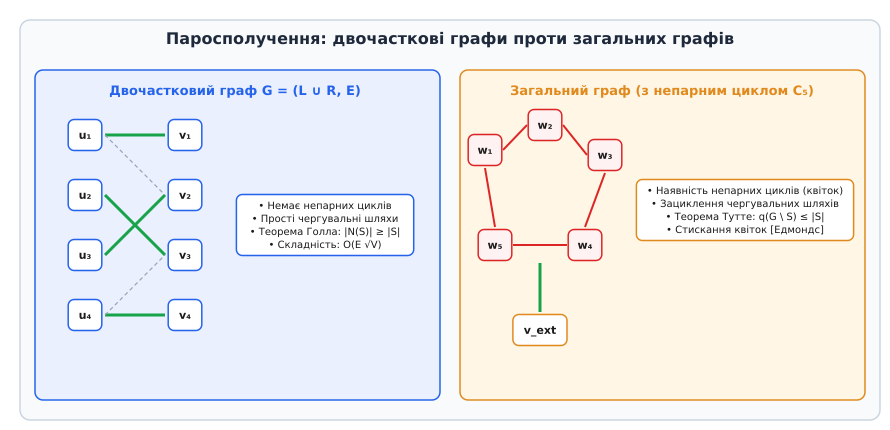
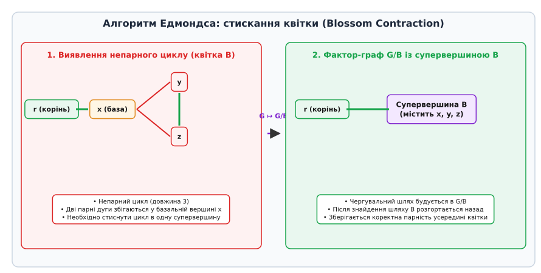
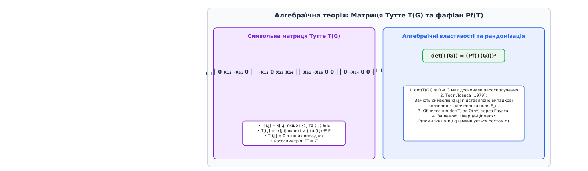

# Досконале паросполучення

<preknowlist>
- [Асимптотичний аналіз складності](root:computability/asymptotic-complexity) — оцінка часу виконання алгоритмів через нотацію O(f(n)).
- [Класи складності P та NP](root:computability/p-vs-np) — поняття поліноміального часу та детермінованих обчислень.
</preknowlist>

Коли розподільча обчислювальна, транспортна чи мережева система має розпроділити `2n` незалежних дискретних ресурсів між `2n` виконацями у вигляді строго парних взаємодій без конфліктів, локального або жадібного вибору пар виявляється принципово недостатньо. Спроба довільно з'єднати перші кілька елементів, які у даний момент здаються сумісними, неминуче створює каскадні конфігураційні глухі кути у залишку мережі, залишаючи поодинокі вершини без покриття та блокуючи подальше виконання системних процесів. Досконале паросполучення — це підмножина ребер графа, яка зв'язує кожну його вершину рівно один раз, перетворюючи граф на геометрично та точнісінько збалансовану систему взаємно диз'юнктних пар.

Ця фундаментальна концепція лежить на перетині структурної теорії графів, лінійної алгебри, комбінаторної оптимізації та теорії складності обчислень. З одного боку, пошук досконалого паросполучення є однією з найвідоміших задач, які ефективно розв'язуються за поліноміальний час, а її вивчення Джеком Едмондсом у 1965 році заклало самі підвалини визначення класу **P**. З іншого боку, точний підрахунок кількості таких паросполучень є класичною **#P-повною** задачею, що ілюструє глибоку дихотомію між перевіркою існування хоча б одного розв'язку та його комбінаторним підрахунком.

---

## 1. Математичне формулювання та фундаментальні поняття

Нехай надано скінченний неорієнтований граф `G = (V, E)` без петель та кратних ребер, де `V` — множина вершин розміром `|V| = n`, а `E` — множина ребер розміром `|E| = m`.

Паросполученням (matching) `M ⊆ E` називається така підмножина ребер графа, у якій жодні два ребра не мають спільної інцидентної вершини. Тобто для будь-якої пари ребер `e₁, e₂ ∈ M` (де `e₁ ≠ e₂`) виконується `e₁ ∩ e₂ = ∅`.

Вершина `v ∈ V` називається *покритою* (або насиченою) паросполученням `M`, якщо у `M` існує деяке ребро `e ∈ M`, яке є інцидентним вершині `v`. У протилежному випадку, якщо жодне ребро з `M` не торкається вершини `v`, ця вершина називається *вільною* (або ненасиченою).

Паросполучення `M` називається **досконалим паросполученням** (perfect matching, або тотальним паросполученням, або 1-фактором), якщо воно покриває абсолютно всі вершини графа `V`. З цього математичного означення безпосередньо випливають дві важливі умови:
1. Кількість вершин у графі `|V|` обов'язково має бути парним числом: `|V| = 2k` для деякого цілого `k ≥ 1`.
2. Потужність (кількість ребер) досконалого паросполучення становить рівно `|M| = n / 2 = k`.

```
Граф G = (V, E) з |V| = 2k
      │
      ├─── Паросполучення M ⊆ E: жодна вершина не має > 1 інцидентного ребра в M
      │
      └─── Досконале паросполучення: кожна вершина має РІВНО 1 інцидентне ребро в M
            │
            └─── Арифметичний наслідок: |M| = |V| / 2 = k
```

Якщо граф не має досконалого паросполучення, природним чином виникає задача пошуку *максимального паросполучення* (maximum matching) — паросполучення з максимально можливою кількістю ребер серед усіх допустимих паросполучень даного графа.

### Поняття фактора графа та 1-факторизація

У класичній теорії графів досконале паросполучення називається **1-фактором** (1-factor) графа. Загальніше, `k`-фактором графа `G` називається `k`-регулярний остовний підграф. 

1-факторизацією графа називається розбиття всієї множини ребер `E` на взаємно диз'юнктні досконалі паросполучення (1-фактори):

```
E = F₁ ∪ F₂ ∪ ... ∪ Fₖ   де  Fᵢ ∩ Fⱼ = ∅  для  i ≠ j
```

За теоремою Бараньяї (Baranyai's Theorem, 1975), повний граф `K₂ₙ` завжди допускає повну 1-факторизацію на `2n - 1` доскональних паросполучень. Таке розбиття є теоретичним підґрунтям для кругових турнірів (Round-Robin tournaments), де кожна команда має зіграти з кожною іншою рівно один раз у межах одного туру.

### Зв'язок з іншими інваріантами графів

Паросполучення тісно пов'язані з іншими фундаментальними комбінаторними інваріантами графів:
- **Вершинне покриття (Vertex Cover):** Множина вершин `K ⊆ V`, така що кожне ребро з `E` інцидентне принаймні одній вершині з `K`. Позначимо через `τ(G)` розмір мінімального вершинного покриття.
- **Незмінна (незалежна) множина (Independent Set):** Множина вершин `S ⊆ V`, у якій жодні дві вершини не є суміжними. Позначимо через `α(G)` розмір максимальної незалежної множини.
- **Реберне покриття (Edge Cover):** Множина ребер `L ⊆ E`, така що кожна вершина з `V` інцидентна принаймні одному ребру з `L`. Позначимо через `ρ(G)` розмір мінімального реберного покриття.

За тотожністю Галлаї (Gallai's Identity, 1959), для будь-якого графа без ізольованих вершин виконуються співвідношення:

```
α(G) + τ(G) = |V|
ν(G) + ρ(G) = |V|
```

де `ν(G) = |M_max|` — розмір максимального паросполучення графа.

Доведення тотожності `ν(G) + ρ(G) = |V|` побудовано конструктивно: нехай `M` — максимальне паросполучення розміром `ν(G)`. Позначимо через `U` множину з `|V| - 2ν(G)` вільних вершин. Оскільки граф не має ізольованих вершин, для кожної вершини з `U` можна обрати одне інцидентне ребро. Додавши ці ребра до `M`, отримаємо реберне покриття розміром `|M| + |U| = ν(G) + (|V| - 2ν(G)) = |V| - ν(G)`. Звідси випливає `ρ(G) ≤ |V| - ν(G)`. Зворотна нерівність доводиться аналогічно шляхом вилучення ребер із циклів мінімального реберного покриття.

### Альтернаторні та доповнювальні шляхи

Основою більшості комбінаторних алгоритмів аналізу та побудови паросполучень є поняття **чергувального** та **доповнювального шляху**:

- **Чергувальний шлях (Alternating Path):** Простий шлях у графі `G`, ребра якого послідовно та суворо чергуються: одне ребро належить паросполученню `M`, наступне — не належить `M`, далі знову належить `M` і так далі.
- **Доповнювальний шлях (Augmenting Path):** Чергувальний шлях, обидва кінцеві вузли якого є вільними (ненасиченими) вершинами відносно поточного паросполучення `M`.

Головна властивість доповнювального шляху `P` полягає у тому, що кількість ребер поза `M` у ньому на одиницю більша за кількість ребер з `M`. Якщо ми виконаємо операцію симетричної різниці множин `M' = M ⊕ P` (тобто вилучимо з `M` ребра, що входили до `P`, і додамо ребра з `P`, які не входили до `M`), ми отримаємо нове допустиме паросполучення `M'`, потужність якого буде більшою на одиницю: `|M'| = |M| + 1`.

Це спостереження узагальнюється фундаментальною лемою французького комбінатора Клода Бержа.

> 🧮 **Лема Бержа (1957).** Паросполучення `M` у графі `G` є максимальним тоді й лише тоді, коли у `G` не існує жодного `M`-доповнювального шляху.

Лема Бержа вказує універсальну концептуальну схему для побудови алгоритмів: шукати доповнювальні шляхи й інвертувати їх доти, доки такі шляхи існують у графі. Проте головне алгоритмічне питання полягає у тому, *як саме* ефективно шукати ці шляхи у графах різної топологічної структури.

---

## 2. Двочастковий вимір: теорема Холла та альтернаторні шляхи

Найпростішою та історіографічно першою структурою, для якої було розроблено повну теорію паросполучень, є **двочастковий граф** (bipartite graph). Граф `G = (V, E)` є двочастковим, якщо його множину вершин можна розбити на дві диз'юнктні частки `V = L ∪ R` (`L ∩ R = ∅`) так, що кожне ребро з `E` з'єднує деяку вершину з `L` із вершиною з `R`.

Для наявності досконалого паросполучення у двочастковому графі першою очевидною умовою є рівність потужностей часток: `|L| = |R| = k`.


*Паросполучення: двочасткові графи проти загальних графів із непарними циклами.*

Необхідну й достатню умову існування паросполучення, яке повністю покриває одну з часток (наприклад, `L`), встановлює класична теорема британського математика Філіпа Холла.

> 🧮 **Теорема Холла про шлюби (1935).** Нехай `G = (L ∪ R, E)` — двочастковий граф. У `G` існує паросполучення, що покриває всі вершини частки `L`, тоді й лише тоді, коли для будь-якої підмножини вершин `S ⊆ L` розмір її об'єднаного околу `N(S) ⊆ R` є не меншим за розмір самої підмножини:
> ```
> |N(S)| ≥ |S|
> ```

Якщо `|L| = |R|`, то умова Холла є необхідною й достатньою умовою існування досконалого паросполучення у двочастковому графі.

### Теорема Кеніга та мінімальне вершинне покриття

У двочасткових графах існує глибокий зв'язок між паросполученнями та вершинними покриттями, сформульований Денешем Кенігом у 1931 році.

> 🧮 **Теорема Кеніга (1931).** У будь-якому двочастковому графі розмір максимального паросполучення `ν(G)` точно дорівнює розміру мінімального вершинного покриття `τ(G)`:
> ```
> ν(G) = τ(G)
> ```

Цей результат є окремим випадком фундаментальної теореми про максимальний потік та мінімальний розріз (Max-Flow Min-Cut Theorem).

### Алгоритмічний вимір у двочасткових графах

У двочасткових графах пошук доповнювального шляху є відносно простою задачею. Оскільки двочасткові графи за означенням не містять непарних циклів (`C₂ₘ₊₁`), будь-який альтернаторний шлях є простим геодезичним ланцюгом, який не створює внутрішніх зациклень.

Задача пошуку максимального паросполучення у двочастковому графі природним чином зводиться до **задачі про максимальний потік** (Maximum Flow Problem) у мережі:

1. Створюється фіктивне джерело `s` та фіктивний сток `t`.
2. Проводяться орієнтовані дуги `(s, u)` для всіх `u ∈ L` з пропускною здатністю 1.
3. Проводяться орієнтовані дуги `(v, t)` для всіх `v ∈ R` з пропускною здатністю 1.
4. Усі початкові ребра графа `(u, v) ∈ E` орієнтуються від частки `L` до частки `R` з пропускною здатністю 1.

Застосування алгоритму Форда-Фалкерсона на такій мережі дає алгоритм пошуку з часовою складністю `O(V · E)`.

Більш оптимізований алгоритм **Хофкрофта-Карпа (1973)** виконує пошук декількох найкоротших доповнювальних шляхів одночасно на кожній ітерації за допомогою комбінації обходу в ширину (BFS) та обходу в глибину (DFS). Це дозволяє досягти часової складності:

```
T(V, E) = O(E · √V)
```

Для багатьох практичних задач на двочасткових графах алгоритм Хофкрофта-Карпа забезпечує високу швидкодію та низькі вимоги до обсягу пам'яті.

---

## 3. Загальні графи: теорема Тутте та формула Тутте-Бержа

При переході від двочасткових графів до довільних (недвочасткових) графів класичні алгоритми пошуку альтернаторних шляхів зазнають поразки. Причиною цього є **непарні цикли** (odd cycles, `C₂ₘ₊₁`).

Коли звичайний алгоритм пошуку в ширину (BFS) натрапляє на непарний цикл, альтернаторний шлях може замкнутися сам на себе. У результаті одна й та сама вершина може бути досягнута як по парному, так і по непарному альтернаторному шляху, утворюючи структуру, яку називають *квіткою* (blossom). Спроба наївно інвертувати такий зациклений шлях призводить до руйнування коректності паросполучення (виникають вершини з кількома інцидентними ребрами).

Детальний хронологічний аналіз того, як математики долали бар'єр непарних циклів від перших робіт Холла та Кеніга до проривів Тутте та Едмондса, викладено у вставці [📜 Історія теорії паросполучень](root:sf-algorithms/perfect-matching/hist-matching-theory.md).

### Критерій Тутте для довільних графів

Фундаментальну характеристику графів, які мають досконале паросполучення, дав Вільям Тутте у 1947 році.

Нехай `q(G \ S)` позначає кількість зв'язних компонент підграфа `G \ S` (отриманого вилученням підмножини вершин `S ⊆ V`), які мають **непарну** кількість вершин.

> 🧮 **Теорема Тутте (1947).** Граф `G = (V, E)` має досконале паросполучення тоді й лише тоді, коли для довільної підмножини вершин `S ⊆ V` виконується співвідношення:
> ```
> q(G \ S) ≤ |S|
> ```

```
                Множина вилучених вершин S ⊆ V
                           │
             ┌─────────────┼─────────────┐
             ▼             ▼             ▼
        Компонента 1  Компонента 2  Компонента 3 ...  q(G \ S) непарних компонент
         (непарна)     (непарна)     (непарна)
             │             │             │
             └─────────────┼─────────────┘
                           ▼
     Кожна непарна компонента мусить віддати принаймні
     одне ребро паросполучення у множину S!
     Звідси обмеження: q(G \ S) ≤ |S|
```

Клод Берж у 1958 році узагальнив критерій Тутте, вивівши формулу для обчислення розміру максимального паросполучення у довільному графі:

```
|M_max| = (1/2) · (|V| - max_{S ⊆ V} (q(G \ S) - |S|))
```

### Декомпозиція Галлаї-Едмондса

Структурний аналіз вершин графа відносно максимальних паросполучень описується Теоремою про декомпозицію Галлаї-Едмондса (Gallai-Edmonds Structure Theorem). Декомпозиція розбиває множину вершин `V` на три диз'юнктні множини:

1. `D`: Множина вершин `v ∈ V`, які не покриваються хоча б в одному максимальному паросполученні графа `G`.
2. `A`: Множина вершин з `V \ D`, які мають принаймні одного сусіда у множині `D`.
3. `C`: Множина решти вершин (`C = V \ (A ∪ D)`).

Властивості декомпозиції Галлаї-Едмондса:
- Підграф `G[C]` має досконале паросполучення.
- Кожна зв'язна компонента підграфа `G[D]` є фактор-критичним графом (при вилученні будь-якої одної вершини граф має досконале паросполучення).
- Кількість непарних компонент у `G[D]` дорівнює `q(G \ A)`, причому `max_{S} (q(G \ S) - |S|) = q(G \ A) - |A|`.

### Теорема Петерсена для регулярних графів

Окремим красивим результатом теорії є Теорема Петерсена (Julius Petersen, 1891) для 3-регулярних (кубічних) графів.

> 🧮 **Теорема Петерсена (1891).** Будь-який 3-регулярний граф без мостів (2-реберно-зв'язаний кубічний граф) містить принаймні одне досконале паросполучення.

Петерсен довів цей результат, застосувавши аналіз розрізів непарних компонент за умовою Тутте. 3-регулярні графи широко зустрічаються в моделюванні хімічних сполук та планарних сіток.

Строге математичне доведення теореми Тутте, виведення формули Тутте-Бержа та їхній зв'язок із комбінаторною геометрією викладено у вставці [🧮 Теорема Тутте та алгебраїчні методи](root:sf-algorithms/perfect-matching/math-tutte-theorem.md).

---

## 4. Алгоритм «квіток» Едмондса (Blossom Algorithm)

У 1965 році Джек Едмондс розв'язав проблему непарних циклів, запропонувавши алгоритм поліноміальної складності, який використовує процедуру **стискання квіток** (blossom contraction).


*Процес стискання непарного циклу (квітки) у супервершину та подальше розгортання.*

### Механізм стискання та розгортання

1. **Побудова дерева пошуку:** Алгоритм запускає обхід у ширину (BFS) від вільних вершин. Вершини дерева маркуються як `Even` (парна відстань від кореня) або `Odd` (непарна відстань).
2. **Виявлення квітки:** Якщо при обході між двома `Even`-вершинами `u` та `v` виявляється ребро `(u, v)`, це означає наявність непарного циклу `C₂ₘ₊₁` (квітки `B`).
3. **Знаходження найменшого спільного предка (LCA):** Алгоритм знаходить базу квітки `b = LCA(u, v)` — єдину вершину циклу, яка має альтернаторний шлях до кореня дерева поза циклом.
4. **Стискання (Contraction):** Усі вершини та ребра квітки `B` стискаються в єдину супервершину `b_super`. Граф перетворюється на фактор-граф `G / B`. Усі ребра, інцидентні вершинам квітки, стають інцидентними супервершині.
5. **Рекурсивний пошук:** Пошук доповнювального шляху продовжується у фактор-графі `G / B`. Оскільки непарний цикл стиснутий, він більше не створює хибних зациклень.
6. **Розгортання (Expansion):** Після знаходження доповнювального шляху у `G / B` квітка розгортається назад. Оскільки цикл мав непарну довжину, доповнювальний шлях можна однозначно прокласти через один із двох боків циклу, зберігши коректність паросполучення.

### Детальний покроковий приклад роботи алгоритму

Розглянемо граф з 6 вершин `V = {0, 1, 2, 3, 4, 5}` та ребрами `(0,1), (1,2), (2,3), (3,4), (4,1), (4,5)`. Цикл `{1, 2, 3, 4}` з ребрами `(1,2), (2,3), (3,4), (4,1)` містить непарну кількість вершин і формує квітку.

- **Крок 1:** Початкове паросполучення `M = {(1, 2), (3, 4)}`. Вільними вершинами є `0` та `5`.
- **Крок 2:** Запускаємо BFS з кореня `0`. Вершина `0` отримує маркування `Even`.
- **Крок 3:** З `0` розглядаємо ребро `(0, 1)`. Вершина `1` стає `Odd`, її паросполучний партнер `2` стає `Even`.
- **Крок 4:** З `2` розглядаємо ребро `(2, 3)`. Вершина `3` стає `Odd`, її партнер `4` стає `Even`.
- **Крок 5:** З `4` розглядаємо ребро `(4, 1)`. Обидві вершини `4` та `1` вже відвідані. Вершина `4` є `Even`, а її база — `1`. Оскільки ребро `(4, 1)` з'єднує дві `Even`-вершини, виявлено квітку `B = {1, 2, 3, 4}` із базою `b = 1`.
- **Крок 6:** Алгоритм стискає цикл `B` у супервершину `B_super`. У фактор-графі ребро `(4, 5)` перетворюється на `(B_super, 5)`.
- **Крок 7:** Знаходимо доповнювальний шлях `0 -> B_super -> 5`.
- **Крок 8:** Розгортаємо `B_super`. Усередині циклу шлях проходить через `0 -> 1 -> 4 -> 5`. Інверсія дає нове досконале паросполучення `M' = {(0, 1), (2, 3), (4, 5)}`.

### Складність алгоритму Едмондса

- Одне стискання квітки виконується за `O(V)`.
- Пошук одного доповнювального шляху потребує не більше `O(V)` стискань, що дає `O(V²)` на один шлях.
- Оскільки всього може бути виконано не більше `V / 2` доповнень, підсумкова часова складність становить:

```
T(V, E) = O(V² · E)   або   O(V³) на матриці суміжності
```

Детальний розбір алгоритму Едмондса, структура даних для відстеження фактор-графів та працездатний код мовами C і C++ наведено у вставці [⚙️ Алгоритми пошуку досконалого паросполучення](root:sf-algorithms/perfect-matching/proj-matching-algorithms.md).

---

## 5. Алгебраїчний підхід: Матриця Тутте та рандомізований тест Ловаса

Поряд із комбінаторним алгоритмом Едмондса існує альтернативний — алгебраїчний підхід до задачі досконалого паросполучення, заснований на кососиметричних матрицях та рандомізованих алгоритмах.

### Матриця Тутте T(G)

Для графа `G = (V, E)` з `n` вершинами визначимо кососиметричну символьну матрицю `T(G)` розміром `n × n`, елементами якої є формальні змінні `x[i, j]`:

```
T[i, j] =  x[i, j],   якщо (i, j) ∈ E та i < j
T[i, j] = -x[j, i],   якщо (i, j) ∈ E та i > j
T[i, j] =  0,         в інших випадках
```


*Символьна матриця Тутте, обчислення детермінанта та рандомізована перевірка Ловаса.*

Детермінант такої кососиметричної матриці пов'язаний із так званим **фафіаном** (Pfaffian):

```
det(T(G)) = (Pf(T(G)))²
```

> 🧮 **Теорема Тутте-Ловаса.** Символьний многочлен `det(T(G))` тотожно не дорівнює нулю (`det(T(G)) ≢ 0`) тоді й лише тоді, коли граф `G` має принаймні одне досконале паросполучення.

### Рандомізований алгоритм Ловаса (1979)

Замість обчислення символьного детермінанта (що вимагає експоненціального часу), Ласло Ловас запропонував підставити замість змінних `x[i, j]` випадкові числа зі скінченного поля `F_q` великого порядку `q`.

1. Замінюємо кожну змінну `x[i, j]` випадковим числом `r[i, j] ∈ F_q`.
2. Обчислюємо чисельний детермінант `det(T_rand)` за методом Гаусса за час `O(n³)` (або `O(nʷ)` через швидке множення матриць, де `ω ≈ 2.373`).
3. За **лемою Шварца-Ціппеля**, якщо `det(T(G)) ≢ 0`, ймовірність того, що випадковий детермінант обнулиться, обмежена:

```
P(det(T_rand) = 0 | det(T(G)) ≢ 0) ≤ n / q
```

Вибір великого поля (наприклад, `q ≈ 2¹²8`) робить імовірність помилки нехтуваностно малою (`< 2⁻¹⁰⁰`).

### Паралельні обчислення та клас RNC

У 1987 році Мукетке Мульмулей, Умеш Вазірані та Віджай Вазірані (Mulmuley, Vazirani, Vazirani) довели **Лему про ізоляцію** (Isolation Lemma). Призначивши ребрам графа випадкові ваги з діапазону `[1, 2E]`, вони довели, що з імовірністю ≥ 1/2 паросполучення мінімальної ваги є унікальним.

Це дозволило побудувати паралельний рандомізований алгоритм знаходження досконалого паросполучення у класі **RNC** (Randomized Nick's Class) за логарифмічний час `O(log² n)` на поліноміальній кількості паралельних процесорів.

> 🔧 **Навіщо це.** Алгебраїчний підхід Ловаса дозволяє перевірити існування досконалого паросполучення за час `O(nʷ)` без використання складних комбінаторних структур (квіток Едмондса). Крім того, матричний підхід чудово паралелізується (клас **RNC** завдяки Леми про ізоляцію Мульмулея-Вазірані-Вазірані).

---

## 6. Двоїстість та оптимізаційні розширення: Дробові паросполучення та Політоп Едмондса

Глибоке розуміння структури паросполучень вимагає розширити рамки дискретної комбінаторики та звернутися до концепцій лінійного програмування (Linear Programming, LP) та опуклої геометрії.

Задачу про максимальне паросполучення можна сформулювати як задачу частково-цілочисельного лінійного програмування. Для кожного ребра `e ∈ E` введемо змінну `x[e] ∈ {0, 1}`, де `x[e] = 1` означає належність ребра до паросполучення, а `x[e] = 0` — його відсутність.

```
Максимізувати:  ∑_{e ∈ E} x[e]
За умов:        ∑_{e ∈ δ(v)} x[e] ≤ 1   для всіх вершин v ∈ V
                x[e] ∈ {0, 1}           для всіх ребер e ∈ E
```

де `δ(v)` позначає множину ребер, інцидентних вершині `v`.

Якщо послабити вимогу цілочисельності та дозволити змінним набувати довільних дійсних значень `0 ≤ x[e] ≤ 1`, ми отримаємо **опукле лінійне послаблення** (LP relaxation). Розв'язок такого послаблення називається *дробовим паросполученням* (fractional matching).

У двочасткових графах матриця умов є **цілком унімодулярною** (totally unimodular). Це гарантує, що всі вершини політопа лінійного програмування мають цілочисельні координати (`x[e] ∈ {0, 1}`). Отже, у двочасткових графах цілочисельна задача та її дробове послаблення мають абсолютно однакові оптимуми!

Проте у загальних графах непарні цикли ламають ціломунімодулярність. Наприклад, у непарному циклі `C₃` (трикутнику) дробовий розв'язок `x[e] = 1/2` для всіх трьох ребер дає суммарну вагу `1.5`, тоді як будь-яке ціле паросполучення може містити максимум 1 ребро (вага 1).

Для опису опуклої оболонки всіх цілочисельних паросполучень у загальних графах Джек Едмондс у 1965 році додав нове сімейство обмежень — **обмеження на непарні розрізи (Blossom Inequalities)**:

```
∑_{e ∈ E(U)} x[e] ≤ (|U| - 1) / 2   для всіх підмножин U ⊆ V з непарним |U|
```

Множина точок, яка задовольняє усім цим обмеженням, називається **Політопом паросполучень Едмондса** (Edmonds' Matching Polytope). Едмондс довів, що всі вершини цього політопа є строго цілочисельними, що дозволило розробити дуальні оптимізаційні алгоритми первинно-двоїстого типу (Primal-Dual algorithms) для знаходження **зваженого досконалого паросполучення мінімальної/максимальної ваги** за поліноміальний час `O(V² E)`.

### Двоїсті змінні у зваженому паросполученні

У зваженій задачі кожному ребру `e = (u, v)` зіставляється ваговий коефіцієнт `w[e]`. Для знаходження досконалого паросполучення максимальної ваги алгоритми підтримують двоїсті змінні:
- `y[v]` для кожної вершини `v ∈ V`;
- `Y[B]` для кожної стиснутої квітки `B`.

Умови двоїстої допустимості закликають:

```
y[u] + y[v] + ∑_{B: e ∈ E(B)} Y[B] ≥ w[e]   для всіх ребер e = (u, v) ∈ E
```

Алгоритм Едмондса-Габова коригує значення `y[v]` та `Y[B]` під час обходу BFS, гарантуючи досягнення точного тотального оптимуму за поліноміальний час.

---

## 7. Складність: Дихотомія між P та #P

Задача досконалого паросполучення є яскравим прикладом того, як незначна зміна у формулюванні вимог перетворює легку задачу на супер-складну.

### Розпізнавання проти підрахунку

1. **Задача розпізнавання (Decision Problem):** Чи існує у графі досконале паросполучення?
   - Належить до класу **P**. Розв'язується детермінованим алгоритмом Едмондса за `O(V² E)` або алгебраїчно за `O(n³)` / `O(nʷ)`.
2. **Задача підрахунку (Counting Problem):** Скільки всього досконалих паросполучень існує у графі?
   - Для двочасткових графів кількість досконалих паросполучень дорівнює **перманенту** матриці суміжності `Perm(A)`:
     ```
     Perm(A) = ∑_{σ ∈ Sₙ} ∏_{i=1}^{n} A[i, σ(i)]
     ```
   - За теоремою Леслі Валіанта (Valiant, 1979), обчислення перманента навіть для 0-1 матриць є **#P-повною задачею**.

```
                           Складність задач паросполучення
                                         │
            ┌────────────────────────────┴────────────────────────────┐
            ▼                                                         ▼
 Перевірка існування (Decision)                            Підрахунок кількості (Counting)
    • Двочасткові: O(E √V) [P]                                • Двочасткові (Perm(A)): #P-повна
    • Загальні: O(V² E) [P]                                   • Планарні (Kasteleyn/Pfaffian): O(n³) [P]
```

### Виняток: Планарні графи та теорема Кастелейна

Дивовижним винятком із #P-повноти підрахунку є **планарні графи**. У 1961 році Пітер Кастелейн (Pieter Kasteleyn) розробив метод орієнтації ребер планарного графа (орієнтація Кастелейна), який дозволяє замінити знаки у перманенті так, що він точно збігається з фафіаном кососиметричної матриці:

```
Perm(A_planar) = Pf(T_oriented) = √(det(T_oriented))
```

Це дозволяє підраховувати кількість досконалих паросполучень (наприклад, конфігурацій димерів у кристалічних ґратках) у планарних графах за поліноміальний час `O(n³)`.

### Наближений підрахунок (FPRAS)

Хоча точний підрахунок паросполучень у двочасткових графах є #P-повним, у 2004 році Марк Джеррум, Алістер Сінклер та Ерік Вігода (Jerrum, Sinclair, Vigoda) розробили **FPRAS** (Fully Polynomial Randomized Approximation Scheme). Використовуючи марковські ланцюги Монте-Карло (MCMC), цей алгоритм будує наближений підрахунок кількості паросполучень з довільною точністю `1 ± ε` за поліноміальний час.

---

## 8. Прикладні застосування та практична інженерія

У сучасних інформаційних системах та алгоритмічних розв'язувачах досконале паросполучення використовується як базовий модуль у різноманітних областях:

1. **Планування обчислень та диспетчеризація ресурсів:** Оптимальний розподіл обчислювальних задач між ядрами процесорів чи вузлами кластера без конфліктів за загальну пам'ять.
2. **Квантові обчислення та декодування квантових кодів:** У квантових обчислювачах на основі топологічних кодів поверхні (Surface Codes) синдромні помилки (пари квазічастинок) декодуються шляхом пошуку зваженого досконалого паросполучення мінімальної ваги (Minimum-Weight Perfect Matching, MWPM) на графі синдромів за допомогою бібліотек на кшталт `PyMatching` чи `Blossom V`.
3. **Алгоритм Крістофідеса для TSP:** Побудова `1.5`-наближеного розв'язку для метричної задачі комвояжера (Travelling Salesperson Problem). Спершу будується мінімальне кістякове дерево `T`. Потім знаходять множину вершин `O` з непарним степенем у `T`. На підграфі `G[O]` шукається зважене досконале паросполучення мінімальної ваги `M`. Об'єднання `T ∪ M` утворює ейлерів мультиграф, у якому знаходять ейлерів цикл та згортають його у гамільтонів цикл.
4. **Структурна хімія та молекулярна фізика:** Моделювання структур Кекуле (Kekulé structures) в ароматичних вуглеводнях (наприклад, у бензолі чи ґрафенах), де кожне досконале паросполучення відповідає допустимій конфігурації подвійних хімічних зв'язків.
5. **Статистична фізика (Модель димерів):** Обчислення статистичної суми та фазових переходів у ґратчастих системах, вкритих двохатомними молекулами (димерами).

### Системна архітектура розв'язувачів графових паросполучень

Під час розробки високопродуктивних бібліотек обробки графів (таких як `Boost.Graph`, `NetworkX` або `Blossom V`) вибір внутрішнього представлення графів відіграє вирішальну роль у підтриманні продуктивності:

- **Масиви CSR (Compressed Sparse Row):** Для великих розріджених графів представлення суміжності у формі CSR максимізує кеш-локальність процесора під час обходу BFS, мінімізуючи промахи кешу процесора (L1/L2 cache misses).
- **Пакетні оновлення DSU:** Оновлення ідентифікаторів баз квіток виконується через оптимізовану структуру DSU з оцінкою часу `O(α(V))` на операцію.

### Графові алгоритми та розбиття на 1-фактори

У теорії графічних структур важливою є задача розбиття множини ребер на 1-фактори. Для повного графа `K₂ₙ` існує точна 1-факторизація за теоремою Бараньяї. У практичних обчисленнях це використовується для паралельної організації обміну даними між паралельними процесорами за топологією «кожен з кожним» без колізій на шині даних. Кожен крок 1-факторизації визначає один безконфліктний раунд передачі повідомлень.

Крім того, алгоритм Крістофідеса є фундаментальним прикладом того, як досконале паросполучення виступає критичним елементом для гарантії коефіцієнта наближення `1.5` у задач комвояжера. Без швидкого обчислення мінімального паросполучення на непарних вершинах остовного дерева побудова ейлерового графа вимагала б подвоєння всіх ребер, що давало б гіршу оцінку наближення `2.0`.

Повна заголовна специфікація C та C++ API для програмної бібліотеки `libmatching`, конфігураційні параметри та гарантії пам'яті викладені у вставці [📋 Інтерфейс та API розв'язувача паросполучень](root:sf-algorithms/perfect-matching/api-matching-solver.md).

### Підсумкова порівняльна характеристика методів

| Підхід / Алгоритм | Сфера застосування | Складність | Надійність | Ключова математична ідея |
| :--- | :--- | :--- | :--- | :--- |
| **Хофкрофт-Карп** | Двочасткові графи | `O(E √V)` | Детермінований | Пошарові BFS/DFS доповнювальні шляхи |
| **Едмондс (Blossom)** | Загальні графи | `O(V² E)` | Детермінований | Стискання непарних циклів у супервершини |
| **Тест Ловаса** | Загальні графи | `O(nʷ)` / `O(n³)` | Рандомізований (`P(err) < ε`) | Символьна матриця Тутте over `F_q` |
| **Кастелейн (Pfaffian)** | Планарні графи | `O(n³)` | Детермінований (підрахунок) | Орієнтація ребер та обчислення фафіана |

Теорія досконалих паросполучень залишається взірцем того, як глибокий математичний аналіз структурних властивостей графів перетворює задачу з експоненціальним перебором у витончений та ефективний обчислювальний інструмент.
