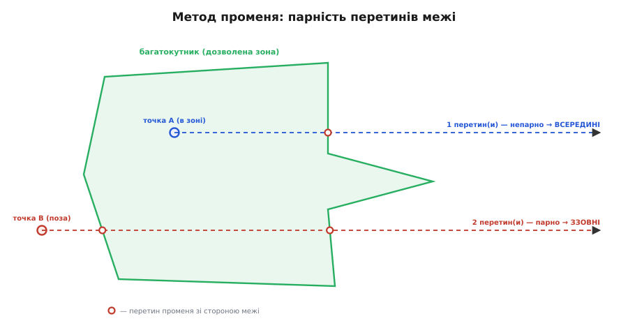

# Належність точки багатокутнику

<preknowlist>
- [Система координат](root:math-geometry/coordinate-system) — точка на площині як пара чисел (x, y).
</preknowlist>

Багатокутник заданий списком вершин; десь на площині — точка. Питання, просте на вигляд: **точка всередині цього контуру чи зовні?** Воно виринає всюди — у графіці (чи влучив клік у фігуру, яку область заливати кольором), у геоінформаційних системах (чи ця координата в межах району), у виявленні зіткнень, а в автопілоті безпілотника — чи апарат усередині дозволеної [геозони](root:sys-dron/geofence) складної форми. У кола є центр, тож для нього досить однієї відстані. Багатокутник центру не має: контур може бути ділянкою химерної форми, коридором, простором між вирізами. Отже, звести питання до одного порівняння не вийде — потрібен інший прийом. Класична відповідь — **метод променя**.

## Метод променя: парність перетинів

Метод променя (англ. *ray casting*), він же правило парності (англ. *even-odd rule*), простий майже по-дитячому — і саме тому надійний. Пусти з досліджуваної точки **промінь** у будь-який бік — скажімо, строго на схід, у нескінченність. Порахуй, **скільки разів** цей промінь перетне сторони багатокутника. Далі спрацьовує чиста логіка парності: якщо стартова точка **всередині**, то, рушивши назовні, ти мусиш зрештою вийти за контур — а щоб вийти, треба перетнути межу непарну кількість разів (вийшов — і все). Якщо ж стартова точка **зовні**, то промінь або взагалі не зачепить контур (нуль перетинів), або зайде й вийде — тобто перетне парну кількість разів. Отже:

```
непарна кількість перетинів  →  точка ВСЕРЕДИНІ
парна (зокрема нуль)         →  точка ЗЗОВНІ
```

Ця відповідь не залежить від форми багатокутника, від того, опуклий він чи з вирізами, і навіть від того, скільки в нього вершин. Достатньо самого підрахунку перетинів — тому метод і став стандартним.


*Промінь з кожної точки пущено строго праворуч. Із внутрішньої точки він перетинає межу багатокутника один раз (непарно — всередині); із зовнішньої, що проходить крізь виступ, — два рази (парно — зовні). Відповідь залежить лише від парності числа перетинів, а не від форми контуру.*

## Як порахувати перетини: геометрія одного ребра

Тепер від ідеї до обчислення. Багатокутник заданий масивом вершин — послідовністю точок `(x, y)`, де сусідні з'єднані сторонами, а остання замикається на першу. Пускати справжній промінь не треба: для кожної сторони ми аналітично перевіряємо, **чи перетинає її горизонтальний промінь**, пущений з нашої точки праворуч.

Візьмемо сторону між вершинами `V[i]` і `V[j]` (де `j` — попередня вершина) та точку `(px, py)`. Горизонтальний промінь на схід — це напівпряма `y = py, x ≥ px`. Він перетне сторону тоді й лише тоді, коли виконано дві умови разом:

Перша — **сторона «накриває» рівень py по вертикалі**: один її кінець вище нашої точки, другий не вище. Формально `(V[i].y > py) ≠ (V[j].y > py)`. Ця нерівність-«виключне АБО» істинна рівно тоді, коли py лежить між ординатами кінців сторони — тобто горизонталь на висоті py взагалі може зустріти цю сторону.

Друга — **точка перетину лежить праворуч від px**. Знайшовши, на якій висоті сторона перетинає рівень py, обчислюємо x-координату цього перетину й перевіряємо, що вона більша за px (промінь іде вправо). x перетину знаходимо лінійною інтерполяцією вздовж сторони:

```
x_перетину = V[i].x + (py − V[i].y) · (V[j].x − V[i].x) / (V[j].y − V[i].y)
```

Якщо `px < x_перетину`, промінь перетинає цю сторону — рахуємо один перетин. Пройшовши так усі сторони й порахувавши перетини, дивимось на парність підсумку.

## Робочий код

Ось компактна й перевірена реалізація. Цикл іде по всіх вершинах, `j` завжди вказує на попередню (з замиканням останньої на першу через прийом `j = i` в кінці ітерації), а прапорець `inside` перемикається на кожному перетині — так зберігається сама парність без окремого лічильника.

:::tabs
```c
#include <stdbool.h>

typedef struct { float x; float y; } pt_t;   // координати на площині

// Метод променя: чи точка p всередині багатокутника з n вершин verts[].
// Промінь пускаємо горизонтально праворуч; inside перемикається на кожному
// перетині сторони — фінальний стан і є відповідь (парність числа перетинів).
bool point_in_polygon(pt_t p, const pt_t *verts, int n) {
    bool inside = false;
    for (int i = 0, j = n - 1; i < n; j = i++) {
        // Умова 1: сторона (verts[j] → verts[i]) накриває рівень p.y по вертикалі.
        bool straddles = (verts[i].y > p.y) != (verts[j].y > p.y);
        if (straddles) {
            // Умова 2: точка перетину сторони з горизонталлю лежить правіше p.x.
            float x_cross = verts[i].x
                + (p.y - verts[i].y) * (verts[j].x - verts[i].x)
                                     / (verts[j].y - verts[i].y);
            if (p.x < x_cross)
                inside = !inside;      // перетин — перемкнути парність
        }
    }
    return inside;
}
```
```python
# Метод променя: чи точка (px, py) всередині багатокутника з вершинами verts.
# verts — список пар (x, y) на площині.
# Промінь пускаємо горизонтально праворуч; inside перемикається на кожному
# перетині сторони — фінальний стан і є відповідь (парність числа перетинів).
def point_in_polygon(px, py, verts):
    inside = False
    n = len(verts)
    j = n - 1
    for i in range(n):
        xi, yi = verts[i]
        xj, yj = verts[j]
        # Умова 1: сторона (verts[j] → verts[i]) накриває рівень py по вертикалі.
        straddles = (yi > py) != (yj > py)
        if straddles:
            # Умова 2: точка перетину сторони з горизонталлю лежить правіше px.
            x_cross = xi + (py - yi) * (xj - xi) / (yj - yi)
            if px < x_cross:
                inside = not inside      # перетин — перемкнути парність
        j = i
    return inside
```
:::

Уся робота — один прохід по вершинах, тому вартість перевірки лінійна за їхньою кількістю: O(n) проти майже безкоштовного порівняння для кола. На контурі в кілька десятків вершин це десятки арифметичних дій на кожну перевірку належності — помітно, коли перевірку роблять багато разів на секунду, але цілком підйомно.

**Перевірка на числах: точка всередині квадрата.**

Хай багатокутник — квадрат зі стороною 100 із кутами (0,0), (100,0), (100,100), (0,100), а точка `p = (50, 50)` — у центрі.

```
Промінь з (50,50) на схід: y = 50, x ≥ 50.
Сторона (0,0)→(100,0):     обидва кінці y=0, не накриває рівень 50 — пропуск.
Сторона (100,0)→(100,100): кінці y=0 і y=100 — накриває 50.
      x_перетину = 100 + (50−0)·(100−100)/(100−0) = 100.  px=50 < 100 → перетин! inside=true
Сторона (100,100)→(0,100): обидва y=100, не накриває 50 — пропуск.
Сторона (0,100)→(0,0):     кінці y=100 і y=0 — накриває 50.
      x_перетину = 0 + (50−100)·(0−0)/(0−100) = 0.  px=50 < 0? Ні → не рахуємо.
Разом: 1 перетин — непарно → ВСЕРЕДИНІ. ✓
```

Логіка спрацювала: промінь на схід пробив лише праву стінку квадрата (ліва лишилася позаду точки), один перетин, непарно — точка всередині. Якби точка була в (150, 50), обидві вертикальні стінки опинилися б ліворуч від неї, перетинів нуль — зовні.

## Граничні випадки, на яких метод спотикається

Проста ідея має підступні кути, і саме на них перечепилася рання публікація методу — алгоритм Шимрата в *Communications of the ACM* 1962 року, де межові випадки давали хибну відповідь і потребували правки невдовзі. Розглянути їх треба, бо через недбалість тут перевірка мовчки дає хибну відповідь — найгірший вид помилки.

**Промінь влучає точно у вершину.** Якщо горизонталь на висоті py проходить рівно через вершину, наївний код порахує перетин **двічі** (вершина належить двом сторонам) — і парність зламається. Ліки — асиметрична межа в умові накриття: `(verts[i].y > p.y)` бере строгу нерівність `>` для одного кінця й нестрогу (через заперечення) для другого. Так вершина зараховується рівно до однієї зі своїх двох сторін, і подвійного рахунку немає. У коді вище це вже закладено саме тому — несиметричність `>` навмисна, не випадкова.

**Горизонтальна сторона.** Якщо сторона паралельна променю (обидва кінці на тій самій висоті `y`), то `verts[i].y == verts[j].y`, і формула перетину ділила б на нуль. Але той самий трюк рятує і тут: для горизонтальної сторони обидва кінці або вище py, або не вище, тож `straddles` виходить `false`, і до ділення справа взагалі не доходить. Горизонтальні сторони просто ігноруються — і правильно, бо промінь ковзає вздовж них, а не перетинає.

**Точка рівно на межі.** Це принципова, а не технічна тонкість: математично точка на самому ребрі — гранична, і метод променя може віднести її то до «всередині», то до «зовні» залежно від напрямку обходу й дрібних похибок. Куди її зараховувати — питання угоди: якщо потрібна визначеність, її задають окремою перевіркою «чи лежить точка на ребрі». А в прикладних задачах гранична смуга часто взагалі не критична: у геозоні, скажімо, рішення приймають не на самій лінії, а зі смугою запасу завширшки в метри, і точка, що балансує рівно на ребрі з точністю до сантиметра, давно вже в цій смузі, де реакція вмикається незалежно від того, як метод променя округлив саму межу.

> 🔧 **Навіщо це.** Не пиши перевірку належності «з нуля по пам'яті» — саме на вершинах і горизонтальних сторонах народжуються баги, які проявляються раз на тисячу разів у геть конкретній геометрії контуру. Бери канонічну форму з асиметричною нерівністю `>`/`≤` (як вище) і не «спрощуй» її до симетричної: та несиметрія — не недогляд, а і є лік від подвійного рахунку вершин.

## Застосування на сфері: спершу спроєктуй на площину

Метод променя — це геометрія на **площині**: він відлічує перетини прямих ліній. Тому пряме застосування до географічних даних має пастку. Вершини реального контуру часто задані на **сфері**, у градусах широти й довготи, а підставляти градуси прямо в `point_in_polygon` не можна з тієї самої причини, з якої не можна наївно віднімати координати для відстані: градус довготи «коштує» різне число метрів на різних широтах, тож на сфері «прямі сторони» багатокутника викривлені, і метод променя рахував би криву геометрію як пласку.

Вихід — **спроєктувати** і точку, і всі вершини на локальну пласку площину, перш ніж пускати промінь. Найпростіша така проєкція навколо опорної точки `(φ₀, λ₀)`:

```
x = (λ − λ₀) · cos(φ₀) · (π/180) · R      // метри на схід
y = (φ − φ₀) · (π/180) · R                // метри на північ
```

Множник `cos(φ₀)` — це те саме звуження градуса довготи, лише взяте один раз для всієї зони. Це **рівнокутна проєкція** (англ. *equirectangular*): на масштабах кілометрів кривина Землі дає похибку часток відсотка, зате вся геометрія стає пласкою, а обчислення — дешевими (звичайні множення замість тригонометрії на кожну вершину). Саме так це роблять у геоінформаційних системах і автопілотах: координати переводять у локальні метри сталим множником, а вже на площині рахують належність контуру методом променя. Отже, повний рецепт перевірки «точка в зоні» на Землі — дві дії: спроєктувати на площину, а тоді порахувати парність перетинів.
