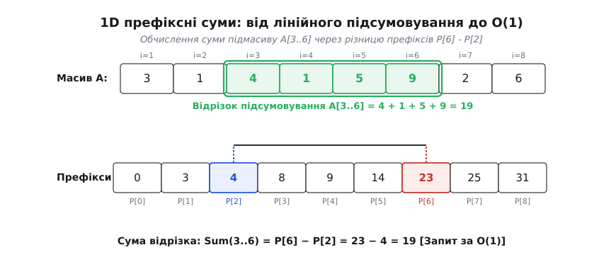
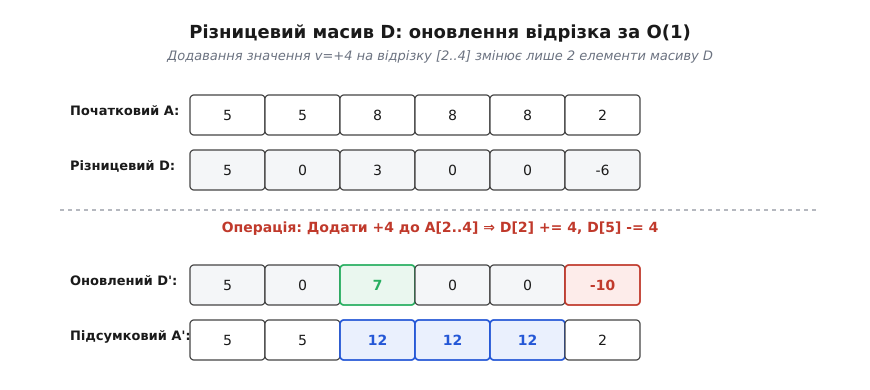
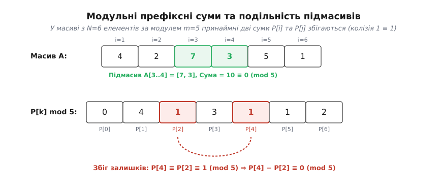
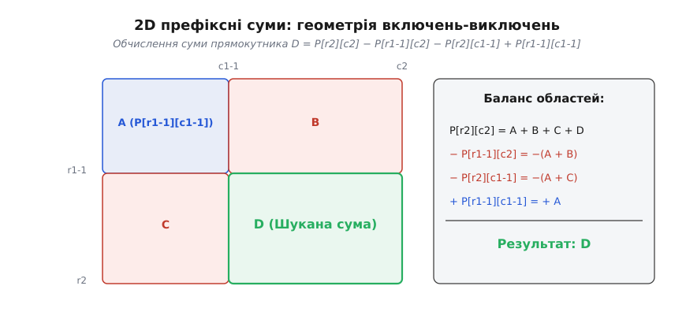

# Префіксні суми

<preknowlist>
- [Модульна арифметика](root:math-number-theory/modular-arithmetic) — остачі від ділення, класи лишків та їхня алгебраїчна структура.
- [Принцип Діріхле](root:math-logic/pigeonhole-principle) — доведення існування через розподіл елементів по комірках.
- [Арифметика цілих чисел](root:math-number-theory/fundamental-theorem-arithmetic) — додавання, віднімання та подільність у Z.
</preknowlist>

Уявіть високонавантажений сервер обробки фінансових транзакцій, глобальний торговельний майданчик або геоінформаційну систему, яка опрацьовує мільйони вимірювань із мереж датчиків довкілля. Щосекунди до системи надходять тисячі запитів: обчислити сумарний виторг магазину з 12 по 45 день місяця, визначити сумарний обсяг переданих даних між 100-ю та 500-ю секундами трансляції або порахувати кількість опадів над певною метеорологічною станцією за вибраний часовий інтервал. 

Якщо для кожного такого запиту чесно запускати цикл від лівої межі до правої та послідовно додавати числа по одному, обчислювальне ядро процесора миттєво застрягне у безкінечних обходах. При довжині послідовності `N = 100 000` елементів та кількості запитів `Q = 100 000` наивний алгоритм виконує у найгіршому випадку до `10¹⁰` операцій додавання. Система, яка мала б надавати відповідь за частки мілісекунди, починає виконувати обчислення хвилинами, блокуючи виконання сусідніх задач.

Причина цієї обчислювальної катастрофи полягає в постійному дублюванні вже виконаної роботи. Обчисличуючи суму від 12 до 45 дня, ми знову й знову складаємо перші 12 днів, які вже неодноразово складали для попередніх аналітичних запитів. Щоб зламати це лінійне уповільнення, накопичену інформацію про суми послідовності потрібно обчислити й зберегти заздалегідь. 

Ідея полягає в тому, щоб один раз побудувати допоміжну послідовність накопичувальних сум від початку вихідного масиву. Таку накопичувальну суму називають **префіксною сумою** (від латинського *praefixus* — «прикріплений спереду»). Префіксний масив повністю перетворює лінійне підсумовування `O(N)` на одну миттєву арифметичну дію віднімання двох чисел, яка виконується за сталий час `O(1)`.

---

### Анатомія одновимірного префіксного масиву

Розглянемо вихідну послідовність цілих чисел `A = [a_1, a_2, ..., a_N]`. Побудуємо новий масив `P`, кожен елемент якого зберігає суму всіх елементів вихідної послідовності від її початку до поточного індексу включно.

Сформуємо елементи масиву `P` за наступним правилом:

```
P_0 = 0
P_1 = a_1
P_2 = a_1 + a_2
P_3 = a_1 + a_2 + a_3
...
P_k = a_1 + a_2 + ... + a_k
```

Зверніть увагу на найперший елемент `P_0 = 0`. Це не формальний технічний трюк, а **фіктивний нуль** або падінг (від англійського *padding* — «набивка», «прокладка»). Він відповідає порожньому префіксу — сумі послідовності, яка ще не містить жодного елемента. Додавання елемента `P_0 = 0` на початок префіксного масиву має фундаментальне значення: воно гарантує, що єдина формула суми буде точно працювати для будь-якого відрізка, навіть якщо він починається з найпершого елемента `a_1`.

Тепер, якщо потрібно знайти суму елементів на довільному відрізку від `i` до `j` включно (де `1 ≤ i ≤ j ≤ N`), замість виконання `j − i + 1` послідовних додавань достатньо взяти різницю двох елементів префіксного масиву:

```
S(i..j) = a_i + a_{i+1} + ... + a_j = P_j − P_{i-1}
```

Чому ця формула працює завжди строго й безвинятково, легко переконатися з алгебраїчного розгортання:

```
P_j       = (a_1 + a_2 + ... + a_{i-1}) + (a_i + a_{i+1} + ... + a_j)
P_{i-1}   = (a_1 + a_2 + ... + a_{i-1})
```

Віднімаючи `P_{i-1}` від `P_j`, ми повністю скорочуємо й ліквідуємо спільний лівий префікс `(a_1 + a_2 + ... + a_{i-1})`, залишаючи в результаті суму елементів шуканого відрізка `a_i + a_{i+1} + ... + a_j`.


*1D префіксні суми перетворюють лінійний обхід масиву на одну різницю двох накопичувальних значений. Сума відрізка A[3..6] дорівнює P[6] − P[2] = 23 − 4 = 19.*

Для наочності простежимо побудову префіксного масиву та виконання запиту на конкретному числовому прикладі.

Нехай дано вихідний масив `A = [3, 1, 4, 1, 5, 9, 2, 6]` довжиною `N = 8`.

Обчислимо елементи префіксного масиву `P` розміром `N + 1 = 9`:
- `P[0] = 0` (початковий падінг для порожнього префікса)
- `P[1] = P[0] + A[1] = 0 + 3 = 3`
- `P[2] = P[1] + A[2] = 3 + 1 = 4`
- `P[3] = P[2] + A[3] = 4 + 4 = 8`
- `P[4] = P[3] + A[4] = 8 + 1 = 9`
- `P[5] = P[4] + A[5] = 9 + 5 = 14`
- `P[6] = P[5] + A[6] = 14 + 9 = 23`
- `P[7] = P[6] + A[7] = 23 + 2 = 25`
- `P[8] = P[7] + A[8] = 25 + 6 = 31`

Якщо потрібно знайти суму елементів від 3-го до 6-го включно (`A[3..6] = [4, 1, 5, 9]`), обчислимо різницю:
`S(3..6) = P[6] − P[2] = 23 − 4 = 19`.
Перевірка прямим додаванням дає той самий результат: `4 + 1 + 5 + 9 = 19`. Запит виконано за 1 дію віднімання.

#### Індексація та узгодження границь (0-based vs 1-based)

У реальному програмуванні вибір мови (C/C++, Java, Python) вимагає переведення математичної 1-індексації у 0-індексацію масивів. 

Якщо вихідний масив `arr` має індекси від `0` до `N - 1`, префіксний масив `pref` будують довжиною `N + 1`, де:
- `pref[0] = 0`
- `pref[i + 1] = pref[i] + arr[i]` для `0 ≤ i < N`.

При такій узгодженій індексації сума елементів на закритому відрізку від `l` до `r` включно (де `0 ≤ l ≤ r < N`) обчислюється за формулою:

```
Sum(l..r) = pref[r + 1] − pref[l]
```

Якщо ж API використовує напіввідкритий інтервал `[l, r)` (поширений у стандартній бібліотеці C++ STL та Python), формула спрощується до суворого вигляду `pref[r] - pref[l]`.

> 🔧 **Навіщо це.** Завдяки префіксним сумам аудіоплеєр або цифровий еквалайзер миттєво обчислює середню енергію звукового сигналу на довільному часовому інтервалі кадру, а фінансова база даних за один такт процесора отримує оборот компанії за будь-який вибраний діапазон дат без повторного сканування транзакцій.

---

### Дискретне числення: первісна та оператор різниці

Префіксна сума виступає не лише алгоритмічним інструментом — це точний дискретний відповідник визначеного інтеграла з неперервного математичного аналізу. Якщо неперервний інтеграл `F(x) = ∫_a^x f(t) dt` накопичує площу під гладкою кривою, то префіксний масив `P[k]` накопичує суму дискретних величин.

Відповідно, зворотна операція до префіксного підсумовування — це обчислення послідовних різниць сусідніх елементів. Її здійснює **різницевий оператор** (від латинського *differentia* — «відмінність», «різниця»), який позначають грецькою літерою Δ (дельта):

```
Δ P[k] = P[k] − P[k-1] = a_k
```

Різницевий оператор Δ виступає дискретним двійником похідної `d/dx`. Зв'язок між префіксним підсумовуванням ∑ та різницевим оператором Δ виражає **основна теорема дискретного числення**:

1. **Диференціювання префіксів повертає вихідний елемент**: `Δ (∑ a_k) = a_k`.
2. **Підсумовування різниць відновлює вихідну послідовність з точністю до константи**: `∑ (Δ A[k]) = A[k] − A[0]`.

Ця симетрія дозволяє застосовувати в дискретних задачах усі потужні аналоги неперервного аналізу. Зокрема, аналог формули інтегрування частинами — перетворення Абеля — дозволяє підсумовувати складні добутки послідовностей:

```
∑_{k=1}^N a_k · b_k = P_N · b_N − ∑_{k=1}^{N-1} P_k · (b_{k+1} − b_k)
```

Ця формула має колосальне значення при оцінці асимптотики арифметичних сум, де один із множників є гладкою функцією, а другий — осцилюючою арифметичною послідовністю. Докладніше про те, як математики XVIII століття будували дискретне числення для обчислення астрономічних таблиць та виведення формули Ойлера — Маскероні, розказано в матеріалі про [історію виникнення дискретного числення](root:sf-algorithms/prefix-sums/hist-discrete-calculus.md).

---

### Різницевий масив та групові оновлення на відрізках за O(1)

Розглянемо протилежну задачу, яка регулярно виникає при моделюванні фізичних процесів, рендерингу та обробці масових подій у реальному часі. Нехай маємо масив `A` з `N` елементів, і нам потрібно виконати `Q` операцій масового оновлення: додати значення `v` до кожного елемента на відрізку від `l` до `r` включно.

Наивний підхід змінити кожен елемент у циклі вимагає `O(N)` кроків на кожну операцію. Для `Q` оновлень це знову дає важку складність `O(N · Q)`.

Однак, пам'ятаючи про дуальність між різницями та префіксами, ми можемо застосувати **різницевий масив** (англ. *difference array*). Замість модифікації всіх елементів усередині відрізка `[l, r]` ми змінюємо лише **два елементи** у масиві різниць `D[i] = A[i] - A[i-1]`:

```
D[l]     = D[l] + v
D[r + 1] = D[r + 1] − v
```


*Різницевий масив дозволяє додавати значення на відрізку за O(1), змінюючи лише дві межі. Підсумковий масив відновлюється за один прохід префіксного підсумовування.*

Додавання `v` до `D[l]` означає, що при наступному префіксному підсумовуванні це значення «пролиється» на всі елементи праворуч від `l`. А віднімання `v` на позиції `D[r + 1]` зупиняє цю хвилю, скасовуючи дію `v` для всіх елементів за межами відрізка `r`.

Кожне групове оновлення виконується за константний час `O(1)`. Після того як усі `Q` оновлень внесено до різницевого масиву `D`, підсумковий модифікований масив `A'` відновлюється за один прохід префіксного підсумовування `O(N)`:

```
A'[k] = ∑_{i=0}^k D[i]
```

Загальна складність виконання `Q` оновлень та підсумкового відновлення знижується з `O(N · Q)` до `O(N + Q)`, що дає прискорення у тисячі разів на великих масивах.

#### Двовимірний різницевий масив (2D Difference Array)

Припустимо тепер, що ми працюємо з двовимірною матрицею `A` розміром `R × C` і нам потрібно додати значення `v` до всіх елементів у прямокутній області від `(r1, c1)` до `(r2, c2)`.

У двовимірному різницевому масиві `D[r][c]` ця масова операція виконується зміною лише **чотирьох кутових елементів**:

```
D[r1][c1]         = D[r1][c1] + v
D[r1][c2 + 1]     = D[r1][c2 + 1] − v
D[r2 + 1][c1]     = D[r2 + 1][c1] − v
D[r2 + 1][c2 + 1] = D[r2 + 1][c2 + 1] + v
```

При відновильному підсумовуванні перші два доданки проливають значення `v` на відповідні півплощини, третій доданок скасовує подвійне перекриття у правому нижньому куті, а четвертий відновлює коректне значення за межами прямокутника. Завдяки цьому прямокутна модифікація будь-якого розміру здійснюється за 4 операції запису за `O(1)`.

#### Історичний зв'язок: Різницева машина Чарльза Беббіджа

Механічний обчислювальний пристрій, розроблений англійським математиком Чарльзом Беббіджем у 1822 році під назвою **Різницева машина** (*Difference Engine*), опирався саме на принцип відновлення послідовностей через підсумовування скінченних різниць. Для табулювання навігаційних та астрономічних таблиць поліномів `f(x) = a_n xⁿ + ... + a_0` машина Беббіджа не обчислювала степені `xⁿ` для кожного аргументу, а послідовно додавала сталу `n`-ну різницю до попередніх префіксних сум. Це дозволяло механічним шестерням генерувати складні логарифмічні та тригонометричні таблиці за допомогою виключно операції додавання.

---

### Модульна арифметика: подільність підмасивів та принцип Діріхле

Префіксні суми виявляють дивовижні властивості, коли їх досліджують через призму теорії чисел та арифметики залишків від ділення (модульної арифметики). Зведення префіксних сум за модулем `m` перетворює їх на потужний інструмент доведення існування фрагментів із заданою подільністю.

Розглянемо класичну теоретико-числову задачу: чи завжди в масиві з `N` цілих чисел можна знайти непорожній підмасив, сума елементів якого ділиться на `N` націло?

Відповідь дає аналіз залишків префіксних сум. Нехай маємо `N` цілих чисел `a_1, a_2, ..., a_N`. Запишемо їхні `N + 1` префіксні суми `P_0, P_1, P_2, ..., P_N` та візьмемо залишки від ділення кожної суми на `N`:

```
r_k = P_k mod N,   де  k ∈ {0, 1, ..., N}
```

Кількість префіксних сум дорівнює `N + 1`. Проте можливих залишків від ділення на `N` існує лише `N` (це числа `0, 1, 2, ..., N - 1`).

За принципом Діріхле («принципом комірок»), якщо `N + 1` об'єктів розподілити по `N` комірках, то принаймні в одній комірці опиниться не менше двох об'єктів. Це означає, що принаймні дві префіксні суми `P_i` та `P_j` (де `i < j`) обов'язково дадуть **однаковий залишок** (конгруентність, від латинського *congruentia* — «збіг») за модулем `N`:

```
P_j ≡ P_i (mod N)
```


*Колізія двох префіксних сум за модулем m (тут P[4] ≡ P[2] ≡ 1 mod 5) гарантує, що сума підмасиву між ними ділиться на m без остачі.*

Віднімаючи ці дві конгруентні суми, отримуємо:

```
P_j − P_i = a_{i+1} + a_{i+2} + ... + a_j ≡ 0 (mod N)
```

Отже, сума елементів підмасиву `A[i+1..j]` ділиться на `N` без остачі! Цей результат доводить фундаментальну теорему: **у будь-якій послідовності з N цілих чисел завжди існує принаймні один непорожній підмасив, сума елементів якого кратна N**.

#### Пошук підмасиву з довільною цільовою остачею

Розглянемо узагальнення цієї задачі: знайти підмасив `A[i..j]`, сума якого за модулем `m` дорівнює заданому цільовому залишком `R_target`.

Рівняння для шуканого відрізка виражається через префіксні суми:

```
(P_j − P_{i-1}) ≡ R_target (mod m)   ⇔   P_{i-1} ≡ (P_j − R_target) (mod m)
```

Це рівняння дає алгоритм пошуку за один прохід `O(N)`. Проходячи масивом від `j = 1` до `N`, ми обчислимо поточний залишок `P_j mod m`, додаємо його до хеш-таблиці та перевіряємо, чи зустрічався раніше залишок `(P_j − R_target) mod m`. Якщо так, шуканий підмасив знайдено миттєво.

Повні строгі виведення цієї теореми, узагальнення для довільного модуля `m` та алгебраїчний розклад винесено в матеріал про [математичні доведення та тотожності](root:sf-algorithms/prefix-sums/math-subsegment-divisibility.md).

---

### Оптимізаційні алгоритми: пошук максимального підмасиву (Алгоритм Кадане)

Префіксні суми надають елегантну геометричну інтерпретацію класичній задачі знаходження підмасиву з максимальною сумою (*Maximum Subarray Sum Problem*).

Нехай потрібно знайти пара підмасив `A[i..j]`, який максимізує суму `∑_{k=i}^j a_k`.

Виразимо цю суму через префікси:

```
MaxSubarraySum = max_{1 ≤ i ≤ j ≤ N} (P_j − P_{i-1})
```

Для фіксованого правого індексу `j` значення `P_j − P_{i-1}` досягає максимуму тоді, коли віднімається **мінімальна префіксна сума**, яка зустрічалася на індексах до `j`:

```
MaxSum(j) = P_j − min_{0 ≤ k < j} P_k
```

Проходячи масивом від `j = 1` до `N` і підтримуючи в одній змінній поточний мінімум префіксів `min_P`, ми обчислюємо максимальну можливу суму підмасиву, який закінчується на `j`, за лінійний час `O(N)` і з нулевими додатковими витратами пам'яті `O(1)`. Цей алгоритм еквівалентний класичному алгоритму Кадане (*Kadane's Algorithm*), але його виведення через префіксні суми робить логіку абсолютно прозорою.

---

### Підсумовування арифметичних функцій та асимптотика

В аналітичній теорії чисел префіксні суми виступають головним містком між дискретними властивостями простих чисел та неперервною комплексною аналітикою. Двома найважливішими прикладами є префіксні суми класичних арифметичних функцій: **функції Мьобіуса** `μ(n)` та **функції Ойлера** `φ(n)`.

Префіксна сума функції Мьобіуса називається **функцією Мертенса** і позначається `M(x)`:

```
M(x) = ∑_{n ≤ x} μ(n)
```

Оскільки `μ(n)` набуває значень +1, -1 або 0 залежно від кількості простих дільників числа, функція Мертенса `M(x)` описує відхилення бінарного розподілу псевдовипадкових знаків. Оцінка швидкості зростання цієї префіксної суми тісно пов'язана з найвидатнішою нерозв'язаною проблемою математики: **гіпотеза Рімана** про нулі дзета-функції `ζ(s)` еквівалентна твердженню, що префіксна сума Мертенса зростає не швидше ніж `M(x) = O(x^{1/2 + ε})` для будь-якого `ε > 0`.

Іншим видатним результатом є префіксна сума функції Ойлера `φ(n)`, яка визначає середню щільність взаємно простих чисел:

```
Φ(x) = ∑_{n ≤ x} φ(n) = (3 / π²) · x² + O(x · log x)
```

Коефіцієнт `3 / π² ≈ 0.6079` показує асимптотичну ймовірність того, що два випадково обрані цілі числа виявляться взаємно простими.

Крім того, префіксна сума функції кількості дільників `d(n)` оцінюється за допомогою методу гіперболи Діріхле:

```
D(x) = ∑_{n ≤ x} d(n) = x · log x + (2γ − 1) · x + O(√x)
```

де `γ ≈ 0.577215` — стала Ойлера — Маскероні. Цей результат демонструє, як сумування дільників під гіперболою `a · b = x` перетворює дискретну лічбу точок на точний асимптотичний розклад.

---

### Багатовимірні префіксні суми та геометрія включень-виключень

Концепція префіксних сум природно узагальнюється на двовимірні матриці, тривимірні воксельні сітки та `N`-вимірні гіперкуби.

У двовимірній матриці `A` розміром `R × C` префіксна сума `P[r][c]` зберігає суму всіх елементів у прямокутнику від лівого верхнього кута `(1, 1)` до правого нижнього кута `(r, c)`:

```
P[r][c] = ∑_{i=1}^r ∑_{j=1}^c A[i][j]
```

Для рекурентної побудови двовимірної префіксної матриці використовується **принцип включень-виключень** (англ. *Inclusion-Exclusion Principle*):

```
P[r][c] = A[r][c] + P[r-1][c] + P[r][c-1] − P[r-1][c-1]
```


*Обчислення суми прямокутної підматриці D за принципом включень-виключень через чотири кутові префікси: D = P[r2][c2] − P[r1-1][c2] − P[r2][c1-1] + P[r1-1][c1-1].*

Щоб знайти суму елементів у довільному прямокутнику з верхнім лівим кутом `(r1, c1)` та нижнім правим кутом `(r2, c2)`, беруть комбінацію чотирьох префіксів:

```
S = P[r2][c2] − P[r1-1][c2] − P[r2][c1-1] + P[r1-1][c1-1]
```

При відніманні двох смуг `P[r1-1][c2]` та `P[r2][c1-1]` верхній лівий прямокутник `P[r1-1][c1-1]` віднімається двічі, тому його додають назад один раз як поправку принципу включень-виключень. Завдяки цій геометрії сума будь-якої підматриці обчислюється за рівно 4 звернення до пам'яті за `O(1)`.

У комп'ютерному зорі ця двовимірна структура відома як **інтегральне зображення** (англ. *Integral Image*, запропоноване Франком Кроу у 1984 році та популяризоване алгоритмом Віоли — Джонса). Воно дозволяє за `O(1)` обчислювати середнє значення яскравості в будь-якому прямокутному вікні для швидкого виявлення облич на відеокадрах у реальному часі.

#### Тривимірний та n-вимірний варіанти

У тривимірній воксельній сітці сума вокселів у паралелепіпеді від `(x1, y1, z1)` до `(x2, y2, z2)` комбінує 8 вершин зі змінними знаками:

```
Sum = P[x2][y2][z2] − P[x1-1][y2][z2] − P[x2][y1-1][z2] − P[x2][y2][z1-1]
    + P[x1-1][y1-1][z2] + P[x1-1][y2][z1-1] + P[x2][y1-1][z1-1] − P[x1-1][y1-1][z1-1]
```

У `d`-вимірному просторі формула запиту гіперкуба вимагає оцінки `2ᵈ` вершин.

---

### Префіксні суми у статистиці: ковзне середнє та дисперсія

Префіксні суми виступають незамінним примітивом у математичній статистиці та обробці часових рядів:

1. **Ковзне середнє (Moving Average)**: Для обчислення середнього значення послідовності `A` у вікні фіксованої довжини `K` за `O(1)` використовується формула `Mean(i) = (P[i] - P[i - K]) / K`.
2. **Скользяща дисперсія (Moving Variance)**: Для обчислення дисперсії `Var(X) = E[X²] - (E[X])²` за сталий час паралельно будують два префіксні масиви:
   - Масив перших степенів: `P1[i] = ∑ A[k]`.
   - Масив квадратів: `P2[i] = ∑ (A[k])²`.
   Сума квадратів на будь-якому відрізку обчислюється за `O(1)` як `P2[r] - P2[l-1]`, що дозволяє розраховувати середнє квадратичне відхилення сигналу за лічені наносекунди.

---

### Префіксний XOR та векторні простори GF(2^k)

Операція префіксного підсумовування не обмежується лише звичайним додаванням чисел. У комп'ютерній алгебраїчній системі та двійковій арифметиці додавання за модулем 2 збігається з побітовим виключним ЧОГО (`XOR`, позначається `⊕`).

Позначимо префіксний XOR як `PX[i] = A[1] ⊕ A[2] ⊕ ... ⊕ A[i]`, покладаючи базовий падінг `PX[0] = 0`.

Оскільки операція `XOR` володіє властивістю самооберненості (`x ⊕ x = 0`), результат побітового `XOR` елементів на відрізку від `l` до `r` обчислюється як:

```
A[l] ⊕ A[l+1] ⊕ ... ⊕ A[r] = PX[r] ⊕ PX[l-1]
```

У цій формулі не потрібно використовувати знак віднімання: повторне застосування `PX[l-1]` точно скасовує внесок елементів від `1` до `l-1`, виключаючи їх із результату. Префіксний XOR широко застосовується в криптографічних протоколах, алгоритмах контролю парності та пошуку унікальних елементів у масивах.

---

### Префіксні суми на деревних структурах (Tree Prefix Sums)

У теорії графів концепція префіксних сум узагальнюється на деревоподібні структури даних. Нехай дано кореневе дерево з `N` вершин, де кожна вершина `v` має свою вагу `W[v]`.

Обчислимо префіксну суму на шляху від кореня дерева до вершини `v`:
`P[v]` дорівнює сумі ваг усіх вершин на шляху від кореня до `v`.

Якщо нам потрібно обчислити суму ваг на простих шляхах між довільними двома вершинами `u` та `v`, застосовується найменший спільний предок (англ. *Lowest Common Ancestor*, LCA):

```
PathSum(u, v) = P[u] + P[v] − 2 · P[lca(u, v)] + W[lca(u, v)]
```

Віднімання подвійного префікса `2 · P[lca(u, v)]` скасовує спільний шлях від кореня до спільного предка, а додавання `W[lca(u, v)]` повертає вагу самої вершини предка, яка була віднята двічі. Це дозволяє здійснювати запити сум на шляхах дерев за `O(1)` після попередньої обробки LCA.

#### Різницевий масив на деревах (Tree Difference Array)

Аналогічно до одновимірного різницевого масиву, додавання значення `val` до ваг усіх вершин на простому шляху між `u` та `v` реалізується модифікацією лише чотирьох вершин у масиві різниць `D`:

```
D[u]          = D[u] + val
D[v]          = D[v] + val
D[lca(u, v)]  = D[lca(u, v)] − val
D[parent(lca(u, v))] = D[parent(lca(u, v))] − val
```

Після накопичення всіх оновлень шляхів підсумкові значення вершин відновлюються за один прохід знизу вгору (від листя до кореня) методом знизу-вгору підсумовування піддерев за `O(N)` часу. Це застосовується при оптимізації маршрутів у комп'ютерних мережах та базах даних.

---

### Префіксні добутки та робота у логарифмічному просторі

Поряд із додаванням, аналогічну накопичувальну структуру можна побудувати для операції множення — **префіксні добутки**:

```
M_k = a_1 · a_2 · ... · a_k,   де  M_0 = 1
```

Добуток елементів на відрізку `[l, r]` обчислюється діленням: `Prod(l..r) = M_r / M_{l-1}`.

Однак префіксні добутки мають дві суттєві обчислювальні проблеми:
1. **Вибухоподібне зростання чисел**: Добуток навіть 20 цілих чисел легко виходить за межі 64-бітних типів пам'яті.
2. **Наявність нулів**: Якщо хоча б один елемент `a_k = 0`, усі наступні префіксні добутки перетворюються на нуль, роблячи ділення неможливим (`0 / 0`).

Для вирішення проблеми переповнення вихідні числа переводять у логарифмічний простір: `log(a_1 · a_2 · ... · a_k) = ∑ log(a_i)`. Завдяки власнисті логарифмів добуток перетворюється на звичайну префіксну суму логарифмів, що дозволяє миттєво обчислювати геометричне середнє на довільних відрізках без ризику переповнення типів.

---

### Паралельні обчислення префіксних сум (Parallel Scan)

На сучасних багатиядерних процесорах та графічних прискорювачах (GPU) обчислення префіксних сум відоме як `Prefix Scan`. Послідовне обчислення `P[i] = P[i-1] + A[i]` має строгу залежність за даними, але його можна ефективно паралелізувати за допомогою алгоритму Хілліса — Стіла або Блеллока.

Алгоритм Блеллока (*Blelloch Parallel Scan*) виконується за два проходи по бінарному дереву обчислень:
1. **Прямий хід (Up-Sweep)**: Складання членів піддерев від листя до кореня за `log N` кроків.
2. **Зворотний хід (Down-Sweep)**: Розповсюдження підсумкових значень від кореня до листя.

Цей паралельний алгоритм виконує загалом `O(N)` арифметичних операцій і дозволяє тисячам обчислювальних ядер GPU будувати префіксні масиви розміром у сотні мільйонів елементів за мікросекунди.

---

### Межі застосовності: алгебраїчна вимога оберненості

Префіксні суми є надзвичайно швидким інструментом, але вони мають чітку математичну межу застосовності. Щоб операція підсумовування дозволяла скасовувати префікс відніманням `P_j − P_{i-1}`, вихідна алгебраїчна система повинна утворювати **абелеву групу** (від імені норвезького математика Нільса Хенріка Абеля) за цією операцією.

Операція повинна бути:
1. **Асоціативною**: `(a + b) + c = a + (b + c)`.
2. **Комутативною**: `a + b = b + a`.
3. Мати **нейтральний елемент** `e` (нуль для додавання, одиницю для множення).
4. Мати **обернений елемент** `a⁻¹` для кожного елемента (від'ємне число `-a` для додавання, обернений дріб `1/a` для множення).

Приклади операцій, де префіксні методи працюють ідеально:
- Звичайне додавання цілих та дійсних чисел (обернена операція — віднімання).
- Побітовий `XOR` (обернена операція — сам `XOR`, бо `x ⊕ x = 0`).
- Множення у полях залишків чи дійсних чисел без нуля (обернена операція — ділення).

Операції, де класичні префіксні суми **НЕ працюють**:
- **Пошук мінімуму/максимуму на відрізку (Range Minimum Query, RMQ)**: Операція `min(a, b)` не має оберненої дії. Знаючи, що `min(a, b) = 3`, неможливо «відняти» `a` і дізнатися `b`. Для задач RMQ використовують інші структури — *Sparse Table* або *Segment Tree*.
- **Обчислення найбільшого спільного дільника (GCD)**: Операція `gcd` не має оберненого оператора.

Детальну порівняльну специфікацію складності, типів даних, інваріантів та межевих випадків для всіх різновидів префіксних операцій зібрано в матеріалі [довідник операцій та алгебраїчних структур](root:sf-algorithms/prefix-sums/api-prefix-ops.md).

---

### Порівняльний аналіз альтернативних структур даних

У практичному програмуванні вибір між статичними префіксами та іншими структурами даних визначається співвідношенням кількості запитів читання та оновлення:

1. **Префіксний масив (`Prefix Sum Array`)**: Час побудови `O(N)`, час запиту `O(1)`, час оновлення елемента `O(N)`. Найкращий вибір для статичних масивів (`Read-Only` або `Read-Heavy`).
2. **Різницевий масив (`Difference Array`)**: Час додавання на відрізку `O(1)`, час підсумкового відновлення `O(N)`. Ідеальний для пакетних оновлень (`Write-Heavy, Final-Read`).
3. **Дерево Фенвіка (`Fenwick Tree / BIT`)**: Час оновлення `O(log N)`, час запиту `O(log N)`. Компактна альтернатива для динамічних даних (`Read-Write Interleaved`).
4. **Дерево відрізків (`Segment Tree`)**: Час оновлення `O(log N)`, час запиту `O(log N)`. Працює для будь-яких моноїдів (зокрема `min`, `max`, `gcd`) та масових оновлень з ледачим проштовхуванням.

---

### Програмна реалізація, кешування та системна архітектура

При реалізації префіксних сум у виробничих обчислювальних системах на мовах C та C++ необхідно враховувати особливості мікроархітектури сучасних процесорів:

1. **Захист від цілочисельного переповнення (Integer Overflow Protection)**: Для 32-бітних знакового або беззнакового типів даних (`int32_t`, `uint32_t`) масив префіксних сум обов'язково виділяють у 64-бітному типі `int64_t`. Сума навіть `10⁵` великих 32-бітних чисел легко виходить за межі `2³¹ - 1` (2 147 483 647), призводячи до невизначеної поведінки при знаковому переповненні.
2. **Падінг 0-індексації (Zero-Padding Invariant)**: Префіксний масив завжди будується розміром `N + 1`, де `P[0] = 0`. Це гарантує усунення умовного розгалуження `if (l == 0)` у внутрішньому обчислювальному циклі. Усунення розгалуження запобігає штрафам за непередбачені переходи процесора (*branch mispredictions*).
3. **Кеш-локальність та вирівнювання пам'яті (Cache Line Alignment & Row-Major Order)**: Багатовимірні префіксні масиви розгортають у суцільний одновимірний буфер `1D` за схемою `Row-Major Order`. Виділений буфер вирівнюють по межі 64 байт (`alignas(64)`), що дозволяє процесорним ядрам завантажувати 512-бітні векторні регістри AVX-512 за один такт шини пам'яті без проміжних розколів кеш-ліній (*cache line split penalty*).
4. **Мінімізація помилок сторінок (Page Fault Minimization)**: Виділення великих префіксних масивів через `malloc` без попереднього нульового обнулення (`calloc`) запобігає подвійному проходу по оперативній пам'яті. Використання великих сторінок пам'яті (*Huge Pages*) знижує накладні витрати буфера TLB при зверненнях до масивів розміром понад сотні мегабайт, підвищуючи загальну швидкість обчислень.
5. **Паралельна векторизація SIMD**: На обчислювальних кластерах та GPU побудова префіксного масиву векторизується за допомогою паралельного алгоритму Хілліса — Стіла або робоче-оптимального сканування Блеллока, досягаючи максимального рівня пропускної здатності системної шини оперативної пам'яті комп'ютера.

Робочі реалізації мовами C та C++, різницеві масиви, алгоритми пошуку кратної суми за `O(N)` та паралельні SIMD-сканування наведено з кодом у матеріалі про [реалізацію алгоритмів мовами C та C++](root:sf-algorithms/prefix-sums/proj-prefix-sum-algorithms.md).

Префіксні суми демонструють, як одна проста алгебраїчна ідея — зберегти накопичений стан заздалегідь — пов'язує дискретне числення, алгоритмічну оптимізацію, теорію чисел та високопродуктивні обчислення.
