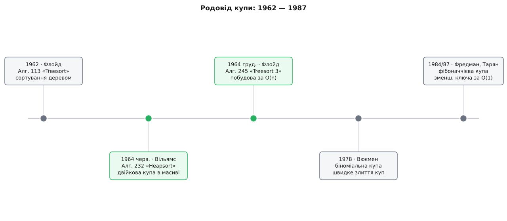
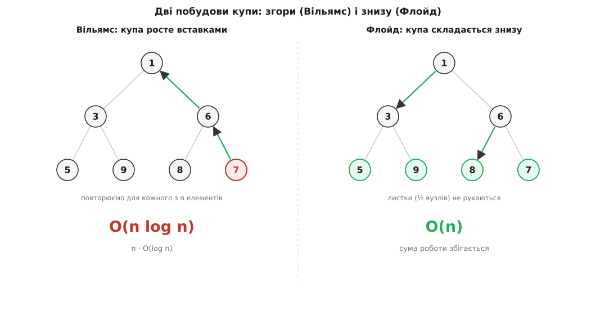

# 📜 Рік, коли купа народилася двічі

> За один-єдиний 1964 рік купа з'явилася на світ двічі — двома людьми, з двох боків океану, у двох номерах того самого журналу. Спершу англієць **Джон Вільямс** дав структуру й показав, як нею сортувати на місці; за півроку американець **Роберт Флойд** додав удвічі дешевший спосіб її будувати. Ні той, ні той не знав, що винаходить одну з найдовговічніших структур в інформатиці. І майже ніхто не помітив ще однієї дивовижі: купу зібрали в тій самій лабораторії, де за кілька столів працював автор швидкого сортування.

Кожна деталь тут щось важить, тож розкажемо по порядку.

## Задача, з якої все почалося

Щоб зрозуміти, навіщо взагалі знадобилася купа, треба відчути, яким тісним був початок 1960-х. Пам'ять машини мірялася не гігабайтами, а кількома тисячами слів; зайвий масив на n елементів був розкішшю, яку не завжди можна собі дозволити. Тому сортування хотіли робити **на місці** — переставляючи елементи в тому самому масиві, без другої копії.

Швидкі методи вже існували, але кожен мав ваду. Швидке сортування Гоара (англ. *C. A. R. Hoare*) літало в середньому, та в найгіршому випадку зривалося в O(n²) і тримало стан у стеку рекурсії. Сортування злиттям давало надійні O(n log n), але просило додатковий масив завбільшки з вхідні дані. Бракувало методу, який поєднав би все одразу: гарантовані O(n log n) навіть у найгіршому разі, на місці, без рекурсії.

І була ще одна, зовсім інша потреба — не впорядкувати все, а раз по раз брати найважливіше з мінливого набору. Так поводиться симулятор подій: він тримає майбутні події й щоразу мусить дістати найближчу за часом, а між тим підкидає нові. Обидві задачі — «упорядкуй усе» і «дай наступне найменше» — виявилися двома боками однієї монети. Людина, що це побачила, працювала в лондонській фірмі Elliott Brothers.



*Хронологія родоводу. Двійкова купа народилася у два ходи 1964-го (виділено): структура Вільямса й дешева побудова Флойда. Пізніші родички — біноміальна й фібоначчієва купи — розширили її можливості, але не витіснили.*

## Джон Вільямс і машина, що прокручувала майбутнє

Джон Вільям Джозеф «Білл» Вільямс (англ. *John William Joseph "Bill" Williams*, 1930–2012) народився в англійському містечку Чіппенгем (англ. *Chippenham*) у графстві Вілтшир. Він був програмістом Elliott Brothers (London) — фірми, що будувала обчислювальні машини, — і саме там, близько 1963 року, придумав купу.

Що робить цю історію особливою: Вільямс винайшов купу не як самоціль, а щоб змусити працювати **симулятор подій** — пакет ESP (Elliott Simulator Package), який моделював системи, прокручуючи їхні майбутні події в часі. Такому симуляторові потрібна структура, що завжди віддає найближчу подію й легко приймає нові, — тобто **черга з пріоритетом**. І та сама структура, як виявилося, чудово сортує. Купа з'явилася одразу з двома обличчями: як двигун сортування і як черга з пріоритетом — і обидва лишилися при ній назавжди.

Ще пікантніше сусідство. Допомагав Вільямсові з тим симулятором **Тоні Гоар** (англ. *C. A. R. "Tony" Hoare*) — той самий, хто кількома роками раніше винайшов швидке сортування. Виходить, у стінах однієї фірми на початку 1960-х народилися **два** класичні алгоритми сортування нараз, і їхні автори сиділи поруч.

> 🔧 **Навіщо це.** Купу винайшов не теоретик, а інженер, якому треба було, щоб конкретна програма-симулятор працювала швидко в тісній пам'яті. Це видно в самій структурі: вона не про красиві властивості дерев заради краси, а про те, як за один щільний масив дати машині і сортування, і чергу подій. Коли ти пишеш планувальник задач чи рушій симуляції, ти в тій самій ролі, що й Вільямс, — і найкращі структури часто родяться саме з такої приземленої потреби, а не з абстракції.

## Algorithm 232: дерево, якого немає

Свій винахід Вільямс оприлюднив як **«Algorithm 232: Heapsort»** — коротку нотатку в журналі Communications of the ACM, том 7, випуск 6, сторінки 347–348, за червень 1964 року (рукопис редакція отримала ще 1 жовтня 1963-го). Від слова *heap* — «стос, накидана купа» — і закріпилося ім'я структури.

Ідея, яку він там описав, тримається на двох спостереженнях. Перше: повне двійкове дерево можна скласти в звичайний масив без жодного вказівника — діти вузла i лежать за індексами 2i+1 і 2i+2, батько — за (i−1)/2. Дерево існує лише в арифметиці індексів, у пам'яті ж лежить щільний масив. Друге: якщо тримати слабку умову «батько не більший за дітей», то найменший (а для сортування — навпаки, найбільший) елемент завжди сидить у корені, а полагодити структуру після зміни можна, пройшовши лише один шлях від кореня до листа — за O(log n).

Звідси й сортування. Побудуй із масиву max-купу, а тоді n разів забери корінь-максимум, щоразу відновлюючи купу; максимуми виходять у спадному порядку — і всі переставляння вміщаються в тому самому масиві. Жодної другої копії, жодної рекурсії, і O(n log n) навіть у найгіршому випадку. Рівно те, чого бракувало — тому саме heapsort і став класичним прикладом сортування, на яке можна покластися там, де найгірший випадок недопустимий. [Повний сучасний розбір самого сортування](root:sf-algorithms/heapsort) — окрема тема; тут важить, що воно народилося саме звідси.

Була, щоправда, одна незграбність. Вільямс будував купу **згори**: брав елементи по одному й кожен «просіював угору» на його місце, точнісінько як у чергу з пріоритетом. Це n вставок, кожна до O(log n), разом O(n log n). Купа виходила правильна, але спосіб її скласти був не найдешевший. Тут і з'являється друга дійова особа.

Варто додати: сам термін «черга з пріоритетом» і струнку теорію навколо купи виклав трохи згодом **Дональд Кнут** (англ. *Donald E. Knuth*) у третьому томі «Мистецтва програмування» (1973), де й закріпив за Вільямсом авторство. Вони навіть разом придумали двобічний варіант — «пріоритетний дек», що вміє віддавати і найменше, і найбільше. Але сама структура вже жила й працювала за дев'ять років до того, як дістала свою назву в підручнику.

## Роберт Флойд і купа, зібрана знизу

Роберт В. Флойд (англ. *Robert W Floyd*, 1936–2001) — американець, одна з найяскравіших постатей ранньої інформатики: лауреат премії Тюрінга 1978 року за внесок у теорію розбору, семантику мов програмування й аналіз алгоритмів. Показова деталь: докторського ступеня він не мав — був здебільшого самоуком, а згодом став професором Стенфорда. Саме такий розум і помітив, що купу можна складати вдвічі розумніше.

Флойд опублікував своє покращення як **«Algorithm 245: Treesort 3»** — CACM, том 7, випуск 12, сторінка 701, грудень 1964 року, у тому самому річному томі, що й Вільямсова нотатка. Дивна назва «Treesort 3» має пояснення: це був третій у низці алгоритмів «сортування деревом», що друкувалися в рубриці алгоритмів того журналу, а найпершу з них, **«Algorithm 113: Treesort»**, Флойд подав ще в серпні 1962-го. Тобто Флойд ішов до купи своєю стежкою — від сортувань деревом — і зустрівся з Вільямсовою купою на пів дороги.

Його внесок — **побудова знизу вгору**. Замість вставляти елементи по одному, кинь усі n у масив як є (це вже «дерево», просто поки без порядку) і пройди «просіюванням униз» кожен внутрішній вузол, з кінця до початку — від останнього батька до кореня. Виходить правильна купа, і коштує це, всупереч інтуїції, лише **O(n)**, а не O(n log n). Саме цією формою — Вільямсова структура плюс Флойдова побудова — користуються й сьогодні, майже незмінно.

## Чому знизу — дешевше

Дешевизна Флойдового способу спершу здається неможливою: як зібрати впорядковану структуру за менший час, ніж O(n log n)? Секрет — у тому, **де** в дереві сидить більшість вузлів.

Просіювання вниз коштує тим більше, чим вузол вищий: з кореня елемент може падати через усі log n рівнів, а от листок не падає нікуди. А тепер порахуй, скільки вузлів на якій висоті. У повному дереві **половина** всіх вузлів — це листки, **чверть** — на рівень вище, **восьма частина** — ще вище, і так далі. Дорогих вузлів угорі — одиниці, а майже вся маса тулиться біля дна, де падати нема куди:

```
½ вузлів — листки:   0 роботи
¼ вузлів:            ≤ 1 крок
⅛ вузлів:            ≤ 2 кроки
…
разом  ≈  n · (¼·1 + ⅛·2 + …)  →  збігається до сталої  →  O(n)
```

Вільямсова побудова згори робила протилежну ставку. Вона просіювала **вгору**, а там вартість вузла тим більша, чим він **нижчий**, — тобто саме там, де вузлів найбільше. Тому та сума не збігається, і виходить O(n log n). Той самий масив, той самий кінцевий результат — а ціна різниться в рази лише через **напрямок**, у якому лагодимо структуру.



*Ті самі елементи, дві стратегії. Ліворуч (Вільямс) кожен новачок спливає вгору — дорого там, де вузлів багато. Праворуч (Флойд) працюють лише внутрішні вузли, а половина-листки не роблять нічого — тому сумарно O(n).*

> 🔧 **Навіщо це.** Це один із найчистіших уроків про алгоритми взагалі: два способи дати однаковий результат можуть коштувати по-різному не тому, що один «швидший код», а тому, що робота **інакше розподілена по структурі**. Флойд не пришвидшив жодної окремої операції — він лише поміняв порядок, у якому вони йдуть, і зібрав дешеві випадки там, де їх найбільше. Уміння побачити, «де сидить більшість роботи», відрізняє інженера від того, хто просто переписує цикл.

## Купа росте далі: біноміальна і фібоначчієва

Двійкова купа Вільямса й Флойда виявилася настільки вдалою, що чверть століття лишалася майже незмінною. Але два її обмеження штовхнули теоретиків шукати родичок. Перше: **злити** дві купи в одну коштує стільки ж, скільки побудувати заново. Друге: **зменшити ключ** — підвищити пріоритет елемента, що вже в купі, — коштує O(log n).

Першу проблему розв'язав француз **Жан Вюємен** (фр. *Jean Vuillemin*, 1947–2026): 1978 року в CACM (том 21, випуск 4, сторінки 309–315) він описав **біноміальну купу** — колекцію дерев строго визначених розмірів (степенів двійки), які зливаються між собою, мов додавання двійкових чисел із переносами. Дві купи стають однією за O(log n), а не за час повної перебудови.

Другу — і заразом майже всі інші оцінки — атакували американці **Майкл Фредман** і **Роберт Тарян** (англ. *Michael L. Fredman*, *Robert Endre Tarjan*). Їхня **фібоначчієва купа** (доповідь на симпозіумі FOCS 1984 року, повна стаття — Journal of the ACM, том 34, випуск 3, сторінки 596–615, 1987) відкладає всю зайву роботу «на потім» і завдяки цьому дає зменшення ключа за O(1) в [амортизованому](root:computability/amortized-analysis) сенсі — усереднено по багатьох операціях. Теоретично це прискорює алгоритм Дейкстри до O(E + V·log V) — і донині це найкраща відома для нього межа. На практиці, щоправда, за фібоначчієвою купою тягнеться такий шлейф великих сталих накладних, що проста двійкова купа Вільямса найчастіше її обганяє. [Ширший розбір фібоначчієвої купи](root:sf-algorithms/fibonacci-heap) — окрема тема.

## Що лишилося

Дивовижно, як мало змінилося за пів століття. Структура, яку Вільямс склав для симулятора подій, а Флойд навчив дешево будувати, і сьогодні лежить в основі планувальників задач, черг подій, пошуку найкоротших шляхів, [кодування Гаффмана](root:math-information/huffman-coding). Пізніші, теоретично «кращі» купи існують, але в реальному коді проста двійкова купа перемагає саме тим, чим була від народження: кілька рядків, щільний масив, дружба з кешем процесора.

Обидва обличчя, з якими купа з'явилася 1964-го, теж лишилися при ній. Як двигун сортування вона дає heapsort; як черга з пріоритетом — серце Дейкстри, A* і рушіїв подій. Двоє людей за один рік, самі того не відаючи, дали інформатиці структуру, яку майже не довелося покращувати. Статус цієї історії — усталений: дати, імена й авторство підтверджені первісними публікаціями в Communications of the ACM.
