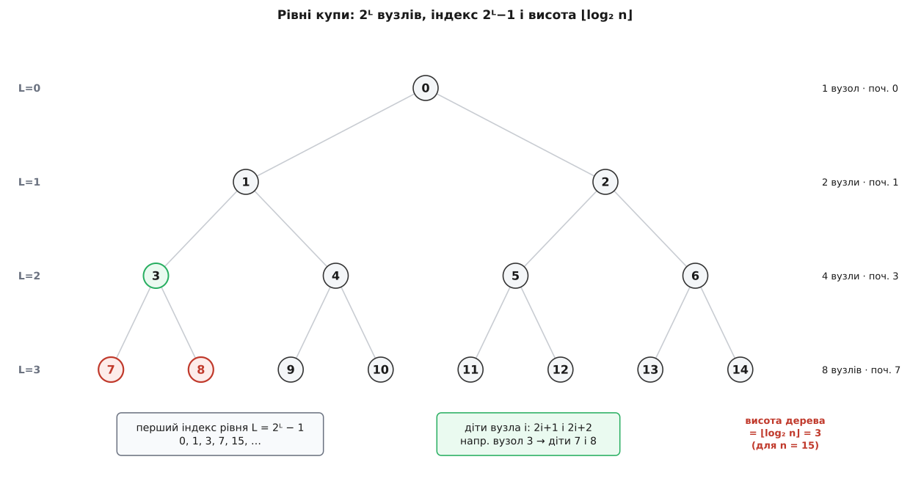
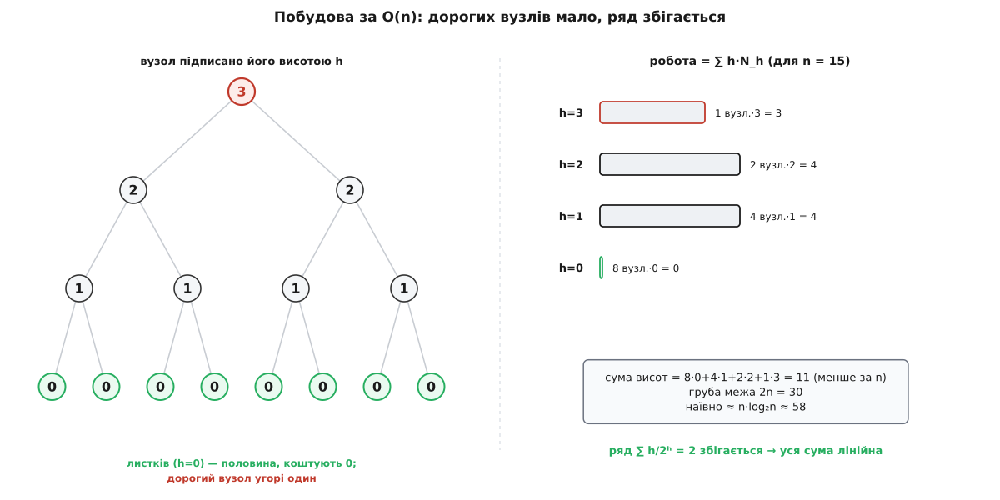
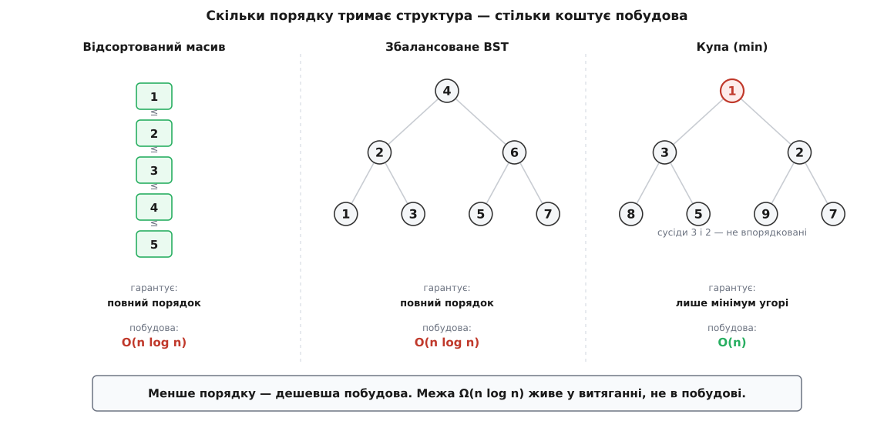

# 🧮 Математика купи: висота, індекси і диво лінійної побудови

Купа тримається на трьох числах. Перше — **висота** ⌊log₂ n⌋: рівно стільки кроків робить елемент, спливаючи чи тонучи, і саме воно перетворює вставку й вилучення на O(log n). Друге — три формули індексів **2i+1**, **2i+2**, **⌊(i−1)/2⌋**, якими масив прикидається деревом без жодного вказівника. Третє, найдивовижніше — те, що зібрати купу з n готових елементів коштує лише **O(n)**, а не O(n log n), хоч кожна окрема вставка й логарифмічна.

Усі три випливають з одного-єдиного факту про повне двійкове дерево — з того, скільки вузлів поміщається на рівні. Розкрутимо цей факт до кінця й побачимо, звідки береться кожне з трьох чисел і чому останнє з них не суперечить, а витончено обходить фундаментальну межу.

## Один факт: на рівні L рівно 2ᴸ вузлів

Занумеруймо рівні від кореня: корінь — рівень 0, його діти — рівень 1, їхні діти — рівень 2. Кожен вузол має двох дітей, тож із рівня на рівень кількість вузлів подвоюється: 1, 2, 4, 8, … На рівні L, коли він заповнений, стоїть рівно **2ᴸ** вузлів.

Скільки ж вузлів у цілому дереві заввишки h (тобто з рівнями від 0 до h включно)? Це сума

```
1 + 2 + 4 + … + 2ʰ
```

Її можна взяти в лоб знайомим трюком подвоєння. Нехай G — ця сума. Помнож усе на 2 — кожен доданок стрибне на наступний:

```
 G = 1 + 2 + 4 + … + 2ʰ
2G =     2 + 4 + … + 2ʰ + 2ʰ⁺¹
2G − G = 2ʰ⁺¹ − 1
```

Отже

```
1 + 2 + 4 + … + 2ʰ  =  2ʰ⁺¹ − 1
```

Повне дерево заввишки h вміщає **2ʰ⁺¹ − 1** вузлів. Це і є той важіль, яким ми зараз піднімемо всі три числа.

> 🔧 **Навіщо це.** Подвоєння на кожному рівні — причина, чому купа така «плеската». Щоб укласти мільйон вузлів, треба лише двадцять рівнів (2²⁰ ≈ 10⁶). Уся вартість операцій міряється кількістю рівнів, а не кількістю вузлів, — тому мільйон елементів обходиться в жалюгідні двадцять кроків. Ось де ховається сила логарифма.

## Висота повного дерева — це ⌊log₂ n⌋

Тепер оберни питання. Не «скільки вузлів у дереві заввишки h», а «якої висоти дерево з n вузлів». Повне дерево заповнює рівні один за одним зліва направо. Поки заповнені рівні 0…h−1, у ньому 2ʰ − 1 вузлів. Щойно з'являється перший вузол на рівні h, лічильник переходить за цю межу. Останній вузол, який ще вміщається на рівні h, доводить суму до 2ʰ⁺¹ − 1. Отже, дерево має найглибший рівень саме h тоді і тільки тоді, коли

```
2ʰ ≤ n ≤ 2ʰ⁺¹ − 1
```

Візьми log₂ від лівої нерівності: h ≤ log₂ n. Від правої: log₂ n < h+1. Разом — h ≤ log₂ n < h+1, а це рівно означення цілої частини:

```
висота h = ⌊log₂ n⌋
```

Квадратні дужки ⌊ ⌋ — це «підлога», найбільше ціле, що не перевищує числа: ⌊3.7⌋ = 3. Висота не може бути дробовою — рівнів завжди ціле число, — і log₂ n, обрізаний донизу, дає точну відповідь.

**Умова: скільки рівнів у купах різного розміру.**

```
n = 7:    2² = 4 ≤ 7 ≤ 7 = 2³−1   →  h = ⌊log₂ 7⌋ = ⌊2.807⌋ = 2
n = 8:    2³ = 8 ≤ 8 ≤ 15 = 2⁴−1  →  h = ⌊log₂ 8⌋ = 3   (восьмий вузол відкрив новий рівень)
n = 1000: 2⁹ = 512 ≤ 1000 ≤ 1023  →  h = ⌊log₂ 1000⌋ = 9
```

Один зайвий вузол — восьмий — коштує цілого нового рівня: висота стрибнула з 2 на 3. Далі знову довга поличка сталості: від 8 до 15 вузлів висота не міняється. Логарифм росте сходинками, і кожна сходинка вдвічі довша за попередню.



*Рівень L несе 2ᴸ вузлів і починається з індексу 2ᴸ−1. Висота — це номер найглибшого рівня, ⌊log₂ n⌋; підсвічено вузол 3 та його дітей 7 і 8, щоб видно було індексну арифметику.*

Звідси й береться [O(log n)](root:computability/asymptotic-complexity) для вставки й вилучення. Просіювання вгору йде від листа до кореня — це шлях завдовжки щонайбільше у висоту дерева, тобто ⌊log₂ n⌋ обмінів. Просіювання вниз іде від кореня до листа — знову не більше висоти. Обидві операції торкаються **однієї гілки**, а гілка коротка саме тому, що дерево пласке.

## Індекси без вказівників: звідки 2i+1, 2i+2 і ⌊(i−1)/2⌋

Тепер друге число — вірніше, три формули, якими плаский масив грає роль дерева. Вони не наближені й не асимптотичні: це точне перетворення координат. Занумеруймо вузли підряд, рівень за рівнем, зліва направо, від 0.

Ключ ми вже маємо: рівні 0…L−1 містять 2ᴸ − 1 вузлів. Отже, **перший вузол рівня L має індекс 2ᴸ − 1** (0, 1, 3, 7, 15, …). Вузол, що стоїть на рівні L у позиції p (рахуючи від 0 у межах рівня), має індекс

```
i = (2ᴸ − 1) + p
```

Його лівий нащадок живе на наступному рівні L+1. Позиція теж передбачувана: у межах свого рівня діти займають позиції 2p та 2p+1 — бо кожен із p попередніх вузлів рівня L дав рівно двох дітей ліворуч. Тож індекс лівої дитини:

```
лівий = (2ᴸ⁺¹ − 1) + 2p
      = 2·2ᴸ − 1 + 2p
      = 2·(2ᴸ − 1) + 1 + 2p
      = 2·((2ᴸ − 1) + p) + 1
      = 2i + 1
```

Права дитина — сусідня комірка, тому **2i + 2**. Батька дістанемо, обернувши це: якщо i = 2·par + 1 або i = 2·par + 2, то в обох випадках

```
батько = ⌊(i − 1) / 2⌋
```

Перевір на вузлі 3: діти 2·3+1 = 7 і 2·3+2 = 8; а батько сімки — ⌊(7−1)/2⌋ = 3, батько вісімки — ⌊(8−1)/2⌋ = ⌊3.5⌋ = 3. Обоє показують на 3, як і має бути.

Є ще гарніший спосіб побачити це — через двійковий запис. Візьми i+1 у двійковій системі. Провідна одиниця — це корінь; кожен наступний біт — крок униз: 0 — ліворуч, 1 — праворуч. Скажімо, i = 8, тоді i+1 = 9 = 1001₂. Відкидаємо провідну 1, лишається «001» — ліворуч, ліворуч, праворуч:

```
корінь(0) ──ліво──► 1 ──ліво──► 3 ──право──► 8
```

І справді, шлях 0→1→3→8 веде до вісімки. А ще звідси миттєво випадає висота: кількість кроків від кореня — це кількість бітів після провідної одиниці, тобто ⌊log₂(i+1)⌋. Індекс і рівень — одне й те саме число, записане двома мовами. Приставити дитину — це дописати біт; піднятися до батька — стерти останній. Дерево виявляється просто геометрією двійкового запису індексу, і жодних `left`/`right`-вказівників у пам'яті не треба.

## Скільки саме коштує вставка й вилучення

«O(log n)» ховає в собі сталу, а вона для двох операцій різна — і це не дрібниця. Просіювання вгору на кожному кроці робить **одне** порівняння: новачок проти батька. Тож вставка коштує щонайбільше ⌊log₂ n⌋ порівнянь.

Просіювання вниз дорожче. На кожному рівні треба спершу знайти **меншу** з двох дітей (одне порівняння), а тоді порівняти елемент із нею (друге). Виходить до **двох** порівнянь на рівень:

```
вставка (просіювання вгору):    ≤ 1·⌊log₂ n⌋  порівнянь
вилучення (просіювання вниз):   ≤ 2·⌊log₂ n⌋  порівнянь
```

Обидві — O(log n), але вилучення тягне вдвічі більшу сталу. Ось чому в бібліотечних купах так часто крутять саме цю константу: варіант «спусти елемент до самого низу однією дитиною за крок, а потім підніми назад» (bottom-up, або схема Флойда) міняє 2 log n порівнянь на приблизно log n + сталу — виграш там, де порівняння дороге. `peek` же — просто читання кореня, жодного порівняння, чиста O(1).

## Головне диво: побудова за O(n)

Тепер найцікавіше. Треба скласти купу з n готових елементів. Найпряміше — n разів викликати вставку. Скільки це коштує в найгіршому разі?

Коли в купі вже k елементів, вставка може просіяти новачка на всю висоту — до ⌊log₂ k⌋ обмінів. Найгірше саме так і трапляється: якщо в min-купу подавати ключі спаданням, кожен новий — найменший, злітає аж до кореня. Сумарно:

```
∑ₖ₌₁ⁿ ⌊log₂ k⌋  =  ⌊log₂ 1⌋ + ⌊log₂ 2⌋ + … + ⌊log₂ n⌋
```

Ця сума — це майже log₂(n!), а за формулою Стірлінга log₂(n!) ≈ n·log₂ n − n·log₂ e ≈ n·log₂ n − 1.443·n. Головний член — **n·log₂ n**, тому наївна побудова коштує Θ(n log n). Це не примара сталої: це на цілий множник log n дорожче за те, що ми зараз здобудемо.

Кращий шлях знайшов [Роберт Флойд](https://dl.acm.org/doi/10.1145/355588.365103) ще 1964 року (Algorithm 245, «Treesort 3»): кинь усі n елементів у масив як є і **просій вниз** кожен внутрішній вузол, ідучи з кінця до початку — від індексу ⌊n/2⌋−1 (останнього, що має дітей) до 0. Листки чіпати не треба: їм тонути нікуди. Виходить купа, і коштує це, всупереч інтуїції, лише O(n).

Уся хитрість — у тому, чим міряти вартість. Просіювання вниз для вузла обмежене не його глибиною (відстанню до кореня), а його **висотою** — відстанню до найглибшого листа під ним. Бо тонути елемент може лише донизу, а під ним залишилось усього-на-всього h рівнів.

> 🔧 **Навіщо це.** Глибина й висота — дзеркальні, і саме тому наївний і Флойдів способи такі різні. Вставка платить за **глибину**: нові вузли сідають унизу, де глибина найбільша, тому дорогі. Побудова знизу-вгору платить за **висоту**: майже всі вузли — біля дна, де висота нульова або крихітна, тому дешеві. Одні й ті самі вузли, та сама структура — але міряні з іншого кінця вони коштують геть інше. Уся економія лінійної побудови захована в цій підміні.

А тепер порахуймо роботу. Скільки вузлів має висоту рівно h? Листків (h = 0) у купі ⌈n/2⌉ — приблизно половина. Вузлів висоти 1 — учетверо менше за все, і взагалі вузлів висоти h щонайбільше

```
N_h ≤ ⌈ n / 2ʰ⁺¹ ⌉
```

Кожен такий вузол коштує до h обмінів. Уся робота — це зважена сума «скільки вузлів × як глибоко кожен тоне»:

```
T(n)  =  ∑ₕ N_h · h  ≤  ∑ₕ (n / 2ʰ) · h  =  n · ∑ₕ h / 2ʰ
```

(тут ми ще послабили N_h до n/2ʰ — лише щоб отримати чисту формулу; справжня межа навіть менша). Усе тепер тримається на одному нескінченному ряді:

```
S  =  ∑ₕ₌₀^∞  h / 2ʰ  =  0/1 + 1/2 + 2/4 + 3/8 + 4/16 + …
```

Виглядає страшно, але знову рятує трюк подвоєння. Випишемо S і його половину S/2 із зсувом на один доданок і віднімемо:

```
 S   = 1/2 + 2/4 + 3/8 + 4/16 + …
 S/2 =       1/4 + 2/8 + 3/16 + …
 ─────────────────────────────────
S − S/2 = 1/2 + 1/4 + 1/8 + 1/16 + …
```

Праворуч — звичайна геометрична сума ½ + ¼ + ⅛ + … = 1. Отже S/2 = 1, і

```
∑ₕ₌₀^∞  h / 2ʰ  =  2
```

(Хто любить аналіз, той дістане те саме, продиференціювавши геометричний ряд ∑ xʰ = 1/(1−x): вийде ∑ h·xʰ = x/(1−x)², а при x = ½ це (½)/(¼) = 2. Той самий результат, інша стежка.)

Ряд збігається — доданки h/2ʰ спадають так стрімко, що навіть помножені на зростаюче h дають скінченну суму 2. Підставмо назад:

```
T(n)  ≤  n · ∑ₕ h/2ʰ  =  n · 2  =  2n  =  O(n)
```

Ось воно. Побудова знизу-вгору коштує лінійно. Не тому, що вузли дешеві — а тому, що дорогих вузлів **мало**: рівно половина взагалі безкоштовна (листки), чверть — по одному кроку, і одиниці найдорожчих угорі не встигають зіпсувати суму. Ряд збігається — і разом із ним збігається вся вартість.



*Для n = 15: висоти дають 8·0 + 4·1 + 2·2 + 1·3 = 11 обмінів — менше за n. Груба межа 2n = 30 їх покриває із запасом, а наївні 15 вставок коштували б до ≈58. Уся вага — біля вершини, а вершина одна.*

Можна порахувати навіть точно. Сума висот усіх вузлів повного дерева з n вузлів дорівнює **n − s₂(n)**, де s₂(n) — кількість одиниць у двійковому записі n. Для n = 15 = 1111₂ це 15 − 4 = 11 — рівно те, що ми щойно склали руками. Оскільки s₂(n) ≥ 1, сума висот завжди строго менша за n, тож насправді Флойдова побудова робить **менше за n обмінів**. Груба межа 2n і точні «менше за n» — обидві лінійні; різниця лише в сталій.

## Чому O(n)-побудова не ламає межу Ω(n log n)

Тут читач, знайомий із сортуванням, має відчути протест. Адже сортування порівняннями має доведену нижню межу **Ω(n log n)**: жоден алгоритм, що спирається лише на порівняння, не впорядкує n елементів швидше. Як же купа будується за O(n)?

Відповідь — у тому, що **купа не відсортована**. Лінійна межа Ω(n log n) стосується повного порядку: щоб вишикувати всі n елементів у ряд, треба розрізнити n! можливих перестановок, а це log₂(n!) ≈ n log₂ n двійкових рішень. Купа ж не розрізняє їх усіх. Вона гарантує лише одне: у корені — мінімум. Брати-сусіди між собою не впорядковані, лівий листок однієї гілки може бути будь-як розташований щодо правого діда іншої. Купа несе набагато менше інформації про порядок, ніж відсортований масив, — і саме тому її можна злагодити дешевше.

Найкраще це видно на сортуванні купою: воно складається рівно з двох фаз — побудова за O(n), а потім n витягань мінімуму, кожне по O(log n), разом O(n log n). Уся неминуча Ω(n log n)-робота живе у **витяганні**, не в побудові. Побудова безкоштовно (лінійно) доводить хаос до слабкого купного порядку; а от перетворити цей слабкий порядок на повний — ось де доводиться платити логарифм за кожен елемент. Лінійна побудова не обходить межу — вона просто зупиняється, не дійшовши до повного порядку, якраз на тій межі корисності, яка й потрібна черзі з пріоритетом.

## Зменшення ключа за O(log n)

Купа вміє ще одне: **зменшити ключ** уже наявного елемента — підвищити його пріоритет. Математично це просто. Коли значення вузла зменшується, воно може стати меншим за батька, але дітям воно й поготів менше — властивість купи вниз не псується, лише вгору. Тож досить одного просіювання вгору з позиції цього вузла:

```
зменшення ключа  =  просіювання вгору  ≤  ⌊log₂ n⌋  порівнянь  =  O(log n)
```

Дзеркальна операція — збільшити ключ — псує порядок донизу, тому лікується просіюванням униз, теж O(log n).

Одна тонкість — не в кількості кроків, а в тому, що треба **знати, де вузол лежить**. Пошук елемента в купі — це O(n) (частковий порядок не допомагає шукати конкретне значення). Тому поряд тримають карту «елемент → його індекс» і оновлюють її при кожному обміні. Обмін і так робиться — додати до нього оновлення двох записів карти коштує O(1), тож асимптотика просіювання не міняється. Саме на це швидке зменшення ключа спирається пошук найкоротших шляхів, коли послаблює оцінки відстаней: кожне послаблення — одне O(log n)-просіювання.

## Купа проти відсортованого масиву і BST: скільки порядку варте скільки

Тепер видно всю картину — і чому купа виграє саме балансом. Порівняймо три способи тримати колекцію, з якої треба брати мінімум:

```
                       відсорт.      збалансоване     купа
                       масив         BST
знайти мінімум         O(1)          O(log n)*        O(1)
вставити               O(n)          O(log n)         O(log n)
вилучити мінімум       O(1)/O(n)     O(log n)         O(log n)
побудувати з n         O(n log n)    O(n log n)       O(n)
гарантований порядок   повний        повний           лише мінімум угорі
                                     (* O(1) з кешем найлівішого)
```

Відсортований масив знає забагато: повний порядок. Тому мінімум у нього безкоштовний, але вставити елемент — це зсунути півмасиву, O(n), а зібрати з нуля — це відсортувати, O(n log n). [Збалансоване двійкове дерево пошуку](root:sf-algorithms/binary-search-tree) теж тримає повний порядок (обхід у порядку зростання дає відсортований ряд), лікує вставку до O(log n), але платить за це вузлами, вказівниками й стрибками по розкиданій пам'яті — велика стала й вороже до кешу; і побудова з невідсортованих даних — знову O(n log n).

Купа тримає рівно **той мінімум порядку**, який потрібен для «дай найменший», — і ця скупість окупається двічі. По-перше, оновлення торкається однієї короткої гілки, тому вставка й вилучення дешеві. По-друге — і це головне — саме тому, що повного порядку немає, побудову вдається зробити лінійною, чого жодна повністю впорядкована структура принципово не може. Менше знань — дешевше все.



*Що більше порядку структура зобов'язується тримати, то дорожча її побудова. Купа зупиняється на найслабшому корисному порядку — «мінімум угорі» — і лише вона будується за лінію.*

## Амортизований погляд на побудову

На лінійну побудову корисно глянути ще й очима [амортизованого аналізу](root:computability/amortized-analysis). Окреме просіювання вниз усередині Флойдового проходу може коштувати аж O(log n) — для вузлів угорі. Якби ми оцінювали кожен крок його найгіршою ціною, вийшло б n·O(log n) = O(n log n), і диво зникло б.

Але сумарний, агрегатний облік показує інше: уся послідовність із n просіювань разом коштує не більше за 2n, тобто **O(1) у середньому на елемент**. Дорогі кроки рідкісні (вузлів угорі одиниці), дешеві — численні (листків половина), і в сумі дорогі тонуть у дешевих. Це класичний агрегатний метод: не бійся окремого дорогого кроку, якщо їх мало, а решта — майже безкоштовні. Та сама логіка, що виправдовує подвоєння місткості динамічного масиву, тут перетворює купу з хаосу на лад за лінію.

## Три числа, одне джерело

Зведімо. Купа стоїть на трьох величинах, і всі три ми вивели з одного факту — «на рівні L рівно 2ᴸ вузлів»:

```
висота дерева           ⌊log₂ n⌋        →  вставка/вилучення за O(log n)
індекси                 2i+1, 2i+2,     →  дерево в масиві без вказівників
                        ⌊(i−1)/2⌋
побудова знизу-вгору     ∑ h/2ʰ = 2      →  зібрати n елементів за O(n)
```

Перше число робить операції логарифмічними, бо гілка коротка. Друге стирає вказівники, бо повне дерево — це просто двійковий запис індексу. Третє, найтонше, дарує лінійну побудову — бо вартість міряється висотою, а майже вся маса вузлів сидить біля самого дна, де висота нульова, і зважений ряд збігається до скінченного числа. Купа бере від порядку рівно стільки, скільки треба, щоб вершина завжди була мінімумом, — і математика показує, що ця скупість оплачується найдешевше з усіх можливих.
