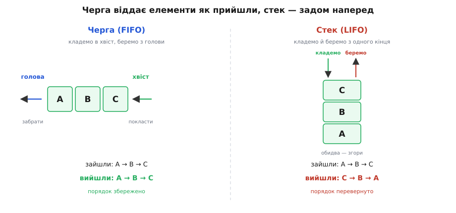
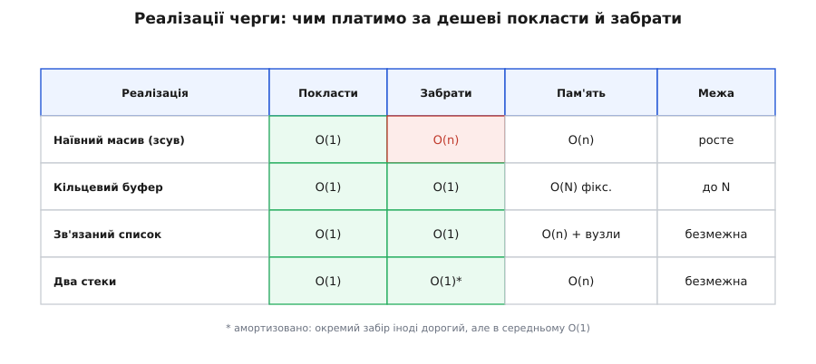
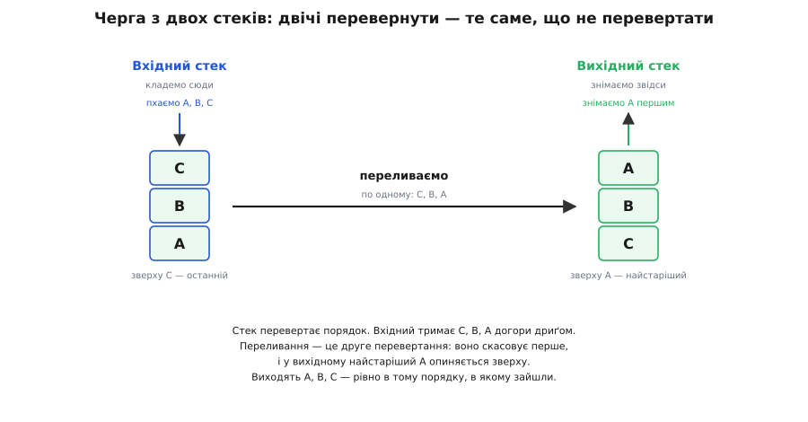

# Черга: FIFO і кільцевий буфер

<preknowlist>
- [Пам'ять як масив](root:hw-arch/memory-as-array) — масив як суцільна ділянка комірок фіксованого розміру; доступ до будь-якої за індексом коштує сталий час.
- [Стек](root:sf-lang/stack-lifo) — протилежна дисципліна «останній прийшов — перший вийшов»; чергу найлегше зрозуміти саме навпроти неї.
- [Асимптотична складність (O великого)](root:computability/asymptotic-complexity) — як міряють вартість операції: O(1) — сталий час незалежно від розміру, O(n) — час, що росте з кількістю елементів.
</preknowlist>

Стань у чергу за квитком — і ти вже знаєш про цю структуру даних усе головне. Хто підійшов першим, того першим і обслужать; хто щойно став — чекає в хвості, доки перед ним не розсмокчеться. Ніхто по-чесному не лізе всередину, ніхто не висмикує людину з середини ряду. Уся ця домовленість зводиться до одного правила: **перший прийшов — перший вийшов**. Англійською його скорочують до **FIFO** (*first in, first out*), і це, власне, друга назва черги.

Чому програмі так часто треба саме такий порядок? Бо в ній раз у раз стикаються двоє, що працюють у різному темпі. Мережева карта приймає пакети тоді, коли їх шле інша сторона; програма розбирає їх, коли встигає. Користувач натискає клавіші швидкими сплесками; редактор обробляє натиски по одному. Веб-сервер отримує запити нерівно, юрбою; робітники виконують їх статечно, скільки подужають. Щоразу між швидшою й повільнішою стороною потрібна проміжна комора — місце, куди одна складає, а друга розбирає, кожна у своєму ритмі. І майже завжди важить, щоб події не переплуталися: натиски клавіш, що прийшли в одному порядку, мусять і оброблятися в тому ж; пакети, кадри, транзакції — так само. Комора, що зберігає порядок надходження, і є черга.

## Два кінці й чотири дії

Черга має **два кінці**, і в цьому вся її суть. В один кінець — **хвіст** (англ. *tail*, *rear*) — тільки додають. З іншого — **голови** (англ. *head*, *front*) — тільки забирають. Новачок стає позаду всіх; обслуговують завжди того, хто попереду. Голова й хвіст рухаються в одному напрямку, наздоганяючи один одного, і саме через те, що кладуть і беруть із **різних** кінців, зберігається порядок.

Дій, по суті, лише чотири:

- **покласти** (англ. *enqueue*) — додати елемент у хвіст;
- **забрати** (англ. *dequeue*) — зняти елемент із голови й повернути його;
- **зазирнути** (англ. *peek*) — глянути, хто стоїть у голові, не забираючи;
- **порожня?** — спитати, чи є в черзі бодай хтось.

Це вичерпний перелік. Черга навмисне **не** дозволяє дістатися до п'ятого елемента з кінця чи вставити щось у середину — не тому, що не вміє, а тому, що така обмеженість і є її обіцянка. Структуру, яка дає рівно ці операції й нічого зайвого, називають **абстрактним типом даних**: нас цікавить, що вона робить (кладеш у хвіст — береш із голови в тому ж порядку), а не як саме вона це робить усередині. Реалізацій під цією обіцянкою — кілька, і вони разюче різні між собою.

Найясніше сенс черги видно поряд зі стеком (англ. *stack* — стос, стопка). Стек — теж «поклав/забрав», але кладе й бере він **з одного кінця**, як стос тарілок: остання покладена тарілка знімається першою. Це протилежна дисципліна — **LIFO**, «останній прийшов — перший вийшов». Черга зберігає порядок, стек його **перевертає**. Одна різниця — з якого кінця забирати — розводить дві структури на протилежні поведінки.


*Ті самі три елементи A, B, C заходять в обидві структури в одному порядку. Черга віддає їх A, B, C — як прийшли. Стек віддає C, B, A — задом наперед. Уся різниця в тому, з якого кінця забирають: черга бере з протилежного тому, куди кладе, стек — з того самого.*

> 🔧 **Навіщо це.** Черга — це стандартний спосіб розв'язати найпоширенішу задачу в системах: з'єднати дві частини, що біжать із різною швидкістю, не загубивши й не переплутавши подій. Драйвери, звукові й мережеві конвеєри, черги задач у веб-серверах, черги повідомлень між сервісами, обхід графів, планувальник операційної системи — усе це тримається на FIFO. Щойно бачиш «події треба обробити по черзі, у порядку надходження» — за цим стоїть саме вона.

**Приклад (порядок зберігається).** Покладемо в порожню чергу три задачі — A, B, C — і заберемо три:

```
enqueue(A)     черга: [A]          голова → A,  хвіст → A
enqueue(B)     черга: [A, B]       голова → A,  хвіст → B
enqueue(C)     черга: [A, B, C]    голова → A,  хвіст → C
dequeue() → A  черга: [B, C]       голова → B
dequeue() → B  черга: [C]          голова → C
dequeue() → C  черга: []           голова → ∅,  хвіст → ∅
```

Вийшли рівно в тому порядку, в якому зайшли. Черга нічого не переставляє — вона лише пам'ятає послідовність. Уся хитрість не в цьому очевидному правилі, а в тому, як зробити обидві операції **дешевими**: щоб і покласти, і забрати коштувало сталий час, скільки б у черзі не назбиралося елементів.

## Чому наївний масив не годиться

Перша думка — покласти чергу в масив: додаємо в кінець, беремо з початку. Додати в кінець просто й швидко. А от узяти з початку — халепа. Якщо забирати завжди елемент з індексом 0, то решту доводиться **зсувати** на одну позицію ліворуч, щоб заповнити дірку. А зсунути n елементів — це n дій, тобто O(n) роботи на кожен-єдиний `dequeue`. Черга з мільйона елементів робила б мільйон рухів, аби віддати одну задачу. Безглуздо дорого.

Можна не зсувати, а просто рухати індекс голови вперед — лишати дірку на початку й читати далі. Тоді забір дешевий, але зайнята ділянка невпинно **повзе** масивом управо і швидко впирається в його кінець, хоча на початку давно порожньо. Масив ніби скінчився, а насправді майже весь вільний.

Обидві біди — від того, що ми тримаємося за фізичний початок масиву як за голову черги. Варто відв'язатися від нього — і кожна з бід зникає по-своєму. Звідси два різні класичні розв'язки.

## Дві головні реалізації

**Кільце по фіксованому масиву.** Якщо погодитися, що в черзі одночасно лежить не більше N елементів, з'являється нахабно проста ідея: не повзти масивом уперед нескінченно, а **ходити по тих самих N комірках по колу**. Дійшли до кінця — вертаємося на початок, де давно все звільнено. Голову й хвіст тримаємо як два індекси, що кружляють у діапазоні 0…N−1: хвіст тікає вперед, коли кладемо, голова женеться за ним, коли беремо. Це **кільцевий буфер** (англ. *ring buffer*, він же *circular buffer*), і обидві його операції — кілька дій без жодного циклу, тобто **O(1) у найгіршому разі**. Пам'ять під нього виділяють один раз, наперед; на гарячому шляху — драйвери, переривання, звук — де виділяти пам'ять не можна, це вирішальна перевага. За неї доводиться платити межею: більше за N елементів кільце не вмістить. Уся механіка — як загортати індекси, як відрізнити повний буфер від порожнього, як обійтися без замків між двома потоками — розібрана окремо, у [кільцевому буфері](root:sf-algorithms/ring-buffer).

**Зв'язаний список.** Коли межу наперед задати не можна, а черга має рости, скільки треба, кожен елемент кладуть в окремий **вузол** (англ. *node*), і вузли зчіплюють у ланцюжок: кожен пам'ятає, хто за ним наступний. Тримаємо два покажчики — на голову ланцюжка (звідки забирати) і на хвіст (куди чіпляти новий). Покласти — причепити вузол за хвостом і пересунути покажчик хвоста. Забрати — зняти вузол із голови й пересунути покажчик голови. Кожна операція чіпає **лише кінець** ланцюжка, ніколи не проходить його весь, — тому теж **O(1) у найгіршому разі**, і жодного зсування чи перевиділення. Ціна інша: кожен елемент тягне за собою покажчик, а вузли розкидані по пам'яті вроздріб, тож проходи по них лягають у кеш гірше за суцільний масив.

Ось той самий зв'язаний список у коді. Уся хитрість — акуратно впоратися з межовими випадками: коли черга була порожня (тоді новий вузол стає й головою, і хвостом) і коли забираємо останній елемент (тоді треба обнулити й хвіст).

:::tabs
```py
class Node:
    def __init__(self, value):
        self.value = value
        self.next = None          # наступний вузол у ланцюжку

class Queue:
    def __init__(self):
        self.head = None          # звідки забирати (найстаріший)
        self.tail = None          # куди чіпляти (найновіший)
        self.size = 0

    def enqueue(self, value):     # покласти в хвіст
        node = Node(value)
        if self.tail is None:     # черга була порожня
            self.head = node
        else:
            self.tail.next = node
        self.tail = node
        self.size += 1

    def dequeue(self):            # забрати з голови
        if self.head is None:
            raise IndexError("черга порожня")
        node = self.head
        self.head = node.next
        if self.head is None:     # зняли останній — хвоста більше нема
            self.tail = None
        self.size -= 1
        return node.value
```
```ts
class Node<T> {
  next: Node<T> | null = null;   // наступний вузол у ланцюжку
  constructor(public value: T) {}
}

class Queue<T> {
  private head: Node<T> | null = null;  // звідки забирати
  private tail: Node<T> | null = null;  // куди чіпляти
  private size = 0;

  enqueue(value: T): void {      // покласти в хвіст
    const node = new Node(value);
    if (this.tail === null) this.head = node;   // була порожня
    else this.tail.next = node;
    this.tail = node;
    this.size++;
  }

  dequeue(): T {                 // забрати з голови
    if (this.head === null) throw new Error("черга порожня");
    const node = this.head;
    this.head = node.next;
    if (this.head === null) this.tail = null;   // зняли останній
    this.size--;
    return node.value;
  }
}
```
:::

На практиці стандартні бібліотеки рідко беруть чистий список — він марнує пам'ять на покажчики й дружить із кешем погано. Замість нього беруть **зрослий кільцевий буфер**: те саме кільце, але коли воно заповнюється, під нього виділяють більший масив і переносять уміст. Так влаштовані `collections.deque` у Python, `ArrayDeque` у Java, `std::deque` у C++ — вони поєднують сталу вартість операцій із суцільним розташуванням у пам'яті. Порівняймо всі підходи поруч:


*Наївний масив із зсувом програє на заборі: O(n) щоразу. Кільцевий буфер і зв'язаний список дають O(1) у найгіршому разі, але кільце обмежене N, а список — безмежний. Черга з двох стеків теж безмежна й дає O(1), але лише «в середньому» (амортизовано): окремий забір іноді дорогий, та впродовж багатьох операцій вартість вирівнюється.*

## Найелегантніший фокус: черга з двох стеків

Є ще один спосіб зробити чергу, і він варт уваги не практичністю, а красою думки. Ключова властивість стека — він **перевертає** порядок. Що станеться, якщо перевернути двічі? Порядок відновиться. На цьому й будується черга з **двох** стеків.

Тримаємо два стеки — назвімо їх «вхідний» і «вихідний». Коли **кладемо** елемент — просто пхаємо його у вхідний стек. Коли треба **забрати** — дивимося у вихідний. Якщо там щось є, знімаємо звідти (це вже правильний, FIFO-порядок). Якщо ж вихідний порожній — **переливаємо** в нього весь вхідний: по одному знімаємо з вхідного й кладемо у вихідний. Оскільки стек перевертає, а тут перевертання відбувається вдруге, елементи у вихідному лягають рівно в порядку надходження — найстаріший опиняється зверху й знімається першим.


*Кладемо A, B, C у вхідний стек — вони лягають догори дриґом (зверху C). Перше забирання застає вихідний порожнім, тож увесь вхідний переливається: C, B, A знімаються згори і лягають у вихідний, де тепер зверху опиняється A. Друге перевертання скасувало перше — з вихідного виходять A, B, C, у порядку надходження.*

На перший погляд переливання здається дорогим — цілий цикл по всіх елементах усередині начебто дешевої операції. Але придивімося: кожен елемент переливають **рівно один раз** — коли він мандрує з вхідного стека у вихідний. Більше його не чіпають, доки не заберуть. Отже, на кожен елемент за все його життя припадає стала кількість дій (поклали, перелили, зняли), навіть якщо ця робота розподілена нерівно — то дешеві операції, то раптом одна дорога. Таку «дешеву в середньому, хоча зрідка дорогу» вартість називають **амортизованою**: [амортизований аналіз](root:computability/amortized-analysis) якраз і показує, чому загальна вартість n операцій лишається O(n), а виходить, кожна — O(1) у перерахунку. Робочий код черги з двох стеків із покроковим розбором амортизації — у [проєкті-вставці](root:sf-algorithms/queue-fifo/proj-two-stack-queue.md).

Цей фокус — не просто цікавинка. У мовах, де дані незмінні й звичайного стека-масиву немає, а є лише однобічний список (а він і поводиться як стек), черга з двох таких списків — стандартний спосіб дістати ефективну FIFO. Дві прості структури, складені докупи, дають третю з новою поведінкою.

## Що робити, коли черга переповнилась

Безмежні черги приховують одне небезпечне припущення: що пам'ять не скінчиться. Якщо виробник стабільно швидший за споживача, безмежна черга не «згладжує сплеск», а тихо росте, доки не з'їсть усю пам'ять і не покладе програму. Тому в реальних системах чергу часто **обмежують** — і одразу постає питання: що робити, коли вона повна, а новий елемент уже несуть?

Чесних відповідей дві. Перша — **відмовити або змусити зачекати**: виробник не втискає елемент силою, а дістає відмову й пробує згодом або блокується, доки звільниться місце. Дані не губляться, зате виробник відчуває опір і мусить пригальмувати. Цей сигнал «повільніше», що йде вгору потоком, називають [протитиском](root:sf-tasks/backpressure). Друга — **затерти найстаріше**: новий елемент кладуть попри повноту, а найстаріший непрочитаний мовчки гине. Черга завжди тримає останні N значень і ніколи не блокує виробника; так поводяться з логами, телеметрією, звуком, де свіже важливіше за протухле. Саме на затиранні найстарішого стоїть, наприклад, [буфер джитера](root:com-signal/jitter-buffer) у відеозв'язку. Вибір між двома політиками не технічний, а змістовний: чи втрату видно й пробачити її не можна — тоді відмова; чи важить лише свіжість — тоді затирання.

## Де черги працюють

Зрозумівши, як черга влаштована й скільки коштує, легко впізнати її під безліччю облич.

Найперше — **буфер між виробником і споживачем**: усе, з чого почалася розмова. Драйвер складає прийняті байти в чергу, програма розбирає їх у своєму темпі; ця схема настільки типова, що має власну назву — [виробник-споживач](root:sf-tasks/producer-consumer). Коли ж дві сторони — це різні служби на різних машинах, буфер між ними виростає в окрему систему: [чергу повідомлень](root:sf-distributed/message-queue), яка приймає повідомлення від відправника й тримає їх, доки одержувач не забере, згладжуючи сплески навантаження й переживаючи короткі відмови.

Друге обличчя — **обхід графа вширшки** (англ. *breadth-first search*, BFS): щоб обійти мережу, шукаючи найближчі вузли раніше за далекі, у чергу кладуть сусідів поточного вузла, а забирають наступний для огляду. Саме FIFO-порядок гарантує, що вузли розглядаються шарами — спершу всі на відстані один крок, потім усі на два, і так далі. Заміни чергу на стек — і замість обходу вширшки дістанеш обхід углиб, зовсім іншу поведінку.

Третє — **планування**. Операційна система тримає готові до виконання процеси в черзі й видає їм процесор по черзі; веб-сервер складає вхідні запити в чергу, а пул робітників розбирає їх. Скрізь, де багато однорідних задач треба виконати справедливо, у порядку надходження, стоїть FIFO.

## Родичі черги

Черга — не самотня структура, а середина невеликої родини, і межі з сусідами варто бачити.

Якщо дозволити класти й забирати з **обох** кінців, дістанемо [двобічну чергу](root:sf-algorithms/deque) (англ. *deque*, від *double-ended queue* — черга з двома кінцями). Вона узагальнює і чергу, і стек одночасно: обмеж її одним кінцем — матимеш стек, розведи операції по різних кінцях — матимеш звичайну FIFO. Саме тому стандартні бібліотеки часто реалізують чергу поверх деку.

Якщо ж відмовитися від порядку надходження й видавати не найстаріший елемент, а **найважливіший**, дістанемо [чергу з пріоритетом](root:sf-algorithms/priority-queue-adt). Це вже не FIFO — там кожен елемент має вагу, і `dequeue` завжди повертає елемент із найбільшою вагою, хоч коли б він зайшов. Попри спільне слово «черга» в назві, дисципліна геть інша, і будують її на іншій структурі — купі.

Черга як ідея — «перший прийшов, перший вийшов» — набагато старша за комп'ютери: це просто формалізована жива черга, звична кожному. Математично її вперше почали вивчати не в програмуванні, а на телефонних станціях: данський інженер [Аґнер Краруп Ерланг заклав теорію черг](root:sf-algorithms/queue-fifo/hist-queue-discipline.md), рахуючи, скільки ліній треба комутатору, щоб абоненти не чекали задовго. У самі ж обчислювальні машини черга ввійшла як спулінг — буфер між швидким процесором і повільним принтером, — і відтоді не покидала жодної системи, де щось тече потоком.
