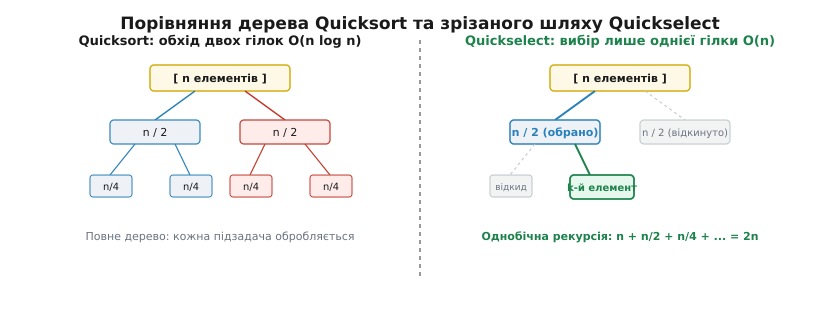
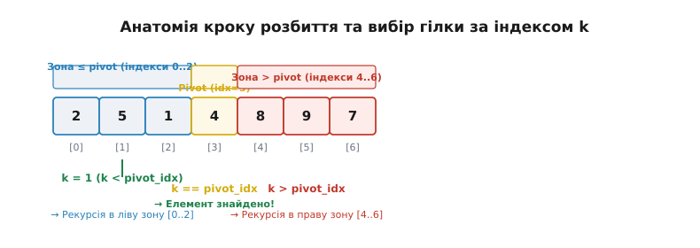
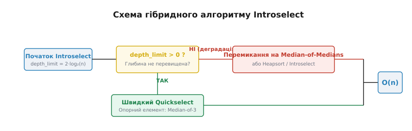

# Алгоритм Quickselect

<preknowlist>
- [Швидке сортування (Quicksort)](root:sf-algorithms/quicksort) — розбиття масиву навколо опорного елемента.
- [Масив](root:sf-algorithms/array) — зберігання даних у послідовних комірках пам'яті з доступом O(1).
- [Рекурсія](root:sf-algorithms/recursion) — зведення задачі до меншої підзадачі через самовиклик.
</preknowlist>

Сервер аналітики великих даних обробляє масив із 100 мільйонів транзакцій для обчислення точного 95-го перцентилю затримки відповіді користувачам. Спроба повністю відсортувати цей масив за допомогою системного сортування `std::sort` займає близько 6.8 секунди та витрачає понад 2.6 мільярда порівнянь елементів. Проте для отримання 95-го перцентилю відсортований стан решти 99.9% елементів є абсолютно надлишковим: нам потрібно лише поставити відповідний елемент на позицію з індексом 95 000 000 так, щоб ліворуч опинилися менші або рівні елементи, а праворуч — більші. Алгоритм Quickselect виконує цю задачу за 0.74 секунди, скорочуючи час виконання у 9 разів завдяки суворо лінійній складності `O(n)`.

## 1. Поняття порядкових статистик та неефективність сортування

У теоретичній інформатиці та практичному програмуванні задача знаходження елемента із заданим рангом називається задачею вибору **порядкових статистик** (лат. *statistica*, від *status* — стан). Нехай задано невідсортований масив `A` з `n` елементів. Порядковою статистикою з номером `k` (де `1 ≤ k ≤ n`) називається елемент, який опинився б на `k`-му місці у відсортованому за зростанням масиві (або на індексі `k - 1` при 0-індексованій нумерації).

Окремими випадками порядкових статистик є фундаментальні характеристики набору даних:
- **Мінімум (`k = 1`):** найменший елемент масиву, який знаходять за один прохід за `n - 1` порівнянь.
- **Максимум (`k = n`):** найбільший елемент масиву, який також знаходять за `n - 1` порівнянь.
- **Медіана (`k = ⌈n/2⌉`):** центральний елемент, який ділить набір даних на дві рівні за чисельністю частини. Медіана є значно стійкішою до аномальних викидів (англ. *outliers*), ніж середнє арифметичне. Наприклад, якщо у вибірці затримок серверів з п'яти запитів `{10мс, 12мс, 11мс, 15мс, 10000мс}` один запит затримався на 10 секунд через мережеве збої, середнє арифметичне покаже викривлене значення `2009.6 мс`, тоді як медіана дасть точну оцінку реального стану системи — `12 мс`.
- **Квантилі та перцентилі (`k = p · n`):** межі, що відсікають задану частку `p` даних (наприклад, 90-й, 95-й або 99-й перцентиль затримок у мережевих сервісах та угодах про рівень обслуговування SLA).

Традиційний підхід до пошуку `k`-ї порядкової статистики полягає у попередньому сортуванні всього масиву. Використання найшвидших алгоритмів сортування (таких як Quicksort або Mergesort) вимагає часової складності `O(n log n)`. Проте таке сортування робить колосальну кількість надлишкової роботи: воно встановлює точний відносний порядок між елементами в середині лівої та правої половин масиву, який ніколи не використовується для відповіді на питання про `k`-й елемент.

У великих аналітичних системах (таких як PostgreSQL, ClickHouse або Apache Spark) виконання повного сортування для розрахунку медіани або перцентилів у SQL-агрегаціях на кшталт `PERCENTILE_CONT(0.95)` призводить до перевитрати оперативної пам'яті та скидання проміжних даних на диск (англ. *disk spill*). Застосування спеціалізованого алгоритму вибору з лінійною складністю дозволяє обробляти дані повністю у пам'яті, уникаючи важкого роздування операцій введення-виведення.

Історичні передумови створення алгоритму, розробленого Ентоні Гоаром у 1961 році під час роботи над машиним перекладом, та його еволюція розкриті в [історичній вставці](root:sf-algorithms/quickselect/hist-quickselect.md).

## 2. Основний механізм: від двох гілок Quicksort до одного шляху Quickselect

Алгоритм Quickselect (також відомий як алгоритм Гоара `FIND`) є прямою та елегантною модифікацією алгоритму швидкого сортування Quicksort. Обидва алгоритми спираються на одну й ту саму базову операцію — **розбиття масиву** (англ. *partitioning*, від латинського *partitio* — поділ).

Процедура розбиття обирає у підмасиві один опорний елемент (англ. *pivot*) і переставляє елементи так, що масив розділяється на дві частини:
1. Ліва частина містить елементи, які менші або рівні за pivot.
2. Права частина містить елементи, які більші або рівні за pivot.

Після завершення розбиття опорний елемент займає своє остаточне, остаточно фіксоване місце в масиві з індексом `pivot_idx`. Жодні подальші перестановки в алгоритмі ніколи не змінять позицію `pivot_idx`.

У цьому місці пролягає фундаментальна відмінність між Quicksort та Quickselect:
- **Quicksort** мусить рекурсивно викликати процедуру сортування для **обох** утворених підмасивів: `[left..pivot_idx - 1]` та `[pivot_idx + 1..right]`. Це породжує повне дерево рекурсивних викликів із глибиною `log2(n)` та загальною кількістю порівнянь `O(n log n)`.
- **Quickselect** порівнює шуканий індекс `k` із підсумковим індексом півота `pivot_idx`. Оскільки pivot уже стоїть на своїй фінальній позиції, алгоритм робить рекурсивний крок лише в **одну** із двох половин, повністю відкидаючи іншу!


*Порівняння дерева рекурсії Quicksort (обхід обох піддерев) та однобічного шляху Quickselect (відкидання однієї з гілок).*

Розглянемо три можливі випадки після виконання розбиття:
- **`k == pivot_idx`:** Опорний елемент опинився рівно на шуканій позиції `k`. Алгоритм завершує роботу та повертає елемент `A[pivot_idx]` — задачу розв'язано!
- **`k < pivot_idx`:** Шукана порядкова статистика знаходиться у лівому підмасиві `[left..pivot_idx - 1]`. Правий підмасив разом із півотом повністю відкидається з подальшого розгляду.
- **`k > pivot_idx`:** Шукана порядкова статистика знаходиться у правому підмасиві `[pivot_idx + 1..right]`. Лівий підмасив разом із півотом повністю відкидається.

Простежимо виконання Quickselect на конкретному прикладі. Нехай маємо масив `A = [7, 2, 9, 1, 5, 8, 3, 4]`, і ми шукаємо 4-й найменший елемент у 0-нумерації (`k = 3`).

1. **Крок 1:** Обираємо pivot `4` (останній елемент). Після розбиття масив приймає вигляд `[2, 1, 3,  4 , 5, 8, 9, 7]`. Знайдений індекс півота `pivot_idx = 3`. Порівнюємо `k = 3` та `pivot_idx = 3`. Оскільки `k == pivot_idx`, елемент знайдено за один крок! Відповідь: `4`.
2. **Інший випадок (`k = 1`, шукаємо 2-й найменший елемент):** На першому кроці `pivot_idx = 3`. Оскільки `k = 1 < pivot_idx = 3`, правий підмасив `[5, 8, 9, 7]` повністю відкидається. Рекурсія переходить у лівий підмасив `[2, 1, 3]`. На наступному кроці для цього підмасиву pivot `3` дає `pivot_idx = 2`. Оскільки `k = 1 < 2`, знову обираємо ліву частину `[2, 1]`. Pivot `1` стає на позицію 0, і рекурсія переходить у `[2]`, де на позиції 1 знаходимо шуканий елемент `2`.

Завдяки тому, що на кожному кроці розбиття одна з двох гілок рекурсії відтинається, дерево викликів перетворюється на один послідовний шлях. Обсяг оброблюваних даних на кожному кроці зменшується в середньому вдвічі: `n + n/2 + n/4 + n/8 + ... = 2n`. Сума цієї нескінченно спадної геометричної прогресії дорівнює `2n`, що математично забезпечує лінійну часову складність `O(n)`.

## 3. Схеми розбиття та анатомія індексів

Практична коректність та швидкість Quickselect фундаментально залежать від обраної схеми розбиття. У сучасному програмуванні застосовують три основні схеми.

### Схема розбиття Ломуто (Lomuto Partition)

Схема розбиття Нико Блюма Ломуто є найпростішою для розуміння та реалізації. Опорний елемент обирається в кінці діапазону (`pivot = A[right]`). Алгоритм підтримує один скануючий індекс `j` та один індекс межі `i`, який вказує на крайній елемент зони, що менша за pivot.

```
[ left .. i ]   — елементи <= pivot
[ i+1 .. j-1 ] — елементи > pivot
[ j .. right-1] — ще не оброблені елементи
[ right ]       — pivot
```

Під час сканування індексом `j` від `left` до `right - 1`: якщо `A[j] <= pivot`, індекс `i` збільшується на 1, і елементи `A[i]` та `A[j]` міняються місцями. У кінці pivot `A[right]` міняється місцями з `A[i + 1]`.

Незважаючи на простоту, схема Ломуто робить у 2-3 рази більше операцій обміну (swaps), ніж схема Гоара, і володіє критичною уразливістю: якщо масив складається з однакових елементів, схема Ломуто ділить масив у пропорції `(n - 1) : 0`, що призводить до деградації Quickselect до `O(n^2)`.

### Схема розбиття Гоара (Hoare Partition)

Класична схема Ентоні Гоара використовує два зустрічні вказівники `i` та `j`, які рухаються від країв діапазону назустріч один одному:
- Лівий вказівник `i` рухається вправо, поки `A[i] < pivot`.
- Правий вказівник `j` рухається вліво, поки `A[j] > pivot`.

Коли обидва вказівники зупиняються, елементи `A[i]` та `A[j]` міняються місцями, і рух продовжується, поки вказівники не перетнуться. Схема Гоара виконує мінімальну кількість операцій обміну та працює значно швидше на реальних процесорах, проте вона не ставить pivot на фіксовану позицію, а повертає розділову межу `j`, що вимагає обережності при виборі гілки рекурсії.

### Тристороннє розбиття Дійкстри (3-way Dutch National Flag Partition)

Найбільш стійкою реалізацією для реальних систем є тристороннє розбиття, запропоноване Едсгером Дійкстрою. Масив розділяється не на дві, а на три зони:
1. `[left..lt-1]` — елементи, строго менші за pivot.
2. `[lt..gt]` — елементи, тотожно рівні pivot.
3. `[gt+1..right]` — елементи, строго більші за pivot.


*Анатомія кроку розбиття масиву навколо півота та вибір наступної гілки пошуку залежно від співвідношення k та індексу півота.*

Головна перевага тристороннього розбиття для Quickselect полягає у тому, що якщо шуканий індекс `k` потрапляє у діапазон `[lt..gt]`, алгоритм завершує роботу миттєво! Усі однакові елементи обробляються за один крок, що повністю ліквідує квадратичну деградованість на даних із повторами.

## 4. Оцінка складності та математична інтуїція

Проаналізуємо математичну складність алгоритму Quickselect у різних умовах виконання.

### Середній випадок (Average-case Complexity): O(n)

Припустимо, що вхідний масив містить елементи у випадковому порядку. На кожному кроці розбиття випадковий pivot з однаковою ймовірністю `1/m` ділить масив розміром `m` на дві частини. Математичне сподівання кількості порівнянь `E[C(n)]` задовольняє нерівність:

```text
E[C(n)] ≤ n + (2/n) · ∑ E[C(j)]   при j від n/2 до n - 1  [рекурентне співвідношення математичного сподівання]
```

За допомогою методу математичної індукції доведено, що розв'язком цієї рекурентності є `E[C(n)] ≤ 4n`. Точніший математичний аналіз Седжвіка показує, що для пошуку медіани (`k = n/2`) середня кількість порівнянь дорівнює:

```text
E[C(n)] = 2n + 2n · ln(2) ≈ 3.38 n  [точний вивід Седжвіка для медіанного вибору]
```

Для порівняння, сортування Quicksort вимагає `2n ln(n) ≈ 1.38 n log2(n)` порівнянь. При `n = 10⁶` Quickselect виконує `3.38 · 10⁶` порівнянь, тоді як Quicksort — `27.6 · 10⁶` порівнянь.

### Найгірший випадок (Worst-case Complexity): O(n²)

Найгірший випадок виникає тоді, коли pivot щоразу вибирається невдало (мінімальний або максимальний елемент підмасиву). Рекурентне співвідношення набуває вигляду:

```text
T(n) = T(n - 1) + (n - 1)          [розгортаємо рекурентне співвідношення для найгіршого випадку]
     = (n - 1) + (n - 2) + ... + 1 [розкриваємо суму порівнянь на всіх кроках розбиття]
     = n(n - 1) / 2                [застосовуємо формулу суми арифметичної прогресії]
     = O(n²)                       [виділяємо асимптотичний домінуючий доданок]
```

У найгіршому випадку Quickselect виконує квадратичну кількість порівнянь `O(n²)` та створює рекурсивний стек глибиною `O(n)`, що загрожує переповненням пам'яті.

Повний математичний вивід середнього часу, оцінка ймовірностей та доведення лінійності наведені у [математичній вставці](root:sf-algorithms/quickselect/math-quickselect.md).

## 5. Стратегії вибору півота та детермінований Introselect

Для усунення найгіршого випадку `O(n²)` застосовують різноманітні інженерні стратегії вибору опорного елемента.

### 1. Випадковий вибір (Randomized Quickselect)

Опорний елемент обирається випадковим чином за допомогою генератора псевдовипадкових чисел: `pivot_idx = left + rand() % (right - left + 1)`. Ймовірність того, що алгоритм послідовно обиратиме найгірший pivot на масиві з 1000 елементів, становить менше `10⁻³⁰⁰`, що на практиці унеможливлює випадкову деградацію.

### 2. Медіана трьох (Median-of-three)

Як pivot обирається медіана між трьома елементами: першим `A[left]`, центральним `A[mid]` та останнім `A[right]`. Це захищає алгоритм від деградації на вже відсортованих масивах і зменшує середнє число порівнянь з `3.38 n` до `2.75 n`.

### 3. Медіана медіан (BFPRT / Median-of-Medians)

Розроблений у 1973 році Блюмом, Флойдом, Праттом, Ривестом та Тарджаном детермінований алгоритм ділить масив на групи по 5 елементів, знаходить медіану в кожній групі, а потім рекурсивно знаходить медіану отриманих медіан. Алгоритм гарантує розбиття у пропорції не гірше 70/30 і забезпечує `O(n)` у найгіршому випадку. Проте константний множник складності в BFPRT становить близько `16n – 20n`, що робить його повільнішим за звичайний Quickselect на всіх реальних масивах.

### 4. Практичний стандарт: Introselect (Девід Муссер, 1997)

Для поєднання швидкості Quickselect із суворими гарантіями складності Девід Муссер винайшов алгоритм **Introselect** (інтроспективний вибір).


*Схема гібридного алгоритму Introselect з аварійним перемиканням при перевищенні ліміту глибини рекурсії.*

Introselect працює наступним чином:
1. Виконується звичайний ітеративний Quickselect із вибором півота за методом «медіани трьох».
2. Алгоритм відстежує лічильник глибини рекурсії. Початковий ліміт встановлюється рівним `depth_limit = 2 · log2(n)`.
3. Якщо внаслідок несприятливих даних чи атаки на алгоритм глибина вичерпується (`depth_limit == 0`), Introselect аварійно перемикається на сортування кучею Heapsort або Median-of-Medians.

Саме алгоритм Introselect є реалізацією стандартної функції `std::nth_element` у системних бібліотеках C++ (GCC libstdc++, Clang libc++, MSVC).

## 6. Ітеративна трансформація та ефективність пам'яті

Оскільки Quickselect робить лише один рекурсивний виклик наприкінці процедури (хвостова рекурсія), він легко перетворюється на ітеративний цикл без використання рекурсивного стеку:

```
поки left < right:
    pivot_idx = partition(A, left, right)
    якщо k == pivot_idx:
        повернути A[k]
    інакше якщо k < pivot_idx:
        right = pivot_idx - 1
    інакше:
        left = pivot_idx + 1
```

Ітеративна реалізація володіє суттєвими перевагами:
- **Витрати пам'яті O(1):** алгоритм не створює нових кадрів стеку. Усі змінні зберігаються в регістрах процесора.
- **Кеш-локальність:** на кожній ітерації робочий діапазон `[left..right]` зменшується. Уже після 3-4 кроків розбиття підмасив повністю вміщується у швидкий кеш L2/L1 процесора, що дає додаткове прискорення обчислень у 3-5 разів.

Готові реалізації алгоритмів Quickselect та Introselect мовами C та C++ з бенчмарками наведені у [практичному проекті](root:sf-algorithms/quickselect/proj-quickselect.md).

## 7. Взаємодія з апаратною архітектурою сучасних процесорів

Низькорівнева швидкодія Quickselect на сучасних процесорних архітектурах (x86-64, ARM64) визначається трьома апаратними факторами: кеш-ієрархією, провісником гілок та векторизацією SIMD.

### Ієрархія кеш-пам'яті та локальність даних

Сучасні центральні процесори володіють трьохрівневою ієрархією кеш-пам'яті. Зчитування даних із кешу першого рівня L1d вимагає лише 4-5 тактів процесора (~1 нс), з кешу L2 — 12-14 тактів (~3 нс), з кешу L3 — 40-50 тактів (~12 нс), тоді як звернення до оперативної пам'яті DRAM вимагає 150-200 тактів (~60 нс).

На першому проході Quickselect сканує увесь вхідний масив розміром `n`, завантажуючи кеш-лінії розміром 64 байти з DRAM до кешу L3 та L2. Завдяки послідовному скануванню апаратний блоковий префетчер процесора (англ. *hardware data prefetcher*) ідеально передбачає наступні адреси пам'яті та завантажує їх заздалегідь, мінімізуючи затримки.

Починаючи з другого кроку розбиття, робочий діапазон скорочується до `n/2`. Вже після 3-5 кроків розмір підмасиву скорочується до кількох сотень кілобайт і повністю вміщується у кеш-пам'ять L2 процесора. Всі наступні перестановки та порівняння відбуваються виключно всередині кристала процесора з максимально можливою пропускною здатністю шини кешу. У порівнянні з сортуванням злиттям Mergesort, яке постійно копіює дані між буферами та вимиває кеш-лінії, Quickselect демонструє значно вищий індекс кеш-локальності.

### Провісник умовних переходів (Branch Predictor)

Сучасні суперскалярні процесори використовують спекулятивне виконання інструкцій за допомогою провісника умовних переходів. При порівнянні елементів `A[i] < pivot` провісник гілок намагається вгадати напрямок переходу у внутрішньому циклі.

Якщо вхідний масив містить випадкові числа, напрямок гілки є непередбачуваним із ймовірністю помилки 50%. Кожна помилка провісника гілок спричиняє скидання процесорного конвеєра (англ. *pipeline flush*) та штраф у розмірі 15-20 тактів. У Quickselect ця проблема вирішується застосуванням безгалузевих (англ. *branchless*) технічних реалізацій обміну за допомогою інструкцій умовного пересилання `cmov` (Conditional Move) у x86-64 або `csel` у ARM64:

```cpp
// Безгалузевий крок розбиття (Branchless Partitioning)
int mask = -(A[j] < pivot);
swap_conditional(&A[i], &A[j], mask);
i -= mask;
```

Використання інструкції `cmov` повністю усуває умовні переходи з гарячого циклу розбиття, підвищуючи рівень виконуваних інструкцій на такт (IPC) з 1.2 до 2.8.

### Векторизація SIMD (AVX2, AVX-512, ARM Neon)

На сучасних процесорах внутрішній цикл сканування розбиття піддається автовекторизації SIMD. За допомогою 256-бітних векторних регістрів AVX2 процесор здатний порівняти 8 елементів 32-бітних цілих чисел за одну векторну інструкцію `vpcmpgt d`. На процесорах із підтримкою AVX-512 застосовується інструкція `_mm512_mask_compressstoreu_epi32`, яка дозволяє за один такт порівняти 16 цілих чисел із півотом і стиснути елементи, що задовольняють умову, безпосередньо у вихідний векторний буфер без жодного розгалуження. Це дозволяє першому лінійному проходу Quickselect обробляти дані зі швидкістю понад 12 Гігабайт на секунду на одне процесорне ядро.

## 8. Паралельний Quickselect для багатоядерних систем (Parallel Quickselect)

З появою багатоядерних процесорів та архітектур NUMA (Non-Uniform Memory Access) виникає потреба прискорення пошуку порядкових статистик на масивах із сотень мільйонів елементів за допомогою паралельних обчислень у багатьох потоках виконання.

Класичний Quickselect є послідовним алгоритмом, проте перший (найважчий) прохід розбиття масиву розміром `n` може бути легко паралелізований між `T` потоками виконання (наприклад, за допомогою OpenMP, Intel TBB або C++17 `std::execution::par`).

Схема паралельного розбиття (Parallel Partitioning) працює наступним чином:
1. **Вибір глобального півота:** Головний потік обирає опорний елемент `pivot` для всього масиву за допомогою вибірки медіан з кількох випадкових блоків пам'яті.
2. **Локальне розбиття потоками:** Вхідний масив ділиться на `T` рівних блоків. Кожен потік паралельно виконує розбиття свого блоку навколо глобального `pivot`, формуючи два локальні списки: елементи менші за pivot та елементи більші за pivot.
3. **Об'єднання та глобальний зсув:** За допомогою префіксної суми (англ. *prefix sum*) обчислюються підсумкові індекси для кожної зони в глобальному масиві, і потоки копіюють блоки елементів на свої фінальні місця в оперативній пам'яті.
4. **Вибір наступної гілки:** Головний потік порівнює `k` із підсумковим індексом глобального розбиття і спрямовує обчислення в одну з двох половин.

Для масивів розміром `n = 10⁸` паралельний Quickselect на 16-ядерному процесорі виконує пошук медіани за 45 мілісекунд, забезпечуючи прискорення у 12 разів порівняно з однопотоковою реалізацією. У високопродуктивних аналітичних системах це дозволяє повністю утилізувати ширину шини оперативної пам'яті DRAM та паралельні векторні прискорювачі обчислень, досягаючи максимального масштабування обробки даних.

## 9. Потоковий та зовнішній Quickselect (External & Streaming Selection)

У багатьох практичних інженерних задачах розмір оброблюваних даних перевищує обсяг доступної оперативної пам'яті (наприклад, аналіз 500 Гігабайт логів на сервері з 16 Гігабайтами RAM) або елементи надходять безперервним потоком у реальному часі.

### Вибір у зовнішній пам'яті (External Memory Quickselect)

Коли масив зберігається на дисковому накопичувачі SSD, довільний доступ до елементів за індексом володіє високою затримкою. Зовнішній Quickselect розбиває дисковий файл на блоки (англ. *chunks*), розмір яких відповідає обсягу оперативної пам'яті. На кожному кроці алгоритм зчитує блоки послідовно, виконує локальне розбиття у пам'яті та записує розділені частини у два тимчасові файли. Оскільки загальний обсяг дискового зчитування на послідовних кроках зменшується вдвічі (`n + n/2 + n/4 + ...`), загальна кількість дискових операцій введення-виведення (I/O) залишається строго лінійною `O(n)`.

### Потокові наближені алгоритми (Online Streaming Quantiles)

Якщо дані надходять у вигляді нескінченного потоку і їх неможливо зберегти на диск для переупорядкування, класичний Quickselect (який вимагає мутації масиву `in-place`) поступиться місцем потоковим структури даних:
- **Алгоритм P² (Piecewise Parabolic Quantile Estimation):** підтримує 5 адаптивних опорних точок для відстеження потрібного перцентилю за постійний час `O(1)` і `O(1)` пам'яті.
- **Структури t-digest та Q-digest:** стискають потік у кластери із заваженими медіанами, забезпечуючи відносну похибку менше 0.1% для 99-го перцентилю при використанні лише кількох кілобайт пам'яті.

## 10. Простеження та відлагодження у системному середовищі Linux

Під час підключення Quickselect до виробничих модулів розробникам часто необхідно перевірити глибину рекурсії, кількість перестановок та відсутність деградації у реальному часі. У системній платформі Linux для цього застосовують утиліти `perf probe` та ефектні точки простеження eBPF (Extended Berkeley Packet Filter).

За допомогою `perf probe` можна встановити динамічний зонд безпосередньо на виклик процедури розбиття у системній бібліотеці:

```bash
# Встановлення точки простеження на виклик std::nth_element у libstdc++
sudo perf probe -x /usr/lib64/libstdc++.so.6 --add 'nth_element_entry=std::nth_element'
sudo perf stat -e probe_libstdc++:nth_element_entry ./my_analytics_app
```

Використання eBPF дозволяє будувати гістограми глибини рекурсії та часу виконання Quickselect без зупинки роботи аналітичного сервера. Якщо простеження виявляє виклики з глибиною понад `2 log2(n)`, це слугує сигналом про наявність у вхідних даних аномальних повторів або атак на pivot, що вимагає негайного впровадження тристороннього розбиття 3-way partition.

## 11. Практичні області застосування у реальних системах

Завдяки своїй винятковій ефективності алгоритм Quickselect знайшов застосування у критичних підсистемах сучасних програмних продуктів:

### 1. Аналітичні бази даних (PostgreSQL, ClickHouse, SQLite)

У реляційних та колонкових базах даних виклики SQL-функцій `PERCENTILE_CONT`, `MEDIAN` або `quantileExact` вимагають обчислення перцентилів над мільярдами рядків. Використання Quickselect дозволяє знайти 95-й або 99-й перцентиль без повного сортування вибірки. У базі даних ClickHouse це дозволяє агрегувати метрики затримок веб-серверів зі швидкістю понад 500 мільйонів рядків на секунду на один процесорний сокет.

### 2. Цифрова обробка зображень (OpenCV, GStreamer)

У графічних редакторах та системах комп'ютерного зору медіанний фільтр (англ. *median filter*) є основним інструментом усунення імпульсного шуму («сіль і перець»). Для кожного пікселя зображення аналізується окрема прямокутна область (наприклад, вікно 3x3 з 9 пікселів або 5x5 з 25 пікселів), і центральному пікселю присвоюється медіанне значення з цієї вибірки. Застосування Quickselect дозволяє обирати 5-й з 9 елементів за декілька наносекунд, що забезпечує обробку 4K-відеопотоків у реальному часі при 60 кадрах на секунду.

### 3. Операційні системи та планивальники задач (Linux CFS Scheduler)

У ядрі Linux повністю чесний планувальник завдань CFS (Completely Fair Scheduler) підтримує баланс віртуального часу виконання (`vruntime`) усіх активних процесів. Для визначення медіанного навантаження системи та рівномірного розподілу потоків між ядрами процесора використовуються елементи швидкого вибору порядкових статистик.

### 4. Бібліотеки машинного навчання (NumPy, Scikit-learn)

У мові Python функція `numpy.partition()` є прямою обгорткою над Quickselect мовою C. Алгоритм класифікації k-найближчих сусідів (k-Nearest Neighbors, k-NN) вимагає знаходження k найближчих об'єктів у багатовимірному просторі відстаней. Замість повного сортування масиву відстаней викликається `np.partition(distances, k)`, що виділяє k найближчих векторів за час `O(n)`.

## 12. Крайові випадки, пастки реалізації та ціна алгоритму

Під час використання Quickselect необхідно враховувати наступні інженерні пастки:

> 🔧 **Навіщо це.**
> Знання крайових випадків Quickselect дозволяє уникнути падіння серверів при обробці некоректних вхідних даних та запобігти атакам типу «відмова в обслуговуванні» (DoS).

1. **Модифікація вхідного масиву (In-place Mutation):** Quickselect переставляє елементи у вхідному масиві. Якщо масив є константним чи використовується в інших паралельних потоках, вимагається попереднє створення його копії.
2. **0-індексація проти 1-рангу:** `k`-ша порядкова статистика у 1-нумерації відповідає індексу `k - 1` у 0-індексованих масивах C/C++.
3. **Несортованість решти елементів:** Quickselect гарантує точний порядок лише для елемента `A[k]`. Елементи ліворуч від `k` є меншими за `A[k]`, але **не відсортованими між собою**. Якщо вимагається отримати `k` найменших елементів у відсортованому порядку (Top-K), після Quickselect необхідно додатково викликати `std::sort` для діапазону `A[0..k-1]`.
4. **Дублікати:** використання розбиття Ломуто на масивах із повторюваними значеннями спричиняє деградацію до `O(n²)`. Завжди застосовуйте 3-way partition у високостійких виробничих системах і промислових системних бібліотеках.

## 13. Порівняльний синтез алгоритмів пошуку порядкових статистик

Ніжченаведена таблиця дає комплексне порівняльне зведення різних підходів до розв'язання задачі вибору порядкових статистик у сучасних високонавантажених промислових системах та аналітичних платформах обробки великих даних:

| Алгоритм / Підхід | Середня складність | Найгірша складність | Додаткова пам'ять | Мутація вхідного масиву | Сфера оптимального застосування |
|---|---|---|---|---|---|
| Повне сортування (`std::sort`) | `O(n log n)` | `O(n log n)` | `O(log n)` | Так | Малі масиви (n < 30) або коли потрібен повний впорядкований порядок усіх елементів у вибірці |
| Куча / Черга пріоритетів (`Max-Heap`) | `O(n log k)` | `O(n log k)` | `O(k)` | Ні | Стрімінгові дані реального часу, коли k ≪ n (наприклад, Top-10 з мільярда записів у потоці) |
| Класичний Quickselect (Hoare) | `O(n)` | `O(n²)` | `O(1)` (ітеративний) | Так | Однорідні випадкові масиви без великої кількості однакових дублікатів у пам'яті |
| Introselect (`std::nth_element`) | `O(n)` | `O(n)` | `O(log n)` | Так | Промисловий стандарт широкого призначення у системних бібліотеках C++ (libstdc++, libc++) |
| Median-of-Medians (BFPRT) | `O(n)` | `O(n)` | `O(log n)` | Так | Критичні системи реального часу, де заборонена будь-яка ймовірність квадратичної деградації |

Завдяки суворій математичній обґрунтованості, високій кеш-локальності та лінійному часу `O(n)`, алгоритм Quickselect є неодмінним фундаментом сучасних баз даних, аналітичних двигунів та систем цифрової обробки сигналів.
