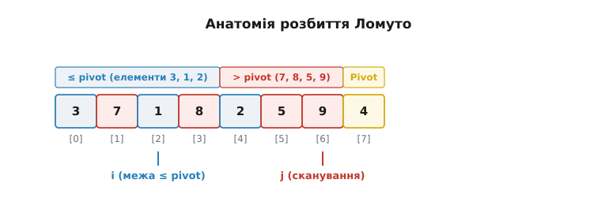
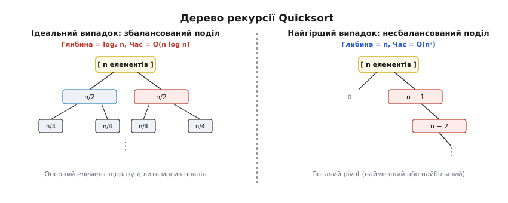
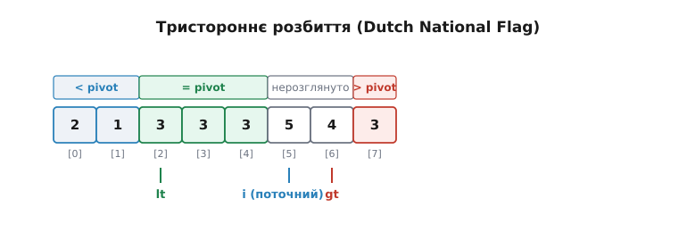
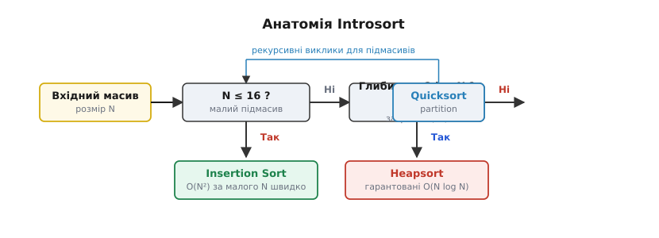

# Швидке сортування (Quicksort)

<preknowlist>
- [Розділяй і володарюй](topic:sf-algorithms/divide-and-conquer) — поділ задачі на підзадачі, рекурсивний розв'язок і комбінування результатів.
- [Асимптотична складність](topic:computability/asymptotic-complexity) — оцінка часу виконання в середньому й у найгіршому випадках через нотації O велике, Ω та Θ.
- [Стек викликів і рекурсія](topic:sf-algorithms/recursion) — збереження контексту викликів у стеку пам'яті та межі його глибини.
- [Сортування вставками](topic:sf-algorithms/insertion-sort) — просте сортування з квадратичною складністю, що ефективно працює на малих та майже впорядкованих масивах.
- [Timsort](topic:sf-algorithms/timsort) — гібридний стійкий алгоритм сортування на основі злиття та вставок.
</preknowlist>

Уяви практичну інженерну ситуацію: на сервері високопотокової обробки даних або у вбудованій системі з 16 мегабайтами оперативної пам'яті потрібно впорядкувати масив із 2 000 000 32-бітних цілих чисел. Самі дані займають 8 мегабайтів — рівно половину всього доступного обсягу ОЗП. Якщо застосувати класичне [сортування злиттям](topic:sf-algorithms/divide-and-conquer), алгоритм на першій же фазі вимагатиме виділення ще 8 мегабайтів під допоміжний масив для злиття відрізків. Запит до розподілювача пам'яті провалиться, бо вільного неперервного блоку такого розміру в системі просто немає. 

Якщо ж спробувати використати [сортування купою](topic:sf-algorithms/heapsort), воно бездоганно вкладеться у ті самі 8 мегабайтів і гарантує складність `O(n log n)` у найгіршому випадку. Проте на реальному процесорі воно працюватиме значно повільніше, ніж очікувалося. Причина полягає в архітектурі кек-пам'яті: купа просіює елементи за індексами `2i + 1` та `2i + 2`. Кожен такий крок робить стрибок через величезні інтервали адресового простору, спричиняючи постійні промахи повз кек-лінії L1/L2 (CPU cache misses). Читання з основної пам'яті DRAM вимагає близько 200 тактів процесора, тоді як вибірка з кешу L1 коштує лише 4 такти. Постійний простій конвеєра процесора в очікуванні даних робить сортування купою неефективним на великих масивах.

Виникає чітка інженерна вимога: потрібен алгоритм, який сортує **на місці** (in-place, з `O(1)` додаткової пам'яті), володіє **ідеальною кеш-локальністю** за рахунок послідовного сканування пам'яті та демонструє **найвищу абсолютну швидкість** серед усіх алгоритмів сортування порівняннями.

Цим алгоритмом є **швидке сортування** (англ. *Quicksort*), розроблене у 1959 році британським науковцем Чарльзом Ентоні Річардом Гоаром (C.A.R. Hoare). В його основі лежить парадигма «розділяй і володарюй» та ключова механіка — **розбиття** (partitioning) масиву відносно обраного опорного елемента.

## Серце алгоритму: концепція розбиття

Головна ідея Quicksort полягає в тому, що замість намагання одразу впорядкувати увесь масив, алгоритм виконує один послідовний прохід і переставляє елементи так, щоб масив розпався на три частини:

1. **Опорний елемент (pivot):** один вибраний елемент масиву, який після фази розбиття опиняється на своєму **остаточному точному індексі**, де він має стояти у вже відсортованому масиві.
2. **Лівий підмасив:** усі елементи, значення яких **менші або дорівнюють** опорному.
3. **Правий підмасив:** усі елементи, значення яких **більші або дорівнюють** опорному.

Після того як опорний елемент посів свій підсумковий осередок, його позиція фіксується назавжди: він більше ніколи не бере участі в обмінах чи порівняннях. Задача сортування масиву розміром `n` розпадається на дві абсолютно незалежні підзадачі — рекурсивно відсортувати лівий підмасив та правий підмасив.

> Розбиття — це єдиний етап Quicksort, де виконується реальна робота з переставлення елементів у пам'яті. На відміну від сортування злиттям, де основне навантаження припадає на фазу об'єднання (merge), у Quicksort фаза комбінування результатів взагалі порожня. Оскільки підмасиви сортуються безпосередньо у вихідних комірках масиву, після повернення з усіх рекурсивних викликів увесь масив виявляється повністю впорядкованим без жодних додаткових дій.

## Схема Ломуто: лінійна гранична механіка

Найпростішою для розуміння та програмної реалізації є схема розбиття Нико Райлі Ломуто (Lomuto partition scheme). У класичній варіації Ломуто опорним елементом завжди вибирається останній елемент підмасиву: `pivot = array[hi]`.

Алгоритм підтримує два вказівники індексів:
- Вказівник `j` є скануючим: він послідовно проходить комірки масиву від початку `lo` до передостаннього елемента `hi - 1`.
- Вказівник `i` вказує на поточну межу елементів, які вже перевірені і є меншими або дорівнюють `pivot`. На початку процедури `i = lo - 1`.

Під час кожного кроку циклу елемент `array[j]` порівнюється з `pivot`. Якщо `array[j] <= pivot`, межа `i` зсувається вправо на один осередок (`i++`), після чого елементи `array[i]` та `array[j]` міняються місцями. Якщо ж `array[j] > pivot`, вказівник `j` просто просувається далі, залишаючи елемент праворуч від межі `i`.

Після завершення циклу сканування опорний елемент `array[hi]` міняється місцями з елементом `array[i + 1]`. У результаті опорний елемент сідає точно на індекс `i + 1`, розділяючи масив на два блоки.



*Анатомія розбиття Ломуто: вказівник i відстежує межу елементів, які не перевищують pivot (жовтий осередок), а вказівник j послідовно сканує невпорядковану частину масиву зліва направо.*

Простежимо роботу схеми Ломуто на конкретному прикладі масиву з 8 елементів `[3, 7, 1, 8, 2, 5, 9, 4]`, де `pivot = 4` (індекс 7):

```
Початковий стан: [3, 7, 1, 8, 2, 5, 9 | 4], lo=0, hi=7, i = -1

крок j=0: arr[0]=3 <= 4 -> i=0, swap(arr[0], arr[0]) -> [3, 7, 1, 8, 2, 5, 9 | 4]
крок j=1: arr[1]=7 > 4  -> i=0 (без змін)            -> [3, 7, 1, 8, 2, 5, 9 | 4]
крок j=2: arr[2]=1 <= 4 -> i=1, swap(arr[1], arr[2]) -> [3, 1, 7, 8, 2, 5, 9 | 4]
крок j=3: arr[3]=8 > 4  -> i=1 (без змін)            -> [3, 1, 7, 8, 2, 5, 9 | 4]
крок j=4: arr[4]=2 <= 4 -> i=2, swap(arr[2], arr[4]) -> [3, 1, 2, 8, 7, 5, 9 | 4]
крок j=5: arr[5]=5 > 4  -> i=2 (без змін)            -> [3, 1, 2, 8, 7, 5, 9 | 4]
крок j=6: arr[6]=9 > 4  -> i=2 (без змін)            -> [3, 1, 2, 8, 7, 5, 9 | 4]

Фінал: swap(arr[i+1], arr[hi]) -> swap(arr[3], arr[7]): [3, 1, 2 | 4 | 7, 5, 9, 8]
```

Опорний елемент `4` опинився на індексі `3`. Ліворуч лежать елементи `[3, 1, 2]` (усі `<= 4`), праворуч — `[7, 5, 9, 8]` (усі `>= 4`).

Попри свою простість, схема Ломуто робить чимало надлишкових обмінів пам'яті (у середньому `(n - 1) / 2` обмінів) і катастрофічно сповільнюється до `O(n²)` на масивах, що складаються з однакових елементів.

## Схема Гоара: двопоінтерне сканування назустріч

Оригінальна схема розбиття, запропонована Тоні Гоаром, діє ефективніше. Вона використовує два зустрічних вказівники `i` та `j`, які стартують із протилежних кінців підмасиву й рухаються назустріч один одному.

Механіка схеми Гоара працює за такими кроками:

```
1. Обрати опорний елемент pivot (наприклад, значення в центрі: pivot = arr[(lo + hi) / 2]).
2. Встановити вказівники: i = lo - 1, j = hi + 1.
3. У циклі:
   a. Збільшувати i (i++), поки arr[i] < pivot.
   b. Зменшувати j (j--), поки arr[j] > pivot.
   c. Якщо i >= j, завершити розбиття та повернути індекс j.
   d. Інакше обміняти arr[i] та arr[j] і продовжити цикл.
```

Простежимо схему Гоара на тому самому масиві `[3, 7, 1, 8, 2, 5, 9, 4]` із `pivot = arr[3] = 8`:

```
Початковий стан: [3, 7, 1, 8, 2, 5, 9, 4], lo=0, hi=7, pivot=8

ітерація 1:
  i збільшується від -1 до 3: arr[3]=8 (не < 8, зупинка на i=3)
  j зменшується від 8 до 7:  arr[7]=4 (не > 8, зупинка на j=7)
  i (3) < j (7) -> swap(arr[3], arr[7]): [3, 7, 1, 4, 2, 5, 9, 8]

ітерація 2:
  i збільшується від 3 до 6: arr[6]=9 (не < 8, зупинка на i=6)
  j зменшується від 7 до 5:  arr[5]=5 (не > 8, зупинка на j=5)
  i (6) >= j (5) -> Зупинка! Повертаємо j = 5.
```

Після розбиття Гоара масив розділено за індексом `j = 5`: ліва частина `arr[0..5]` містить `[3, 7, 1, 4, 2, 5]` (усі `<= 8`), а права `arr[6..7]` містить `[9, 8]` (усі `>= 8`).

Головні переваги схеми Гоара порівняно зі схемою Ломуто:
- Вона виконує у середньому **понад 3 рази менше обмінів** (`(n - 1) / 6` проти `(n - 1) / 2`), оскільки елементи міняються місцями лише тоді, коли вони обидва лежать не по свій бік від опорного.
- Вона не зупиняється на однакових елементах, а ефективно розділяє масив із дублікатами на майже рівні частини.

> 🔧 **Навіщо це.** Послідовне сканування масиву з двох кінців назустріч один одному — ідеальний паттерн для апаратної кек-пам'яті сучасних процесорів (L1/L2 Data Cache). Кек-лінії розміром 64 байти завантажуються з RAM послідовними блоками. Оскільки `i` рухається строго вправо, а `j` — строго вліво, процесорний модуль попередньої вибірки (hardware prefetcher) миттєво розпізнає лінійні тренди й завчасно завантажує наступні дані, зводячи затримки до нуля.

Докладніші деталі створення цієї алгоритмічної структури та її історичний контекст розкрито у вставці [Історія винайдення Quicksort Тоні Гоаром](topic:sf-algorithms/quicksort/hist-quicksort.md).

## Архітектура кек-пам'яті та порівняння алгоритмів сортування

Щоб зрозуміти, чому Quicksort є найшвидшим сортуванням на реальному залізі, необхідно розглянути взаємодію алгоритму з ієрархією пам'яті сучасного CPU.

Сучасна система пам'яті складається з кількох рівнів:
- **Регістри CPU:** доступ за 0 тактів, обсяг біля 1 КБ.
- **Кеш L1 Data:** доступ за 4 такти, обсяг 32–64 КБ на ядро.
- **Кеш L2:** доступ за 12–14 тактів, обсяг 512 КБ – 1 МБ на ядро.
- **Кеш L3 (Shared):** доступ за 40–50 тактів, обсяг 16–64 МБ на сокет.
- **Основна пам'ять (DRAM):** доступ за 150–200 тактів (затримка 60–80 нс).

Пам'ять завантажується з DRAM у кеш L1/L2 не побайтово, а фіксованими блоками — **кеш-лініями (cache lines)** розміром 64 байти (16 цілих 32-бітних чисел).

Коли алгоритм зчитує елемент `arr[i]`, процесор автоматично завантажує в кеш весь 64-байтовий блок. Якщо наступні звернення алгоритму відбуваються до сусідніх елементів `arr[i+1]`, `arr[i+2]` (просторова локальність), ці елементи вже лежать у кеші L1, і доступ до них коштує 4 такти.

Порівняємо паттерни доступу до пам'яті чотирьох популярних алгоритмів:

1. **Quicksort (Схема Гоара):** Зчитує масив абсолютно послідовно з двох кінців. При розмірі кеш-лінії 64 байти лише 1 з 16 проходів викликає промах кешу, а 15 із 16 відбуваються миттєво з кешу L1. Крім того, hardware prefetcher завчасно завантажує наступні 2–4 кеш-лінії.
2. **Heapsort:** Під час просіювання вузол з індексом `i` порівнюється з дітьми `2i + 1` та `2i + 2`. На масиві з 1 000 000 елементів кожен крок вниз по купі стрибає в іншу кеш-лінію. Промахи кешу досягають 80–90%, змушуючи процесор простаювати 150–200 тактів на кожен обмін.
3. **Mergesort:** Считує дані послідовно (добре для кешу), але вимагає запису в допоміжний масив та зворотного копіювання. Це подвоює трафік шини пам'яті (memory bandwidth).
4. **Radix sort (Порозрядне сортування):** При розподілі елементів по кошиках (buckets) робить випадкові записи за 256 різними адресами, розриваючи кеш-лінії та викликаючи промахи буфера трансляції адрес (TLB misses).

## Анатомія найгіршого випадку та небезпека стеку

Асимптотична складність Quicksort суттєво залежить від того, наскільки **збалансованими** виходять підмасиви після кожної фази розбиття.

1. **Ідеальний збалансований випадок:** На кожному кроці опорний елемент виявляється точно медіаною підмасиву і ділить його на дві рівні частини розміром `n / 2`. Дерево рекурсії має глибину `⌊log₂ n⌋`. На кожному з `log₂ n` рівнів дерева загальна кількість порівнянь усіх підмасивів дорівнює `O(n)`. Підсумкова складність становить **`O(n log n)`**.
2. **Найгірший зроджений випадок:** Опорний елемент щоразу виявляється найменшим або найбільшим елементом у підмасиві. У результаті розбиття ділить масив розміром `k` на один порожній підмасив (0 елементів) та один підмасив розміром `k - 1`. Дерево рекурсії перетворюється на лінійний ланцюг із `n` рівнів. Загальна кількість порівнянь обчислюється як сума арифметичної прогресії:

```
(n − 1) + (n − 2) + ... + 1 = n · (n − 1) / 2 = O(n²)
```



*Дерево рекурсії Quicksort: ліворуч — ідеальне збалансоване дерево глибиною log₂ n з підсумковим часом O(n log n); праворуч — зроджений лінійний ланцюг глибиною n, що призводить до O(n²) часу та переповнення стеку.*

Але квадратична складність у найгіршому випадку — це лише частина проблеми. Значно небезпечнішим для надійності програмного забезпечення є **споживання пам'яті стеком викликів**.

Кожен рекурсивний виклик функції сортування створює новий стековий кадр (stack frame), де зберігаються адреса повернення, аргументи `lo` та `hi`, а також локальні змінні. У найгіршому випадку глибина рекурсії досягає `n` кадрів. Якщо сортується масив із `100 000` елементів, у стеку утвориться 100 000 кадрів, що вимагатиме від 4 до 8 мегабайтів пам'яті стеку. Оскільки типовий розмір стеку потоку в Linux становить 8 МБ, а в Windows — 1 МБ, програма миттєво завершиться аварійною помилкою **Stack Overflow (переповнення стеку)**.

## Стратегії вибору опорного елемента

Щоб запобігти деградації алгоритму до `O(n²)`, застосовують розумні стратегії вибору опорного елемента (pivot selection):

### 1. Випадковий pivot (Randomized Quicksort)
Замість фіксованого вибору першого чи останнього елемента алгоритм генерує випадковий індекс `r` у діапазоні `[lo, hi]` і робить `swap(arr[r], arr[hi])`. Завдяки цьому жоден вхідний масив (навіть спеціально підготовлений зловмисником) не може гарантовано викликати найгірший випадок. Ймовірність отримати несбалансований поділ на всіх кроках поспіль становить менше ніж `1 / n!`, що на практиці дорівнює нулю.

### 2. Медіана трьох (Median-of-Three)
Алгоритм вибирає три елементи: перший `arr[lo]`, середній `arr[(lo + hi) / 2]` та останній `arr[hi]`. З них обчислюється медіана (середнє за значенням число), яка й стає опорним елементом. Ця стратегія вимагає лише двох додаткових порівнянь, але повністю ліквідує деградацію на відсортованих, майже відсортованих та реверсивних масивах.

### 3. Тьюкі-дев'ятка (Tukey's Ninther)
Для великих масивів (понад 1000 елементів) у промислових бібліотеках застосовують «дев'ятку Тьюкі»: масив розбивається на 9 рівновіддалених елементів, з трьох трійок обчислюються 3 медіани, після чого вибирається медіана з цих трьох медіан. Це забезпечує ще точніше наближення до справжньої медіани масиву.

Математичне виведення того, чому очікуваний час Quicksort при випадковому виборі pivot становить `2 n ln n ≈ 1.386 n log₂ n`, розібрано у вставці [Математичний аналіз Quicksort](topic:sf-algorithms/quicksort/math-quicksort.md).

## Тристороннє розбиття (3-way partition) для дублікатів

Класичні двосторонні схеми розбиття мають суттєвий недолік при роботі з масивами, що містять велику кількість однакових елементів (наприклад, масив ключів прапорів `0` та `1` чи оцінок від `1` до `5`).

Едсгер Дейкстра запропонував розв'язок цієї проблеми у формі задачі про «Нідерландський прапор» (Dutch National Flag problem). Масив розділяється не на дві, а на **три зони**:
- елементи, які строго менші за pivot (`< pivot`);
- елементи, які строго дорівнюють pivot (`= pivot`);
- елементи, які строго більші за pivot (`> pivot`).



*Тристороннє розбиття (3-way partition): зона = pivot зафіксована на своєму остаточному місці, а рекурсивні виклики виконуються лише для зон < pivot та > pivot.*

Алгоритм підтримує три вказівники: `lt` (межа менших), `i` (поточний скануючий елемент) та `gt` (межа більших). 

```
1. lt = lo, i = lo + 1, gt = hi, pivot = arr[lo].
2. Поки i <= gt:
   a. Якщо arr[i] < pivot: swap(arr[lt], arr[i]), lt++, i++.
   b. Якщо arr[i] > pivot: swap(arr[i], arr[gt]), gt--.
   c. Якщо arr[i] == pivot: i++.
```

Після завершення проходу вся центральна зона `arr[lt..gt]` містить однакові елементи, що дорівнюють `pivot`. Оскільки вони вже опинилися на своїх підсумкових місцях, вони повністю **вилучаються з подальшої рекурсії**. Рекурсивні виклики виконуються тільки для `arr[lo..lt-1]` та `arr[gt+1..hi]`.

Якщо масив складається лише з `k` унікальних ключів (при `k << n`), тристоронній Quicksort виконує сортування за лінійний час **`O(n log k)`**, а при `k = 1` — за один прохід `O(n)`.

## Гарантія глибини стеку O(log n) через хвостову рекурсію

Навіть у випадку несбалансованого розбиття можна **математично гарантувати**, що глибина стеку викликів Quicksort ніколи не перевищить `⌊log₂ n⌋` кадрів.

Для цього використовують техніку **усунення хвостової рекурсії** (tail recursion elimination). Алгоритм порівнює розміри двох отриманих після розбиття підмасивів і робить рекурсивний виклик **лише для меншого підмасиву**, а більший підмасив обробляє ітеративно у циклі `while`.

:::tabs
```c
void quicksort_bounded_stack(int *arr, size_t lo, size_t hi) {
    while (lo < hi) {
        size_t p = partition_hoare(arr, lo, hi);
        
        /* Спочатку рекурсивно сортуємо МЕНШУ частину */
        if (p - lo < hi - p) {
            quicksort_bounded_stack(arr, lo, p);
            lo = p + 1; /* більшу частину сортуємо в циклі */
        } else {
            quicksort_bounded_stack(arr, p + 1, hi);
            hi = p; /* більшу частину сортуємо в циклі */
        }
    }
}
```
```cpp
template <typename T, typename Compare = std::less<T>>
void quicksort_bounded_stack(std::span<T> data, Compare comp = Compare{}) {
    while (data.size() > 1) {
        size_t p = partition_hoare(data, comp);
        
        std::span<T> left = data.subspan(0, p + 1);
        std::span<T> right = data.subspan(p + 1);
        
        if (left.size() < right.size()) {
            quicksort_bounded_stack(left, comp);
            data = right;
        } else {
            quicksort_bounded_stack(right, comp);
            data = left;
        }
    }
}
```
:::

Доведемо строгість цієї гарантії: оскільки рекурсивна функція завжди викликається лише для підмасиву, розмір якого не перевищує `n / 2`, кожен рекурсивний крок зменшує обсяг задачі щонайменше вдвічі. Отже, максимальна глибина каскаду викликів в принципі не може перевищити `⌊log₂ n⌋`. Більша частина масиву продовжує оброблятися у тому самому стековому кадрі через оновлення змінної `lo` або `hi`.

## Безгілочне розбиття (Branchless Partitioning) та BlockQuicksort

На сучасних суперскалярних процесорах з довгими конвеєрами інструкцій (15–20 стадій) суттєвим фактором сповільнення є **помилки передбачення гілкувань (branch mispredictions)**.

У внутрішньому циклі Quicksort умова `if (arr[i] < pivot)` на випадкових даних справджується з ймовірністю близько 50%. Модуль передбачення гілок процесора (branch predictor) у цьому випадку вгадує напрямок лише в половині випадків. Кожна помилка передбачення скидає конвеєр інструкцій, втрачаючи 15–20 тактів процесора.

Для вирішення цієї проблеми у 2016 році вчені розробили алгоритм **BlockQuicksort**. Замість того щоб перевіряти кожен елемент умовою `if` по одному, BlockQuicksort зчитує елементи блоками по 128 або 256 чисел і за допомогою безнапрямкових бітових операцій (branchless comparison) формує масив індексів елементів, які просять обміну:

:::tabs
```c
/* Безгілочне формування масиву індексів для обміну у BlockQuicksort */
void block_partition_step(int *arr, size_t *offsets, size_t *count, size_t start, size_t block_size, int pivot) {
    *count = 0;
    for (size_t k = 0; k < block_size; ++k) {
        size_t idx = start + k;
        offsets[*count] = idx;
        *count += (arr[idx] < pivot); /* Безгілочний інкремент без if */
    }
}
```
```cpp
template <typename T>
void block_partition_step(std::span<T> data, std::span<size_t> offsets, size_t &count, T pivot) {
    count = 0;
    for (size_t k = 0; k < data.size(); ++k) {
        offsets[count] = k;
        count += static_cast<size_t>(data[k] < pivot); /* Брак гілування в ASM */
    }
}
```
:::

Компілятор перетворює цю операцію на інструкцію умовного зсуву `CMOV` або арифметичне додавання прапора без жодного розгалуження коду. У результаті конвеєр процесора працює без зупинок на повній швидкості, що прискорює Quicksort на випадкових масивах ще у 1.5–2 рази.

## Гібридні алгоритми: Introsort та pdqsort

У сучасних промислових системних бібліотеках (C++ STL `std::sort`, Go `sort.Slice`, Rust `slice::sort_unstable`) Quicksort використовується не в чистому вигляді, а у формі гібридного алгоритму **Introsort** (Introspective Sort), розробленого Девідом Мюссером у 1997 році.

Introsort гібридизує три алгоритми для досягнення максимальної швидкості та надійності:

1. **Основний режим (Quicksort):** Алгоритм починає роботу як Quicksort з медіаною трьох. Це дає максимальну швидкість на 99% практичних масивів завдяки чудовій кеш-локальності.
2. **Страховка від O(n²) (Heapsort):** Алгоритм підтримує лічильник глибини рекурсії, ініціалізований значенням `2 · ⌊log₂ n⌋`. Якщо глибина рекурсії виходить за цю межу, це свідчить про патологічне розбиття та загрозу квадратичного виродження. Introsort миттєво перемикає поточний підмасив на [сотування купою (Heapsort)](topic:sf-algorithms/heapsort), яке гарантує підсумковий час `O(n log n)` у найгіршому випадку.
3. **Оптимізація малих масивів (Insertion Sort):** Коли розмір підмасиву стає меншим за дедеякий поріг (зазвичай `n <= 16`), рекурсія Quicksort зупиняється. Малі підмасиви залишаються частково впорядкованими. Наприкінці один прохід [сортування вставками (Insertion Sort)](topic:sf-algorithms/insertion-sort) досортовує весь масив. На малих масивах сортування вставками працює швидше за Quicksort, бо не має накладних витрат на рекурсивні виклики та розбиття.



*Анатомія Introsort: поєднання Quicksort для основного обсягу, Heapsort для захисту від O(n²) та Insertion Sort для малих відрізків.*

Найсучаснішим розвитком Introsort є алгоритм **pdqsort** (Pattern-Defeating Quicksort) Орсона Петерса (2021). Він додає безнапрямкове розбиття (branchless partition) для зменшення помилок передбачення гілувань CPU (branch mispredictions) та розпізнає частково впорядковані шаблони в даних, досягаючи лінійного часу `O(n)` на відсортованих масивах.

Детальні реалізації цих системних алгоритмів із тестами продуктивності наведені у вставці [Ідіоматичні реалізації Quicksort мовами C та C++](topic:sf-algorithms/quicksort/proj-quicksort.md).

## Паралельний Quicksort (Parallel Divide and Conquer)

Структура парадигми «розділяй і володарюй» робить Quicksort чудово пристосованим для паралельних обчислень на багатоядерних процесорах (Multi-core CPUs) та графічних прискорювачах (GPU).

Паралельна схема працює за таким принципом:
1. Одне головне ядро виконує розбиття первинного масиву розміром `n` відносно опорного елемента.
2. Після того як масив розділено на ліву частину `left` та праву частину `right`, створюються дві незалежні паралельні задачі (tasks).
3. Якщо в системі є `P` обчислювальних ядер, ці задачі відправляються в пули потоків (thread pool) і виконуються паралельно на різних ядрах без жодних блокувань чи м'ютексів, оскільки лівий і правий підмасиви займають неперетинні діапазони пам'яті.

При достатній кількості ядер паралельний Quicksort досягає середнього часу виконання **`O(n / P + log n)`**, що дозволяє сортувати мільярдні масиви за частки секунди.

## Стійкість сортування (Stability)

Алгоритм сортування називається **стійким** (stable), якщо він зберігає відносний порядок елементів з однаковими ключами.

Класичний Quicksort є **нестійким сортуванням** (unstable). Причина полягає у дальній природі обмінів під час фази розбиття: коли схема Гоара чи Ломуто робить `swap(arr[i], arr[j])` через велику відстань у масиві, вона легко може перекинути елемент із однаковим ключем через інший такий самий елемент, порушивши їхній початковий порядок.

Зробити Quicksort стійким можливо, але це вимагає використання додаткового масиву пам'яті розміром `O(n)` для тимчасового збереження елементів під час розбиття. Проте це повністю знищує головну перевагу Quicksort — сортування на місці з `O(1)` додаткової пам'яті. Тому там, де необхідна сувора стійкість (наприклад, багаторівневе сортування таблиць за декількома колонками), зазвичай використовують [сортування злиттям (Mergesort)](topic:sf-algorithms/divide-and-conquer) або [Timsort](topic:sf-algorithms/timsort).

## Приклад реалізації мовами C та C++

Наведемо ідіоматичні реалізації Quicksort за схемою Гоара з медіаною трьох та усуненням хвостової рекурсії.

:::tabs
```c
#include <stdio.h>
#include <stddef.h>

static void swap(int *a, int *b) {
    int tmp = *a;
    *a = *b;
    *b = tmp;
}

static size_t median_of_three(int *arr, size_t lo, size_t hi) {
    size_t mid = lo + (hi - lo) / 2;
    if (arr[mid] < arr[lo])  swap(&arr[lo], &arr[mid]);
    if (arr[hi] < arr[lo])   swap(&arr[lo], &arr[hi]);
    if (arr[hi] < arr[mid])  swap(&arr[mid], &arr[hi]);
    return mid;
}

void quicksort(int *arr, size_t lo, size_t hi) {
    while (lo < hi) {
        size_t pivot_idx = median_of_three(arr, lo, hi);
        int pivot = arr[pivot_idx];
        
        size_t i = lo - 1;
        size_t j = hi + 1;
        
        while (1) {
            do { i++; } while (arr[i] < pivot);
            do { j--; } while (arr[j] > pivot);
            if (i >= j) break;
            swap(&arr[i], &arr[j]);
        }
        
        /* Хвостова рекурсія для меншої частини — гарантія O(log n) стеку */
        if (j - lo < hi - j) {
            quicksort(arr, lo, j);
            lo = j + 1;
        } else {
            quicksort(arr, j + 1, hi);
            hi = j;
        }
    }
}
```
```cpp
#include <span>
#include <utility>
#include <functional>

template <typename T, typename Compare = std::less<T>>
void quicksort(std::span<T> data, Compare comp = Compare{}) {
    while (data.size() > 1) {
        size_t lo = 0;
        size_t hi = data.size() - 1;
        size_t mid = lo + (hi - lo) / 2;
        
        if (comp(data[mid], data[lo]))  std::swap(data[lo], data[mid]);
        if (comp(data[hi], data[lo]))   std::swap(data[lo], data[mid]);
        if (comp(data[hi], data[mid]))  std::swap(data[mid], data[hi]);
        
        T pivot = data[mid];
        size_t i = 0;
        size_t j = data.size() - 1;
        
        while (true) {
            while (comp(data[i], pivot)) { i++; }
            while (comp(pivot, data[j])) { j--; }
            if (i >= j) break;
            std::swap(data[i], data[j]);
            i++;
            if (j > 0) j--;
        }
        
        std::span<T> left = data.subspan(0, j + 1);
        std::span<T> right = data.subspan(j + 1);
        
        /* Захист стеку: рекурсивний виклик лише для меншого відрізка */
        if (left.size() < right.size()) {
            quicksort(left, comp);
            data = right;
        } else {
            quicksort(right, comp);
            data = left;
        }
    }
}
```
:::

## Зведена порівняльна характеристика

| Алгоритм | Середній час | Найгірший час | Допоміжна пам'ять | Кеш-локальність | Стійкість |
| :--- | :--- | :--- | :--- | :--- | :--- |
| **Quicksort (Hoare)** | `O(n log n)` | `O(n²)` | `O(log n)` (стек) | **Відмінна** | Нестабільне |
| **Introsort** | `O(n log n)` | **`O(n log n)`** | `O(log n)` (стек) | **Відмінна** | Нестабільне |
| **[Mergesort](topic:sf-algorithms/divide-and-conquer)** | `O(n log n)` | `O(n log n)` | `O(n)` (масив) | Посередня | **Стабільне** |
| **[Heapsort](topic:sf-algorithms/heapsort)** | `O(n log n)` | `O(n log n)` | **`O(1)`** | Низька | Нестабільне |

Quicksort залишається головним універсальним алгоритмом сортування в більшості систем програмування завдяки гармонійному поєднанню високої практичної швидкодії, низького споживання пам'яті та максимальної ефективності використання кек-пам'яті сучасних обчислювальних систем.
