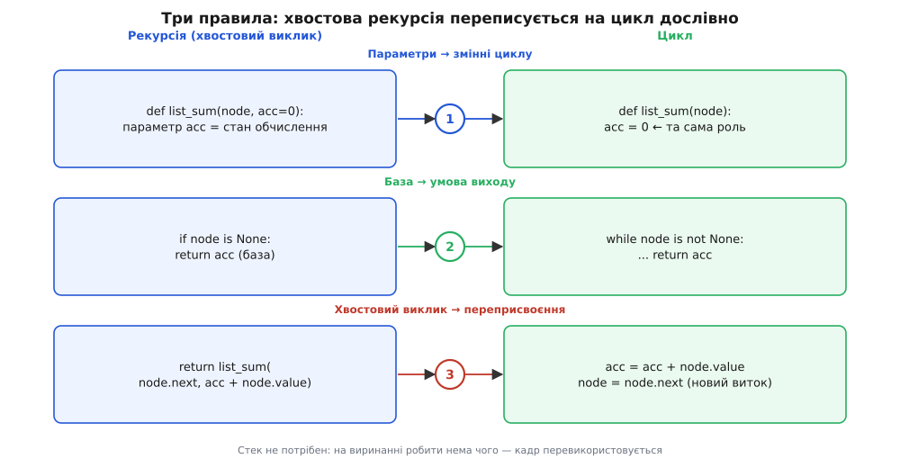
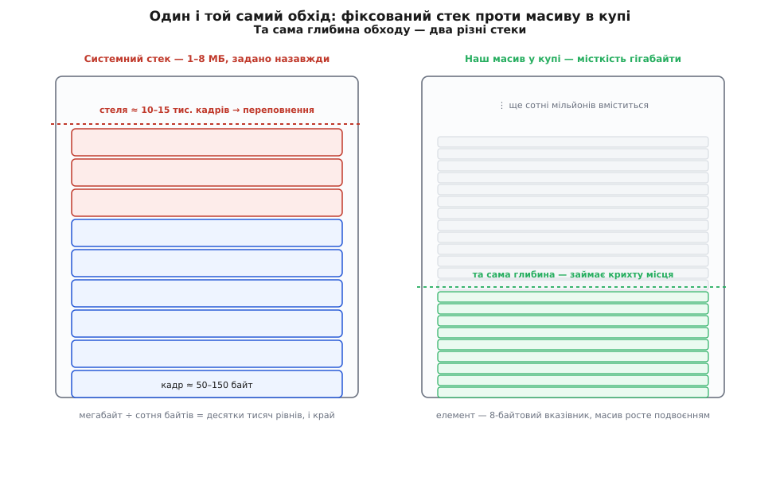

# ⚙️ Зняти рекурсію руками: хвіст у цикл, гілки — у власний стек

**Задача.** Рекурсивний код короткий і гарний, поки дані неглибокі. Але кожен вкладений виклик з'їдає кадр [системного стека](topic:sf-lang/stack-lifo) — тієї структури «останнім поклав — першим забрав», на якій тримається механізм викликів. А цей стек малий і фіксований: його розмір задають раз, при старті потоку, і змінити на льоту не можна (типово 1 МБ на Windows, 8 МБ на головному потоці Linux). Дерево завглибшки на сто тисяч рівнів — скісний ланцюжок вузлів, вироджене [дерево пошуку](topic:sf-algorithms/binary-search-tree), глибокий розбір довгого виразу — переповнить цей стек і [покладе програму](topic:sf-lang/stack-overflow), причому не чемним винятком, який можна впіймати, а жорстким аварійним завершенням. Тож треба вміти взяти будь-яку рекурсію й **механічно**, не переінакшуючи алгоритм, перекласти її на звичайний цикл — так, щоб її облік перекочував із крихкого системного стека туди, де місця вдосталь. Способів рівно два, і вибір між ними диктує сама форма рекурсії: хвостова зводиться до циклу з акумулятором, розгалужена — до циклу з власним явним стеком.

**Ідея.** Уся магія, яку рекурсія робить за нас непомітно, — це стекові дії. Занурюючись, машина запам'ятовує, де вона зупинилась і що ще має доробити; виринаючи, знімає ці записи згори вниз. Але записи, які лягають у **системний** стек, з тим самим успіхом можна класти у **свій** — у звичайний масив. І щойно стек стає нашим, ми успадковуємо контроль над його розміром: масив живе в купі, а не в тісній фіксованій ділянці потоку, тож там, де рекурсія впиралась у стелю на десятках тисяч рівнів, наш масив спокійно розростається на мільйони. Механічне перетворення — це, по суті, одне: перенести облік, який вів рантайм, у структуру, розмір якої обираємо ми.

## Хвостова рекурсія: коли пам'ятати нема чого

Почнімо з найлегшого випадку — коли рекурсивний виклик стоїть **останньою дією** функції й над його результатом уже нічого не роблять. Це називають хвостовим викликом, і його легкість не випадкова: якщо після виклику робити нема чого, то й пам'ятати про поточний кадр нема чого. Немає відкладеного множення, яке чекає на виринання; немає «повернутися сюди й дописати». Обчислення просто передає естафету далі й забуває про себе — а отже, його кадр можна не зберігати, а **перевикористати** під наступний виклик. Стек не росте зовсім.

Легко переплутати хвостовий виклик із будь-яким рекурсивним. Візьмімо суму однозв'язного списку — вузол зберігає значення й посилання на наступний. Ось природний, але **не** хвостовий запис:

```python
def list_sum(node):
    if node is None:
        return 0
    return node.value + list_sum(node.next)   # НЕ хвіст: додавання ПІСЛЯ виклику
```

Тут виклик `list_sum(node.next)` не остання дія: коли він повернеться, ще треба додати `node.value`. Отже, кожен кадр мусить дочекатися свого числа, і стек росте на всю довжину списку. Мільйон вузлів — мільйон кадрів — переповнення.

Ліки — **акумулятор**: замість того щоб додавати на виринанні, несемо суму вниз як зайвий аргумент. Тоді виклик стає справжнім хвостом:

```python
def list_sum(node, acc=0):
    if node is None:
        return acc
    return list_sum(node.next, acc + node.value)   # хвіст: виклик — остання дія
```

Тепер над результатом виклику нічого не роблять — його просто повертають вище незмінним. І саме така форма перекладається на цикл **дослівно, за трьома правилами**:

1. **Параметри функції стають змінними циклу.** У нас це `node` й `acc`.
2. **База стає умовою виходу.** `if node is None: return acc` перетворюється на `while node is not None`, а те, що база повертала, — на фінальний `return acc`.
3. **Хвостовий виклик стає переприсвоєнням і новим витком.** `list_sum(node.next, acc + node.value)` — це «продовжити з новими значеннями аргументів»; отже, присвоюємо змінним ці нові значення й крутимо цикл далі.

Застосуймо рецепт — і рекурсія зникає без сліду:

:::tabs
```python
def list_sum(node):
    acc = 0                       # 1. параметри → змінні
    while node is not None:       # 2. база → умова виходу
        acc = acc + node.value    # 3. новий acc з виклику
        node = node.next          #    новий node з виклику
    return acc                    # 2. те, що повертала база
```
```js
function listSum(node) {
  let acc = 0;                    // 1. параметри → змінні
  while (node !== null) {         // 2. база → умова виходу
    acc = acc + node.value;       // 3. новий acc з виклику
    node = node.next;             //    новий node з виклику
  }
  return acc;                     // 2. те, що повертала база
}
```
:::

Жодного стека — ні системного, ні власного. Список на сто мільйонів вузлів пройдеться в сталій пам'яті, бо на кожному витку живе рівно один комплект `node`/`acc`, а не сто мільйонів відкладених кадрів. Це і є весь виграш хвостового випадку: пам'ятати нема чого, тож і зберігати нема чого.


*Хвостова рекурсія й цикл — це один і той самий рух, записаний двома способами. Ліворуч функція кличе себе останньою дією; праворуч ті самі три частини стають трьома частинами циклу. Параметри перетворюються на змінні стану, база — на умову, за якої цикл спиняється, а хвостовий виклик — на «онови змінні й повторися». Стек не потрібен, бо на виринанні робити нема чого.*

> 🔧 **Навіщо це.** Той самий рецеп працює і в зворотний бік, коли рекурсія читається ясніше за плутаний цикл: побачивши три ролі — змінні стану, умову зупинки, оновлення, — ви впізнаєте хвостову рекурсію в будь-якому `while` і навпаки. А головне, він каже, **що саме** заважає циклу: якщо після виклику лишається робота (як те додавання `node.value`), рекурсія не хвостова, і простим циклом її не зняти — потрібен явний стек.

## Розгалужена рекурсія: носимо стек самі

Хвостовий трюк ламається, щойно виклик не один. Обхід дерева — де у вузла багато дітей і суму кожного піддерева треба **скласти разом** — не хвостовий за побудовою: після виклику на першій дитині ще чекають друга, третя, і їхні результати треба зібрати. Акумулятор одним числом тут не порятує: машині доводиться тримати цілий стос «куди повернутись і що ще обійти». Але ж це рівно той стос, що його вів системний стек, — тож заведімо його самі, звичайним масивом.

Рецепт розгалуженого випадку так само механічний. Замість системного стека кадрів — масив **ще-не-оброблених вузлів**. Кладемо в нього корінь. Далі, поки масив не порожній: знімаємо один вузол, робимо з ним свою справу, і **кладемо в масив усіх його дітей** — розберемося з ними на наступних витках. Порожній масив означає, що обходити більше нема кого.

Ось рекурсивний обхід — і його переклад на цикл із власним стеком, поряд:

:::tabs
```python
# рекурсивно: системний стек веде облік за нас
def tree_sum(node):
    total = node.value
    for child in node.children:
        total += tree_sum(child)
    return total

# ітеративно: стек ведемо ми — звичайним масивом
def tree_sum_iter(root):
    total = 0
    stack = [root]                   # ще-не-оброблені вузли
    while stack:                     # поки є що обробляти
        node = stack.pop()           # знімаємо один
        total += node.value
        for child in node.children:
            stack.append(child)      # дітей — у стек, на потім
    return total
```
```js
// рекурсивно: системний стек веде облік за нас
function treeSum(node) {
  let total = node.value;
  for (const child of node.children) total += treeSum(child);
  return total;
}

// ітеративно: стек ведемо ми — звичайним масивом
function treeSumIter(root) {
  let total = 0;
  const stack = [root];              // ще-не-оброблені вузли
  while (stack.length) {             // поки є що обробляти
    const node = stack.pop();        // знімаємо один
    total += node.value;
    for (const child of node.children) stack.push(child); // на потім
  }
  return total;
}
```
:::

Другий варіант довший і не такий прозорий, зате в ньому нема жодного самовиклику — а отже, і жодного системного кадру на кожен рівень. Уся глибина дерева тепер живе в масиві `stack`, а масив ми ростимо, скільки треба.

Найчіткіше «власний стек» видно на системній мові, де його доводиться заводити руками. У C стек — це шматок пам'яті з купи, який ми самі подвоюємо, коли він виповнюється (той самий прийом, яким growable-стеки горутин у Go ростуть через `copystack`). У Rust ту саму роль грає `Vec`, що розширюється сам:

:::tabs
```c
long tree_sum(Node *root) {
    // власний стек: масив вказівників у КУПІ, а не системний стек викликів
    size_t cap = 64, top = 0;
    Node **stack = malloc(cap * sizeof(Node *));
    stack[top++] = root;

    long total = 0;
    while (top > 0) {                       // поки стек не порожній
        Node *node = stack[--top];          // pop
        total += node->value;
        for (size_t i = 0; i < node->n_children; i++) {
            if (top == cap) {               // стек доріс — подвоюємо, як у Go
                cap *= 2;
                stack = realloc(stack, cap * sizeof(Node *));
            }
            stack[top++] = node->children[i];   // push
        }
    }
    free(stack);
    return total;
}
```
```rust
fn tree_sum(root: &Node) -> i64 {
    let mut total = 0;
    let mut stack: Vec<&Node> = vec![root];    // власний стек у купі; Vec росте сам
    while let Some(node) = stack.pop() {        // поки стек не порожній
        total += node.value;
        stack.extend(node.children.iter());     // дітей — у стек, на потім
    }
    total
}
```
:::

C-версія оголює механізм до кістки: `stack` — це буквально масив вказівників, `top` — індекс вершини, `push`/`pop` — запис у клітинку й зсув індексу, а `realloc` подвоює місткість, коли масив виповнюється. Нічого «магічного» в рекурсії не було — рівно ці дії робив за нас рантайм, тільки в іншому, тіснішому масиві.

## Чому власний стек не боїться глибини

Обидва стеки — і системний, і наш — тримають однакову кількість елементів: у пік це висота дерева, бо саме стільки предків чекає на кожному моменті. Уся різниця в тому, **де** ці елементи лежать і скільки там місця.

Системний стек — маленька ділянка, яку операційна система відрізає потокові при народженні: 1 МБ на Windows, 8 МБ на головному потоці Linux, а на побічних потоках часто ще менше. І кадр там дорогий: адреса повернення, збережений покажчик кадру, вкинуті на схов регістри, локальні змінні, вирівнювання — легко 50–150 байтів на виклик. Поділіть: мегабайт на сотню байтів — це десь десять-п'ятнадцять тисяч кадрів, і стек по вінця. Ось звідки та «межа в десятки тисяч»: не абстрактна, а прямий наслідок ділення розміру стека на розмір кадру. Python навіть не чекає справжнього краху — він ставить власну м'яку стелю рекурсії (`sys.getrecursionlimit()` за замовчуванням `1000`) і кидає чемний `RecursionError` задовго до того, як переповнення C-стека завалило б увесь інтерпретатор.

Наш стек — масив у купі, а купа міряється гігабайтами. Ба більше, у ньому лежать не важкі кадри, а самі лише вказівники на вузли — по 8 байтів. Мільйон вузлів углиб — це 8 МБ масиву; сто мільйонів — 800 МБ, і те, і те купа дає без вагань. Стеля глибини підскакує від десятків тисяч до сотень мільйонів: те саме скісне дерево, що звалило б рекурсію переповненням, ітеративний обхід пройде, навіть не спітнівши.


*Обидва стеки тримають однакову кількість елементів — висоту дерева, — але живуть у різних світах. Ліворуч системний стек: 1–8 МБ, задані назавжди при старті потоку, і важкі кадри по сотні байтів упираються в стелю на десятках тисяч рівнів — далі переповнення. Праворуч наш масив у купі: місткість — гігабайти, елемент — 8-байтовий вказівник, і він росте подвоєнням, скільки треба. Глибина, що вбиває рекурсію, для явного стека — дрібниця.*

Тут ховається пастка, у яку легко впасти на радощах. Перехід на цикл **не зменшує** асимптотичну пам'ять. І рекурсія, і явний стек у пік тримають `O(h)` елементів, де `h` — висота дерева; для виродженого, скісного дерева це `O(n)`, тобто всі вузли одразу. Ми не прибрали цю пам'ять — ми **перенесли** її з тісного системного стека в місткий масив на купі. Складність та сама, змінилося тільки те, куди вона лягає й скільки там простору. Плутати ці дві речі — класична помилка: «переписав на цикл, тепер O(1) пам'яті» справедливе **лише** для хвостового випадку з акумулятором; для розгалуженого стек нікуди не дівається, він просто ваш.

## Коли переходити — і що вміє мова

Отже, вибір. Рекурсія майже завжди коротша й ближча до означення задачі, тож читається легше й помиляються в ній рідше. Явний стек — багатослівний і легше зіпсувати. Тому за замовчуванням пишуть рекурсію, а на цикл свідомо переходять, коли справджується щось одне з двох: **глибина реально може сягнути небезпечної зони** (десятки тисяч рівнів — глибокі дерева, довгі списки, обхід файлової системи на злих даних), або це **гарячий шлях**, де на кожному виклику шкода віддавати такти на його оформлення.

Тут вирішальним стає те, чи вміє ваша мова знімати хвостову рекурсію **сама** — оптимізація хвостового виклику (TCO, tail-call optimization). Якщо вміє, хвостовий випадок можна не чіпати: компілятор чи рантайм перевикористає кадр за вас, і глибина перестане бути проблемою. Якщо ні — доведеться знімати руками тим самим циклом з акумулятором. І мови тут разюче розходяться.

**Гарантують хвостовий виклик** — там глибока хвостова рекурсія є нормальним, безпечним ідіомом:

- **Scheme** вимагає TCO прямо в стандарті: реалізація мусить підтримувати необмежену кількість активних хвостових викликів (R7RS). Це була одна з центральних ідей Scheme від Стіла й Сассмена — і перша мова родини Lisp, що зробила TCO обов'язковим.
- **Lua** робить «правильні хвостові виклики» з версії 5.0: коли функція повертає результат іншого виклику, поточний кадр перевикористовується, і глибина необмежена — хвостовий виклик тут, за словами авторів, це «goto, вбраний у виклик».
- **Erlang** і вся родина на віртуальній машині BEAM (зокрема **Elixir**) роблять «оптимізацію останнього виклику» — без неї нескінченні цикли-сервери акторної моделі просто не існували б.
- **Scala** (`@tailrec`) і **Kotlin** (`tailrec`) перетворюють самохвостову рекурсію на цикл на етапі компіляції — і, що цінно, **сваряться помилкою**, якщо ви позначили функцію, яка насправді не хвостова. Позначка тут ще й перевірка.

**Не гарантують** — там глибока хвостова рекурсія все одно переповнить стек, і знімати її треба самому:

- **Python** свідомо відмовився від TCO. Ґвідо ван Россум у замітці «Final Words on Tail Calls» (квітень 2009) назвав це «неpythonic»: TCO стирає кадри, а з ними — читабельний traceback, за який Python тримається понад усе.
- **JavaScript**: стандарт ES2015 хвостові виклики **приписав**, але з великих рушіїв їх до кінця довів лише JavaScriptCore (Safari). V8 (Chrome, Node.js) реалізував і **вимкнув** через ті самі клопоти з налагодженням і стеком помилок, а SpiderMonkey (Firefox) так і не випустив. Тож у Node глибока хвостова рекурсія падає — знімайте руками.
- **Go** TCO не робить, але його стек росте динамічно (горутина стартує з пари кілобайтів і подвоюється), тож витримує набагато глибшу рекурсію, поки не впреться у власну, значно вищу стелю (за замовчуванням близько гігабайта). Пом'якшення, а не розв'язок.
- **Java** (HotSpot) TCO не робить: у байткоді JVM просто немає інструкції хвостового виклику.
- **C/C++**: компілятори роблять «оптимізацію споріднених викликів» на `-O2` (`-foptimize-sibling-calls` у GCC), але **не гарантують** її — покластися на неї для коректності не можна. Хочете гарантії — у Clang є атрибут `[[clang::musttail]]`, що змушує хвостовий виклик або дає помилку компіляції, якщо це неможливо.
- **Rust** історично гарантованого TCO не мав; ключове слово `become` зарезервоване саме під нього, а експериментальна підтримка гарантованих хвостових викликів з'явилася в nightly наприкінці 2024-го. Тому ідіоматичний глибокий обхід у Rust — це рівно той `Vec`-стек, що вище.

Мораль проста: якщо мова не гарантує TCO, хвіст не рятує сам собою — цикл з акумулятором і є ручна TCO, яку компілятор за вас не зробив.

## Пастки й складність

**Порядок обходу тихо змінюється.** Масив — це стек (LIFO): останній покладений виймається першим. Тож коли ви штовхаєте дітей зліва направо, виймаються вони справа наліво — обхід дзеркалиться проти рекурсивного. Для суми байдуже (додавання не залежить від порядку), але щойно порядок важить — друк, збір рядка, нумерація — це готовий баг. Ліки: або кладіть дітей у зворотному порядку, або тримайте в голові, що явний стек перевертає черговість.

**Дія «після дітей» простим стеком не робиться.** Найглибша пастка. Наш цикл обробляє вузол **перед** тим, як спуститися до дітей (це обхід у прямому порядку, pre-order). Але купа задач вимагає обробити вузол **після** дітей (зворотний порядок, post-order): порахувати значення [синтаксичного дерева](topic:sf-lang/abstract-syntax-tree), де операція чекає на обидва операнди; звільнити дерево, де батька можна прибрати лише після піддерев. Одного `push` тут замало — на момент, коли ми знімаємо вузол, результатів його дітей ще нема. Класичний прийом — покласти вузол зі **прапорцем «діти вже розкриті»** і повернутися до нього вдруге, коли їхні значення вже готові:

```python
def eval_tree(root):
    stack = [(root, False)]              # False = діти ще не розкриті
    ready = []                           # готові значення піддерев
    while stack:
        node, expanded = stack.pop()
        if node.is_leaf():
            ready.append(node.value)
        elif not expanded:
            stack.append((node, True))   # повернемось ПІСЛЯ дітей
            stack.append((node.right, False))
            stack.append((node.left, False))   # лівий згори — вийметься першим
        else:                            # діти вже пораховані — беремо їхні значення
            b = ready.pop(); a = ready.pop()
            ready.append(apply(node.op, a, b))
    return ready.pop()
```

Друге зняття того самого вузла (`expanded == True`) настає вже після того, як обидві його дитини пройшли повний цикл і лишили значення в `ready`, — і аж тоді виконується операція. Це і є ручна імітація виринання, яке в рекурсії давалося задарма. Якщо помітили, що переклад на цикл раптом став плутаним, — майже напевно ви маєте справу з post-order і намагаєтесь обійтися без прапорця.

**Порожній стек і забута база.** Дзеркало забутої бази в рекурсії: цикл `while stack` захищає від виходу за порожній масив, але варто десь зняти елемент без перевірки — і `pop` порожнього стека кине помилку. Перша умова циклу — завжди «поки є що обробляти».

**Складність.** За часом обидва варіанти однакові — `O(n)`: кожен вузол обробляється рівно раз, кожен кладеться й знімається рівно раз. За пам'яттю теж однаково — `O(h)` за висотою (для скісного дерева `O(n)`), і, як уже сказано, цикл цю пам'ять не прибирає, а лише переносить у купу. Реальний виграш — не в асимптотиці, а в **сталих**: рекурсивний виклик несе оформлення за [угодою про виклик](topic:hw-arch/calling-convention) — пролог, епілог, схов і відновлення регістрів, передача аргументів, — а виток циклу з явним стеком коштує кількох записів у масив і зсуву індексу. На мільйонах вузлів гарячого шляху ця різниця відчутна. Але й платня є: масив у купі треба виділити, `realloc` іноді копіює його цілком, а для неглибоких дерев компактний системний стек лягає на кеш ліпше за розкидану купу. Тому дрібне й неглибоке лишають рекурсією — виграш сталих там менший за втрату ясності.

---

**Коротко.** Будь-яку рекурсію можна механічно зняти на цикл, бо все, що вона робить, — стекові дії, а стек можна вести й самому. Хвостову (виклик — остання дія, над результатом нічого не роблять) знімають циклом з акумулятором за трьома правилами: параметри → змінні, база → умова виходу, хвостовий виклик → переприсвоєння й новий виток; стек при цьому не потрібен зовсім, пам'ять стала. Розгалужену (кілька викликів, результати зливаються) знімають циклом із **власним явним стеком** — масивом ще-не-оброблених вузлів у купі: кладемо корінь, а тоді поки не порожньо — знімаємо вузол, обробляємо, кладемо дітей. Такий стек не боїться глибини, бо купа велика (гігабайти), а елемент дешевий (8-байтовий вказівник), тоді як системний стек малий (1–8 МБ) і фіксований, а кадр важкий (сотні байтів) — звідси й межа рекурсії в десятки тисяч. Переходять на цикл, коли глибина реально сягає тієї межі або на гарячому шляху, де накладні виклику дорогі; і надто коли мова не робить TCO сама — Python (свідома відмова), Node/JS, Java, Go, стоковий C/C++ і стабільний Rust хвіст не знімають, тоді як Scheme, Lua, Erlang/Elixir, Scala й Kotlin знімають. Пастки: LIFO перевертає порядок обходу; дія «після дітей» (post-order — обчислення виразу, звільнення дерева) простим стеком не робиться, потрібен прапорець «діти розкриті» й друге зняття вузла; а головне — цикл не зменшує асимптотичну пам'ять `O(h)`, він лише переносить її туди, де місця вдосталь.
