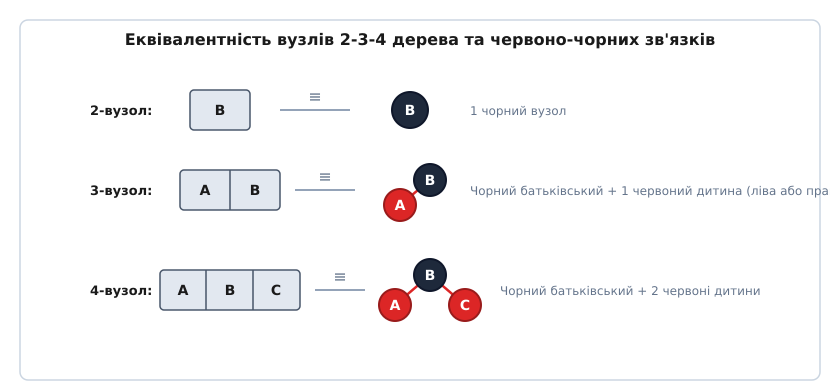
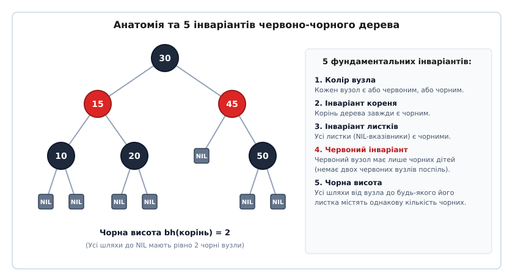
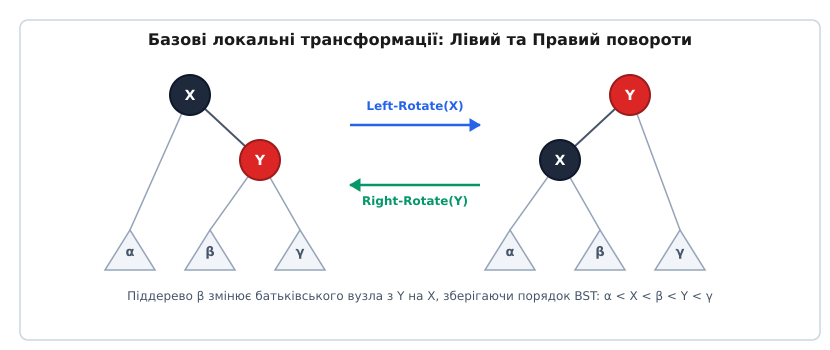
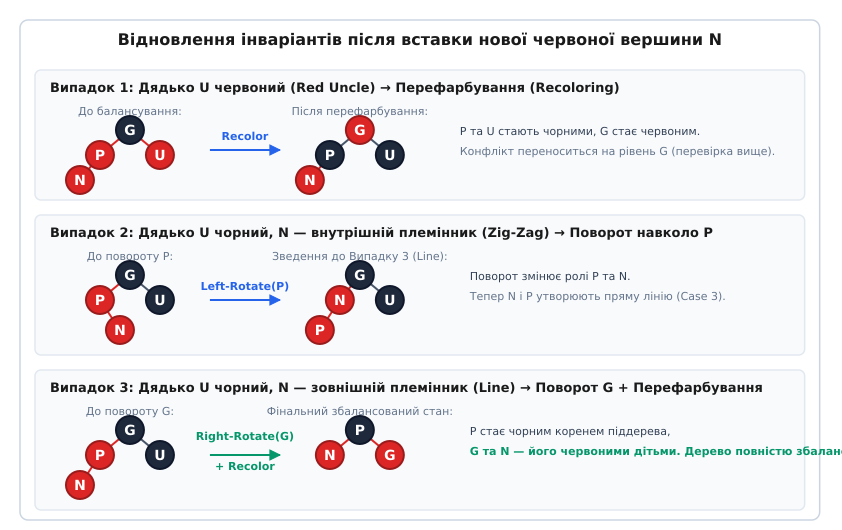

# Червоно-чорне дерево (Red-Black Tree)

<preknowlist>
- [Бінарне дерево пошуку](root:sf-algorithms/binary-search-tree) — порядок розташування ключів (ліворуч менші, праворуч більші) та базові операції пошуку.
- [AVL-дерево](root:sf-algorithms/avl-tree) — строге балансування за різницею висот піддерев та механізм поворотів.
</preknowlist>

Ззвичайне бінарне дерево пошуку забезпечує високу швидкість виконання операцій лише доти, доки його топологія залишається збалансованою. Якщо на вхід подаються впорядковані або частково впорядковані дані (наприклад, ключі 1, 2, 3, 4, 5, що додаються послідовно), кожен новий вузол стає правою дитиною попереднього. Дерево миттєво вироджується у звичайний однозв'язний список, де глибина останнього вузла досягає кількості елементів `n`. У цій ситуації асимптотична складність операцій пошуку, вставки та вилучення сповільнюється від ідеального логарифмічного часу `O(log n)` до лінійного `O(n)`. Щоб уникнути подібної деградації продуктивності, алгоритми збалансованих дерев контролюють свою внутрішню геометрію та виконують самобалансування після кожної модифікації.

AVL-дерево усуває виродження за допомогою суворого геометричного інваріанту: різниця висот лівого та правого піддерев для будь-якого вузла не може перевищувати 1. Однак ціною такого ідеального балансу є висока чутливість до операцій модифікації. При частих вставках та вилученнях елементів AVL-дерево витрачає значний обсяг процесорного часу на постійне виконання каскадних поворотів вздовж усього шляху до кореня.

Червоно-чорне дерево (Red-Black Tree) розроблене для досягнення оптимуму між якістю балансу та швидкістю оновлення даних. Воно свідомо послаблює вимоги до геометрії: найдовша гілка від кореня до листка може перевищувати найкоротшу гілку максимум удвічі. Це гарантує строгу логарифмічну межу висоти `h ≤ 2 log₂(n + 1)`, але вимагає суттєво менше поворотів під час вставки та вилучення. Баланс підтримується за рахунок збереження 1 біта додаткової інформації у кожному вузлі — його кольору (червоного або чорного).

Детальний процес історичного створення цієї структури — від первинних симетричних бінарних B-дерев Рудольфа Баєра до кольорового лазерного принтера Xerox PARC — висвітлено у вставці [Історія виникнення червоно-чорного дерева](root:sf-algorithms/red-black-tree/hist-rbt.md).

---

## Першопричина: Ізоморфізм із 2-3-4 деревами

Щоб зрозуміти причину виникнення інваріантів червоно-чорного дерева, необхідно розглядати його як бінарну репрезентацію 2-3-4 дерева (яке є B-деревом порядку `m = 4`).

У 2-3-4 дереві кожен внутрішній вузол залежно від кількості збережених ключів поділяється на три категорії:
- **2-вузол:** містить 1 ключ і має 2 дочірніх вказівники.
- **3-вузол:** містить 2 ключі і має 3 дочірніх вказівники.
- **4-вузол:** містить 3 ключі і має 4 дочірніх вказівники.

Усі листки у 2-3-4 дереві завжди знаходяться на абсолютно однаковій глибині від кореня. Завдяки цьому 2-3-4 дерево володіє абсолютним балансом. Проте пряма реалізація 2-3-4 дерева у пам'яті вимагає збереження масивів ключів та вказівників у кожному вузлі, що викликає значний оверхед пам'яті та ускладнює програмний код через наявність вузлів змінного розміру.

*Моделювання 2-вузлів, 3-вузлів та 4-вузлів B-дерева через червоні й чорні вузли бінарного дерева.*

Червоно-чорне дерево елегантно розв'язує цю проблему, моделюючи мульти-вузли 2-3-4 дерева за допомогою звичайних бінарних вузлів із 1 бітом кольору:
1. **2-вузол** репрезентується одним чорним бінарним вузлом.
2. **3-вузол** репрезентується чорним батьківським вузлом та одним його червоним дочірнім вузлом. Зв'язок між червоним та чорним вузлом є «горизонтальним» зв'язком усередині одного 3-вузла.
3. **4-вузол** репрезентується чорним батьківським вузлом та двома його червоними дочірніми вузлами.

Оскільки кожен вузол 2-3-4 дерева відповідає рівно одному чорному вузлу у червоно-чорному представленні, вимога рівної глибини листків у 2-3-4 дереві природним чином перетворюється на рівність кількості чорних вузлів на всіх шляхах від кореня до листків.

---

## 5 Інваріантів червоно-чорного дерева

Бінарне дерево пошуку називається червоно-чорним, якщо кожен його вузол містить колірний атрибут (Червоний або Чорний) і задовольняє п'яти фундаментальним інваріантам:

1. **Колір вузла:** Кожен вузол є або червоним, або чорним.
2. **Інваріант кореня:** Корінь дерева завжди є чорним. (Якщо у результаті модифікації корінь стає червоним, його фарбують у чорний колір без порушення решти інваріантів).
3. **Інваріант листків (NIL):** Усі листові вказівники, які не містять корисних даних (фіктивні вказівники `NIL` або `null`), вважаються чорними.
4. **Червоний інваріант (відсутність послідовних червоних вузлів):** Якщо вузол червоний, то обидва його дочірніх вузли є чорними. (У дереві не може існувати двох червоних вузлів, з'єднаних безпосередньо батьківсько-дитячим зв'язком).
5. **Інваріант чорної висоти:** Усі шляхи від будь-якого обраного вузла до будь-якого з його листових `NIL`-вказівників містять однакову кількість чорних вузлів.

*Інваріанти червоно-чорного дерева та збереження рівності чорної висоти для всіх шляхів до NIL-листків.*

Кількість чорних вузлів на шляху від вузла `x` до листка (не включаючи сам вузол `x`) називається **чорною висотою** `bh(x)`.

Завдяки червоному інваріанту (інваріант 4) червоні вузли на будь-якому шляху можуть з'являтися лише через один чорний вузол. Найкоротший можливий шлях від кореня до листка складається виключно з чорних вузлів (довжина `bh`). Найдовший можливий шлях чергує червоні та чорні вузли (довжина не більше `2 · bh`).

Звідси випливає головна геометрична гарантія: найдовший шлях від кореня до листка не може перевищувати найкоротший шлях більше ніж у 2 рази.

Формальне доведення того, чому з цих 5 інваріантів випливає логарифмічна межа висоти `h ≤ 2 log₂(n + 1)`, наведено у вставці [Математичне обґрунтування межі висоти](root:sf-algorithms/red-black-tree/math-rb-bounds.md).

---

## Базові трансформації: Повороти та Перефарбування

При додаванні чи видаленні вузлів інваріанти 4 та 5 можуть порушитися. Для їх відновлення використовуються дві локальні операції:
1. **Перефарбування (Recoloring):** Зміна кольору вузла з червоного на чорний або навпаки. Виконується за `O(1)` часу без зміни геометрії зв'язків.
2. **Повороти (Rotations):** Локальна перебудова вказівників між батьком та дитиною зі збереженням симетричного порядку ключів бінарного дерева пошуку (`Left-Rotate` та `Right-Rotate`).

*Локальна зміна топології дерева через Лівий та Правий повороти із збереженням порядку BST.*

При Лівому повороті `Left-Rotate(tree, X)` вузол `Y` (правий син `X`) піднімається на місце `X`. Його ліве піддерево `β` стає новим правим піддеревом `X`. Порядок ключових елементів `α < X < β < Y < γ` залишається незмінним.

При Правому повороті `Right-Rotate(tree, Y)` вузол `X` (лівий син `Y`) піднімається на місце `Y`, а його праве піддерево `β` стає новим лівим піддеревом `Y`.

---

## Детальний алгоритм вставки (Insert)

Новий ключ завжди вставляється у дерево на місце листка у вигляді **червоного вузла** `N` (Node).

Вибір червоного кольору для нової вершини є свідомим: вставка червоного вузла **гарантовано зберігає інваріант 5** (чорна висота усіх шляхів не змінюється). Єдине правило, яке може порушитися — це інваріант 4, якщо батько `P` (Parent) нової вершини виявиться червоним.

Якщо батько `P` чорний, вставка завершується одразу. Якщо `P` червоний, виникає конфлікт двох червоних вузлів підряд. Оскільки корінь дерева чорний, у червоного батька `P` обов'язково існує чорний дідусь `G` (Grandparent), а також дитина дідуся — дядько `U` (Uncle) вставленого вузла.

Польдаші дії поділяються на 3 основні випадки залежно від кольору дядька `U`.

*Відновлення інваріантів при вставці: перефарбування при червоному дядькові та повороти при чорному дядькові.*

### Випадок 1: Дядько U є червоним (Red Uncle)
Ситуація відповідає расщепленню переповненого 4-вузла у 2-3-4 дереві.
- **Умова:** Батько `P` червоний і дядько `U` червоний.
- **Дія:** Батько `P` та дядько `U` перефарбовуються у чорний колір, а дідусь `G` фарбується у червоний колір.
- **Наслідок:** Чорна висота піддерева `G` залишається незмінною (раніше шлях проходив через 1 чорний вузол `G`, тепер проходить через 1 чорний вузол `P` або `U`). Червоний конфлікт переноситься на рівень дідуся `G`. Алгоритм перевірки піднімається вгору за деревом для вузла `G`.

### Випадок 2: Дядько U чорний, N — внутрішній племінник (Zig-Zag)
- **Умова:** Батько `P` червоний, дядько `U` чорний, а вузол `N` знаходиться з внутрішнього боку відносно гілки `G-P` (наприклад, `P` є лівим сином `G`, а `N` — правим сином `P`).
- **Дія:** Виконується `Left-Rotate(tree, P)`.
- **Наслідок:** Вузол `P` опускається нижче, а `N` займає його позицію. Конфігурація зводиться до Випадку 3, де вузли `G`, `N` та `P` утворюють пряму лінію.

### Випадок 3: Дядько U чорний, N — зовнішній племінник (Line)
- **Умова:** Батько `P` червоний, дядько `U` чорний, а вузол `N` знаходиться із зовнішнього боку гілки (і `P`, і `N` є лівими дітьми своїх батьків).
- **Дія:** Батько `P` фарбується у чорний колір, дідусь `G` — у червоний, і виконується `Right-Rotate(tree, G)`.
- **Наслідок:** Вузол `P` стає чорним коренем піддерева з червоними дітьми `N` та `G`. Конфлікт повністю усувається, а чорна висота піддерева зберігається. Балансування дерева завершується.

Завдяки такій побудові, алгоритм вставки виконує **не більше 2 поворотів** за всю операцію.

---

## Простеження прикладу побудови дерева

Розглянемо покрокове створення червоно-чорного дерева при додаванні ключів у послідовності: `10, 20, 30, 15`.

1. **Вставка 10:** Вузол вставляється як корінь. За інваріантом 2 корінь примусово фарбується у чорний колір. Дерево: `(10:BLACK)`.
2. **Вставка 20:** Вузол 20 вставляється як права дитина 10 у вигляді червоного вузла. Батько чорний — конфлікту немає. Дерево: `10(B) -> 20(R)`.
3. **Вставка 30:** Вузол 30 вставляється як права дитина 20 у вигляді червоного вузла. Батько 20 червоний, дядько `nil` чорний. Конфігурація Line (Випадок 3). Батько 20 фарбується у чорний, дідусь 10 — у червоний, і виконується `Left-Rotate(10)`. Новий корінь дерева — 20. Дерево: `20(B)` з дітьми `10(R)` та `30(R)`.
4. **Вставка 15:** Вузол 15 вставляється як права дитина 10 у вигляді червоного вузла. Батько 10 червоний, дядько 30 червоний (Випадок 1). Виконується перефарбування: 10 та 30 стають чорними, корінь 20 стає червоним, але за інваріантом 2 корінь одразу перефарбовується у чорний. Дерево збалансоване!

---

## Детальний алгоритм вилучення (Delete)

Вилучення вузла з червоно-чорного дерева є складнішим за вставку, оскільки вилучення чорного вузла зменшує чорну висоту гілки, що порушує інваріант 5.

Якщо вилучається червоний вузол, колір просто зникає, і жоден інваріант не порушується. Якщо ж вилучається чорний вузол, на його місце встає його дитина `x`, яка приймає на себе **«подвійну чорноту» (Double Black)**. Подвійна чорнота додає +1 до чорної висоти шляху, компенсуючи втрачений чорний вузол.

Процедура `rbtree_delete_fixup` просуває подвійну чорноту вгору за допомогою 4 випадків конфігурацій брата `S` (Sibling):

### Випадок 1: Брат S є червоним
- **Умова:** Брат `S` червоний. Батько `P` обов'язково чорний.
- **Дія:** Брат `S` фарбується у чорний колір, батько `P` — у червоний, і виконується `Left-Rotate(tree, P)`.
- **Наслідок:** Новим братом вузла `x` стає чорна дитина колишнього брата `S`. Ситуація зводиться до випадків 2, 3 або 4.

### Випадок 2: Брат S чорний, і обидва його сини чорні
- **Умова:** Брат `S` чорний, а обидві його дитини `S->left` та `S->right` є чорними (або `NIL`).
- **Дія:** Подвійна чорнота знімається з `x`, брат `S` фарбується у червоний колір, а додаткова чорнота передається батькові `P`.
- **Наслідок:** Якщо батько `P` був червоним, він стає просто чорним, і балансування завершується. Якщо `P` був чорним, він приймає подвійну чорноту, і процес продовжується вище за деревом.

### Випадок 3: Брат S чорний, ближній син S червоний, далекий — чорний
- **Умова:** Брат `S` чорний, його ліва дитина червона, а права дитина чорна.
- **Дія:** Брат `S` фарбується у червоний, його ліва дитина — у чорний, і виконується `Right-Rotate(tree, S)`.
- **Наслідок:** Новим братом `S` стає червона дитина, і ситуація перетворюється на Випадок 4.

### Випадок 4: Брат S чорний, далекий син S червоний
- **Умова:** Брат `S` чорний, а його права дитина червона.
- **Дія:** Колір брата `S` копіює колір батька `P`, батько `P` фарбується у чорний, права дитина `S` фарбується у чорний, і виконується `Left-Rotate(tree, P)`.
- **Наслідок:** Подвійна чорнота повністю усувається, а дерево стає повністю збалансованим.

Операція вилучення виконує **не більше 3 поворотів** у найгіршому випадку.

Повну програмну реалізацію алгоритмів наведено у вставці [Реалізація червоно-чорного дерева на C та C++](root:sf-algorithms/red-black-tree/proj-rbt-impl.md).

---

## Модифікація LLRB (Left-Leaning Red-Black Trees)

У 2008 році Роберт Седжвік запропонував спрощену версію червоно-чорного дерева під назвою **Left-Leaning Red-Black Trees (LLRB)**.

Головна ідея LLRB полягає у тому, що червоні зв'язки дозволяється спрямовувати виключно вліво. Правосторонні червоні зв'язки вважаються тимчасовим порушенням інваріанту та негайно ліквідуються за допомогою одного Лівого повороту (`Left-Rotate`).

Завдяки цьому обмеженню:
- 3-вузли завжди мають лише одну стандартну конфігурацію (чорний батько + його ліва червона дитина).
- Кількість крайових випадків при вставці та вилученні зменшується у 2-3 рази.
- Код вставки виглядає як звичайний рекурсивний алгоритм для 2-3 дерева, де після рекурсивного виклику додаються лише три короткі умови з поворотами та перефарбуванням.

---

## Системні застосування та Оптимізації пам'яті

Фіксована кількість поворотів при оновленнях (`O(1)` поворотів за операцію) робить червоно-чорне дерево ідеальним вибором для систем з високою інтенсивністю оновлень у пам'яті.

> 🔧 **Навіщо це.**
>
> 1. **Планувальник процесів Linux (CFS — Completely Fair Scheduler):** Ядро Linux зберігає всі активні задачі у червоно-чорному дереві, впорядкованому за віртуальним часом виконання (`vruntime`). Пошук найменш завантаженої задачі займає `O(1)` завдяки збереженню найлівішого вказівника `rb_leftmost`, а оновлення позиції після виконання вимагає `O(log n)`.
> 2. **Мультиплексор подій `epoll` у Linux:** Використовує червоно-чорне дерево для зберігання файлових дескрипторів сокетів. Це гарантує логарифмічний час додавання та видалення сокетів під час обробки мільйонів мережевих з'єднань.
> 3. **Стандартна бібліотека C++ (STL):** Контейнери `std::set`, `std::map`, `std::multiset` та `std::multimap` реалізовані на основі червоно-чорного дерева, забезпечуючи логарифмічну складність знаходження та впорядкований обхід елементів.

### Упаковка кольору (Pointer Tagging) у ядрі Linux

У 64-бітних архітектурах вказівники вирівняні по 8-байтовій межі. Це означає, що три молодші біти будь-якої адреси вузла завжди дорівнюють 0. Оскільки колір вузла приймає лише два значення (RED або BLACK), розробники ядра Linux задіють найнижчий біт вказівника на батьківський вузол `parent_color` для зберігання прапорця кольору (0 для RED, 1 для BLACK). Така упаковка позбавляє структуру вузла від оверхеду окремого поля кольору.

Повний опис API, структури вузлів та порівняння з AVL й B-деревами міститься у вставці [Довідник API та специфікація червоно-чорного дерева](root:sf-algorithms/red-black-tree/api-rbt.md).
