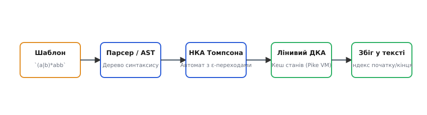
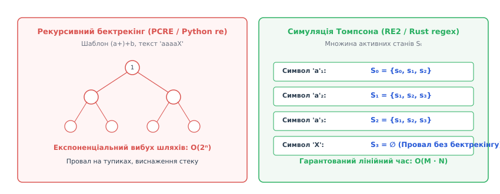
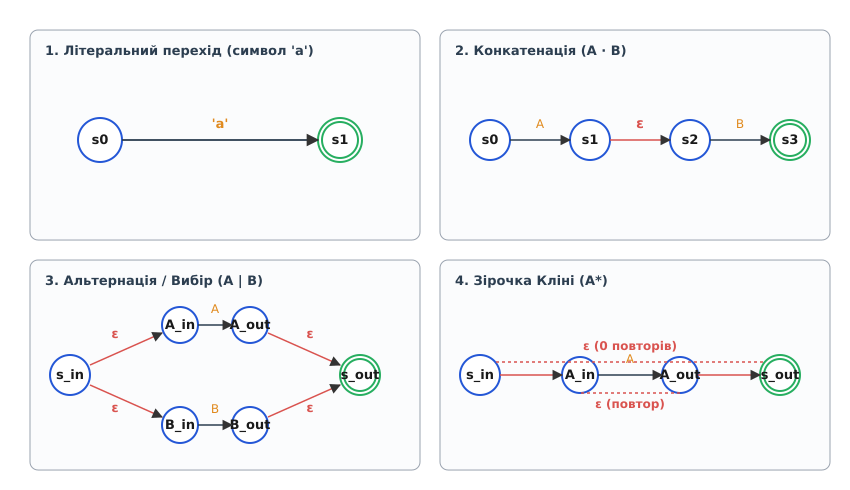

# Рушій регулярних виразів

<preknowlist>
- [Синтаксичне дерево (AST)](topic:sf-lang/abstract-syntax-tree) — структура для представлення ієрархічних виразів у пам'яті.
- [Пошук із поверненням](topic:sf-algorithms/backtracking) — рекурсивний перебір шляхів у деревоподібному просторі станів.
- [Мінімізація станів](topic:computability/state-minimization) — факторизація еквівалентних станів у скінченному автоматі.
</preknowlist>

Пошук підрядка за фіксованим текстом розв'язується за лінійний час класичними алгоритмами (такими як Кнут-Морріс-Пратт або Боєр-Мур), проте в реальних системах обробки даних — від текстових редакторів до вебсерверних фаєрволів — виникає потреба шукати шаблони змінної структури з масками, повтореннями та альтернативами. Спроба обробляти подібні шаблони набором кастомних умовних операторів швидко призводить до заплутаного коду, який неможливо розширювати чи підтримувати. Для формалізації цієї задачі використовують регулярні вирази (з латини *regularis* — «впорядкований, правильний») — алгебраїчну нотацію, що задає формальну мову над певним алфавітом. Програмний компонент, який приймає такий текстовий шаблон, інтерпретує його внутрішню структуру та зіставляє з вхідним потоком символів, називається рушієм регулярних виразів.


*_Конвеєр обробки регулярного виразу: від текстового шаблону через AST та автомат Томпсона до лінивого ДКА та пошуку збігів._*

## Фундаментальний розкол: Рекурсивний бектрекінг проти автоматів

Усі існуючі рушії регулярних виразів поділяються на два принципово різних класи за способом виконання: рушії на основі рекурсивного пошуку з поверненням (бектрекінгу, з англійської *backtracking*) та рушії на основі скінченних автоматів (з грецької *automatos* — «саморушний»).

### Бектрекінгові рушії (NFA-backtracking)

Бектрекінговий рушій (використовується в PCRE, Python `re`, Java `java.util.regex`, .NET, JavaScript) сприймає регулярний вираз як програму зіставляння. Він розбирає шаблон у дерево рішень і намагається пройти його вглиб (обхід у глибину, DFS). Якщо на якомусь кроці символ тексту не відповідає поточній гілці шаблону, рушій відкочує стан вхідного потоку назад до останньої точки вибору і пробує іншу альтернативу.

Головна перевага бектрекінгу — висока виразність. Оскільки рушій зберігає повний стек викликів та історії збігів, він здатний легко підтримувати розширені оператори:
- **Захоплювальні групи** (capturing groups): збереження знайдених підрядків для подальшого витягування.
- **Зворотні посилання** (backreferences, наприклад `\1` або `\2`): вимога, щоб поточна частина тексту збігалася з підрядком, знайденим раніше.
- **Проглядання вперед та назад** (lookaround assertions `(?=...)`, `(?!...)`): перевірка контексту без споживання символів вхідного тексту.

Однак цей підхід має фатальну ваду — **катастрофічний бектрекінг** (ReDoS — *Regular Expression Denial of Service*). Якщо шаблон містить вкладені квантифікатори (з латини *quantitas* — «кількість»), такі як `(a+)+b`, а вхідний текст складається з послідовності 'a', за якою іде символ 'X', бектрекінговий рушій починає перебирати всі можливі варіанти групування символів 'a' між внутрішнім та зовнішнім плюсом.

Кількість шляхів у дереві перебору для шаблону `(a+)+b` на тексті довжиною `N` описується комбінаторним вибухом:

```
T(N) = 2ⁿ⁻¹
T(10) = 512 варіантів
T(30) = 536,870,912 варіантів
T(60) = 576,460,752,303,423,488 варіантів
```

Для тексту довжиною лише 60 символів рекурсивному рушію знадобляться сотні років обчислювального часу. Це призводить до повної відмови обслуговування сервісів при отриманні некоректних або зловмисних даних.


*_Порівняння двох підходів до виконання: експоненціальне дерево рекурсивного бектрекінгу проти паралельного просування множини станів Pike VM._*

### Автоматні рушії (Thompson NFA / DFA)

Автоматні рушії (використовуються в RE2, Go `regexp`, Rust `regex`, Hyperscan) спираються на теорію формальних мов Кліні та алгоритм Кена Томпсона. Вони перетворюють шаблон у графову структуру — Скінченний Автомат.

Замість того щоб проходити шляхи графа по черзі з поверненнями, автоматний рушій просуває по графу **множину всіх можливих активних станів одночасно**. При зчитуванні одного символу з тексту автомат робить один крок переходу для всіх станів у поточній множині.

Це забезпечує жорсткі інженерні гарантії:
- **Часова складність**: Верхня межа часу виконання становить строго `O(M · N)`, де `M` — кількість станів у графі шаблону, а `N` — довжина вхідного тексту.
- **Пам'ять**: Обсяг оперативної пам'яті обмежений `O(M)` і не залежить від довжини вхідного тексту чи глибини вкладеності операторів.
- **Відсутність ReDoS**: Катастрофічний бектрекінг неможливий фізично, оскільки кожен символ тексту обробляється за фіксований час.

Докладний розгляд еволюції рушіїв та боротьби двох підходів наведено у вставці [Історія регулярних виразів](topic:sf-algorithms/regex-engine/hist-regex-engine.md).

## Конструкція Томпсона: Перетворення шаблону в НКА

Фундаментом автоматного підходу є алгоритм побудови Недетермінованого Скінченного Автомата (НКА) з `ε`-переходами (порожніми переходами, що не споживають символ тексту), запропонований Кеном Томпсоном у 1968 році.

НКА визначається як п'ятірка `(Q, Σ, δ, q₀, F)`, де:
- `Q` — скінченна множина станів;
- `Σ` — вхідний алфавіт символів;
- `δ: Q × (Σ ∪ {ε}) → P(Q)` — функція переходів, яка повертає множину наступних станів;
- `q₀ ∈ Q` — початковий стан;
- `F ⊆ Q` — множина термінальних (приймаючих) станів.

Алгоритм Томпсона будує автомат рекурсивно або ітеративно за допомогою стека на основі чотирьох базових структурних інваріантів. Кожна побудована фрагментарна мережа має **точно один вхідний стан** і **точно один вихідний стан** без вихідних переходів з останнього.


*_Фундаментальні описи переходів у НКА Томпсона: літеральний перехід, конкатенація, альтернація та зірочка Кліні._*

### Базові конструкційні блоки Томпсона

1. **Символьний (літеральний) перехід `a`**:
   Створюються два стани `s₀` та `s₁`. Зі стану `s₀` у стан `s₁` веде спрямована дуга з міткою символу 'a'.
   
   ```
   (s₀) --- 'a' ---> ((s₁))
   ```

2. **Конкатенація (послідовне з'єднання `A · B`)**:
   Вихідний стан фрагмента `A` з'єднується `ε`-переходом із вхідним станом фрагмента `B`. Вхідним станом усього виразу стає вхід `A`, а вихідним — вихід `B`.

   ```
   (in_A) ---> [ Фрагмент A ] ---> (out_A) --- ε ---> (in_B) ---> [ Фрагмент B ] ---> ((out_B))
   ```

3. **Альтернація (вибір `A | B`)**:
   Створюються новий вхідний стан `s_in` та новий вихідний стан `s_out`. Стан `s_in` додає два `ε`-переходи: один до входу `A`, другий до входу `B`. Виходи `A` та `B` з'єднуються `ε`-переходами з підсумковим станом `s_out`.

   ```
               +--- ε ---> (in_A)  ---> [ A ] ---> (out_A) --- ε ---+
               |                                                    |
   (s_in) -----+                                                    +---> ((s_out))
               |                                                    |
               +--- ε ---> (in_B)  ---> [ B ] ---> (out_B) --- ε ---+
   ```

4. **Ітерація Кліні (зірочка `A*`)**:
   Створюються новий вхідний стан `s_in` та новий вихідний стан `s_out`. Стан `s_in` має один `ε`-перехід до входу `A` та один `ε`-перехід в обхід `A` напряму до `s_out` (для обробки 0 повторень). Вихід `out_A` має `ε`-перехід назад до входу `in_A` (для повторення ітерації) та `ε`-перехід до `s_out`.

   ```
               +----------------------- ε (обхід) ---------------------+
               |                                                       |
               v                                                       |
   (s_in) --- ε ---> (in_A) ---> [ Фрагмент A ] ---> (out_A) --- ε ---> ((s_out))
                       ^                                |
                       +----------- ε (петля) ----------+
   ```

Завдяки цим чотирьом правилам підсумковий граф НКА для шаблону з `M` операторів та літералів містить не більше `2M` станів, а кожний стан має не більше двох вихідних дуг.

### Альтернативні автоматні моделі: Автомат Глушкова (Position Automaton)

На відміну від НКА Томпсона, який містить `ε`-переходи та до `2M` станів, альтернативний алгоритм Віктора Глушкова (1961 рік) будує НКА **без `ε`-переходів**.

Учені називають автомат Глушкова позиційним автоматом (Position Automaton):
- Кожен літерал у шаблоні нумерується унікальною позицією від `1` до `M`.
- Кількість станів автомата Глушкова становить строго `M + 1` (початковий стан + по одному стану на кожну літеральну позицію).
- Відсутність `ε`-переходів спрощує кроки перевірки, однак кількість вихідних дуг з одного стану у найгіршому випадку може досягати `O(M²)`.

Автомат Глушкова є фундаментальним для перевірки властивості **1-неоднозначності** (1-unambiguity) регулярних виразів, що є стандартом у специфікаціях W3C XML Schema. Натомість НКА Томпсона залишається переважним для практичних рушіїв завдяки строго обмеженому степеню виходу з кожного стану (не більше двох дуг).

### Вставка явної конкатенації під час синтаксичного аналізу

Оскільки в класичному синтаксисі регулярних виразів оператор конкатенації не пишеться явно (наприклад, `ab` замість `a.b`), препроцесор парсера автоматично аналізує суміжні символи і вставляє оператор неявної конкатенації `.` перед запуском алгоритму Дейкстри (Shunting-Yard).

Правила автоматичної вставки явного оператора конкатенації `.`:
- Між двома послідовними літералами: `ab` → `a.b`.
- Між літералом та відкриваючою дужкою: `a(b|c)` → `a.(b|c)`.
- Після закриваючої дужки перед літералом: `(a|b)c` → `(a|b).c`.
- Після постфіксного оператора (`*`, `+`, `?`) перед літералом або відкриваючою дужкою: `a*b` → `a*.b`.

Ця трансформація перетворює довільний інфіксний шаблон у строгу граматичну форму, готову для лінійного побудування НКА за допомогою стека фрагментів Томпсона.

### Приклад побудови графа НКА для виразу `(a|b)*abb`

Розглянемо практичний процес збірки графа за алгоритмом Томпсона для виразу `(a|b)*abb`. Вираз перетворюється у постфіксний запис `ab|*a.b.b.`:

1. Парсинг `a` та `b`: Створюються два літеральних фрагменти `F_a` (`s₀ → s₁`) та `F_b` (`s₂ → s₃`).
2. Оператор `|` (альтернація `a|b`): Створюється стан `Split_0` (`s₄`), дуги якого ведуть на `s₀` та `s₂`. Виходи `s₁` та `s₃` з'єднуються `ε`-переходами у стан злиття `s₅`.
3. Оператор `*` (зірочка `(a|b)*`): Створюється початковий стан `Split_star` (`s₆`), дуга якого йде до `s₄`, а також обхідна дуга до `s₇`. Вихід `s₅` додає зворотну `ε`-дугу до `s₄` та вихідну `ε`-дугу до `s₇`.
4. Конкатенація з літералами `a`, `b`, `b`: Послідовно приєднуються стани `s₈ ('a')`, `s₉ ('b')`, `s₁₀ ('b')`, формуючи термінальний стан `MATCH` (`s₁₁`).

Підсумкова матриця переходів автомата гарантує, що час створення графа лінійно залежить від довжини шаблону `O(M)`.

## Симуляція НКА без згортання: Алгоритм Pike VM

Маючи побудований граф НКА, постає питання його виконання. Пряма перевірка шляхів рекурсією повертає нас до проблеми бектрекінгу. Для досягнення лінійного часу використовується симулятор **Pike VM** (названий на честь Роба Пайка).

Pike VM виконує обчислення шляхом обчислення `ε`-замикання (з англійської *epsilon closure*) та підтримки списку активних станів `S_t`.

### Обчислення `ε`-замикання

`ε`-замикання стану `s` (позначається як `ε-closure(s)`) — це множина всіх станів НКА, до яких можна дістатися зі стану `s`, рухаючись виключно по `ε`-переходах, не споживаючи жодного символу з вхідного тексту.

Обчислення `ε`-замикання виконується обходом у ширину (BFS) або у глибину (DFS) з використанням масиву відвіданих станів для відсікання циклів:

```
Функція add_state(S, state, step_id):
    якщо state == NULL або state.last_step == step_id:
        повернути
    state.last_step = step_id
    
    якщо state є SPLIT_TOKEN (порожній ε-перехід):
        add_state(S, state.out, step_id)
        add_state(S, state.out1, step_id)
    інакше:
        додати state до множини S
```

### Основний цикл симуляції

1. Початкова множина станів `S₀ = ε-closure(q₀)`.
2. для кожного символу `c` у вхідному тексті від `i = 0` до `N - 1`:
   - Ініціалізувати порожню множину `S_{i+1}`.
   - для кожного стану `s` у поточній множині `S_i`:
     - якщо `s` має літеральний перехід по символу `c`:
       - `add_state(S_{i+1}, s.out, i + 1)`
   - `S_i = S_{i+1}`
   - якщо `S_i` порожня: переривати цикл (збіг неможливий).
3. Якщо наприкінці обробки тексту або поточного кроку множина `S` містить термінальний (приймаючий) стан `MATCH_TOKEN` — шаблон успішно зіставлено з текстом.

Оскільки кожен стан додається до множини `S_i` не більше одного разу за крок (завдяки перевірці `state.last_step == step_id`), обробка одного символу вхідного тексту виконується за `O(M)` операцій. Повний цикл по тексту довжиною `N` займає `O(M · N)` часу.

### Захоплення підрядків у Pike VM (Tagged NFA / Laurikari)

Важливим розширенням Pike VM є підтримка захоплювальних груп `(...)` за лінійний час. Для цього використовується підхід Tagged NFA (TNFA), запропонований Вілле Лаурікарі (Ville Laurikari):
- До станів графа додаються спеціальні інструкції `Save(k)`, які записують поточний індекс символу в масив точок захоплення.
- Кожна активна нитка в списку `S_i` переносить свій власний вектор підрядків `captures[2K]`.
- При зустрічі з дублюванням станів у `add_state` Pike VM залишає нитку з вищим пріоритетом (лівіший зіставлений варіант), відкидаючи слабшу нитку.

Це дозволяє підтримувати захоплення підрядків за лінійний час `O(M · N)` з додатковими витратами пам'яті `O(M · K)` на масиви ниток.

Повний покроковий розбір коду віртуальної машини з прикладами мовами C та C++ міститься у вставці [Практична реалізація рушія](topic:sf-algorithms/regex-engine/proj-regex-engine.md).

## Детермінізація та лінивий ДКА (Lazy DFA)

Хоча симуляція НКА за допомогою Pike VM гарантує лінійний час `O(M · N)`, коефіцієнт при `N` може бути відносно великим, оскільки на кожному кроці рушій маніпулює множиною з десятків або сотень активних станів.

Детермінований Скінченний Автомат (ДКА) позбавлений цієї вади: у ДКА функція переходів `δ(q, c)` повертає **строго один стан**. Обробка одного символу в ДКА потребує лише однієї операції читання з таблиці переходів (масиву або хеш-таблиці): `current_state = DFA_table[current_state][c]`, що дає абсолютну швидкість виконання `O(1)` на один символ вхідного тексту.

### Алгоритм побудови степенів (Subset Construction)

Для перетворення НКА в ДКА застосовується алгоритм класичного зведення множин станів (побудова степенів, з англійської *powerset construction*):

1. Кожен стан ДКА `Q_DFA` відповідає **унікальній множині станів НКА**.
2. Початковий стан ДКА `Q₀ = ε-closure(q₀_NFA)`.
3. Для кожного стану ДКА `Q_k` та кожного символу алфавіту `c ∈ Σ` обчислюється перехід:
   
   ```
   Target_NFA_States = ⋃ { ε-closure(δ_NFA(s, c)) | s ∈ Q_k }
   ```
   
   Якщо `Target_NFA_States` утворює комбінацію станів НКА, якої ще немає в таблиці ДКА, створюється новий стан ДКА.

Приклад зведення станів для шаблону `(a|b)*abb`:
- `Q₀` (початковий стан ДКА) = `ε-closure(s₆)` = `{s₆, s₄, s₀, s₂, s₇, s₈}`.
- З `Q₀` по символу 'a': перехід у множину `{s₁, s₅, s₄, s₀, s₂, s₇, s₈, s₉}` → Стан `Q₁`.
- З `Q₀` по символу 'b': перехід у множину `{s₃, s₅, s₄, s₀, s₂, s₇, s₈}` → Стан `Q₂`.
- З `Q₁` по символу 'b': перехід у `{s₃, s₅, s₄, s₀, s₂, s₇, s₈, s₁₀}` → Стан `Q₃`.
- З `Q₃` по символу 'b': перехід у `{s₃, s₅, s₄, s₀, s₂, s₇, s₈, s₁₁}` → Стан `Q₄` (містить термінальний `s₁₁`, приймаючий стан ДКА).

Таблиця переходів побудованого ДКА мінімізується за допомогою алгоритмів оптимізації (подробиці — [Мінімізація станів](topic:computability/state-minimization)).

### Стиснення таблиць переходів: Класи еквівалентності символів

У 8-бітному алфавіті ASCII розмір таблиці переходів ДКА на один стан становить 256 елементів (по одному вказівнику на кожен можливий байт). Для алфавіту з `N_states` станів повна матриця переходів займає `N_states × 256 × 4` байти пам'яті.

Для мінімізації розміру таблиць переходів сучасні автоматні рушії застосовують **класи еквівалентності символів** (Character Equivalence Classes):
- Якщо два різних символи (наприклад, 'x' та 'y') викликають однакові переходи між станами для всіх вузлів автомата, вони об'єднуються у єдиний клас еквівалентності `EquivClass[x] = EquivClass[y]`.
- Замість матриці `256 × N_states` створюється стиснута таблиця `N_classes × N_states`, де кількість класів `N_classes` для більшості реальних виразів складає лише 10–30 варіантів.
- Обробка символу вхідного тексту виконується двома швидкими вибірками з пам'яті: `equiv_id = EquivTable[c]`, після чого `next_state = DFA_table[current_state][equiv_id]`. Це дозволяє утримувати таблицю переходів ДКА у швидкісному L1-кеші процесора.

### Теоретичний тупик та ліниве обчислення (Lazy DFA)

Найбільша проблема повної детермінізації полягає в тому, що кількість станів ДКА в найгіршому випадку зростає експоненціально від кількості станів НКА:

```
|Q_DFA| = 2^|Q_NFA|
```

Наприклад, для регулярного виразу `[0-9a-zA-Z]*a[0-9a-zA-Z]{20}` НКА містить близько 30 станів, тоді як повний ДКА вимагатиме понад `2²⁰` (мільйон) станів, що призводить до вибуху обсягу пам'яті під час компіляції шаблону.

Для розв'язання цього супереччя сучасні рушії (RE2, Rust `regex`) застосовують **ліниву детермінізацію** (Lazy DFA / Dynamic DFA):

1. Компільований шаблон створюється як НКА Томпсона. Таблиця ДКА на початку порожня.
2. Під час сканування тексту рушій перебуває в певному стані ДКА. Якщо для поточного символу `c` перехід у таблиці ДКА вже присутній, рушій робить миттєвий перехід за `O(1)`.
3. Якщо перехід відсутній (cache miss), рушій звертається до НКА, обчислює наступну множину станів за алгоритмом Pike VM, створює новий стан ДКА, записує перехід у таблицю кешу і лише після цього продовжує рух.
4. Обсяг пам'яті під кеш станів ДКА жорстко обмежується (наприклад, 8 МБ). Якщо кеш переповнюється, рушій повністю скидає найменш використовувані стани (LRU eviction) або перемикається назад на симуляцію Pike VM.

> 🔧 **Навіщо це.**
> Лінива детермінізація дозволяє досягти швидкості виконання порядку 1–3 ГБ/сек на одне ядро процесора для більшості реальних шаблонів. Вона поєднує швидкість ДКА `O(1)` на символ з низькими вимогами до пам'яті `O(M)`, що є критичним для високопродуктивних мережевих фаєрволів (WAF) та аналізаторів великих масивів логів (Logstash, Vector, ClickHouse).

## Векторна оптимізація та багаторівневий конвеєр (SIMD, Teddy, Hyperscan)

Сучасні високопродуктивні рушії не обмежуються скануванням байт за байтом. При обробці терабайтних масивів даних основним вузьким місцем стає швидкість читання з пам'яті.

### Векторний пропуск префіксів (SIMD Literal Extraction)

Більшість реальних регулярних виразів містять обов'язкові фіксовані рядки (наприклад, у виразі `[a-z]+://HTTP/2` літеральним префіксом є `://HTTP/2`). Замість посимвольного запуску автомата рушій витягує цей літерал і запускає векторний пошук за інструкціями SIMD (AVX2, AVX-512, ARM NEON).

За допомогою інструкцій типу `vpcmpeqb` (порівняння 32 або 64 байтів одночасно) та `vpmovmskb` (створення маски збігів) рушій сканує текст зі швидкістю 10–20 ГБ/сек. Автомат Томпсона або ДКА запускається лише тоді, коли векторний фільтр знаходить потенційну позицію префікса.

### Алгоритм Teddy (Multi-literal SIMD)

Якщо регулярний вираз містить декілька альтернативних літералів (наприклад, `(get|post|put|delete) /api/v1`), використовується алгоритм Teddy (розроблений для бібліотек Hyperscan та Rust `regex`). Teddy сканує текст за допомогою упакованих інструкцій хешування (наприклад, `pshufb`), перевіряючи до 8 різних літеральних підрядків одночасно за один векторний крок.

## JIT-компіляція регулярних виразів (Regex JIT)

Для досягнення граничної швидкості виконання бектрекінгові та автоматні рушії (наприклад, V8 Irregexp у Google Chrome / Node.js або PCRE2 JIT) застосовують Just-In-Time (JIT) компіляцію.

Замість того щоб інтерпретувати дерева AST або масиви станів через розгалужені оператори `switch-case` чи виклики функцій у циклі, JIT-компілятор генерує безпосередній машинний код (інструкції x86_64 або ARM64) прямо в оперативній пам'яті:
- Кожен стан НКА або ДКА перетворюється на невеликий блок машинного коду з прямими переходами `jmp` та `jnz`.
- Регістри процесора (наприклад, `%rax`, `%rbx`) використовуються для збереження поточного індексу тексту та активних прапорців, мінімізуючи звернення до оперативної пам'яті.
- JIT-компіляція дає прискорення виконання в 3–7 разів порівняно з байт-код інтерпретаторами, проте потребує додаткового часу на компіляцію шаблону та підключення виконуваного регіону пам'яті (`mprotect` з прапорцем `PROT_EXEC`).

## Розширені оператори та математична межа регулярності

У практичному програмуванні регулярними виразами називають інструменти, які виходять далеко за межі математичних регулярних мов. Додавання певних конструкцій змінює обчислювальну складність розпізнавання:

| Оператор / Можливість | Математична категорія мови | Складність виконання | Підтримуваний рушій |
| :--- | :--- | :--- | :--- |
| Літерали, `│`, `*`, `+`, `?`, `[a-z]` | Регулярна мова (Regular) | `O(M · N)` (лінійний час) | Thompson NFA / DFA / Pike VM |
| Захоплювальні групи (без backref) | Регулярна мова (Regular) | `O(M · N)` (лінійний час) | Pike VM (з тегами) |
| Незахоплювальні групи `(?:...)` | Регулярна мова (Regular) | `O(M · N)` (лінійний час) | Thompson NFA / DFA |
| Зворотні посилання `\1`, `\2` | Контекстно-залежна (Context-Sensitive) | **NP-повна задача** | Виключно Backtracking |
| Перевірки Lookaround `(?=...)`, `(?<!...)` | Розширені автоматні мови | `O(M · N)` (зі складним графом) | Backtracking / Спеціальні NFA |

Математичне доведення того, чому зворотні посилання руйнують регулярність мови, спирається на **лему про розростання** (Pumping Lemma for Regular Languages). Регулярна мова не може вимагати порівняння двох довільних підрядків необмеженої довжини, оскільки скінченний автомат має пам'ять, обмежену кількістю його станів `|Q|`. Зворотне посилання `(a+)\1` вимагає запам'ятовувати довільний рядок 'a' довжиною `k` і шукати такий самий рядок далі, що вимагає нескінченної кількості станів для довільного `k`.

Таким чином, додавання зворотних посилань виключає можливість використання алгоритму Томпсона або ДКА, змушуючи рушій повертатися до рекурсивного бектрекінгу з його ризиком катастрофічного уповільнення.

## Багатоуровнева архітектура сучасних промислових рушіїв

Сучасні високопродуктивні рушії регулярних виразів не обмежуються однією технікою виконання. Вони будуються як багаторівневі комбіновані системи, що обирають оптимізовану стратегію залежно від структури шаблону та типів вхідних даних:

1. **Векторний фільтр літералів (SIMD / Teddy)**:
   Перед запуском автомата рушій аналізує шаблон на наявність обов'язкових фіксованих рядків і сканує текст зі швидкістю понад 10–20 ГБ/сек.

2. **Одинпрохідний ДКА (One-pass DFA)**:
   Якщо шаблон належить до вузького класу виразів без обхідних альтернатив з однаковою позицією, компілятор будує спрощений ДКА без кешування, що працює з мінімальними накладними витратами.

3. **Кешований лінивий ДКА (Lazy DFA)**:
   Основний робочий коник для більшості виразів середньої складності. Обробляє текст за `O(1)` на символ, динамічно добудовуючи стани.

4. **Віртуальна машина Pike VM**:
   Використовується як резервний варіант для складних виразів з точними межами захоплення груп або у разі вичерпання ліміту пам'яті кешу ДКА.

5. **JIT-компіляція у машинний код**:
   Деякі бектрекінгові рушії (наприклад, PCRE2 JIT або V8 Regex JIT) компілюють синтаксичне дерево виразу безпосередньо у бінарні інструкції x86_64 або ARM64, що зменшує накладні витрати на інтерпретацію байт-коду та виклики функцій у циклі.

Така багатошарова інженерія дозволяє досягти оптимального балансу між гарантованою безпекою обчислень, виразністю мови шаблонів та максимальною швидкістю виконання на сучасному апаратному забезпеченні.
