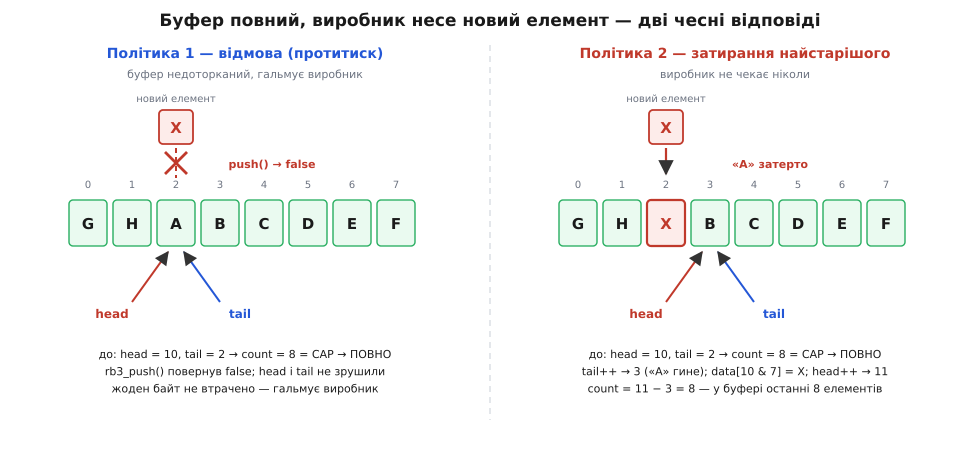
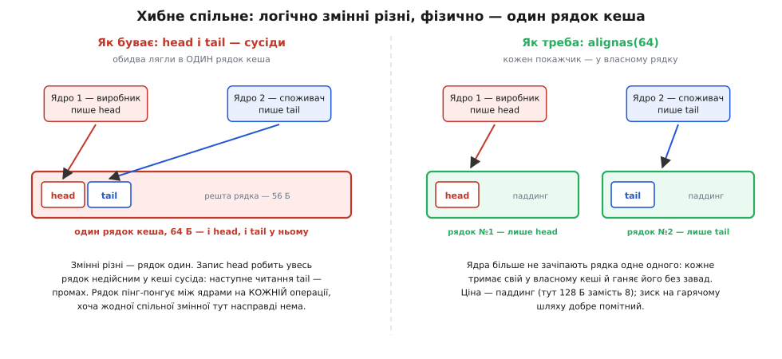

# ⚙️ Кільцевий буфер на C: три різновиди, дві політики й lock-free SPSC

Ідея кільця вміщається в один абзац: масив на N комірок, два індекси, загортання на нуль. Саме тому зламані реалізації трапляються так часто — за оманливо простою ідеєю ховаються три рішення, які доводиться ухвалити ще до першого рядка коду. **Як відрізнити повний буфер від порожнього.** **Що робити, коли місця немає.** **Чи ходитимуть до буфера двоє одночасно.** Жодне не можна відкласти «на потім»: кожне міняє саму структуру, а не тільки тіло функцій.

Зберімо тут усі чесні відповіді — робочим кодом, який компілюється й лягає у прошивку. Мова — C, і не з поваги до традиції: кільце живе в драйверах, обробниках переривань і поруч із DMA, де немає ні динамічної пам'яті, ні права на непередбачуваний час.

## Задача

Зафіксуймо умову конкретно, бо без неї «найкращого» різновиду не існує. Треба черга байтів **сталої місткості**, яка вміє рівно дві речі — покласти байт у хвіст і взяти байт із голови, — і мусить задовольняти чотири вимоги.

**Жодного виділення пам'яті.** Ні при створенні на гарячому шляху, ні тим паче всередині операції. Уся пам'ять — одна структура, яку можна оголосити статично.

**Сталий час на операцію, у найгіршому разі.** Не «в середньому», не «амортизовано»: кожен окремий `push` мусить укластися в передбачувану кількість тактів, бо його викликають з обробника переривання, у якого є дедлайн.

**Виживання на переповненні.** Буфер скінченний, а виробник рано чи пізно вперся б у стелю. Що тоді — окреме рішення, і воно мусить бути свідомим.

**Можливість розвести виробника й споживача по різних потоках** — бажано без замка.

Ось каркас, спільний для всіх різновидів: сховище й два індекси. Уся подальша різниця — у тому, що саме означають ці індекси й що до них додано.

```c
#include <stdint.h>
#include <stdbool.h>
#include <stddef.h>
```

## Спосіб перший: пожертвувати коміркою

Найпростіший вихід із неоднозначності «повний чи порожній» — заборонити буферу заповнюватися вщерть. Домовляємося: буфер повний тоді, коли **наступний** крок `head` уперся б у `tail`. Тоді `head == tail` не може означати нічого, крім «порожньо», бо в повний стан ми просто не даємо йому зайти.

```c
#define RB1_CAP 256u                /* розмір масиву; корисна місткість — 255! */

typedef struct {
    uint8_t data[RB1_CAP];
    size_t  head;                   /* куди писати; завжди 0…RB1_CAP−1 */
    size_t  tail;                   /* звідки читати; завжди 0…RB1_CAP−1 */
} rb1_t;

static inline void rb1_init(rb1_t *r) { r->head = 0; r->tail = 0; }

static inline bool rb1_empty(const rb1_t *r) { return r->head == r->tail; }

static inline bool rb1_full(const rb1_t *r) {
    return ((r->head + 1u) % RB1_CAP) == r->tail;
}

static inline size_t rb1_count(const rb1_t *r) {
    return (r->head - r->tail + RB1_CAP) % RB1_CAP;
}

bool rb1_push(rb1_t *r, uint8_t x) {
    size_t next = (r->head + 1u) % RB1_CAP;
    if (next == r->tail) return false;      /* повно — одна комірка лишається вільною */
    r->data[r->head] = x;
    r->head = next;
    return true;
}

bool rb1_pop(rb1_t *r, uint8_t *out) {
    if (r->head == r->tail) return false;   /* порожньо */
    *out = r->data[r->tail];
    r->tail = (r->tail + 1u) % RB1_CAP;
    return true;
}
```

У `rb1_count` варто затриматися, бо вираз виглядає підозріло. Коли `head < tail`, різниця `r->head - r->tail` у беззнаковому `size_t` дає величезне число — здавалося б, катастрофа. Але беззнакова арифметика в C **точна за модулем 2⁶⁴**, а справжнє математичне значення `head − tail + RB1_CAP` завжди лежить у проміжку від 1 до 2·RB1_CAP, тобто додатне й мале. Отже, обчислене значення дорівнює справжньому, і остача дає правильну відповідь:

```
RB1_CAP = 256, head = 2, tail = 5

head − tail        → 2 − 5 = −3, а в size_t це 2⁶⁴ − 3
+ RB1_CAP          → 2⁶⁴ − 3 + 256 = 2⁶⁴ + 253 ≡ 253  (mod 2⁶⁴)
% RB1_CAP          → 253 % 256 = 253

Перевірка «руками»: зайнято від tail = 5 через кінець масиву до head = 2:
   комірки 5…255 — це 251 штука, плюс комірки 0…1 — ще 2.  Разом 253. ✓
```

Ціна способу — та сама, що й ідея: одна комірка з 256 не використовується ніколи, корисна місткість — **255**. Зате жодної змінної, яку писали б обидві сторони.

## Спосіб другий: окремий лічильник

Якщо шкода комірки, зайнятість можна просто **зберігати**. Тоді обидва стани розрізняються прямо й однозначно, а місткість — повна.

```c
#define RB2_CAP 256u

typedef struct {
    uint8_t data[RB2_CAP];
    size_t  head;
    size_t  tail;
    size_t  size;                   /* скільки елементів усередині просто зараз */
} rb2_t;

static inline void rb2_init(rb2_t *r) { r->head = 0; r->tail = 0; r->size = 0; }

bool rb2_push(rb2_t *r, uint8_t x) {
    if (r->size == RB2_CAP) return false;   /* повно */
    r->data[r->head] = x;
    r->head = (r->head + 1u) % RB2_CAP;
    r->size++;
    return true;
}

bool rb2_pop(rb2_t *r, uint8_t *out) {
    if (r->size == 0) return false;         /* порожньо */
    *out = r->data[r->tail];
    r->tail = (r->tail + 1u) % RB2_CAP;
    r->size--;
    return true;
}
```

Код читається легше за всі інші — і саме тому цей варіант найчастіше опиняється там, де йому не місце. Придивімося, хто пише `r->size`: **обидві сторони**. `size++` і `size--` — це не одна дія, а три (прочитати, змінити, записати), і щойно виробник зі споживачем розійдуться по потоках чи один із них стане обробником переривання, ці трійки накладуться, одне оновлення загубиться, і лічильник тихо розійдеться з дійсністю. Полагодити можна — замком або атомарним лічильником, — але саме заради цього кільце й брали: щоб замка не було. Спільний `size` руйнує головну властивість структури, лишаючи натомість лише зручність читання.

## Спосіб третій: монотонні лічильники з маскою

Найцікавіший різновид ламає звичне припущення: індекси **не загортаються взагалі**. `head` рахує, скільки байтів усього колись покладено, `tail` — скільки всього забрано; обидва тільки зростають. Зайнятість — просто їхня різниця, а реальна адреса в масиві береться маскою в мить звертання.

```c
#define RB3_CAP  256u                       /* СТЕПІНЬ ДВІЙКИ — не побажання, а умова */
#define RB3_MASK (RB3_CAP - 1u)

_Static_assert(RB3_CAP != 0u && (RB3_CAP & RB3_MASK) == 0u,
               "місткість мусить бути степенем двійки");

typedef struct {
    uint8_t  data[RB3_CAP];
    uint32_t head;                          /* СКІЛЬКИ ВСЬОГО покладено; не скидається */
    uint32_t tail;                          /* СКІЛЬКИ ВСЬОГО забрано */
} rb3_t;

static inline void     rb3_init(rb3_t *r)        { r->head = 0; r->tail = 0; }
static inline uint32_t rb3_count(const rb3_t *r) { return r->head - r->tail; }
static inline bool     rb3_empty(const rb3_t *r) { return r->head == r->tail; }
static inline bool     rb3_full(const rb3_t *r)  { return rb3_count(r) == RB3_CAP; }

bool rb3_push(rb3_t *r, uint8_t x) {
    if (rb3_count(r) == RB3_CAP) return false;
    r->data[r->head & RB3_MASK] = x;
    r->head++;
    return true;
}

bool rb3_pop(rb3_t *r, uint8_t *out) {
    if (r->head == r->tail) return false;
    *out = r->data[r->tail & RB3_MASK];
    r->tail++;
    return true;
}
```

Порівняймо три різновиди чесно — не за красою коду, а за тим, що вони коштують.

| | місткість при масиві на N | спільна змінна на запис | придатний до SPSC без замка | вимагає степеня двійки |
|---|---|---|---|---|
| жертва комірки | N − 1 | нема | так | ні (але без неї — ділення) |
| лічильник `size` | N | `size` — пишуть обидва | **ні** | ні |
| монотонні + маска | N | нема | так | **так, обов'язково** |

Третій рядок виграє двічі — і повна місткість, і жодної спільної змінної. Але виграш ще більший, ніж видно з таблиці, і помітний він лише на конкретних числах. Хай треба вмістити рівно 64 байти. Спосіб із жертвою комірки вимагає масиву на 65 — а якщо ми хочемо маску замість ділення, масив мусить бути степенем двійки, тобто **128**. Удвічі більше пам'яті заради одного зайвого байта. Монотонні лічильники дають ті самі 64 корисні байти в масиві рівно на 64. На контролері зі скромною RAM ця різниця вирішує суперечку остаточно.

Саме таке кільце — з монотонними лічильниками й обов'язковим степенем двійки — стоїть за чергою `kfifo` в ядрі Linux; вона доводить замовлений розмір до степеня двійки сама, бо без цієї умови трюк із загортанням лічильників не працює.

## Покроковий розбір

Абстракція стає зрозумілою на маленьких числах. Візьмімо `RB3_CAP = 4`, отже `RB3_MASK = 3`, і прокрутімо кільце більш ніж на повний оберт. Колонки `head`, `tail` і `count` показують стан **після** операції.

```
CAP = 4, MASK = 3, старт: head = 0, tail = 0

операція      перевірка                 дія                     head  tail  count   масив [0 1 2 3]
──────────────────────────────────────────────────────────────────────────────────────────────────
(старт)       —                         —                          0     0      0   [ .  .  .  . ]
push('A')     0 − 0 = 0 ≠ 4 → є місце   data[0 & 3 = 0] = 'A'      1     0      1   [ A  .  .  . ]
push('B')     1 − 0 = 1 ≠ 4 → є місце   data[1 & 3 = 1] = 'B'      2     0      2   [ A  B  .  . ]
pop() → 'A'   2 ≠ 0 → є дані            беремо data[0 & 3 = 0]     2     1      1   [ A  B  .  . ]
push('C')     2 − 1 = 1 ≠ 4 → є місце   data[2 & 3 = 2] = 'C'      3     1      2   [ A  B  C  . ]
push('D')     3 − 1 = 2 ≠ 4 → є місце   data[3 & 3 = 3] = 'D'      4     1      3   [ A  B  C  D ]
push('E')     4 − 1 = 3 ≠ 4 → є місце   data[4 & 3 = 0] = 'E'  ←!  5     1      4   [ E  B  C  D ]
push('F')     5 − 1 = 4 = CAP → ПОВНО   нічого, return false       5     1      4   [ E  B  C  D ]
pop() → 'B'   5 ≠ 1 → є дані            беремо data[1 & 3 = 1]     5     2      3   [ E  B  C  D ]
```

Три рядки тут варті окремої уваги.

Рядок `pop() → 'A'` показує те, чого від черги зазвичай не чекають: **забирання нічого не стирає**. Літера `A` фізично лишається в комірці 0 — зрушився самий лише `tail`. Комірка вважається вільною не тому, що порожня, а тому, що на неї більше не вказує жоден лічильник. Байт помре аж тоді, коли його затре наступний запис.

Рядок `push('E')` — момент загортання: `head` доріс до 4, маска перевела його в комірку 0, і `E` лягла точно на труп `A`. Лічильник `head` при цьому спокійно поїхав далі на 5 і ніколи не повернеться назад. Перевірмо, чи не поплутався порядок: беремо лічильники від `tail = 1` до `head − 1 = 4`, це 1, 2, 3, 4 → комірки 1, 2, 3, 0 → `B`, `C`, `D`, `E`. Порядок FIFO цілий, хоча фізично дані лежать «зі стрибком».

Рядок `push('F')` — межа: `5 − 1 = 4`, це рівно `CAP`, тож місця немає. Зверніть увагу, що `head` дорівнює 5 і давно виліз за розмір масиву — і це нормально; за межі виходить лише лічильник, а не звертання, бо маска накладається в самий момент індексації.

## Що робити, коли повно

`return false` у коді вище — це вже ухвалене рішення, просто непомітне. Чесних варіантів два, і вибір між ними не технічний, а змістовний.

**Відмовити.** Виробник дістає `false`, дані лишаються цілі, а сигнал «повільніше» йде вгору потоком — це [протитиск](root:sf-tasks/backpressure). Так поводяться з тим, чого не шкода не буває: прийнятий кадр, транзакція, файл.

**Затерти найстаріше.** Виробник кладе байт попри повноту, а місце звільняє сам, посунувши `tail`. Найстаріший непрочитаний елемент мовчки гине, зате виробник не гальмує ніколи, і в буфері завжди лежать **останні N** значень. Так поводяться логи, телеметрія і звук: якщо споживач відстав, свіже важить більше за протухле.

З монотонними лічильниками друга політика виходить майже задарма — один рядок:

```c
/* Затирання найстарішого: місце звільняє САМ виробник, посуваючи tail.
   Повертає true, якщо довелося когось затерти (зручно рахувати втрати). */
bool rb3_push_overwrite(rb3_t *r, uint8_t x) {
    bool dropped = (rb3_count(r) == RB3_CAP);
    if (dropped) r->tail++;                 /* найстаріший елемент гине */
    r->data[r->head & RB3_MASK] = x;
    r->head++;
    return dropped;
}
```


*Ліворуч `rb3_push` бачить `count = 8 = CAP`, повертає `false` — і не чіпає нічого: жоден байт не втрачено, гальмує виробник. Праворуч `rb3_push_overwrite` спершу посуває `tail` (найстаріша `A` гине), тоді кладе `X` у звільнену комірку й посуває `head`; зайнятість знову `11 − 3 = 8`, але в буфері вже інші вісім — останні. Той самий буфер, той самий елемент, два різні світогляди.*

І тут ховається наслідок, який видно лише в коді. Подивіться, хто **пише** `tail` у `rb3_push_overwrite`: виробник. А `tail` доти був одноосібною власністю споживача. Політика затирання власноруч руйнує ту саму дисципліну власності, на якій тримається неблокувальність кільця, — тепер `tail` пишуть обидві сторони, і lock-free SPSC із цього буфера більше не вийде без окремих заходів. Затирання й відсутність замка — речі, які так просто не поєднуються; вибираючи політику, ви вибираєте й це.

## Начерк lock-free SPSC

Повернімося до різновиду з відмовою й придивімося, хто чим володіє. `head` пише **лише виробник**, `tail` — **лише споживач**; чужий лічильник кожна сторона тільки читає. Коли виробник рівно один і споживач рівно один (схема SPSC — *single-producer, single-consumer*), жодна комірка пам'яті не має двох записувачів, тож замок стає непотрібним сам собою — не завдяки хитрощам, а тому, що змагатися нема за що.

Лишається єдине питання, і воно не про структуру даних, а про **порядок**: виробник спершу пише байт у комірку, тоді збільшує `head`; чи побачить споживач ці дві дії в тому самому порядку? Ні, якщо не сказати про це явно, — і компілятор має право переставити незалежні записи, і саме ядро виконує їх позачергово. Пара `release`/`acquire` на лічильниках і є цим «сказати явно»:

```c
#include <stdatomic.h>
#include <stdalign.h>

#define SPSC_CAP  1024u
#define SPSC_MASK (SPSC_CAP - 1u)
#define CACHELINE 64

typedef struct {
    alignas(CACHELINE) _Atomic uint32_t head;   /* пише ЛИШЕ виробник */
    alignas(CACHELINE) _Atomic uint32_t tail;   /* пише ЛИШЕ споживач */
    alignas(CACHELINE) uint8_t data[SPSC_CAP];
} spsc_t;

/* Викликати ЛИШЕ з потоку-виробника. */
bool spsc_push(spsc_t *q, uint8_t x) {
    uint32_t h = atomic_load_explicit(&q->head, memory_order_relaxed);  /* свій — relaxed */
    uint32_t t = atomic_load_explicit(&q->tail, memory_order_acquire);  /* чужий — acquire */
    if ((uint32_t)(h - t) == SPSC_CAP) return false;                    /* повно */
    q->data[h & SPSC_MASK] = x;                                         /* 1. дані */
    atomic_store_explicit(&q->head, h + 1u, memory_order_release);      /* 2. публікація */
    return true;
}

/* Викликати ЛИШЕ з потоку-споживача. */
bool spsc_pop(spsc_t *q, uint8_t *out) {
    uint32_t t = atomic_load_explicit(&q->tail, memory_order_relaxed);  /* свій — relaxed */
    uint32_t h = atomic_load_explicit(&q->head, memory_order_acquire);  /* чужий — acquire */
    if (h == t) return false;                                           /* порожньо */
    *out = q->data[t & SPSC_MASK];                                      /* 1. дані */
    atomic_store_explicit(&q->tail, t + 1u, memory_order_release);      /* 2. звільнення */
    return true;
}
```

Логіка лишилася тією самою — маска, різниця лічильників, перевірка на `CAP`. Додалися рівно дві речі. Свій лічильник читається `relaxed`, бо ніхто інший його не пише і впорядковувати нема з чим. Чужий читається `acquire`, а свій публікується `release`, і ці двоє працюють у парі: якщо `acquire`-читання побачило значення, покладене `release`-записом, то читач бачить і все, що писач зробив **до** свого `release`. Байт у комірці, отже, ніколи не проступить пізніше за `head`, що на нього вказує. Симетрично `release` на `tail` у споживача не дає виробникові затерти комірку, з якої ще не дочитали.

> 🔧 **Навіщо це.** Механізм тут не косметичний. Без `release` на `head` споживач цілком може побачити новий `head`, полізти по байт — і взяти старе сміття, бо запис даних ще не проступив назовні. Код при цьому «наче працює» місяцями й розсипається на іншому компіляторі, іншій оптимізації чи іншому ядрі. Це не помилка структури — це помилка **порядку**, і ціна помилки в тому, що вона не відтворюється.

Чому саме `acquire` і `release`, а не дешевший `relaxed`; що таке «синхронізується-з» і «сталося-раніше»; чому `volatile` тут не рятує; і як усе це доводиться — розібрано на C++ у [кільцевому буфері без замка на std::atomic](root:sys-plang-cpp/std-atomic/proj-spsc-ring-buffer.md); переказувати тут те саме не буду. Окремий, простіший випадок — коли виробник це обробник переривання, а споживач — головний цикл на **тому самому** ядрі: там код фізично не виконується одночасно, бар'єри не потрібні, і вистачає значно меншого — [кільце «ISR пише — main читає»](root:hw-arch/interrupts/proj-spsc-ring.md).

## Складність

Порахуймо `rb3_push` чесно, по діях: одне віднімання, одне порівняння, одне побітове «і», один запис у пам'ять, один інкремент. **Жодного циклу. Жодної гілки, глибина якої залежала б від N. Жодного виділення пам'яті.** Тому найгірший випадок дорівнює найкращому — це **O(1) у найгіршому разі**, а не амортизовано. `rb3_pop` — те саме дзеркально. Пам'ять — рівно `sizeof(rb3_t)` = N + 8 байтів, відома на етапі компіляції, з нульовою фрагментацією.

| структура | push (найгірше) | пам'ять | придатна в ISR |
|---|---|---|---|
| кільцевий буфер | **O(1)** | O(N), відома наперед | так |
| зростаючий масив | O(n) — перевиділення й копія | O(n), стрибками | ні |
| зв'язний список | O(1) + виклик `malloc` | O(n) + вузол на елемент | ні |

Різниця між рядками цієї таблиці — не про швидкість, а про **передбачуваність**, і саме тут ховається річ, яку легко проґавити. Зростаючий масив дає амортизовано O(1) — у середньому по мільйону вставок він швидкий. Але дедлайн у переривання не «в середньому»: він на **кожній** операції окремо. Вставка, якій не пощастило спричинити перевиділення й копіювання чотирьох кілобайтів, зірве термін саме тоді, коли зірвати його найдорожче. Амортизована оцінка описує суму, а реальний час вимагає гарантії на кожен доданок — і кільце дає рівно її. Додатковим зиском іде кеш: буфер лежить суцільним шматком, прохід по ньому передбачуваний, і апаратний передвибирач працює на нас, тоді як список ганяє процесор по випадкових адресах.

## Пастки

**Місткість не степінь двійки.** Маска `pos & (N−1)` дорівнює `pos mod N` **лише** для степеня двійки — інакше `_Static_assert` рятує вас на етапі компіляції. Але для монотонних лічильників степінь двійки потрібен ще й із другої, куди підступнішої причини: `head` типу `uint32_t` сам загортається через нуль, дійшовши до 2³², і індексація лишається неперервною тільки тоді, коли N ділить 2³². Візьміть N = 6 — і рівно в мить переповнення лічильника індекс стрибне з 3 на 0, перескочивши 4 і 5. Помилка спрацює один раз на 2³² операцій: за мільйона операцій на секунду — приблизно раз на 72 хвилини роботи. Знайти таке вручну майже неможливо.

**Знакові типи й приховане підвищення.** `%` на **знаковому** типі компілятор не має права звести до однієї маски: за стандартом C остача усікається до нуля, тож `-1 % 8` дорівнює `−1`, а не 7 — доводиться емітувати зайві інструкції, і код тихо гальмує. Ще гірше з дрібними лічильниками на економних контролерах: `uint16_t` і `uint8_t` **підвищуються до `int`** перед арифметикою, і різниця стає знаковою. Якщо `head = 1`, а `tail = 65535`, то `head - tail` дасть не 2, а `−65534`, і вся схема розсиплеться на переповненні — рятує лише явне зведення назад:

```c
uint16_t h = 1, t = 65535;

h - t                 →  int-арифметика:  1 − 65535 = −65534     ✗ зайнятість від'ємна
(uint16_t)(h - t)     →  −65534 mod 65536 = 2                    ✓ правильно

/* Із uint32_t на звичайних платформах (int — 32-бітний) підвищення немає
   й різниця лишається беззнаковою; зведення пишуть про всяк випадок. */
```

**Off-by-one у місткості.** Спосіб із жертвою комірки вміщає `N−1`, а не `N` — і про це забувають рівно тоді, коли місткість мусить точно збігтися з чимось зовнішнім. Класика: буфер під USB-пакет на 64 байти оголошують як `RB1_CAP 64`, у нього влазить 63, і останній байт кожного пакета зникає. Тримайте `RB1_CAP` розміром **масиву**, а не місткістю, і рахуйте корисний обсяг лише через `rb1_count`.

**Забутий бар'єр пам'яті.** Найпоширеніший міт — «зроблю `head` і `tail` як [`volatile`, і буде безпечно](root:sf-lang/volatile)». Не буде. `volatile` забороняє компіляторові кешувати змінну в регістрі — і тільки; він **не впорядковує** запис даних у комірку відносно запису `head` (масив же не `volatile`), і аж ніяк не спиняє процесор від переставляння записів. На одному ядрі це часто минається, бо ISR і `main` не біжать фізично одночасно; між двома ядрами — це гонка з відкладеним вироком. Порядок дає `_Atomic` із `acquire`/`release`, а не `volatile`.

**Хибне спільне використання рядка кеша.** Найтонша з усіх, бо код при ній абсолютно правильний — просто повільний. Процесор возить пам'ять не байтами, а **рядками кеша** по 64 байти (на деяких машинах ефективно по 128). Якщо `head` і `tail` лежать поруч у структурі, вони майже напевно опиняться в одному рядку — і хоча логічно жодної спільної змінної немає, фізично ядра ділять один рядок. Виробник пише `head` — рядок стає недійсним у кеші другого ядра; те лізе по `tail` і дістає промах. Споживач пише `tail` — дзеркально те саме. Рядок пінг-понгує між ядрами на кожній операції, і вся економія від lock-free зникає в [когерентності кешів](root:hw-arch/cache-coherence).


*Ліворуч — типова структура «як писалося»: `head` і `tail` сусіди, обидва в одному 64-байтовому рядку, і кожен запис однієї сторони вибиває рядок із кеша другої. Праворуч — `alignas(64)` на кожному лічильнику: кожен їде у власному рядку, ядра перестають заважати одне одному. Заплачено паддингом (128 байтів замість 8), куплено тишу на шині когерентності — саме тому `alignas(CACHELINE)` стоїть у структурі `spsc_t` вище й саме тому його не можна прибирати «заради економії».*

Ліки — рознести лічильники по різних рядках, як у `spsc_t`: `alignas(CACHELINE)` на кожному. Виглядає марнотратно й таким не є: 120 зайвих байтів на структуру — сміх проти рядка кеша, що метається між ядрами мільйон разів на секунду. Той самий прийом — «набивання рядка кеша» (англ. *cache line padding*) — свого часу прославив LMAX Disruptor, бібліотеку швидкого обміну повідомленнями між потоками, написану для біржі: там лічильники послідовності навмисне обкладали паддингом, щоб у рядку з кожним не лишалося більше нічого.
