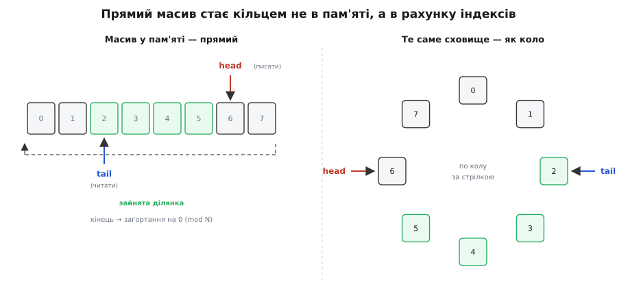
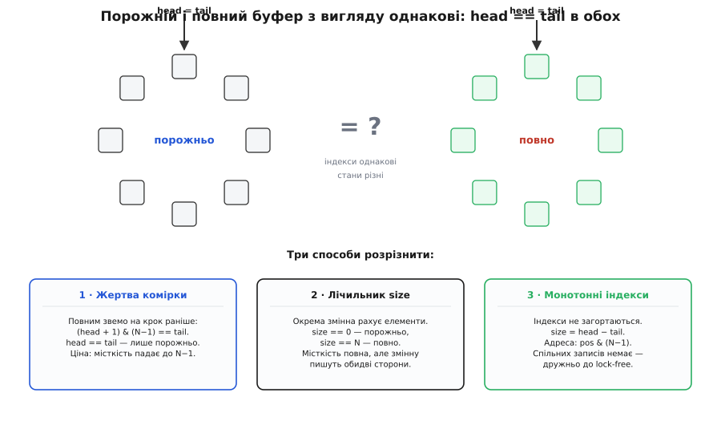
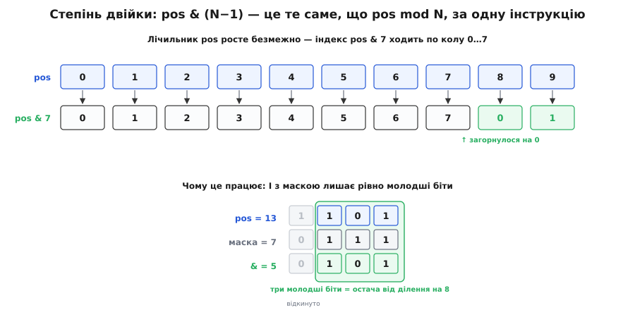

# Кільцевий буфер

<preknowlist>
- [Пам'ять як масив](topic:hw-arch/memory-as-array) — масив як суцільна ділянка пам'яті фіксованого розміру; доступ до будь-якої комірки за індексом коштує сталий час.
- [Модульна арифметика](topic:math-number-theory/modular-arithmetic) — остача від ділення й «загортання» лічильника по колу: після N−1 знову 0.
- [Черга (FIFO)](topic:sf-algorithms/queue-fifo) — дисципліна «перший прийшов — перший вийшов»: кладемо в один кінець, забираємо з іншого, у порядку надходження.
</preknowlist>

Дві частини програми рідко працюють в один такт. Драйвер послідовного порту приймає байти тоді, коли їх шле залізо; програма-споживач розбирає їх, коли встигає. Звукова карта вимагає нову порцію семплів рівно сорок вісім тисяч разів на секунду; код, що ці семпли готує, робить це ривками. Між двома такими сторонами завжди потрібна проміжна комора — місце, куди одна кладе, а друга забирає, кожна у своєму темпі. За дисципліною ця комора — черга: що поклали першим, те першим і заберуть.

Наївно чергу роблять масивом, куди додають у хвіст, а беруть із голови. І тут одразу постає незручність. Якщо забирати завжди з початку масиву, то після кожного забору решту доводиться зсувати на одну позицію ліворуч — а це O(n) роботи на кожен елемент, безглуздо дорого. Якщо ж голову й хвіст просто рухати вперед, нічого не зсуваючи, то зайнята ділянка невпинно «повзе» вправо й швидко впирається в кінець масиву, хоча на початку давно порожньо. Можна щоразу дозаписувати новий шматок пам'яті, коли старий скінчився, — але виділення й звільнення пам'яті повільні, непередбачувані за часом і ведуть до фрагментації; а всередині переривання чи в звуковому виклику виділяти пам'ять просто не можна.

Придивімося, чого черзі насправді треба. У кожен момент у ній лежить лише **вікно** актуальних елементів — тих, що вже додані, але ще не забрані. Усе, що забрали, більше не потрібне, і пам'ять під нього вільна. Якщо обмежити це вікно згори числом N, з'являється проста, майже нахабна ідея: не рухатися масивом уперед нескінченно, а **ходити по тих самих N комірках по колу**. Дійшли до кінця — повертаємося на початок, де давно все звільнено. Пам'ять під буфер виділяється **один раз**, наперед, і більше ніколи не чіпається. Це і є кільцевий буфер (англ. *ring buffer* — кільце; також *circular buffer*, кільцева черга).

> 🔧 **Навіщо це.** На кільцевому буфері тримаються драйвери послідовних портів і прямого доступу до пам'яті (DMA), звукові конвеєри, мережеві стеки, кільце системних повідомлень ядра (те, що показує `dmesg`), буфери джитера у відеозв'язку. Скрізь, де дані течуть потоком між двома сторонами з різним темпом, а виділяти пам'ять на льоту не можна чи задорого, стоїть саме він.

## Кільце живе в індексах, а не в пам'яті

Масив, звісно, лишається прямим — жодного фізичного кільця в пам'яті немає. Кільце живе в **індексах**. Тримаємо два: `head` (куди писати наступний елемент) і `tail` (звідки читати наступний). Виробник кладе елемент у комірку `head` і посуває `head` на один уперед. Споживач бере елемент із комірки `tail` і посуває `tail` на один уперед. Щойно котрийсь індекс добіг до кінця масиву — він **загортається** на нуль. Саме це загортання й перетворює прямий масив на логічне коло.


*Ліворуч — звичайний масив на вісім комірок: зайнята ділянка (`tail`…`head`) лежить усередині, а на кінці спрацьовує загортання назад на нуль. Праворуч — той самий масив, зображений колом: фізично він не гнеться, гнеться лише рахунок індексів за модулем N. Виробник пише в `head` і рухає його вперед, споживач читає з `tail` і рухає слідом; обидва безкінечно кружляють по восьми комірках, наздоганяючи один одного.*

Загортання — це остача від ділення. Наступна позиція після `i` — це `(i + 1) mod N`. Обидва індекси живуть у діапазоні 0…N−1 і кружляють по ньому: виробник тікає вперед, споживач женеться за ним. Поки між ними є проміжок, у буфері є дані; коли споживач наздогнав виробника, буфер порожній.

## Одна підступна деталь: повний чи порожній?

І тут ховається єдина по-справжньому підступна річ усієї конструкції. Порожній буфер ми впізнаємо за умовою `head == tail`: споживач наздогнав виробника, читати нічого. Але уявімо, що виробник біг-біг, обійшов усе коло й тепер стоїть рівно позаду споживача — буфер повний по вінця. Індекси при цьому... знову рівні: `head == tail`. **Порожній і повний буфер із вигляду однакові.** За самими лише двома індексами їх не розрізнити.


*Корінь неоднозначності: і в порожньому кільці, і в повному по вінця виходить `head == tail`. Самих індексів не досить — потрібне окреме правило. Три класичні виходи: пожертвувати однією коміркою (повний оголошуємо на крок раніше), тримати лічильник `size`, або лишити індекси монотонними й брати зайнятість як `head − tail`.*

Це не дрібниця, а розвилка, на якій кільцеві буфери діляться на різновиди. Виходів три, кожен зі своєю ціною.

**Пожертвувати однією коміркою.** Домовляємося: буфер вважається повним, коли до наздогнання лишається один крок, тобто коли `(head + 1) mod N == tail`. Тоді `head == tail` завжди означає лише «порожньо», бо повний стан ми оголошуємо на крок раніше. Ціна — одна комірка з N ніколи не використовується, корисна місткість стає N−1. Найпростіший і найпоширеніший вибір.

**Тримати лічильник.** Окрема змінна `size` рахує, скільки елементів у буфері зараз. `size == 0` — порожньо, `size == N` — повно, розрізнення однозначне, місткість повна. Ціна — зайва змінна, яку оновлюють обидві сторони на кожній операції; а коли виробник і споживач працюють у різних потоках, цей спільний лічильник стає місцем, за яке вони змагаються, і псує найкращу властивість кільця — здатність обійтися без замків.

**Не загортати самі лічильники.** Найелегантніший спосіб: `head` і `tail` рахують не позицію в масиві, а **скільки всього** елементів колись покладено й забрано, і невпинно зростають, ніколи не повертаючись назад. Кількість даних у буфері — просто їхня різниця: `size = head − tail`. Порожньо — `head == tail`; повно — `head − tail == N`. А коли лічильник треба перетворити на реальну адресу в масиві, беремо остачу: `array[pos mod N]`. Розрізнення однозначне, спільних змінних, які пишуть обидві сторони, немає. Цей прийом стоїть, зокрема, за чергою `kfifo` в ядрі Linux. У нього два природні супутники — степінь двійки й беззнакове переповнення.

> 🧮 **Поряд — математична вставка:** [індексна арифметика кільця](topic:sf-algorithms/ring-buffer/math-ring-buffer-indexing.md) — чому `pos & (N−1)` точно дорівнює `pos mod N` для степеня двійки, доведення коректності всіх трьох способів розрізнити повний і порожній буфер через їхні інваріанти, і чому різниця `head − tail`, порахована в беззнакових числах, дає правильну зайнятість навіть у мить переповнення лічильника.

## Степінь двійки: маска замість ділення

Остача `pos mod N` — це ділення, а ділення навіть на сучасних процесорах коштує десятки тактів, на дрібних же мікроконтролерах апаратного ділення часто немає зовсім. Та є випадок, коли остачу можна взяти однією найдешевшою операцією. Якщо **N — степінь двійки**, то `pos mod N` дорівнює `pos & (N−1)` — побітове І з маскою з молодших одиниць. Причина проста: у двійковому записі остача від ділення на 2ᵏ — це рівно `k` молодших бітів числа, а маска `N−1` (для N = 8 це 7 = `0b111`) саме їх і лишає, обнуляючи решту.


*Для N = 8 маска дорівнює 7 = `0b0111`. Побітове І з нею відкидає всі біти, старші за три молодші, — а це рівно те саме, що взяти остачу від ділення на 8. Лічильник `pos` росте 0, 1, 2, …, а індекс у масиві циклічно повертається 0…7, 0…7. Одна інструкція процесора замість повного ділення.*

**Приклад (маска замість ділення).** Хай N = 8, маска = 7 = `0b0111`. Порахуймо індекс у масиві для кількох значень лічильника позиції:

```
N = 8,   маска = N − 1 = 7 = 0b0111

pos = 5:     5 & 7  →  0b0101 & 0b0111 = 0b0101 = 5
pos = 8:     8 & 7  →  0b1000 & 0b0111 = 0b0000 = 0    ← загорнулося
pos = 13:   13 & 7  →  0b1101 & 0b0111 = 0b0101 = 5    ← знову там, де pos = 5
pos = 100: 100 & 7  →  0b1100100 & 0b0111 = 0b100 = 4
```

Одна інструкція замість ділення — і саме тому кільцеві буфери майже завжди беруть місткістю 8, 16, 256, 1024 і так далі. Тут же криється й пояснення, чому спосіб із монотонними лічильниками так гарно працює: коли `head` і `tail` — [беззнакові цілі](topic:sf-lang/unsigned-overflow), вони, дорісши до краю свого типу, самі загортаються через нуль за тими самими правилами модульної арифметики. Різниця `head − tail`, порахована в беззнакових числах, лишається правильною навіть у мить, коли `head` уже переповнився, а `tail` ще ні. Одиничне переповнення тут не помилка, а безкоштовний механізм загортання.

## Робочий код

Зберімо все докупи. Мова тут — C: кільцевий буфер живе найглибше в системному шарі — драйвери, переривання, DMA, — де важать кожен такт і кожен байт, а виділяти пам'ять не можна. Візьмемо спосіб із маскою по степені двійки й окремим лічильником для ясності.

```c
#include <stdint.h>
#include <stdbool.h>

#define CAP  256                /* місткість — степінь двійки */
#define MASK (CAP - 1)

typedef struct {
    uint8_t  data[CAP];
    uint32_t head;              /* куди писати наступний елемент */
    uint32_t tail;              /* звідки читати наступний */
    uint32_t size;              /* скільки елементів зараз у буфері */
} ring_t;

bool ring_push(ring_t *r, uint8_t x) {
    if (r->size == CAP) return false;   /* повно — відмова */
    r->data[r->head & MASK] = x;
    r->head++;
    r->size++;
    return true;
}

bool ring_pop(ring_t *r, uint8_t *out) {
    if (r->size == 0) return false;     /* порожньо */
    *out = r->data[r->tail & MASK];
    r->tail++;
    r->size--;
    return true;
}
```

Обидві операції — це кілька дій без жодного циклу: перевірка, запис у комірку, приріст двох лічильників. Тому кожна з них — **O(1) у найгіршому разі**, а не «в середньому». Це принципова перевага над зростаючим масивом чи списком: там додавання зрідка спричиняє дороге перевиділення й копіювання всього вмісту, а тут — ніколи. Пам'ять — рівно O(N), відома наперед. І весь буфер лежить суцільним шматком, тож проходи по ньому лягають у кеш і тішать апаратний передвибирач — ще одна причина, чому ця структура така швидка на практиці. Повнішу реалізацію — з обома політиками на повний буфер і lock-free варіантом — розібрано в [коді кільцевого буфера](topic:sf-algorithms/ring-buffer/proj-ring-buffer-c.md).

## Що робити, коли повно

Лишилося одне рішення, яке в коді вище сховане за коротким `return false`, а насправді визначає поведінку всієї системи: **що робити, коли буфер повний, а виробник несе новий елемент**. Чесних відповідей дві.

**Відмовити (або зачекати).** Виробник не втискає елемент силою — він або дістає відмову й пробує згодом, або блокується, доки споживач звільнить місце. Дані не губляться, зате виробник відчуває, що його стримують, і мусить пригальмувати. Це і є [протитиск](topic:sf-tasks/backpressure) — сигнал «повільніше», що йде вгору потоком. Так поводяться буфери, де кожен елемент цінний: прийнятий кадр, файл, транзакція.

**Затерти найстаріше.** Виробник кладе новий елемент попри повноту, а `tail` теж посувають уперед — найстаріший непрочитаний елемент мовчки гине. Буфер завжди тримає **останні N** значень і ніколи не блокує виробника. Це саме те, чого хочуть від логів, телеметрії, звуку: якщо споживач відстав, свіжі дані важливіші за протухлі. Кільце системних повідомлень ядра й [буфер джитера](topic:com-signal/jitter-buffer) — звідси.

Вибір не технічний, а змістовний: чи дані такі, що втрату видно й пробачити її не можна, — тоді відмова й протитиск; чи важить лише свіжість, а старе не шкода, — тоді затирання.

## Чому його так люблять на межі між потоками

І остання причина, чому кільцевий буфер такий улюблений саме там, де стикаються дві частини системи. Уявімо, що виробник і споживач — різні потоки, або що один із них — переривання, а інший — головний код. Придивімося до індексів у способі з монотонними лічильниками: `head` **пише лише виробник**, `tail` **пише лише споживач**. Кожна сторона тільки читає чужий індекс, щоб зрозуміти, чи є місце й чи є дані. Коли сторона рівно одна з кожного боку — це схема «один виробник, один споживач» (*single-producer, single-consumer*, SPSC), — обійтися можна **зовсім без замків**: жодна комірка не має двох одночасних записувачів. Треба лише подбати, щоб процесор і компілятор не переставили місцями запис у комірку й наступне оновлення `head`; цим керує [порядок пам'яті через атомарні операції](topic:sys-plang-cpp/std-atomic). Готовий такий буфер із розбором барʼєрів пам'яті — у [коді SPSC-кільця](topic:sys-plang-cpp/std-atomic/proj-spsc-ring-buffer.md).

Ось звідки популярність структури: вона не лише економить пам'ять і час, а й дає найдешевший спосіб передати потік даних між двома незалежними виконавцями — [виробником і споживачем](topic:sf-tasks/producer-consumer) — без важких замків.

Кільцевий буфер настільки природний, що не має ані винахідника, ані дати народження: у роботах початку 1970-х його вживають як щось загальновідоме, не пояснюючи й не претендуючи на першість, а окремий інженер, який його «придумав», в історії не зафіксований. Це не чийсь винахід, а рішення, до якого доходиш сам, щойно поставиш питання: як дати двом сторонам обмінюватися потоком, не рухаючи даних і не виділяючи пам'яті? Відповідь — ходити по колу тими самими комірками — і є вся суть. Настільки суттєва, що процесори цифрової обробки сигналів навіть винесли її в залізо: у них є режим адресації за модулем, коли покажчик сам загортається на початок буфера без жодної зайвої інструкції.
