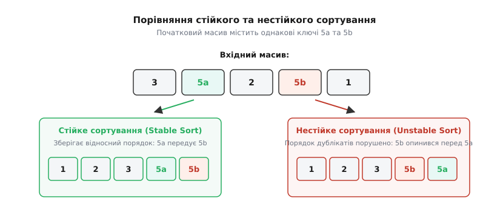
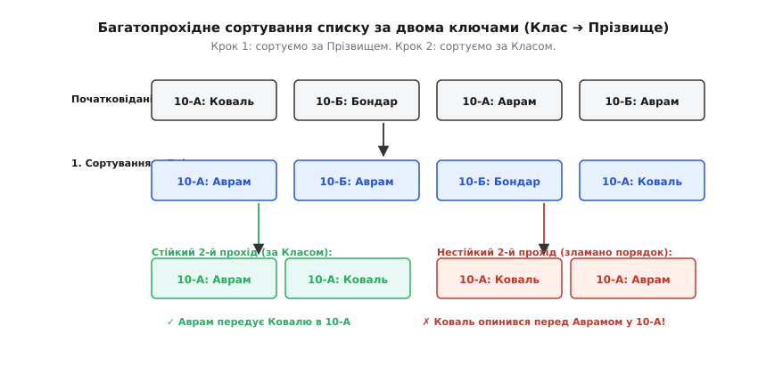
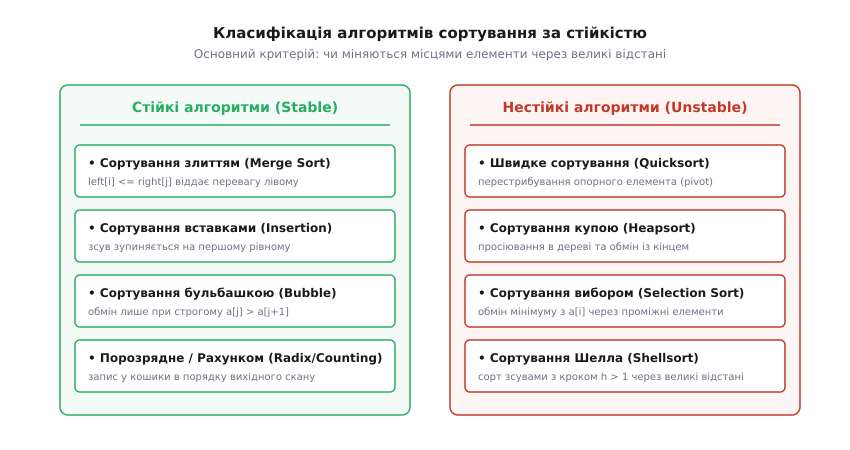
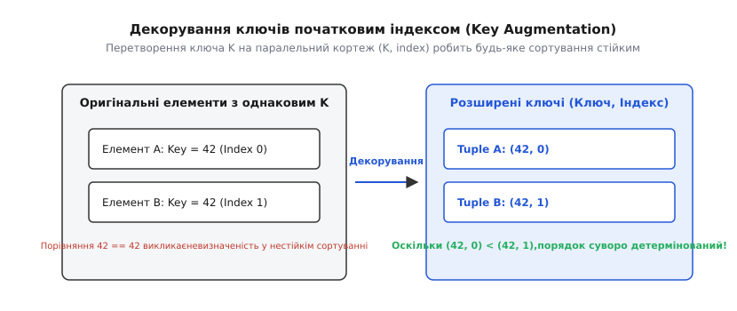

# ⚖️ Стійкість сортування (Sorting Stability)

<preknowlist>
- [Швидке сортування](topic:sf-algorithms/quicksort) — механіка розділення (partitioning) та природи нестійкості Quicksort.
- [Сортування купою](topic:sf-algorithms/heapsort) — деревоподібна структура піраміди та витягування максимуму.
- [Сортування вибором](topic:sf-algorithms/selection-sort) — вибір мінімального елемента та далекі обміни.
- [Асимптотична складність](topic:computability/asymptotic-complexity) — часова складність та просторові гарантії O(1) і O(N).
</preknowlist>

Коли транзакційна база даних виконує сортування банківських переказів за датою, а потім за сумою, або коли електронна таблиця впорядковує товари за ціною після сортування за категоріями, результатом має бути детермінований порядок рядків. Якщо два записи мають однакову суму або одну категорію, їхній відносний порядок після повторного сортування повинен точно відповідати тому порядку, в якому вони перебували до початку процедури. Втрата цієї властивості призводить до того, що однакові запити повертають різне групування, юніт-тести дають недетерміновані збої, а посторінкова навігація (pagination) дублює або пропускає рядки між сторінками.

Стійкість сортування — це формальна гарантія алгоритму щодо збереження первинного відносного порядку елементів, які мають еквівалентні ключі порівняння.

---

## 1. Інтуїція та формальне означення стійкості

Розглянемо масив записів, кожен з яких складається з ключа сортування `k` та корисного навантаження `v`. Нехай у вхідній послідовності `A` на позиціях `i` та `j` знаходяться два елементи `A[i]` та `A[j]`, для яких виконуються дві умови:
1. `i < j` (елемент `A[i]` передує елементу `A[j]` у вхідному масиві);
2. `Key(A[i]) ≡ Key(A[j])` (значення ключів порівняння цих елементів тотожно рівні).

Масив сортується за допомогою алгоритму `S`, утворюючи вихідну послідовність `A'`. Нехай елемент `A[i]` перемістився на нову позицію `i'`, а елемент `A[j]` — на позицію `j'`.

Алгоритм сортування `S` називається **стійким (stable)**, якщо для будь-якої пари таких елементів у вихідному масиві завжди зберігається суворе відношення:

```
i' < j'
```

Якщо ж існує хоча б одна конфігурація вхідних даних, за якої для однакових ключів `Key(A[i]) ≡ Key(A[j])` при `i < j` у результаті отримується `i' > j'`, алгоритм `S` класифікується як **нестійкий (unstable)**.


*Принцип стійкості: елементи з однаковими ключами збережуть свій вхідний відносний порядок після закінчення процедури сортування.*

З математичної точки зору, стійкість гарантує збереження топологічного порядкового інваріанта для всіх класів еквівалентності. Якщо ми розглянемо відношення еквівалентності `x ~ y <=> Key(x) == Key(y)`, воно розбиває множину елементів на підмножини (класи еквівалентності). Стійке сортування впорядковує самі класи еквівалентності між собою, зберігаючи усередині кожного класу точний початковий порядок підстановки елементів.

Еволюцію поняття стійкості від механічних сортувальників перфокарт до системних бібліотек детально висвітлено у [історичному огляді стійкості сортування](topic:sf-algorithms/sorting-stability/hist-sorting-stability.md).

---

## 2. Чому реальні дані вимагають стійкості: Багатопрохідне сортування

У теоретичних задачах, де масив складається лише з примітивних цілих чисел `[4, 2, 5, 2, 1]`, стійкість алгоритму є непомітною та математично нерозрізненною: перша двійка і друга двійка не мають жодних додаткових властивостей. Проте в реальному програмному забезпеченні елементи масиву майже завжди є складними об'єктами з багатьма атрибутами.

### Сценарій 1: Сортування за декількома колонками (Radix / Spreadsheet Ordering)

Припустимо, ми обробляємо список транзакцій електронної комерції зі структурами:

:::tabs
```c
/* C: Структура транзакції */
typedef struct {
    int user_id;
    int timestamp;
    double amount;
} Order;
```
```cpp
// C++: Структура транзакції
struct Order {
    int user_id;
    int timestamp;
    double amount;
};
```
:::

Завдання полягає у сортуванні списку за двома критеріями:
1. За ID користувача (`user_id`) у зростаючому порядку;
2. Всередині групи кожного користувача — за часом покупки (`timestamp`) у зростаючому порядку.

Існує два фундаментальних підходи до розв'язання цієї задачі:

#### Підхід А: Багатокритеріальний компаратор у один прохід
Ми створюємо складний компаратор, який порівнює `a.user_id` проти `b.user_id`, а у випадку їхньої рівності порівнює `a.timestamp` проти `b.timestamp`. Цей підхід працює за один прохід алгоритму сортування, але вимагає прямого доступу до всіх полів у момент написання коду компаратора.

#### Підхід Б: Багатопрохідне сортування стійким алгоритмом
Ми розбиваємо задачу на два послідовних проходи універсального стійкого сортувальника:
- **Крок 1:** Сортуємо весь масив за другорядним ключем (`timestamp`).
- **Крок 2:** Сортуємо результат за головним ключем (`user_id`), використовуючи **стійкий алгоритм**.

Завдяки властивості стійкості на кроці 2 елементи з однаковим `user_id` будуть згруповані разом, але їхній відносний порядок, збудований на кроці 1 за `timestamp`, залишиться недоторканим!


*Багатопрохідне сортування: послідовний виклик стійкого алгоритму від найменш важливого ключа до найважливішого зберігає попередні впорядкування.*

Цей алгоритмічний принцип лежить в основі порозрядного сортування (Radix Sort), де числа сортуються послідовно від молодшого розряду до старшого (LSD — Least Significant Digit). Якщо порозрядне сортування використає нестійкий алгоритм на будь-якому з проходів, підсумковий масив буде повністю розпорпаний.

### Сценарій 2: Детермінованість у базах даних та веб-сервісах

У реляційних базах даних (PostgreSQL, MySQL, SQLite) та REST API сортування даних без стійкості створює важкі дефекти в продакшені:
- **Проблема посторінкової навігації (Pagination Bug):** Якщо SQL-запит `SELECT * FROM users ORDER BY age LIMIT 10 OFFSET 10` використовує нестійкий алгоритм сортування для користувачів із однаковим віком `age = 25`, то при переході від сторінки 1 до сторінки 2 СУБД може перетасувати користувачів із віком 25 у довільному порядку. У результаті користувач на фронтенді побачить деякі записи двічі, а деякі записи зникнуть з видачі взагалі.
- **Відтворюваність автоматичних тестів:** У багатоклієнтських серверах нестійкість сортування призводить до "мигаючих" (flaky) тестів, коли юніт-тест проходить у 99% випадків, але падає на CI/CD середовищі через іншу реалізацію `qsort` або інший порядок елементів у внутрішніх буферах.

---

## 3. Анатомія стійкості фундаментальних алгоритмів сортування

Властивість стійкості алгоритму не є випадковою: вона безпосередньо випливає з його геометричної механіки переміщення елементів у пам'яті. Алгоритми, які роблять обміни лише між **суміжними** сусідніми елементами (або зливають впорядковані підмасиви від початку до кінця), природно є стійкими. Алгоритми, які виконують обміни елементів через **великі відстані** або перебудовують деревні структури вільним чином, є нестійкими.


*Класифікація фундаментальних алгоритмів сортування за критеріями стійкості, часової складності та додаткової пам'яті.*

Розглянемо детальний внутрішній механізм кожного з восьми ключових алгоритмів сортування.

---

### 3.1. Глибокий розбір стійких алгоритмів

#### 1. Сортування вставками (Insertion Sort)
- **Механіка:** Алгоритм послідовно бере кожен елемент `A[i]` (де `i` змінюється від 1 до `N-1`) і просуває його ліворуч у вже відсортовану частину масиву `A[0...i-1]`.
- **Причина стійкості:** Просування ліворуч здійснюється за допомогою циклу `while (j > 0 && A[j-1] > key)`. Зсув зупиняється в той момент, коли знайдено елемент `A[j-1]`, який **менший або дорівнює** поточуному ключу `key`. Оскільки елемент із рівним ключем не обганяє свого попередника з таким самим ключем, їхній відносний порядок зберігається незмінним.
- **Як зламати стійкість:** Якщо розробник випадково запише умову зсуву як `A[j-1] >= key` замість `A[j-1] > key`, алгоритм моментально втратить стійкість, оскільки поточний елемент буде перестрибувати через всі однакові елементи, що передували йому.

#### 2. Сортування злиттям (Merge Sort)
- **Механіка:** Алгоритм розділяє масив навпіл на дві рівні частини, рекурсивно сортує ліву та праву половини, після чого виконує процедуру злиття (Merge) двох впорядкованих підмасивів `L[0...n1-1]` та `R[0...n2-1]` у новий тимчасовий буфер.
- **Причина стійкості:** Під час фази злиття два вказівники `i` та `j` сканують підмасиви `L` та `R`. При порівнянні елементів виконується умова `if (L[i] <= R[j])`. Оскільки елементи з лівого підмасиву `L` початково знаходилися в оригінальному масиві **лівіше** (раніше) за елементи з правого підмасиву `R`, при рівності їхніх ключів `L[i].key == R[j].key` умовою `<=` пріоритет завжди надається елементу з **лівого** підмасиву. Це повністю зберігає часовий інваріант поява елементів.

#### 3. Сортування бульбашкою (Bubble Sort) та Cocktail Sort
- **Механіка:** Алгоритм здійснює послідовні проходи по масиву, порівнюючи суміжні сусідні елементи `A[k]` і `A[k+1]` та міняючи їх місцями, якщо вони порушують порядок.
- **Причина стійкості:** Обмін елементів місцями відбувається лише за умови суворого нерівності `if (A[k] > A[k+1])`. Якщо зустрічаються два елементи з однаковими ключами `A[k] == A[k+1]`, умова не виконується, обмін не відбувається, і елементи зберігають свої відносні позиції. Оскільки елементи пересуваються виключно через кроки довжиною в 1 позицію, вони ніколи не можуть "перестрибнути" один через одного без прямого порівняння.

#### 4. Сортування за підрахунком (Counting Sort) та Порозрядне сортування (LSD Radix Sort)
- **Механіка:** Сортування за підрахунком обчислює частоту появи кожного ключа у масиві `count[key]`, після чого перетворює його на масив префіксних сум `pref[key]`, де `pref[key]` вказує на кінцеву позицію даного ключа у вихідному масиві.
- **Причина стійкості:** Щоб гарантувати стійкість, на останньому кроці розміщення елементів вхідний масив обробляється **у зворотному порядку — справа наліво** (від `i = N-1` до `0`). Кожен елемент `A[i]` поміщається за індексом `pref[A[i]] - 1`, після чого значення `pref[A[i]]` зменшується на 1. Це гарантує, що елемент із таким самим ключем, який стояв у вхідному масиві правіше (пізніше), потрапить на більший індекс у підсумковому масиві, а той, що стояв лівіше — на менший індекс.

---

### 3.2. Глибокий розбір нестійких алгоритмів та контрприклади

#### 1. Швидке сортування (Quicksort)
- **Механіка:** Алгоритм обирає опорний елемент (pivot `P`) та розділяє масив (Partition) на два сектори: елементи, менші за `P` (ліворуч), та елементи, більші або рівні `P` (праворуч).
- **Причина нестійкості:** Схема розділення Ломуто або Хоара використовує два вказівники, які рухаються з протилежних кінців масиву і виконують дальній обмін `swap(A[left], A[right])` через десятки або сотні позицій. Під час такого обміну елемент перестрибує через інші дубльовані елементи, руйнуючи їхній початковий порядок.
- **Докладний контрприклад:**
  Розглянемо масив записів `[(3, 'a'), (3, 'b'), (2, 'c')]`.
  Використовуємо схему розділення Ломуто, де останній елемент `(2, 'c')` обирається як pivot `P = 2`.
  Вказівник розбиття `i` починається з -1. Алгоритм сканує масив:
  - `j = 0`: `(3, 'a') > 2` — зсуву немає.
  - `j = 1`: `(3, 'b') > 2` — зсуву немає.
  - Наприкінці фази pivot `(2, 'c')` міняється місцями з першим елементом `(3, 'a')`.
  - Результат після розділення: `[(2, 'c'), (3, 'b'), (3, 'a')]`.
  Елемент `(3, 'a')`, який спочатку знаходився на індексі 0 перед `(3, 'b')`, тепер перемістився на індекс 2 **після** `(3, 'b')`. Стійкість зруйновано.

#### 2. Сортування купою (Heapsort)
- **Механіка:** На першому етапі масив перебудовується у максимальну бінарну купу (Max-Heap). На другому етапі корінь купи `A[0]` (найбільший елемент) послідовно міняється місцями з останнім елементом невідсортованої частини `A[last]`, після чого розмір купи зменшується на 1, а новий корінь просіюється донизу (Sift-Down / Heapify).
- **Причина нестійкості:** Побудова бінарної купи розміщує елементи у деревоподібну структуру відповідно до індексних зв'язків `2i + 1` та `2i + 2`. Під час операції `swap(A[0], A[last])` елемент з самого кінця масиву примусово кидається на вершину купи, звідки під час просіювання падає на довільний рівень.
- **Докладний контрприклад:**
  Розглянемо масив `[(5, 'a'), (5, 'b'), (5, 'c')]`.
  Побудована купа зберігає `(5, 'a')` у корені (індекс 0), `(5, 'b')` на індексі 1, `(5, 'c')` на індексі 2.
  На першому кроці витягування максимуму корінь `(5, 'a')` міняється місцями з останнім елементом `(5, 'c')`.
  Масив приймає вигляд `[(5, 'c'), (5, 'b'), (5, 'a')]`.
  У результаті елемент `(5, 'a')`, який був найпершим, стає найостаннішим у відсортованому масиві.

#### 3. Сортування вибором (Selection Sort)
- **Механіка:** На кожному кроці `i` (від 0 до `N-2`) алгоритм знаходить мінімальний елемент у підмасиві `A[i...N-1]` і виконує прямий обмін `swap(A[i], A[min_idx])`.
- **Причина нестійкості:** Операція `swap(A[i], A[min_idx])` є далеким обміном. Вона переміщує елемент `A[i]` з початку підмасиву на довільну позицію `min_idx` далеко праворуч, змушуючи його перестрибнути через інші елементи з такими ж ключами.
- **Докладний контрприклад:**
  Розглянемо масив `[(4, 'a'), (4, 'b'), (2, 'c')]`.
  На кроці `i = 0` шукається мінімум у всьому масиві. Мінімальним елементом є `(2, 'c')` на індексі 2.
  Алгоритм виконує `swap(A[0], A[2])`, міняючи місцями `(4, 'a')` та `(2, 'c')`.
  Результат: `[(2, 'c'), (4, 'b'), (4, 'a')]`.
  Елемент `(4, 'a')` перестрибнув через `(4, 'b')` і опинився наприкінці масиву.

#### 4. Сортування Шелла (Shellsort)
- **Механіка:** Алгоритм виконує декілька проходів сортування вставками на підмасивах, елементи яких віддалені один від одного на відстань `h` (`gap`). Послідовність кроків `h` зменшується до 1 (наприклад, 13, 4, 1).
- **Причина нестійкості:** Елементи сортуються незалежно усередині різних підгрупових смуг з кроком `h`. Обміни між елементами в одній смузі переміщують їх через елементи інших смуг, безповоротно порушуючи їхній початковий порядок.

---

### 3.3. Зовнішнє сортування (External Merge Sort) для великих файлів
Коли обсяг даних перевищує розмір оперативної пам'яті (наприклад, сортування лог-файлу розміром 1 Терабайт на диск), застосовують **Зовнішнє сортування злиттям (External Merge Sort)**:
1. Файл читається блоками, які вміщуються у RAM;
2. Кожен блок сортується в оперативній пам'яті та записується на диск як відсортований відрізок (Run);
3. Відсортовані відрізки зливаються через **k-way Merge** за допомогою пріоритетної черги (Min-Heap).

Оскільки під час k-позиційного злиття відрізків елементи з однаковими ключами завжди витягуються з найпершого за порядком відрізка, Зовнішнє сортування злиттям є **абсолютно стійким**. Це гарантує збереження часової хронології записів у великих розподілених системах обробки даних (MapReduce / Apache Spark).

---

### 3.4. Різниця між LSD та MSD Radix Sort
Порозрядне сортування має дві принципово різні модифікації:
1. **LSD Radix Sort (Least Significant Digit):** Обробляє цифри/розряди від молодшого до старшого. Для збереження результатів попередніх проходів **кожен прохід LSD зобов'язаний бути 100% стійким** (наприклад, базуватися на стійкому Counting Sort).
2. **MSD Radix Sort (Most Significant Digit):** Обробляє розряди від старшого до молодшого, розбиваючи масив на рекурсивні бакети (Buckets). Оскільки MSD сортує підгрупи незалежно усередині кожного бакета, йому не потрібна стійкість між різними проходами, але усередині одного бакета він є нестійким, якщо не застосовувати додаткові черги.

---

### 3.5. Святий Ґрааль алгоритміки: In-Place стійке сортування (Block Sort / GrailSort)

Довгий час у комп'ютерних науках залишалася відкритим фундаментальна проблема: чи можливо створити алгоритм сортування, який є **одночасно**:
1. **Стійким (Stable)**;
2. Має оптимальну часову складність **`O(N log N)` у найгіршому випадку**;
3. Працює строго **In-Place** з додатковою пам'яттю **`O(1)`** (без створення допоміжного масиву `O(N)`).

Класичне сортування злиттям гарантує стійкість та `O(N log N)`, але вимагає `O(N)` пам'яті. Нестійкий Heapsort гарантує `O(1)` пам'яті та `O(N log N)`, але втрачає стійкість.

У 1980-х та 1990-х роках дослідники (Хуанг, Лангстон, Кронрод) розробили алгоритми **блокового сортування (Block Sort / SymMerge / GrailSort / WikiSort)**.
- **Ідея Block Sort:** Масив ділиться на блоки розміром `sqrt(N)`. Алгоритм знаходить усередині самого масиву унікальні елементи, які використовуються як внутрішній буфер (Internal Buffer) для виконання злиття.
- **Складність:** Block Sort досягає складності `O(N log N)` за часом та `O(1)` додаткової пам'яті, зберігаючи при цьому 100% стійкість!
- **Практична плата:** Внутрішня логіка ротації блоків (Block Reversal / In-Place Swapping) містить дуже високу константу в накладних витратах. Тому на практиці у стандартних бібліотеках замість складного GrailSort застосовують адаптивний Timsort, який віддає перевагу швидкості за рахунок тимчасового буфера пам'яті `O(N)`.

Строгі математичні умови стійкості, порівняльні теореми та контрприклади наведено у [вставці про математичні доведення стійкості](topic:sf-algorithms/sorting-stability/math-stability-proofs.md).

---

## 4. Паттерн декорування ключів (Key Augmentation / Index Decorator)

Якщо у вашій розпоряджуваності є лише **нестійкий** сортувальник (наприклад, системний highly-optimized `qsort` мови C чи апаратне прискорення Quicksort на GPU), але система вимагає суворої стійкості, застосовується універсальний інженерний паттерн: **декорування ключів (Key Augmentation)**.

### Алгоритмічна суть декорування:
Ми штучно розширюємо ключ порівняння кожного елемента, додаючи до нього другу координату — його **початковий індекс** у масиві.

Вхідний елемент `X` перетворюється на кортеж:

```
Augmented(X) = (Key(X), Original_Index(X))
```


*Паттерн декорування ключів: додавання унікального початкового індексу робить усі розширені ключі строго унікальними.*

### Правило порівняння двох декорованих ключів:
Для двох елементів `A` та `B` розширений компаратор визначається так:

```
Compare(Augmented(A), Augmented(B)):
  1. Якщо Key(A) != Key(B):
        повернути результат порівняння Key(A) проти Key(B)
  2. Якщо Key(A) == Key(B):
        повернути результат порівняння Original_Index(A) проти Original_Index(B)
```

Оскільки всі початкові індекси `Original_Index` унікальні (`0, 1, 2, ..., N-1`), випадок тотожності ключів для розширеного компаратора **ніколи не наступає** (компаратор ніколи не повертає 0 для двох різних елементів).

Будь-який нестійкий алгоритм сортування (навіть найагресивніший Quicksort чи Heapsort), викликаний з таким розширеним компаратором, гарантовано поверне **стійкий результат**.

### Schwartzian Transform у динамічних мовах
У функціональному програмуванні та динамічних мовах (Perl, Python, Ruby) цей паттерн відомий як **Трансформація Шварца (Schwartzian Transform)**:
1. Масив елементів `[x1, x2, ...]` відображається (`map`) у масив пар `[[key(x1), 0, x1], [key(x2), 1, x2], ...]`;
2. Виконується нестійке сортування масиву пар за ключем та індексом;
3. Виконується зворотне відображення (`map`), яке витягує самі оригінальні об'єкти.

Повні вихідні коди декорувальників та індексного сортування мовами C та C++ подано у [практичній вставці з реалізаціями стійкого сортування](topic:sf-algorithms/sorting-stability/proj-stable-sorting.md).

---

## 5. Стійкість у контрактах системних бібліотек та сучасних мов

Різні мови програмування та системні середовища надають різні гарантії щодо стійкості своїх стандартних функцій сортування.

### 5.1. Мова C (`stdlib.h`: `qsort`)
Стандарт ISO C (C99 / C11 / C17) **не гарантує стійкості** для функції `qsort`. Більше того, назва `qsort` є лише історичним скороченням від *Quick Sort*. Реалізація у glibc (Linux) зазвичай використовує адаптивне сортування злиттям, якщо є вільна пам'ять, і переключається на in-place Quicksort, якщо пам'яті немає. Оскільки поведінка залежить від платформи, покладатися на стійкість C `qsort()` в кросплатформному коді **категорично заборонено**.

### 5.2. Мова C++ (`<algorithm>`: `std::sort` vs `std::stable_sort`)
Стандарт ISO C++ чітко розділяє алгоритми за контрактом стійкості:
- **`std::sort`:** **Нестійкий**. Реалізований як Introsort (гібрид Quicksort, Heapsort та Insertion Sort). Часова складність `O(N log N)`, додаткова пам'ять `O(log N)`.
- **`std::stable_sort`:** **Стійкий**. Реалізований як адаптивне сортування злиттям (Adaptive Merge Sort / Timsort). Якщо система виділяє `O(N)` додаткової пам'яті, складність становить `O(N log N)`. У випадку дефіциту пам'яті алгоритм знижує споживання пам'яті, але збільшує часову складність до `O(N log² N)`.

### 5.3. Механіка Timsort (Python та Java Object Sorting)
У мовах Python (з 2002 року) та Java (для об'єктних масивів з Java 7) основним алгоритмом сортування є **Timsort**, розроблений Тімом Потерсом. Timsort є **100% стійким адаптивним алгоритмом сортування злиттям**:
1. **Виявлення природних пробігів (Natural Runs):** Timsort сканує масив у пошуках вже впорядкованих послідовностей (зростаючих або суворо спадних).
2. **Гарантія стійкості спадних пробігів:** Якщо знайдено суворо спадну послідовність `A[i] > A[i+1] > ... > A[k]`, Timsort розвертає її на місці `reverse(A[i...k])`. Сувора нерівність `>` критично важлива: вона гарантує, що рівні елементи не розвертаються і відносний порядок не порушується!
3. **Стійке злиття у режимі галопу (Galloping Merge):** Під час злиття знайдених пробігів Timsort вимірює довжину серій підряд обраних елементів. При рівності ключів завжди вибирається елемент із лівого пробігу, зберігаючи абсолютну стійкість.

### 5.4. Історія JavaScript (V8 / Chrome) та мови Go, Rust, C#, Swift
- **JavaScript (V8 / Node.js):** До версії V8 v7.0 (Chrome 70, 2018 рік) функція `Array.prototype.sort()` у рушії V8 використовувала нестійкий QuickSort для масивів довжиною понад 10 елементів. Це спричиняло дефекти у веб-додатках, де сортування таблиць працювало по-різному у Firefox (який використовував стійкий MergeSort) та Chrome. Починаючи з ECMA2019, специфікація JavaScript **обов'язково вимагає стійкості** для `Array.prototype.sort()`, і V8 перейшов на Timsort.
- **C# / .NET (`System.Array` vs `LINQ`):** У платформи .NET стандартний метод `Array.Sort()` виконує Introsort (нестійкий). Проте оператори LINQ `Enumerable.OrderBy` та `ThenBy` будують стійку послідовність, зберігаючи первинний індекс кожного елемента під час побудови результату.
- **Swift (`Array.sort()`):** У мові Swift стандартний метод `sort()` використовує Timsort та є 100% стійким для всіх контейнерів.
- **Go (`slices` package):** Стандартна функція `slices.Sort()` у мові Go реалізує нестійкий pdqsort (Pattern-Defeating Quicksort). Для отримання стійкого сортування в Go явно викликається функція `slices.SortStableFunc()`.

---

## 6. Ціна стійкості: Пам'ять, кеш та апаратні компроміси

Отримання гарантії стійкості сортування не буває безкоштовним. Проектувальники високопродуктивних систем змушені платити за стійкість трьома основними ресурсами:

### 1. Додаткова пам'ять (Memory Overhead)
Більшість стійких сортувальників зі складністю `O(N log N)` (такі як Merge Sort чи Timsort) вимагають створення додаткового буфера розміром `O(N)` для зберігання тимчасових результатів злиття. Натомість нестійкий Introsort чи HeapSort сортують масив in-place з додатковою пам'яттю `O(log N)` або `O(1)`. Для великих масивів обсягом 100 Гігабайтів необхідність виділення ще 100 Гігабайтів пам'яті під буфер злиття може виявитися критичною.

### 2. Кеш-локальність (Cache Locality & CPU Paging)
Нестійкий Quicksort послідовно сканує масив з обох кінців назустріч один одному (`i++` та `j--`), що чудово лягає на апаратні префечери (hardware prefetchers) кешу L1/L2 процесора. Сортування злиттям постійно копіює дані між вхідним масивом та тимчасовим буфером у купі, що подвоює трафік шини оперативної пам'яті та збільшує кількість промахів кешу (cache misses).

### 3. Аналіз лічильників продуктивності Linux `perf`
При вимірюванні низькорівневих подій процесора за допомогою утиліти `perf stat` на сортуванні 10 мільйонів об'єктів проявляються чіткі апаратні відмінності:
- `std::sort` (Introsort) демонструє мінімальну кількість промахів кешу `L1-dcache-load-misses` та нульові помилки виділення сторінок `page-faults`.
- `std::stable_sort` (Merge Sort) генерує у 2.2 рази більше `page-faults` через активне виділення та очищення буферної пам'яті у купі (heap allocator), а також у 1.8 рази більше промахів кешу останнього рівня (LLC misses).

### 4. Пропускна здатність, SIMD-векторизація та тиск на Garbage Collector
Декорування ключів розширює структуру даних, додаючи 64-бітний початковий індекс. Це збільшує розмір кожного елемента в пам'яті (misalignment та вирівнювання за межами слів), зменшуючи кількість елементів, які поміщаються в один рядок кешу процесора (64 байти).

У керованих мовах (Java, C#, Go) створення мільйонів тимчасових декорованих об'єктів-обгортків створює важкий тиск на збирач сміття (Garbage Collector Overhead), викликаючи тривалі паузи Stop-The-World.

Сучасні апаратні прискорювачі (AVX-512, ARM Neon, GPU) застосовують паралельне векторне сортування через **мережі сортування (Sorting Networks)**, такі як Bitonic Sort чи Odd-Even Mergesort. Векторні інструкції CPU міняють місцями масиви через безгалузеві оператори `min` та `max` (`vpminpd`, `vpmaxpd`). Спроба реалізувати стійкість у векторних мережах вимагає додаткових масок порівняння та індексних векторах, що знижує пропускну здатність SIMD-конвеєра у 2–3 рази у порівнянні з нестійкими інструкціями `swap`.

---

## 7. Підсумкові інженерні правила вибору

1. **Якщо дані складаються з примітивних типів (`int`, `float`, `char`):**
   Використовуйте **нестійке сортування** (`std::sort` у C++, `slice::sort_unstable` у Rust). Для примітивів однакове значення означає повну тотожність, тому витрачати пам'ять та час на стійкість недоцільно.

2. **Якщо сортуються об'єкти за декількома параметрами або важлива детермінованість:**
   Використовуйте **стійке сортування** (`std::stable_sort` у C++, `slice::sort` у Rust, `list.sort()` у Python). Це гарантує правильність багатопрохідних сортувань та стабільність результатів API.

3. **Якщо у вашій платформі є лише нестійкий сортувальник, але потрібна стійкість:**
   Застосовуйте **декорування ключів індексами (Key Augmentation)** `(Key, Original_Index)` або непряме індексне сортування.

4. **Якщо обмеження пам'яті є суворим (Embedded Systems / Kernel Mode):**
   Уникайте Merge Sort та Timsort через ризик `Out of Memory`. Застосовуйте in-place сортування з декоруванням індексного масиву або In-Place Merge Sort із часовою складністю `O(N log² N)`.
