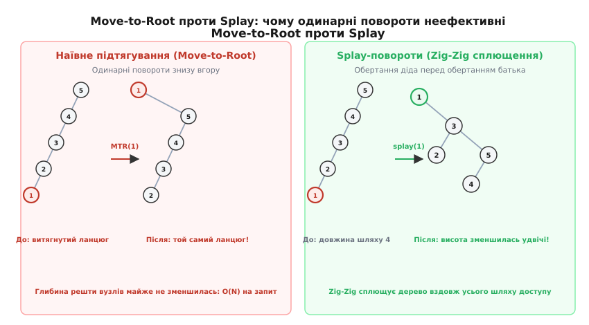
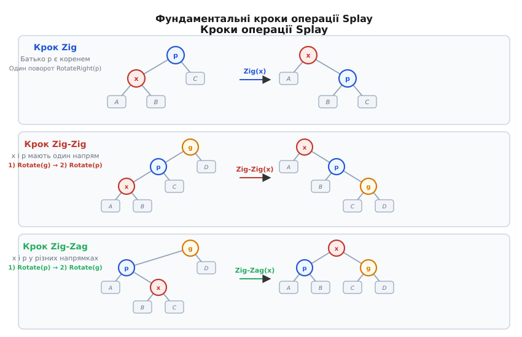
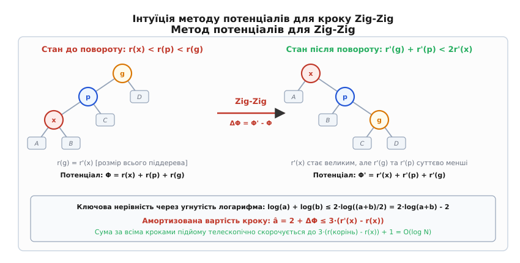
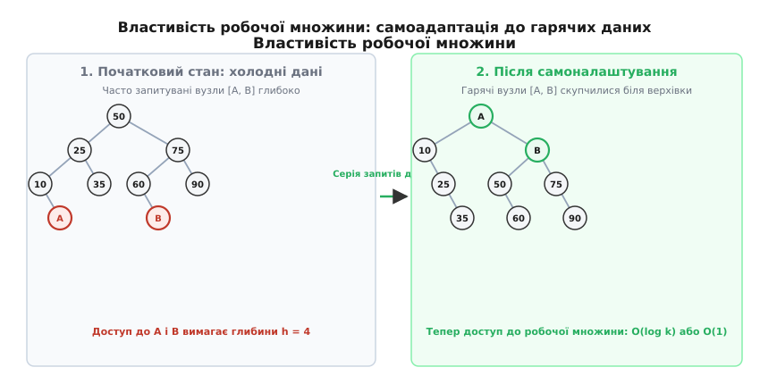
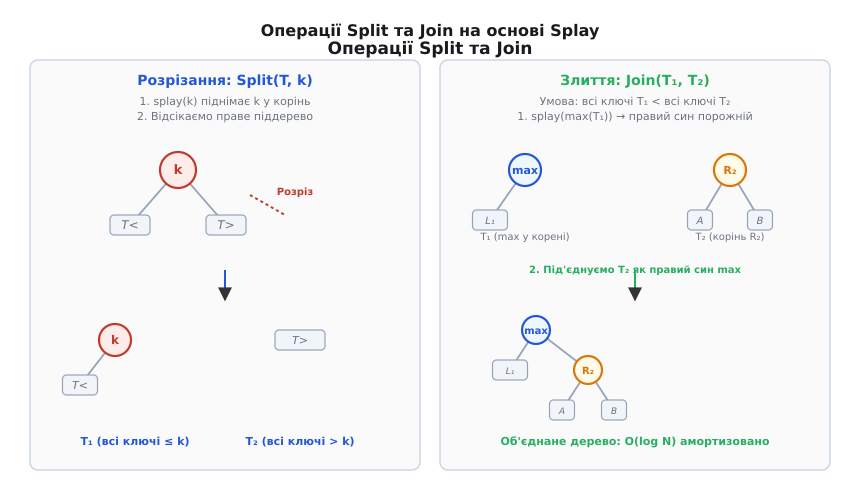

# Splay-дерево

<preknowlist>
- [Двійкове дерево пошуку](root:sf-algorithms/binary-search-tree) — базові властивості BST, інваріант впорядкованості та стандартні операції пошуку.
- [Обертання дерева](root:sf-algorithms/tree-rotation) — малі ліві та праві обертання, збереження симетричного порядку ключів.
- [Амортизований аналіз](root:computability/amortized-analysis) — метод потенціалів, реальна та амортизована вартість послідовності операцій.
</preknowlist>

У типових системах обробки даних потік запитів рідко буває рівномірним: у базах даних, мережевих маршрутизаторах чи трансляторах адрес переважна більшість звернень (часто до 80–90%) припадає на невелику підмножину «гарячих» ключів. Якщо для збереження такої множини використати класичне строго збалансоване дерево, наприклад [AVL-дерево](root:sf-algorithms/avl-tree) або [червоно-чорне дерево](root:sf-algorithms/red-black-tree), кожен окремий запит долатиме повну глибину дерева `log2(N)` кроків. Структура з жорстким геометричним інваріантом не здатна адаптуватися до повторюваних звернень і змушує систему платити повну логарифмічну ціну за кожен доступ, витрачаючи до того ж оперативну пам'ять на збереження висот, факторів балансу чи бітів кольору в кожному вузлі.

Splay-дерево (від англійського *to splay* — розгортати, сплющувати) розв'язує цю проблему шляхом відмови від збереження будь-якої явної інформації про баланс. Замість підтримки суворої симетрії дерево динамічно перебудовує себе під час кожної операції: щойно до вузла звертаються (для пошуку, вставки чи видалення), спеціальна процедура піднімає його на саму верхівку, роблячи новим коренем дерева.

## Проблема нерівномірного доступу та ціна жорсткого балансу

Стандартні двійкові дерева пошуку гарантують час виконання окремої операції `O(log N)` у найгіршому випадку за рахунок жорстких обмежень на висоту піддерев. Проте в реальних застосунках важлива не стільки теоретична межа одного запиту, скільки сумарний час виконання довгої послідовності з тисяч або мільйонів операцій.

Жорстке балансування має три суттєві практичні недоліки:

1. **Накладні витрати пам'яті на метадані**:
   Кожен вузол AVL-дерева повинен зберігати фактор балансу (чи висоту), а вузол червоно-чорного дерева — біт кольору. Через вирівнювання структур у 64-бітній системі (data alignment padding) один такий біт чи байт часто збільшує розмір вузла на 8 або 16 байтів. Якщо дерево містить мільйони записів, ці службові поля займають десятки мегабайтів додаткової пам'яті.

2. **Сліпота до часової локальності (Temporal Locality)**:
   Якщо програма виконує 10 000 послідовних звернень до одного й того самого елемента, у червоно-чорному дереві з мільйоном вузлів кожен запит проходитиме шлях довжиною близько 20 переходів за покажчиками. Дерево не «пам'ятає», що цей елемент щойно використовувався, і не наближає його до кореня.

3. **Складність реалізації операцій модифікації**:
   Відновлення балансу при видаленні в червоно-чорному дереві вимагає розбору десятка складних випадків каскадного перефарбовування та подвійних поворотів вздовж усього шляху повернення до кореня.

Ідея самоналаштування полягає у тому, щоб дозволити формі дерева динамічно підлаштовуватися під профіль навантаження. Елементи, до яких звертаються часто або нещодавно, автоматично переміщуються ближче до кореня, де доступ до них коштує `O(1)` або `O(log k)` кроків, тоді як рідко використовувані «холодні» дані витісняються на нижчі рівні.

Детальний опис історичного контексту появи цієї концепції та переходу від жорсткого балансу до самоадаптації наведено в історичній довідці [Народження Splay-дерева: самоадаптація без збереження балансу](root:sf-algorithms/splay-tree/hist-splay.md).

## Чому наївне підтягування (Move-to-Root) зазнає невдачі

Першою природною спробою реалізувати самоналаштування була евристика наївного підтягування в корінь (Move-to-Root, MTR). Її алгоритм простий: знайти шуканий вузол `x` звичайним двійковим спуском, а потім підняти його в корінь серією послідовних одинарних поворотів (RotateLeft або RotateRight) навколо його поточного батька, доки `x` не стане коренем.

Проте одинарні повороти знизу вгору мають фундаментальний геометричний дефект: вони локально змінюють зв'язки, але практично не зменшують глибину інших вузлів уздовж шляху доступу.

Розглянемо вироджене дерево у вигляді прямого ланцюжка з `N` вузлів, де кожен вузол є лівим нащадком попереднього: `N -> (N-1) -> ... -> 2 -> 1`. Глибина вузла `1` дорівнює `N - 1`.

Якщо виконати наївне переміщення Move-to-Root для вузла `1`, серія одинарних поворотів підніме його в корінь. Проте всі інші вузли `2, 3, ..., N` просто змінять орієнтацію і утворять такий самий витягнутий ланцюг, але вже праворуч від кореня: `1 -> N -> (N-1) -> ... -> 2`.


*Порівняння наївного підтягування Move-to-Root та Splay: одинарні повороти лише вивертають ланцюг, тоді як Zig-Zig складає витягнутий шлях удвічі.*

Якщо тепер виконати послідовність запитів до ключів `1, 2, 3, ..., N`, то кожен запит долатиме довгий ланцюг довжиною `O(N)`. Сумарна вартість `N` операцій становитиме:

```
T = N + (N - 1) + (N - 2) + ... + 1    [довжина шляху для кожного з N послідовних запитів]
  = N · (N + 1) / 2                    [сума арифметичної прогресії]
  = O(N²)                              [квадратична сумарна вартість послідовності]
```

Це означає, що середня вартість однієї операції в евристиці Move-to-Root становить `O(N)`. Одинарні повороти не рятують дерево від патологічного виродження при чергуванні запитів.

## Анатомія операції Splay: підйом парами поворотів

Деніел Слітор та Роберт Тарджан у 1985 році виявили, що для запобігання виродженню дерева повороти під час підйому вузла необхідно виконувати не поодинці, а **парами**, причому черговість поворотів у парі має принципове значення.

Операція `splay(x)` приймає вузол `x` і переміщує його в корінь дерева за допомогою циклічного застосування трьох базових кроків: **Zig**, **Zig-Zig** та **Zig-Zag**.


*Три базові кроки підйому Splay: одинарний термінальний поворот Zig, подвійний односторонній поворот Zig-Zig та подвійний різносторонній поворот Zig-Zag.*

### 1. Крок Zig (термінальний крок)

Крок Zig застосовується тоді, коли батько вузла `x` (позначимо його `p`) є коренем дерева (тобто у `x` немає діда `g`).
- Якщо `x` є лівим сином `p`, виконується одне праве обертання `RotateRight(p)`.
- Якщо `x` є правим сином `p`, виконується одне ліве обертання `RotateLeft(p)`.

Оскільки `p` вже був коренем усього дерева, після цього єдиного повороту `x` стає новим коренем, і операція `splay(x)` завершується. Крок Zig виконується щонайбільше один раз наприкінці підйому — лише тоді, коли початкова глибина вузла `x` була непарною.

### 2. Крок Zig-Zig (одностороннє подвійне обертання)

Крок Zig-Zig застосовується тоді, коли вузол `x` та його батько `p` мають однаковий напрямок відносно своїх предків:
- Або `x` є лівим сином `p`, а `p` є лівим сином діда `g` (лівий Zig-Zig).
- Або `x` є правим сином `p`, а `p` є правим сином діда `g` (правий Zig-Zig).

**Критичне правило черговості**: на відміну від наївного Move-to-Root, де спочатку оберталися б `x` і `p`, в операції Zig-Zig **спочатку виконується обертання діда `g` навколо батька `p`, і лише потім обертання батька `p` навколо `x`**.

Саме цей порядок поворотів кардинально змінює топологію гілки: замість простого перенесення вузла нагору вся довга витягнута гілка складається навпіл, а глибина кожного вузла на цьому шляху зменшується приблизно вдвічі.

### 3. Крок Zig-Zag (двостороннє подвійне обертання)

Крок Zig-Zag застосовується тоді, коли напрямки вузла `x` та його батька `p` протилежні:
- Або `x` є правим сином `p`, а `p` є лівим сином `g` (ліво-правий зигзаг).
- Або `x` є лівим сином `p`, а `p` є правим сином `g` (право-лівий зигзаг).

Порядок виконання:
1. Спочатку виконується обертання навколо батька: `RotateLeft(p)` (для ліво-правого випадку). Після цього `x` стає лівим сином `g`, а `p` — лівим сином `x`.
2. Потім виконується обертання навколо діда: `RotateRight(g)`. Вузол `x` стає коренем локального піддерева, `p` — його лівим нащадком, а `g` — правим нащадком.

Після завершення кроку Zig-Zag піддерево стає симетрично збалансованим: обидва колишні предки `p` і `g` стають безпосередніми дітьми вузла `x`.

## Покроковий розбір підйому Splay на виродженому дереві

Щоб наочно побачити геометричне сплющення дерева в дії, простежимо поетапне виконання операції `splay(1)` на виродженому ланцюгу з семи елементів `7 -> 6 -> 5 -> 4 -> 3 -> 2 -> 1`, де кожен елемент є лівим нащадком попереднього.

Початковий стан (глибина вузла 1 дорівнює 6):
```
       7
      /
     6
    /
   5
  /
 4
/
3
/
2
/
1
```

1. **Перший крок Zig-Zig для трійки `{1, 2, 3}`**:
   - Вузол `x = 1`, батько `p = 2`, дід `g = 3`.
   - Спочатку обертаємо діда `3` навколо батька `2`: `RotateRight(3)`. Вузол `3` стає правим сином `2`.
   - Потім обертаємо батька `2` навколо `1`: `RotateRight(2)`. Вузол `2` стає правим сином `1`, а вузол `3` залишається правим сином `2`.
   - Результат після першого подвійного повороту: вузол `1` піднявся на два рівні вгору, а піддерево з коренем `1` містить правий ланцюжок `2 -> 3`.

2. **Другий крок Zig-Zig для трійки `{1, 4, 5}`**:
   - Тепер вузол `x = 1`, новий батько `p = 4`, новий дід `g = 5`.
   - Спочатку обертаємо діда `5` навколо `4`: `RotateRight(5)`. Вузол `5` стає правим сином `4`.
   - Потім обертаємо `4` навколо `1`: `RotateRight(4)`. Вузол `4` стає правим сином `1`, а колишнє праве піддерево `1` (вузли `{2, 3}`) стає лівим сином `4`.
   - Дерево набуває збалансованої форми: глибини вузлів `2, 3, 4, 5` вирівнюються.

3. **Третій крок Zig-Zig для трійки `{1, 6, 7}`**:
   - Вузол `x = 1`, батько `p = 6`, дід `g = 7` (корінь усього дерева).
   - Обертаємо діда `7` навколо `6`: `RotateRight(7)`.
   - Обертаємо батька `6` навколо `1`: `RotateRight(6)`.
   - Вузол `1` стає коренем усього дерева!

Кінцевий стан дерева після `splay(1)`:
```
    1
     \
      6
     / \
    4   7
   / \
  2   5
   \
    3
```

Порівняйте: початкова висота дерева становила 6 ребер. Після підйому найглибшого елемента висота дерева скоротилася рівно вдвічі — до 3 ребер! Усі проміжні вузли вздовж шляху доступу опинилися на глибині не більше 3.

## Метод потенціалів та логарифмічна теорема про доступ

Чому складна послідовність кроків Zig-Zig та Zig-Zag гарантує ефективність дерева? Відповідь дає математичний апарат [амортизованого аналізу](root:computability/amortized-analysis) за методом потенціалів.

Нехай кожному вузлу `x` дерева зіставлено деяку фіксовану додатну вагу `w(x) > 0`. Визначимо дві ключові величини:
- **Розмір піддерева** `s(x)`: сума ваг усіх вузлів у піддереві з коренем `x`.
- **Ранг вузла** `r(x)`: двійковий логарифм його розміру:
```
r(x) = log2(s(x))
```

Потенціал усього дерева `Φ` визначається як сума рангів усіх його вузлів:
```
Φ = ∑ r(x)    [для всіх вузлів x ∈ T]
```


*Геометрична інтуїція методу потенціалів для кроку Zig-Zig: логарифмічна угнутість забезпечує телескопічне скорочення суми амортизованих вартостей.*

Амортизована вартість операції дорівнює реальній кількості поворотів `t` плюс зміна потенціалу `ΔΦ = Φ_після - Φ_до`.

Слітор і Тарджан довели, що для кожного кроку операції splay амортизована вартість строго обмежується зміною рангу піднятого вузла:
- Для кроку Zig: `â_zig ≤ 1 + 3 · (r'(x) - r(x))`.
- Для кроку Zig-Zig: `â_zz ≤ 3 · (r'(x) - r(x))`.
- Для кроку Zig-Zag: `â_zg ≤ 2 · (r'(x) - r(x)) ≤ 3 · (r'(x) - r(x))`.

Коли ми підсумовуємо амортизовану вартість за всіма проміжними кроками підйому вузла `x` до кореня дерева `root`, виникає **телескопічна сума**: усі проміжні ранги взаємно знищуються, залишаючи лише початковий ранг `r(x)` та фінальний ранг у корені `r(root)`:

```
â(splay(x)) ≤ 3 · (r(root) - r(x)) + 1
            = 3 · log2(W / s(x)) + 1
            ≤ 3 · log2(W / w(x)) + 1
```
де `W = s(root)` — повна вага всіх вузлів дерева.

Цей результат називається **Лемою про доступ (Access Lemma)**. Якщо призначити всім вузлам однакові ваги `w(x) = 1`, то `W = N`, а `w(x) = 1`. Звідси випливає фундаментальна теорема:

> **Теорема про логарифмічний доступ**: Амортизована вартість операції `splay(x)` у двійковому дереві з `N` елементів становить `O(log N)`. Довільна послідовність із `M` операцій над деревом з початковим розміром `N` виконується за час `O((M + N) · log N)`.

Повне покрокове математичне виведення нерівностей, доведення для кожного типу повороту через угнутість логарифма та аналіз зміни потенціалів представлені у математичній вставці [Метод потенціалів та логарифмічна теорема про доступ Splay-дерев](root:sf-algorithms/splay-tree/math-splay-potential.md).

## Фундаментальні теореми адаптивності

Сила Splay-дерева полягає в тому, що Лема про доступ справедлива для **будь-якого** розподілу додатних ваг `w(x)`. Вибираючи ваги специфічним чином під час теоретичного аналізу, математики довели низку дивовижних властивостей, якими не володіє жодне статично збалансоване дерево.

### 1. Теорема про статичну оптимальність (Static Optimality)

Нехай послідовність запитів складається з `M` звернень, де кожен ключ `i` запитується з певною фіксованою ймовірністю `p_i`. Якщо призначити ваги `w(i) = p_i`, то сумарний час виконання всієї послідовності на Splay-дереві складе:

```
T_total = O(M · (1 + H(P)))
```
де `H(P) = -∑ p_i · log2(p_i)` — ентропія Шеннона розподілу запитів.

Це означає, що Splay-дерево без будь-якого попереднього знання частот автоматично працює так само швидко (з точністю до константного множника), як найкраще статичне двійкове дерево пошуку, побудоване за алгоритмом Кнута спеціально під цей розподіл.

### 2. Властивість робочої множини (Working Set Property)

Якщо система регулярно працює з невеликою підмножиною з `k` «гарячих» ключів (робоча множина), Splay-дерево автоматично утримує ці елементи біля верхівки.


*Властивість робочої множини: часті запити автоматично групують гарячі вузли поблизу кореня, забезпечуючи час доступу O(log k).*

Час доступу до будь-якого елемента `x` становить `O(log(t(x) + 1))`, де `t(x)` — кількість унікальних ключів, опитаних з моменту останнього звернення до `x`. Якщо розмір робочої множини дорівнює `k`, доступ до будь-якого її елемента коштує `O(log k)` незалежно від того, скільки мільйонів інших записів зберігається в дереві.

### 3. Властивість динамічного пальця (Dynamic Finger Property)

Доведена Річардом Коулом та співавторами у 2000 році після 15 років досліджень, ця теорема стверджує: якщо послідовно запитувати елементи `x` та `y`, час переходу між ними пропорційний логарифму рангової відстані між ними:
```
T(x -> y) = O(log(|rank(x) - rank(y)| + 1))
```
Якщо наступний запит близький за значенням ключа до попереднього (просторова локальність), пошук виконується за час, близький до `O(1)`.

### 4. Теорема про сканування (Scanning Theorem)

Якщо обійти всі `N` елементів Splay-дерева у відсортованому порядку від найменшого до найбільшого, сумарний час усього обходу складе `O(N)`. Середній амортизований час доступу до одного елемента під час послідовного сканування становить `O(1)`.

## Базові операції на базі Splay: Find, Insert, Delete, Split, Join

Завдяки операції `splay` усі стандартні алгоритми на двійкових деревах пошуку зводяться до елегантних та компактних процедур.


*Механіка операцій Split(T, k) та Join(T1, T2) на основі splay-підйому граничних елементів у корінь.*

### Пошук (Find)

1. Виконується звичайний спуск за ключем `k`, як у класичному [двійковому дереві пошуку](root:sf-algorithms/binary-search-tree).
2. Якщо вузол зі значенням `k` знайдено, для нього викликається `splay(x)` — вузол стає новим коренем дерева.
3. Якщо ключ `k` відсутній у дереві, операція `splay` викликається для останнього ненульового вузла, який вдалося відвідати перед виходом на `NULL`. Цей найближчий наявний елемент піднімається в корінь.

У результаті пошук навіть неіснуючого ключа частково балансує дерево вздовж усього шляху перевірки.

### Розрізання (Split) та Злиття (Join)

Ці дві операції є будівельними блоками для всіх модифікацій:

- **`Split(T, k)`**: розрізає дерево `T` на два піддерева `T_left` (усі ключі `≤ k`) та `T_right` (усі ключі `> k`).
  - Викликаємо `splay(k)`. Ключ `k` (або найбільший ключ `< k`) опиняється в корені.
  - Усі елементи, більші за `k`, гарантовано знаходяться у правому піддереві кореня.
  - Від'єднуємо праве піддерево: `T_right = root->right; root->right = NULL; T_left = root`.

- **`Join(T_left, T_right)`**: об'єднує два дерева за умови, що всі ключі в `T_left` строго менші за всі ключі в `T_right`.
  - Якщо одне з дерев порожнє, повертаємо інше.
  - Викликаємо `splay(max(T_left))` — піднімаємо максимальний елемент лівого дерева в його корінь.
  - Оскільки цей елемент є найбільшим у `T_left`, у його кореня гарантовано **відсутній правий нащадок** (`root_left->right == NULL`).
  - Просто приєднуємо `T_right` як праве піддерево кореня `T_left`: `root_left->right = root_right`.

### Вставка (Insert)

Вставка елемента з ключем `k` реалізується в кілька рядків через `Split`:
1. Виконуємо `Split(T, k)` на вихідному дереві, отримуючи `T_left` та `T_right`.
2. Створюємо новий вузол `new_node` з ключем `k`.
3. Робимо `T_left` лівим сином нового вузла, а `T_right` — його правим сином.
4. Новий вузол стає коренем оновленого дерева.

### Видалення (Delete / Erase)

Видалення вузла з ключем `k` вимагає лише одного splay та одного Join:
1. Викликаємо `splay(k)`. Шуканий вузол піднімається в корінь дерева.
2. Якщо `root->key != k`, елемент у дереві відсутній, операція завершується.
3. Якщо ключ знайдено, відкидаємо корінь і об'єднуємо його ліве та праве піддерева через `Join(root->left, root->right)`.
4. Результат злиття стає новим коренем дерева.

Детальний програмний контракт усіх операцій, сигнатури функцій та таблиці складності наведено у вставці [Інтерфейс та контракт операцій Splay-дерева](root:sf-algorithms/splay-tree/api-splay-tree.md).

## Архітектура Top-Down проти Bottom-Up

У реальних бібліотеках розрізняють два підходи до реалізації:

1. **Bottom-Up (знизу вгору)**:
   Вузол спочатку знаходиться звичайним спуском, після чого піднімається вгору за покажчиками на батьків `parent` або через рекурсивний стек. Цей підхід вимагає додаткових 8 байтів на покажчик `parent` у кожному вузлі (або стек викликів глибиною до `O(N)`).

2. **Top-Down (зверху вниз)**:
   Розроблений Слітором і Тарджаном, цей метод виконує обертання безпосередньо під час спуску від кореня до шуканого ключа. По мірі руху дерево розщеплюється на три частини:
   - Ліве дерево `L` (зберігає вузли з ключами, меншими за шуканий).
   - Праве дерево `R` (зберігає вузли з ключами, більшими за шуканий).
   - Центральне піддерево `T` (поточна область пошуку).

Коли ключ знайдено, центральне піддерево з'єднується з `L` та `R` за `O(1)` кроків. Top-Down підхід працює за **один прохід**, не потребує покажчиків на батьків і показує помітно вищу швидкість на сучасних процесорах завдяки відмінній локальності процесорного кешу.

Повний вихідний код обох варіантів реалізації на C та C++, детальний аналіз пам'яті та бенчмарки наведені в практичній вставці [Реалізація Splay-дерева: Bottom-Up та Top-Down підходи](root:sf-algorithms/splay-tree/proj-splay-tree.md).

## Порівняння Splay-дерев з іншими збалансованими структурами

Щоб обрати оптимальну структуру даних під конкретну інженерну задачу, корисно зіставити Splay-дерево з альтернативними збалансованими деревами пошуку:

| Критерій | Splay Tree | Red-Black Tree | AVL Tree | Treap (Декартове дерево) | SkipList |
| :--- | :--- | :--- | :--- | :--- | :--- |
| **Worst-case окремої операції** | `O(N)` | `O(log N)` | `O(log N)` | `O(N)` | `O(N)` |
| **Амортизований час доступу** | `O(log N)` | `O(log N)` | `O(log N)` | `O(log N)` (математичне сподівання) | `O(log N)` (математичне сподівання) |
| **Адаптація до гарячих даних** | **Автоматична `O(log k)`** | Немає (завжди `O(log N)`) | Немає (завжди `O(log N)`) | Немає | Немає |
| **Пам'ять на вузол (покажчики + метадані)** | **16 байтів (2 покажчики)** | 25 байтів (3 покажчики + колір) | 28 байтів (3 покажчики + висота) | 20 байтів (2 покажчики + пріоритет) | 24–40 байтів (масив покажчиків) |
| **Паралельне читання без блокувань** | **Неможливе (читання мутує)** | Можливе (read lock) | Можливе (read lock) | Можливе (read lock) | **Відмінне (lock-free)** |
| **Складність реалізації** | **Дуже низька** | Висока | Середня | Низька | Середня |

З таблиці видно, що Splay-дерево є беззаперечним лідером за мінімалізмом пам'яті та адаптивністю до нерівномірних потоків даних, але поступається червоно-чорним деревам у сценаріях із жорсткими обмеженнями на максимальну затримку (hard real-time) та високопаралельних базах даних.

## Практичні застосування та інженерні обмеження

> 🔧 **Навіщо це.**
> Splay-дерева ідеальні для систем, де розмір оперативної пам'яті на вузол критично обмежений, а потік запитів має виражену часову локальність: кеші мережевих маршрутизаторів, розподіл вільних блоків пам'яті в алокаторах та динамічні дерева зв'язків у графах.

### Головні сфери застосування

1. **Мережева маршрутизація та комутація пакетів (IP Flow Cache)**:
   У комутаторах та шлюзах мережеві пакети обробляються потоками (TCP-сесії, тунелі). Із мільйонів можливих адрес у кожен конкретний момент часу активними є лише кілька сотень сесій. Використання Splay-дерева для кешу таблиці маршрутизації дозволяє знаходити префікси активних сесій за `O(1)` або `O(log k)` операцій, мінімізуючи час затримки комутації (packet forwarding latency).

2. **Link-Cut Trees (дерева зв'язків та розрізів Тарджана)**:
   Фундаментальна структура даних для підтримки динамічної зв'язності у лісах, розв'язання задачі найменшого спільного предка (LCA) та алгоритмів максимального потоку. Кожен щільний шлях (preferred path) у Link-Cut дереві представляється у вигляді Splay-дерева, ключем у якому є глибина вузла у вихідному дереві. Операція `Access(v)` виконує послідовність splay-підйомів у допоміжних деревах та перемикання ребер за `O(log N)` амортизованого часу завдяки сумі потенціалів.

3. **Динамічне стиснення даних (Dynamic Huffman Coding)**:
   При потоковому стисненні символи надходять нерівномірно. Splay-дерева дозволяють динамічно перебудовувати кодове дерево після кожного зчитаного символу без повної перегенерації префіксного коду з нуля.

4. **Алокатори пам'яті (Memory Allocators)**:
   Керування списками вільних блоків за розмірами (наприклад, у спеціалізованих версіях системних алокаторів jemalloc або dlmalloc) виграє від мінімального розміру службового заголовка вузла (лише 2 покажчики без бітів балансу).

### Інженерні обмеження та компроміси

Незважаючи на унікальні переваги, Splay-дерево має два суттєві обмеження:

- **Мутуючі операції читання (Read Mutability)**:
  Операція `find` у Splay-дереві обов'язково викликає `splay`, тобто змінює структуру покажчиків у дереві. Через це неможливо організувати паралельне читання багатьма потоками через звичайні спільні блокування (`read lock`). Будь-який доступ вимагає ексклюзивного блокування (exclusive write lock), що суттєво обмежує масштабованість у багатопотокових системах.

- **Відсутність worst-case гарантій для окремого запиту**:
  Одиничний запит до щойно виродженого або холодного вузла може зайняти `O(N)` часу. У системах жорсткого реального часу (hard real-time / safety-critical systems), де затримка кожної окремої операції повинна бути строго обмежена мікросекундами, Splay-дерева поступаються червоно-чорним деревам з їхньою строгою гарантією `O(log N)` на кожен запит.
