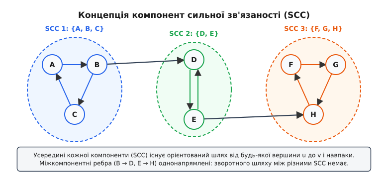
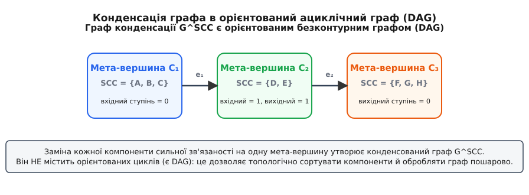
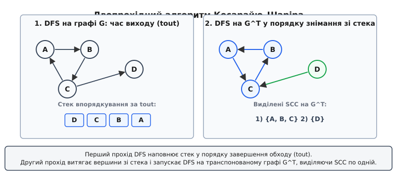
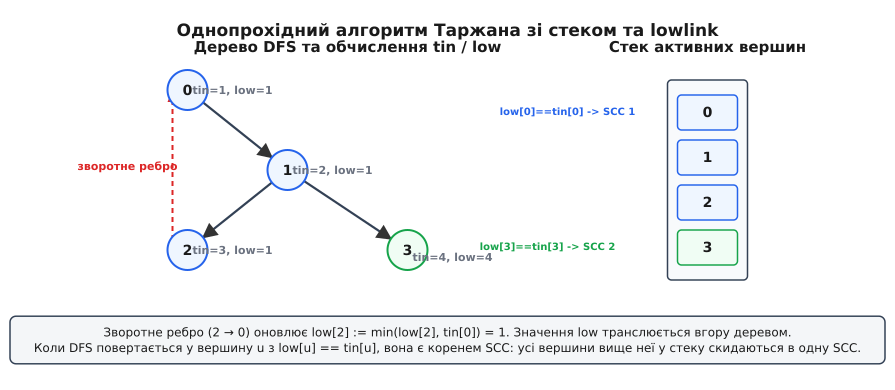

# Компоненти сильної зв'язаності: взаємна досяжність та топологічна конденсація графа

<preknowlist>
- [Обхід у глибину (DFS)](topic:sf-algorithms/depth-first-search) — обхід вершин графа із фіксацією часів входу й виходу, кольорів вершин та дерева пошуку.
- [Орієнтований граф та списки суміжності](topic:sf-algorithms/graph-representation) — поняття орієнтованого ребра, вхідного/вихідного ступеня та представлення графа в пам'яті.
- [Топологічне сортування](topic:sf-algorithms/topological-sort) — впорядкування вершин орієнтованого ациклічного графа (DAG) за часом завершення DFS.
</preknowlist>

Коли міжсистемний менеджер збірки або аналізатор сирцевого коду намагається впорядкувати 100 000 програмних модулів для послідовної компіляції, звичайний обхід у глибину чи ширину миттєво зупиняється на першому ж зацикленні: модуль A залежить від B, B залежить від C, а C викликом звертається до A. Наявність навіть одного такого замкненого контуру унеможливлює лінійне впорядкування. Спроба видалити або скомпілювати будь-який один із цих модулів окремо від інших руйнує збірку всієї системи. Щоб згорнути таку складну мережу у керовану ациклічну структуру без циклів, необхідно розбити множину вершин на максимальні підмножини, у межах яких від кожної вершини можна дістатися до будь-якої іншої в обох напрямках.

## Взаємна досяжність та структура орієнтого графа

У неупорядкованих (неорієнтованих) графах зв'язаність є геометрично простим поняттям. Якщо між вершинами `u` та `v` існує ребро, по ньому можна вільно пересуватися в обох напрямках. Неорієнтований граф розбивається на компоненти зв'язаності шляхом звичайного обходу в ширину (BFS) або глибину (DFS): кожна виділена підмножина вершин є ізольованим «островом», до якого або можна дістатися по ненапрямлених мостах, або ні.

Проте у спрямованих графах (орграфах), де кожне ребро має строго визначену орієнтацію від джерела до мети, виникає фундаментальна асиметрія. Наявність орієнтованого шляху від вершини `u` до вершини `v` взагалі не гарантує існування зворотного маршруту від `v` до `u`. Наприклад, у графі веб-сторінок гіперпосилання з головної сторінки новинного порталу може вести на статтю 2010 року, але ця архівна стаття не має жодної зворотної вихідної посилки на головну сторінку. Рух можливий лише в один бік.

Сформулюємо двосторонню умову для пар вершин. Розглянемо дві вершини `u` та `v` у спрямованому графі `G = (V, E)`:
1. Існує орієнтований шлях `u →* v` (від `u` до `v` можна дістатися по послідовності орієнтованих ребер).
2. Існує орієнтований шлях `v →* u` (від `v` до `u` також існує зворотний маршрут по дугах графа).

Якщо обидві умови виконуються одночасно, вершини `u` та `v` називаються взаємно досяжними. Позначимо це відношення як `u R v`.

Відношення взаємної досяжності `R` задовольняє всім трьом математичним аксіомам відношення еквівалентності:
- **Рефлексивність (`u R u`):** Кожна вершина взаємно досяжна сама з собою по тривіальному шляху довжини 0, що складається з єдиної вершини `u`.
- **Симетричність (`u R v ⇒ v R u`):** За визначенням двосторонності, твердження «`u` досяжна з `v` і `v` досяжна з `u`» є повністю симетричним відносно порядку аргументів.
- **Транзитивність (`u R v ∧ v R w ⇒ u R w`):** Якщо з `u` можна дістатися до `v` і повернутися назад, а з `v` можна дістатися до `w` і повернутися назад, то конкатенація шляхів `u →* v →* w` забезпечує прямий шлях від `u` до `w`, а конкатенація `w →* v →* u` забезпечує зворотний шлях від `w` до `u`.

Оскільки `R` є відношенням еквівалентності, воно строго розбиває всю множину вершин графа `V` на неперетинні класи еквівалентності `V / R = {C_1, C_2, ..., C_k}`.

Максимальна за включенням підмножина вершин `S ⊆ V`, у якій будь-які дві вершини є взаємно досяжними, називається **компонентою сильної зв'язаності** (Strongly Connected Component, або скорочено **SCC**; від латинського *connectere* — зв'язувати, з'єднувати). Термін «максимальна за включенням» означає, що до підмножини `S` неможливо додати жодної іншої вершини з `V \ S` без порушення умови взаємної досяжності між усіма елементами розширеної множини.


*Компоненти сильної зв'язаності (SCC) утворюють максимальні підмножини вершин із взаємною досяжністю, а міжкомпонентні ребра спрямовані лише в один бік.*

Якщо орієнтований граф складається з єдиної компоненти сильної зв'язаності (тобто `SCC = V`), сам граф називається **сильнозв'язаним**. Прикладом сильнозв'язаного графа є будь-який простий орієнтований цикл `0 → 1 → 2 → ... → N-1 → 0` або повний орієнтований граф. Якщо ж граф узагалі не містить орієнтованих циклів (є DAG), кожна його вершина утворює окрему компоненту сильної зв'язаності розміром в один елемент, оскільки жодна пара різних вершин не може бути взаємно досяжною.

Класифікація графа за відношенням взаємної досяжності надає глибокий інструмент аналізу складних систем. Воно дозволяє звести задачу аналізу зв'язаності до ізольованого вивчення кожного класу еквівалентності окремо, гарантуючи відсутність прихованих циклів між різними класами.

## Топологічна конденсація графа

Ключовою концептуальною властивістю компонент сильної зв'язаності є можливість «згортання» або стиснення внутрішньої циклічної структури графа. Якщо замінити кожну компоненту сильної зв'язаності `S_i` на одну узагальнену «мета-вершину» `C_i`, а між мета-вершинами `C_i` та `C_j` провести орієнтоване ребро тоді й лише тоді, коли в оригінальному графі існувало хоча б одне ребро `u → v` (де `u ∈ S_i`, `v ∈ S_j`), ми отримаємо так званий **конденсований граф** `G^SCC` (або фактор-граф).


*Згортання компонент сильної зв'язаності в мета-вершини перетворює довільний орієнтований граф на ациклічний (DAG).*

Фундаментальна теорема теорії графів стверджує: **граф конденсації `G^SCC` завжди є орієнтованим безконтурним графом (DAG, Directed Acyclic Graph)**.

Доведення цього факту будується від протилежного. Припустимо, що граф конденсації містить орієнтований цикл, який проходить через мета-вершини `C_1 → C_2 → ... → C_m → C_1`, де `m ≥ 2`. Розглянемо дві довільні мета-вершини цього циклу, наприклад `C_1` та `C_2`. Наявність циклу в `G^SCC` означає існування мета-шляху від `C_1` до `C_2` та зворотного мета-шляху від `C_2` до `C_1`.

З визначення ребер у `G^SCC` випливає, що якщо існує мета-шлях `C_1 →* C_2`, то в оригінальному графі `G` існує орієнтований шлях від будь-якої вершини `u ∈ C_1` до будь-якої вершини `v ∈ C_2`. Аналогічно, існування мета-шляху `C_2 →* C_1` означає існування шляху в `G` від `v ∈ C_2` до `u ∈ C_1`.

Звідси для довільних вершин `u ∈ C_1` та `v ∈ C_2` маємо:
- `u →* v` (шлях існує в оригінальному графі `G`),
- `v →* u` (зворотний шлях також існує в `G`).

Поєднуючи ці два твердження, отримуємо `u R v`, що свідчить про те, що вершини `u` та `v` належать до одного й того самого класу еквівалентності. Отже, `C_1 = C_2`. Отримане суперечність із припущенням про те, що `C_1` та `C_2` є різними мета-вершинами, строго доводить, що граф `G^SCC` взагалі не може містити орієнтованих циклів і є DAG.

Детальний формальний доказ цього масивного інваріанта, леми про розбиття та алгебраїчні властивості відношення взаємної досяжності висвітлено у вставці [математичну теорію конденсації графа та відношення досяжності](topic:sf-algorithms/strongly-connected-components/math-scc-condensation.md).

Топологічна конденсація графа має виняткову практичну цінність в алгоритмічній інженерії. Вона дозволяє розділити складну систему на два абсолютно прозорі рівні:
1. **Внутрішній рівень компонент:** Кожна SCC являє собою зациклений локальний вузол, вершини якого знаходяться у стані нерозривної взаємозалежності і мають оброблятися спільно.
2. **Зовнішній рівень конденсації:** Граф `G^SCC` являє собою строго впорядковану ациклічну структуру (DAG). До нього можна застосовувати топологічне сортування, обчислювати найкоротші чи найдовші шляхи методом динамічного програмування та виконувати пошарову паралельну обробку даних.

Ациклічна структура `G^SCC` відкриває можливість для хвильової паралельної обробки (wavefront execution): усі компоненти, що не мають вхідних ребер (джерела), можуть оброблятися паралельно на різних ядрах процесора. Після завершення обробки джерел вони вилучаються з графа, що вивільняє наступний шар ациклічної структури.

## Алгоритм Косарайю–Шаріра: двопрохідна дуальність

Історично першим алгоритмом, який розв'язав задачу виділення всіх компонент сильної зв'язаності за строго лінійний час `O(|V| + |E|)`, став алгоритм Самбу Косарайю та Міхи Шаріра. В його основі лежить елегантна математична ідея: використання часу завершення обходу DFS для топологічного сортування мета-вершин графа конденсації.

Уявімо граф конденсації `G^SCC`. Оскільки він є DAG, у ньому існують компоненти-джерела (у які не входять міжкомпонентні ребра з інших компонент) та компоненти-стоки (з яких не виходять міжкомпонентні ребра до інших компонент).

Якщо ми запустимо обхід у глибину (DFS) на оригінальному графі `G`, то вершини тієї компоненти, яка знаходиться «найвище» у топологічному порядку `G^SCC` (компонента-джерело), завершать свій обхід останніми серед усіх вершин цієї компоненти та досяжних з неї підграфів. Отже, вершина з **максимальним часом виходу `tout`** у всьому графі гарантовано належить до компоненти-джерела графа конденсації `G^SCC`.

Однак, якщо ми спробуємо виділити таку компоненту-джерело звичайним запуском DFS з цієї вершини на оригінальному графі `G`, обхід «утече» по вихідних міжкомпонентних ребрах у сусідні нижчележачі компоненти і захопить їх у свій список відвіданих. Щоб заблокувати такий небажаний витік обходу, алгоритм Косарайю застосовує інверсію ребер — будує **транспонований граф** `G^T`.


*Перший прохід DFS будує стек завершення обходу (tout), а другий прохід на транспонованому графі G^T виділяє компоненти по одній у топологічному порядку.*

Алгоритм Косарайю–Шаріра виконується у три чітко визначені етапи:

### Етап 1: Перший прохід DFS на оригінальному графі G
Запускається класичний обхід у глибину на графі `G = (V, E)`. Для обробки незв'язаних компонент обхід повторюється у циклі по всіх вершинах від `0` до `V - 1`. Кожного разу, коли DFS повністю завершує обробку вершини `u` (тобто коли переглянуто всі її вихідні ребра і відбулося повернення з усіх рекурсивних викликів), вершина `u` штовхається у допоміжний стек. В результаті на вершині стека опиняється вершина з абсолютним максимумом часу виходу `tout`.

### Етап 2: Транспонування графа G
Створюється транспонований граф `G^T = (V, E^T)`, у якому напрямок кожного ребра інвертовано: якщо в `G` існувало ребро `u → v`, то в `G^T` додається ребро `v → u`. Для списків суміжності це вимагає створення нової структури графа й проходу по всіх `|E|` ребрах.

### Етап 3: Другий прохід DFS на транспонованому графі G^T
Поки стек, заповнений на Етапі 1, не спорожніє, з нього послідовно вилучаються вершини. Якщо витягнута зі стека вершина `u` ще не була відвідана під час другого етапу, для неї запускається окремий DFS на транспонованому графі `G^T`. Усі вершини, які досяжні з `u` під час цього конкретного проходу у `G^T`, утворюють **одну окрему компоненту сильної зв'язаності**. Після завершення цього DFS усі виявлені вершини помічаються як оброблені, і алгоритм переходить до наступної непризначеної вершини зі стека.

Математична коректність другого проходу на `G^T` базується на наступній інваріантній властивості: у транспонованому графі `G^T` напрямок усіх міжкомпонентних ребер змінюється на протилежний. Компонента, яка була джерелом у `G`, у графі `G^T` стає стоком! Тому обхід DFS, стартувавши у `G^T` з вершини цієї компоненти, взагалі не має вихідних міжкомпонентних ребер — усі міжкомпонентні дуги у `G^T` тепер спрямовані всередину цієї компоненти. В результаті DFS виявляється повністю замкненим усередині своєї компоненти і чесно виділяє її вершини, не зачіпаючи решту графа.

Складність алгоритму Косарайю–Шаріра становить `O(|V| + |E|)` за часом (двічі виконується повний обхід графа) та `O(|V| + |E|)` за пам'яттю для збереження транспонованого графа та стека вершин.

## Алгоритм Таржана: однопрохідна елегантність зі стеком

При усій своїй концептуальній прозорості алгоритм Косарайю має суттєвий практичний недолік: він вимагає побудови й збереження в оперативній пам'яті повного транспонованого графа `G^T` та виконання двох окремих послідовних проходів. У 1972 році Роберт Таржан опублікував фундаментальний алгоритм, який знаходить усі компоненти сильної зв'язаності **за один-єдиний прохід DFS**, використовуючи лише один стек та два числові масиви.

Алгоритм Таржана спирається на глибокий аналіз дерева обходу DFS. Під час виконання DFS кожній вершині `u` при першому відвідуванні присвоюється унікальний порядковий номер — час входу `tin[u]` (або `discovery time`). Лічильник часу починається з 1 і збільшується на одиницю при кожному переході до нової вершини.

Окрім `tin[u]`, для кожної вершини обчислюється динамічна величина `low[u]`. Вона визначається як найменший час входу `tin`, досяжний з піддерева обходу DFS вершини `u` через послідовність деревних ребер та не більше ніж одне зворотне ребро.


*Зворотні ребра знижують значення low[u], а повернення у вершину з low[u] == tin[u] сигналізує про виявлення кореня нової компоненти сильної зв'язаності.*

Під час обходу DFS кожна відвідана вершина `u` негайно додається до допоміжного стека активних вершин, а її прапорець `in_stack[u]` виставляється у значення `true`.

Коли обхід перебуває у вершині `u` і переглядає її вихідне ребро `(u, v)`, алгоритм класифікує це ребро на один із трьох типів:

1. **Деревне ребро (`tin[v] == 0`):** Вершина `v` ще не була відвідана. Алгоритм рекурсивно викликає `DFS(v)`. Після повернення з рекурсивного виклику значення `low[u]` оновлюється:
```
low[u] = min(low[u], low[v])      [підтягуємо мінімальний час з піддерева]
```
2. **Зворотне ребро (`in_stack[v] == true`):** Вершина `v` уже відвідана і перебуває у поточному стеку active-вершин. Це означає, що `v` є предком вершини `u` у дереві DFS і належить до тієї самої розроблюваної компоненти. Значення `low[u]` оновлюється через час входу цієї вершини:
```
low[u] = min(low[u], tin[v])      [оновлення через зворотне ребро]
```
3. **Поперечне ребро до закритої компоненти (`in_stack[v] == false`):** Вершина `v` була відвідана раніше, але вже вилучена зі стека. Це означає, що `v` належить до іншої SCC, яка була повністю сформована й закрита раніше. Таке ребро ігнорується, і `low[u]` не змінюється.

Вирішальний момент алгоритму настає при виході з рекурсивної обробки вершини `u`. Алгоритм перевіряє умову:
```
low[u] == tin[u]
```

Якщо ця рівність виконується, це означає, що з піддерева вершини `u` немає жодного орієнтованого шляху до вершин, які були відвідані раніше за `u` й усе ще знаходяться у стеку. Звідси випливає важливий висновок: **вершина `u` є коренем (найвищою вершиною) нової компоненти сильної зв'язаності**.

У цей момент усі вершини цієї новознайденої SCC знаходяться у стеку active-вершин строго вище за `u` (включаючи саму `u`). Алгоритм запускає цикл вилучення зі стека `pop()`: вершини знімаються одна за одною, їхні прапорці `in_stack` скидаються у `false`, і всі вони записуються до складу поточної SCC, поки зі стека не буде знято саму вершину `u`.

Покрокова робота алгоритму Таржана базується на підтримці трьох ключових інваріантів стека:
- Перший інваріант: будь-яка компонента сильної зв'язаності формує суцільний підсегмент елементів на вершині стека активних вершин в момент повернення у свій корінь.
- Другий інваріант: якщо для вершини `u` значення `low[u] < tin[u]`, вона гарантовано не є коренем SCC і її вилучення зі стека на даному кроці заблоковано.
- Третій інваріант: вилучення елементів зі стека для сформованої SCC не порушує відносний порядок решти активних вершин, які належать предкам у дереві DFS.

## Алгоритм Габова: двостековий обхід

У 2000 році Гарольд Габов у журналі *Information Processing Letters* запропонував модифікацію однопрохідного обходу, яка повністю виключає необхідність арифметичного оновлення та збереження масиву `low[u]`. Замість порівняння числових мінімумів алгоритм Габова підтримує **два окремі стеки**:

1. **Стек вершин (S1):** Вміщує всі вершини, відвідані у поточному обході DFS (аналог стека Таржана).
2. **Стек потенційних коренів (S2):** Вміщує вершини, які на даному кроці вважаються можливими коренями ще не сформованих компонент сильної зв'язаності.

Алгоритм Габова працює за наступними правилами:
- При першому вході у вершину `u` вона додається в обидва стеки `S1` та `S2`.
- Коли обхід розглядає вихідне ребро `(u, v)` і знаходить вершину `v`, яка вже перебуває у `S1` (зворотне ребро), алгоритм вилучає зі стека коренів `S2` усі вершини, чий час входу `tin` строго більший за `tin[v]`. Це вилучення символізує злиття кількох локальних підциклів у єдиний більший цикл із спільним коренем.
- Після завершення перегляду всіх вихідних ребер вершини `u` перевіряється, чи знаходиться `u` на вершині стека коренів `S2`. Якщо так, вершина `u` вилучається з `S2`, а зі стека `S1` знімаються всі вершини до `u` включно, формуючи чергову компоненту сильної зв'язаності.

Головною інженерною перевагою алгоритму Габова на сучасних процесорах із глибоким конвеєром інструкцій є відсутність умовних розгалужень та обчислень `std::min(low[u], ...)` у внутрішньому циклі DFS. Це покращує передбачення розгалужень (branch prediction) та забезпечує високу швидкість на щільних графах.

## Порівняльний аналіз трьох алгоритмів

Усі три розглянуті алгоритми розв'язують задачу виділення компонент сильної зв'язаності за лінійний час `O(|V| + |E|)`, але відрізняються структурами даних, константою швидкості та накладними витратами на пам'ять.

| Критерій порівняння | Алгоритм Косарайю–Шаріра | Алгоритм Таржана | Алгоритм Габова |
| :--- | :--- | :--- | :--- |
| **Кількість проходів DFS** | 2 проходи (на `G` та `G^T`) | 1 прохід | 1 прохід |
| **Вимога транспонування графа** | Потрібно будувати `G^T` | Не потрібно | Не потрібно |
| **Структури даних** | Стек виходу + масив відвіданих | 1 стек + масиви `tin`, `low`, `in_stack` | 2 стеки + масив `tin` |
| **Допоміжна пам'ять** | `O(|V| + |E|)` (пам'ять під `G^T`) | `O(|V|)` | `O(|V|)` |
| **Складність реалізації** | Найпростіший для розуміння | Середня | Середня |
| **Локальність у кеші** | Низька (через прохід по `G^T`) | Висока | Найвища |

З детальною хронологією розробки цих алгоритмів, науковими працями та сучасними паралельними методами можна ознайомитися у вставці [історію створення алгоритмів сильної зв'язаності](topic:sf-algorithms/strongly-connected-components/hist-strongly-connected-components.md).

У практичному системному програмуванні безумовним стандартом є **алгоритм Таржана**, оскільки він обробляє граф за один прохід і вимагає мінімального обсягу оперативної пам'яті `O(|V|)`.

## Програмна архітектура та реалізація

При розробці виробничого коду модулів виділення SCC важно забезпечити ізоляцію алгоритмічного ядра від конкретної внутрішньої структури графа. Алгоритм має працювати через абстрактні списки суміжності або ітератори ребер.

Для виключення ризику переповнення системного стека виконання (stack overflow) під час аналізу надглибоких графів (наприклад, ланцюжків залежностей із глибиною понад 100 000 вершин) застосовують ітеративну модифікацію алгоритму Таржана з явним стеком викликів.

Повна продуктова реалізація алгоритму Таржана з підтримкою C та C++ (із використанням векторів, стека, RAII, ітеративної версії та CSR-формату) наведена у вставці [повну реалізацію алгоритму Таржана на C та C++](topic:sf-algorithms/strongly-connected-components/proj-tarjan-scc.md).

Для інтеграції алгоритму у складні програмні комплекси розроблено формальний контракт специфікації API, опис структур даних `SCCResult` та гарантій складності, який доступний у вставці [специфікацію інтерфейсу SCC API](topic:sf-algorithms/strongly-connected-components/api-scc.md).

## Практичні сфери застосування

Пошук компонент сильної зв'язаності є базовим алгоритмічним блоком у багатьох галузях комп'ютерних наук.

> 🔧 **Навіщо це.**
> Алгоритми SCC дозволяють перетворити складний зациклений граф на просту ациклічну структуру (DAG). Це єдиний спосіб розплутати зациклені залежності в збірці коду, виявити взаємні блокування в базах даних або перевірити логічні формули на суперечність.

### 1. Аналіз циклічних залежностей у системах збірки
У сучасних системах збірки (CMake, Cargo, Bazel, npm) модулі утворюють орієнтований граф залежностей. Якщо декілька пакетів залежать один від одного по колу (`A -> B -> C -> A`), їх неможливо скомпілювати у лінійній послідовності. Запуск алгоритму Таржана дозволяє негайно виявити зациклені групи (SCC розміром `> 1`) та локалізувати помилку архітектури, а для решти ациклічної частини графа побудувати точний порядок компіляції через топологічне сортування графа конденсації.

### 2. Виявлення тупиків (Deadlock Detection) у базах даних
У СУБД та операційних системах ресурси та транзакції моделюються графом очікування (Wait-For Graph). Якщо транзакція `T1` чекає на блокування, утримуване `T2`, а `T2` чекає на `T3`, яка утримує ресурс `T1`, виникає взаємне блокування (deadlock). Наявність компоненти сильної зв'язаності розміром більше одиниці у графі очікування строго еквівалентна наявності тупикової ситуації. Періодичний запуск алгоритму Таржана дозволяє СУБД виявляти deadlocks за лінійний час і примусово переривати одну з транзакцій.

Розглянемо схему роботи детектора блокувань. База даних веде списки утримання блокувань на таблицях та транзакціях. Кожні 500 мілісекунд утиліта фонового аналізу збирає поточний граф очікування і запускає обчислювач Таржана. Якщо результат містить SCC із `num_members > 1`, система вибирає транзакцію з найменшим пріоритетом або найменшим часом виконання у складі цієї SCC і надсилає їй команду скасування `ABORT`. Це вивільняє ресурси і дає змогу іншим транзакціям успішно завершити роботу.

### 3. Розв'язання задачі 2-SAT (двокон'юнктивна здійсненність)
Задача булевої здійсненності (SAT) у загальному випадку є NP-повною. Проте її окремий випадок — **2-SAT**, де кожна диз'юнкція містить не більше двох літералів `(x_i ∨ x_j)` — розв'язується за лінійний час `O(|V| + |E|)` саме через компоненти сильної зв'язаності.

Кожна диз'юнкція `(A ∨ B)` еквівалентна двом логічним імплікаціям: `¬A ⇒ B` та `¬B ⇒ A`. На основі цих імплікацій будується орієнтований граф (граф імплікацій), де вершинами є змінні та їх заперечення. **Булева формула є здійсненною тоді й лише тоді, коли жодна змінна `x_i` та її заперечення `¬x_i` не належать до однієї компоненти сильної зв'язаності**. Якщо `x_i` та `¬x_i` потрапляють в одну SCC, це означає існування взаємної імплікації `x_i ⇔ ¬x_i`, що є логічною суперечністю.

Розглянемо вираз `(x1 ∨ x2) ∧ (¬x1 ∨ x2) ∧ (x1 ∨ ¬x2) ∧ (¬x1 ∨ ¬x2)`. Граф імплікацій містить ребра `¬x1 ⇒ x2`, `¬x2 ⇒ x1`, `x1 ⇒ x2`, `¬x2 ⇒ ¬x1`, `¬x1 ⇒ ¬x2`, `x2 ⇒ x1`, `x1 ⇒ ¬x2`, `x2 ⇒ ¬x1`. У цьому графі вершини `x1` та `¬x1` виявляються взаємно досяжними та потрапляють до єдиної SCC. Алгоритм Таржана негайно робить висновок про нездійсненність даної булевої формули.

### 4. Веб-краулінг та обчислення PageRank
У глобальній мережі Інтернет веб-сторінки та гіперпосилання утворюють гігантський орієнтований граф. Алгоритми пошуку SCC дозволяють пошуковим роботам виділяти щільно зв'язані кластери веб-сайтів («сильнозв'язане ядро Інтернету»), розраховувати авторитетність сторінок усередині локальних спільнот та оптимізувати обчислення вектора PageRank шляхом пошарової обробки графа конденсації.

### 5. Аналіз графа потоку керування (CFG) у компіляторах
В оптимізуючих компіляторах (LLVM, GCC, Rustc) базові блоки інструкцій функції моделюються у вигляді графа потоку керування (Control Flow Graph). Алгоритми виділення SCC дозволяють виявляти природні цикли (natural loops), визначати їхні вхідні вершини (loop headers) та проводити оптимізації винесення інваріантного коду за межі циклу (Loop Invariant Code Motion, LICM) та розгортання циклів (loop unrolling).
