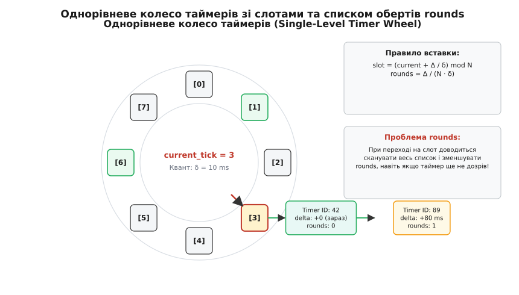
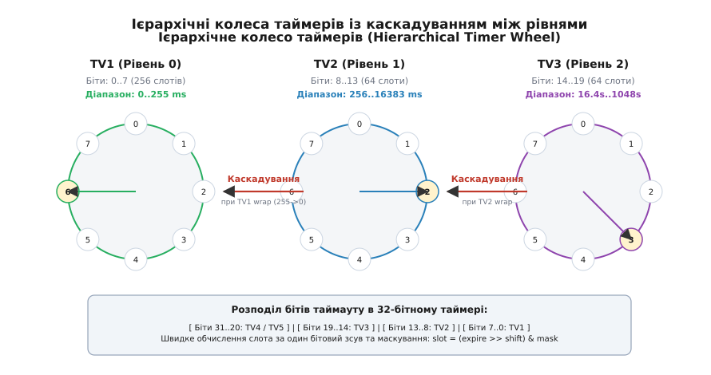
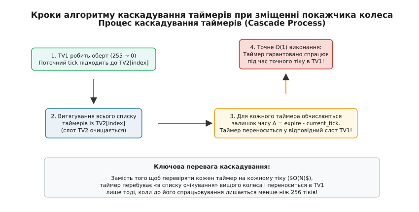

# Колесо таймерів

<preknowlist>
- [Кільцевий буфер](root:sf-algorithms/ring-buffer) — циклічна індексація масиву та остача від ділення або побітове маскування для обчислення позиції слота.
- [Двозв'язаний список](root:sf-algorithms/linked-list) — збереження елементів у слотах із вилученням вузла за O(1) за прямим вказівником.
- [Пріоритетна черга](root:sf-algorithms/priority-queue-adt) — класична альтернатива для витягування найменшого елемента за O(log N).
- [Масив](root:sf-algorithms/array) — суцільна ділянка пам'яті фіксованого розміру та безпосередня індексація за зсувом.
</preknowlist>

Мережевий сервер під навантаженням у 500 000 одночасних TCP-з'єднань щосекунди обробляє сотні тисяч пакетів. Кожен пакет відновить або скидає таймер повторної передачі (Retransmission Timeout, RTO). Якщо таймери зберігаються у двійковій купі або впорядкованому дереві, кожна операція скидання вимагає пошуку вузла та виконання перебудови купи за `O(log N)` кроків з постійними промахами повз кеш процесора. При 500 000 активних таймерах перебудова дерева виїдає до 40% загального часу центрального процесора, знижуючи пропускну здатність мережевого стека в рази і спричиняючи катастрофічні затримки обробки пакетів.

Спроба виправити проблему за допомогою звичайного двозв'язаного списку створює зворотну проблему: вставка нового таймера у впорядкований список вимагає його повного перебору за `O(N)`. Проблема полягає в тому, що класичні структури даних намагаються підтримувати **строгий повний порядок** усіх таймерів відносного майбутнього. Однак операційній системі взагалі не потрібно знати впорядкування між таймером, який спрацює через 10 хвилин, і таймером, який спрацює через 15 хвилин. Системі потрібно лише одне: миттєво дізнатися, які саме таймери мусять спрацювати **саме зараз**, на поточному системному тіку.

---

## 1. Від відносного часу до дискретних слотів

Щоб усунути накладні витрати на впорядкування майбутнього, час розбивають на дискретні інтервали одинакової тривалості — кванти часу (tick resolution), які позначимо через `δ` (наприклад, 1 мілісекунда або 10 мілісекунд). Поточний час виражається цілим лічильником переривань годинника `T ∈ ℕ₀`.

Замість того щоб шукати місце для нового таймера серед тисяч інших, сховище таймерів організують у вигляді кільцевого масиву фіксованого розміру `N`. Кожна комірка (слот) цього масиву відповідає конкретному дискретному моменту часу і містить голову двозв'язаного списку таймерів, призначених на цей крок.


*Однорівневе колесо таймерів із дискретними слотами та списком обертів rounds.*

Якщо розмір колеса обрано як степінь двійки `N = 2ᵏ`, обчислення потрібного слота для таймера із часом спрацьовування `E` зводиться до швидкої побітової операції маскування:

```text
slot = E & (N - 1)
```

Коли системний годинник робить один крок (`T ↦ T + 1`), покажчик поточного слота просувається у кільцевому масиві на 1 позицію:

```text
current_slot = T & (N - 1)
```

Усі таймери, що знаходяться у списку `current_slot`, за визначенням мають час спрацьовування `E = T`. Обробка тіку полягає лише у вилученні всього списку зі слота та послідовному виконанні їхніх callback-функцій. Жодних порівнянь часу, жодних перебудов дерев чи обходу чужих таймерів не відбувається.

Фундаментальна перевага такого підходу полягає у заміні алгоритмічного впорядкування елементів на безпосереднє просторове індексування у пам'яті. Замість того щоб витрачати процесорний час на пошук місця для таймера, алгоритм застосовує час як безпосередній індекс у масиві слотів.

Детальний аналіз того, як ця ідея виникла в лабораторіях DEC під час розробки BSD UNIX і як вона вирішила кризу мережевих таймаутів 1980-х років, подано у вставці [📜 Історія розвитку таймерних коліс та проблема масштабування мережевих таймаутів](root:sf-algorithms/timer-wheel/hist-timer-wheel.md).

---

## 2. Анатомія операцій однорівневого колеса

Розглянемо детально, як функціонують фундаментальні операції однорівневого колеса таймерів та чому вони гарантують константну швидкість.

### 2.1 Планування подій (`Schedule`)

Коли додається новий таймер із відносною затримкою `Δ` тіків, обчислюється абсолютний час спрацьовування `E = T + Δ`. За допомогою оператора побітового маскування `slot = E & (N - 1)` визначається індекс у масиві слотів.

Вузол таймера додається у голова двозв'язаного списку слота `slot`. Оскільки порядок виконання таймерів у межах одного й того самого тіку не має значення (усі вони призначені на одну мілісекунду), вставка у голова списку виконується за 3–4 інструкції процесора без проходу по списку.

### 2.2 Скасування подій (`Cancel`)

Для скасування таймера застосунок не виконує пошуку за ключем. Структура `timer_node_t` зберігає два вказівники на сусідні елементи в списку: `prev` та `next`.

При виклику скасування посилання розмикаються безпосередньо у пам'яті:

```text
node.prev.next = node.next
node.next.prev = node.prev
```

Оскільки операція вимагає лише оновлення чотирьох покажчиків у пам'яті, скасування довільного таймера серед мільйона активних подій виконується строго за `O(1)`.

### 2.3 Обробка тіку (`Tick`)

Під час системного переривання годинника покажчик `current_tick` збільшується на 1. Процесор зчитує голова списку поточного слота `slot = current_tick & (N - 1)`.

Ключовим елементом надійності є **атомарне знімання списку**: слот колеса обнуляється `head = NULL` **до** виклику будь-яких callback-функцій. Це унеможливлює повторну обробку подій або пошкодження структури при рекурсивному додаванні нових таймерів зсередини обробника.

---

## 3. Дилема однорівневого колеса: вибух пам'яті чи оберти rounds

Якщо максимальна затримка таймерів не перевищує розміру колеса (`Δ < N`), однорівневе колесо працює ідеально. Проте реальні системи повинні одночасно підтримувати як мілісекундні таймаути сокетів, так і годинні таймери збереження з'єднання (Keep-Alive) чи добові завдання (Cron).

Якщо обрати `δ = 1 ms`, а максимальний інтервал очікування становить 1 добу (86 400 000 ms), однорівневе колесо вимагало б масиву на 86.4 мільйони слотів. Це призвело б до безглуздої витрати сотень мегабайтів оперативної пам'яті лише під порожні голови списків.

Для розв'язання цієї проблеми в однорівневих колесах застосовують механізм **лічильника обертів (rounds)**. Якщо затримка таймера перевищує місткість колеса `Δ ≥ N`, у структурі таймера зберігають кількість повних обертів колеса, які мусять відбутися до його спрацьовування:

```text
rounds = ⌊ Δ / N ⌋
```

При проходженні покажчика через слот система перебирає приєднаний двозв'язаний список:
* Якщо у таймера `rounds > 0`, його лічильник зменшується на одиницю (`rounds ↦ rounds - 1`), і таймер залишається чекати наступного оберту.
* Якщо `rounds == 0`, таймер вважається дозрілим і виконується.

Проте механізм `rounds` порушує головну обіцянку алгоритму. Уявімо, що в один і той самий слот потрапило 1000 таймерів із різними затримками: 10 мс, 10 мс + 1 оберт, 10 мс + 2 оберти тощо. Під час кожного тіку процесор змушений послідовно проходить весь список із 1000 вузлів, декрементуючи їхні лічильники обертів. Обробка тіку деградує від `O(1)` до `O(K)`, де `K` — кількість елементів у списку слота. При мільйонах довготривалих таймерів це сканування повертає накладні витрати до рівня звичайних списків і спричиняє піки затримки (Latency Spikes).

---

## 4. Ієрархічне таймерне колесо (Hierarchical Timer Wheel)

Щоб усунути сканування обертів `rounds` і зберегти строго константну швидкість, створюють **ієрархію коліс різного розряду**, аналогічну до роботи механічного одометра автомобіля або аналогового годинника зі секундною, хвилинною та годинною стрілками.

Замість одного великого колеса створюють каскад із декількох коліс: `TV₁`, `TV₂`, `TV₃`, ..., `TV_m`.
* Перше колесо (`TV₁`) має найвищу роздільну здатність і відповідає за найближчі таймаути (наприклад, слоти від 0 до 255 мілісекунд).
* Друге колесо (`TV₂`) обслуговує більший часовий діапазон (наприклад, від 256 мс до 16.3 секунд).
* Третє колесо (`TV₃`) покриває інтервали від 16.3 секунд до 17.4 хвилин.
* Четверте колесо (`TV₄`) покриває інтервали від 17.4 хвилин до 18.6 годин.


*Ієрархічне колесо таймерів з розбиттям часових бітів за рівнями TV1-TV3.*

Розподіл часу між колесами базується на розбитті бітів 32-бітного або 64-бітного цілого числа абсолютного часу. У класичній реалізації ядра Linux біти розподіляються наступним чином:
* `TV₁`: 8 бітів (256 слотів);
* `TV₂`: 6 бітів (64 слоти);
* `TV₃`: 6 бітів (64 слоти);
* `TV₄`: 6 бітів (64 слоти);
* `TV₅`: 6 бітів (64 слоти).

Коли додається новий таймер із затримкою `Δ = E - T`, аналізуються старші біти числа `Δ`:
1. Якщо старші біти дорівнюють 0 (`Δ < 256`), таймер одразу розміщується у відповідний слот колеса `TV₁`.
2. Якщо затримка лежить у діапазоні `256 ≤ Δ < 16 384`, таймер розміщується у колесо `TV₂`. Слот обчислюється зсувом на 8 бітів праворуч:

```text
slot_TV2 = (E >> 8) & 0x3F
```

3. Якщо затримка ще більша, таймер потрапляє у `TV₃`, `TV₄` або `TV₅`.

Таймери, які знаходяться у колесах `TV₂ ... TV₅`, не перевіряються при кожному тіку годинника. Вони спокійно лежать у своїх слотах і не завдають жодного навантаження на процесор.

---

## 5. Механіка каскадування (Cascading Process)

Оскільки таймер із великою затримкою спочатку потрапляє у вище колесо (наприклад, у `TV₂`), виникає питання: як і коли він потрапить у `TV₁`, щоб бути виконаним за `O(1)`?

Цей процес називається **каскадуванням (cascading)**.


*Етапи перенесення таймерів із вищих коліс у нижче при проходженні повного оберту.*

Каскадування відбувається в той момент, коли молодше колесо робить повний оберт і його покажчик повертається в позицію 0:
1. Коли колесо `TV₁` робить 256 кроків і обгортається з 255 на 0, покажчик колеса `TV₂` просувається на 1 слот вперед.
2. Слот колеса `TV₂`, на який вказав новий покажчик, **повністю виймається**.
3. Усі таймери з цього слота перепитуються: для кожного таймера обчислюється залишок часу до спрацьовування `Δ' = E - T`.
4. Оскільки покажчик `TV₂` просунувся, залишок часу для всіх цих таймерів тепер гарантовано став меншим за 256 тіків!
5. Усі вони за один швидкий прохід переміщуються (каскадуються) у відповідні слоти колеса `TV₁`.

Якщо колесо `TV₂` у свою чергу робить повний оберт (через кожні 16 384 тіки), відбувається каскадування з колеса `TV₃` у колесо `TV₂`, і так далі по ланцюжку.

На перший погляд здається, що перенесення списку елементів під час каскадування є дорогою операцією. Проте кожен таймер за весь свій час перебування у структурі даних каскадується **не більше одного разу з кожного рівня**. Математичне доведення за допомогою методу потенціалів показує, що амортизована складність каскадування на один тік складає менше ніж 0.0078 операцій на таймер, що зберігає строкову складову `O(1)` для операції `Tick()`.

Повний математичний апарат, формальну теорему та доведення методом потенціалів наведено у вставці [🧮 Математичний аналіз часової складності та параметризація колеса таймерів](root:sf-algorithms/timer-wheel/math-timer-wheel.md).

---

## 6. Деталізація алгоритмів фундаментальних операцій

Для забезпечення максимальної продуктивності реалізація колеса таймерів поєднує бітову арифметику та маніпуляції зі списками.

### 6.1 Алгоритм вставки (`Schedule`)

```text
Алгоритм Schedule(wheel, delay, callback, user_data):
  1. E = wheel.current_tick + delay
  2. delta = delay
  3. Якщо delta < 256:
       slot = E & 0xFF
       target_list = wheel.TV1[slot]
  4. Інакше якщо delta < 16384:
       slot = (E >> 8) & 0x3F
       target_list = wheel.TV2[slot]
  5. Інакше якщо delta < 1048576:
       slot = (E >> 14) & 0x3F
       target_list = wheel.TV3[slot]
  6. Інакше:
       // Обчислення слота для вищих коліс TV4/TV5
  7. Створити вузол node(id, E, callback, user_data)
  8. Додати node у голова target_list за O(1)
  9. Повернути node
```

Завдяки використанню побітового зсуву та маскування обчислення слота вимагає лише 3–5 тактів процесора.

### 6.2 Алгоритм скасування (`Cancel`)

Оскільки вузол таймера містить безпосередні вказівники `prev` та `next` двозв'язаного списку, скасування таймера не вимагає пошуку ні в колесі, ні в списку:

```text
Алгоритм Cancel(node):
  1. Якщо node == NULL повернути False
  2. Якщо node.prev != NULL:
       node.prev.next = node.next
     Інакше:
       node.owner_list.head = node.next
  3. Якщо node.next != NULL:
       node.next.prev = node.prev
  4. Звільнити пам'ять node
  5. Повернути True
```

Видалення вузла з двозв'язаного списку вимагає лише 4 перезаписи вказівників в оперативній пам'яті, що виконується строго за `O(1)`.

### 6.3 Алгоритм просування часу (`Tick`)

```text
Алгоритм Tick(wheel):
  1. wheel.current_tick = wheel.current_tick + 1
  2. tv1_slot = wheel.current_tick & 0xFF
  3. Якщо tv1_slot == 0:
       // Відбувся повний оберт TV1 -> виконуємо каскадування з TV2
       tv2_slot = (wheel.current_tick >> 8) & 0x3F
       Cascade(wheel, wheel.TV2[tv2_slot])
       Якщо tv2_slot == 0:
         // Каскадування з TV3 у TV2 і так далі
  4. expired_list = wheel.TV1[tv1_slot]
  5. wheel.TV1[tv1_slot] = порожньо
  6. Для кожного вузла node в expired_list:
       Викликати node.callback(node.id, node.user_data)
       Звільнити пам'ять node
```

Очищення голови слота (`wheel.TV1[tv1_slot] = порожньо`) **до** початку виконання callback-функцій є критично важливим для захисту від рекурсії: якщо під час виконання callback користувач додасть новий таймер у цей самий слот, новий таймер не буде знищено в поточному циклі.

Повний вихідний код готової до використання реалізації 2-рівневого каскадного таймерного колеса на мовах C та C++ подано у вставці [⚙️ Практична реалізація ієрархічного колеса таймерів на C та C++](root:sf-algorithms/timer-wheel/proj-timer-wheel.md).

Повний опис типів даних, сигнатур функцій, розширеного API та прапорців конфігурації міститься у довіднику [📋 Інтерфейс та специфікація API колеса таймерів](root:sf-algorithms/timer-wheel/api-timer-wheel.md).

---

## 7. Простеження таймерів у Linux та діагностика

У сучасних Linux-системах розробники та системні адміністратори можуть інспектувати стан таймерного колеса безпосередньо через інтерфейси ядра.

### 7.1 Інспекція через `procfs`: `/proc/timer_list`

Файл `/proc/timer_list` містить повний зріз стану всіх Per-CPU коліс таймерів та підсистеми `hrtimers`.

Типовий фрагмент виводу `/proc/timer_list`:

```text
CPU 0: active timers
 #0: <ffff8801a2b3c400>, tick_sched_timer, S:01
 #1: <ffff8801a4f5d800>, delayed_work_timer_fn, S:01

base 0: active timers (timer_wheel)
  base: ffff88021fc10000
  now: 4294967300 (jiffies)
  active timers: 1482
  wheel Array:
    slot 14: 12 timers
    slot 88: 1 timer
```

Кожен потік обробник бачить власну базу `base`, де відображається поточний крок `now (jiffies)` та кількість активних таймерів у кожному слоті.

### 7.2 Динамічне простеження через `tracepoints` та `bpftrace`

Для інспекції затримок та відстеження небезпечних піків каскадування застосовують підсистему eBPF та утиліту `bpftrace`.

Приклад скрипта `bpftrace` для відстеження тривалості обробки каскаду у ядрі:

```bt
tracepoint:timer:timer_cascade
{
    @cascade_start[cpu] = nsecs;
}

tracepoint:timer:timer_expire_exit
/@cascade_start[cpu]/
{
    $dur = nsecs - @cascade_start[cpu];
    @cascade_latency_us = hist($dur / 1000);
    delete(@cascade_start[cpu]);
}
```

Цей динамічний аналіз дозволяє виявити промислові випадки, коли великі сплески довготривалих сокетних таймаутів створюють мікросекундні затримки під час обгортання коліс `TV2` чи `TV3`.

---

## 8. Процесорні затримки, NO_HZ та апаратні чинники

При глибокій системній оптимізації таймерних коліс виникають додаткові вимоги, пов'язані з режим роботи процесорних ядер та апаратними перериваннями.

### 8.1 Режим `NO_HZ_FULL` (Dynamic Ticks) у ядрі Linux

У класичних операційних системах таймерне переривання виникає суворо періодично (наприклад, 1000 разів на секунду при 1000 Hz). Навіть якщо процесор перебуває в стані глибокого сну (Idle) або виконує лише один обчислювальний процес real-time, переривання продовжують пробуджувати ядро, витрачаючи електроенергію та порушуючи детермінізм виконання.

У ядрі Linux було впроваджено режим `NO_HZ` (Dynamic Ticks), який вимикає періодичні таймерні переривання на вільних ядрах. У режимі `NO_HZ_FULL` ядро припиняє переривання годинника на тих ядрах, де працює строго один потік користувача.

Це висуває додаткову вимогу до колеса таймерів:
* Коли ядро готується вимкнути періодичні переривання `tick`, воно перевіряє найближчий слот колеса таймерів `TV1`, у якому є хоча б один активний таймер.
* Апаратний таймер (APIC або Lapic) програмується строго на час найближчого зайнятого слота `T_next`, минаючи проміжні порожні тіки.
* Завдяки цій оптимізації колесо таймерів виконує крок `timer_wheel_tick` лише тоді, коли в системі дійсно є таймери, що дозріли, усуваючи марні виклики порожніх слотів.

### 8.2 Макет пам'яті (Memory Layout) та усунення False Sharing

У високомасштабованих серверах з кількома процесорними сокетами (NUMA-архітектура) масив слотів колеса таймерів розміщується у локальній пам'яті відповідного NUMA-вузла.

Якщо два процесорні ядра одночасно додають таймери у сусідні слоти масиву `tv1[slotA]` та `tv1[slotB]`, які потрапляють в одну 64-байтну кеш-лінію (Cache Line), виникає ефект фальшивого спільного використання (False Sharing). Кеш-лінія починає постійно інвалідуватися між L1-кешами різних ядер, що погіршує швидкість вставки у десятки разів.

Для запобігання цьому дефекту застосовують два інженерні підходи:
1. **Вирівнювання слотів:** кожен слот або група з 8 слотів вирівнюється на 64 байти за допомогою модифікатора `alignas(64)`.
2. **Per-CPU колеса:** кожне процесорне ядро має власне відокремлене колесо таймерів `struct timer_base`. Потік на ядрі 0 працює виключно зі своїм колесом і ніколи не чіпає колесо ядра 1. Якщо таймер треба запланувати на іншому ядрі, застосовують міжпроцесорне переривання (Inter-Processor Interrupt, IPI) із чергою повідомлень без блокувань (Lock-Free Ring Buffer).

---

## 9. Застосування у розподілених серверах та розподілених системах

Концепція таймерного колеса розповсюдилася далеко за межі ядер операційних систем. Сучасні розподілені брокери повідомлень та бази даних використовують колеса таймерів на рівні користувача (User-Space) для масштабування мільйонів фонових завдань.

### 9.1 Ієрархічні таймерні колеса в Apache Kafka

Брокер повідомлень Apache Kafka обробляє мільйони запитів від продюсерів та консюмерів. Кожен запит може вимагати відкладеного підтвердження (Delayed Produce) чи очікування нових повідомлень (Delayed Fetch Timeout).

У ранніх версіях Kafka таймаути оброблялися за допомогою `java.util.concurrent.DelayQueue`, яка базується на пріоритетній купі. При десятках тисяч запитів на секунду витрати на вставку та видалення `O(log N)` викликали високе навантаження на процесор і Garbage Collector.

Розробники Kafka адаптували алгоритм Варгезе та Лаука, створивши `SystemTimer` на основі ієрархічного таймерного колеса (Hierarchical Timing Wheel):
* Кожне колесо має розмір 20 слотів. Перше колесо покриває інтервал 20 мілісекунд (з роздільною здатністю 1 мс).
* Коли таймаут перевищує діапазон поточного колеса, створюється вище колесо із розширеним інтервалом (400 мс, 8000 мс і так далі).
* Колеса створюються за вимогою (On-Demand) лише тоді, коли надходить довготривалий таймер. Це дозволяє утримувати мінімальний обсяг пам'яті при відсутності активних подій.

### 9.2 Таймери акторів в Erlang OTP та Akka

У розподілених серверах на основі акторної моделі (Erlang/OTP та Java Akka) кожен з мільйонів легковагих процесів-акторів може чекати відповіді з таймаутом `receive after Timeout -> ...`.

Внутрішня підсистема планування Erlang VM (`erts_bif_timer`) організована у вигляді багаторівневого колеса таймерів, прив'язаного до потоків планувальника (Scheduler Threads). Це дозволяє Erlang підтримувати понад 10 000 000 одночасних акторів із власними таймерами при низькому споживанні оперативної пам'яті.

---

## 10. Еволюція в мовах високого рівня (Go та Node.js)

Мови програмування з вбудованими середовищами виконання (Runtimes) пройшли власну еволюцію управління таймерами.

### 10.1 Планувальник Go (`runtime/time.go`)

У ранніх версіях мови Go (до версії 1.14) всі горутини, які викликали `time.Sleep()` або `time.After()`, додавали свої тайметри в єдину глобальну двійкову купу, захищену глобальним м'ютексом. При тисячах паралельних горутин конкуренція за м'ютекс таймерів викликала важкі затримки виконання.

У версії Go 1.14 розробники переписали підсистему таймерів:
* Кожна P-структура (Processor у Go runtime) отримала власну квазі-ієрархічну структуру таймерів без блокувань.
* Скасування та перезапуск таймера у Go став здійснюватися за `O(1)` за допомогою позначальних прапорців у внутрішніх бітових масках `timerModified`.

### 10.2 Серверне середовище Node.js та `libuv`

У середовищі Node.js подійний цикл `libuv` використовує комбінацію двох підходів:
* Для точних одиночних таймаутів застосовується двійкова купа `min-heap`.
* для масових HTTP таймаутів сокетних з'єднань застосовуються кільцеві хеш-списки (Hashed Timers), що дозволяє Node.js утримувати понад 100 000 одночасних WebSocket з'єднань на одному потоці подійного циклу без втрати продуктивності.

---

## 11. Системний чекліст для архітектора та вибір структури

При розробці високонавантаженої системи інженер мусить обрати оптимальну структуру даних для відліку часу.

Правила вибору:
1. **Обирайте двійкову купу (Min-Heap / RB-Tree), якщо:**
   * Кількість одночасних таймерів відносно мала (менше 10 000).
   * Вимагається точна наносекундна синхронізація реального часу.
   * Операція скасування є рідкісною подлією (менше 1% від загальної кількості вставок).
2. **Обирайте однорівневе колесо з обертами (`rounds`), якщо:**
   * Усі таймаути є однорідними за величиною (наприклад, усі HTTP таймаути дорівнюють 30 секунд).
   * Обсяг доступної оперативної пам'яті суворо обмежений (мікроконтролери, embedded-системи).
3. **Обирайте ієрархічне каскадне колесо таймерів (Hierarchical Timer Wheel), якщо:**
   * Кількість одночасних подій вимірюється сотнями тисяч чи мільйонами.
   * Операція скасування/перезапуску таймера виникає на кожен мережевий пакет.
   * Важлива мінімальна затримка вставки `O(1)` та висока кеш-локальність процесора.

---

## 12. Взаємодія з системним викликом Linux `io_uring`

Сучасне ядро Linux надає нову асинхронну підсистему введення-виведення `io_uring`. Для управління таймаутами у `io_uring` впроваджено специфічні системні коди операцій:
* `IORING_OP_TIMEOUT`: реєструє відкладений таймаут у кільці надсилання (Submission Queue).
* `IORING_OP_LINK_TIMEOUT`: прив'язує таймаут безпосередньо до попередньої мережевої операції читання чи запису (`IORING_OP_READ`, `IORING_OP_SEND`).

Внутрішня обробка `IORING_OP_TIMEOUT` у ядрі спирається на Per-CPU ієрархічні колеса таймерів. Це дозволяє здійснювати скасування мережевих операцій за таймаутом без виходу в системний контекст (Zero Context Switch), забезпечуючи понад 2 000 000 операцій вводу-виводу на секунду на одному процесорному ядрі.

---

## 13. Порівняльний аналіз архітектурних реалізацій

Різні високонавантажені системи адаптують структуру колеса таймерів під свої специфічні вимоги.

### 13.1 Ядро Linux: Kernel Timers vs HRTimers

У ядрі Linux колесо таймерів (`kernel/time/timer.c`) використовується для стандартних безсистемних таймаутів (джерело часу `jiffies`).
* **Оптимізація:** колесо таймерів у Linux є **Per-CPU** — кожне ядро процесора має власний незалежний екземпляр ієрархічного колеса. Це повністю усуває конкуренцію за блоки між ядрами (lock contention).
* **Розділення ролей:** для таймерів реального часу, які вимагають наносекундної точності (виклики `select()`, `usleep()`, RT-потоки), ядро Linux застосовує підсистему `hrtimers` на основі червоно-чорних дерев (Red-Black Trees). Вони працюють за `O(log N)`, але їхня кількість набагато менша ніж кількість мережевих сокетних таймаутів.

### 13.2 Java Netty: `HashedWheelTimer`

У мережевому фреймворку Netty колесо таймерів застосовується для контролю таймаутів HTTP/gRPC запитів та перевірки з'єднань.
* **Перевага:** запобігає навантаженню на Garbage Collector (GC), оскільки скасування та вставка в колесі не створює та не перебудовує купу об'єктів у `java.util.PriorityQueue`.
* **Параметризація:** розробники Netty за замовчуванням застосовують однорівневе колесо з 512 слотами та лічильником обертів `rounds`, оптимізоване для короткоживучих мережевих запитів.

### 13.3 Порівняльна характеристика ефективності

| Параметр | Min-Heap (Двійкова купа) | Red-Black Tree | Single-Level Wheel | Hierarchical Timer Wheel |
| :--- | :--- | :--- | :--- | :--- |
| **Вставка (`τ_add`)** | `O(log N)` | `O(log N)` | `O(1)` | **`O(1)`** |
| **Скасування (`τ_cancel`)** | `O(log N)` | `O(log N)` | `O(1)` | **`O(1)`** |
| **Обробка тіку (`τ_tick`)** | `O(1)` | `O(log N)` | `O(1 + K)` | **`O(1)` (амортиз.)** |
| **Кеш-локальність CPU** | Низька (стрибки) | Посередня | Висока | **Максимальна** |
| **Складність реалізації** | Середня | Висока | Низька | **Середня** |
| **Основна галузь** | Мала кількість подій | Точний RT-час | Однорідні інтервали | **Мільйони мережевих сокетів** |

---

## 14. Практичні нюанси: джиттер, роздільна здатність та кеш CPU

При практичній реалізації колеса таймерів необхідно враховувати три системні чинники hardware-рівня.

### 1. Квант дискретизації (`δ`) та часовий джиттер (Jitter)

Колесо таймерів оперує дискретними квантами. Якщо таймер запрошено на затримку 12.4 мілісекунди при кванті `δ = 10 ms`, його затримка буде округлена до 2 тіків (20 мілісекунд).
* **Помилка дискретизації:** може досягати величини одного кванта `δ`.
* **Застосування:** колесо таймерів призначене для таймаутів, де невелике запізнення в межах одного кванта є абсолютно прийнятним (наприклад, таймаут повторного відправлення TCP-пакета 200 мс не втрачає ефективності від джиттеру у 1 мс).

### 2. Ефективність кешу L1/L2 процесора

Масив слотів колеса таймерів являє собою щільний вектор у пам'яті. При обробці тіку процесор зчитує сусідні комірки масиву послідовно. Це дозволяє апаратному префетчеру CPU (Hardware Prefetcher) завантажувати наступні слоти у кеш L1 заздалегідь, забезпечуючи нульові затримки при переході між тіками.

### 3. Перспективи розвитку в апаратних мережевих картах (SmartNIC)

З появою програмованих мережевих адаптерів (SmartNIC) та систем DPDK алгоритм ієрархічного таймерного колеса переношується безпосередньо у кремній (FPGA / ASIC). Апаратне колесо таймерів на SmartNIC дозволяє скидати мережеві таймаути TCP RTO на швидкості 400 Gbps без залучення центрального процесора хост-сервера.

---

## 15. Підсумок системного вибору

Завдяки поєднанню строго константного часу вставки `O(1)`, швидкого скасування за вказівником та амортизованого каскадування, ієрархічне колесо таймерів залишається незамінним фундаментом для створення операційних систем, мережевих стеків та високонавантажених серверів. Застосування цієї структури даних забезпечує передбачувану продуктивність та масштаб під час обробки мільйонів одночасних подій у найжорсткіших умовах промислової експлуатації. Практична доцільність алгоритму підтверджена роками роботи у ядрах Linux, BSD, Erlang VM та мережевих адаптерах останнього покоління, роблячи його золотим стандартом розробки підсистем відліку часу.
