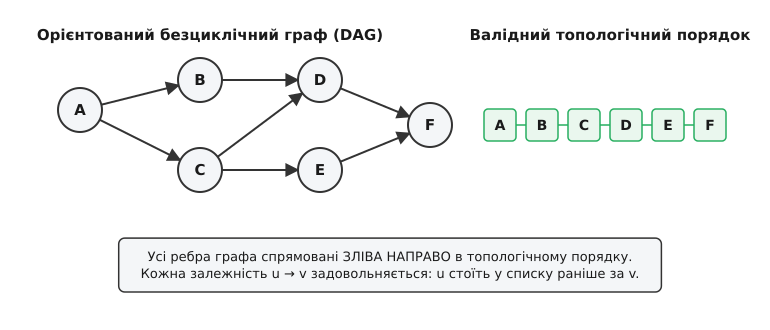
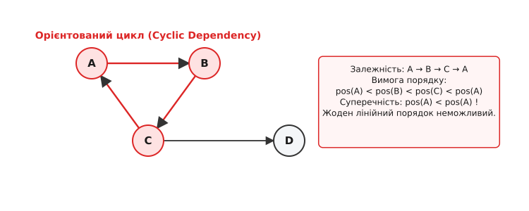
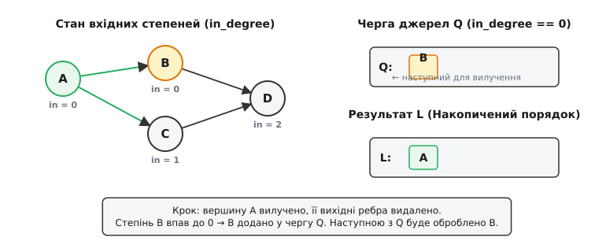
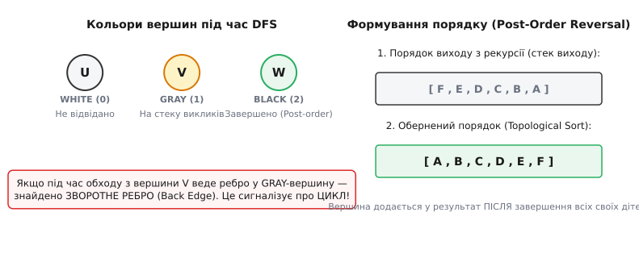

# Топологічне сортування

<preknowlist>
- [Теорія графів](topic:math-combinatorics/graph-theory) — вершини, орієнтовані ребра (дуги) та списки суміжності.
- [Алгоритм Дейкстри](topic:sf-algorithms/dijkstra) — зважені та незважені орієнтовані графи, обхід вершин.
</preknowlist>

Уяви систему збірки великого програмного проекту (`make`, `ninja` чи `cargo`), що має скомпілювати сотні C++ файлів. Файл `main.cpp` включає заголовок `server.h`, а `server.h` вимагає `config.h` та `logger.h`. Якщо утиліта збірки спробує відкомпілювати `main.cpp` першим, компілятор видасть помилку: потрібних типів із `server.h` ще не існує в природі. Спроба скомпілювати `server.cpp` раніше за `config.h` завершиться так само невдало. Щоб збірка пройшла успішно, інструмент повинен знайти такий порядок обробки файлів, за якого **кожна залежність виконується строго раніше від того модуля, що від неї залежить**.

Аналогічна проблема виникає при встановленні пакетів в операційній системі (пакет `python-numpy` вимагає `libblas`, який у свою чергу потребує `glibc`), при складанні навчального плану в університеті (курс «Алгоритми II» можна взяти лише після «Алгоритми I» та «Дискретна математика»), а також у графах обчислень автоматичного диференціювання в нейронних мережах. Наївне рішення — «запустити перебір і сподіватися, що нічого не зламається» — входить у глухий кут, як тільки кількість задач перевищує десяток.

Задача вибудовування елементів у послідовність без порушення жодної з вимог передування називається **топологічним сортуванням** (англ. *topological sort* або *topological ordering*). Замість лінійного пошуку алгоритми топологічного сортування розв'язують цю задачу за лінійний час `O(V + E)` відносно кількості вершин `V` і ребер `E`, виявляючи при цьому будь-які циклічні пастки. Про історію виникнення цієї ідеї в оборонних проектах США та Unix-системах детальніше висвітлено в [історичній вставці](topic:sf-algorithms/topological-sort/hist-topological-sort.md).

---

### Орієнтовані безциклічні графи (DAG) та умова існування порядку

Подамо наші завдання у вигляді орієнтованого графа `G = (V, E)`. Вершини `V` відповідають окремим роботам або файлам, а орієнтоване ребро `u → v` означає напрямок залежності: «завдання `u` має бути виконане **раніше** за завдання `v`» (або «`v` залежить від `u`»).

**Формальне означення:** Топологічним сортуванням орієнтованого графа `G = (V, E)` називається таке лінійне впорядкування всіх його вершин `v[1], v[2], ..., v[n]`, що для кожного орієнтованого ребра `u → v` вершина `u` стоїть у цьому порядку **раніше** за вершину `v` (тобто індекс `pos(u) < pos(v)`).


*Приклад орієнтованого безциклічного графа (ліворуч) та один із його можливих топологічних порядків (праворуч). Усі ребра графа спрямовані строго зліва направо вздовж вишикуваного масиву.*

Важливо зазначити, що орієнтований безциклічний граф є універсальною математичною мовою для моделювання будь-яких процесів із часовими або технологічними обмеженнями. Коли ми говоримо про безциклічність, це означає відсутність зворотного часу: ви не можете повернутися у минуле й змінити вхідні дані, які вже були використані для обчислення проміжного результату. Саме тому будь-яка обчислювальна система, що працює за принципом причинно-наслідкових зв'язків, природно моделюється як DAG. Якщо ж у модель прокрадається цикл, це свідчить про логічну помилку в архітектурі системи — наприклад, коли два модулі намагаються ініціалізувати один одного в момент завантаження, що утворює нерозв'язний глухий кут.

Розглядаючи топологічне сортування, необхідно зафіксувати дві фундаментальні математичні властивості:

1. **Неєдиність порядку.** Для одного й того самого графа може існувати **кілька** різних валідних топологічних порядків. Якщо дві вершини `B` і `C` залежать від `A`, але між собою жодним чином не пов'язані, їх можна розмістити як у порядку `A, B, C`, так і в порядку `A, C, B`. Обидві послідовності задовольняють вихідне означення.
2. **Критерій існування.** Топологічний порядок існує для графа `G` **тоді й лише тоді**, коли граф не містить жодного орієнтованого циклу. Граф без орієнтованих циклів називають **орієнтованим безциклічним графом** (англ. *Directed Acyclic Graph*, скорочено **DAG**).

> 🔧 **Навіщо це.** Вміння подати систему у вигляді DAG — це головний крок при розробці конвеєрів обробки даних (Data Pipelines, Airflow), комбінаторних оптимізаторів та розпаралелювальників обчислень. Якщо структура даних утворює DAG, ви гарантовано зможете розгорнути її у послідовність або розбити на паралельні шари виконання.

---

### Математичний апарат: Лемма про джерело та теорема існування

Щоб алгоритми топологічного сортування мали під собою строге математичне підґрунтя, доведемо дві ключові леми.

#### Лемма 1 (Про існування джерела)
*У будь-якому скінченному орієнтованому безциклічному графі (DAG) існує принаймні одна вершина із вхідним степенем `in_degree[v] == 0` (джерело).*

**Доведення (від супротивного):**
Припустимо, що у скінченному DAG немає жодної вершини із `in_degree == 0`. Це означає, що у кожну вершину `v ∈ V` входить принаймні одне ребро `u → v`.
Оберемо довільну початкову вершину `v[1]`. Оскільки її вхідний степінь не нульовий, існує вершина `v[2]`, з якої веде ребро `v[2] → v[1]`. Для `v[2]` аналогічно існує `v[3]` таке, що `v[3] → v[2]`.
Будуємо зворотну послідовність `v[1], v[2], v[3], ..., v[k]`. Оскільки кількість вершин `|V|` у графі скінченна, за принципом Діріхле не пізніше ніж на кроці `|V| + 1` ми повторно зустрінемо вершину, яка вже була в нашій послідовності (деяке `v[i] = v[j]` при `i < j`).
Але це означає наявність орієнтованого шляху `v[j] → v[j-1] → ... → v[i]`, у якому початкова та кінцева вершина збігаються. Отже, у графі існує орієнтований цикл, що суперечить умові, що граф є DAG. Лемму доведено. `■`

#### Теорема 1 (Існування топологічного сортування)
*Орієнтований граф `G` допускає топологічне сортування тоді й лише тоді, коли `G` є DAG.*

**Доведення:**
- **Необхідність (якщо є порядок → немає циклів):** Доведено у розділі про пастку циклів (припущення про наявність циклу призводить до нерівності `pos(A) < pos(A)`).
- **Достатність (якщо DAG → є порядок):** Застосуємо математичну індукцію за кількістю вершин `n = |V|`.
  - *База індукції (`n = 1`):* Для графа з 1 вершиною топологічний порядок тривіальний.
  - *Індукційний перехід (`n - 1 ⇒ n`):* Нехай твердження правильне для всіх DAG з `n - 1` вершиною. Розглянемо DAG `G` з `n` вершинами. За Леммою 1 у `G` є джерело `u` (`in_degree[u] == 0`). Ставимо `u` на перше місце в нашому порядку. Вилучимо `u` та всі ребра, що з нього виходять, з графа `G`. Отриманий підграф `G'` має `n - 1` вершину і також є DAG (вилучення вершин не може створити нових циклів). За припущенням індукції `G'` допускає топологічний порядок `v[2], ..., v[n]`. Об'єднуючи їх, отримуємо валідний порядок `u, v[2], ..., v[n]` для `G`. Теорему доведено. `■`

#### Кількість можливих топологічних порядків
Питання про те, *скільки саме* різних топологічних порядків існує для даного DAG, становить інтерес у комбінаториці.
- Для графа без ребер з `n` вершинами будь-яка з `n!` перестановок є валідним топологічним порядком.
- Для повного орієнтованого DAG (турніру, де між кожною парою вершин є орієнтоване ребро) існує рівно 1 топологічний порядок.
- У загальному випадку обчислення точної кількості топологічних порядків для довільного DAG є **#P-повною задачею** (задачею підрахунку комбінаторних об'єктів підвищеної складності, що довели Брайтвелл та Вінклер у 1991 році). Тому алгоритми практичного програмування шукають *один* із можливих порядків або *лексикографічно найменший*.

---

### Пастка циклів: чому сортування неможливе за наявності циклу

Що станеться, якщо у графі з'явиться циклічна залежність? Наприклад, модуль `A` вимагає `B`, модуль `B` вимагає `C`, а `C` включає `A` (`A → B → C → A`). У програмуванні це класичний «циклічний імпорт» (англ. *circular import*), а в операційних системах — взаємне блокування ресурсів (англ. *deadlock*).


*Орієнтований цикл A → B → C → A створює математичну суперечність pos(A) < pos(A), через що топологічний порядок стає фізично неможливим.*

Припустимо від супротивного, що для графа з циклом `A → B → C → A` існує деякий валідний топологічний порядок з індексами позицій `pos()`. За означенням топологічного сортування:
- з ребра `A → B` випливає `pos(A) < pos(B)`
- з ребра `B → C` випливає `pos(B) < pos(C)`
- з ребра `C → A` випливає `pos(C) < pos(A)`

Об'єднуючи ці три нерівності за властивістю транзитивності порядку, отримуємо:
```
pos(A) < pos(B) < pos(C) < pos(A)  ⇒  pos(A) < pos(A)
```
Отримане твердження `pos(A) < pos(A)` є строгою математичною суперечністю: жодне число не може бути меншим за саме себе. Отже, **для жодного графа з циклом топологічного сортування не існує**.

Коректний алгоритм топологічного сортування повинен не просто будувати порядок для DAG, а й **надійно виявляти присутність циклів**, сигналізуючи про помилку в конфігурації залежностей.

---

### Алгоритм Кана: жадібне знищення вхідних степеней

Першим класичним алгоритмом побудови топологічного порядку є **алгоритм Кана** (англ. *Kahn's Algorithm*), запропонований Артуром Каном у 1962 році. Його ідея спирається на конструктивне доведення Теореми 1: у будь-якому DAG завжди існує джерело (`in_degree == 0`), яке можна виконати першим і вилучити з графа.

#### Поняття вхідного степеня (in-degree)

Для реалізації ідеї Кана кожній вершині `v` зіставляється число `in_degree[v]` — кількість ребер, що входять у `v`:
```
in_degree[v] = |{ u ∈ V : (u → v) ∈ E }|
```
- Якщо `in_degree[v] == 0`, вершина `v` є джерелом (усі її залежності задоволені, вона готова до виконання).
- Якщо `in_degree[v] > 0`, вершина `v` чекає на завершення `in_degree[v]` попередніх завдань.

#### Кроки алгоритму Кана

1. **Підрахунок степеней:** Пройтися по всіх ребрах графа й обчислити масив `in_degree[v]` для кожної вершини `v ∈ V`.
2. **Ініціалізація черги:** Створити порожню чергу `Q` (або стек/список) і помістити туди всі вершини, у яких `in_degree[v] == 0`. Створити порожній підсумковий список результату `L`.
3. **Основний цикл:** Доки черга `Q` не порожня:
   - Вийняти вершину `u` з черги `Q`.
   - Додати `u` у кінець списку результату `L`.
   - Для кожного вихідного ребра `u → v`:
     - Зменшити лічильник `in_degree[v] := in_degree[v] - 1`.
     - Якщо `in_degree[v]` стало дорівнювати `0`, додати `v` у чергу `Q`.
4. **Перевірка на цикл:** Якщо розмір списку `L` дорівнює загальній кількості вершин `|V|`, то `L` містить валідний топологічний порядок. Якщо ж `|L| < |V|`, у графі є принаймні один орієнтований цикл (деякі вершини так і лишилися з `in_degree > 0` і не потрапили в `Q`).


*Процес роботи алгоритму Кана. Вершина A (степінь 0) вилучена й додана в результат L. Степінь сусіда B впав до 0, що робить B новим кандидатом у черзі Q.*

#### Детальний числовий приклад трасування алгоритму Кана

Простежимо роботу алгоритму Кана на графі з 6 вершинами `V = {0, 1, 2, 3, 4, 5}` та ребрами:
```
E = { (5 → 0), (5 → 2), (4 → 0), (4 → 1), (2 → 3), (3 → 1) }
```

**Крок 0 (Ініціалізація):**
- Обчислюємо вхідні степені:
  - `in_degree[0] = 2` (від 5 та 4)
  - `in_degree[1] = 2` (від 4 та 3)
  - `in_degree[2] = 1` (від 5)
  - `in_degree[3] = 1` (від 2)
  - `in_degree[4] = 0`
  - `in_degree[5] = 0`
- Вершини зі степенем 0: `4` та `5`. Додаємо їх у чергу: `Q = [4, 5]`. Результат `L = []`.

**Крок 1:**
- Виймаємо `4` з `Q`. `L = [4]`.
- Сусіди `4`: `0` та `1`.
  - `in_degree[0]` стає `2 - 1 = 1`.
  - `in_degree[1]` стає `2 - 1 = 1`.
- `Q = [5]`.

**Крок 2:**
- Виймаємо `5` з `Q`. `L = [4, 5]`.
- Сусіди `5`: `0` та `2`.
  - `in_degree[0]` стає `1 - 1 = 0` ⇒ додаємо `0` у `Q`.
  - `in_degree[2]` стає `1 - 1 = 0` ⇒ додаємо `2` у `Q`.
- `Q = [0, 2]`.

**Крок 3:**
- Виймаємо `0` з `Q`. `L = [4, 5, 0]`.
- Вихідних ребер з `0` немає. `Q = [2]`.

**Крок 4:**
- Виймаємо `2` з `Q`. `L = [4, 5, 0, 2]`.
- Сусід `2`: `3`. `in_degree[3]` стає `1 - 1 = 0` ⇒ додаємо `3` у `Q`.
- `Q = [3]`.

**Крок 5:**
- Виймаємо `3` з `Q`. `L = [4, 5, 0, 2, 3]`.
- Сусід `3`: `1`. `in_degree[1]` стає `1 - 1 = 0` ⇒ додаємо `1` у `Q`.
- `Q = [1]`.

**Крок 6:**
- Виймаємо `1` з `Q`. `L = [4, 5, 0, 2, 3, 1]`.
- Вихідних ребер з `1` немає. `Q = []`.

**Підсумок:** Черга порожня. Довжина `L` дорівнює 6 (всі вершини оброблено). Отримано топологічний порядок: `[4, 5, 0, 2, 3, 1]`.

---

### Реалізація алгоритму Кана мовами C та C++

У реальних проектах список суміжності графа подається у вигляді масиву динамічних списків або `std::vector<std::vector<int>>`. Продемонструємо ідіоматичні реалізації алгоритму Кана двома мовами.

:::tabs
```c
/* Реалізація алгоритму Кана мовою C.
   Граф подано списком суміжності через масиви динамічної довжини. */
#include <stdio.h>
#include <stdlib.h>
#include <stdbool.h>

typedef struct {
    int* edges;
    int size;
    int capacity;
} AdjList;

bool kahn_topological_sort(int num_nodes, AdjList* adj, int* result_order) {
    int* in_degree = (int*)calloc(num_nodes, sizeof(int));
    if (!in_degree) return false;

    // 1. Обчислення вхідних степеней вершин
    for (int u = 0; u < num_nodes; u++) {
        for (int i = 0; i < adj[u].size; i++) {
            int v = adj[u].edges[i];
            in_degree[v]++;
        }
    }

    // 2. Ініціалізація черги (на основі звичайного масиву з вказівниками head/tail)
    int* queue = (int*)malloc(num_nodes * sizeof(int));
    int head = 0, tail = 0;
    for (int i = 0; i < num_nodes; i++) {
        if (in_degree[i] == 0) {
            queue[tail++] = i;
        }
    }

    // 3. Основний цикл обробки джерел
    int result_index = 0;
    while (head < tail) {
        int u = queue[head++];
        result_order[result_index++] = u;

        for (int i = 0; i < adj[u].size; i++) {
            int v = adj[u].edges[i];
            in_degree[v]--;
            if (in_degree[v] == 0) {
                queue[tail++] = v;
            }
        }
    }

    free(in_degree);
    free(queue);

    // Якщо оброблено всі вершини — циклів немає
    return (result_index == num_nodes);
}
```
```cpp
// Ідіоматична реалізація алгоритму Кана мовою C++ (C++17/C++20).
// Використовує std::vector, std::queue та std::optional для чіткої обробки помилок.
#include <vector>
#include <queue>
#include <optional>
#include <iostream>

std::optional<std::vector<int>> kahnTopologicalSort(
    int numNodes, 
    const std::vector<std::vector<int>>& adj) 
{
    std::vector<int> inDegree(numNodes, 0);

    // 1. Підрахунок вхідних степеней
    for (int u = 0; u < numNodes; ++u) {
        for (int v : adj[u]) {
            inDegree[v]++;
        }
    }

    // 2. Черга джерел (in_degree == 0)
    std::queue<int> zeroInDegreeQueue;
    for (int i = 0; i < numNodes; ++i) {
        if (inDegree[i] == 0) {
            zeroInDegreeQueue.push(i);
        }
    }

    std::vector<int> resultOrder;
    resultOrder.reserve(numNodes);

    // 3. Обробка черги
    while (!zeroInDegreeQueue.empty()) {
        int u = zeroInDegreeQueue.front();
        zeroInDegreeQueue.pop();
        resultOrder.push_back(u);

        for (int v : adj[u]) {
            if (--inDegree[v] == 0) {
                zeroInDegreeQueue.push(v);
            }
        }
    }

    // Якщо додано менше вершин, ніж numNodes — у графі є цикл
    if (static_cast<int>(resultOrder.size()) != numNodes) {
        return std::nullopt; // Сигнал про присутність циклу
    }

    return resultOrder;
}
```
:::

---

### Алгоритм на основі DFS: розворот часу завершення (Тарджон)

Другий фундаментальний підхід до топологічного сортування спирається на **пошук у глибину (DFS)**. Запропонований Робертом Тарджаном у 1972 році, він використовує зворотну інтуїцію.

У той час як алгоритм Кана шукає *початок* графа (джерела), DFS занурюється углиб до тих пір, поки не впреться у вершину, з якої **немає куди йти далі** (абсолютний сток або вершина, чиї нащадки вже повністю досліджені). 

Подумаємо: якщо з вершини `w` вихідних ребер у неопрацьовані вершини немає, це означає, що від `w` більше нічого не залежить. Отже, вершина `w` може бути безпечно поставлена **у самий кінець** підсумкового порядку. Якщо ми записуємо вершини в масив у момент **завершення їх обробки** (англ. *post-order*), то, просто **розвернувши** цей масив навпаки, ми отримаємо точний топологічний порядок.

#### Трьохкольорове маркування вершин для виявлення циклів

Щоб DFS правильно працював на орієнтованому графі й умів виявляти цикли, кожній вершині присвоюють один із трьох кольорів (станів):

1. **`WHITE` (Білий, 0):** Вершина ще не відвідана.
2. **`GRAY` (Сірий, 1):** Вершина перебуває в процесі обробки (вона зараз лежить на стеку викликів рекурсії).
3. **`BLACK` (Чорний, 2):** Обробку вершини та всіх її нащадків повністю завершено.


*Трьохкольорові стани DFS. Ребро у сіру вершину сигналізує про цикл. Результат формується розворотом стеку виходу (Post-order reversal).*

**Правило виявлення циклу:** Якщо під час обходу з поточної сірої вершини `u` ми бачимо ребро `u → v`, де `v` також є **`GRAY` (сірою)**, це означає, що ми зайшли у вершину, яка вже перебуває на стеку викликів вище за нас. Це ребро називається **зворотним ребром** (англ. *back edge*), і воно замкнуло цикл!

#### Кроки алгоритму DFS

1. Ініціалізувати масив кольорів `color[v] := WHITE` для всіх `v ∈ V`.
2. Створити порожній стек або масив `finish_stack`.
3. Для кожної вершини `u ∈ V`: якщо `color[u] == WHITE`, викликати рекурсивну функцію `dfs_visit(u)`.
4. Функція `dfs_visit(u)`:
   - Поставити `color[u] := GRAY`.
   - Для кожного сусіда `v` з ребра `u → v`:
     - Якщо `color[v] == GRAY` ⇒ **знайдено цикл**, перервати роботу та повернути помилку.
     - Якщо `color[v] == WHITE` ⇒ рекурсивно викликати `dfs_visit(v)`. Якщо рекурсивний виклик повернув помилку циклу — передати її вище.
   - Поставити `color[u] := BLACK`.
   - Додати `u` у `finish_stack` (момент завершення обробки).
5. Після завершення обходу всіх вершин розвернути масив `finish_stack` навпаки. Отриманий масив є топологічним порядком.

#### Детальний числовий приклад трасування DFS

Розглянемо той самий граф з 6 вершинами `V = {0, 1, 2, 3, 4, 5}` та ребрами `E = { (5 → 0), (5 → 2), (4 → 0), (4 → 1), (2 → 3), (3 → 1) }`.

1. Запускаємо зовнішній цикл перебору вершин від `0` до `5`.
2. **`u = 0`:** `color[0] = GRAY`. Вихідних ребер немає. `color[0] = BLACK`. `finish_stack = [0]`.
3. **`u = 1`:** `color[1] = GRAY`. Вихідних ребер немає. `color[1] = BLACK`. `finish_stack = [0, 1]`.
4. **`u = 2`:** `color[2] = GRAY`. Ребро `2 → 3`.
   - `dfs_visit(3)`: `color[3] = GRAY`. Ребро `3 → 1`. `color[1] == BLACK` (вже оброблено, пропускаємо).
   - Завершуємо `3`: `color[3] = BLACK`, `finish_stack = [0, 1, 3]`.
   - Завершуємо `2`: `color[2] = BLACK`, `finish_stack = [0, 1, 3, 2]`.
5. **`u = 4`:** `color[4] = GRAY`. Ребро `4 → 0` (`BLACK`), ребро `4 → 1` (`BLACK`).
   - Завершуємо `4`: `color[4] = BLACK`, `finish_stack = [0, 1, 3, 2, 4]`.
6. **`u = 5`:** `color[5] = GRAY`. Ребра `5 → 0` (`BLACK`), `5 → 2` (`BLACK`).
   - Завершуємо `5`: `color[5] = BLACK`, `finish_stack = [0, 1, 3, 2, 4, 5]`.

**Обернення стеку:** Розвертаємо `finish_stack = [0, 1, 3, 2, 4, 5]` навпаки ⇒ Отримуємо топологічний порядок: **`[5, 4, 2, 3, 1, 0]`**.
Звернемо увагу: цей порядок відрізняється від порядку алгоритму Кана `[4, 5, 0, 2, 3, 1]`, проте обидва є повністю коректними валідними топологічними порядками того самого графа!

---

### Реалізація DFS-підходу мовами C та C++

Наведемо коректні та ідіоматичні реалізації DFS-сортів мовами C та C++.

:::tabs
```c
/* Реалізація топологічного сортування через DFS мовою C.
   Використовує 3 кольори вершин (0 - WHITE, 1 - GRAY, 2 - BLACK). */
#include <stdio.h>
#include <stdlib.h>
#include <stdbool.h>

#define COLOR_WHITE 0
#define COLOR_GRAY  1
#define COLOR_BLACK 2

typedef struct {
    int* edges;
    int size;
} AdjListDFS;

static bool dfs_visit(int u, AdjListDFS* adj, int* color, int* stack, int* stack_idx) {
    color[u] = COLOR_GRAY;

    for (int i = 0; i < adj[u].size; i++) {
        int v = adj[u].edges[i];
        if (color[v] == COLOR_GRAY) {
            return false; // Знайдено зворотне ребро -> ЦИКЛ!
        }
        if (color[v] == COLOR_WHITE) {
            if (!dfs_visit(v, adj, color, stack, stack_idx)) {
                return false;
            }
        }
    }

    color[u] = COLOR_BLACK;
    stack[(*stack_idx)++] = u; // Записуємо в момент виходу (post-order)
    return true;
}

bool dfs_topological_sort(int num_nodes, AdjListDFS* adj, int* result_order) {
    int* color = (int*)calloc(num_nodes, sizeof(int));
    int* stack = (int*)malloc(num_nodes * sizeof(int));
    int stack_idx = 0;

    for (int i = 0; i < num_nodes; i++) {
        if (color[i] == COLOR_WHITE) {
            if (!dfs_visit(i, adj, color, stack, &stack_idx)) {
                free(color);
                free(stack);
                return false; // Граф містить цикл
            }
        }
    }

    // Розвертаємо стек у підсумковий масив
    for (int i = 0; i < num_nodes; i++) {
        result_order[i] = stack[num_nodes - 1 - i];
    }

    free(color);
    free(stack);
    return true;
}
```
```cpp
// Ідіоматична реалізація DFS топологічного сортування мовою C++17.
#include <vector>
#include <algorithm>
#include <optional>

enum class NodeColor { White, Gray, Black };

bool dfsVisit(
    int u, 
    const std::vector<std::vector<int>>& adj, 
    std::vector<NodeColor>& color, 
    std::vector<int>& finishOrder) 
{
    color[u] = NodeColor::Gray;

    for (int v : adj[u]) {
        if (color[v] == NodeColor::Gray) {
            return false; // Знайдено цикл
        }
        if (color[v] == NodeColor::White) {
            if (!dfsVisit(v, adj, color, finishOrder)) {
                return false;
            }
        }
    }

    color[u] = NodeColor::Black;
    finishOrder.push_back(u);
    return true;
}

std::optional<std::vector<int>> dfsTopologicalSort(
    int numNodes, 
    const std::vector<std::vector<int>>& adj) 
{
    std::vector<NodeColor> color(numNodes, NodeColor::White);
    std::vector<int> finishOrder;
    finishOrder.reserve(numNodes);

    for (int i = 0; i < numNodes; ++i) {
        if (color[i] == NodeColor::White) {
            if (!dfsVisit(i, adj, color, finishOrder)) {
                return std::nullopt; // Знайдено цикл
            }
        }
    }

    // Розвертаємо post-order порядок
    std::reverse(finishOrder.begin(), finishOrder.end());
    return finishOrder;
}
```
:::

---

### Ітеративний DFS без ризику переповнення стеку

У реальних системних застосунках (наприклад, у коді ядра Linux або при обробці велетенських графів із мільйонами вершин) рекурсивний DFS становить серйозну загрозу переповнення стеку викликів (англ. *Stack Overflow*). 

Щоб зробити DFS абсолютно безпечним для пам'яті, його переписують на **ітеративний стиль**, де стек системних викликів замінюється на звичайний масив `std::vector` у динамічній пам'яті.

:::tabs
```cpp
// Нерекурсивна (ітеративна) реалізація DFS топологічного сортування мовою C++.
// Абсолютно безпечна до глибини рекурсії та переповнення стеку.
#include <vector>
#include <algorithm>
#include <optional>

std::optional<std::vector<int>> iterativeDfsTopologicalSort(
    int numNodes, 
    const std::vector<std::vector<int>>& adj) 
{
    std::vector<int> color(numNodes, 0); // 0: White, 1: Gray, 2: Black
    std::vector<int> edgeIndex(numNodes, 0); // Поточний індекс ребра для кожної вершини
    std::vector<int> finishOrder;
    finishOrder.reserve(numNodes);

    std::vector<int> stack;

    for (int startNode = 0; startNode < numNodes; ++startNode) {
        if (color[startNode] != 0) continue;

        stack.push_back(startNode);
        color[startNode] = 1; // Gray

        while (!stack.empty()) {
            int u = stack.back();

            if (edgeIndex[u] < static_cast<int>(adj[u].size())) {
                int v = adj[u][edgeIndex[u]++];

                if (color[v] == 1) {
                    return std::nullopt; // Цикл знайдено (зворотне ребро у Gray)
                }
                if (color[v] == 0) {
                    color[v] = 1; // Gray
                    stack.push_back(v);
                }
            } else {
                // Усі сусіди u оброблені
                color[u] = 2; // Black
                finishOrder.push_back(u);
                stack.pop_back();
            }
        }
    }

    std::reverse(finishOrder.begin(), finishOrder.end());
    return finishOrder;
}
```
```c
/* Нерекурсивна реалізація DFS топологічного сортування мовою C.
   Використовує явний стек у купі замість системного стеку викликів. */
#include <stdio.h>
#include <stdlib.h>
#include <stdbool.h>

bool iterative_dfs_topological_sort(int num_nodes, AdjListDFS* adj, int* result_order) {
    int* color = (int*)calloc(num_nodes, sizeof(int));
    int* edge_idx = (int*)calloc(num_nodes, sizeof(int));
    int* stack = (int*)malloc(num_nodes * sizeof(int));
    int* finish_order = (int*)malloc(num_nodes * sizeof(int));
    int stack_top = 0;
    int finish_idx = 0;

    for (int i = 0; i < num_nodes; i++) {
        if (color[i] != 0) continue;

        stack[stack_top++] = i;
        color[i] = 1; // Gray

        while (stack_top > 0) {
            int u = stack[stack_top - 1];

            if (edge_idx[u] < adj[u].size) {
                int v = adj[u].edges[edge_idx[u]++];

                if (color[v] == 1) {
                    // Звільняємо пам'ять та повертаємо false (знайдено цикл)
                    free(color); free(edge_idx); free(stack); free(finish_order);
                    return false;
                }
                if (color[v] == 0) {
                    color[v] = 1;
                    stack[stack_top++] = v;
                }
            } else {
                color[u] = 2; // Black
                finish_order[finish_idx++] = u;
                stack_top--;
            }
        }
    }

    for (int i = 0; i < num_nodes; i++) {
        result_order[i] = finish_order[num_nodes - 1 - i];
    }

    free(color); free(edge_idx); free(stack); free(finish_order);
    return true;
}
```
:::

---

### Поглиблені розширення та споріднені задачі

Топологічне сортування є фундаментом для розв'язання багатьох складніших задач на графах.

#### 1. Перевірка єдиності топологічного порядку (Гамільтонів шлях у DAG)
*Питання:* Як дізнатися, чи існує для даного DAG **єдиний** валідний топологічний порядок?

*Відповідь:* Топологічний порядок для DAG є єдиним тоді й лише тоді, коли у графі існує **Гамільтонів шлях** (орієнтований шлях, що проходить через усі вершини графа рівно по одному разу).
Перевірити це надзвичайно просто в алгоритмі Кана: якщо на **кожному** кроці обробки у черзі `Q` перебуває **рівно один елемент** (`|Q| == 1`), то вибір вершини є однозначним і порядок єдиний. Якщо ж у якийсь момент у `Q` з'являються 2 або більше вершин (`|Q| > 1`), вибір між ними є довільним, а отже існує щонайменше 2 різних топологічних порядки.

#### 2. Пошарове топологічне сортування для паралельних обчислень
У паралельних системах збірки (`make -jN`) важливо не просто вишикувати завдання у ланцюжок, а згрупувати їх по **паралельних шарах (рівнях)**:
- **Шару 0:** Усі початкові джерела (`in_degree == 0`). Усі ці завдання запускаються паралельно на доступних ядрах CPU.
- **Шару 1:** Завдання, чиї залежності належать Шару 0.
- **Шару `k`:** Завдання, чиї залежності повністю задоволені виконанням Шару `k - 1`.

Алгоритм Кана підтримує пошарове сортування природним чином: замість вилучення по одній вершині ми на кожному кроці фіксуємо поточний розмір черги `S = |Q|`, виймаємо всі `S` вершин як один шар, і формуємо новий шар із нових вершин із `in_degree == 0`.

#### 3. Динамічне програмування у DAG: Найдовший шлях та Метод критичного шляху (CPM)
Знаходження найдовшого шляху у довільному графі є NP-важкою задачею. Проте на **DAG** найдовший шлях обчислюється за лінійний час `O(V + E)` завдяки топологічному сортуванню.

Нехай кожній вершині (або ребру) задано тривалість виконання `weight(u, v)`. 
1. Впорядкуємо вершини топологічно: `v[1], v[2], ..., v[n]`.
2. Ініціалізуємо масив найдовших відстаней `dist[v] := -∞`, для стартових джерел `dist[source] := 0`.
3. Обходимо вершини строго у топологічному порядку від `i = 1` до `n`:
   ```
   Для кожного ребра u → v:
       dist[v] = max(dist[v], dist[u] + weight(u, v))
   ```
Завдяки топологічному порядку, на момент обробки вершини `u` її значення `dist[u]` вже є остаточним і більше не зміниться. Отриманий найдовший шлях у графі проекту визначає **критичний шлях** — найменший можливий час завершення всього проекту.

#### 4. Конденсація графів з циклами у DAG (Компоненти сильної зв'язності)
Що робити, якщо вихідний граф містить цикли (не є DAG), але нам все одно потрібно виділити ієрархічні шари обробки?
У цьому випадку використовують **алгоритм конденсації графа**:
1. Знаходять усі компоненти сильної зв'язності (SCC, англ. *Strongly Connected Components*) за допомогою алгоритму Тарджана або Косараю.
2. Кожну компоненту сильної зв'язності стискають в одну "метавершину".
3. Отриманий граф конденсацій **гарантовано є DAG**!
4. Виконують топологічне сортування графа конденсацій.

Саме так розв'язуються циклічні залежності у проектах: виділена група циклових модулів об'єднується в одну спільну динамічну бібліотеку (метавузол), яка потім вбудовується в загальний топологічний конвеєр.

#### 5. Топологічний порядок у Docker та BuildKit
У сучасній інфраструктурі розгортання програмного забезпечення інструмент Docker з підсистемою *BuildKit* подає `Dockerfile` як обчислювальний DAG. Кожна інструкція (`FROM`, `RUN`, `COPY`) утворює вузол графа. Завдяки топологічному сортуванню BuildKit автоматично обчислює, які стейджі multi-stage збірки не залежать один від одного, і виконує їх у паралельних контейнерах, суттєво прискорюючи збірку Docker-образів у CI/CD пайплайнах.

#### 6. Порядок виконання міграцій та вставки даних у реляційних базах даних
При виконанні міграцій реляційних баз даних (наприклад, PostgreSQL чи MySQL) або розрахунку порядків каскадних вставок у ORM-фреймворках (Hibernate, SQLAlchemy, Entity Framework) таблиці утворюють граф, де орієнтовані ребра відповідають зовнішнім ключам (`FOREIGN KEY`). Щоб вставити рядок у таблицю `orders`, спочатку мусить існувати зацікавлений запис у `users`. ORM-системи виконують топологічне сортування масиву таблиць перед генерацією SQL-скриптів вставки або вилучення, упереджуючи помилки порушення цілісності посилань (англ. *foreign key constraint violation*).

Окрім вставок нових записів, топологічний порядок застосовується під час каскадного вилучення (`DROP TABLE` / `DELETE`). У цьому випадку граф залежностей розвертається навпаки: спочатку вилучаються залежні таблиці (дочірні записи), і лише після цього — батьківські таблиці, що запобігає виникненню сирітських посилань у реляційній СУБД.

#### 7. Веб-бандлінг і розв'язання модульних дерев (Webpack, Vite, Rollup)
Сучасні інструменти збірки веб-додатків (`Webpack`, `Vite`, `Rollup`) будують граф залежностей ES-модулів (`import`/`export`). Перш ніж виконати мініфікацію та упаковку файлів у бандли (англ. *bundling*), інструменти топологічно сортують модулі. Це гарантує, що при виконанні скрипта у браузері всі базові класи та службові утиліти завантажуються й ініціалізуються строго раніше від компонентів інтерфейсу, які на них спираються.

---

### Порівняльний аналіз: Кана проти DFS

Обидва алгоритми мають однакову асимптотичну складність за часом `O(V + E)` та пам'яттю `O(V + E)`, проте суттєво відрізняються у практичному застосуванні.

| Критерій | Алгоритм Кана (BFS-подібний) | Алгоритм Тарджана (DFS) |
| :--- | :--- | :--- |
| **Стиль виконання** | Ітеративний (через чергу `std::queue`) | Рекурсивний (або з явним стеком) |
| **Формування порядку** | Прямий (від джерел до стоків) | Обернений (через розворот post-order) |
| **Виявлення циклу** | За підсумковою кількості оброблених вершин (`|L| < |V|`) | За знаходженням зворотного ребра у `GRAY`-вершину |
| **Лексикографічне сортування** | Легко (заміна `std::queue` на `std::priority_queue`) | Складно (вимагає сортування списків суміжності) |
| **Паралелізація** | Відмінно (усі вершини у черзі `Q` можна виконувати паралельно) | Послідовна за своєю природою (глибокий стек) |
| **Ризик переповнення стеку** | Відсутній | Можливий при дуже глибоких графах (дерева-балки) |

---

### Організація пам'яті: Матриця суміжності проти Списку суміжності

При виборі структури даних для зберігання графа необхідно брати до уваги щільність ребер та локальність даних у процесорному кеші:

1. **Список суміжності (`std::vector<std::vector<int>>`):**
   - **Пам'ять:** `O(V + E)`.
   - **Ефективність:** Ідеальний варіант для розріджених графів (`E ≪ V²`), якими є 99% реальних графів залежностей у компіляторах та пакетних менеджерах. Обхід вихідних ребер вершини здійснюється за лінійний час від кількості її сусідів.

2. **Матриця суміжності (`std::vector<uint8_t>` або `bitset`):**
   - **Пам'ять:** `O(V²)`.
   - **Ефективність:** Для дуже щільних графів (`E ≈ V²`) перевірка наявності ребра `u → v` займає `O(1)`. Крім того, матриця суміжності дозволяє застосовувати векторні інструкції (SIMD, AVX2/AVX-512) для паралельного додавання та віднімання бітових масок при підрахунку вхідних степеней. Проте складність обходу всіх сусідів зростає до `O(V²)`, що робить матричний підхід повільнішим на великих розріджених графах.

---

### Лексикографічне сортування та модифікація з пріоритетом

У багатьох інженерних задачах вимагається не просто *будь-який* топологічний порядок, а **найменший у лексикографічному сенсі**. Наприклад, якщо на кроці є декілька незалежних завдань з іменами або номерами `[5, 2, 8]`, ми хочемо першим виконати завдання `2`, потім `5`, і лише потім `8`.

З алгоритмом Кана така модифікація робиться в один рядок: замість звичайної черги FIFO (`std::queue`) використовується **черга з пріоритетом (Min-Heap)**.

:::tabs
```cpp
// Лексикографічне топологічне сортування мовою C++ (використовує std::priority_queue).
#include <vector>
#include <queue>
#include <optional>

std::optional<std::vector<int>> lexicographicalTopologicalSort(
    int numNodes, 
    const std::vector<std::vector<int>>& adj) 
{
    std::vector<int> inDegree(numNodes, 0);
    for (int u = 0; u < numNodes; ++u) {
        for (int v : adj[u]) {
            inDegree[v]++;
        }
    }

    // Min-Heap: найменший елемент завжди нагорі
    std::priority_queue<int, std::vector<int>, std::greater<int>> minHeap;
    for (int i = 0; i < numNodes; ++i) {
        if (inDegree[i] == 0) {
            minHeap.push(i);
        }
    }

    std::vector<int> result;
    result.reserve(numNodes);

    while (!minHeap.empty()) {
        int u = minHeap.top();
        minHeap.pop();
        result.push_back(u);

        for (int v : adj[u]) {
            if (--inDegree[v] == 0) {
                minHeap.push(v);
            }
        }
    }

    if (static_cast<int>(result.size()) != numNodes) {
        return std::nullopt; // Знайдено цикл
    }

    return result;
}
```
```c
/* Концепція лексикографічного сортування мовою C:
   Замість FIFO-черги використовується мінімальна купа (Min-Heap).
   Часова складність стає O((V + E) * log V). */
#include <stdio.h>
#include <stdlib.h>
#include <stdbool.h>

void swap(int* a, int* b) { int t = *a; *a = *b; *b = t; }

typedef struct {
    int* data;
    int size;
} MinHeap;

void push_heap(MinHeap* hp, int val) {
    hp->data[hp->size] = val;
    int i = hp->size++;
    while (i > 0 && hp->data[(i - 1) / 2] > hp->data[i]) {
        swap(&hp->data[(i - 1) / 2], &hp->data[i]);
        i = (i - 1) / 2;
    }
}

int pop_heap(MinHeap* hp) {
    int res = hp->data[0];
    hp->data[0] = hp->data[--hp->size];
    int i = 0;
    while (2 * i + 1 < hp->size) {
        int left = 2 * i + 1, right = 2 * i + 2, min_idx = left;
        if (right < hp->size && hp->data[right] < hp->data[left]) min_idx = right;
        if (hp->data[i] <= hp->data[min_idx]) break;
        swap(&hp->data[i], &hp->data[min_idx]);
        i = min_idx;
    }
    return res;
}
```
:::

Використання Min-Heap змінює часову складність з `O(V + E)` на `O((V + E) log V)`, оскільки кожна з `V` вершин вставляється й вилучається з купи за `O(log V)`.

---

### Обробка крайових випадків (Edge Cases)

При розробці надійного промислового коду необхідно завжди перевіряти граничні випадки:

1. **Порожній граф (`V = 0` або `E = 0`):** Алгоритми Кана та DFS повинні відпрацьовувати без помилок ділення на нуль чи звернення за межі масиву, повертаючи порожній список результатів.
2. **Граф з изолированними вершинами (без ребер):** Усі вершини мають `in_degree == 0` і одразу потрапляють у чергу Кана. Будь-яка перестановка вершин є валідним топологічним порядком.
3. **Граф-лінійка (бамбук `1 → 2 → 3 → ... → n`):** Існує єдиний валідний порядок. Вхідний степінь кожної вершини дорівнює 1 (крім першої), черга Кана завжди містить рівно 1 елемент.
4. **Граф з кратною залежністю (паралельні ребра):** Якщо завдання `B` залежить від `A` з двох різних причин (два ребра `A → B`), це не повинно ламати підрахунок степеней. Ребро знижує `in_degree[B]` на 1 при кожному вилученні, тому `in_degree[B]` правильно впаде до 0 лише після вилучення `A`.

---

### Практичне застосування у реальних системах

Топологічне сортування є не просто шкільною алгоритмічною вправою, а робочою конячкою сучасного IT-ландшафту:

1. **Паралельні системи збірки (`Ninja`, `Make`, `Bazel`):**
   Усі елементи в черзі Кана `Q` на кожному кроці є повністю незалежними один від одного. Мультипроцесорні збирачі запускають обробку елементів з `Q` у декілька паралельних потоків (наприклад, `make -j8`), максимізуючи завантаження ядер CPU.

2. **Обчислення критичного шляху (PERT / CPM):**
   Використовуючи топологічний порядок у DAG, можна за один прохід обчислити найдовший шлях у графі методом динамічного програмування. Це дозволяє знаходити найвужчі місця у великих будівельних та інженерних проектах.

3. **Розв'язання залежностей пакетних менеджерів (`cargo`, `npm`, `apt`):**
   Перш ніж ставити чи оновлювати бібліотеки, менеджер пакетів будує граф залежностей, виконує топологічне сортування й встановлює модулі строго від нижніх рівнів (базових системних бібліотек) до верхніх application-рівнів.

4. **Автоматичне диференціювання в Deep Learning (PyTorch, TensorFlow):**
   Обчислювальний граф нейронної мережі — це DAG. При прямому проході (*forward pass*) тензори обчислюються в топологічному порядку, а при зворотному (*backward pass*) — у строго оберненому топологічному порядку для знаходження градієнтів.

> 🔧 **Навіщо це.** Завжди пам'ятай: якщо твоя задача вимагає обробки об'єктів з вимогами «зроби A перед B», твоє перше рішення — це побудувати список суміжності і викликати алгоритм Кана чи DFS. Жодні складні списки пріоритетів чи ручні перевірки прапорців не зрівняються за швидкістю, надійністю та елегантністю з класичним топологічним сортуванням.
