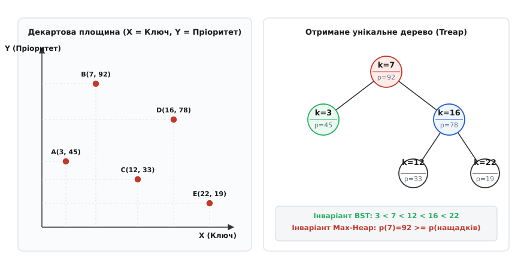
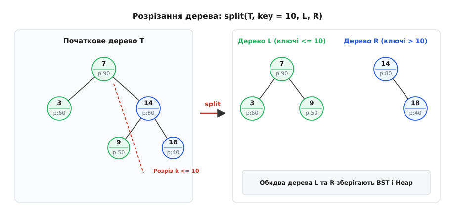
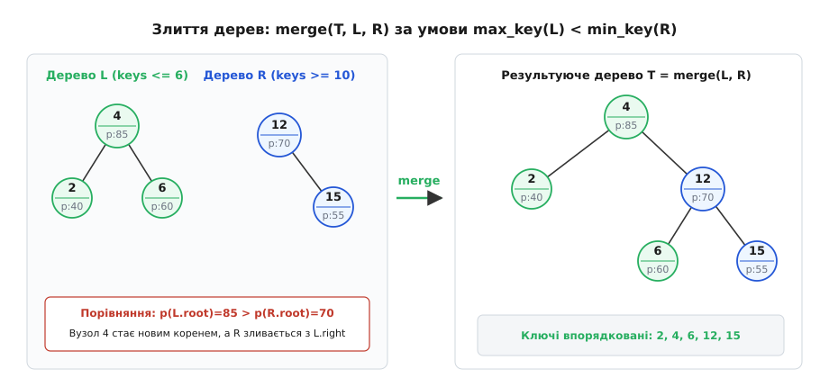
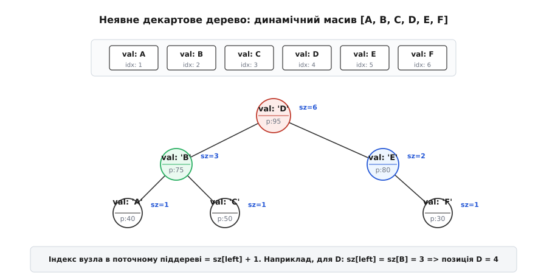
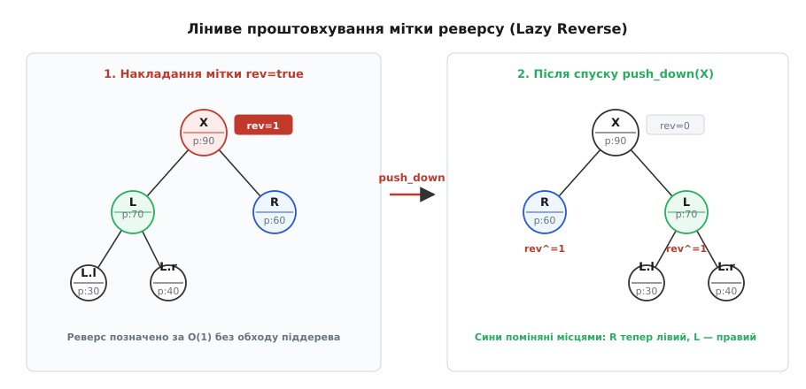

# Декартове дерево (Treap)

<preknowlist>
- [Двійкове дерево пошуку](root:sf-algorithms/binary-search-tree) — як працює інваріант упорядкування ключів, ліве та праве піддерево, деградація незбалансованого дерева до однозв'язаного списку.
- [Купа (піраміда)](root:sf-algorithms/priority-queue-adt) — інваріант купи, де значення батька завжди переважає значення нащадків.
- [Швидке сортування (Quicksort)](root:sf-algorithms/quicksort) — розбиття елементів відносно випадкового опорного елемента та глибина рекурсивного дерева.
- [Асимптотична складність](root:computability/asymptotic-complexity) — оцінка очікуваного часу роботи через математичне сподівання.
- [Рекурсія](root:sf-algorithms/recursion) — рекурсивний спуск, декомпозиція підзадач та комбінування результатів.
</preknowlist>

Коли у звичайний динамічний масив або текстовий редактор користувач додає один символ на початок документа розміром 100 мегабайтів, програма змушена побайтово зсунути праворуч рівно 100 мільйонів символів. Замість миттєвої реакції на клавіатуру інтерфейс застигає на десятки мілісекунд, витрачаючи гігабайти пропускної здатності шини пам'яті на елементарне копіювання байтів. З іншого боку, спроба замінити масив класичним детермінованим двійковим деревом пошуку — наприклад, [AVL-деревом](root:sf-algorithms/avl-tree) чи червоно-чорним деревом — натрапляє на високу інженерну складність: операції розрізання послідовності навпіл, перенесення цілих блоків тексту в інше місце та розворот діапазонів вимагають громіздкого розбору десятків комбінаторних випадків перебалансування та обертань.

Причина цієї дилеми полягає в тому, що класичні збалансовані структури даних намагаються підтримувати логарифмічну висоту за допомогою жорстких локальних правил перекосу або колірних інваріантів. Кожна зміна топології змушує систему каскадно перераховувати балансові коефіцієнти від місця вставки аж до кореня, що робить операції склеювання та розрізання дерев вкрай повільними та заплутаними у реалізації.

Елегантний вихід із цього глухого кута запропонували Сесілія Р. Арагон та Раймунд Зайдель у 1989 році, об'єднавши властивості двійкового дерева пошуку та піраміди в єдину рандомізовану структуру даних — **декартове дерево** або **Treap** (від англ. *tree* — дерево + *heap* — купа; історично термін походить від лат. *Cartesius* — декартові координати). Детальний літопис створення структури та її зв'язок із ранніми геометричними дослідженнями Жана Вюйємена 1980 року наведено у вставці [📜 Історія декартового дерева: від геометричних структур Вюйємена до рандомізації Арагона й Зайделя](root:sf-algorithms/treap/hist-treap.md).

## Геометрична інтуїція та подвійний інваріант

Уявімо множину точок на двовимірній декартовій площині, де кожна точка має дві числові координати: абсцису `x` та ординату `y`. Ми хочемо організувати ці точки в двійкове дерево так, щоб структура одночасно підтримувала швидкий пошук за координатою `x` та ієрархічне упорядкування за координатою `y`.

У структурі Treap кожен вузол містить два поля:
1. **Ключ** (`key`, координата `x`) — корисні дані, за якими здійснюється пошук.
2. **Пріоритет** (`priority`, координата `y`) — випадкове число, яке генерується автоматично під час створення вузла.

> **Подвійний інваріант декартового дерева.** Для кожного вузла `v` дерева одночасно виконуються дві умови:
> 1. **Інваріант дерева пошуку (BST) за ключами:** для всіх вузлів `u` у лівому піддереві `v` виконується `u.key < v.key`, а для всіх вузлів `w` у правому піддереві — `w.key > v.key`.
> 2. **Інваріант максимальної купи (Max-Heap) за пріоритетами:** для будь-якого дочірнього вузла `c` вузла `v` виконується `v.priority ≥ c.priority`.


*Двовимірне представлення вузлів у декартовій площині: координати (key, priority) утворюють дерево пошуку по осі X та купу по осі Y.*

Координата `x` відповідає за горизонтальне розташування елементів (зліва направо), гарантуючи, що симетричний обхід дерева (*in-order*) відвідає всі ключі у строго зростаючому порядку. Координата `y` відповідає за вертикальну ієрархію (зверху вниз), утримуючи елементи з найвищими пріоритетами ближче до кореня.

> 🔧 **Навіщо це.** Поєднання двох інваріантів дозволяє повністю позбутися складного збереження висот, факторів перекосу чи кольорів вузлів. Баланс дерева підтримується не за рахунок громіздких локальних перевірок, а автоматично — завдяки випадковому розподілу пріоритетів.

## Однозначність структури та бієкція Вюйємена

Найважливіша фундаментальна властивість декартового дерева полягає в його математичній однозначності: для будь-якої фіксованої множини пар `(key, priority)` з попарно різними ключами та попарно різними пріоритетами існує **рівно одне** дерево, яке задовольняє обидва інваріанти.

Цей факт легко зрозуміти за допомогою простого конструктивного міркування:
1. Вузол із **максимальним пріоритетом** серед усієї множини зобов'язаний бути коренем дерева. Якби коренем став будь-який інший елемент, вузол із максимальним пріоритетом опинився б у його піддереві, що миттєво порушило б інваріант купи.
2. Ключ обраного кореня `k_root` однозначно розбиває всі інші елементи на дві групи: ті, у яких `key < k_root` (вони зобов'язані піти у ліве піддерево), та ті, у яких `key > k_root` (вони зобов'язані піти у праве піддерево).
3. У кожній із двох утворених підмножин знову обирається елемент із найбільшим пріоритетом, який стає коренем відповідного піддерева, і процес рекурсивно повторюється до вичерпання вузлів.

Оскільки на кожному кроці вибір кореня та поділ на підмножини є єдино можливими, форма декартового дерева повністю визначається числовими значеннями пріоритетів і не залежить від того, у якому порядку ці елементи додавалися до структури.

Повне математичне доведення теореми про єдиність, аналіз імовірнісних розподілів та строгий висновок про середню глибину вузлів наведено у вставці [🧮 Математичні основи декартового дерева: єдиність, глибина та зв'язок із Quicksort](root:sf-algorithms/treap/math-treap-bounds.md).

## Чому висота Treap є логарифмічною: міст до Quicksort

Якщо користувач вставляє у звичайне двійкове дерево пошуку відсортований масив `1, 2, 3, ..., n`, дерево вироджується у пряму лінію глибини `n`. Проте якщо під час вставки кожного елемента призначати йому випадковий пріоритет із неперервного рівномірного розподілу, ситуація докорінно змінюється.

Оскільки всі пріоритети генеруються незалежно, кожен із `n` елементів має однакову ймовірність `1/n` виявитися елементом із максимальним пріоритетом і стати коренем дерева. Випадковий корінь ділить масив ключів на ліву та праву частини випадкового розміру.

Цей процес абсолютно ідентичний роботі класичного алгоритму швидкого сортування [Quicksort](root:sf-algorithms/quicksort), де на кожному кроці випадково обирається опорний елемент (*pivot*), що розбиває масив на дві підзадачі. Форма декартового дерева є точним графом рекурсивних викликів випадкового Quicksort.

Математичне сподівання глибини довільного вузла `x_i` у декартовому дереві з `n` елементів обчислюється через суму гармонічного ряду:
```
E[depth(x_i)] = H_i + H_{n - i + 1} - 2 ≤ 2 · ln n + O(1) ≈ 1.386 · log₂ n
```
Для одного мільйона записів (`n = 10⁶`) середня глибина вузла становить близько 25–28 рівнів, а максимальна висота практично ніколи не перевищує 45–50 рівнів. Жоден спеціально підібраний порядок додавання ключів не здатен змусити структуру деградувати, оскільки топологія дерева залежить виключно від внутрішнього генератора випадкових чисел.

## Два підходи до модифікації: обертання проти розрізання і злиття

Історично існує два способи підтримки декартового дерева при зміні даних: класичний підхід на основі обертань (*rotations*) та сучасна парадигма розрізання й злиття (*split and merge*).

### Підхід 1: Вставка через локальні обертання (Арагон і Зайдель, 1989)

У початковій версії алгоритму новий елемент зі своїм ключем та випадковим пріоритетом спочатку спускається вниз за правилами двійкового дерева пошуку, поки не займе позицію нового листка на глибині `O(log n)`.

Після розміщення на позиції листка інваріант дерева пошуку за ключами задовольняється повністю. Проте випадковий пріоритет нового вузла може виявитися більшим за пріоритет його батька, що порушує інваріант купи. Для відновлення ієрархії купи новий вузол піднімають угору за допомогою локальних обертань:
- Якщо вузол є лівим сином свого батька і має вищий пріоритет, виконується **праве обертання** (*Right Rotation*);
- Якщо вузол є правим сином свого батька, виконується **ліве обертання** (*Left Rotation*).

Обертання повторюються вгору за ланцюгом предків доти, доки пріоритет батька не стане більшим за пріоритет вставленого вузла, або поки вузол не стане новим коренем дерева. Оскільки математичне сподівання кількості обертань під час вставки строго обмежене константою `E[R] < 2`, дерево перебудовується надзвичайно швидко.

Проте підхід на основі обертань має суттєвий недолік: він орієнтований виключно на поодинокі точкові модифікації словника і не дозволяє ефективно маніпулювати цілими діапазонами та підмасивами.

### Підхід 2: Парадигма Split та Merge

Набагато універсальнішим виявився функціональний підхід, де всі операції (вставка, видалення, склеювання масивів, виділення підвідрізків) виражаються через два базові примітиви: **розрізання** (`split`) та **злиття** (`merge`).

## Фундаментальні операції: парадигма Split та Merge

Розглянемо покроковий механізм роботи примітивів `split` та `merge` для явного декартового дерева.

### 1. Операція Split (розрізання за ключем)

Функція `split(T, k, L, R)` приймає дерево `T` і пороговий ключ `k`, після чого розділяє його на два повністю незалежних декартових дерева:
- Дерево `L`, що містить усі вузли з ключами `≤ k`;
- Дерево `R`, що містить усі вузли з ключами `> k`.


*Розрізання дерева T за ключем k: вузли з ключами ≤ k переходять у дерево L, а вузли з ключами > k — у дерево R.*

Алгоритм працює рекурсивно, спускаючись від кореня:
1. Якщо дерево порожнє (`T == NULL`), обидва результати є порожніми: `L = NULL`, `R = NULL`.
2. Якщо ключ поточного кореня `T.key ≤ k`, то сам корінь та все його ліве піддерево гарантовано мають ключі `≤ k` і повинні увійти до складу дерева `L`. Проте праве піддерево `T.right` може містити як елементи `≤ k`, так і елементи `> k`. Тому алгоритм рекурсивно викликає `split(T.right, k, T.right, R)`. Отримана ліва частина стає новим правим сином вузла `T`, а сам вузол `T` стає коренем результуючого дерева `L`.
3. Симетрично, якщо `T.key > k`, сам корінь та його праве піддерево переходять у `R`, а ліве піддерево рекурсивно розрізається: `split(T.left, k, L, T.left)`.

Оскільки на кожному кроці рекурсія опускається на один рівень униз, операція `split` проходить рівно один шлях від кореня до листка і виконується за логарифмічний час `O(log n)`.

### 2. Операція Merge (злиття впорядкованих дерев)

Функція `merge(T, L, R)` об'єднує два декартових дерева `L` та `R` в одне спільне дерево. Операція має сувору обов'язкову передумову: **всі ключі в дереві `L` повинні бути строго меншими за будь-який ключ у дереві `R`** (`max_key(L) < min_key(R)`).


*Злиття дерев L та R за умови впорядкованості ключів keys(L) < keys(R): корінь обирається за найвищим пріоритетом.*

Алгоритм злиття відновлює інваріант купи:
1. Якщо одне з дерев порожнє, результатом є інше дерево: якщо `L == NULL`, повертаємо `R`; якщо `R == NULL`, повертаємо `L`.
2. Якщо обидва дерева непорожні, порівнюються пріоритети їхніх коренів:
   - Якщо `L.priority > R.priority`, то корінь дерева `L` має вищий пріоритет і зобов'язаний стати коренем нового об'єднаного дерева. Його ліве піддерево `L.left` залишається на місці (оскільки всі його ключі менші за `L.key`). Новим правим сином `L` стає результат рекурсивного злиття `merge(L.right, R)`.
   - Якщо `R.priority ≥ L.priority`, коренем стає вузол `R`. Його праве піддерево `R.right` зберігається, а лівим сином стає результат `merge(L, R.left)`.

Час виконання `merge` обмежений сумою висот дерев і становить `O(log n)`.

## Словникові операції через Split та Merge

Маючи у розпорядженні примітиви `split` та `merge`, класичні операції над динамічною множиною реалізуються в кілька зрозумілих рядків:

### Пошук (Find)
Пошук елемента за ключем виконується стандартним спуском двійкового дерева пошуку: порівнюємо шуканий ключ із ключем поточного вузла і переходимо ліворуч або праворуч за час `O(log n)`.

### Вставка (Insert)
Щоб додати новий ключ `key` у дерево `T`:
1. Розрізаємо дерево за цим ключем: `split(T, key, L, R)`.
2. Створюємо новий ізольований вузол `M` із ключем `key` та свіжим випадковим пріоритетом `rand()`.
3. Зливаємо частини назад у правильному порядку: `T = merge(merge(L, M), R)`.

### Видалення (Erase)
Щоб видалити ключ `key` із дерева `T`:
1. Вирізаємо піддерево, що містить ключ `key`, за допомогою двох розрізів:
   - `split(T, key - 1, L, R)` — відокремлюємо всі елементи, строго менші за `key`;
   - `split(R, key, M, R)` — відокремлюємо вузол `M` (який містить саме ключ `key`) від елементів, строго більших за `key`.
2. Звільняємо пам'ять видаленого вузла `M`.
3. Зливаємо ліву та праву частини: `T = merge(L, R)`.

Повні робочі тексти програм мовами C та C++ з детальним аналізом керування пам'яттю наведено у вставці [⚙️ Практична реалізація Treap та Implicit Treap на C та C++](root:sf-algorithms/treap/proj-treap-operations.md).

## Порядкові статистики та ранги в явному дереві

Якщо додати поле розміру піддерева `sz` до вузлів явного декартового дерева, воно миттєво перетворюється на повноцінне **дерево порядкових статистик** (*Order Statistic Tree*), забезпечуючи виконання двох додаткових запитів:

1. **Пошук k-го порядкового елемента (`find_by_order(k)`):**
   Знаходить ключ елемента, який займає `k`-ту позицію у відсортованому списку всіх ключів множини:
   - Якщо `k ≤ sz[v.left]`, спускаємося в ліве піддерево з тим самим `k`;
   - Якщо `k == sz[v.left] + 1`, повертаємо ключ поточного вузла `v.key`;
   - Якщо `k > sz[v.left] + 1`, спускаємося в праве піддерево з індексом `k - sz[v.left] - 1`.
   Час виконання становить `O(log n)`.

2. **Підрахунок кількості ключів, менших за поріг (`order_of_key(k)`):**
   Обчислює точний ранг заданого ключа `k` у множині (аналог `std::distance(begin, lower_bound)`):
   - Якщо `k ≤ v.key`, шукаємо в лівому піддереві;
   - Якщо `k > v.key`, додаємо до лічильника `sz[v.left] + 1` і продовжуємо пошук у правому піддереві.
   Час виконання становить `O(log n)`.

## Об'єднання двох довільних декартових дерев (Treap Union)

Коли потрібно об'єднати два декартових дерева `T1` та `T2`, чиї ключі можуть перетинатися й чергуватися у довільному порядку, звичайна функція `merge` не підходить через порушення передумови `keys(L) < keys(R)`.

Для довільних дерев застосовується елегантний рекурсивний алгоритм **Treap Union**:
1. Якщо одне з дерев порожнє, повертаємо інше дерево.
2. Нехай дерево `T1` має корінь із більшим пріоритетом, ніж `T2` (якщо навпаки, міняємо їх місцями). Тоді корінь `T1` зобов'язаний стати коренем результуючого дерева.
3. За ключем кореня `T1.key` розрізаємо друге дерево на дві частини: `split(T2, T1.key, L2, R2)`.
4. Рекурсивно об'єднуємо ліві та праві частини:
   - `T1.left = union(T1.left, L2)`
   - `T1.right = union(T1.right, R2)`
5. Повертаємо оновлений корінь `T1`.

Якщо дерево `T1` містить `n` елементів, а дерево `T2` — `m` елементів (де `m ≤ n`), алгоритм `union` працює за оптимальний сублінійний час `O(m · log(n / m))`, що значно швидше за покрокову вставку кожного елемента за `O(m log n)`.

## Неявне декартове дерево (Implicit Treap)

Справжня алгоритмічна міць декартового дерева розкривається при переході до концепції **неявного ключа**.

У багатьох прикладних задачах елементи не мають фіксованого числового ключа. Замість цього вони утворюють упорядковану послідовність (динамічний масив), де ключем є **поточний порядковий номер елемента в масиві** (індекс `1, 2, ..., n`). Якщо користувач вставляє новий елемент на початок масиву, індекси абсолютно всіх наступних елементів збільшуються на 1. Зберігати явні індекси у вузлах неможливо, оскільки кожна вставка вимагала б зміни полів у всіх `n` вузлах за неефективний час `O(n)`.

### Розмір піддерева як неявний ключ

Щоб зробити індексацію динамічною, кожен вузол звільняють від явного поля ключа, додаючи замість нього поле **розміру піддерева** `sz`:
```
sz[v] = 1 + sz[v.left] + sz[v.right]
```
(де розмір порожнього дерева `sz[NULL] = 0`).


*Неявне декартове дерево: елементи масиву розташовані в порядку in-order обходу, а їхні позиції обчислюються динамічно через розміри лівих піддерев sz[left].*

Коли ми знаходимося у вузлі `v`, кількість елементів, розташованих перед ним у масиві (у межах його піддерева), точно дорівнює розміру його лівого піддерева `sz[v.left]`. Отже, порядковий номер вузла `v` у поточному піддереві завжди дорівнює:
```
Index(v) = sz[v.left] + 1
```

### Розрізання за розміром: Split by Size

Операція `split(T, k, L, R)` для неявного декартового дерева розрізає послідовність на префікс довжиною `k` елементів (дерево `L`) та суфікс із решти елементів (дерево `R`):
1. Знаходимо розмір лівого сина `left_sz = sz[T.left]`.
2. Якщо `left_sz + 1 ≤ k`, то весь лівий син та сам вузол `T` повинні увійти до префікса `L`. Ми рекурсивно розрізаємо праве піддерево, але шукаємо в ньому вже не `k`, а залишок елементів: `split(T.right, k - left_sz - 1, T.right, R)`, після чого повертаємо `L = T`.
3. Якщо `left_sz + 1 > k`, вузол `T` разом із правим піддеревом відходить до суфікса `R`, а ліве піддерево рекурсивно ділиться: `split(T.left, k, L, T.left)`.
4. На виході з рекурсії викликається допоміжна функція `push_up(T)`, яка перераховує `sz[T] = 1 + sz[T.left] + sz[T.right]`.

## Операції над масивом за O(log N)

Неявне декартове дерево перетворює повільний масив на надзвичайно гнучку структуру даних:

- **Вставка за довільним індексом `pos`:** виконуємо `split(T, pos - 1, L, R)`, створюємо вузол `M` із новим значенням і збираємо `T = merge(merge(L, M), R)` за час `O(log n)`.
- **Видалення елемента за індексом `pos`:** відокремлюємо цільовий елемент двома викликами `split(T, pos - 1, L, R)` та `split(R, 1, M, R)`, звільняємо `M` і зливаємо залишки `T = merge(L, R)` за час `O(log n)`.
- **Вирізання та перенесення діапазону (Cut & Paste):** щоб перемістити фрагмент масиву з позицій `[L, R]` на нову позицію, достатньо трьома розрізами виділити піддерево діапазону, склеїти залишок масиву, розрізати його в новій точці та вклеїти виділений фрагмент. Усі маніпуляції виконуються за кілька логарифмічних викликів `O(log n)` без побайтового переміщення елементів.

## Ліниве проштовхування міток (Lazy Propagation)

Найбільш видовищною можливістю неявного декартового дерева є виконання масових операцій над числовими підвідрізками за логарифмічний час.

### Інтервальний реверс (Reverse) за O(log n)
Класична задача: перевернути порядок елементів масиву на підвідрізку `[L, R]` задом наперед. У звичайному масиві це вимагає циклу з перестановками елементів за час `O(R - L + 1)`.

У неявному декартовому дереві реверс піддерева означає дзеркальну зміну орієнтації: лівий син кожного вузла повинен стати правим, а правий — лівим.

Замість негайної зміни всіх вузлів використовується техніка **лінивого проштовхування** (*Lazy Propagation*):
1. Відокремлюємо піддерево діапазону `[L, R]` у вигляді піддерева `Mid`.
2. На корінь `Mid` накладаємо прапорець відкладеного реверсу `Mid.rev ^= true` за час `O(1)`.
3. Зливаємо дерево назад.


*Лінивий реверс підвідрізка: прапорець rev міняє місцями лівого і правого синів та делегує інверсію нащадкам під час спуску push_down.*

Коли будь-яка майбутня операція під час спуску доходить до вузла з прапорцем `rev == true`, викликається функція `push_down(v)`:
- Вузол `v` фізично міняє місцями покажчики `v.left` та `v.right`;
- Прапорець реверсу передається синам: `v.left.rev ^= true`, `v.right.rev ^= true`;
- На самому вузлі `v` прапорець скидається: `v.rev = false`.

Завдяки цьому інверсія масиву будь-якого розміру (хоч на 10 мільйонів елементів) виконується за фіксований логарифмічний час `O(log n)`.

### Агреговані інтервальні статистики та масові додавання
Аналогічно реалізуються запити мінімуму, максимуму або суми на діапазоні: кожен вузол зберігає агреговане значення для свого піддерева (наприклад, `sum[v] = val[v] + sum[left] + sum[right]`). Щоб дізнатися суму на відрізку `[L, R]`, ми двома викликами `split` виділяємо відповідне піддерево і миттєво зчитуємо значення `sum` з його кореня за `O(1)`.

Якщо потрібно додати число `Δ` до всіх елементів підвідрізка `[L, R]`, на корінь виділеного піддерева накладається мітка `add += Δ`, а сума піддерева миттєво коригується за формулою `sum += sz * Δ`. Під час виклику `push_down` ця добавка передається дочірнім вузлам.

Повна специфікація функцій, параметрів та сигнатур примітивів наведена у [📋 Довіднику інтерфейсу та складності операцій Treap](root:sf-algorithms/treap/api-treap.md).

## Персистентність та версіонування без копіювання

Ще однією важливою перевагою парадигми `split/merge` є природна підтримка **персистентності** (*Persistence*).

У персистентній структурі даних будь-яка операція модифікації не знищує старий стан дерева, а створює нову логічну версію, залишаючи попередню версію повністю доступною для читання та пошуку. У декартовому дереві це досягається технікою копіювання шляху (*Path Copying*):
1. Під час спуску у функціях `split` та `merge` алгоритм не перезаписує покажчики наявних вузлів, а створює поверхневу копію поточного вузла в динамічній пам'яті.
2. Новий вузол отримує оновлені покажчики на нових нащадків, тоді як незмінені гілки піддерев продовжують розділятися між старою та новою версіями (*structural sharing*).

Оскільки під час кожної вставки, видалення або розрізання копіюються лише вузли вздовж одного шляху від кореня до листка, операція створює рівно `O(log n)` нових вузлів у пам'яті за час `O(log n)`. Це дозволяє створювати текстові редактори з необмеженою глибиною скасування дій (*Undo/Redo*) та функціональні структури даних у мовах програмування без витрат пам'яті на дублювання масиву.

## Системні аспекти: кеш-пам'ять, фрагментація та випадкові числа

Незважаючи на бездоганну асимптотичну складність `O(log n)`, практична продуктивність декартового дерева на реальному апаратному забезпеченні суттєво залежить від кількох низькорівневих факторів:

### 1. Локальність даних у кеш-пам'яті (Cache Locality)
Звичайний масив або дерево відрізків (*Segment Tree*) розміщуються у неперервному блоці пам'яті, що дозволяє апаратному блоку випереджального читання процесора (*Hardware Prefetcher*) завантажувати сусідні елементи у кеш-лінії L1/L2 заздалегідь. Декартове дерево, навпаки, складається з окремих вузлів, розкиданих по адресній купі через виклики `malloc` або `new`. Кожен перехід за покажчиком `left` або `right` потенційно спричиняє промах кешу (*cache miss*), що збільшує час доступу до 100–200 тактів процесора на кожен рівень дерева.

Для мінімізації промахів кешу вузли декартового дерева розміщують у спеціалізованих пулах пам'яті (*Memory Pool* / *Arena Allocator*), де вузли виділяються компактними послідовними блоками.

### 2. Якість генератора випадкових чисел
Коректність структури спирається на те, що випадкові пріоритети вузлів є попарно різними. Якщо вбудований генератор псевдовипадкових чисел генерує малий діапазон значень (наприклад, 15-бітний `rand()` у стандартній бібліотеці C, де `RAND_MAX = 32767`), то при додаванні 50 000 елементів виникає велика кількість однакових пріоритетів. Купа втрачає здатність ефективно балансувати дерево, і його висота наближається до лінійної `O(n)`.

Тому у високопродуктивних реалізаціях слід використовувати швидкі 64-бітні генератори, такі як Xorshift64 (який виконується за 3 процесорні такти без звернення до оперативної пам'яті) або стандартний `std::mt19937_64` у C++.

## Інженерний компроміс: порівняльний аналіз структур

Декартове дерево займає специфічну та дуже вигідну нішу в інженерному арсеналі алгоритміста:

1. **Treap проти AVL та Червоно-чорних дерев:**
   - *Перевага Treap:* код реалізації у 3–4 рази коротший і набагато простіший для верифікації; операції розрізання та злиття діапазонів є природними; відсутні десятки складних крайових випадків при перебалансуванні.
   - *Недолік Treap:* рандомізована (імовірнісна) гарантія логарифмічного часу замість абсолютної детермінованої межі найгіршого випадку; додаткові 4 байти пам'яті на кожен вузол для збереження випадкового пріоритету.

2. **Implicit Treap проти Дерева відрізків (Segment Tree):**
   - *Дерево відрізків* є набагато швидшим і компактнішим для статичних масивів фіксованого розміру, оскільки зберігається у суцільному масиві без покажчиків і не створює накладних витрат на покажчики.
   - *Implicit Treap* незамінний, коли геометрія масиву динамічно змінюється: елементи додаються в середину, видаляються, переставляються блоками або розгортаються задом наперед, що є принципово неможливим для статичного дерева відрізків.

3. **Treap проти Splay-дерева:**
   - Splay-дерево має амортизовану логарифмічну складність і змінює свою структуру навіть під час звичайного пошуку (операція `splay`), що унеможливлює його безпечне використання в багатопотокових середовищах із багатьма одночасними читачами без ексклюзивних блокувань.
   - Treap виконує операції читання абсолютно статично за чистий очікуваний логарифмічний час без будь-якої модифікації пам'яті, що дозволяє організувати ефективний паралельний доступ через `std::shared_mutex`.

Декартове дерево є незамінним інструментом для побудови текстових рушіїв (структури *Rope*), систем керування версіями документів із можливістю швидкого відкату змін (*Undo/Redo*), баз даних геномних послідовностей в біоінформатиці та олімпіадного програмування, де простота і надійність коду поєднуються з найвищою алгоритмічною гнучкістю.
