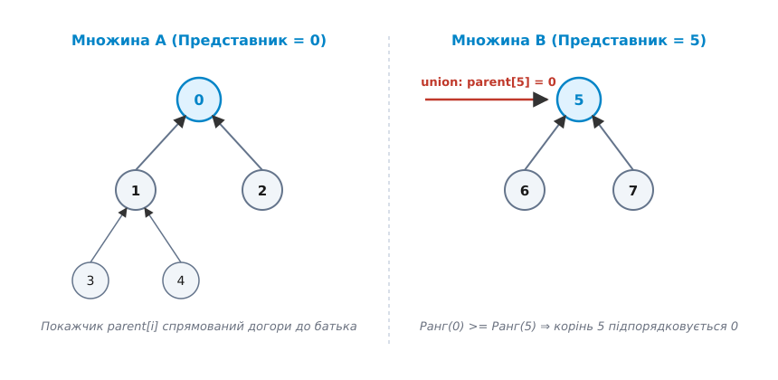
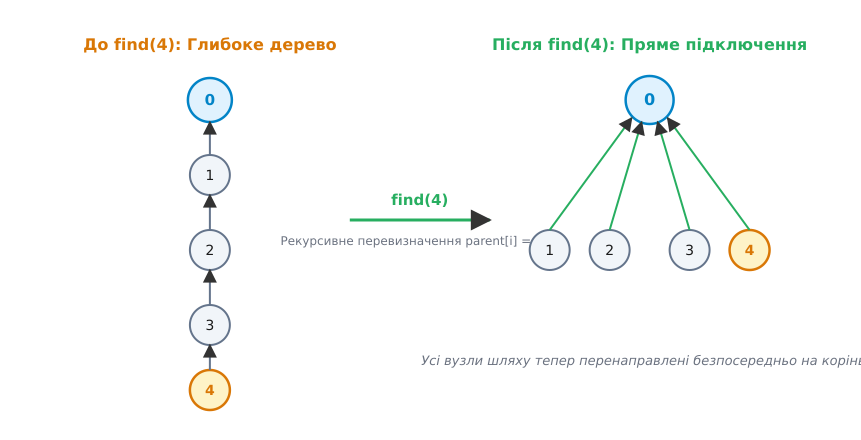
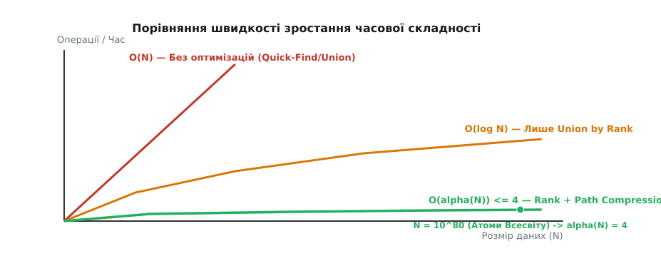
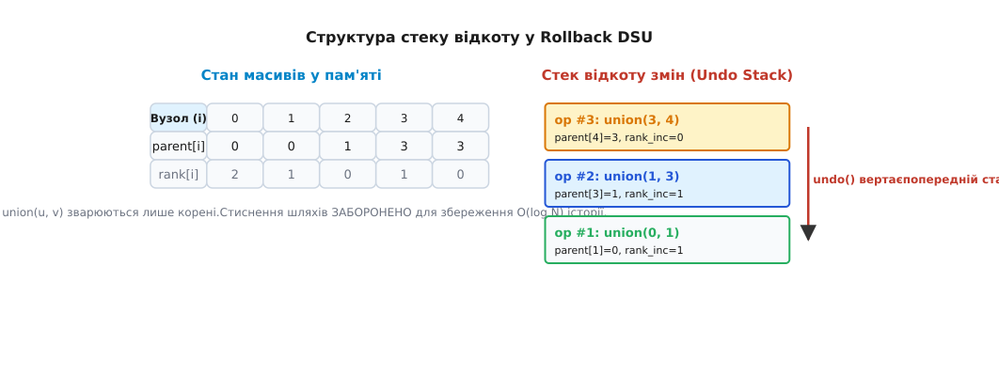

# Система неперетинних множин (union-find)

<preknowlist>
- [Амортизаційний аналіз](topic:computability/amortized-analysis) — вимірювання середньої вартості послідовності операцій у найгіршому випадку.
- [Дерева](topic:sf-algorithms/binary-search-tree) — представлення ієрархічних зв'язків та батьківських покажчиків.
- [Представлення графів](topic:sf-algorithms/graph-representation) — списки та матриці суміжності для збереження топології зв'язків.
- [Алгоритм Краскала](topic:sf-algorithms/kruskal-algorithm) — побудова мінімального кістякового дерева графа за допомогою DSU.
- [Алгоритм Гошена–Копельмана](topic:sf-algorithms/hoshen-kopelman) — маркування зв'язаних кластерів на двовимірній ґратці у фізиці перколації.
- [Теорія перколації](topic:ph-thermodynamics/percolation-theory) — вивчення протікання та виникнення зв'язаних кластерів у решіткових системах.
</preknowlist>

Уявіть велику комп'ютерну мережу з мільйонами серверів, де між вузлами постійно додаються нові лінії зв'язку. У будь-який момент часу системному адміністратору потрібно миттєво відповісти на питання: чи існує маршрут між сервером A та сервером B? Якщо розв'язувати цю задачу шляхом повного обходу графа (наприклад, пошуком у глибину чи в ширину), кожен запит вимагатиме перегляду тисяч ребер. Коли кількість серверів сягає мільйонів, а нові з'єднання надходять щомілісекунди, стандартний обхід графа зупиняє систему через надмірне обчислювальне навантаження.

Проблема полягає у відсутності інструменту для відстеження відносин еквівалентності та компонент зв'язності в режимі реального часу. Стандартні алгоритми обходу графа (пошук у глибину DFS або пошук у ширину BFS) будують стаціонарну картину зв'язності за `O(V + E)` часу. Якщо після кожного доданого ребра запускати DFS або BFS наново, обробка послідовності з `E` ребер вимагатиме `O(E · (V + E))` часу. На кожній операції додавання зв'язку ми переобчислюємо інформацію про зв'язність більшості вузлів з нуля, ігноруючи вже виконану роботу.

Проілюструємо цю проблему на практичному прикладі: нехай дата-центр містить 100 000 серверів та 500 000 оптоволоконних ліній. При додаванні нового оптоволоконного кабелю між сервером 42 та сервером 99 999 обхід DFS перегляне тисячі вузлів для оновлення маркування компонент. Якщо ж між цими серверами вже існував прямий або некосвенний зв'язок через інші комутатори, обхід графа буде повністю даремною операцією.

Нам потрібна структура даних, яка здатна підтримувати розбиття множини на неперетинні класи й виконувати дві основні операції: об'єднувати два довільні класи та швидко визначати, чи належать два елементи до одного класу. Саме для цього розроблено систему неперетинних множин (Disjoint Set Union, DSU, або Union-Find).

Історію створення цього алгоритму, еволюцію ідей Галлера, Фішера, Таржана та його роль у становленні сучасного аналізу алгоритмів розкрито у вставці [Історія розвитку системи неперетинних множин](topic:sf-algorithms/union-find/hist-disjoint-sets.md).

## 1. Фундаментальна формалізація та найпростіші підходи

Формально задача полягає в підтримці скінченної множини `S = {0, 1, ..., N - 1}` з `N` дискретних елементів. Структура даних підтримує розбиття множини `S` на підмножини `S₁, S₂, ..., Sₖ`, які задовольняють три фундаментальні умови розбиття (Partition Conditions):

1. Кожна підмножина не є порожньою: `Sᵢ ≠ ∅` для всіх `i`.
2. Підмножини попарно не перетинаються: `Sᵢ ∩ Sⱼ = ∅` при `i ≠ j`.
3. Об'єднання всіх підмножин дає вихідну множину: `S₁ ∪ S₂ ∪ ... ∪ Sₖ = S`.

Кожна підмножина `Sᵢ` представляє один клас еквівалентності. Зв'язок еквівалентності між елементами задовольняє три математичні аксіоми:
- **Рефлексивність**: Кожен елемент еквівалентний самому собі (`x ~ x`).
- **Симетричність**: Якщо `x ~ y`, то `y ~ x`.
- **Транзитивність**: Якщо `x ~ y` та `y ~ z`, то `x ~ z`.

Проілюструємо теорему розбиття на математичному прикладі:
Нехай `S = {0, 1, 2, 3, 4, 5}`. Початковий стан розбиття: `{0}, {1}, {2}, {3}, {4}, {5}`.
Після виконання `union(0, 1)` та `union(2, 3)` маємо 4 класи: `{0, 1}, {2, 3}, {4}, {5}`.
Виконання `union(1, 3)` об'єднує підмножини `S₁ = {0, 1}` та `S₂ = {2, 3}` у єдиний новий клас `S' = {0, 1, 2, 3}` завдяки транзитивності відношення еквівалентності.

Для роботи з цим розбиттям структура даних повинна ефективно виконувати три базові операції:

1. `make_set(x)` — створює новий клас еквівалентності, що містить єдиний елемент `x`.
2. `find(x)` — повертає канонічного представника (корінь або ідентифікатор) множини, до якої належить елемент `x`.
3. `union(x, y)` — об'єднує підмножини, що містять елементи `x` та `y`, у єдиний новий клас еквівалентності.

Головним інваріантом системи є відношення еквівалентності: для двох елементів `x` та `y` рівність `find(x) == find(y)` виконується тоді й лише тоді, коли елементи перебувають в одній зв'язаній компоненті.

### Порівняння просторової ефективності структур збереження зв'язності

Розглянемо альтернативні структури збереження графів з точки зору пам'яті для `N` вершин та `E` ребер:
- **Матриця суміжності**: Вимагає `O(N²)` пам'яті (1 МБ для `N=1000`, але 400 ГБ для `N=1 000 000`).
- **Списки суміжності**: Вимагають `O(N + E)` пам'яті та динамічного виділення списків сусідок для кожної вершини.
- **DSU (Compact DSU)**: Вимагає рівно `4 · N` байтів у єдиному монолітному масиві, незалежно від кількості збережених ребер! На графі з 10 мільйонами вершин та 100 мільйонами ребер DSU займає лише 40 МБ пам'яті.

### Наївний підхід 1: Швидкий пошук (Quick-Find)

Найпростіша ідея полягає в збереженні масиву `id` розміром `N`, де `id[i]` визначає номер класу, до якого належить елемент `i`. Початково для кожного елемента `i` маємо `id[i] = i`.

- Операція `find(x)` виконується за константний час `O(1)` шляхом простого читання значення `id[x]`.
- Операція `union(x, y)` знаходить номери класів `id[x]` та `id[y]`. Якщо вони відрізняються, вона проходиться по всьому масиву від `0` до `N - 1` і замінює всі входження `id[y]` на `id[x]`.

Розглянемо числовий приклад для `N = 5`:
- Початковий стан масиву `id`: `[0, 1, 2, 3, 4]`.
- Операція `union(0, 1)` змінює `id[1]` з `1` на `0`: стан стає `[0, 0, 2, 3, 4]`.
- Операція `union(1, 2)` виявляє `id[1] = 0` та `id[2] = 2`, після чого сканує весь масив і замінює всі значення `2` на `0`: стан стає `[0, 0, 0, 3, 4]`.

Операція `union` вимагає лінійного часу `O(N)`. Якщо ми виконаємо послідовність з `N` операцій `union`, загальний час обчислень складе `O(N²)`. На графі з 100 000 вершин це вимагатиме 10 мільярдів операцій, що є неприйнятним для реальних систем.

### Наївний підхід 2: Швидке об'єднання (Quick-Union)

Щоб уникнути повного сканування масиву під час об'єднання, змінимо концепцію представлення: збережемо елементи у вигляді лісу дерев. Масив `parent[i]` зберігає індекс батьківського вузла для елемента `i`. Якщо `parent[i] == i`, елемент `i` є коренем дерева і канонічним представником усієї множини.

- Операція `find(x)` піднімається від вузла `x` вгору по покажчиках `parent[x]` до тих пір, поки не досягне кореня `root`, де `parent[root] == root`.
- Операція `union(x, y)` знаходить корені `root_x = find(x)` та `root_y = find(y)`. Якщо корені відрізняються, вона робить один корінь батьком іншого: `parent[root_x] = root_y`.

Розглянемо числовий приклад для `N = 5`:
- Початковий стан `parent`: `[0, 1, 2, 3, 4]`.
- Операція `union(0, 1)` встановлює `parent[0] = 1`: стан `[1, 1, 2, 3, 4]`.
- Операція `union(1, 2)` встановлює `parent[1] = 2`: стан `[1, 2, 2, 3, 4]`. Дерево набуває вигляду `0 -> 1 -> 2`.

Операція `union` тепер виконується за константний час `O(1)` після знаходження коренів. Однак швидкість виклику `find(x)` безпосередньо залежить від глибини дерева. У найгіршому випадку (наприклад, при послідовному об'єднанні `(0, 1), (1, 2), (2, 3)...`) дерево вироджується в довгий лінійний список глибиною `N`. У результаті складність `find(x)` знову стає `O(N)`, а послідовність з `N` операцій вимагає `O(N²)` часу.

Наведені нижче приклади коду мовами C та C++ демонструють базові класичні схеми `Quick-Find` та `Quick-Union`.

:::tabs
```c
#include <stdio.h>
#include <stdlib.h>
#include <stdbool.h>

// Реалізація Quick-Union без оптимізацій
typedef struct {
    int *parent;
    size_t size;
} QuickUnionDSU;

QuickUnionDSU *qu_create(size_t n) {
    QuickUnionDSU *dsu = (QuickUnionDSU *)malloc(sizeof(QuickUnionDSU));
    dsu->parent = (int *)malloc(n * sizeof(int));
    dsu->size = n;
    for (size_t i = 0; i < n; i++) {
        dsu->parent[i] = (int)i;
    }
    return dsu;
}

int qu_find(QuickUnionDSU *dsu, int x) {
    while (x != dsu->parent[x]) {
        x = dsu->parent[x];
    }
    return x;
}

void qu_union(QuickUnionDSU *dsu, int x, int y) {
    int root_x = qu_find(dsu, x);
    int root_y = qu_find(dsu, y);
    if (root_x != root_y) {
        dsu->parent[root_x] = root_y;
    }
}

void qu_destroy(QuickUnionDSU *dsu) {
    free(dsu->parent);
    free(dsu);
}
```
```cpp
#include <vector>
#include <cstddef>
#include <numeric>

// Реалізація Quick-Union мовою C++
class QuickUnionDSU {
public:
    explicit QuickUnionDSU(std::size_t n) : parent_(n) {
        std::iota(parent_.begin(), parent_.end(), 0);
    }

    [[nodiscard]] std::size_t find(std::size_t x) const noexcept {
        while (x != parent_[x]) {
            x = parent_[x];
        }
        return x;
    }

    void unite(std::size_t x, std::size_t y) noexcept {
        std::size_t root_x = find(x);
        std::size_t root_y = find(y);
        if (root_x != root_y) {
            parent_[root_x] = root_y;
        }
    }

private:
    std::vector<std::size_t> parent_;
};
```
:::

## 2. Евристики балансування дерев: Union by Rank та Union by Size

Причина виродження дерев у `Quick-Union` полягає в хаотичному виборі кореня під час об'єднання. Якщо ми систематично приєднуємо велике дерево до маленького, глибина підсумкової структури зростає. Щоб запобігти цьому, застосовують евристики балансування.

### Евристика 1: Об'єднання за розміром (Union by Size)

Ми підтримуємо додатковий масив `size[i]`, який для кожного кореня `i` зберігає точну кількість вузлів у його піддереві. Під час об'єднання двох дерев порівнюються їхні розміри: корінь меншого дерева завжди приєднується до кореня більшого дерева.

Якщо `size[root_x] < size[root_y]`, ми виконуємо `parent[root_x] = root_y` і оновлюємо `size[root_y] += size[root_x]`.

### Евристика 2: Об'єднання за рангом (Union by Rank)

Замість кількості вузлів ми підтримуємо масив `rank[i]`, який зберігає верхню межу висоти піддерева з коренем `i`. Початково ранг кожного ізольованого вузла дорівнює `0`.

Під час виконання `union(x, y)`:
- Дерево з меншим рангом приєднується до кореня дерева з більшим рангом (ранг нового кореня при цьому не змінюється).
- Якщо ранги обох дерев однакові, одне дерево довільно обирається новим коренем, а його ранг збільшується на `1`.


*Мал. 1. Структура лісу дерев DSU при об'єднанні за рангом та розміром.*

Розглянемо докладний приклад побудови дерев для `N = 8` елементів `{0, 1, 2, 3, 4, 5, 6, 7}`:
1. Початково маємо 8 окремих дерев рангу `0`.
2. Виконуємо об'єднання пар: `union(0, 1)`, `union(2, 3)`, `union(4, 5)`, `union(6, 7)`. Отримуємо 4 дерева висоти `1` з рангами `1`.
3. Виконуємо об'єднання `union(0, 2)` та `union(4, 6)`. Отримуємо 2 дерева висоти `2` з рангами `2`.
4. Виконуємо об'єднання `union(0, 4)`. Отримуємо єдине дерево з рангом `3`, яке містить всі 8 елементів.

Зверніть увагу: глибина дерева дорівнює `3 = log₂ 8`. Без балансування ця ж послідовність операцій могла створити лінійний ланцюжок глибиною `8`.

Розглянемо фундаментальні властивості рангів у DSU:

1. **Строга монотонність уздовж шляху**: Для будь-якого вузла `x`, який не є коренем, `rank[x] < rank[parent[x]]`. Ранг батька завжди суворо більший за ранг дитини.
2. **Обмеження на кількість вузлів даного рангу**: Кількість вузлів з рангом `k` у структурі з `N` елементів не перевищує `N / 2^k`.
3. **Максимальний ранг**: Ранг будь-якого кореня в системі з `N` елементів не перевищує `log₂ N`.

**Теорема про логарифмічну висоту**: Застосування евристики `Union by Rank` або `Union by Size` гарантує, що висота будь-якого дерева у структурі DSU з `N` елементів не перевищує `log₂ N`.

*Доведення (для Union by Size)*: Нехай `S(h)` — мінімальна кількість вузлів у дереві висоти `h`, сформованому за допомогою евристики `Union by Size`.
Для `h = 0` (початковий ізольований вузол): `S(0) = 1 = 2⁰`.
Щоб утворити дерево висоти `h > 0`, алгоритм мусив об'єднати два дерева, висота принаймні одного з яких дорівнювала `h - 1`. Згідно з правилом об'єднання за розміром, це дерево було приєднано до іншого дерева, чий розмір був не меншим за розмір першого.
Отже: `S(h) ≥ S(h - 1) + S(h - 1) = 2 · S(h - 1)`.
За індукцією отримуємо: `S(h) ≥ 2^h`.
Оскільки загальна кількість вузлів у системі не перевищує `N`, маємо: `2^h ≤ S(h) ≤ N`, звідки після логарифмування за основою 2: `h ≤ log₂ N`.

Завдяки цій теоремі операція `find(x)` вимагає в найгіршому випадку не більше `O(log N)` кроків, а послідовність з `M` операцій виконується за `O(M log N)`.

## 3. Евристики сплющування дерев: Стиснення шляхів (Path Compression)

Хоча логарифмічна складність `O(log N)` є суттєвим покращенням порівняно з `O(N)`, ми можемо зробити структуру ще швидшою. Зверніть увагу: під час виконання `find(x)` ми проходимо шлях від вузла `x` до кореня `root`. Усі вузли на цьому шляху належать одній і тій самій підмножині.

Чому б після знаходження кореня не оновити батьківські покажчики для всіх пройдених вузлів так, щоб вони вказували безпосередньо на корінь? Цей прийом називається **стисненням шляху** (Path Compression).


*Мал. 2. Сплющення дерева DSU під час виконання операції пошуку кореня (Path Compression).*

Проілюструємо трансформацію дерева при стисненні шляхів на конкретному прикладі:
- Нехай дерево мало вигляд ланцюжка: `0 <- 1 <- 2 <- 3 <- 4` (де `0` є коренем).
- Масив `parent`: `[0, 0, 1, 2, 3]`.
- Викликаємо `find(4)`. Функція проходить рекурсивно вузли `4 -> 3 -> 2 -> 1 -> 0` і знаходить корінь `0`.
- При поверненні з рекурсії вона перевизначає: `parent[4] = 0`, `parent[3] = 0`, `parent[2] = 0`, `parent[1] = 0`.
- Новий стан `parent`: `[0, 0, 0, 0, 0]`. Дерево повністю сплющилося до глибини `1`.

У результаті наступні виклики `find` для будь-якого з вузлів `1, 2, 3, 4` виконуються за константний час `O(1)`.

### Альтернативні однопрохідні евристики

Рекурсивне стиснення шляху вимагає двох напрямків обходу по дереву: один для знаходження кореня, деструкція стеку рекурсії для оновлення покажчиків при поверненні. У практичних реалізаціях застосовують однопрохідні ітеративні евристики:

1. **Уполовинення шляху (Path Halving)**: Під час руху до кореня батьківський покажчик кожного другого вузла перенаправляється на його "діда": `parent[x] = parent[parent[x]]`.
2. **Розщеплення шляху (Path Splitting)**: Батьківський покажчик кожного вузла уздовж шляху перенаправляється на його діда: `parent[x] = parent[parent[x]]`, після чого обхід продовжується з колишнього батька.

Порівняємо роботу трьох варіантів сплющування для шляху довжиною 4 (`4 -> 3 -> 2 -> 1 -> 0`):
- **Full Compression**: Робить усі 4 вузли прямими дітьми кореня `0` (потрібен перший прохід рекурсії для пошуку кореня та другий прохід для оновлення покажчиків).
- **Path Halving**: Перевизначає покажчик тільки для `4` (стає `2`), потім для `2` (стає `0`). За один прохід висота шляху скорочується вдвічі.
- **Path Splitting**: Перевизначає `parent[4] = 2`, переходить до `3`, перевизначає `parent[3] = 1`, переходить до `2`, перевизначає `parent[2] = 0`.

Наведені нижче приклади коду мовами C та C++ демонструють ітеративні однопрохідні евристики сплющування шляху.

:::tabs
```c
#include <stdio.h>
#include <stdlib.h>

// Пошук з ітеративним уполовиненням шляху (Path Halving) на C
int find_path_halving(int *parent, int x) {
    while (parent[x] != x) {
        parent[x] = parent[parent[x]];
        x = parent[x];
    }
    return x;
}

// Пошук з розщепленням шляху (Path Splitting) на C
int find_path_splitting(int *parent, int x) {
    while (parent[x] != x) {
        int next = parent[x];
        parent[x] = parent[next];
        x = next;
    }
    return x;
}
```
```cpp
#include <vector>
#include <cstddef>

// Пошук з ітеративним уполовиненням шляху (Path Halving) на C++
std::size_t find_path_halving(std::vector<std::size_t>& parent, std::size_t x) noexcept {
    while (parent[x] != x) {
        parent[x] = parent[parent[x]];
        x = parent[x];
    }
    return x;
}

// Пошук з розщепленням шляху (Path Splitting) на C++
std::size_t find_path_splitting(std::vector<std::size_t>& parent, std::size_t x) noexcept {
    while (parent[x] != x) {
        const std::size_t next = parent[x];
        parent[x] = parent[next];
        x = next;
    }
    return x;
}
```
:::

Обидва однопрохідні варіанти зберігають асимптотичну складність рекурсивного стиснення, але усувають витрати на рекурсивний стек та покращують локальність процесорного кешу.

## 4. Обернена функція Аккермана O(α(N)) та теорія складності

Комбінування евристик `Union by Rank` (або `Size`) та `Path Compression` дає вражаючий результат. Амортизована складність виконання однієї операції `find` або `union` стає майже константною: `O(α(N))`, де `α(N)` — обернена функція Аккермана.

Щоб зрозуміти, наскільки повільно зростає `α(N)`, згадаємо означення строго зростаючої функції Аккермана `A(i, j)` для цілих чисел `i ≥ 0, j ≥ 0`:

- `A(0, j) = j + 1`
- `A(1, j) = j + 2` (додавання)
- `A(2, j) = 2j + 3` (множення)
- `A(3, j) = 2^(j+3) - 3` (піднесення до степеня)
- `A(4, j) = 2^2^...^2 - 3` (вежа степенів висотою `j + 3`)

Значення цієї функції зростають зі страшною швидкістю:
- `A(1, 1) = 3`
- `A(2, 1) = 5`
- `A(3, 1) = 13`
- `A(4, 1) = 2^65536 - 3` (число з 19729 десяткових цифр!)

Обернена функція Аккермана `α(N)` визначається як найменше `i`, при якому `A(i, 1) ≥ N`:
`α(N) = min { i ≥ 0 : A(i, 1) ≥ N }`


*Мал. 3. Графік зростання оберненої функції Аккермана α(N) порівняно з логарифмом log N.*

Для всіх практичних значень `N` (аж до `10^80`), значення `α(N) ≤ 4`. Це означає, що з практичної точки зору операції DSU виконуються за константний час `O(1)`, хоча формально асимптотика є суперконстантною.

### Амортизаційний потенціальний аналіз (Метод потенціалів Таржана)

Доведення амортизованої складності `O(α(N))` спирається на метод потенціалів (Physicist's Method). Кожному вузлу `v` призначається потенціал `Φ(v)`, який вимірює його здатність платити за майбутні кроки стиснення шляху.

Потенціал вузла залежить від різниці між рангом його батька `rank[parent[v]]` та його власним рангом `rank[v]`. Під час виконання `find` реальні кроки сходження по дереву компенсуються зменшенням сумарного потенціалу дерева `ΔΦ`, що дає амортизовану вартість `O(α(N))` на одну операцію.

### Теорема про фундаментальну нижню межу (Fredman-Saks Lower Bound)

У 1989 році Фредман та Сакс довели фундаментальну теорему про нижню межу обчислювальної складності для будь-якої структури даних на базі коміркової моделі пам'яті (Cell Probe Model):
Будь-яка структура даних, що підтримує операції `union` та `find` на послідовності з `M` операцій над `N` елементами, вимагає щонайменше `Ω(M · α(N))` часу.

Це означає, що комбінація `Union by Rank` + `Path Compression` досягає математичного абсолютного оптимуму для структури неперетинних множин.

Повний математичний вивід нижніх та верхніх меж таржанівської складності `O(α(N))` подано у вставці [Математичний аналіз функції Аккермана та амортизаційної складності DSU](topic:sf-algorithms/union-find/math-ackermann-analysis.md).

## 5. Модифікації структури DSU

Базова структура DSU є надзвичайно гнучкою і легко адаптується під спеціалізовані вимоги обчислювальних систем.

### 5.1. Відкочуваний DSU з підтримкою скасування операцій (Rollback DSU)

У багатьох алгоритмах (наприклад, при обході дерев рішень або розв'язанні задачі динамічної зв'язності графа з видаленням ребер) виникає потреба вертати DSU до попередніх станів за допомогою операції `undo()`.

**Критичне зауваження**: При реалізації Rollback DSU **стиснення шляхів категорично заборонено**. Стиснення шляху безповоротно змінює покажчики багатьох проміжних вузлів, що унеможливлює точне скасування операцій за `O(1)` часу.

Замість стиснення шляхів використовується лише `Union by Rank` (який гарантує висоту дерева `O(log N)`), а всі зміни фіксуються у стек скасування `history`.


*Мал. 4. Схема роботи стеку історії в Rollback DSU для скасування операцій об'єднання.*

Детальніше розберемо алгоритм розділяй-і-володарюй над відрізками часу (Divide and Conquer on Query Segments), де Rollback DSU є критичним:
- Нам дано граф, у якому кожне ребро `e` існує на часовому інтервалі `[t_start, t_end]`.
- Побудуємо дерево відрізків над часовими запитами `1..Q`.
- Кожне ребро додається до відповідних вузлів дерева відрізків за `O(log Q)`.
- Виконуємо DFS по дереву відрізків: при вході у вузол додаємо ребра до Rollback DSU, при виході з вузла викликаємо `undo()` відповідну кількість разів.
- Це дозволяє розв'язати задачу повністю динамічної зв'язності за `O(Q log Q log N)` часу.

### 5.2. Зважений DSU (Weighted / Parity DSU)

У зваженому DSU кожна дуга від дочірнього вузла `x` до його батька `parent[x]` містить вагу `weight[x]`. Під час виконання `find(x)` ваги вздовж шляху підсумовуються (або комбінуються за допомогою операції XOR):

- Для перевірки дводольності графа вага `0` означає однакову долю, а `1` — протилежну.
- Для обчислення відносних потенціалів ваги додаються: `potential(x, y) = potential(x) - potential(y)`.

Математика оновлення парності при рекурсивному стисненні шляху:
Нехай `x` мав батька `p`. Після виклику `find(p)` батьком `p` став корінь `root`, а `parity[p]` зберегло відношення `p -> root`.
Тоді відношення `x -> root` обчислюється як побітове XOR: `parity[x] = parity[x] ^ parity[p]`.

### 5.3. Паралельний безблокувальний DSU (Lock-Free Concurrent DSU)

У багатопотокових системах атомарні інструкції `Compare-And-Swap` (CAS) дозволяють реалізувати DSU без використання важких м'ютексів. Для уникнення циклів у concurrent-середовищі корінь з меншим індексом завжди приєднується до кореня з більшим індексом за допомогою `atomic_compare_exchange_strong`.

### 5.4. Персистентний DSU (Persistent DSU)

У функціональних мовах програмування (Haskell, OCaml, Erlang) або в системах збереження версій DSU реалізують у персистентному вигляді:
- Замість прямих модифікацій масиву `parent` використовується персистентне дерево (Path-Copying Tree).
- Операція `union` створює нову версію структури даних за `O(log N)` часу та пам'яті, залишаючи всі попередні версії доступними для читання.

Детальний вихідний код усіх згаданих модифікацій мовами C та C++ з вимірами продуктивності та профілюванням кешу подано у вставці [Практична реалізація DSU на C та C++](topic:sf-algorithms/union-find/proj-dsu-impl.md).

Формальну специфікацію функціонального інтерфейсу, типів даних, контрактів безпеки та сумісності ABI розкрито у вставці [Специфікація DSU API](topic:sf-algorithms/union-find/api-dsu.md).

## 6. Порівняння евристик та асимптотична динаміка

Для того щоб зрозуміти внесок кожної оптимізації в загальну продуктивність структури неперетинних множин, розглянемо зведену таблицю часової складності викликів `M` операцій над `N` елементами:

```
Комбінація евристик                    | Найгірший час однієї find | Складність M операцій
---------------------------------------+--------------------------+-----------------------
Quick-Find (масив ідентифікаторів)     | O(1)                     | O(M + N²)
Quick-Union (прості батьківські покажч)| O(N)                     | O(M · N)
Union by Size / Rank (без стиснення)   | O(log N)                 | O(M log N)
Path Compression (без балансування)    | O(log N)                 | O(M log N) амортиз.
Union by Rank + Path Compression       | O(α(N))                  | O(M · α(N)) амортиз.
```

Принциповим висновком з цієї таблиці є те, що жодна з двох евристик окремо (ні `Union by Rank`, ні `Path Compression`) не здатна досягти майдуже-константного часу `O(α(N))`. Лише їхнє спільне застосування дає цей фундаментальний результат.

## 7. Детальний аналіз алгоритмічних застосувань DSU

### 7.1. Алгоритм Краскала побудови мінімального кістякового дерева (MST)

[Алгоритм Краскала](topic:sf-algorithms/kruskal-algorithm) будує мінімальне кістякове дерево зваженого неорієнтованого графа `G = (V, E)`.
Розглянемо трасування алгоритму на прикладі 5 вершин `{0, 1, 2, 3, 4}` та 6 ребер:
`e₁=(0,1, w=1), e₂=(1,2, w=2), e₃=(0,2, w=3), e₄=(3,4, w=4), e₅=(2,3, w=5)`.
- Сортуємо ребра за вагою `w`.
- `e₁=(0,1)`: `find(0) != find(1)` -> об'єднуємо `{0,1}`. Ребро `e₁` у кістяку.
- `e₂=(1,2)`: `find(1) != find(2)` -> об'єднуємо `{0,1,2}`. Ребро `e₂` у кістяку.
- `e₃=(0,2)`: `find(0) == find(2)` -> обидві вершини в одній компоненті `{0,1,2}`. Ребро `e₃` відкидається як таке, що створює цикл!
- `e₄=(3,4)`: `find(3) != find(4)` -> об'єднуємо `{3,4}`. Ребро `e₄` у кістяку.
- `e₅=(2,3)`: `find(2) != find(3)` -> об'єднуємо `{0,1,2,3,4}`. Ребро `e₅` у кістяку.
- Процес завершено, MST сформовано за `O(|E| log |E|)` часу.

Складність алгоритму домінується сортуванням ребер `O(|E| log |E|)`, а всі `|E|` операцій з DSU займають `O(|E| α(|V|))` часу.

### 7.2. Алгоритм Хошена-Копельмана (Hoshen-Kopelman Algorithm)

У фізиці твердого тіла та аналізі мікрофотографій [алгоритм Гошена–Копельмана](topic:sf-algorithms/hoshen-kopelman) використовується для маркування зв'язаних кластерів на двовимірній піксельній сітці (Percolation Theory):

1. Алгоритм сканує решітку растрово (рядок за рядком).
2. Для кожного активного пікселя перевіряються його вже оброблені сусідні пікселі (верхній та лівий).
3. Якщо активний піксель має одного активного сусіда, він успадковує його маркер.
4. Якщо активний піксель має двох активних сусідів з різними маркерами `L₁` та `L₂`, викликається `union(L₁, L₂)`, що об'єднує обидва кластери.

Використання DSU дозволяє розмітити 2D-зображення розміром `W × H` за один прохід за `O(W · H · α(W · H))` часу.

### 7.3. Аналіз аліасів у компіляторах (LLVM Alias Analysis)

Під час компіляції вихідного коду мов C/C++ компілятор мусить визначити, чи можуть два покажчики `p` та `q` вказувати на одну й ту саму область пам'яті в купі. Цей аналіз називається Disjoint Alias Sets:

- Якщо в коді є операція `p = q`, компілятор об'єднує їхні класи еквівалентності: `union(p, q)`.
- Якщо `find(p) != find(q)`, компілятор доведено знає, що покажчики незалежні (no-alias). Це дозволяє безпечно виносити читання пам'яті з циклів та векторизувати обчислення за допомогою інструкцій AVX-512.

### 7.4. Протокол розгортання дерев у мережевих комутаторах (Spanning Tree Protocol)

У мережевому обладнанні Ethernet (комутатори L2) DSU застосовується для запобігання мережевим штормам (Broadcast Storms). Комутатор аналізує фізичні топології мережевих портів, об'єднує зв'язані сегменти та блокує дублюючі лінки, виявляючи цикли за допомогою DSU.

### 7.5. Моделювання перколяції та фазових переходів у статистичній фізиці

У моделюванні Монте-Карло для решіткових систем (модель Поттса, алгоритм Свендсена-Ванга) DSU використовується для виявлення велетенських кластерів спінів. Поведінка системи поблизу критичної температури описується середнім розміром кластера, який обчислюється за `O(1)` за допомогою методу `set_size` в DSU.

### 7.6. Сегментація зображень та алгоритм вододілу (Watershed Algorithm)

У комп'ютерному зорі DSU застосовується в алгоритмах сегментації зображень Felzenszwalb-Huttenlocher. Пікселі зображення розглядаються як вершини графа, а ребра важуються за різницею інтенсивностей кольорів. DSU адаптивно об'єднує суміжні області пікселів, якщо градієнт між ними не перевищує динамічний поріг однорідності.

## 8. Апаратні особливості, кеш-ефективність та вирівнювання

При реалізації DSU на сучасних процесорних архітектурах (x86-64, ARM64) важливу роль відіграє фізична локальність даних у кеші та робота з віртуальною пам'яттю:

1. **Локальність кеш-ліній**: Стандартне представлення DSU з двома окремими масивами `parent` та `rank` спричиняє вдвічі більше промахів кешу L1 (L1 Cache Misses) під час виконання операції `find`. Оптимізована схема `Compact DSU` зберігає ранги як від'ємні значення у самому масиві `parent`. Це скорочує обсяг оперативної пам'яті до 4 байтів на вузол і подвоює кількість елементів у 64-байтній кеш-лінії.
2. **Промахи префетчингу (Prefetcher Stalls)**: Випадковий доступ у масиві `parent[parent[x]]` під час обходу дерев не піддається стандартному апаратному префетчингу процесора. Сплющування дерев до глибини `1` гарантує, що наступні виклики знаходять індекси прямо в кеші L1.
3. **Оптимізація сторінок TLB (Translation Lookaside Buffer)**: На графах понад 100 мільйонів вершин масив `parent` досягає розміру 400 МБ. Використання прозорих гігантських сторінок пам'яті (Transparent Huge Pages, THP розміром 2 МБ) зменшує кількість промахів TLB у 512 разів.
4. **Архітектура NUMA (Non-Uniform Memory Access)**: На багатопроцесорних серверах розміщення масиву DSU у пам'яті сокета 0 при зверненні з сокета 1 викликає штраф інтерконнекту QPI/UPI до 100 нс на кожен промах кешу. Алокація пам'яті DSU повинна проводитися з прапором `MPOL_INTERLEAVE` або `numa_alloc_interleaved`.

## 9. Обробка крайніх випадків та захисне програмування

При інтеграції DSU у промислове ПЗ важливо враховувати крайові умови:
- **Об'єднання елемента самого з собою (`union(x, x)`)**: Функція повинна миттєво повертати `false` без виконання непрямого запису в пам'ять.
- **Порожній DSU (`N = 0`)**: Конструктор має дозволяти створення об'єктів з 0 елементами, перехоплюючи спроби доступу статусом `OUT_OF_BOUNDS`.
- **Перевірка меж індексів (`x >= N`)**: У C-реалізації функція повинна перевіряти діапазон `if (x >= dsu->size) return DSU_ERR_OUT_OF_BOUNDS;`, а в C++ викидати `std::out_of_range`.
- **Стійкість до помилок пам'яті**: Реалізація C++ повинна гарантувати сильне забезпечення винятків при виділенні масивів (`std::bad_alloc`).

У debug-збірках рекомендується впроваджувати допоміжний перевірочник інваріантів `check_dsu_invariants()`, який гарантує відсутність циклів у масиві `parent` та монотонність рангів.

## 10. Підсумковий синтез

Система неперетинних множин являє собою один із найважливіших алгоритмічних інструментів у сучасній комп'ютерній інженерії. Поєднуючи вкрай просте масивне представлення у пам'яті з елегантними евристиками балансування та сплющування дерев, DSU вирішує задачу динамічної еквівалентності за майдуже-константний час `O(α(N))`. 

Практичне значення DSU виходить далеко за межі базових алгоритмів на графах. Завдяки мінімальним вимогам до оперативної пам'яті, високій кеш-локальності та здатності адаптуватися до паралельних обчислень і скасування операцій, DSU залишається незамінною структурою у ядрі операційних систем, промислових компіляторах та фізичному моделюванні.

Розуміння принципів роботи DSU, його математичного аналізу та різновидів реалізацій є необхідним фундаментом для проектування високонавантажених графів, розробки компіляторів та створення паралельних систем.
