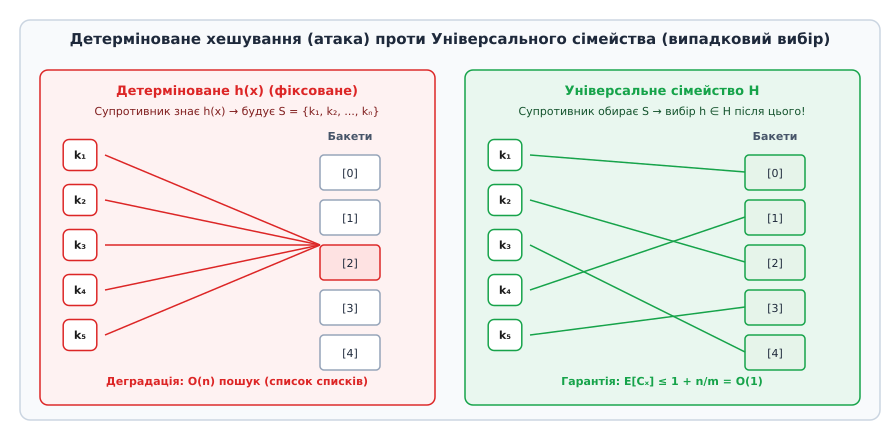
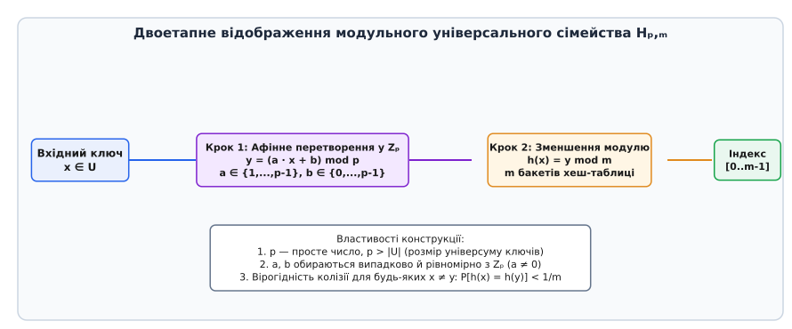
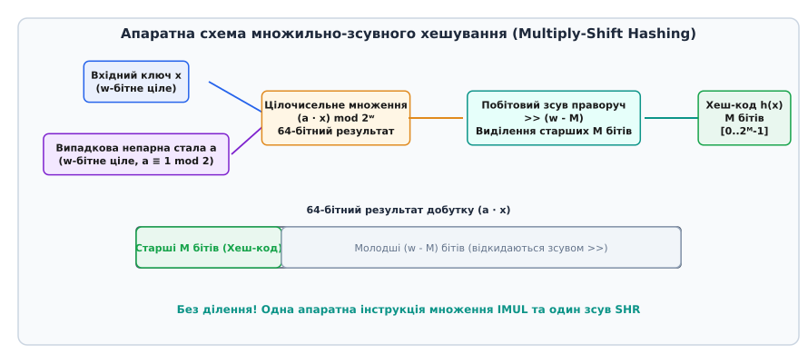

# Універсальне хешування

<preknowlist>
- [Асимптотична складність](topic:computability/asymptotic-complexity) — O-нотація, часова складність та оцінка найгіршого й середнього випадків.
- [Амортизаційний аналіз](topic:computability/amortized-analysis) — амортизована складність та методи потенціалів для динамічних структур.
- [Хеш-таблиці](topic:sf-algorithms/hash-table) — організації даних, методи вирішення колізій (ланцюжки та відкрита адресація).
- [Некриптографічні хеш-функції](topic:sf-algorithms/non-cryptographic-hash) — швидкі детерміновані функції хешування (MurmurHash, FNV-1a, CityHash).
</preknowlist>

Під час обробки великих масивів даних у вебсерверах, базах даних та трансляторах мов програмування швидкість індексації елементів у хеш-таблицях критично залежить від відсутності колізій — ситуацій, коли два різні ключі відображаються у той самий бакет. Якщо хеш-функція обрана як зафіксований детермінований алгоритм, зовнішній супротивник або специфічний розподіл вхідних даних може завчасно підібрати серію ключів, що повністю збігаються в один бакет. Це спричиняє деструктивний колапс продуктивності: константний час пошуку `O(1)` катастрофічно деградує до повільного лінійного сканування `O(n)`, викликаючи повне відключення сервісу (Algorithmic Complexity DoS).

Концепція універсального хешування (англ. *universal hashing*, від лат. *universalis* — загальний, всеохопний та англ. *hash* — кришити, дрібнити) вирішує цю фундаментальну вразливість шляхом рандомізації вибору алгоритму хешування. Замість застосування єдиної зафіксованої хеш-функції, програма під час ініціалізації випадково та рівномірно обирає хеш-функцію `h` зі спеціально сконструйованого математичного сімейства `H`. Оскільки супротивник змушений формувати вхідну множину ключів до того, як програма згенерує випадкове зерно (seed), імовірність колізії між будь-якою парою ключів строго обмежується значенням `1 / m`, де `m` — кількість бакетів хеш-таблиці.

Такий підхід надає безумовну математичну гарантію: для **довільної** (навіть навмисно згенерованої супротивником) множини з `n` ключів очікувана кількість порівнянь під час пошуку не перевищує `1 + n / m = O(1)`. Універсальне хешування усуває потребу в гіпотезі про просте рівномірне хешування і забезпечує теоретичну стійкість та високу швидкість обчислень у сучасних мовах програмування, мережевих стеках та криптографічних протоколах аутентичності.

## 1. Фатальна вразливість детермінованого хешування та колізійні атаки

Класична теорія структури даних хеш-таблиці виходить із припущення, що хеш-функція `h: U → {0, 1, ..., m-1}` рівномірно та незалежно розподіляє ключі з універсуму `U` по `m` доступних комірках. Якщо це припущення справджується, очікувана довжина ланцюжка колізій при коефіцієнті завантаження `α = n / m` становить `O(1 + α)`. Проте у детермінованій системі функція `h` є фіксованою алгоритмічною константою (наприклад, побітовим алгоритмом FNV-1a або алгоритмом ділення за модулем).

Розглянемо математичні наслідки фіксації хеш-функції. Нехай розмір універсуму можливих ключів `|U|` значно перевищує розмір хеш-таблиці `m`, зокрема `|U| ≥ (n - 1) · m + 1`. Згідно з математичним принципом Діріхле (англ. *pigeonhole principle*), існує принаймні один бакет `i ∈ {0, ..., m-1}`, у який відображається не менше ніж `n` різних ключів з `U`.

```
|{x ∈ U : h(x) = i}| ≥ ⌈|U| / m⌉ ≥ n
```

Оскільки детермінована хеш-функція `h` повністю відома, супротивник може статично обчислити цю підмножину `S = {k₁, k₂, ..., kₙ} ⊂ U` заздалегідь на своєму комп'ютері та надіслати її у систему.


*Акутальна колізійна атака на фіксовану хеш-функцію проти рівномірного розподілу ключів під дією вибору випадкової функції з 2-універсального сімейства.*

Як показано на схемі, коли всі `n` ключів вхідного вектору потрапляють у бакет `[2]`, хеш-таблиця втрачає свої переваги. Часова складність операцій виконання має такі показники:

- **Вставка (Insert)**: `O(n)` при перевірці унікальності через необхідність обходу всього існуючого ланцюжка.
- **Пошук (Lookup)**: `O(n)` у найгіршому випадку для кожного запиту, оскільки алгоритм змушений послідовно порівнювати вхідний ключ з усіма `n` елементами списку.
- **Вилучення (Delete)**: `O(n)` через необхідність лінійного пошуку елемента у зв'язаному списку перед його видаленням.

Обчислювальні витрати на виконання `n` послідовних операцій пошуку зростають від оптимального значення `O(n)` до квадратичного `O(n²)`. Якщо вебсервер обробляє POST-запит з `n = 10 000` параметрами, детерміноване хешування змушує процесор виконати близько `50 000 000` порівнянь рядків замість `10 000`. У 2003 році цей ефект спровокував хвилю атак типу Algorithmic Complexity DoS (Hash DoS), які блокували роботу вебсерверів під управлінням Java, PHP, Python та Perl.

Проблема посилюється у підсистемах операційних ядер. Наприклад, у кеші крок-таблиць Linux (dcache) або таблицях відстеження з'єднань netfilter, детермінована хеш-функція дозволяла віддаленому атакцюючому надсилати спеціально сформовані мережеві пакети, які повністю паралізували обробку переривань мережевої карти. Докладно історію цього фундаментального відкриття та його вплив на індустрію висвітлено в огляді [історію створення універсального хешування](topic:sf-algorithms/universal-hashing/hist-carter-wegman.md).

## 2. Формальна математична теорія: 2-універсальність та попарна незалежність

Щоб подолати зловмисний підбір вхідних даних, необхідно позбавити супротивника можливості завчасно передбачити відображення ключів. Це досягається введенням імовірнісного простору над множиною хеш-функцій.

Нехай `U` — множина всіх потенційних ключів, а `M = {0, 1, ..., m-1}` — множина індексів бакетів.

> **Означення 2-універсального сімейства.** Скінченна множина хеш-функцій `H = {h: U → M}` називається **2-універсальним сімейством (англ. *2-universal hash family*)**, якщо для будь-якої пари різних ключів `x, y ∈ U` при `x ≠ y` кількість хеш-функцій у сімействі `H`, які спричиняють колізію `h(x) = h(y)`, задовольняє умову:
>
> `|{h ∈ H : h(x) = h(y)}| ≤ |H| / m`

Якщо хеш-функція `h` обирається з сімейства `H` випадково та рівномірно, то ймовірність колізії для двох довільних ключів обмежена згори:

```
P_{h ∈ H}[h(x) = h(y)] ≤ 1 / m
```

Це значення дорівнює ймовірності колізії у разі використання ідеального випадкового оракула. Зауважимо важливий факт: умовою 2-універсальності регулюється лише ймовірність колізії для **пар** елементів, але не вимагається повна взаємна незалежність усіх ключів, що значно спрощує практичну конструкцію таких функцій.

Для більш вимогливих імовірнісних алгоритмів вводиться сильніше поняття попарної незалежності.

> **Означення строго 2-універсального сімейства.** Сімейство `H` є **строго 2-універсальним (англ. *strongly 2-universal* або *pairwise independent*)**, якщо для будь-якої пари різних ключів `x ≠ y ∈ U` та будь-яких двох хеш-індексів `q₁, q₂ ∈ M` виконується умова:
>
> `P_{h ∈ H}[h(x) = q₁ ∧ h(y) = q₂] = 1 / m²`

З цього означення безпосередньо випливає, що кожен окремий ключ `x` відображається у будь-яку комірку `q₁` з точною ймовірністю `P[h(x) = q₁] = 1 / m`.

Сформулюємо головну теорему про продуктивність хеш-таблиці під дією 2-універсального хешування.

> **Теорема про математичне сподівання колізій.** Нехай у хеш-таблицю розміру `m` з розділеними ланцюжками вставлено довільну множину `S ⊂ U` з `n` ключів. Якщо хеш-функція `h` обрана випадково та рівномірно з 2-універсального сімейства `H`, то очікувана кількість елементів `E[C_x]` у бакеті для будь-якого ключа `x` (включено чи ні до `S`) задовольняє нерівність:
>
> `E[C_x] ≤ 1 + n / m`

Виведення цього показника спирається на індикаторні випадкові величини `I(h(x) = h(y))`:

```
E[C_x]
  = E[ ∑_{y ∈ S} I(h(x) = h(y)) ]                           [лінійність математичного сподівання]
  = ∑_{y ∈ S} P[h(x) = h(y)]                                [перехід до ймовірностей подій]
  = P[h(x) = h(x)] + ∑_{y ∈ S, y ≠ x} P[h(x) = h(y)]        [відокремлення випадку y = x]
  ≤ 1 + ∑_{y ∈ S, y ≠ x} (1 / m)                            [застосування властивості 2-універсальності]
  = 1 + (n - 1) / m < 1 + n / m                             [підсумовування n-1 однаковими доданками]
```

При підтримці коефіцієнта завантаження `α = n / m ≤ 1` очікувана довжина ланцюжка колізій не перевищує `2`, а очікувана часова складність виконання операцій вставки, пошуку та вилучення дорівнює `O(1)` у найгіршому для супротивника вхідному векторі.

При аналізі методів відкритої адресації (Linear Probing, Quadratic Probing, Double Hashing) 2-універсальне хешування також гарантує амортизовану складність `O(1)`, за умови що коефіцієнт завантаження не перевищує порогу `α < 0.75`.

Якщо ж алгоритм вимагає високої концентрації ймовірностей (наприклад, щоб максимальна довжина ланцюжка з високою ймовірністю `1 - ε` не перевищувала `O(log n / log log n)`), застосовують `k`-незалежні сімейства при `k = O(log n)`. Повні доведення та узагальнення для `k`-незалежних сімейств зібрано в матеріалі [математичні доведення колізійних меж](topic:sf-algorithms/universal-hashing/math-universal-family.md).

## 3. Фундаментальні конструкції універсальних сімейств

На практиці обчислення хеш-функції має виконуватись за кілька тактів центрального процесора. Розглянемо три класичні універсальні конструкції, що поєднують строгі математичні гарантії з апаратною ефективністю.

### 3.1. Модульне лінійне сімейство (Modular Linear Hashing)

Перша конструкція, запропонована Картером і Вегманом, спирається на арифметику у скінченному полі `ℤₚ` (де `p` — просте число, що перевищує розмір універсуму ключів `p > |U|`).

Нехай `p` — просте число, `m` — кількість бакетів у хеш-таблиці (`m < p`). Модульне лінійне сімейство `H_{p,m}` визначається як:

```
H_{p,m} = { h_{a,b}(x) = ((a · x + b) mod p) mod m  |  a ∈ {1, 2, ..., p-1},  b ∈ {0, 1, ..., p-1} }
```

Конструкція здійснює двоетапне відображення вхідного ключа `x`:


*Двоетапний процес обчислення індексу в модульному лінійному сімействі Hₚ,ₘ через афінне перетворення у полі ℤₚ.*

1. **Крок 1 (Афінне перетворення)**: Ключ `x` множиться на ненульовий коефіцієнт `a` та додається зміщення `b` у скінченному полі `ℤₚ`. Це забезпечує повне бієктивне перемішування значень: для двох різних ключів `x ≠ y` їхні intermediate-результати `r = (a·x + b) mod p` та `s = (a·y + b) mod p` гарантовано не рівні `r ≠ s`.
2. **Крок 2 (Звуження модуля)**: Значення `r` зменшується за модулем `m` для отримання підсумкового індексу комірки `[0 .. m-1]`.

Оскільки кількість можливих пар `(a, b)` дорівнює `p · (p - 1)`, а кожна пара відображає `(x, y)` у виважену пару `(r, s)` при `r ≠ s`, ймовірність того, що `r mod m = s mod m`, становить строго `P ≤ 1 / m`.

Для практичної реалізації на 64-бітних архітектурах як `p` обирають просте число Мерсенна `p = 2⁶¹ - 1`. Це дозволяє замінити повільну інструкцію ділення `mod p` на комбінацію побітового додавання та зсуву:

```
(val mod (2⁶¹ - 1)) = (val & (2⁶¹ - 1)) + (val >> 61)
```

Такий підхід скорочує затримку обчислення з 40 тактів інструкції `IDIV` до всього 3 тактів базових регістрових операцій ALU.

### 3.2. Множильно-зсувне хешування Dietzfelbinger (Multiply-Shift Hashing)

Незважаючи на оптимізацію чисел Мерсенна, модульне лінійне хешування вимагає операції `mod m`, яка для довільного `m` потребує інструкції цілочисельного ділення `DIV`. У 1990 році Мартін Дітцфельбінгер розробив множильно-зсувний метод, призначений для хеш-таблиць із розміром, що дорівнює ступеню двійки `m = 2ᴹ`.

Нехай вхідний ключ `x` є `w`-бітним цілим числом (`x ∈ {0, 1, ..., 2ʷ - 1}`). Множильно-зсувне сімейство визначається як:

```
H_{mult} = { h_a(x) = ((a · x) mod 2ʷ) >> (w - M)  |  a ∈ {1, 3, 5, ..., 2ʷ - 1} }
```

де `a` — випадково обране **непарне** `w`-бітне ціле число.


*Апаратне обчислення хеш-коду методом множильно-зсувного хешування без операції ділення на процесорі.*

Механізм роботи обчислювальної схеми:

1. **Цілочисельне множення**: Обчислюється добуток `a · x`. Оскільки операція виконується у `w`-бітному регістрі процесора, старші біти переповнення автоматично відкидаються, що еквівалентно беручи `mod 2ʷ` без жодних додаткових тактів.
2. **Логічний зсув**: Результат зсувається праворуч на `(w - M)` бітів, виділяючи `M` найстарших бітів нижньої половини добутку.

Ймовірність колізії для цієї конструкції задовольняє нерівність:

```
P_{a}[h_a(x) = h_a(y)] ≤ 2 / 2ᴹ = 2 / m
```

Це всього удвічі перевищує ідеальну межу `1 / m`, але обчислюється на ALU за два такти процесора (одна інструкція `IMUL` та одна інструкція `SHR`).

### 3.3. Табульоване хешування (Simple Tabulation Hashing)

Для обробки 64-бітних ключів або послідовностей байтів високу швидкість демонструє табульоване хешування. 64-бітний ключ `x` розбивається на `k = 8` байтових сегментів `x = (x₀, x₁, ..., x₇)`.

Під час ініціалізації генеруються `8` таблиць `T₁, ..., T∸`, кожна з яких містить `256` випадкових 64-бітних чисел. Значення хеш-функції обчислюється як побітове виключне АБО (`XOR`):

```
h(x) = (T₁[x₀] ⊕ T₂[x₁] ⊕ ... ⊕ T∸[x♁]) mod m
```

Табульоване хешування є строго 3-універсальним сімейством і має потужні властивості концентрації значень, близькі до повністю незалежного випадкового оракула. Масиви таблиць обсягом 2 КБ повністю розташовуються у кеші L1 процесора, забезпечуючи нульову кількість промахів кешу. Практичний вихідний код C та C++ для всіх трьох методів із бенчмарками наведено в матеріалі [практичну реалізацію та бенчмаркінг](topic:sf-algorithms/universal-hashing/proj-universal-hash.md).

### 3.4. Векторне хешування для рядків змінної довжини

Коли вхідним ключем є послідовність байтів або рядок символів `X = (x₁, x₂, ..., x_L)` довжини `L`, застосовують поліноміальне універсальне хешування Картера-Вегмана.

Нехай `p` — просте число, а `r` — випадкове зерно, обране рівномірно з `ℤₚ`. Хеш-код рядка обчислюється як оцінка полінома за схемою Горнера у полі `ℤₚ`:

```
h_r(X) = ( ∑_{i=1}^L x_i · r^{L - i} mod p ) mod m
```

Якщо довжина двох різних рядків обмежена значенням `L_max`, ймовірність колізії задовольняє межу:

```
P[h_r(X) = h_r(Y)] ≤ L_max / p + 1 / m
```

При виборі простого числа `p ≈ 2¹²⁸` ймовірність колізії для будь-яких реальних рядків залишається зневажливо малою `P ≤ 1 / m`.

## 4. Спеціалізовані схеми: зозулине хешування (Cuckoo Hashing) та MinHash

Застосування 2-універсальних сімейств дало поштовх для розробки нових класів алгоритмів із найжорсткішими гарантіями виконання.

### 4.1. Зозулине хешування (Cuckoo Hashing) з двома 2-універсальними функціями

Зозулине хешування (англ. *Cuckoo Hashing*), розроблене Расмусом Пахом (Rasmus Pagh) та Якобом Родлером (Jakob Rodler) у 2001 році, забезпечує детермінований час пошуку `O(1)` у **найгіршому випадку** у динамічних хеш-таблицях.

Структура даних використовує дві окремі хеш-таблиці `T₁` та `T₂` розміру `m` кожна, та дві випадково обрані хеш-функції `h₁, h₂ ∈ H` з 2-універсального сімейства. Кожен ключ `x` може зберігатися **виключно** у двох позиціях: `T₁[h₁(x)]` або `T₂[h₂(x)]`.

#### Алгоритм пошуку (Lookup):
Операція пошуку ключа `x` перевіряє рівно дві комірки:

```
Lookup(x):
    if T₁[h₁(x)] == x return FOUND
    if T₂[h₂(x)] == x return FOUND
    return NOT_FOUND
```

Часова складність пошуку дорівнює **строго 2 операціям порівняння** у найгіршому випадку, що ідеально підходить для апаратних роутерів та систем реального часу.

#### Алгоритм вставки та витискання (Cuckoo Displacement Loop):
Під час вставки нового ключа `x`, якщо позиція `T₁[h₁(x)]` вільна, ключ розміщується туди. Якщо ж комірка зайнята існуючим ключем `y`, новий ключ `x` **витискає** `y` з комірки. Витиснутий ключ `y` змушений переміститися у свою альтернативну позицію у другій таблиці `T₂[h₂(y)]`. Якщо вона також зайнята елементом `z`, ключ `z` витискається далі.

Цей процес формує шлях у графі зозулі (англ. *cuckoo graph*). Якщо ланцюжок витискань потрапляє у цикл (довжина витискань перевищує `MAX_LOOP = 6 log n`), таблиця оголошує про виявлення циклу, здійснює **reseed** (випадковий вибір нових функцій `h₁, h₂` з 2-універсального сімейства) та перехешовує всі елементи.

Завдяки 2-універсальності ймовірність утворення циклу при коефіцієнті завантаження `α = n / (2m) < 0.5` залишається меншою за `O(1/n)`, а амортизована складність вставки становить `O(1)`.

### 4.2. Алгоритм MinHash для оцінки подібності Жакара

У задачах пошуку дублікатів документів та аналізу текстових корпусів (Data Mining) широко застосовується метод MinHash, оснований на 2-універсальних перестановках.

Подібність Жакара (англ. *Jaccard similarity*) між двома множинами символів чи слів `A` та `B` визначається як:

```
J(A, B) = |A ∩ B| / |A ∪ B|
```

Нехай `h` — випадкова хеш-функція з 2-універсального сімейства, яка відображає елементи множин у `64`-бітні цілі числа. Сигнатурне значення MinHash для множини `A` визначається як мінімальний хеш-код серед усіх її елементів:

```
h_min(A) = min_{x ∈ A} h(x)
```

Фундаментальна теорема MinHash стверджує, що ймовірність того, що мінімальні хеш-коди двох множин збігаються, строго дорівнює коефіцієнту Жакара:

```
P_{h ∈ H}[ h_min(A) = h_min(B) ] = J(A, B)
```

Обчисливши `k = 100` мінімальних хеш-значень за допомогою `k` універсальних хеш-функцій, алгоритм будує компактну сигнатуру розміром 800 байтів, яка дозволяє оцінити подібність двох документів обсягом у гігабайти за кілька мікросекунд.

## 5. Розширені застосування: FKS, стрімінг, кодувачі аутентичності та криптографія

Універсальне хешування вийшло далеко за межі звичайних хеш-таблиць із ланцюжками і утворює фундамент багатьох складних імовірнісних алгоритмів.

### 5.1. Досконале хешування FKS (Fredman, Komlós, Szemerédi)

Для статичних множин ключів (наприклад, словників резервованих слів у компіляторі або незмінних базах даних) алгоритм FKS будує двохрівневу хеш-таблицю, яка забезпечує гарантований час пошуку `O(1)` у **найгіршому випадку** (абсолютна відсутність колізій) при обсязі пам'яті `O(n)`.

Схема алгоритму FKS спирається на двоетапне застосування 2-універсальних сімейств:

```
[Перший рівень]  h(x) ∈ H_{p,m}  --->  Розбиття n ключів на m = n бакетів
                                         Бакет i містить n_i ключів.
                                         Сума ∑ n_i² < 2n (за властивістю 2-універсальності).

[Другий рівень]  h_i(x) ∈ H_{p, m_i} --> Для кожного бакета обирається своя хеш-функція h_i
                                         з розміром таблиці m_i = n_i².
                                         Ймовірність наявності колізій P_col < 1/2.
```

Завдяки тому, що у кожному бакеті другого рівня розмір таблиці встановлюється як `m_i = n_i²`, очікувана кількість колізій дорівнює:

```
E[Колізій у бакеті i] = (n_i (n_i - 1) / 2) · (1 / n_i²) < 1 / 2
```

Якщо при виборі хеш-функції `h_i` виникає колізія, алгоритм FKS просто здійснює повторний вибір `h_i` із сімейства (reseed). З імовірністю `P > 1/2` підйомна функція знаходить варіант без колізій за `O(1)` спроб.

### 5.2. Потокові алгоритми та ескізи (Streaming & Sketches)

У задачах обробки великих потоків даних (Big Data Streaming), де неможливо зберегти всі елементи в пам'яті, універсальне хешування застосовується у таких структури:

- **Count-Min Sketch**: Використовує `d` незалежно обраних хеш-функцій з 2-універсального сімейства для оцінки частоти елементів у потоці з гарантованою верхньою межею похибки.
- **Оптимізація Кірша-Мітценмахера у фільтрах Блума**: Дозволяє спростити структуру фільтра Блума. Замість обчислення `k` незалежних хеш-функцій для кожного елемента, обчислюються лише дві хеш-функції `h₁(x)` та `h₂(x)` з 2-універсального сімейства, а решта `k - 2` індексів отримуються їх лінійною комбінацією:

```
g_i(x) = (h₁(x) + i · h₂(x)) mod m,   i ∈ {0, 1, ..., k-1}
```

Ця оптимізація зберігає асимптотичну ймовірність хибнопозитивного спрацьовування, зменшуючи навантаження на процесор у `k / 2` разів.

### 5.3. Криптографічні кодувачі аутентичності (MAC) та Leftover Hash Lemma

2-універсальні сімейства утворюють основу теоретико-інформаційної криптографії (Message Authentication Codes, MAC). На відміну від симетричних шифрів (AES), які спираються на складні обчислювальні припущення, кодувачі на основі універсального хешування (такі як **UMAC** та **Poly1305**) надають недоведену безумовну стійкість.

У протоколі Poly1305 повідомлення розбивається на 16-байтові блоки `m₁, m₂, ...`, які розглядаються як коефіцієнти полінома `P(x)` у скінченному полі `GF(2¹³⁰ - 5)`. Оцінка полінома у випадковій секретній точці `r` з додаванням одноразового ключа `s`:

```
Tag = ( ( ∑ m_i · rⁱ ) mod (2¹³⁰ - 5) ) + s  mod 2¹²⁸
```

забезпечує ймовірність підробки підпису супротивником не більше ніж `L / 2¹²⁶` для повідомлення довжиною `L` блоків.

Крім того, універсальне хешування є головним інструментом **Лемми про залишковий хеш (Leftover Hash Lemma, LHL)**. Вона стверджує, що якщо джерело двійкових даних має мін-ентропію `H_min(X) ≥ k`, застосування хеш-функції з 2-універсального сімейства вилучає майже ідеально рівномірний випадковий ключ довжиною `b ≈ k - 2 log₂(1/ε)` бітів.

## 6. Математична взаємодія універсальності зі структурою ключів у пам'яті

Практична ефективність універсального хешування істотно залежить від вирівнювання даних у пам'яті та архітектурних особливостей системних шин.

### 6.1. Матричне/векторне хешування над бітовими полями GF(2)

Для апаратної реалізації у мікросхемах FPGA або ASIC 2-універсальні хеш-функції будуються як матричне множення над двозначним полем Galois Field `GF(2)`.

Нехай ключ `x` подається у вигляді `w`-бітного бітового вектора, а вихід є `M`-бітним вектором. Сімейство утворюється множиною випадкових двозначних матриць `A` розміру `M × w` та двозначних векторів `B` розміру `M × 1`:

```
h_{A,B}(x) = (A · x + B) mod 2
```

Операція множення матриці на вектор над `GF(2)` зводиться до побітових інструкцій `AND` та обчислення паритету `XOR` (паритетного біта). Оскільки кожна комірка матриці `A` містить випадковий біт з ймовірністю `1/2`, будь-яка пара ключів `x ≠ y` відображається у вихідний вектор із точним дотриманням сили 2-універсальності `P = 1 / 2ᴹ`.

### 6.2. Вплив порядку байтів (Endianness) та вирівнювання пам'яті

Під час обробки рядків або бінарних структур універсальними хеш-функціями на процесорах із різними порядками байтів (Little-Endian у x86-64/ARM проти Big-Endian у майкроконтролерах) виникає проблема відтворюваності хеш-кодів.

Для забезпечення крос-платформної ідентичності байтові послідовності зчитуються як 64-бітні слова за допомогою явних системних макросів канонічного порядку (наприклад, `le64toh` або `be64toh`). Якщо ключ розташований за невирівняною адресою в пам'яті (misaligned pointer), застосування прямих вказівникових приводів `*(uint64_t*)ptr` на архітектурах без підтримки невирівняного доступу викликає апаратне переривання `Alignment Fault`. Специфічні запобіжні заходи та інваріанти типів описано у документі [специфікацію програмного інтерфейсу](topic:sf-algorithms/universal-hashing/api-universal-hash-spec.md).

## 7. Простеження та діагностика хеш-таблиць у Linux (sysfs/procfs)

Під час експлуатації критичних високонавантажених серверів системні адміністратори та розробники здатні діагностувати деградацію хеш-таблиць через системні інтерфейси ядра Linux.

### 7.1. Моніторинг хеш-таблиці мережевих з'єднань (`netfilter`)

Ядро Linux використовує універсальне хешування для таблиці відстеження мережевих з'єднань (Connection Tracking, `conntrack`). Стан продуктивності хеш-таблиці відображається у фалові псевдофайлової системи `/proc`:

```
cat /proc/net/stat/nf_conntrack
```

Основні метрики інтерфейсу:
- **`searched`**: Загальна кількість виконаних обходів бакетів хеш-таблиці.
- **`found`**: Кількість успішно знайдених мережевих сесій.
- **`insert_failed`**: Кількість збоїв вставки через виникнення колізійних ланцюжків критичної довжини.

Якщо відношення `searched / found` істотно перевищує `1.0`, це свідчить про виникнення колізійного скупчення та вимагає виконання виклику `reseed` з посиленням ентропії системного джерела `get_random_bytes()`.

### 7.2. Профілювання промахів кешу за допомогою `perf`

Для вимірювання апаратної ефективності універсальних хеш-функцій застосовується утиліта системного профілювання `perf`:

```
perf stat -e L1-dcache-loads,L1-dcache-load-misses,cycles,instructions ./hash_benchmark
```

Завдяки компактному розміру стану табульованого (2 КБ) та множильно-зсувного (8 байтів) хешування кількість промахів кешу першого рівня `L1-dcache-load-misses` не перевищує `0.1%`, що забезпечує виконання операцій хешування із граничною швидкістю процесорного кристала.

## 8. Розподілені системи, партиціонування та багатопотокові хеш-структури

У великомасштабних кластерних базах даних (Cassandra, Redis Cluster, Amazon Dynamo) універсальне хешування взаємодіє з узгодженим хешуванням (Consistent Hashing) для шардингу даних по вузлах.

### 8.1. Рандомізоване шардування (Rendezvous / Highest Random Weight Hashing)

Для розподілу об'єктів по `N` серверах без використання громіздких кільцевих структур алгоритм HRW (Rendezvous Hashing) обчислює для кожного сервера `S_i` та кожного ключа `K` сумісний хеш-код:

```
weight(K, S_i) = h(K ⊕ S_i)
```

де `h` — хеш-функція з 2-універсального сімейства. Об'єкт призначається серверу з максимальним значенням ваги `weight`. Завдяки 2-універсальності додавання або вилучення одного вузла змушує переміщати лише `1 / N` частину всіх ключів, що мінімізує мережевий трафік ребалансування.

### 8.2. Багатопотокові Lock-Free хеш-таблиці

У висококонкурентних середовищах (ConcurrentHashMap) універсальне хешування поєднується з семантикою RCU (Read-Copy-Update) або атомарними інструкціями `Compare-And-Swap (CAS)`.

При виконанні процедури `reseed` під високим паралельним навантаженням потоки-читачі продовжують зчитувати дані зі старої хеш-таблиці за старим зерном `a_old`, доки потік-письменник будує нову хеш-таблицю за новим випадковим зерном `a_new`. Після завершення перехешування атомарний вказівник кореню таблиці переклюється на нову структуру за одну інструкцію `atomic_store_explicit`.

## 9. Граничні випадки, часті помилки розробників та практичні рекомендації

Під час розробки універсальних хеш-функцій недосвідчені розробники часто припускаються типових помилок:

1. **Використання слабких генераторів випадкових чисел (Weak RNG Seed)**: Ініціалізація зерен `a` та `b` за допомогою виклику `srand(time(NULL))` є фатальною помилкою. Супротивник, знаючи час запуску сервера з точністю до секунди, може легко перебрати всі можливі значення `a` та відновити хеш-функцію. Обов'язково слід використовувати системний CSPRNG (`/dev/urandom` або `getrandom()`).
2. **Повторне використання однакових зерен для різних хеш-таблиць (Seed Reuse)**: Якщо дві різні хеш-таблиці в пам'яті процесу застосовують ідентичні параметри `a` та `b`, супротивник, виявивши колізію в одній таблиці, автоматично отримує колізію для другої. Кожна хеш-таблиця повинна володіти власним унікальним екземпляром хеш-функції.
3. **Некоректний вибір простого числа `p` у модульному хешуванні**: Якщо число `p` обрано меншим за розмір універсуму `|U|`, виникає систематичне переповнення за модулем `p`, що ламає бієктивність афінного перетворення та порушує межу 2-універсальності.
4. **Непарність параметра `a` у Multiply-Shift хешуванні**: Якщо у множильно-зсувному хешуванні випадковий коефіцієнт `a` виявиться парним (`a mod 2 = 0`), наймолодший біт добутку завжди дорівнює нулю, що зменшує вихідну ентропію вдвічі. Розробник зобов'язаний встановлювати молодший біт `a |= 1`.

## 10. Системний вибір алгоритму хешування: Матриця рішень для архітекторів

При розробці систем високого навантаження вибір сімейства універсального хешування залежить від профілю вхідних даних та вимог до безпеки.

Для числових 64-бітних ключів найкращі показники швидкості затримки демонструє **Multiply-Shift хешування Dietzfelbinger**, оскільки воно обчислюється за два такти процесора без ділення. Якщо вхідними даними є байтові рядки середньої довжини (наприклад, ключі у базі даних Key-Value), оптимальним вибором є **Simple Tabulation Hashing** або алгоритм **SipHash-1-3**, які поєднують 3-універсальність із кеш-локальністю. За наявності вимог криптографічного захисту від сторонніх каналів вимірювання часу вибирають **SipHash-2-4** або **Poly1305**.

## 11. Порівняльний аналіз, обчислювальна вартість та інженерні компроміси

Вибір конкретного сімейства універсального хешування вимагає балансування між трьома інженерними параметрами: швидкістю обчислення на процесорі, розміром стану (seed/tables) та теоретичними гарантіями стійкості.

Нижче наведено порівняльну характеристику основних хеш-конструкцій:

| Метод хешування | Очікувана ймовірність колізії `P[h(x)=h(y)]` | Складність обчислення | Операції CPU | Розмір стану (Seed State) | Стійкість до Hash DoS |
| :--- | :--- | :--- | :--- | :--- | :--- |
| **Фіксований FNV-1a / MurmurHash** | Невизначена (до `1.0` при атаці) | `O(L)` байт | `XOR`, `IMUL` | `0` байтів (фіксований) | ❌ Відсутня (колапс до `O(n)`) |
| **Modular Linear `H_{p,m}`** | `≤ 1 / m` (2-універсальне) | `O(1)` слово | `IMUL128`, `ADD`, `MOD` | 16 байтів (`a, b`) | High Гарантована `O(1)` |
| **Multiply-Shift (Dietzfelbinger)** | `≤ 2 / m` (майже 2-універсальне) | `O(1)` слово | `IMUL64`, `SHR` | 8 байтів (`a` непарне) | High Гарантована `O(1)` |
| **Simple Tabulation** | `≤ 1 / m` (строго 3-універсальне) | `O(k)` блоків | 8 вибірок з L1-кешу, `XOR` | 2048 байтів (таблиці) | High Гарантована + стрімінг |
| **SipHash-2-4** | Криптографічно мала | `O(L)` байт | `ARX` (Add-Rotate-XOR) | 16 байтів (захищене зерно) | Криптографічна стійкість |

У практичній розробці системних середовищ стандартні бібліотеки реалізують комбінований підхід:
- **Rust (std::collections::HashMap)**: Використовує `SipHash-1-3` із випадковим зерном для забезпечення криптографічної стійкості проти Hash DoS атак за умовчуванням.
- **Python 3.4+ (dict)**: Застосовує `SipHash-2-4` із випадковим секретним ключем, який генерується інтерпретатором при старті кожного процесу (PEP 456).
- **Go (map)**: Застосовує апаратно-прискорене хешування на основі інструкцій `AES-NI` (якщо вони підтримуються CPU) з додаванням випадкового зерна для кожної створеної карти.
- **Java (java.util.HashMap)**: Використовує хеш-функцію з випадковим зерном, але при виявленні довгого ланцюжка колізій (`n_i > 8`) динамічно перебудовує бакет зі зв'язаного списку у червого-чорне дерево (Red-Black Tree), що гарантує верхню межу пошуку `O(log n)` навіть при успішній атаці.

Таким чином, універсальне хешування є фундаментальним науково-інженерним здобутком, який забезпечує постійний час виконання `O(1)` для ключових алгоритмів обробки даних у сучасній комп'ютерній індустрії та надійно захищає високопродуктивну інфраструктуру від зовнішніх атак та штучно спровокованих сплесків затримки.
