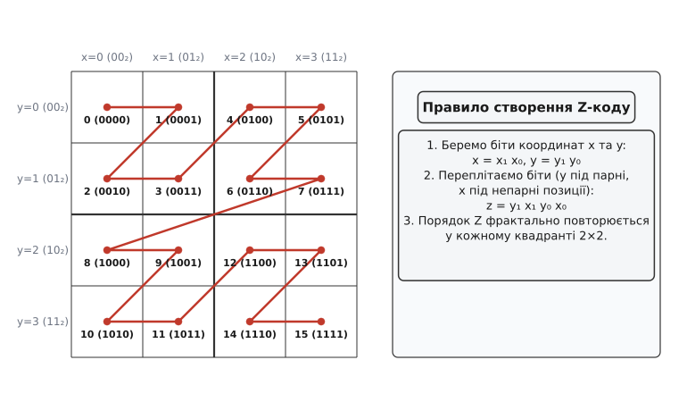
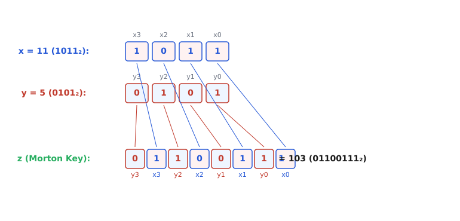
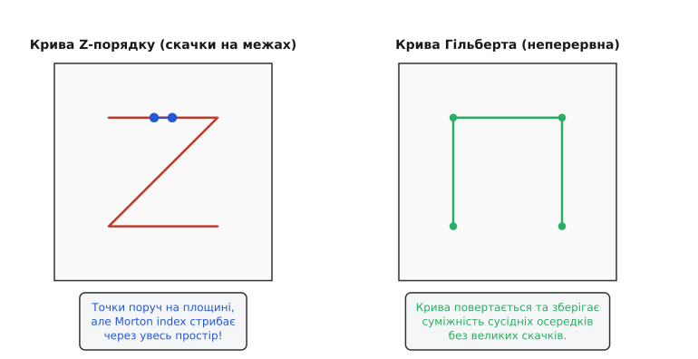
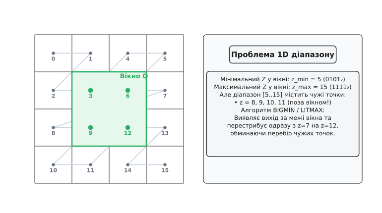

# Крива Z-порядку (Morton Order)

<preknowlist>
- [Просторовий індекс](topic:sf-algorithms/spatial-index) — навіщо розбивати N-вимірний простір на області та як шукати об'єкти у вікні запиту.
- [Двійковий пошук](topic:sf-algorithms/binary-search) — як упорядкованість перетворює перебір на логарифмічний час O(log N).
- [Біти, байти та ендіанність](topic:sf-algorithms/bits-bytes-endianness) — побітові операції AND, OR, зсуви `<<` та `>>` для роботи з двійковим поданням.
- [Двійкове дерево пошуку](topic:sf-algorithms/binary-search-tree) — ієрархічний поділ ключового простору на ліве та праве піддерево.
</preknowlist>

Сервер геолокації обробляє мільйон GPS-трекерів автотранспорту. Кожен пристрій має дві координати: широту й долготу `(x, y)`. Коли диспетчер запитує «показати всі машини у прямокутнику мікрорайону», систему спіткає фундаментальна суперечність між геометрією та залізом: оперативна пам'ять і диски є **одновимірними** масивами комірок (адреси 0, 1, 2, ...), а об'єкти живуть у **багатовимірному** просторі.

Якщо відсортувати точки лише за однією координатою `x`, [двійковий пошук](topic:sf-algorithms/binary-search) знайде межі за лівим і правим краєм, але ігноруватиме координату `y`. Запит відбере вертикальну смугу на всю висоту карти: 99% перевірених точок виявляться чужими, а корисна робота впаде зі зменшенням розміру вікна. Складений ключ `(x, y)` теж не рятує, бо друга координата враховується тільки при збігу першої.

Щоб виконувати швидкий пошук за допомогою класичних одновимірних масивів чи [B-дерев](topic:sf-data/b-tree), потрібен спосіб випрямити двовимірну площину в один лінійний ланцюжок так, щоб об'єкти, розташовані поруч у просторі, опинилися поруч і в списку.

Саме цю задачу розв'язує **крива Z-порядку** (кодування Мортона) — фрактальна лінія, яка заповнює простір і перетворює двовимірні координати на одновимірні числа за допомогою побітового переплетення розрядів.

---

### Геометрія змійки: від квадрантів до фракталу

Уявімо квадратне поле, на якому розташовані наші об'єкти. Найпростіший спосіб упорядкувати простір — розбити квадрат на чотири рівні квадранти розміром 2×2.

Призначимо кожному квадранту номер від 0 до 3 у порядку обіходу «ліво-верх → право-верх → ліво-низ → право-низ». Якщо з'єднати центри цих квадрантів послідовною лінією, отримана траєкторія нагадує літеру **Z** (або N, залежно від орієнтації осей).


*Форма Z фрактально повторюється на кожному рівні деталізації сітки. Усі осередки отримують унікальний одновимірний Morton-індекс.*

Якщо кожну з чотирьох комірок знову розбити на чотири менші підквадранти (сітка 4×4), ми застосовуємо те саме правило обіходу всередині кожного з них. Велика крива Z розпадається на чотири менші криві Z, з'єднані між собою такими ж Z-переходами.

Збільшуючи роздільну здатність сітки до 8×8, 16×16 і далі до 2³²×2³², ми отримуємо самоподібну фрактальну криву, яка проходить крізь кожну точку дискретного простору рівно один раз.

Траєкторія цієї кривої називається **кривою Z-порядку** (Z-order curve) або **порядком Мортона** на честь канадського інженера Ґая Мортона, який у 1966 році запропонував цей підхід для індексування геодезичних баз даних в IBM. Детальніше про математичні витоки та створення методу можна прочитати у вставці [Історія кривої Z-порядку та просторового кодування](topic:sf-algorithms/z-order-curve/hist-morton.md).

Фрактальна природа кривої має принципове значення: структура обіходу не змінюється від зміни масштабу. Кожен квадрант довільної глибини є зменшеною точною копією всієї кривої. Завдяки цьому обчислення Morton-коду є локальним і вимагає однакової кількості побітових операцій для будь-якого рівня деталізації сітки.

---

### Механізм переплетення бітів (Bit Interleaving)

Головна краса Z-порядку полягає в тому, що для визначення номера комірки на кривій не потрібно будувати рекурсивні дерева чи виконувати важкі географічні обчислення. Порядковий номер (названий **Morton-кодом** або **Z-індексом**) обчислюється миттєво через **побітове переплетення** (bit interleaving або bit zipping) координат.

Розглянемо двовимірну точку `(x, y)`. Запишемо її координати у двійковій системі числення:
- `x = x₁ x₀₂`
- `y = y₁ y₀₂`

Щоб утворити Z-код, ми чергуємо біти координат так, щоб біти `y` займали непарні позиції (1, 3, 5...), а біти `x` — парні позиції (0, 2, 4...):

```
z = y₁ x₁ y₀ x₀₂
```

Перевіримо це правило на сітці 2×2 з двома бітами координат:

```
(x=0, y=0) -> x = 00₂, y = 00₂ -> z = 0000₂ = 0  (верхній лівий)
(x=1, y=0) -> x = 01₂, y = 00₂ -> z = 0001₂ = 1  (верхній правий)
(x=0, y=1) -> x = 00₂, y = 01₂ -> z = 0010₂ = 2  (нижній лівий)
(x=1, y=1) -> x = 01₂, y = 01₂ -> z = 0011₂ = 3  (нижній правий)
```

Результат повністю збігається з Z-подібним обіходом квадрантів.


*Два 4-бітні числа x та y змішуються в 8-бітне Morton-число z. Парні біти відповідають координаті x, непарні — координаті y.*

Простежимо переплетення на конкретному числовому прикладі для 8-бітних координат.
Нехай маємо точку `x = 11 (00001011₂)` та `y = 5 (00000101₂)`.

Розставимо біти числа `x` на парні позиції:
```
x_expanded = 0 0 0 0 1 0 1 1₂ -> 00 00 00 00 01 00 01 01₂
```

Розставимо біти числа `y` на непарні позиції (зсунуті на 1 біт ліворуч):
```
y_expanded = 0 0 0 0 0 1 0 1₂ -> 00 00 00 00 00 10 00 10₂
```

Виконуємо побітову операцію `OR`:
```
z = x_expanded | y_expanded = 0000000001100111₂ = 103
```

Отримане число `z = 103` є унікальним Morton-ключем точки `(11, 5)`. 

При переході до 32-бітних координат `x` і `y` результату вистачає одного 64-бітного цілого числа `uint64_t`. Для тривимірного простору (3D) координати `(x, y, z)` вміщують по 21 біту кожна, утворюючи 63-бітний ключ.

Детальний формальний доказ бієктивності цього відображення та властивості розкладу розрядів наведено у вставці [Математичні властивості Z-порядку](topic:sf-algorithms/z-order-curve/math-morton.md).

---

### Згладжування квадродерева: Linear Quadtree

Традиційне [квадродерево](topic:sf-algorithms/spatial-index) (Quadtree) ділить простір на вузли, кожен з яких зберігає вказівники на чотирьох синів (`node* children[4]`). У великих системах це спричиняє величезні накладні витрати:
- Вказівники займають 64 біти пам'яті на кожен вузол (часто більше за самі дані).
- Вузли розсіюються по купі (heap), спричиняючи промахи в L1/L2 кеші процесора під час обходу.
- Балансування та перебудова дерев під час динамічного додавання точок вимагають локальних поворотів та виділення нової пам'яті.

Morton-кодування повністю ліквідує вказівники. Оскільки кожен осередок квадродерева має свій унікальний Z-код, ми можемо просто зберегти всі об'єкти у **звичайному динамічному масиві**, упорядкованому за зростанням Z-індексу.

Така структура називається **лінійним квадродеревом** (Linear Quadtree).

```
Традиційне Quadtree:                 Linear Quadtree (Z-Order):
     [Вузол Root]                     Впорядкований масив 64-бітних ключів:
     /  |   |   \                     [ z=0, z=1, z=2, z=3, z=4, z=5, ... ]
   [0] [1] [2] [3]                    
   / \                                Д двійковий пошук O(log N)
  ... ...                             Нуль накладних витрат на вказівники
```

Переваги лінійного квадродерева:
1. **Компактність:** Пам'ять витрачається лише на корисні дані та 64-бітний ключ (абсолютно 0% оверхеду на вказівники).
2. **Кеш-локальність:** Послідовні елементи масиву лежать у суміжних кеш-лініях процесора, що гарантує максимальну ефективність предвибірки (hardware prefetcher).
3. **Логарифмічний пошук:** Пошук точки за її точними координатами здійснюється за `O(log N)` через класичний [двійковий пошук](topic:sf-algorithms/binary-search).
4. **Паралелізм:** Впорядкований масив ключових точок легко ділиться на рівні частини між потоками CPU або SIMD-варпами GPU без блокировок та м'ютексів.

---

### Проблема розривів (Discontinuities & Jump Problem)

Якби Z-крива ідеально зберігала просторову локальність, вона була б універсальним рішенням для будь-яких просторових задач. Але математика накладає жорстке обмеження: **неможливо неперервно відобразити 2D простір у 1D без розривів**.

На Z-кривій регулярно виникають так звані «скачки» (jumps або discontinuities). Вони трапляються на межах квадрантів вищого порядку.


*Точки на межі центрального розрізу знаходяться поруч у просторі, але їхні Morton-індекси відрізняються на половину діапазону. Крива Гільберта зберігає суміжність краще за рахунок поворотів.*

Розглянемо дві сусідні точки на сітці 4×4:
- Точка A: `x = 1 (01₂), y = 1 (01₂)` -> `z_A = 0101₂ = 5` (край першого квадранта)
- Точка B: `x = 2 (10₂), y = 1 (01₂)` -> `z_B = 0110₂ = 6`? Ні!
  `x = 2 (10₂), y = 1 (01₂)` -> `z_B = 0110₂ = 6` (це точка в іншому квадранті).

Але при переході з точки `(1, 1)` [квадрант 0] до точки `(2, 0)` [квадрант 1]:
- `A (1, 1) -> z = 5 (0101₂)`
- `B (2, 0) -> z = 8 (1000₂)`

Фізична відстань між точками дорівнює `√((2−1)² + (0−1)²) = √2 ≈ 1.41`, а різниця індексів — `8 − 5 = 3`.

Ще гірша ситуація на центральній межі сітки: точки `(2ᵏ⁻¹ − 1, 0)` та `(2ᵏ⁻¹, 0)` лежать фізично поруч, але їхні індекси розділені величезною прірвою у `2²ᵏ⁻²` елементів. Наприклад, на сітці 256×256 при перетині центральної лінії X індекс стрибає одразу на 16 384 позиції!

Це математичне явище пояснюється високим значенням коефіцієнта розтягу (Dilation Bound). У той час як для кривої Гільберта відношення відстаней обмежене константою, для Z-кривої воно зростає як `O(2ᵏ)`.

Альтернативна **крива Гільберта** (Hilbert curve) розвертає квадранти на кожному кроці й не має таких великих розривів. Однак за неперервність Гільберта доводиться платити складнішим обчисленням ключа (State Machine з поворотами матриць). Z-порядок обчислюється значно швидше за допомогою побітових інструкцій CPU, тому він лишається фаворитом там, де швидкість кодування є критичною.

---

### Віконні запити (Range Query) та алгоритм BIGMIN / LITMAX

Найважливішою операцією в просторових базах даних є вибірка об'єктів у прямокутному вікні `Q = [x_min, x_max] × [y_min, y_max]`.

Оскільки всі об'єкти відсортовані за Z-кодом, мінімальний можливий код у вікні дорівнює `z_min = morton(x_min, y_min)`, а максимальний — `z_max = morton(x_max, y_max)`.

Однак через розриви Z-кривої прямокутник на площині перетворюється не на один неперервний 1D-інтервал `[z_min, z_max]`, а на **серію окремих 1D-відрізків**, розділених чужими елементами.


*Діапазон від z_min до z_max містить чужі точки, що знаходяться поза прямокутником Q. Алгоритм BIGMIN дозволяє перестрибувати чужі відрізки.*

Якщо просто пробігти від `z_min` до `z_max` і перевіряти кожну точку, ми витратимо багато часу на розбір чужих осередків. Наприклад, якщо вікно запиту охоплює куток першого квадранта і куток другого, між ними лежить цілий квадрант чужих точок, які не потрапляють у Q.

У 1981 році науковці Гельмут Тропф та Герберт Герцоґ розробили ефективний алгоритм **BIGMIN / LITMAX**.

Коли черговий Morton-код `z_curr` під час сканування виходить за межі прямокутника Q, алгоритм за O(1) побітових операцій робить дві речі:
1. Обчислює **LITMAX** — найбільший чужий код у поточному "поганому" піддереві.
2. Обчислює **BIGMIN** — найменший допустимий Morton-код, який більший за `z_curr` і **гарантовано входить** у прямокутник Q.

Схема обходу за алгоритмом Tropf & Herzog:

```
[Старт: i = lower_bound(z_min)]
        │
        ▼
   [z_curr = points[i].key]
        │
        ├─── z_curr > z_max? ──────► [КІНЕЦЬ ЗАПИТУ]
        │
        ├─── point_in_box(z_curr)? ─► [Додати у відповідь] ──► i++
        │
        └─── поза вікном Q
                 │
                 ▼
     [Обчислити BIGMIN(z_curr, Q)]
                 │
                 ▼
     [i = lower_bound(BIGMIN)] ─────► [Перестрибнути чужий інтервал]
```

Отримавши `BIGMIN`, алгоритм робить **двійковий стрибок** (binary search) у масиві одразу на позицію `BIGMIN`, обминаючи тисячі чужих точок за один крок!

---

### Апаратне прискорення: BMI2 PDEP та PEXT

Тривалий час кодування Morton розглядалося як алгоритм із бітовими масками SWAR (SIMD Within A Register), який вимагав 5 послідовних кроків зсуву та маскування.

У 2013 році компанія Intel представила архітектуру Haswell із набором інструкцій **BMI2** (Bit Manipulation Instruction Set 2). Серед них з'явилися дві революційні апаратні інструкції:
- **`PDEP` (Parallel Bit Deposit):** Приймає вхідне число та бітову маску. Розставляє біти зі вхідного числа у позиції, вказані одиницями в масці.
- **`PEXT` (Parallel Bit Extract):** Виконує зворотну операцію — витягує біти з позицій, вказаних маскою, і збирає їх у щільне число.

Завдяки інструкції `PDEP` кодування Morton виконується за 1 такт CPU:

:::tabs
```c
// Кодування 2D Morton через BMI2 PDEP у C (1 такт процесора)
uint64_t z = _pdep_u64((uint64_t)x, 0x5555555555555555ULL) |
             _pdep_u64((uint64_t)y, 0xAAAAAAAAAAAAAAAAULL);
```
```cpp
// Кодування 2D Morton через BMI2 PDEP у C++ (1 такт процесора)
std::uint64_t z = _pdep_u64(static_cast<std::uint64_t>(x), 0x5555555555555555ULL) |
                  _pdep_u64(static_cast<std::uint64_t>(y), 0xAAAAAAAAAAAAAAAAULL);
```
:::

Маска `0x5555555555555555ULL` містить одиниці на всіх парних позиціях (0, 2, 4, ..., 62), а маска `0xAAAAAAAAAAAAAAAAULL` — на непарних позиціях (1, 3, 5, ..., 63).

Це апаратне рішення зробило Morton-кодування найшвидшим просторовим індексом на сучасних процесорах x86-64 та ARM (з аналогом `BEXTR`/`BDEP`), дозволяючи розраховувати мільйони Z-ключів на мілісекунду.

---

### Адаптація нецілочисельних координат (Floating-Point z-mapping)

У реальних географічних і фізичних задачах координати подаються у вигляді чисел із плаваючою крапкою (`float` або `double`), наприклад широта 50.4501 та довгота 30.5234.

Оскільки Morton-кодування вимагає цілочисельних розрядів, координати необхідно квантувати (нормалізувати) перед переплетенням:

1. **Визначення просторової межі (Bounding Box):** Обираємо вихідні межі світу `[x_min, x_max]` та `[y_min, y_max]`.
2. **Нормалізація в діапазон [0, 1]:**
   ```
   x_norm = (x - x_min) / (x_max - x_min)
   y_norm = (y - y_min) / (y_max - y_min)
   ```
3. **Масштабування до цілого 32-бітного числа:**
   ```
   x_int = (uint32_t)(x_norm * 4294967295.0)
   y_int = (uint32_t)(y_norm * 4294967295.0)
   ```
4. **Обчислення Morton-коду:**
   ```
   z_key = morton_encode2d(x_int, y_int)
   ```

Цей перетворення є монотонним і повністю зберігає геометричний порядок точок.

---

### Практична реалізація на C та C++

Нижче наведено ідіоматичний приклад кодування координат та виконання віконного запиту на мовах C та C++. Для C++ застосовано сучасні стандарти C++20 (`std::span`, `constexpr`, RAII), а для C — чистий високопродуктивний код.

:::tabs
```c
#include <stdint.h>
#include <stdbool.h>
#include <stddef.h>

#if defined(__x86_64__) || defined(_M_X64)
#include <immintrin.h>
#define HAS_BMI2 1
#endif

// Розсунення бітів 32-бітного числа на парні позиції (SWAR)
static uint64_t spread_bits32(uint32_t v) {
    uint64_t x = v & 0xFFFFFFFFULL;
    x = (x | (x << 16)) & 0x0000FFFF0000FFFFULL;
    x = (x | (x <<  8)) & 0x00FF00FF00FF00FFULL;
    x = (x | (x <<  4)) & 0x0F0F0F0F0F0F0F0FULL;
    x = (x | (x <<  2)) & 0x3333333333333333ULL;
    x = (x | (x <<  1)) & 0x5555555555555555ULL;
    return x;
}

// 2D кодування Morton (з підтримкою апаратного прискорення BMI2 PDEP)
uint64_t morton_encode2d(uint32_t x, uint32_t y) {
#if defined(HAS_BMI2)
    return _pdep_u64((uint64_t)x, 0x5555555555555555ULL) |
           _pdep_u64((uint64_t)y, 0xAAAAAAAAAAAAAAAAULL);
#else
    return spread_bits32(x) | (spread_bits32(y) << 1);
#endif
}

typedef struct {
    uint32_t x, y;
    uint64_t morton_key;
} Point2D;

typedef struct {
    uint32_t min_x, max_x;
    uint32_t min_y, max_y;
} BoundingBox2D;

// Перевірка точки у прямокутнику
static inline bool point_in_box(const Point2D *pt, const BoundingBox2D *box) {
    return (pt->x >= box->min_x && pt->x <= box->max_x &&
            pt->y >= box->min_y && pt->y <= box->max_y);
}

// Простірний віконний запит над впорядкованим масивом Z-точок
size_t morton_range_query(const Point2D *points, size_t count,
                          const BoundingBox2D *box,
                          Point2D *out_results, size_t max_results) {
    if (count == 0 || max_results == 0) return 0;

    uint64_t min_key = morton_encode2d(box->min_x, box->min_y);
    uint64_t max_key = morton_encode2d(box->max_x, box->max_y);

    size_t found = 0;
    for (size_t i = 0; i < count; ++i) {
        uint64_t k = points[i].morton_key;
        if (k < min_key) continue;
        if (k > max_key) break; // Ранній вихід за межу Z-коду

        if (point_in_box(&points[i], box)) {
            out_results[found++] = points[i];
            if (found >= max_results) break;
        }
    }
    return found;
}
```
```cpp
#include <cstdint>
#include <vector>
#include <span>
#include <algorithm>

#if defined(__x86_64__) || defined(_M_X64)
#include <immintrin.h>
#define HAS_BMI2 1
#endif

namespace spatial {

class Morton2D {
public:
    static constexpr uint64_t spread_bits(uint32_t v) noexcept {
        uint64_t x = v & 0xFFFFFFFFULL;
        x = (x | (x << 16)) & 0x0000FFFF0000FFFFULL;
        x = (x | (x <<  8)) & 0x00FF00FF00FF00FFULL;
        x = (x | (x <<  4)) & 0x0F0F0F0F0F0F0F0FULL;
        x = (x | (x <<  2)) & 0x3333333333333333ULL;
        x = (x | (x <<  1)) & 0x5555555555555555ULL;
        return x;
    }

    static uint64_t encode(uint32_t x, uint32_t y) noexcept {
#if defined(HAS_BMI2)
        return _pdep_u64(x, 0x5555555555555555ULL) |
               _pdep_u64(y, 0xAAAAAAAAAAAAAAAAULL);
#else
        return spread_bits(x) | (spread_bits(y) << 1);
#endif
    }
};

struct Point2D {
    uint32_t x{0}, y{0};
    uint64_t key{0};

    Point2D() = default;
    Point2D(uint32_t px, uint32_t py)
        : x(px), y(py), key(Morton2D::encode(px, py)) {}

    bool operator<(const Point2D& other) const noexcept {
        return key < other.key;
    }
};

struct BoundingBox2D {
    uint32_t min_x, max_x;
    uint32_t min_y, max_y;

    [[nodiscard]] bool contains(uint32_t px, uint32_t py) const noexcept {
        return px >= min_x && px <= max_x && py >= min_y && py <= max_y;
    }

    [[nodiscard]] std::pair<uint64_t, uint64_t> key_range() const noexcept {
        return {Morton2D::encode(min_x, min_y), Morton2D::encode(max_x, max_y)};
    }
};

class MortonIndex2D {
public:
    explicit MortonIndex2D(std::vector<Point2D> points)
        : points_(std::move(points)) {
        std::sort(points_.begin(), points_.end());
    }

    [[nodiscard]] std::vector<Point2D> query_range(const BoundingBox2D& box) const {
        std::vector<Point2D> result;
        auto [min_key, max_key] = box.key_range();

        // Двійковий пошук точки старту O(log N)
        auto it = std::lower_bound(points_.begin(), points_.end(), min_key,
            [](const Point2D& pt, uint64_t target_key) {
                return pt.key < target_key;
            });

        for (; it != points_.end() && it->key <= max_key; ++it) {
            if (box.contains(it->x, it->y)) {
                result.push_back(*it);
            }
        }
        return result;
    }

private:
    std::vector<Point2D> points_;
};

} // namespace spatial
```
:::

Повні версії реалізацій із деталізацією алгоритмів згортання бітів доступні у вставці [Реалізація Morton-кодування та пошуку у вікні](topic:sf-algorithms/z-order-curve/proj-z-order.md), а специфікація сигнатур — у довіднику [Інтерфейс бібліотеки Z-індексування](topic:sf-algorithms/z-order-curve/api-z-order.md).

---

> 🔧 **Навіщо це у реальній розробці.**
> 
> 1. **Бази даних великих даних (Delta Lake, ClickHouse, Apache Iceberg):** Кластеризація за табличним Morton-кодом (`Z-ORDER BY (col1, col2, col3)`) дозволяє пропускати читання сотен гігабайтів файлів Parquet під час виконання SQL-запитів із фільтрами по кількох колонках одночасно.
> 2. **Відеопам'ять та текстурні кеші GPU (Texture Swizzling):** Консолі та відеокарти (PlayStation, Xbox, Nintendo Switch, NVIDIA/AMD GPUs) зберігають 2D-текстури у пам'яті за Morton-порядком. Завдяки цьому кеш L1/L2 охоплює 2D-сусідів растра незалежно від кута нахилу та обертання камери.
> 3. **Фізичні симуляції та астрофізика (Barnes-Hut, SPH):** Моделювання мільйонів частинок рідини чи зірок вимагає швидкого групування сусідів. Впорядкування точок за Z-кодом розміщує просторових сусідів у підряд розташованих блоках пам'яті, що дає змогу ефективно обробляти їх за допомогою векторних інструкцій AVX-512 / NEON.

---

### Порівняння просторових індексів

Щоб обрати правильний інструмент під конкретну задачу, порівняємо криву Z-порядку з іншими просторовими структурами даних:

| Властивість / Структура | Z-Order (Morton) | R-Tree / R*Tree | K-D Tree | Quadtree (з вказівниками) |
| :--- | :--- | :--- | :--- | :--- |
| **Структура пам'яті** | Простий впорядкований масив | Ієрархія прямокутників | Двійкове дерево | 4-арне дерево з вказівниками |
| **Оверхед пам'яті** | **0%** (лише ключі) | 20–40% (MBR межі) | 10–20% (вказівники) | 50–100% (4 вказівники на вузол) |
| **Швидкість обчислення ключа** | **Наносекунди** (`PDEP`) | Не застосовується | Не застосовується | Не застосовується |
| **Оновлення даних** | Сортування / `std::lower_bound` | Складне балансування | Погане для динаміки | Перебудова піддерев |
| **Підтримка 3D / N-D** | **Легка** (переплетення N бітів) | Середня | Добре | Складна (Octree 8 вузлів) |
| **Векторизація SIMD / GPU** | **Відмінна** | Погана | Погана | Погана |

---

### Підсумок

Крива Z-порядку (Morton Order) — це приклад того, як фундаментальне побітове перетворення розв'язує складну геометричну проблему. Переплітаючи біти координат, ми перетворюємо багатовимірний простір на простий одновимірний масив.

Головна перевага Morton-порядку — це нульові накладні витрати на зберігання вказівників, максимальна кеш-локальність та неймовірна швидкість обчислень завдяки апаратним інструкціям процесора. Навіть із урахуванням просторових розривів, комбінація Z-коду та алгоритму BIGMIN робить його ідеальним вибором для сучасних високонавантажених баз даних, графічних процесорів та фізичних симуляцій.
