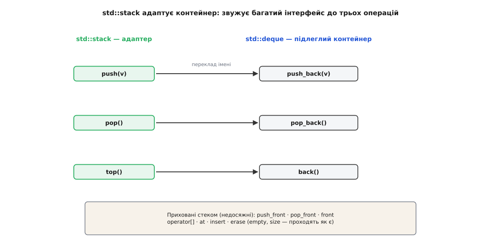

# Адаптер

<preknowlist>
- [Інтерфейс проти реалізації](topic:sf-apps/interface-vs-implementation) — різниця між тим, ЩО тип обіцяє назовні, і тим, ЯК він це робить усередині; увесь адаптер тримається на тому, що клієнт бачить лише інтерфейс.
- [Композиція над спадкуванням](topic:sf-apps/composition-inheritance) — чому чужий об'єкт частіше кладуть полем, ніж успадковують; вибір між двома формами адаптера впирається саме в це.
- [Принцип інверсії залежностей](topic:sf-apps/dependency-inversion) — код високого рівня залежить від абстракції, а не від конкретного класу; адаптер — те, чим підганяють невідповідну реалізацію під цю абстракцію.
- [Поліморфізм і динамічне зв'язування](topic:sf-lang/polymorphism) — як виклик через посилання-на-інтерфейс у рантаймі потрапляє в конкретний клас; без цього не зрозуміти, чому клієнт може взагалі не знати, що за ціллю ховається адаптер.
</preknowlist>

Дві системи, обидві справні, обидві потрібні одна одній — і не стикуються. Не тому, що котрась крива: кожна правильна у своєму світі. Просто одна кличе `charge(гривні, "UAH")`, а друга вміє лише `createCharge(центи)`, і напряму виклик не проходить — «вилка не лізе в розетку». Інженерна назва цього розриву чесніша за побутову: це **неузгодження імпедансів** (англ. *impedance mismatch*) — метафора, позичена з електротехніки, де так само поєднують два справні кола різного опору через погоджувальну ланку. [Звідки взялися і сам термін, і подвійне ім'я цього патерну](topic:sf-apps/adapter/hist-wrapper-impedance.md) — окрема розмова; тут важливе інше. **Адаптер (лат. *adaptare* — пристосовувати)** і є та погоджувальна ланка: об'єкт, що з одного боку виглядає так, як очікує твій код, а з іншого кличе чужий об'єкт так, як розуміє він.

Побутова версія цього — перехідник між розеткою й вилкою — пояснює *навіщо*, але ховає *як*. А саме в «як» лежить уся річ: адаптер робить **переклад**, а переклад має закони. Якщо ці закони не тримати в голові, адаптер тихо псує дані, ковтає чужі помилки або перетворюється на монстра, що намагається помирити непримиренне. Розберімо його механіку до дна: точну анатомію виклику, дві форми з їхніми внутрощами, третю — параметризовану — форму, що рідко згадується, і те, що адаптер мусить перекладати **поза** іменами методів — одиниці, помилки, саму парадигму спілкування. А тоді піднімемось від одного класу до масштабу цілої архітектури, де той самий візерунок тримає системи вкупі.

## Чотири учасники й хореографія одного виклику

Патерн — це ролі, не код. Ролей рівно чотири, і плутанина починається, коли одну з них не називають уголос.

- **Клієнт (Client)** — твій код, що хоче роботи. Він тримає посилання типу Ціль і кличе методи Цілі. Про існування адаптера й адаптованого він **не знає нічого** — і в цьому суть.
- **Ціль (Target)** — інтерфейс, який Клієнт очікує. Це контракт: `PaymentGateway` з методом `charge(amount, currency)`. Абстракція, від якої залежить Клієнт.
- **Адаптований (Adaptee)** — чужий об'єкт, що вміє роботу, але іншим інтерфейсом. `StripeClient` з методом `createCharge(...)`. Його не можна (чи не варто) міняти.
- **Адаптер (Adapter)** — клас, що **реалізує Ціль** і, отримавши виклик, виконує його руками Адаптованого, перекладаючи туди-назад.

Клієнта в цьому переліку часто забувають — а даремно, бо він задає весь сенс. Адаптер існує **не для того, щоб з'єднати Ціль з Адаптованим взагалі**, а для того, щоб конкретний Клієнт, який уміє говорити лише мовою Цілі, дістав роботу конкретного Адаптованого, не вивчаючи його мови.

Простеж один виклик по кроках — саме тут видно, що адаптер не має власної суті, лише посередництво:

1. Клієнт тримає змінну типу `PaymentGateway` і кличе `gateway.charge(499, "UAH")`. Для нього це виклик Цілі — жодного натяку на Stripe.
2. Завдяки [динамічному зв'язуванню](topic:sf-lang/polymorphism) виклик у рантаймі потрапляє в об'єкт, який реально стоїть за посиланням, — у наш `StripeAdapter`, бо той реалізує `PaymentGateway`.
3. Адаптер перекладає **вхід**: `499` гривень → найдрібніші одиниці, `"UAH"` → `"uah"` — і кличе `adaptee.createCharge({...})`.
4. Адаптований робить справжню роботу й повертає свій, «сирий», результат — `{ id: "ch_123" }`.
5. Адаптер перекладає **вихід** назад у терміни Цілі — витягує `id` — і повертає його Клієнтові як результат `charge`.


*Клієнт бачить лише Ціль. Виклик замикається в коло: униз через Адаптер до Адаптованого з перекладом входу, угору назад із перекладом виходу. Уся «робота» адаптера — два переклади на краях; посередині справжню справу робить чужий об'єкт.*

Два переклади на кроках 3 і 5 — це і є весь адаптер. Позначмо їх чесно: `f_in` перетворює аргументи Цілі на аргументи Адаптованого, `f_out` — результат Адаптованого на результат Цілі. Тоді будь-який метод об'єктного адаптера — це рівно `f_out(adaptee.метод(f_in(аргументи)))`. Усе інше в адаптері — від лукавого.

## Об'єктний адаптер під мікроскопом

Об'єктна форма — та, де адаптер **тримає адаптованого полем** і делегує (лат. *delegare* — доручати) йому виклики. Це майже завжди правильний вибір, тож розберімо, що конкретно в ньому відбувається — і де ховаються граничні випадки, які відрізняють іграшковий приклад від бойового коду.

Наївний приклад каже: «переклади гривні в центи множенням на 100». Це **хибно** для реального світу, і саме тут іграшка ламається. За стандартом ISO 4217 кожна валюта має свій показник дробовості: для більшості це 2 знаки (÷100), але єна (JPY) має **0** знаків — у неї немає дійсної копійки, тож 499 єн — це 499 найдрібніших одиниць, а не 49900; а динар Бахрейну (BHD) і динар Кувейту (KWD) мають **3** знаки — діляться на 1000. Адаптер, що всюди множить на 100, тихо завищить платіж у єнах у сто разів і занизить у динарах удесятеро. Тому правильний переклад входу — не константа, а функція від валюти:

:::tabs
```ts
class StripeError extends Error { constructor(public code: string) { super(code); } }
class PaymentError extends Error {}                 // ТВІЙ словник помилок

// Найдрібніших одиниць в одиниці валюти — за ISO 4217. Типово 100; винятки — окремо.
const MINOR: Record<string, number> = { JPY: 1, KRW: 1, BHD: 1000, KWD: 1000, OMR: 1000 };
const toMinor = (amount: number, cur: string) =>
  Math.round(amount * (MINOR[cur] ?? 100));         // не «×100», а за валютою

interface PaymentGateway {
  charge(amount: number, currency: string): Promise<string>;
}

class StripeAdapter implements PaymentGateway {
  constructor(private stripe: StripeClient) {}       // адаптований — ПОЛЕМ (композиція)

  async charge(amount: number, currency: string): Promise<string> {
    try {
      const res = await this.stripe.createCharge({
        amountInMinor: toMinor(amount, currency),    // f_in: одиниці за валютою
        currency: currency.toLowerCase(),            // f_in: "UAH" → "uah"
      });
      return res.id;                                 // f_out: { id } → id
    } catch (e) {
      if (e instanceof StripeError)                  // f_out і для ПОМИЛОК:
        throw new PaymentError(`платіж відхилено: ${e.code}`);  // чужа помилка → наша
      throw e;                                       // не наша — не ковтаємо, пускаємо далі
    }
  }
}
```
```py
class StripeError(Exception):
    def __init__(self, code: str): self.code = code

class PaymentError(Exception):                        # ТВІЙ словник помилок
    pass

# Найдрібніших одиниць в одиниці валюти — за ISO 4217. Типово 100; винятки — окремо.
MINOR = {"JPY": 1, "KRW": 1, "BHD": 1000, "KWD": 1000, "OMR": 1000}

def to_minor(amount: float, cur: str) -> int:
    return round(amount * MINOR.get(cur, 100))        # не «×100», а за валютою

class StripeAdapter:                                  # структурно реалізує PaymentGateway
    def __init__(self, stripe: "StripeClient"):
        self._stripe = stripe                         # адаптований — ПОЛЕМ (композиція)

    def charge(self, amount: float, currency: str) -> str:
        try:
            res = self._stripe.create_charge(
                amount_in_minor=to_minor(amount, currency),  # f_in: одиниці за валютою
                currency=currency.lower(),                   # f_in: "UAH" → "uah"
            )
            return res["id"]                          # f_out: {"id": ...} → id
        except StripeError as e:                      # f_out і для ПОМИЛОК:
            raise PaymentError(f"платіж відхилено: {e.code}")  # чужа помилка → наша
```
:::

Тут видно два переклади, яких у наївному переказі патерну немає, а в реальності без них адаптер діряве.

Перший — **одиниці й формат**. `f_in` — не косметика, а місце, де живе все специфічне знання про чужий світ: таблиця дробовості валют, регістр рядка, часові зони, кодування. Це знання **мусить бути тут і ніде більше**. Якщо `amount * 100` розповзеться по замовленнях, звітах і поверненнях, то день, коли додасться перша єна, стане днем полювання на розсипані множення по всій системі.

Другий — **помилки**. Адаптер, що перекладає аргументи, але пускає назовні `StripeError`, — недороблений: він проламав абстракцію. Клієнт залежить від Цілі `PaymentGateway`, а спіймав виняток із чужого SDK, про який не мав знати. Тому `f_out` перекладає **і словник помилок**: чужий `StripeError` стає твоїм `PaymentError`. Тонкість — не ковтати чуже без розбору: якщо прилетіло щось, чого адаптер не розпізнав, його треба **пустити далі**, а не глушити, бо інакше сховаєш справжню поломку.

> 🔧 **Навіщо це.** Адаптер — **єдине місце в системі, що знає дивацтва чужого об'єкта**. У цьому вся вигода й уся небезпека. Вигода: заміна Stripe на іншого провайдера — це заміна одного класу, а не хірургія по проєкту. Небезпека: половинчастий переклад (забув єну, пустив чужий виняток) не падає гучно — він **тихо бреше** ядру системи, яке довірилось інтерфейсу. Тому переклад адаптера має бути **повним у обидва боки**: усі одиниці, усі помилки, усі граничні значення. Півадаптера гірше за жоден.

Ще дві деталі об'єктної форми, які легко проґавити. **Хто володіє адаптованим** — адаптер створює `StripeClient` сам чи дістає готовим у конструктор? Якщо адаптований тримає ресурс (з'єднання, файл, сокет), хтось мусить його закрити — і треба вирішити, адаптер чи той, хто його дав. Найчистіше — коли адаптований приходить ззовні (впорснутий), тоді й закриває його той, хто створив; адаптер лише позичає. І **стан**: більшість адаптерів без стану — чиста функція виклику. Але щойно адаптер починає кешувати відповіді чи накопичувати щось між викликами, він набуває стану, якого не мала жодна зі сторін, — а разом зі станом приходять гонки й несвіжі дані у багатопотоковому коді. Стан в адаптері — сигнал зупинитися й перепитати себе, чи це ще адаптер.

## Класовий адаптер: що насправді дає множинне спадкування

Друга форма — **класовий адаптер** — успадковує від адаптованого (і заразом реалізує ціль), тож дістає його методи прямо, без поля-посередника. У мовах із множинним спадкуванням класів (передусім C++) це має точний і повчальний вигляд:

```cpp
#include <cctype>
#include <cmath>
#include <string>

static std::string toLower(std::string s) {
    for (char& c : s) c = (char)std::tolower((unsigned char)c);
    return s;
}

struct PaymentGateway {                       // Ціль
    virtual std::string charge(double amount, const std::string& cur) = 0;
    virtual ~PaymentGateway() = default;
};

class StripeClient {                          // Адаптований (чужий), із ВІРТУАЛЬНИМ методом
public:
    virtual std::string createCharge(long minor, const std::string& cur) {
        return "ch_live";                     // справжній виклик до Stripe
    }
    virtual ~StripeClient() = default;
};

// КЛАСОВИЙ адаптер: Ціль — ПУБЛІЧНО (is-a), Адаптований — ПРИВАТНО (implemented-in-terms-of)
class StripeAdapter : public PaymentGateway, private StripeClient {
public:
    std::string charge(double amount, const std::string& cur) override {
        return createCharge(std::lround(amount * 100), toLower(cur));  // метод предка — напряму
    }
private:
    // ЄДИНА справжня перевага класової форми: перевизначити поведінку адаптованого
    std::string createCharge(long minor, const std::string& cur) override {
        return "test_" + StripeClient::createCharge(minor, cur);       // напр., позначити тестовим
    }
};
```

Тут два неочевидні рішення несуть увесь сенс. **Ціль успадкована публічно, адаптований — приватно.** Це не примха: публічне спадкування означає «є різновидом» (`StripeAdapter` *є* `PaymentGateway` — так, клієнт має право бачити його як ціль). А приватне означає «реалізований через» — адаптований для адаптера лише матеріал, і зовнішній код **не сміє** прийняти адаптер за `StripeClient`. Якби адаптований успадкували публічно, адаптер випадково став би ще й `StripeClient` для всіх охочих — і абстракція, яку він мав захистити, потекла б у зворотний бік.

Друге — **перевизначення `createCharge`**. Ось те єдине, чого об'єктна форма дати не може: класовий адаптер сидить *усередині* адаптованого й може перехопити його власний віртуальний метод, вклинившись у поведінку. Коли треба не лише перекласти виклик, а й трохи змінити те, що робить адаптований, — класова форма це вміє. Це вузька, але реальна перевага.

А тепер її ціна, і вона важча. Класовий адаптер **прибитий до одного конкретного класу**: успадкувати можна лише від `StripeClient`, і жодного іншого — ні його підкласу через посилання, ні брата по інтерфейсу — він обслужити не здатен, бо зв'язок вирішується статично, на етапі компіляції. Об'єктний адаптер тут вільний: він тримає `StripeClient*`, а туди можна покласти будь-який підклас, підмінити на льоту, тримати кілька різних. Класовий цього не вміє **в принципі** — спадкування нерухоме. Додай сюди, що при спільному предку Цілі й Адаптованого виринає ромб множинного спадкування з його неоднозначностями, а більшість сучасних мов (Java, C#, TypeScript, Python) множинного спадкування класів взагалі не мають, — і стає ясно, чому **об'єктний адаптер стандартний, а класовий лишається радше можливістю** для C++ і для тих рідких випадків, коли справді треба перехопити віртуальний метод адаптованого.

> 🔧 **Навіщо це.** Різниця вилазить у тестах. Об'єктний адаптер тестується тривіально: підсунь у конструктор фейковий `StripeClient`, що нічого не шле, а лише запам'ятовує аргументи, — і перевір, що 499 єн пішли як 499, а не 49900, без жодного мережевого виклику. Класовий так не перевіриш: адаптований вшитий у сам адаптер спадкуванням, підмінити його на фейк нема як. Тестованість — ще одна причина, чому композиція тут майже завжди виграє.

## Параметризований адаптер: коли класів забагато

Є й третя форма, яку GoF називає **параметризованим (pluggable) адаптером**, і вона рятує, коли адаптованих багато, а різниця між ними дрібна. Писати окремий клас-адаптер на кожен чужий об'єкт — марнотратно, якщо весь адаптер зводиться до пари рядків перекладу. Тоді сам **переклад передають як параметр** — функцією-замиканням, а не підкласом:

```ts
// Один адаптер на всіх: «форму» перекладу впорскуємо замиканням.
class PluggableGateway<T> implements PaymentGateway {
  constructor(
    private adaptee: T,
    private doCharge: (a: T, amount: number, currency: string) => Promise<string>,
  ) {}
  charge(amount: number, currency: string): Promise<string> {
    return this.doCharge(this.adaptee, amount, currency);   // уся специфіка — у замиканні
  }
}

const stripeGw = new PluggableGateway(
  new StripeClient(),
  (s, amount, cur) =>
    s.createCharge({ amountInMinor: toMinor(amount, cur), currency: cur.toLowerCase() })
     .then(r => r.id),                                       // переклад — тут, без окремого класу
);
```

Замість ієрархії класів-адаптерів — один узагальнений адаптер і по замиканню на кожного адаптованого. Виграш очевидний, коли адаптованих десятки, а кожен потребує двох рядків. Плата — слабший тип-контроль: компілятор уже не стежить, що переклад для `StripeClient` справді бере `StripeClient`, бо все сховане за функцією. Тому параметризовану форму беруть саме там, де адаптерів багато й вони прості; для одного важливого інтеграційного шва звичайний клас-адаптер чесніший і надійніший.

## Двобічний адаптер і межа сумісності інтерфейсів

Дотепер переклад був однобічним: Клієнт кличе — адаптер перекладає в бік Адаптованого. Але буває, що **дві підсистеми — клієнти одна одної**: перша подекуди кличе другу, а друга подекуди першу, і кожна хоче бачити іншу у **своєму** інтерфейсі. Тоді роблять **двобічний адаптер** — один клас реалізує **обидва** інтерфейси й перекладає в той бік, з якого прийшов виклик. Стара підсистема знає `LegacyShape` з методом `bounds()`, нова — `Shape` з `getBoundingBox()`; двобічний адаптер реалізує і те, і те, тож старий код бачить у ньому старе, новий — нове.

Глибша тонкість тут — **коли двобічний адаптер узагалі можливий**. Один клас може реалізувати два інтерфейси, лише поки їхні набори методів не конфліктують. Якщо обидва оголошують метод з тим самим іменем і тим самим підписом, але **різним змістом**, — у Java чи C# єдиний клас це не потягне: два різні тіла під один підпис нікуди не покласти. C++ викрутиться явним уточненням через ім'я базового класу, але й там це край зручності. Тому двобічний адаптер беруть лише коли двобічність справді в задачі, а інтерфейси не б'ються іменами; «про запас» його не роблять — клас, що тлумачить обидва напрями, помітно складніший за звичайний, і кожен зайвий такий адаптер — це вузол, у якому легше заплутатися.

## За межами імен: що ще мусить перекласти адаптер

Найпоширеніше зведення патерну — «адаптер міняє імена методів». Це правда рівно настільки, наскільки «переклад — це заміна слів». Насправді розрив між інтерфейсами буває значно глибший за іменування, і зрілий адаптер долає всі його рівні.

**Одиниці й формат даних** — найлегший рівень, і його вже видно на прикладі з валютами: центи проти гривень, `"UAH"` проти `"uah"`, мілісекунди проти секунд, UTC проти локального часу. Тут переклад — арифметика й таблиці відповідностей.

**Помилки** — рівень, який забувають найчастіше. Чужий об'єкт кидає чужі винятки, повертає чужі коди помилок, має власні уявлення про те, що таке «збій». Адаптер, який не переклав це у словник Цілі, лишив діру, крізь яку абстракція тече. Переклад помилок — така сама частина `f_out`, як і переклад результату.

**Парадигма спілкування** — найглибший рівень. Чужий об'єкт може віддавати результат **колбеком**, а твій код чекає на **проміс**; може **штовхати** події (push), а споживач хоче **тягнути** їх на вимогу (pull); може блокувати потік, а виклик мусить бути асинхронним. Це вже не заміна слів — це узгодження двох способів рухати керування в часі, і адаптер тут перетворює одну модель на іншу. Класичний приклад — обгортка старого API на колбеках у сучасний `async/await`, де адаптер мусить іще й правильно провести помилку та скасування крізь межу. [Це варте окремого, повністю робочого розбору](topic:sf-apps/adapter/proj-callback-to-async.md): як загорнути подієвий, колбековий інтерфейс у проміс, не загубивши ні помилок, ні можливості скасувати операцію, і які пастки чигають на межі синхронного й асинхронного світів.

**Моделі перебору** — окремий, дуже наочний випадок парадигмального розриву. У Java старий інтерфейс `Enumeration` (з методами `hasMoreElements`/`nextElement`) і новий `Iterator` (`hasNext`/`next`) роблять те саме — перебирають елементи — але кличуться інакше й належать різним епохам. Стандартна бібліотека містить готові адаптери в обидва боки: `Collections.enumeration(колекція)` показує сучасну колекцію як старий `Enumeration`, а метод `Enumeration.asIterator()` показує старий перелічувач як сучасний `Iterator`. Той самий візерунок, той самий адаптер — просто предмет перекладу тут не дані й не помилки, а **сам протокол перебору**. Ширше про [ітератор як інтерфейс перебору](topic:sf-apps/iterator) — окремо; тут досить бачити, що адаптер незворушно долає й цей рівень.

## Контейнерні адаптери: коли адаптер — це вся структура даних

Найкрасивіший доказ, що адаптер — не косметика, дає стандартна бібліотека C++. Там `std::stack`, `std::queue` і `std::priority_queue` офіційно звуться **контейнерними адаптерами**, і вони перевертають звичне уявлення про патерн: адаптер тут не розширює й не додає — він **звужує**.

Стек не має власного сховища. Він бере **підлеглий контейнер** (за замовчуванням `std::deque`, але можна `std::vector` чи `std::list`) і показує назовні лише три операції — покласти, зняти, глянути верх, — ховаючи все інше, що вміє контейнер:

```cpp
#include <stack>
#include <vector>

std::stack<int, std::vector<int>> s;   // адаптуємо vector замість типового deque
s.push(1);        // → викликає vector::push_back
s.push(2);
int t = s.top();  // → vector::back
s.pop();          // → vector::pop_back
// s[0]? s.insert(...)? s.front()? — НЕДОСЯЖНІ: стек їх не показує
```

Механізм видно, якщо зробити такий адаптер руками — це буквально об'єктний адаптер, що звужує інтерфейс:

```cpp
template <class C>
class Stack {                 // адаптер: будь-який контейнер C → рівно три LIFO-операції
    C c;                      // підлеглий контейнер ПОЛЕМ (композиція)
public:
    void push(typename C::value_type v) { c.push_back(v); }   // переклад імені
    void pop()                          { c.pop_back();  }
    typename C::value_type& top()       { return c.back(); }
    bool empty() const                  { return c.empty(); }
};
```

`std::deque` вміє класти й знімати з обох кінців, брати за індексом, вставляти всередину. Стек-адаптер бере цей багатий інтерфейс і **прибирає з нього все, крім дисципліни LIFO**. І це не збіднення, а **гарантія**: маючи `Stack`, ти вже фізично не можеш випадково полізти в середину чи зняти не з того кінця — компілятор не дасть, бо таких методів просто немає.



*Контейнерний адаптер нічого не додає — він ЗВУЖУЄ багатий інтерфейс підлеглого контейнера до кількох операцій. Приховане стає недосяжним, і дисципліна LIFO з обіцянки в коментарях перетворюється на властивість, яку неможливо порушити.*

> 🔧 **Навіщо це.** Звуження інтерфейсу — це безпека, вбудована в типи. Контейнерний адаптер робить **неможливими** операції, що порушили б інваріант (лат. *invariabilis* — незмінний) структури. Той самий прийом працює будь-де: якщо чужий об'єкт уміє забагато, а тобі потрібні строго три його дії у строгому порядку, адаптер, що показує лише ці три, перетворює дисципліну з обіцянки в коментарях на властивість, яку неможливо порушити. Найдешевша перевірка — та, якої компілятор навіть не дає написати.

## Адаптер у масштабі архітектури

Найважливіше про адаптер — що це **фрактал**: той самий візерунок працює і на одному класі, і на цілій підсистемі. Піднявшись від методу до архітектури, ти впізнаєш його знову — просто ролі грають уже не об'єкти, а шари.

У **гексагональній архітектурі** ядро застосунку (доменна логіка) не залежить від зовнішнього світу напряму. Воно оголошує **порти** — інтерфейси-цілі: «мені потрібне сховище замовлень», «мені потрібно надіслати листа». А конкретні технології — база даних, поштовий сервіс, черга — під'єднуються **адаптерами**, кожен з яких реалізує порт і перекладає його виклики в мову своєї технології. Ядро говорить лише мовою портів; уся специфіка PostgreSQL чи Kafka замкнена в адаптерах на краю. Це той самий адаптер, лише Ціль тепер зветься портом, а Клієнт — доменом; детально про [порти й адаптери як спосіб організувати всю систему](topic:sf-apps/hexagonal-architecture) — окремо, але серце там — рівно наш патерн, розтягнутий на масштаб застосунку.

Ще на крок ширше стоїть **антикорупційний шар** (з підходу предметно-орієнтованого проєктування). Коли твоя система інтегрується з чужою — застарілою чи просто чужою за моделлю світу, — є спокуса впустити її поняття всередину: узяти її назви, її структури, її дивну логіку й розкидати по своєму коду. За півроку чужа модель поглине твою. Антикорупційний шар — це **адаптер завбільшки з підсистему**: цілий прошарок, чия єдина робота — перекладати між твоєю моделлю й чужою так, щоб жодне чуже поняття не просочилося за межу. Один адаптер боронить один виклик; [антикорупційний шар](topic:sf-apps/anti-corruption-layer) боронить цілу модель від чужого впливу. Масштаб інший — намір той самий: тримати чуже назовні, за перекладачем.

Ця фрактальність — не красива метафора, а робочий інструмент проєктування: побачивши розрив, питаєш не «який тут патерн», а «на якому масштабі його ставити» — на одному методі, на порті підсистеми чи на межі цілих обмежених контекстів.

## Сусіди на глибині: не лише декоратор, фасад і проксі

Адаптер структурно схожий на кілька інших «обгорток» — об'єкт усередині об'єкта, — і різнить їх не будова, а **намір**. Побутовий фільтр звучить так: питай, **що ти робиш з інтерфейсом**.

**Декоратор** ([декоратор](topic:sf-apps/decorator)) лишає інтерфейс той самий і **додає поведінку**: загорнув потік у буферизований — вигляд той самий, з'явилося кешування. Той самий роз'єм, більше можливостей.

**Проксі** ([проксі](topic:sf-apps/proxy)) теж лишає інтерфейс той самий і підставляє замісника з тим самим виглядом, щоб **керувати доступом** — кешувати, відкладати створення, перевіряти права. Той самий вигляд, інша логіка навколо доступу.

**Фасад** ([фасад](topic:sf-apps/facade)) вигадує **новий простий** інтерфейс над складним нутром із багатьох класів — щоб було зручно. Адаптер натомість підганяється під **уже наперед заданий** інтерфейс, який мусить збігтися точно. Фасад обслуговує зручність і гортає багато об'єктів; адаптер обслуговує сумісність і типово гортає один.

Дві пари сусідів, яких базовий погляд часто пропускає, найцікавіші саме на глибині.

**Адаптер проти мосту.** Обидва структурні, обидва відділяють інтерфейс від реалізації — але в протилежні моменти часу. Міст проєктують **заздалегідь**: ти сам, з чистого аркуша, розділяєш абстракцію й реалізацію, щоб вони мінялися незалежно, — обидва боки твої й спроєктовані пасувати. Адаптер накладають **постфактум**: два боки вже існують, уже несумісні, уже незмінні, і ти миреш те, що спроєктували нарізно. Міст — про передбачену свободу; адаптер — про непередбачену зустріч. Про [міст та решту структурних патернів оглядово](topic:sf-apps/gof-structural-microcatalog) — окремо; тут важлива саме ця вісь часу.

**Адаптер проти посередника.** [Посередник](topic:sf-apps/mediator) розв'язує зв'язки «багато-до-багатьох»: замість того щоб десяток об'єктів кликали одне одного навпрост, вони кличуть один центр, що координує. Адаптер — завжди рівно один переклад «один-до-одного» між двома сторонами. Плутають їх, бо обидва «стоять посередині», але посередник **координує багатьох**, а адаптер **перекладає між двома**.

І окремо — слово **«обгортка» (wrapper)**. Ним звуть і адаптер, і декоратор, і проксі; GoF прямо дає «Wrapper» другою назвою і для адаптера, і для декоратора. Тому саме́ слово «обгортка» **не каже нічого** про намір — воно описує будову, а не мету. Побачив «wrapper» — питай далі: що він робить з інтерфейсом? Міняє форму — адаптер. Додає поведінку — декоратор. Керує доступом — проксі.

## Коли переклад вірний: коректність адаптера

Раз адаптер робить переклад, доречно спитати строго: **коли переклад правильний**? Інтуїція «ну, він же перекладає туди-назад» ховає точну умову, і без неї не видно, чому деякі адаптери приречені текти.

Умова така: адаптер вірний, коли зробити роботу через нього — те саме, що зробити її «в термінах Цілі» безпосередньо. Формально це замкнений квадрат: узяти аргументи Цілі, перекласти вниз (`f_in`), виконати Адаптованого, перекласти результат угору (`f_out`) — і дістати рівно те, що обіцяє семантика Цілі. Якщо квадрат замикається, адаптер чесний; якщо ні — він десь бреше.


*Адаптер вірний ⟺ квадрат замикається: шлях «униз через Адаптованого й угору» дає те саме, що прямий шлях «семантика Цілі». Коли f_in втрачає інформацію, потрібну Адаптованому, чи Ціль уміє висловити те, чого Адаптований не тямить, — квадрат розмикається, і адаптер тече.*

Звідси одразу видно, де адаптери ламаються. Якщо `f_in` **втрачає інформацію** — Ціль передала менше, ніж Адаптованому насправді треба, — квадрат не замкнути жодним `f_out`; переклад просто неможливий без домислювання. І навпаки: якщо Ціль уміє висловити те, чого Адаптований не тямить, частина запитів не має куди відобразитись. Ці два випадки — точний критерій, коли адаптер перестає бути адаптером і потребує повноцінного шару з власною логікою. Той самий апарат пояснює, чому **адаптери гарно складаються в ланцюг**: адаптер від A до B, потім від B до C дають адаптер від A до C, поки квадрати замикаються. [Строгий розбір цієї коректності — через функцію абстракції та умову замкненого квадрата](topic:sf-apps/adapter/math-adapter-correctness.md): що таке вірний переклад мовою відношень між станами, чому втрата інформації в `f_in` робить адаптер принципово діряве, і як з двох вірних адаптерів складається третій.

Ця сама умова, до речі, — не що інше, як [принцип підстановки Лісков](topic:sf-apps/liskov-substitution) у дії: адаптер, реалізуючи Ціль, зобов'язаний **чесно виконувати її контракт**, бо Клієнт підставляє його замість Цілі наосліп. Адаптер, що «майже» тримає контракт (округлює не так, губить помилку, повертає щось трохи не те), — це порушена підстановка, і зламається воно в найгіршу мить.

## Ціна, межі й гниття

Адаптер дешевий і чесний, коли розрив справжній. Але й у нього є ціна, і є способи його зіпсувати.

**Непрямість коштує.** Кожен виклик через адаптер — це зайвий кадр стека, віртуальна диспетчеризація, іноді нове виділення об'єкта під перекладені аргументи. На звичайному шляху це непомітно. На **гарячому** — у циклі на мільйони ітерацій — зайвий шар починає муляти. У C++ це лікують шаблонним адаптером, який компілятор здатен цілком вбудувати (контейнерні адаптери саме такі — вони, по суті, безкоштовні). У мовах із віртуальними викликами повністю прибрати накладні витрати не вийде — тому в дуже гарячому коді іноді свідомо не ставлять адаптер, а домовляються про єдиний інтерфейс. Але це рідкісний виняток: у переважній більшості коду ціна адаптера мізерна проти вигоди від ізоляції.

**Стан робить адаптер небезпечним.** Адаптер без стану — чиста функція виклику, з ним нічого не станеться. Але щойно він кешує чи накопичує щось між викликами, він отримує стан, якого не мала жодна сторона, — а з ним у багатопотоковому оточенні приходять гонки й несвіжі дані. Баг тоді живе не в жодній зі сторін, а **в перекладачі між ними**, де його шукають в останню чергу.

**Адаптер, що росте, — це вже не адаптер.** Найглибша межа патерну — коли розрив не в іменах, а в **самій моделі світу**. Адаптер чудово знімає косметичну невідповідність: інші імена, інші одиниці, інша форма аргументів — квадрат легко замикається. Але коли дві сторони по-різному **мислять** предмет — в однієї платіж атомарний, а в іншої це багатокрокова сага з проміжними станами, — переклад «метод на метод» цього не покриє. `f_in` мусив би домислювати те, чого йому не дали, і адаптер починає обростати логікою, станом, гілками рішень. Це вже [божественний об'єкт](topic:sf-apps/anti-patterns) під личиною адаптера. Сигнал однозначний: коли квадрат перестає замикатися просто, потрібен не адаптер, а справжній шар узгодження моделей — той самий [антикорупційний шар](topic:sf-apps/anti-corruption-layer), спроєктований як окрема відповідальність.

**Найчастіша ж помилка — зворотна: адаптер там, де його не треба.** Якщо **обидва боки твої** й вільно змінювані — не плоди перекладач, а зведи інтерфейси до згоди в корені: назви методи однаково й прибери розрив. Постійний прошарок-перекладач між двома власними класами додає рівень непрямості ні за що. Адаптер виправданий рівно тоді, коли один бік чужий чи негнучкий; можеш поправити обидва — поправ обидва.

І остання, тиха вигода правильно поставленого адаптера — **єдине горло для змін**. Коли чужий SDK оновиться й зламає підпис, коли Stripe заміниться на іншого провайдера, коли додасться нова валюта з дивною дробовістю — усе це правиться в **одному класі**, бо весь бруд перекладу зведений туди. Це те саме горло, крізь яке зручно й тестувати: підсунув фейкового адаптованого — і перевірив кожен граничний випадок перекладу без мережі й без бази. Адаптер бере на себе всю незручність зустрічі двох світів, щоб решта коду про ту зустріч навіть не здогадувалась. За справжнього розриву це окупається сторицею; коли ж розриву нема — нема й потреби в перехіднику.
