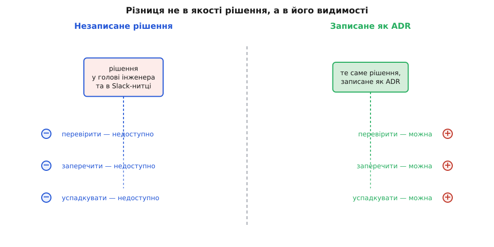
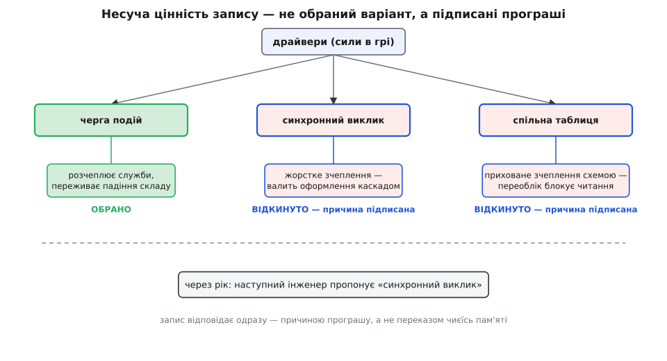
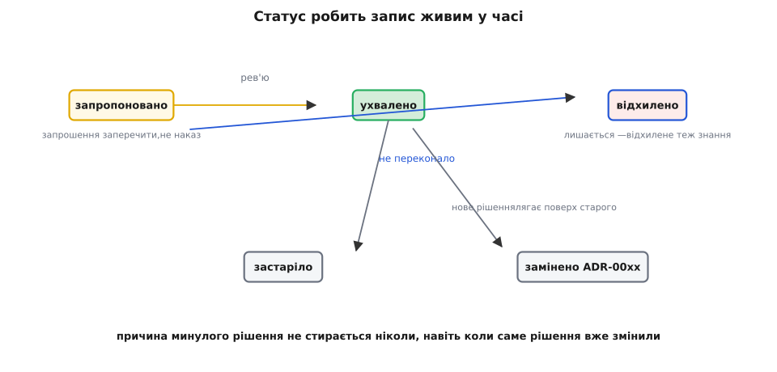

# Запис архітектурного рішення (ADR)

<preknowlist>
- [Архітектурні драйвери](topic:sf-apps/architectural-drivers) — вимоги, обмеження й ризики, що тиснуть на систему; саме вони стають «силами» в контексті рішення.
- [Trade-off-аналіз](topic:sf-apps/tradeoff-analysis) — кожне рішення щось віддає за щось; запис фіксує цей обмін і його ціну.
- [Зворотні й незворотні рішення](topic:sf-apps/reversible-irreversible-decisions) — вартість відкату вирішує, чи взагалі варто заводити запис.
</preknowlist>

Два інженери тиждень сперечалися, як службі замовлень говорити зі службою складу — синхронним викликом чи через чергу подій. Один варіант переміг, його закодували, реліз поїхав. Через рік до команди приходить третя людина, дивиться на асинхронний код, який на перший погляд ускладнює просту річ, і питає: «Чому не викликати склад напряму?» І тут з'ясовується, що відповіді немає ніде. Суперечка жила у Slack-нитці, яку давно змило, і в головах двох людей, з яких одна вже звільнилася. Рішення було справжнє, продумане, вистраждане — і при цьому **невидиме**. А невидиме рішення не можна ні перевірити, ні заперечити, ні успадкувати. Суперечка починається з нуля.

Запис архітектурного рішення (англ. *architecture decision record*, ADR; *record* — «запис») — це дія, що робить одне рішення видимим. Не код, який з нього виріс, не діаграма системи, а **міркування, що це рішення породило**, зафіксоване як один короткий документ у мить, коли його ще пам'ятали. Уся дисципліна архітектора — драйвери, перебрані варіанти, зважений компроміс — до запису живе лише в чиїйсь голові. Запис — місце, де вона нарешті лягає на папір і стає спільною.


*Різниця не в якості рішення, а в його видимості. Поки рішення живе лише в пам'яті, воно недоступне для перевірки й спадкування; запис перетворює приватну думку на спільну річ, з якою можна працювати.*

## Записати — значить справді вирішити

Тут ховається неочевидне: запис — не бюрократія після рішення, а інструмент самого рішення. Карикатурист Дік Ґіндон (Dick Guindon), якого любить цитувати інформатик Леслі Лемпорт (Leslie Lamport), лишив фразу: «Письмо — це спосіб природи показати, наскільки неохайне твоє мислення».

Порожні розділи запису — це допит. «Які варіанти ти розглянув?» «Що це рішення коштує?» Якщо на них немає відповіді, то рішення, найпевніше, і не ухвалювали — просто вхопилися за першу ідею, що спала на думку, і назвали це вибором. Спроба записати причину — перша чесна перевірка, чи причина взагалі є. Часто саме за письмом виявляється, що «очевидний» вибір тримався на припущенні, якого ніхто не перевіряв, або що відкинутий варіант насправді кращий. Запис змушує думку, розмиту в розмовах, згорнутися в одне твердження, яке або витримує погляд, або розсипається.

> 🔧 **Навіщо це.** Найдешевший спосіб зловити недодумане рішення — спробувати написати розділ «розглянуті варіанти» *до* того, як почнеш кодити. Пишеться легко й чесно — рішення зріле. Рука зупиняється на «а що ми, власне, ще розглядали?» — ти щойно впіймав рішення, якого не було. Коштує п'ять хвилин, рятує місяці.

## Позиції: найцінніше — це програші

Класична, найкоротша форма запису, яку дав Майкл Найгард (Michael Nygard), має три несучі розділи: **контекст** (сили в грі), **рішення** (що обрали) і **наслідки** (що з того випливло). Але для ремесла архітектора найважливіше часто ховається в розділі, якого в мінімальній формі немає, — у **переліку відкинутих варіантів**.

Джефф Тайрі й Арт Акерман (Jeff Tyree, Art Akerman) у статті IEEE Software 2005 року назвали цей розділ «позиції» (*positions*) — усі життєздатні варіанти, що були на столі. Пізніший популярний шаблон MADR називає його «розглянуті варіанти» (*considered options*) і просить до кожного виписати «добре, бо…» й «погано, бо…». Чому це осердя? Бо код показує лише переможця. Наступний інженер бачить асинхронну чергу — і не бачить, що синхронний виклик уже зважували й відкинули через те, що він жорстко зчіплював дві служби й валив їх каскадом. Без запису він запропонує рівно той відкинутий варіант, і команда пройде те саме коло суперечки вдруге. Із записом відповідь на «а чому не отак?» лежить за один клік — із причиною, а не з переказом чиєїсь пам'яті. (Як народилася ця форма та її пізніші шаблони — [історія ADR](topic:sf-apps/architecture-decision-records/hist-adr-origin.md).)

Щоб перелік був чесним, варіанти порівнюють не «на смак», а за спільними мірилами — тими самими вимірними [сценаріями якісних атрибутів](topic:sf-apps/attribute-scenarios), що задають, скільки система має витримувати навантаження, як швидко відновлюватися, як легко змінюватися. Тоді порівняння виглядає як таблиця, де кожен варіант дістає оцінку за кожним мірилом:

```
критерій               вага  синхр.виклик  черга подій  спільна табл.
зчеплення служб         ×3         2             5             1
затримка                ×2         5             3             4
проста експлуатація     ×2         5             2             4
стійкість до збою       ×3         2             5             2
──────────────────────────────────────────────────────────────────
разом (зважено)                    32            40            25
```

Така таблиця корисна, поки її не сприймають буквально: числа тут — спосіб зробити думку явною, а не виміряти істину. [Перетворити перелік варіантів на невеликий інструмент зі зваженими оцінками](topic:sf-apps/adr/proj-decision-matrix.md) — і водночас побачити, як легко ранжування перевертається від дрібної зміни ваг, — винесено окремо. Головне лишається просте: записаний програш економить наступну суперечку.


*Несуча цінність запису — не в обраному варіанті, який і так видно з коду, а в перелічених програшах. Саме вони гасять суперечку, що інакше повторювалася б щоразу з новою людиною.*

## Живий приклад запису

**Рішення: як службі замовлень отримувати наявність зі служби складу.** Ось як виглядає сам запис — стисло, але з усіма несучими розділами:

```
# 0014. Наявність зі складу — через події, не синхронним викликом

Статус:  Ухвалено · дата 2026-05-10

## Контекст (сили)
- Пік замовлень на розпродажі: сплеск ×20 за хвилини.
- Служба складу періодично «лягає» на переоблік (кілька разів на день).
- Вимога: оформлення замовлення НЕ має падати, коли склад недоступний.
- Дані про наявність можуть відставати на секунди — бізнес це приймає.

## Позиції (що розглянули)
- Синхронний HTTP-виклик складу з оформлення.
  Погано: падіння складу валить оформлення каскадом; жорстке зчеплення.
- Спільна таблиця наявності в одній БД на дві служби.
  Погано: ховане зчеплення схемою; переоблік блокує читання.
- Асинхронні події наявності + локальна копія в службі замовлень.  ← обрано
  Добре: оформлення переживає падіння складу; служби розчеплені.

## Рішення
Служба складу публікує події зміни наявності. Служба замовлень тримає
локальну копію й читає з неї. Синхронних викликів складу немає.

## Наслідки
+ Оформлення стійке до падіння складу; пік розпродажу його не валить.
+ Служби можна викочувати й масштабувати незалежно.
− З'являється відставання: копія відстає на секунди (прийнятно).
− Треба обробляти дублікати подій і відновлення після втрати черги.
```

Уся вага цього запису — не в рядку «Рішення», який і так видно з коду, а в розділі «Позиції». Саме він відповідає майбутньому інженерові, який неодмінно спитає, чому склад не викликають напряму: тому що це вже зважили, і синхронний виклик програв стійкості. І в чесному розділі «Наслідки», де мінуси не сховані: [обмін](topic:sf-apps/tradeoff-analysis) названо прямо — за стійкість заплачено відставанням даних і мороком із дублікатами. Запис, у якому самі плюси, — це реклама рішення, а не його слід.

## Статус: запис як пропозиція, а не наказ

Один запис живе в часі, і його стан показує поле статусу. Свіжий запис має статус **«запропоновано»** — і це не формальність, а суть: пропозиція, а не наказ. Поки рішення «запропоновано», воно винесене на [рев'ю](topic:sf-apps/architecture-review) — запрошення тим, кого воно зачепить, заперечити, поки воно ще не затверділо в коді. У цьому вся різниця між рішенням, яке одна людина ухвалила мовчки, і рішенням, яке [стейкхолдери](topic:sf-apps/stakeholders) мали шанс оскаржити, поки не стало пізно. Пройшовши рев'ю, запис стає **«ухвалено»**; не переконавши — **«відхилено»**, і теж лишається, бо відхилений варіант — теж знання.

Рішення не вічні. Коли нове рішення лягає поверх старого, старому міняють статус на **«замінено ADR-0021»**, а не стирають: причина, чому свого часу вирішили саме так, не застаріває ніколи, навіть коли саме рішення вже змінили. Як записи накопичуються шарами в часі, живуть поруч із кодом і зшиваються інструментами — це вже про [журнал рішень як живий артефакт](topic:sf-apps/architecture-decision-records), окрему тему; тут важливий один запис і його життєвий цикл.


*Статус робить запис живим у часі. «Запропоновано» — це відкрите вікно для заперечень; після затвердження запис не зникає навіть застарілим, бо стирати причину минулого рішення немає сенсу.*

## Що заводити в запис, а що ні

Спокуса записувати кожен рух вбиває практику певніше за лінь: команда тоне в записах на дрібниці й перестає писати щиро. Мірило просте — вартість відкату. Рішення, яке дорого й боляче скасувати, [незворотні «однобічні двері»](topic:sf-apps/reversible-irreversible-decisions), причина яких неочевидна з коду, — пишемо. Дешевий, тихий, оборотний вибір — лишаємо коду й пам'яті. Запис вартий рівно тих рішень, за незнання яких хтось через рік заплатить болем.

Тоді ADR перестає бути обрядом і стає тим, чим має бути: найдешевшою страховкою від найдорожчої втрати — втрати причин. Але глибша його користь навіть не в пам'яті. Записати рішення — значить вийняти його з чиєїсь голови й зробити спільною річчю, яку можна перевірити, оскаржити й успадкувати. Справжній продукт архітектора — не діаграма, а слід «чому», по якому наступна людина зможе вирішувати не гірше за тебе. А то й краще.
