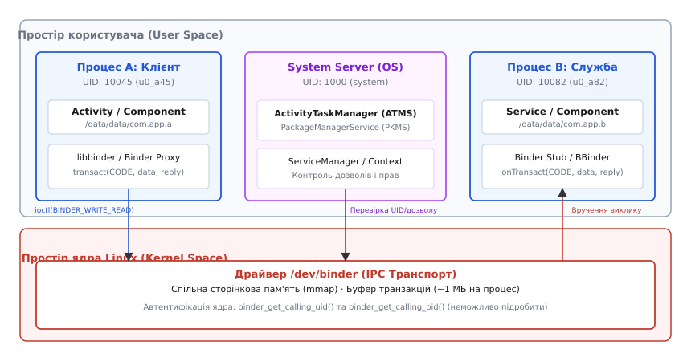
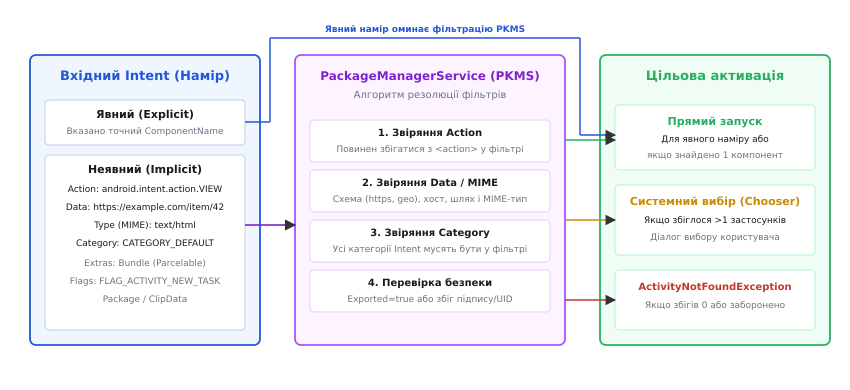
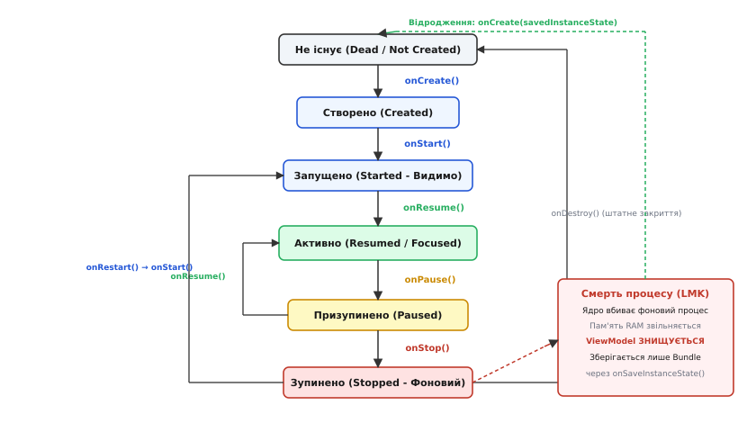

# Модель застосунку Android: маніфест, дозволи, наміри

<preknowlist>
- [Процеси й потоки](topic:sf-os/process-vs-thread) — кожен процес має власний ізольований адресний простір, таблицю дескрипторів та пам'ять.
- [Системний виклик](topic:hw-arch/system-call) — єдиний шлях переходу в простір ядра для виконання захищених операцій і міжпроцесного обміну.
- [Найменші привілеї й deny-by-default](topic:sf-security/least-privilege) — надання кожному компоненту суто мінімального набору прав із забороною всього іншого за замовчуванням.
- [Архітектура десктопного застосунку: шари, потоки, стан](topic:sf-apps/desktop-app-architecture) — класична модель монолітного процесу з єдиною точкою входу main() і власним життєвим циклом.
- [Розвантаження потоку інтерфейсу](topic:sf-apps/ui-thread-offloading) — критична необхідність винесення блокуючих операцій з головного UI-потоку задля уникнення зависань.
</preknowlist>

У класичних настільних операційних системах програма є монолітним двійковим файлом із єдиною точкою входу `main()`. Застосунок запускається за прямою вказівкою користувача, виділяє пам'ять, відкриває власні вікна, породжує внутрішні потоки й одноосібно володіє своїм життєвим циклом аж до явного закриття. Якщо користувач згортає вікно, процес продовжує безперешкодно виконуватися у фоні, споживаючи оперативну пам'ять і процесорний час.

На мобільному пристрої з жорсткими обмеженнями оперативної пам'яті (від 64–192 МБ на перших смартфонах до кількох гігабайтів на сучасних) та живленням від акумулятора така настільна модель зазнає краху. Мобільний накопичувач на базі флешпам'яті не дозволяє організувати безлімітний файл підкачки (swap) через високу затримку доступу та швидку деградацію комірок від постійного перезапису. Кілька фонових монолітних процесів миттєво вичерпують фізичну пам'ять.

Водночас мобільний користувацький сценарій складається з безперервного ланцюжка коротких перемикань між різними програмами. Користувач месенджера натискає кнопку додавання фотографії й очікує відкриття камери, або тисне на посилання й переходить у браузер. Щоб це працювало надійно, месенджер не повинен містити в собі драйвер камери чи рушій вебпереглядача, а операційна система не може дозволити сторонньому коду запускатися без суворої перевірки прав.

Виходом із цієї суперечності стало повне розірвання зв'язку між поняттям «застосунок» та поняттям «процес ОС». В Android застосунок перестав бути монолітним виконуваним файлом. Він став набором слабозв'язаних **компонентів**, які операційна система активує за потреби через асинхронну шину повідомлень і може безжально вивантажувати з пам'яті, коли ресурси вичерпано.

## Чому процес перестав бути синонімом застосунку

У моделі Android процес — це не програма, а лише тимчасовий контейнер ресурсів, який ядро ОС створює на вимогу й знищує без попередження розробника. Жоден компонент застосунку не володіє процесом монопольно. Якщо користувач відкриває екран оплати в інтернет-магазині, а потім перемикається у банківський застосунок для підтвердження транзакції, операційна система може повністю вбити фоновий процес магазину заради звільнення пам'яті для банку. Для користувача ця операція залишається непомітною: коли він повернеться назад, система миттєво створить новий процес і відродить стан потрібного екрана з серіалізованого знімка.

Таке архітектурне рішення вимагало побудови принципово нової системи взаємодії між ізольованими компонентами. Детально про те, як інженери Danger Inc. та Google відкинули настільну парадигму POSIX заради мобільної багатозадачності, читайте у вставці 📜 [Від Danger Hiptop до Android: народження компонентної моделі](topic:sf-apps/android-app-model/hist-android-component-model.md).

## Декларативний контракт: AndroidManifest.xml

Оскільки застосунок складається з окремих автономних частин, операційна система повинна заздалегідь знати структуру програми, не запускаючи її байткод на виконання. Цю роль виконує файл `AndroidManifest.xml` — декларативний контракт пакета.

```
┌─────────────────────────────────────────────────────────────┐
│                    AndroidManifest.xml                      │
│                                                             │
│  ┌───────────────────────┐     ┌─────────────────────────┐  │
│  │ <uses-permission>     │     │ <permission>            │  │
│  │ Запити прав у системи │     │ Оголошення власних прав │  │
│  └───────────────────────┘     └─────────────────────────┘  │
│  ┌───────────────────────────────────────────────────────┐  │
│  │ <application>                                         │  │
│  │   ┌─────────────┐ ┌─────────────┐ ┌────────────────┐  │  │
│  │   │ <activity>  │ │  <service>  │ │   <receiver>   │  │  │
│  │   └─────────────┘ └─────────────┘ └────────────────┘  │  │
│  │   ┌─────────────────────────────┐                     │  │
│  │   │         <provider>          │                     │  │
│  │   └─────────────────────────────┘                     │  │
│  └───────────────────────────────────────────────────────┘  │
└─────────────────────────────────────────────────────────────┘
```

Під час встановлення пакета системна служба `PackageManagerService` (PKMS) парсить скомпільований бінарний маніфест (`axml`) і реєструє метадані в системних таблицях:
1. **Точки входу:** повний перелік усіх доступних компонентів із їхніми прапорцями експорту (`android:exported`).
2. **Фільтри намірів (`<intent-filter>`):** декларації операцій, які кожен компонент здатен обробляти (наприклад, відкриття URL, обробка зображень, реакція на системні події).
3. **Вимоги безпеки:** перелік запитуваних дозволів (`<uses-permission>`) та оголошення власних дозволів захисту (`<permission>`).
4. **Вимоги до апаратного забезпечення (`<uses-feature>`):** наявність апаратного GPS, NFC, автофокусу камери чи гіроскопа.

Під час складання застосунку в Gradle кілька маніфестів (із вихідного коду, варіантів збірки та сторонніх AAR-бібліотек) автоматично об'єднуються інструментом `Manifest Merger`. Повний опис тегів, маркерів злиття та атрибутів наведено в довіднику 📋 [Декларативний контракт Android: вузли маніфесту та атрибути компонентів](topic:sf-apps/android-app-model/api-manifest-components.md).

## Чотири фундаментальні компоненти

Усі можливі точки входу в програму зведені до чотирьох базових абстракцій. Кожен тип відповідає окремому вектору функціональності, має власний життєвий цикл і специфічні обмеження операційної системи.

### 1. Activity (Активність)
Activity (лат. *activus* — дієвий) — це візуальна точка взаємодії з користувачем, що представляє один фокусований екран інтерфейсу. Активність створює власне вікно через `WindowManagerService` (WMS) і передає користувацький ввід у дерево графічних елементів (View Hierarchy або Jetpack Compose). Активність є єдиним компонентом, чий життєвий цикл безпосередньо залежить від того, чи бачить користувач екран на дисплеї.

### 2. Service (Служба)
Service — компонент для виконання фонових операцій, що не потребують власного графічного інтерфейсу. Служба існує у двох взаємодоповнювальних формах:
- **Запущена служба (`Started Service`):** ініціюється викликом `startService()` або `startForegroundService()` для виконання автономного завдання (наприклад, фонового завантаження файлу). Працює доти, доки не викличе `stopSelf()` або не буде зупинена ззовні. Починаючи з Android 8.0 (API 26), фонові запущені служби суворо обмежені: якщо служба не переведена у статус видимої для користувача (`Foreground Service` із обов'язковим постійним системним сповіщенням Notification), система вбиває її за лічені хвилини.
- **Зв'язана служба (`Bound Service`):** надає клієнт-серверний інтерфейс через метод `bindService()`. Повертає клієнту об'єкт `IBinder`, через який можна виконувати виклики функцій між процесами (RPC). Служба живе доти, доки хоча б один клієнт тримає з нею активне з'єднання (`ServiceConnection`).

### 3. BroadcastReceiver (Приймач широкомовлення)
BroadcastReceiver — реактивний слухач системних та міжпрограмних подій. Він реалізує патерн «Публікація-Підписка» (Publish-Subscribe). Приймач може бути:
- **Статичним (оголошеним у маніфесті):** система автоматично піднімає процес застосунку для доставки широкомовного повідомлення (наприклад, `ACTION_BOOT_COMPLETED`), якщо це дозволено політикою енергозбереження.
- **Динамічним (зареєстрованим у коді через `Context.registerReceiver`):** слухає події лише тоді, коли живий зареєстрований контекст (активність чи служба).

Головне обмеження приймача — жорсткий часовий поріг: його метод `onReceive()` виконується в головному потоці інтерфейсу й не повинен тривати довше 10 секунд, інакше система фіксує зависання (ANR, Application Not Responding) і примусово завершує процес.

### 4. ContentProvider (Постачальник вмісту)
ContentProvider — компонент абстракції структурованих даних (бази даних SQLite, файли, налаштування), доступний як усередині застосунку, так і для сторонніх процесів. Він адресує дані через стандартизовані URI-ідентифікатори формату `content://authority/path/id` і реалізує стандартні CRUD-операції (`insert`, `query`, `update`, `delete`), а також передачу потокових файлових дескрипторів (`openFileDescriptor`).

ContentProvider автоматично інкапсулює синхронізацію доступу: клієнтські запити, що надходять через Binder, виконуються в пулі фонових потоків провайдера, звільняючи розробника від ручного керування блокуваннями між процесами.

> 💡 **Ключовий принцип:** Будь-який із чотирьох компонентів може слугувати первинною точкою входу в процес. Застосунок може запуститися для обробки одного системного повідомлення через `BroadcastReceiver`, виконати роботу й завершитися, ніколи не створивши жодної `Activity`.

## Ізоляція процесів: Linux UID пісочниця

Android побудований поверх ядра Linux, проте кардинально змінює класичну модель розмежування прав доступу. У стандартному серверному або настільному Linux кілька людей-користувачів ділять один комп'ютер, і кожен користувач має свій ідентифікатор `UID` (User ID), від якого запускаються всі його програми.

В Android користувач пристрою один, а от **кожен встановлений застосунок отримує власний унікальний системний `UID`** (наприклад, `u0_a145`, числовий UID 10145) та власну групу `GID`.


*Кожен застосунок працює у власному ізольованому процесі під унікальним Linux UID. Зв'язок між процесами відбувається виключно через драйвер ядра /dev/binder, який забезпечує перевірку прав і непідробну автентифікацію ідентифікатора викликача.*

Це створює непроникну пісочницю (Sandbox) на рівні ядра:
- **Ізоляція файлової системи:** приватна тека даних застосунку `/data/data/<package_name>/` отримує права `0700` і належить виключно ідентифікатору `u0_a145:u0_a145`. Жоден інший несистемний процес не може прочитати чи змінити ці файли.
- **Ізоляція пам'яті:** кожному процесу виділяється власний віртуальний адресний простір, захищений апаратним модулем MMU процесора.
- **SELinux (Security-Enhanced Linux):** починаючи з Android 5.0, усі процеси сторонніх програм замкнені в домені обов'язкового контролю доступу (MAC) `untrusted_app`. Навіть якщо процес скомпрометовано через вразливість у нативному C/C++ коді, політики SELinux блокують спроби виконання системних викликів, монтування дисків або доступу до сирих апаратних пристроїв.
- **Еволюція від `sharedUserId` до підписних контрактів:** На ранніх етапах розвитку системи існував атрибут маніфесту `android:sharedUserId`, який дозволяв двом різним APK-пакетам, підписаним одним сертифікатом, запускатися під одним і тим самим Linux UID і спільно володіти текою даних. Проте такий підхід порушував ізоляцію пісочниці, створював величезний радіус ураження у випадку злому однієї з програм і унеможливлював незалежне оновлення модулів. У сучасному Android використання `sharedUserId` оголошено застарілим (deprecated), а безпечна міжпрограмна інтеграція реалізується суто через Binder-сервіси або ContentProvider із підписними дозволами (`signature permissions`).

### Запуск процесу через Zygote

Щоб запуск нового ізольованого процесу не займав сотні мілісекунд на завантаження віртуальної машини ART та системних класів фреймворку, в Android працює спеціальний батьківський процес — **Zygote** (грец. *zygōtos* — з'єднаний докупи).

Під час старту системи Zygote завантажує в пам'ять усі базові класи Android SDK (класи інтерфейсу, макети, ресурси) і прогріває середовище виконання. Коли виникає потреба запустити компонент застосунку, системний сервер `system_server` надсилає запит до Zygote через локальний Unix-сокет. Zygote викликає системний виклик `fork()`:
1. Завдяки механізму Copy-on-Write (CoW) новий процес миттєво отримує доступ до всіх попередньо завантажених класів у пам'яті без фізичного дублювання байтів.
2. Щойно створений дочірній процес скидає привілеї: встановлює свій призначений `UID`/`GID` через виклики `setuid()`/`setgid()`, застосовує обмеження `seccomp` та переходить у домен `untrusted_app`.
3. Усередині нового процесу ініціалізується клас `ActivityThread`, який запускає локальний цикл обробки повідомлень (`Looper.loop()`) та очікує на команди створення компонентів.

## Наміри (Intent) та алгоритм резолюції

Оскільки процеси ізольовані, прямий виклик функцій між ними неможливий. Для передачі запитів та даних Android використовує абстракцію **Intent** (лат. *intentio* — намір, прагнення) — структуроване повідомлення, що описує бажану дію.

Структура об'єкта `Intent` містить:
- **Action (Дія):** обов'язковий рядок, що задає дієслово операції (наприклад, `android.intent.action.VIEW`, `ACTION_SEND`, `ACTION_EDIT`).
- **Data (Дані):** URI ресурсів, над якими виконується операція (наприклад, `https://example.com`, `tel:+380000000000`, `geo:50.45,30.52`).
- **Type (MIME-тип):** явне позначення формату даних (`image/png`, `application/pdf`, `text/plain`).
- **Category (Категорія):** контекст виконання (наприклад, `CATEGORY_LAUNCHER`, `CATEGORY_BROWSABLE`, `CATEGORY_DEFAULT`).
- **Component (Компонент):** точний ідентифікатор цільового класу (`com.example.app/.DetailActivity`).
- **Extras (Додаткові дані):** бінарний контейнер `Bundle` (пари ключ-значення, що містять примітиви або об'єкти `Parcelable`).
- **Flags (Прапорці):** інструкції для `ActivityTaskManager` щодо поведінки стека задач (наприклад, `FLAG_ACTIVITY_NEW_TASK`, `FLAG_ACTIVITY_CLEAR_TOP`).

### Бінарна серіалізація через Parcelable

Для пакування складних користувацьких об'єктів усередину `Bundle` Android пропонує інтерфейс `Parcelable`. На відміну від стандартної Java-серіалізації `Serializable`, яка використовує повільну рефлексію в рантаймі та створює масу проміжних об'єктів у купі сміття (GC), `Parcelable` вимагає явного визначення порядку запису полів у нативний буфер `Parcel` (`writeToParcel` / `createFromParcel`). Це забезпечує пряме копіювання двійкових блоків без накладних витрат на рефлексію.

### Безпечне делегування прав через PendingIntent

Окремим критичним інструментом є **`PendingIntent`** (відкладений намір) — токен авторизації, який застосунок створює та передає зовнішньому процесу (наприклад, системній службі сповіщень `NotificationManager` або планувальнику будильників `AlarmManager`). 

Суть `PendingIntent` полягає в тому, що зовнішній процес отримує право виконати закладений усередині `Intent` **від імені та з привілеями того застосунку, який цей токен створив**, навіть якщо сам застосунок на цей момент повністю вивантажено з пам'яті. 

Починаючи з Android 12, усі відкладені наміри зобов'язані явно вказувати прапорець мутабельності: `FLAG_IMMUTABLE` (забороняє сторонньому процесу дописувати або змінювати параметри наміру) або `FLAG_MUTABLE` (дозволяє системному сервісу дописувати дані, наприклад, текст відповіді в сповіщенні). Використання `FLAG_IMMUTABLE` за замовчуванням закриває вразливість підміни намірів (Intent Spoofing/Hijacking), коли шкідливий процес міг підмінити цільову дію у чужому токені.

### Явні та неявні наміри

Наміри поділяються на два класи:

**Явний намір (Explicit Intent):** містить точну назву класу компонента (`setComponent()` або `setClass()`). Застосовується для навігації всередині власного застосунку або виклику чітко визначеного внутрішнього сервісу. Явний намір оминає фільтрацію й доставляється безпосередньо в цільовий компонент.

**Неявний намір (Implicit Intent):** не вказує конкретного отримувача, а декларує загальну мету («показати карту», «зняти відео», «відправити текст»). Системна служба `PackageManagerService` бере на себе пошук усіх компонентів у системі, чиї фільтри намірів (`<intent-filter>`) задовольняють вимоги запиту.


*Алгоритм резолюції неявного наміру в PackageManagerService. Якщо фільтрам відповідає декілька застосунків, операційна система виводить користувачеві системний діалог вибору (Chooser).*

Алгоритм резолюції в PKMS проходить чотири послідовні фази:
1. **Звіряння дії (Action Match):** дія в `Intent` повинна збігатися хоча б з однією дією, зазначеною у вузлі `<action>` фільтра.
2. **Звіряння даних та схеми (Data/Type Match):** якщо намір містить URI або MIME-тип, фільтр повинен декларувати відповідну схему (`scheme`), хост (`host`), шлях (`path/pathPrefix`) та сумісний MIME-тип.
3. **Звіряння категорій (Category Match):** кожна категорія, присутня в `Intent`, обов'язково повинна бути присутня у фільтрі. Для запуску через `startActivity` фільтр зобов'язаний містити категорію `android.intent.category.DEFAULT`.
4. **Перевірка прав та експорту:** компонент повинен мати прапорець `android:exported="true"` або належати тому самому `UID`.

Якщо алгоритм знаходить рівно один компонент, він запускається негайно. Якщо знайдено кілька сумісних програм, користувачеві демонструється системний діалог вибору (Disambiguation Dialog / Chooser). Якщо збігів нуль — система кидає виключення `ActivityNotFoundException`.

### Транспортний шар: Драйвер Binder

Передача `Intent` між процесами застосунків та системним сервером спирається на драйвер `/dev/binder`. На відміну від стандартних сокетів IPC, Binder використовує відображення пам'яті (`mmap`), зменшуючи копіювання корисного навантаження до однієї операції: дані копіюються з простору користувача відправника безпосередньо у виділену сторінку пам'яті отримувача.

Головна безпекова властивість Binder — **автентифікація на рівні ядра**: ядровий драйвер примусово записує значення `calling_uid` та `calling_pid` у дескриптор транзакції. Отримувач витягує їх викликом `Binder.getCallingUid()` і може бути на 100% впевнений у справжності відправника.

> ⚠️ **Ліміт буфера транзакції (1 МБ):** Буфер пам'яті Binder є спільним для всіх поточних транзакцій процесу й обмежений розміром приблизно в 1 МБ (а для деяких операцій — 512 КБ). Спроба передати через `Intent` або `Bundle` велике растрове зображення чи гігантський масив даних миттєво спричиняє фатальне виключення `android.os.TransactionTooLargeException`. Великі обсяги даних передаються виключно через спільні файлові дескриптори (`ParcelFileDescriptor`) або базу даних.

Повний приклад побудови міжпроцесного сервісу на базі AIDL із контролем викликів розібрано у практичній вставці ⚙️ [Міжпроцесна взаємодія через Binder і перевірка прав](topic:sf-apps/android-app-model/proj-binder-ipc.md).

## Життєвий цикл Activity: скінченний автомат

Життєвий цикл `Activity` спроєктовано як детермінований скінченний автомат, що керується системною службою `ActivityTaskManagerService` (ATMS). Кожен перехід повідомляє компонент про зміну ступеня його видимості та доступності ресурсів.


*Скінченний автомат життєвого циклу Activity. Знищення процесу низькорівневим убивцею пам'яті (LMK) скидає всю оперативну пам'ять процесу, тому відродження екрана спирається виключно на серіалізований Bundle з onSaveInstanceState.*

Стани та методи зворотного виклику утворюють три вкладені цикли:

```
┌─────────────────────────────────────────────────────────────┐
│                       Життєвий цикл                         │
│                                                             │
│  [ Повний цикл: onCreate() ───────► onDestroy() ]           │
│    │                                             ▲          │
│    ▼                                             │          │
│  [ Видимий цикл: onStart() ───────► onStop() ]   │          │
│    │                                      ▲      │          │
│    ▼                                      │      │          │
│  [ Фокусований цикл: onResume() ─► onPause() ]   │          │
│    │                                ▲            │          │
│    ▼                                │            │          │
│  (АКТИВНИЙ / ІНТЕРАКТИВНИЙ СТАН) ───┘            │          │
│                                                  │          │
└──────────────────────────────────────────────────┴──────────┘
```

1. **`onCreate()` → `onDestroy()` (Повний життєвий цикл):**
   - `onCreate()`: перший виклик після створення екземпляра. Тут відбувається первинна ініціалізація: надування розмітки (Inflate View), зв'язування з моделями подання (ViewModel), конфігурація незмінного стану. Якщо активність відновлюється після знищення, сюди передається ненульовий `savedInstanceState: Bundle`.
   - `onDestroy()`: фінальне звільнення важких ресурсів. Викликається або за явним викликом `finish()`, або під час перестворення активності системою.

2. **`onStart()` → `onStop()` (Видимий життєвий цикл):**
   - `onStart()`: активність стає видимою на екрані, але ще не має фокусу введення (наприклад, перекрита напівпрозорим діалоговим вікном дозволів). Тут реєструються слухачі змін даних.
   - `onStop()`: активність повністю припинила бути видимою для користувача (перекрита іншим повноекранним вікном або користувач натиснув кнопку «Додому»). Усі візуальні оновлення та важкі анімації мають бути зупинені для економії заряду.

3. **`onResume()` → `onPause()` (Фокусований життєвий цикл):**
   - `onResume()`: активність вийшла на передній план (Foreground), отримала фокус введення від користувача й готова приймати дотики та клавіатурні події. Тут запускається захоплення датчиків, камери та ексклюзивних апаратних ресурсів.
   - `onPause()`: активність втрачає фокус введення. Цей метод повинен виконуватися надзвичайно швидко, оскільки наступна активність не з'явиться на екрані, доки поточний `onPause()` не поверне керування системі. Тут зупиняють відтворення медіа та опитування датчиків високої частоти.

### Збереження стану та точки відновлення

Для відновлення інтерфейсу після знищення компонента передбачено два методи зворотного виклику:
- **`onSaveInstanceState(outState: Bundle)`:** викликається перед тим, як активність переходить у фоновий стан `onStop()`. Сюди записується лише мінімальний стан полів введення, виділених вкладок та ідентифікаторів відкритих сутностей.
- **`onRestoreInstanceState(savedInstanceState: Bundle)`:** викликається **після** методу `onStart()`, коли все дерево View вже створено й прив'язано до вікна. Це зручна точка для відновлення стану тих віджетів, які вимагають готової ієрархії відображення. Більшість стандартних компонентів Android (наприклад, `EditText`, `RecyclerView`) автоматично зберігають і відновлюють свій стан у цьому циклі за умови наявності унікального атрибута `android:id` у розмітці.

У сучасному Android ці низькорівневі методи інкапсульовані в контракт `SavedStateRegistryOwner` бібліотеки AndroidX, що дозволяє компонентам презентаційного шару (`SavedStateHandle` у `ViewModel`) реєструвати власні постачальники стану безпосередньо з бізнес-логіки.

### Зміна конфігурації проти смерті процесу

Найбільш критична відмінність мобільної архітектури полягає в розмежуванні двох типів знищення компонентів:

**1. Зміна конфігурації (Configuration Change):**
Відбувається при обертанні смартфона (зміна орієнтації з портретної на альбомну), перемиканні системної мови, зміні розміру вікна у режимі розділеного екрана або зміні темної/світлої теми.
- **Що відбувається:** Операційна система повністю знищує поточний екземпляр `Activity` (проходячи `onPause` → `onStop` → `onDestroy`) і негайно створює новий екземпляр (`onCreate` → `onStart` → `onResume`) для завантаження оновлених ресурсів із відповідних тек `res/values-land`, `res/values-night` тощо.
- **Стан пам'яті:** Сам процес ОС **не вбивається**. Усі об'єкти в оперативній пам'яті, фонові корутини, синглтони та екземпляри `ViewModel` залишаються живими.

**2. Смерть процесу (Process Death / Low Memory Killer):**
Коли користувач згортає застосунок, його процес переходить у фоновий кешований стан. Якщо запущена на передньому плані гра або камера вимагає додаткової пам'яті, ядровий демон LMK (Low Memory Killer) надсилає процесу сигнал `SIGKILL`.
- **Що відбувається:** Процес примусово знищується ядром. Жодні методи `onStop()` чи `onDestroy()` під час сигналу `SIGKILL` не викликаються, а вся оперативна пам'ять процесу (включно з `ViewModel` та синглтонами) миттєво анулюється.
- **Стан пам'яті:** Зберігається виключно компактний серіалізований `Bundle`, який активність встигла передати системному серверу під час попереднього переходу в стан зупинки через метод `onSaveInstanceState(outState)` або механізм `SavedStateHandle`.
- **Відновлення:** Коли користувач повертається до застосунку через перелік останніх задач, Zygote створює повністю новий процес, піднімає нову віртуальну машину й передає збережений `Bundle` у метод `onCreate(savedInstanceState)`. Якщо розробник покладався лише на змінні в пам'яті (`ViewModel`), застосунок зазнає краху з `NullPointerException`.

## Енергозбереження та фонові обмеження: Doze Mode та Standby Buckets

Для запобігання неконтрольованому розряджанню батареї фоновими процесами починаючи з Android 6.0 та Android 9.0 операційна система запровадила багаторівневу систему обмежень:

1. **Режим Doze (Глибокий сон):** якщо пристрій не підключено до зарядного пристрою, його екран вимкнено, а сам телефон лежить нерухомо певний час, ОС вимикає доступ до мережі для всіх фонових процесів, блокує утримання блокувань сну (`WakeLocks`) та відкладає виконання задач і таймерів `AlarmManager` до відкриття коротких «вікон обслуговування» (Maintenance Windows).
2. **Кошики очікування застосунків (App Standby Buckets):** система динамічно розподіляє програми за частотою їхнього відкриття:
   - **Active (Активні):** застосунок відкритий зараз або виконує видиму службу. Жодних обмежень.
   - **Working Set (Робочий набір):** часто використовується. Мінімальні затримки виконання фонових робіт.
   - **Frequent (Часті):** відкривається раз на кілька днів. Фоновий запуск завдань та надходження повідомлень суттєво проріджуються.
   - **Rare (Рідкісні):** відкривається вкрай рідко. Суворий ліміт на доступ до мережі та виконання фонових синхронізацій (не частіше одного разу на добу).
   - **Restricted (Обмежені):** застосунки, що зловживають ресурсами. Будь-яка фонова робота повністю блокується до явного запуску користувачем.

## Стеки задач та режими запуску (Launch Modes)

Користувацький досвід в Android організовано навколо поняття **Task (Задача)** — послідовності активностей, з якими користувач взаємодіє під час виконання певної цілі. Задача структурована як стек останнього входу — першого виходу (LIFO Back Stack).

Коли нова активність запускається через `startActivity()`, вона за замовчуванням штовхається на вершину поточного стека (`push`), перекриваючи попередню. Коли користувач натискає системну кнопку «Назад» або виконує жест повернення, верхня активність виштовхується зі стека (`pop`) і знищується через `finish()`, відкриваючи попередній екран.

Поведінка активності в стеку задач налаштовується декларативно через атрибут `android:launchMode` або динамічно через прапорці `Intent`:

| Режим запуску | Поведінка в стеку | Типове застосування |
| :--- | :--- | :--- |
| `standard` (за замовчуванням) | Завжди створює новий екземпляр активності у поточному стеку. | Звичайні екрани деталей, списків, перегляду. |
| `singleTop` | Якщо екземпляр активності вже знаходиться **на самій вершині** стека, новий не створюється; намір доставляється через `onNewIntent()`. | Екран пошуку, щоб не накопичувати однакові вікна під час повторних запитів. |
| `singleTask` | Створює нову задачу або знаходить наявну; якщо екземпляр уже є в стеку, всі активності над ним знищуються (Clear-Top), а намір іде в `onNewIntent()`. | Головний екран поштового клієнта чи месенджера (Home/Inbox). |
| `singleInstance` | Активність завжди існує як єдиний екземпляр у власному ізольованому стеку; жодні інші активності в цей стек не поміщаються. | Екран вхідного телефонного дзвінка (Dialer/In-Call UI). |

## Модель безпеки: від дозволів встановлення до динамічних прав

Оскільки будь-який компонент може бути активований через міжпроцесну шину, Android використовує багаторівневу систему дозволів (Permissions).

### 1. Дозволи часу встановлення (Install-time Permissions)
- **Звичайні дозволи (`Normal Permissions`):** мають мінімальний ризик для приватності користувача (наприклад, `android.permission.INTERNET`, `ACCESS_NETWORK_STATE`, `VIBRATE`). Декларуються в маніфесті через `<uses-permission>` і надаються операційною системою автоматично під час інсталяції.
- **Підписні дозволи (`Signature Permissions`):** мають рівень захисту `protectionLevel="signature"`. Оголошуються одним застосунком і надаються іншим програмам автоматично лише в тому випадку, якщо обидва застосунки підписані **одним і тим самим цифровим сертифікатом розробника**. Це дає змогу безпечно створювати приватні API між різними програмами одного вендора (наприклад, між сервісом аутентифікації та клієнтськими застосунками).

### 2. Динамічні дозволи під час виконання (Runtime Permissions)
Починаючи з Android 6.0 (API 23, Marshmallow), дозволи, що стосуються конфіденційних даних користувача (`Dangerous Permissions`: камера, мікрофон, точна геопозиція, контакти, пам'ять), більше не надаються автоматично під час встановлення.

Застосунок зобов'язаний запитувати їх безпосередньо в момент першої необхідності у рантаймі. Архітектурний патерн запиту прав виглядає наступним чином:

```
┌─────────────────────────────────────────────────────────────┐
│                Потік запиту динамічного права               │
│                                                             │
│  [ Перевірка: ContextCompat.checkSelfPermission() ]           │
│    │                                                        │
│    ├── Дозвіл уже є ──────► Виконати операцію               │
│    │                                                        │
│    └── Дозволу немає                                        │
│          │                                                  │
│          ▼                                                  │
│  [ shouldShowRequestPermissionRationale()? ]                │
│    │                                                        │
│    ├── ТАК ──► Показати роз'яснювальний UI чому це потрібно │
│    │             │                                          │
│    │             ▼                                          │
│    └── НІ ───► [ Виклик ActivityResultLauncher.launch() ]   │
│                  │                                          │
│                  ▼                                          │
│          (Системний діалог ОС)                              │
│                  │                                          │
│                  ├── Надано ────► Виконати операцію         │
│                  └── Відхилено ─► Деградувати функціонал    │
└─────────────────────────────────────────────────────────────┘
```

:::tabs
```kotlin
// Сучасний ідіоматичний запит дозволу через Activity Result API
class CameraActivity : AppCompatActivity() {

    private val requestCameraPermissionLauncher = registerForActivityResult(
        ActivityResultContracts.RequestPermission()
    ) { isGranted: Boolean ->
        if (isGranted) {
            startCameraStream()
        } else {
            // Користувач відмовив у доступі: вимикаємо функцію без падіння
            showPermissionDeniedExplanation()
        }
    }

    private fun checkAndRequestCamera() {
        when {
            ContextCompat.checkSelfPermission(
                this, Manifest.permission.CAMERA
            ) == PackageManager.PERMISSION_GRANTED -> {
                startCameraStream()
            }
            ActivityCompat.shouldShowRequestPermissionRationale(
                this, Manifest.permission.CAMERA
            ) -> {
                // Показуємо користувачеві контекстне пояснення перед системним діалогом
                showRationaleDialog {
                    requestCameraPermissionLauncher.launch(Manifest.permission.CAMERA)
                }
            }
            else -> {
                // Прямий системний запит
                requestCameraPermissionLauncher.launch(Manifest.permission.CAMERA)
            }
        }
    }

    private fun startCameraStream() { /* Ініціалізація CameraX / NDK */ }
    private fun showRationaleDialog(onAccept: () -> Unit) { /* Діалог */ }
    private fun showPermissionDeniedExplanation() { /* Сповіщення */ }
}
```
```java
// Класична реалізація запиту дозволів для платформи Android
public class CameraActivityLegacy extends AppCompatActivity {

    private static final int PERMISSION_REQUEST_CAMERA = 101;

    private void checkAndRequestCamera() {
        if (ContextCompat.checkSelfPermission(this, Manifest.permission.CAMERA)
                == PackageManager.PERMISSION_GRANTED) {
            startCameraStream();
        } else if (ActivityCompat.shouldShowRequestPermissionRationale(this, Manifest.permission.CAMERA)) {
            showRationaleDialog(() -> ActivityCompat.requestPermissions(
                CameraActivityLegacy.this,
                new String[]{Manifest.permission.CAMERA},
                PERMISSION_REQUEST_CAMERA
            ));
        } else {
            ActivityCompat.requestPermissions(
                this,
                new String[]{Manifest.permission.CAMERA},
                PERMISSION_REQUEST_CAMERA
            );
        }
    }

    @Override
    public void onRequestPermissionsResult(int requestCode, String[] permissions, int[] grantResults) {
        super.onRequestPermissionsResult(requestCode, permissions, grantResults);
        if (requestCode == PERMISSION_REQUEST_CAMERA) {
            if (grantResults.length > 0 && grantResults[0] == PackageManager.PERMISSION_GRANTED) {
                startCameraStream();
            } else {
                showPermissionDeniedExplanation();
            }
        }
    }

    private void startCameraStream() {}
    private void showRationaleDialog(Runnable onAccept) {}
    private void showPermissionDeniedExplanation() {}
}
```
:::

### Еволюція обмеження приватності

З кожною мажорною версією операційна система послідовно зменшує обсяг прав, що надаються застосункам за замовчуванням:
- **Одноразові дозволи (One-time permissions, Android 11+):** користувач може обрати варіант «Лише цього разу» для мікрофона, камери чи локації. Дозвіл автоматично відкликається, щойно застосунок згортається.
- **Розділення фонової та активної локації (Android 10+):** дозвіл `ACCESS_BACKGROUND_LOCATION` запитується окремо від `ACCESS_FINE_LOCATION` через занурення користувача у системне меню налаштувань.
- **Ізольоване сховище (Scoped Storage, Android 10+):** програми позбавлені права прямого читання всього файлового простору `/sdcard`. Кожен пакет має доступ лише до власної приватної теки та медіа-бібліотеки через `MediaStore` або системний діалог `Storage Access Framework` (SAF).
- **Photo Picker (Android 13+):** системний інструмент вибору медіафайлів, що дозволяє користувачеві надати програмі доступ до 1–2 обраних фотографій без надання дозволу на читання всієї галереї пристрою.

## Архітектурний синтез: стійкість клієнта як дизайн

Розуміння компонентної моделі Android докорінно змінює проєктування клієнтської архітектури:

> 🔧 **Навіщо це.** Спроба побудувати мобільний застосунок як моноліт із нескінченними глобальними синглтонами неминуче веде до зависань та падінь після вивантаження з пам'яті. Усі архітектурні патерни сучасного Android (MVI, MVVM, Unidirectional Data Flow) спрямовані на те, щоб зробити застосунок стійким до безперервного циклу народження й смерті процесів.

Правильна архітектурна стратегія будується на трьох рівнях збереження стану:
1. **Тимчасовий стан інтерфейсу (Ephemeral UI State):** позиція прокрутки списку, текст у полі введення, стан розгорнутого меню. Зберігається у `SavedStateHandle` / `onSaveInstanceState` у формі компактного `Bundle` (до десятків кілобайтів).
2. **Стан презентації (Presentation State):** завантажені DTO, списки елементів для відображення. Зберігається в пам'яті всередині `ViewModel`. Переживає зміну конфігурації (обертання екрана), але безболісно втрачається під час смерті процесу й перезавантажується з кешу.
3. **Персистентний доменний стан (Persistent State):** база даних SQLite (Room), зашифровані налаштування (DataStore/EncryptedSharedPreferences). Є єдиним джерелом істини (Single Source of Truth), яке переживає будь-яке вивантаження процесу та перезавантаження смартфона.

Компонентна модель Android, поєднавши ізоляцію процесів Linux, декларативний маніфест, швидкий міжпроцесний транспорт Binder та реактивні наміри, створила надійну платформу для мобільних обчислень. Вона дозволяє тисячам незалежних застосунків безшовно взаємодіяти один з одним і надавати багатий функціонал навіть за умов суворого дефіциту апаратних ресурсів.
