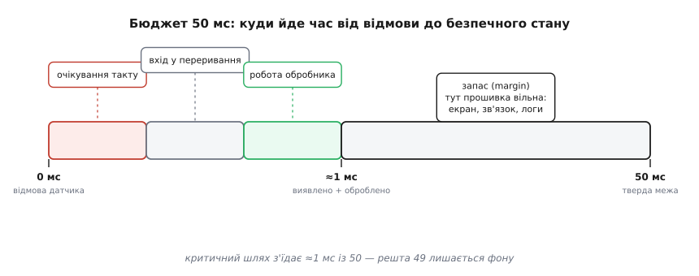
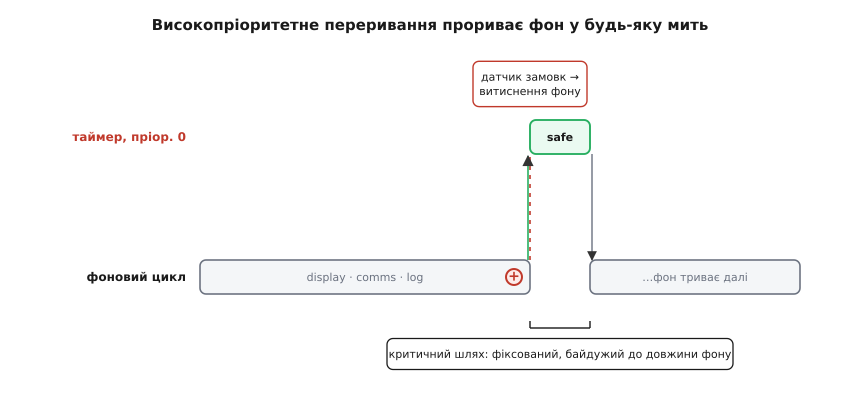

# ⚙️ Від драйвера до структури: як «50 мс» перетворюються на переривання

<preknowlist>
- [Контролер переривань і вектор](root:hw-arch/interrupt-vector) — як апаратна подія зупиняє процесор і стрибає в потрібний обробник; що таке пріоритет переривання.
- [Складові МК](root:hw-arch/mcu-blocks) — таймери, АЦП, порти всередині мікроконтролера; що процесор і периферія працюють паралельно.
- [volatile](root:sf-lang/volatile) — чому змінну, яку міняє переривання, не можна кешувати в регістрі; коли компілятор має справді читати пам'ять.
</preknowlist>

Є одна вимога — рядок у специфікації: «якщо основний датчик відмовляє, привод за 50 мс переходить у безпечний режим, інакше механізм ушкоджується». І є питання, на яке архітектор мусить відповісти **до** того, як напишеться перший рядок коду: у що ця вимога перетвориться? Не «яка гарна діаграма її ілюструє», а **яка саме структура коду з неї народжується** — де проляже межа, який шматок стане окремим, чому не можна інакше.

Тут ми пройдемо цей шлях повністю й повільно: від однієї фрази до працюючої прошивки, з арифметикою бюджету, з реальним C для Cortex-M, і — що важливо — з пастками, які чигають на кожному кроці й через які «правильна за задумом» структура тихо перестає тримати межу. А наприкінці зробимо зворотний хід: приберемо цю вимогу й подивимося, як та сама задача згортається в один нудний цикл без жодних переривань. Бо саме контраст показує, що структуру створив **драйвер**, а не любов до складності.

## Крок 0. Що взагалі означає «за 50 мс»

Перш ніж проєктувати, треба точно зрозуміти, що вимога обіцяє світові. «За 50 мс» — це не «швидко» і не «якомога раніше». Це **гарантія верхньої межі**: від моменту, коли датчик фізично відмовив, до моменту, коли привод знеструмлено, минає **не більше** 50 мілісекунд — завжди, у найгіршому випадку, а не в середньому.

Слово «найгірший випадок» тут вирішальне. Середній час нікого не рятує: якщо в дев'яти випадках із десяти система реагує за 5 мс, а в десятому — за 200, механізм ламається саме в тому десятому. Вимога реального часу — це обіцянка про **хвіст розподілу**, про найповільніший можливий прогін, а не про типовий. Уся структура, яку ми зараз збудуємо, існує рівно заради того, щоб цей хвіст був коротким і **обмеженим зверху відомим числом**.

> 🔧 **Навіщо це.** Плутанина «швидко в середньому» проти «гарантовано не пізніше» — джерело чи не половини провалів у вбудованих системах. Продукт місяцями показує чудові цифри на столі, проходить демо, іде в поле — і раз на тиждень десь ламається вал, бо в рідкісний момент збіглися три довгі операції й реакція спізнилася. Записуючи драйвер, завжди питай: це про середнє чи про максимум? Для безпеки — завжди про максимум.

Тепер розкладемо ці 50 мс на складові, бо саме з розкладу видно, куди тиснути. Від фізичної відмови до безпечного стану лежать три відрізки часу:

```
T_загальна = T_виявлення + T_реакція + T_запас

T_виявлення — скільки минає, поки система ПОМІТИТЬ, що датчик мовчить
T_реакція   — скільки триває сама дія (знеструмити привод)
T_запас     — усе, що лишилось до 50 мс: страховка на джитер і непевність
```

Кожен відрізок керується по-різному, і кожен — окреме інженерне рішення. Подивімося на них по черзі.

**T_реакція** — найкоротший і найпростіший. «Знеструмити привод» — це, як правило, скинути один біт у регістрі: зняти сигнал `enable` з драйвера мотора або відпустити реле. На Cortex-M такий запис у пам'ять периферії коштує одиниці тактів; за частоти 100 МГц це десятки наносекунд. На тлі мілісекунд — нуль. Реакція нас не турбує; турбує **виявлення**.

**T_виявлення** — ось де ховається вся структура. «Датчик відмовив» — подія фізична й мовчазна: датчик не надсилає сигнал «я помер», він просто перестає відповідати, або його значення застигає, або лінія обривається. Система дізнається про це, тільки **опитавши** датчик і побачивши, що відповіді немає. А отже, час виявлення прямо залежить від того, **як часто ми опитуємо** і **наскільки надійно цей опит відбувається навіть тоді, коли решта прошивки зайнята**.

Ось де вимога вганяється в структуру. Якщо перевірка датчика живе в загальному циклі разом із малюванням екрана й зв'язком, то час до наступної перевірки — це час найдовшого проходу циклу. А цикл, у якому є оновлення дисплея по повільній шині чи опитування радіомодуля, легко розтягується на десятки мілісекунд. І тоді «раз на 50 мс не встигаємо» — не тому, що процесор повільний, а тому, що перевірка **застрягла в черзі за неспішними справами**.



*Червоний і зелений відрізки — критичний шлях (виявлення + реакція) — навмисне зроблені крихітними; сірий «запас» — усе, чим прошивка вільна займатися, поки безпека вже гарантована.*

Висновок кроку 0: щоб тримати межу, треба зробити **T_виявлення** малим і, головне, **незалежним** від того, чим зайнята решта прошивки. Це і є вимога до структури. Тепер — як її виконати.

## Крок 1. Драйвер називає тактику

У архітектора є словник **тактик** — типових будівельних ходів, кожен із яких відповідає на певний вид тиску. Вимога реального часу тисне цілком конкретно: «дай гарантовану верхню межу часу реакції на подію». І словник відповідає двома пов'язаними ходами, які тут спрацьовують разом.

> Тактика — це елементарний архітектурний хід під конкретний якісний атрибут (окреме переривання під швидку реакцію, кеш під швидкодію, репліка під доступність). На відміну від патерна, тактика дрібніша й адресує рівно один атрибут. Докладніше — у [тактиці проти патерна](root:sf-apps/architectural-tactics).

**Тактика перша — окремий високопріоритетний потік виконання під критичну подію.** Замість того щоб перевірка датчика чекала своєї черги в загальному циклі, вона отримує власний шлях, який процесор **зобов'язаний** пройти вчасно, хай там що виконується зараз. У світі мікроконтролерів такий шлях — це **апаратне переривання** від таймера: залізо саме, без участі коду, кожні N мілісекунд зупиняє те, що процесор робив, і стрибає у визначений обробник. Це знімає залежність від довжини головного циклу: таймер тикає за власним годинником, а не за розкладом фонової роботи.

**Тактика друга — відділення критичного шляху від фонового.** Раз критична перевірка живе в перериванні, усе **некритичне** за часом — екран, зв'язок, журнали — треба свідомо лишити поза ним, у повільному фоні, якому дозволено підвисати. Це не випадковий поділ, а прямий наслідок першої тактики: якщо в переривання просочиться щось повільне, воно розтягне сам критичний шлях і межа знову попливе. Тому переривання тримають **худим** — тільки те, без чого не обійтися, і нічого більше.

Чому саме переривання, а не, скажімо, просто «перевіряти датчик частіше в циклі»? Бо частіша перевірка в циклі не дає **гарантії**. Хоч скільки викликів `sensor_alive()` устав між іншими справами, один довгий `display_update()` між двома перевірками все одно створить діру, більшу за 50 мс. Гарантію дає лише механізм, що **витісняє** поточну роботу за апаратним сигналом, а не чекає, доки вона добіжить. Переривання — саме такий механізм: воно вбудоване в залізо й не залежить від доброї волі коду, що зараз крутиться.



*Фон може бути скільки завгодно довгим — на критичний шлях це не впливає: переривання витісняє фон рівно в мить відмови, робить своє за фіксований час і віддає керування назад.*

Ось точка, у якій драйвер перетворився на структурне рішення. Не «напишемо акуратно» — а **проведемо в коді межу**: критичний шлях в окремому, апаратно-гарантованому потоці найвищого пріоритету; усе інше — у фоні, якому вільно бути повільним. Тепер цю межу треба покласти в реальний C.

## Крок 2. Робочий код: критичний шлях в окремому перериванні

Розкладемо прошивку на дві частини, як велить рішення. Спершу — критичний шлях. Ми беремо апаратний таймер, налаштовуємо його тикати кожну мілісекунду й даємо його перериванню **найвищий пріоритет** у системі. У самому обробнику — тільки перевірка й реакція, жодного зайвого коду.

Одразу зауваж деталь, яка не випадкова: **1 мс — це період опитування**, і саме він задає верхню межу `T_виявлення`. Якщо датчик відмовив одразу після тику, ми помітимо це на наступному тику — тобто щонайпізніше через 1 мс. Один тик на мілісекунду дає нам виявлення за ≤ 1 мс, реакцію за наносекунди, і величезний запас до 50 мс. Ми могли б тикати й рідше (раз на 10 мс усе ще з запасом), але 1 мс лишає простір на будь-яку непередбачену затримку й коштує дешево.

```c
#include <stdint.h>
#include <stdbool.h>

// ── Спільний стан між перериванням і фоном ──────────────────────────────
// volatile ОБОВ'ЯЗКОВО: цю змінну пише переривання, читає фон.
// Без volatile компілятор має право закешувати її в регістрі й
// фон ніколи не побачить, що сталася відмова.
static volatile bool fault_latched = false;

// ── Критичний шлях. Пріоритет 0 — найвищий у Cortex-M. ──────────────────
// Викликається апаратним таймером кожні 1 мс. Тут — ТІЛЬКИ безпека.
void TIM_1ms_IRQHandler(void)
{
    clear_timer_flag();                 // квитувати переривання (інакше зациклиться)

    if (!sensor_alive()) {              // датчик мовчить/завис/обрив?
        drive_disable();                // зняти enable — привод знеструмлено ЗАРАЗ
        fault_latched = true;           // зафіксувати факт для фону (логи, екран)
    }
}
```

Тепер друга частина — фон. Сюди йде все, що вимога (A) «оператор бачить температуру» і подібні: неспішне, терпляче до затримок. Головний цикл може підвисати на десятки мілісекунд — і це **безпечно за побудовою**, бо безпека вже гарантована перериванням вище.

```c
// ── Фон. Усе НЕкритичне за часом. Може підвисати — не зачепить безпеку. ──
void main_loop(void)
{
    for (;;) {
        display_update_temperature(read_temp());  // вимога (A): неспішно
        comms_poll();                              // обмін з пультом

        if (fault_latched) {
            log_fault();                           // журнал — коли встигнеться
            show_fault_banner();                   // червоний банер на екран
        }
    }
}
```

Придивись, що зробила структура. Ми **фізично рознесли** дві турботи, які раніше жили б в одному циклі й боролися за час. Безпека тепер не ділить процесорний час із малюванням екрана: коли настає мить відмови, таймер витісняє `display_update_temperature` на середині, робить критичну справу за наносекунди й повертає керування — екран домальовується так, ніби нічого не сталося, тільки на мілісекунду пізніше. `fault_latched` — тонкий місток між світами: переривання лишає в ньому позначку, фон її колись підбирає й показує оператору. Критичному шляху байдуже, чи встиг фон зреагувати на банер, — привод уже знеструмлено.

Це і є «драйвер прорізав межу»: одна вимога реального часу породила **два потоки виконання з різними законами часу** й тонкий, обережний канал між ними. Далі — перевіримо, що межа справді тримається, і де вона може тихо зламатися.

## Крок 3. Перевірка: чи справді 50 мс витримано

Код, що «має тримати межу», і код, що **тримає** її, — різні речі, поки ти не порахував найгірший випадок явно. Порахуймо. Найгірший сценарій виявлення такий: датчик відмовляє рівно в ту наносекунду, коли попередній тик щойно завершив перевірку. Тоді ми чекаємо на **повний період** до наступного тику — 1 мс — і аж тоді помічаємо. Додаємо час, поки процесор фактично увійде в обробник, і час самої реакції:

```
T_виявлення  ≤ 1.0 мс     (повний період таймера у найгіршому разі)
T_вхід       ≈ 0.001 мс   (латентність переривання Cortex-M: ~12 тактів @100 МГц)
T_реакція    ≈ 0.001 мс   (кілька записів у регістр периферії)
──────────────────────────────
T_найгірша   ≈ 1.002 мс   ≪ 50 мс
```

Запас — понад сорок дев'ять мілісекунд. Здавалося б, з таким запасом нічого не може піти не так. Але саме тут криється підступ: усі три доданки припускають, що **переривання таймера справді відпрацює вчасно й безперешкодно**. Якщо цю умову хтось тихо порушить, арифметика вище стає фікцією — числа ті самі, а реальність інша. Тому справжня перевірка — не порахувати суму, а **захистити кожне припущення, на якому вона стоїть**. Розберемо їх як пастки.

> 🔧 **Навіщо це.** Прикидка «на серветці» — порахувати найгірший випадок у стовпчик, перш ніж повірити, що межа тримається, — коштує п'ять хвилин і рятує від хибної впевненості. Той самий прийом застосовний скрізь, де є бюджет часу чи ресурсу; докладніше — у [прикидці «на серветці»](root:sf-apps/back-of-envelope).

## Крок 4. Пастка перша: пріоритети переривань

Перше й головне припущення: наш таймер має **найвищий** пріоритет, тож ніщо його не затримає. Легко сказати — легко й помилитися, бо система пріоритетів у Cortex-M влаштована протиінтуїтивно, і на цьому спотикаються навіть досвідчені.

У Cortex-M **менше число означає вищий пріоритет**. Пріоритет 0 — найвищий, найтерміновіший; що більше число, то менш терміновим стає переривання. Це перевернуто відносно щоденної інтуїції «більше = важливіше», і саме тому тут стається класична помилка: інженер, бажаючи зробити таймер «дуже важливим», ставить йому велике число — і несвідомо робить його **найнижчим** за пріоритетом. Тепер будь-яке інше переривання — прийшов байт по UART, спрацював зовнішній вхід — витісняє наш критичний таймер і відсуває перевірку датчика. Межа попливла, а код виглядає правильним.

```c
// ── Розстановка пріоритетів. Число МЕНШЕ = терміновіше (Cortex-M). ───────
void setup_priorities(void)
{
    // Критичний таймер — пріоритет 0: найвищий, його ніхто не витісняє.
    NVIC_SetPriority(TIM_1ms_IRQn, 0);

    // Уся фонова периферія — свідомо НИЖЧЕ (числа більші),
    // щоб НІКОЛИ не заступити критичний таймер.
    NVIC_SetPriority(UART_IRQn,   5);
    NVIC_SetPriority(EXTI0_IRQn,  6);
    NVIC_SetPriority(DMA1_IRQn,   7);

    NVIC_EnableIRQ(TIM_1ms_IRQn);
    NVIC_EnableIRQ(UART_IRQn);
    // …
}
```

Це не косметика розстановки — це частина того самого структурного рішення. «Окремий високопріоритетний потік» без **правильно вищого** пріоритету — не окремий і не високопріоритетний; він лише виглядає таким. Тактика реалізована лише тоді, коли залізо змушене пропускати критичний таймер поперед усього.

Тонкість, про яку варто знати: у Cortex-M пріоритет ділиться на **групу витіснення** (preemption) і **підпріоритет**; витісняє одне переривання інше тільки за вищою групою. Практичний висновок простий — критичному таймеру дають окрему, найвищу групу витіснення, щоб він **завжди** прошивав будь-яке фонове переривання, а не лише ті, що нижчі за підпріоритетом. Як апаратний вектор і контролер вирішують, кого впустити першим, розібрано в [контролері переривань і векторі](root:hw-arch/interrupt-vector).

> 🔧 **Навіщо це.** Помилка «переплутав напрям пріоритетів» не дає ані попередження компілятора, ані падіння на столі — вона проявляється раз на тисячу відмов, коли критичний таймер саме збігся з фоновим перериванням. Це найдорожчий сорт бага: код правильний на вигляд, тести зелені, а в полі механізм зрідка ламається. Тому пріоритети критичних шляхів виписують явно й коментують, чому саме такі числа.

## Крок 5. Пастка друга: спільний ресурс і критична секція

Друге припущення: `drive_disable()` у перериванні миттєво знеструмлює привод. А що, як фон **у ту саму мить** теж чіпає драйвер мотора — плавно змінює швидкість, шле команду по тій самій шині SPI? Тоді ми маємо **спільний ресурс** (реєстр драйвера, шину), до якого одночасно тягнуться два потоки: критичне переривання й фон. І тут народжується цілий клас підступних поломок.

Уяви: фон почав багатокрокову транзакцію по SPI до драйвера — вибрав чіп, поклав перший байт. Рівно посередині цієї послідовності спрацьовує таймер, витісняє фон і теж лізе по SPI знеструмити привод. Дві транзакції накладаються, байти переплітаються, драйвер отримує сміш — і команда «стоп» може взагалі не дійти. Найгірший з можливих результатів: саме та дія, заради якої існує вся структура, зривається через гонитву за спільну шину.

Захист — **критична секція**: короткий проміжок, на час якого фон забороняє себе витісняти, поки не завершить неподільну операцію над спільним ресурсом. У Cortex-M для цього є два різні інструменти, і вибір між ними — теж частина рішення.

```c
// ── Груба заборона: глушить УСІ переривання, зокрема критичний таймер. ───
// Простий CPSID i. Небезпечний для реального часу:
// на весь час секції наш таймер СЛІПНЕ → межа 50 мс під загрозою.
static inline void enter_critical_all(void) { __disable_irq(); }   // CPSID i
static inline void exit_critical_all(void)  { __enable_irq();  }   // CPSIE i

// ── Вибіркова заборона (ARMv7-M: Cortex-M3/M4/M7) через BASEPRI: ─────────
// глушить лише переривання НИЖЧІ за поріг, а критичний таймер (пріор. 0)
// лишає ПРАЦЮВАТИ. Саме це рятує реальний час.
static inline uint32_t enter_critical_upto(uint32_t prio)
{
    uint32_t prev = __get_BASEPRI();
    __set_BASEPRI(prio << (8 - __NVIC_PRIO_BITS));  // зсув під реальні біти пріоритету
    return prev;
}
static inline void exit_critical(uint32_t prev) { __set_BASEPRI(prev); }
```

Різниця між цими двома — не стильова, а сутнісна для нашого драйвера. `__disable_irq()` (інструкція `CPSID i`) вимикає **геть усі** переривання, зокрема наш критичний таймер: на весь час секції безпека **сліпне**. Якщо фон загорнув у таку секцію щось довше за кілька мікросекунд, ми щойно власноруч пробили діру в гарантії 50 мс. `BASEPRI` натомість глушить лише переривання **нижчі за поріг**, а критичний таймер із пріоритетом 0 крізь нього проходить вільно — його `BASEPRI` навіть не здатен замаскувати. Тому в системі, де є жорсткий реальний час, спільні ресурси захищають саме через `BASEPRI` з порогом **нижчим за критичний таймер**: фон стає неподільним щодо іншого фону, але критичний шлях лишається зрячим.

Ось як фон безпечно чіпає спільний із перериванням драйвер:

```c
void background_set_speed(uint16_t rpm)
{
    // Заборонити лише фонові переривання; критичний таймер (0) — НЕ чіпаємо.
    // Поріг 1: глушить усе з пріоритетом ≥ 1, тобто весь фон.
    uint32_t saved = enter_critical_upto(1);

    spi_select(DRIVE);
    spi_write(REG_SPEED, rpm);     // неподільна транзакція до драйвера
    spi_deselect(DRIVE);

    exit_critical(saved);          // фон знову витісняємо
}
```

Але справжня краса рішення в тому, що **найкращий захист спільного ресурсу — не ділити його зовсім**. Якщо критичне переривання й фон керують приводом через **різні** шляхи — скажімо, знеструмлення підвішене на окрему апаратну лінію `enable`, яку смикає лише переривання, а плавну швидкість крутить лише фон, — то спільного ресурсу немає, і критичної секції теж не треба. Це загальний архітектурний принцип, що спускається аж до заліза: **прибрати спільний стан вигідніше, ніж навчитися його ділити**. Коли розділення можливе, воно завжди чистіше за будь-який замок.

> 🔧 **Навіщо це.** Гонитви за спільний ресурс між перериванням і фоном — окремий сорт кошмару: вони не відтворюються під налагоджувачем (він міняє тайминг), не ловляться простими тестами й вилазять раз на мільйон циклів. Тому їх не «ловлять потім», а **проєктують так, щоб їх не було**: або неподільна секція через `BASEPRI`, або, ще краще, повне розділення шляхів. Той самий вибір — «замок проти неподілення» — керує узгодженням і на великих системах; його теорія — в [std::atomic і порядку пам'яті](root:sys-plang-cpp/std-atomic).

## Крок 6. Пастка третя: тремтіння (джитер)

Третє припущення найтонше: ми весь час казали «таймер тикає **кожну** мілісекунду». А чи справді рівно кожну? Реальний період тику коливається — і це коливання зветься **тремтінням** (англ. *jitter* — дрож, тремтіння): різниця між тим, коли тик мав статися, і коли він фактично стався. Джитер з'їдає наш запас, і коли запас великий (як тут — 49 мс), він нестрашний; але варто зрозуміти, звідки він береться, бо на тісніших бюджетах він і є те, що ламає межу.

Головне джерело джитера — **інше переривання тієї самої або близької терміновості**. Уяви, що з якоїсь причини у фоновій периферії опинилося переривання з пріоритетом, рівним нашому таймеру. Коли обидва хочуть виконатися одночасно, одне мусить зачекати, поки друге добіжить. Це чекання й додається до `T_виявлення` як джитер. Ось чому «худий обробник» — не косметика, а вимога: кожна зайва мікросекунда, витрачена в **будь-якому** високопріоритетному перериванні, — це джитер, накинутий на всі інші критичні шляхи.

Другий, тихіший, вже знайомий нам винуватець — **критичні секції**. Кожне `__disable_irq()` десь у фоні на час своєї дії відсуває тик таймера: тик, який мав статися посеред секції, відбудеться лише коли секцію закриють. Довша секція — більший джитер. Це замикає коло з попереднім кроком: `BASEPRI` замість `__disable_irq()` не тільки рятує від гонитв, а й тримає джитер критичного таймера близьким до нуля, бо взагалі його не глушить.

Порахуймо, скільки джитера ми можемо стерпіти, і переконаймося, що спимо спокійно:

```
Бюджет запасу:      50 мс − 1.002 мс ≈ 48.998 мс
Реальний джитер:    одиниці мікросекунд (худий обробник + BASEPRI)
Стійкість:          запас більший за джитер у ТИСЯЧІ разів
```

Висновок: із періодом 1 мс і худим обробником джитер для цього драйвера — шум на тлі бюджету, і межа тримається з колосальним запасом. Але сам факт, що ми **порахували** його, а не відмахнулися, — це і є інженерна дисципліна. На бюджеті не 50, а 500 мкс той самий джитер уже вирішував би долю, і саме тоді кожне рішення з кроків 4–6 стає не «про всяк випадок», а обов'язковим.

> 🔧 **Навіщо це.** Джитер — прихований податок на кожен спільний із критичним шляхом ресурс і на кожну критичну секцію. Його не видно у звичайному прогоні; його треба **порахувати** й тримати в голові як окрему статтю бюджету. Правило-наслідок: усе, що виконується на високому пріоритеті, тримай коротким — не бо «красиво», а бо кожна зайва інструкція там додає джитер усім критичним подіям системи.

## Крок 7. Контрприклад: коли драйвера немає — один цикл

Тепер зробимо найкорисніше: **приберемо драйвер** і подивимося, що станеться зі структурою. Уяви той самий контролер, але привод інший — повільний вентилятор, скажімо, який від затримки в пів секунди нічого не втратить. Вимога (B) зникає: немає жодної події, на яку треба реагувати за жорстку межу. Що лишається від усієї нашої побудови?

Нічого. Уся конструкція осідає в один спокійний цикл:

:::tabs
```c
// ── Драйвера реального часу НЕМАЄ. Уся прошивка — один нудний цикл. ──────
// Немає переривань, немає пріоритетів, немає критичних секцій,
// немає volatile-містків, немає джитера. Читати легко, ламатися нічому.
void main_loop_no_driver(void)
{
    for (;;) {
        display_update_temperature(read_temp());   // показ температури

        if (!sensor_alive())                        // перевірка датчика —
            drive_disable();                        //   просто ще один крок циклу

        comms_poll();                               // обмін з пультом
    }
}
```
```python
# ── Драйвера реального часу НЕМАЄ. Уся прошивка — один нудний цикл. ──────
# Немає переривань, немає пріоритетів, немає критичних секцій,
# немає спільного стану, немає джитера. Читати легко, ламатися нічому.
def main_loop_no_driver():
    while True:
        display_update_temperature(read_temp())   # показ температури

        if not sensor_alive():                     # перевірка датчика —
            drive_disable()                        #   просто ще один крок циклу

        comms_poll()                               # обмін з пультом
```
:::

Порівняй це з тим, що ми будували сім кроків поспіль. Зникли переривання. Зникла морока з пріоритетами Cortex-M і їхнім перевернутим напрямом. Зникли критичні секції, `BASEPRI`, гонитви за спільний ресурс. Зник `volatile`-місток `fault_latched`, бо ділити стан між потоками більше нема потреби — потік один. Зник джитер як поняття. Перевірка датчика стала просто **ще одним рядком** у циклі, поряд з екраном, без жодних привілеїв. Прошивку тепер може прочитати й зрозуміти будь-хто за хвилину, і зламати в ній практично нічого.

Ось у чому весь урок, стиснутий до однієї думки: **складність, яку ми додавали з кроку 1 по крок 6, породив не наш смак і не «правильний спосіб писати прошивку» — її породив рівно один рядок специфікації**. Прибрали цей рядок — і вся складність випарувалася, бо вона була не самоціллю, а **відповіддю на конкретний тиск**. Кожне переривання, кожен пріоритет, кожна критична секція існували лише для того, щоб виконати «50 мс», і без цієї вимоги стали б чистим тягарем — кодом, який важче читати, легше зламати, а користі не приносить.

Це і є практичний сенс усієї роботи з драйверами. Структура — не те, що архітектор наносить на систему зі своїх уподобань; структура — це **відбиток тиску**, слід, який лишають на будові справжні драйвери. Де тисне драйвер — там з'являється межа, потік, замок. Де не тисне — там усе має право лишатися нудним одним циклом. І найдорожча помилка — не «замало структури», а структура, доліплена там, де жоден драйвер її не вимагав: витрачена складність, за яку платять читабельністю й надійністю щодня, а взамін не отримують нічого.

## Що лишається в руках

Пройдений шлях можна скласти в короткий припис, який працює далеко за межами цього прикладу:

- **Прочитай, що драйвер обіцяє світові.** «50 мс» — це гарантія верхньої межі в найгіршому випадку, не середнє. Уся структура служить хвосту розподілу.
- **Розклади межу на складові** й побач, яка з них тисне. Тут — час виявлення, і саме він мусить стати малим і незалежним від решти прошивки.
- **Назви тактику, яку диктує тиск.** Реальний час → окремий високопріоритетний потік (переривання) + відділення критичного шляху від фону.
- **Поклади межу в код** так, щоб критичний шлях був худим і апаратно-гарантованим, а фону було дозволено підвисати.
- **Порахуй найгірший випадок** явно й **захисти кожне припущення**, на якому стоїть розрахунок: правильний напрям пріоритетів, неподільність спільного ресурсу, обмежений джитер.
- **Перевір зворотним ходом:** прибери драйвер подумки. Якщо структура спрощується — вона була відповіддю на драйвер, і це добре. Якщо не спрощується — частину складності ти доліпив дарма.

Драйвер сам нічого не будує. Він лише вказує, **де** в будові має пролягти межа й **чому** без неї не можна. Решта — інженерна чесність: провести саме ту межу, не ширшу й не вужчу, і довести розрахунком, що вона тримається.
