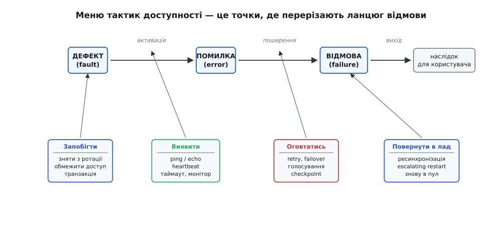
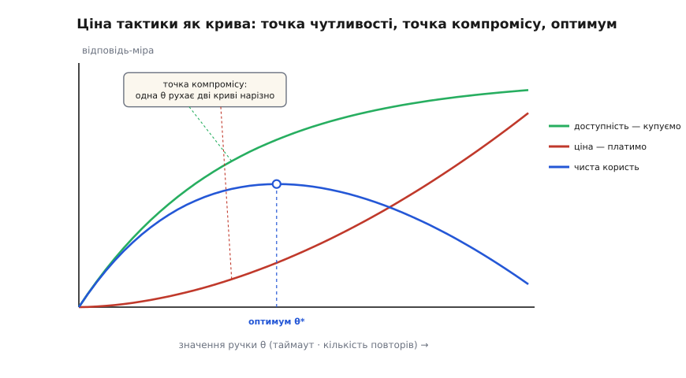

# Тактика проти патерна: атом рішення і ремесло навколо нього

<preknowlist>
- [Якісні атрибути](topic:sf-apps/quality-attributes) — «-ilities» системи (доступність, продуктивність, змінюваність, безпека): те, що ми міряємо, кажучи «добра архітектура».
- [Сценарії атрибутів](topic:sf-apps/attribute-scenarios) — як розмита вимога стає перевірним реченням: стимул → реакція → вимірна відповідь.
- [Trade-off-аналіз](topic:sf-apps/tradeoff-analysis) — чому кожне архітектурне рішення щось купує ціною іншого й як це зважувати.
</preknowlist>

Патерн (запобіжник, кеш, реплікація) — це готова, названа відповідь: береш пакет, він працює. **Тактика** (гр. *taktikē* — «мистецтво впорядкування», те саме слово, що й у військовій тактиці: одна конкретна дія на полі, а не весь план кампанії) — це найдрібніше, атомарне рішення всередині такого пакета: один важіль, що впливає рівно на одну властивість системи й має власну ціну. Означили її Лен Басс, Пол Клементс і Рік Кецман у «Software Architecture in Practice» (усталене джерело, 3-тє видання 2012, 4-те — 2021): **тактика — це проєктне рішення, що керує однією реакцією якісного атрибута**. Запобіжник розкладається на три такі важелі — виявити збій за таймаутом, обірвати лавину спроб на порозі, пробним запитом спробувати замкнутися назад, — і компроміс між ними хтось зафіксував за тебе, коли пакував їх у патерн. Сам поділ на «патерн» і «тактику» теж має історію — від взірців Крістофера Александера через рух патернів у програмуванні до того, як в Software Engineering Institute патерни свідомо розібрали на атомарні тактики; коротко про це — у вставці [як народився словник тактик](topic:sf-apps/architectural-tactics/hist-tactics-lineage.md).

Це вже варто знати. Але справжня дисципліна архітектора починається на питанні, якого назва «тактика проти патерна» лише торкається. Одне діло — вміти назвати важелі всередині запобіжника. Зовсім інше — знати, **звідки взялося рішення поставити тут саме цю тактику, як його зважити проти інших, як вирішити, коли чисел ще немає, як записати його так, щоб через рік хтось зрозумів, показати його команді й зберегти живим, поки система змінюється роками.** Тактика — атом; але атом ніколи не висить у порожнечі. Довкола нього — ціле кільце ремесла: драйвер, що народжує рішення; сценарій, що дає йому ціль у числах; аналіз, що зважує його ціну; невизначеність, у якій його ухвалюють; в'ю й журнал, що роблять його видимим; команда, чия структура його або пускає, або душить; і час, що його роз'їдає. Пройти це кільце — і є ремесло понад механізмами. Почнімо з самого атома, глибше, ніж «ось важіль»: із питання, **чому меню важелів узагалі скінченне**.

### Чому меню тактик майже вичерпне: виведення з ланцюга відмови

Коли кажуть «є набір тактик доступності — виявити збій, оговтатись, не допустити», легко почути це як довільний список, який хтось склав із досвіду й треба завчити. Насправді список не довільний: він **виводиться** з того, як узагалі трапляється відмова. Це та сама різниця, що між «завчи таблицю множення» і «зрозумій, що множення — це повторюване додавання»: у другому разі таблицю можна відтворити, а не пам'ятати.

Розберімо, з чого складається відмова. Тут дисципліна спирається на класичну таксономію надійності Авіженіса, Лапрі, Рандела й Ландвера (усталене джерело — стаття «Basic Concepts and Taxonomy of Dependable and Secure Computing», IEEE Transactions on Dependable and Secure Computing, том 1, 2004; Алгірдас Авіженіс — литовсько-американський інженер, Жан-Клод Лапрі — француз, Браян Рандел — британець). Вони розчепили три поняття, які в побуті злипаються в одне «зламалось»:

```
ДЕФЕКТ (fault)  →  ПОМИЛКА (error)  →  ВІДМОВА (failure)  →  наслідок
   причина          хибний стан         видима поведінка      користувач
 (баг, мертвий      всередині          відхиляється від       бачить збій
  вузол, збитий     системи            коректної
  біт)                                 
        активація            поширення            вихід назовні
```

Читається так. **Дефект** — це причина, що дрімає: рядок коду з помилкою, вузол, що впав, біт, який перевернула космічна частинка. Поки дефект не *активовано*, він нікому не шкодить. Активований, він народжує **помилку** — хибний внутрішній стан: змінна тримає не те значення, кеш повернув застаріле, вузол відповів сміттям. Помилка ще всередині; якщо вона не *поширилася* до межі системи, зовні її не видно. Коли ж помилка досягає інтерфейсу й система поводиться не так, як обіцяла, — це **відмова**, і саме її бачить користувач. Ланцюг напрямлений: дефект породжує помилку, помилка породжує відмову.

Тепер — ключовий хід. Доступність означає «якнайрідше давати відмову». Але відмова стоїть у кінці ланцюга, і **перервати ланцюг можна на будь-якій ланці**. Кожне таке місце розриву — це ціла сім'я тактик, і сімей рівно стільки, скільки ланок та переходів між ними:

- **Запобігти дефектові** (до початку ланцюга). Прибрати те, що от-от зламається, поки воно не активувалося: зняти підозрілий вузол з ротації, обмежити ризиковані операції, обгорнути ділянку транзакцією, щоб частковий збій відкотився. Тактики *запобігання*.
- **Виявити помилку** (перехід дефект → помилка). Поки ти не знаєш, що вузол мовчить, ти безсилий: не можна оговтатись від того, чого не помітив. Тактики *виявлення*: ping/echo (опитувач шле сигнал і чекає відлуння), heartbeat (вузол сам періодично подає ознаку життя), таймаут, монітор, перехоплення винятку. Це очі системи.
- **Оговтатись або замаскувати** (перехід помилка → відмова). Помилка вже є, але до відмови ще крок — і його можна не дати ступити: повторити виклик (retry), перемкнутися на резерв (failover), проголосувати трьома копіями й узяти більшість (voting), відкотитися до збереженої контрольної точки (checkpoint/rollback). Тактики *відновлення*: вони або лікують помилку, або ховають її від користувача.
- **Повернути в лад** (після ремонту). Оговтавшись, треба знову ввести полагоджений елемент у роботу, не зламавши все вдруге: ресинхронізувати стан, підняти вузол сходинками (escalating restart), дати йому знову приєднатися до пулу. Тактики *повторного введення*.


*Чому меню тактик доступності майже вичерпне. Угорі — причинний ланцюг відмови (за таксономією Авіженіса й співавторів): дефект активується в помилку, помилка поширюється у відмову, відмова б'є по користувачеві. Знизу — сім'ї тактик, кожна прив'язана до однієї ланки чи переходу: запобігти (не дати дефектові стати активним), виявити (побачити помилку), оговтатись/замаскувати (не дати помилці стати відмовою), повернути в лад (після ремонту). Меню не завчене — воно **виведене**: тактик рівно стільки, скільки місць, де ланцюг перерізають. Порожнє місце на схемі — сигнал пропущеного класу рішень.*

Ось чому словник тактик вартий того, щоб його розуміти, а не зазубрювати. Пробігаючи ланцюг, архітектор ставить питання, яке інакше проґавив би: «а ми взагалі *виявляємо* збій — чи дізнаємось про нього від розлюченого користувача, бо вся наша увага пішла на відновлення?» Дірка в конкретній ланці одразу видно як дірка. Це і є **повнота думки**, якої не дає готовий патерн: патерн затуляє ланцюг пакунком, а тактики його оголюють. Повний, виведений із першопричин набір тактик доступності живе в окремій темі — [тактики доступності](topic:sf-apps/availability-tactics); тут важливий сам принцип: набір не випав з неба, він факторизує ціль.

І цей принцип загальний — кожен якісний атрибут має **свій корінь**, зі свого рівняння якого виводиться його меню. Продуктивність: час відгуку розкладається на «час чекання на ресурс + час користування ресурсом», отже й тактики [продуктивності](topic:sf-apps/performance-tactics) б'ють по двох коренях — керувати *попитом* на ресурс (приборкати частоту й розмір запитів) і керувати самими *ресурсами* (додати їх, розпаралелити, поставити чергу з пріоритетом). [Змінюваність](topic:sf-apps/modifiability-tactics): очікувану вартість майбутніх змін можна записати як

```
Вартість_змін ≈ Σ    p(зміна торкнеться модуля) × (вартість_правки + вартість_поширення)
              по змінах
```

і кожен множник — окрема мішень: зменшити модуль, підняти його зв'язність, послабити зчеплення (щоб поширення не котилося далі), відкласти зв'язування на потім (щоб зміну можна було внести конфігурацією, а не перекомпіляцією). Тактика — це рішення атакувати **один доданок** у рівнянні свого атрибута. Знаєш рівняння — відтворюєш меню; знаєш лише меню — лишається його вивчити напам'ять і сподіватися, що воно повне.

### Тактика як параметризоване рішення; патерн як припаяні ручки

Тепер, коли видно, звідки береться *сам* важіль, придивімось, чим він відрізняється від патерна на рівні, точнішому за «атом проти пакета». Різницю найлегше схопити так: **тактика — це рішення з ручками, а патерн — те саме рішення з ручками, уже викрученими в певне положення й припаяними.**

Формально будь-яку тактику можна описати трійкою: цільовий атрибут *A*, механізм *M* (що саме робимо — повторюємо, кешуємо, дублюємо) і набір **параметрів** *θ* (наскільки, скільки разів, як довго, з якого порога). Відповідь системи — це функція параметрів:

```
відповідь R = f(θ)
retry:   θ = (кількість спроб N, база паузи b, множник росту)
таймаут: θ = (гранична тривалість T)
кеш:     θ = (розмір, час життя TTL, політика витіснення)
```

Тактика лишає *θ* **тобі**: «повтори невдалий виклик» — а скільки разів? з якою паузою? для яких саме помилок? — вирішуєш ти, під свій сценарій. Патерн бере ту саму трійку, але фіксує *θ = θ\** усередині й віддає готовим. «Запобіжник» — це не якийсь окремий механізм; це три тактики (виявити таймаутом, обірвати на порозі, пробувати замкнутися) із **уже підібраними** порогом розмикання, тривалістю паузи й правилом «скільки збоїв — то забагато». Ти береш пакунок цілком, з його викрученими ручками.

Звідси — точне правило вибору рівня, глибше за «бери патерн, коли типово». Патерн підходить рівно тоді, коли **θ\*, зашите автором, збігається з тим, що диктує твій сценарій** — або досить близьке, щоб різниця не коштувала. Тоді фіксовані ручки економлять тобі години думання й помилок. Але тільки-но твій сценарій просить іншого θ — інший поріг, іншу поведінку під піком, іншу семантику повтору, — припаяні ручки стають кліткою: ти або гнеш патерн проти його природи, або спускаєшся на рівень тактик і збираєш рішення сам, важіль за важелем. Зрілий архітектор тому й бачить у [мікросервісах](topic:sf-apps/microservices) чи [шаровій архітектурі](topic:sf-apps/layered-architecture) не магічні слова, а конкретні набори тактик із наперед викрученими ручками — і питає не «модно чи ні», а «те θ, яке цей стиль уже прийняв за мене, — моє чи чуже?».

Побачити це на живому коді найкраще там, де патерн **збирають** із тактик власноруч і кожну ручку виставляють назовні як свідомо прийнятий компроміс: як із виявлення, запобігання й відновлення народжується скінченний автомат запобіжника з трьома станами (замкнено → розімкнено → напіввідкрито), і чому кожен його параметр — окрема точка, де мовчазна зміна одного числа тихо переторговує властивості системи. Повний устрій, математика ковзного вікна помилок та реалізація автомата детально розібрані в статті [Патерн Circuit Breaker](topic:sf-distributed/circuit-breaker-pattern).

### Ціна тактики має форму кривої: точка чутливості й точка компромісу

Найважливіше, що треба відчути про тактики: **безкоштовних немає, і ціна майже завжди має форму кривої, а не мітки.** Кожна тактика купує один атрибут — і псує інший; але «псує» тут не «поганий/добрий», а **функція від тієї самої ручки θ**, яку тактика лишила відкритою. Саме тому головна робота — не «застосувати тактику», а знайти на її кривій точку, де баланс твій.

Візьмімо таймаут як ручку й простежимо обидві криві, які він тягне. Що більший таймаут *T* — то більше «повільних, але живих» відповідей ми встигаємо зловити, отже **доступність росте**. Але той самий більший *T* означає, що приречений, мертвий виклик ми тримаємо довше, займаючи потік і пам'ять, — отже **затримка в найгіршому випадку теж росте**. Одна ручка, дві відповіді, що рухаються в **протилежні** боки. Порахуймо на конкретиці:

**Приклад: таймаут платіжного шлюзу як точка компромісу.**
```
Сценарій: шлюз, здорова відповідь ~ 300 мс, іноді «підвисає» надовго.
Ручка — таймаут T. Дві відповіді-міри залежать від однієї T:

  T = 200 мс  → відсічемо частину здорових-але-повільних (доступність ↓),
                зате p99 затримки ≤ 200 мс (швидкий, чіткий провал ↑)
  T = 3000 мс → майже не ріжемо здорових (доступність ↑),
                але p99 ≈ 3 с — користувач і потік «висять» 3 секунди (↓)

Немає «правильного» T. Є точка на кривій, яку диктує сценарій:
якщо в сценарії «відповісти за 5 с або коректно відмовити» — T ближче до 2 с;
якщо «інтерактивний екран, краще швидко збрехати заглушкою» — T = 200 мс.
Число диктує сценарій, а не смак архітектора.
```

Ось тут дисципліна дає два точні терміни, які перетворюють інтуїцію «є компроміс» на інструмент рев'ю. **Точка чутливості** (sensitivity point) — це параметр, малий зсув якого сильно рухає одну відповідь-міру. Поріг розмикання запобіжника — точка чутливості доступності: посунеш на два збої — і система або дратує зайвими обривами, або пропускає лавину. **Точка компромісу** (trade-off point) — це параметр, який є точкою чутливості одразу для **двох чи більше** атрибутів, що тягнуть у різні боки. Таймаут *T* — саме така: він точка чутливості й для доступності, і для затримки, і вони конфліктують. Ці два терміни — з методу оцінювання архітектури [ATAM](topic:sf-apps/atam-lite) (Architecture Tradeoff Analysis Method, розроблений в Software Engineering Institute при Університеті Карнеґі-Меллона; Рік Кецман, Марк Кляйн, Пол Клементс), і саме точки компромісу — головна здобич будь-якого рев'ю: це місця, де одне число тихо переторговує дві властивості.


*Ціна тактики як крива. По горизонталі — значення однієї ручки (тут: таймаут або кількість повторів). Зелена крива росте — атрибут, який тактика купує (доступність). Червона росте — ціна (затримка, навантаження на сусіда). Там, де крива круто йде вгору, ручка є **точкою чутливості**; там, де круті одразу дві конфліктні криві, — **точкою компромісу**. Синя крива — чиста користь (вигода мінус ціна); її **пік** і є те положення ручки, яке шукає економіка рішення. «Застосувати тактику» без цієї кривої — навмання ткнути ручку.*

> 🔧 **Навіщо це.** На рев'ю не питай «які у вас патерни» — питай «де ваші точки компромісу». Проси показати рядок конфігурації чи константу, зміна якої на одне число зсуває дві властивості нарізно (таймаут, поріг запобіжника, розмір пулу, TTL кеша, фактор реплікації). Кожна така точка — це рішення, яке хтось ухвалив, часто не помітивши, що ухвалює; і саме вона спливе в аварії о третій ночі. Тактика без названої точки компромісу — не рішення, а самообман, що звучить солідно.

Форму цих кривих для найпоширенішої тактики — повтору — можна вивести точно, і це того варте, бо саме числа показують, коли ліки стають отрутою. Скільки в середньому додається затримки й викликів; яка ймовірність урешті влучити за *N* спроб при незалежних збоях (1 − pᴺ) — і чому це міркування розсипається, коли збої **корельовані** (сусід лежить не на мить, а всерйоз); як повтори без стриму множать навантаження в «шторм повторів» (retry storm) і додають системі саме тоді, коли їй найгірше; і чому експоненційна пауза з **джитером** (випадковим розкидом) плюс запобіжник згори математично обмежують цей шторм. Виведення — у вставці [математика ціни повтору](topic:sf-apps/architectural-tactics/math-retry-tradeoff.md). А сама природа цього обміну — не вада конкретних тактик, а їхня суть: якби рішення нічого не коштувало, його не було б сенсу обговорювати. Уся вага архітектурного рішення — у тому, чим платиш; тому вибір тактики нерозривний із [trade-off-аналізом](topic:sf-apps/tradeoff-analysis).

### Звідки береться рішення: драйвер і шестичастинний сценарій

Крива ціни каже, *як* налаштувати важіль, коли ти вже знаєш, у яку відповідь цілишся. Але звідки береться сама ціль — те число, у яке цілимось? З двох речей, які й запускають усе кільце: **драйвера** й **сценарію**.

Не кожна вимога заслуговує архітектурного рішення. «Кнопка має бути синя» — не архітектурна: помилився — перефарбував за хвилину. **Архітектурний драйвер** (англ. *driver* — «те, що жене, стернує») — це та вимога, яка, коли її схибити, **змушує переробляти структуру**, а не рядок коду: «витримати сплеск ×50 у чорну п'ятницю», «пережити падіння цілого дата-центру», «пускати нову країну щомісяця без переписування». Такі вимоги ще звуть архітектурно значущими (architecturally significant requirements). Їх завжди небагато — і саме вони, а не повний список побажань, визначають, які тактики взагалі варто розглядати. Повний розбір того, що робить вимогу драйвером, живе в темі [архітектурні драйвери](topic:sf-apps/architectural-drivers); тут важить, що драйвер — це **вхід** у вибір тактики: він каже, який атрибут зараз коштує уваги.

Драйвер іще розмитий («має бути надійним»). Перетворює його на ціль, у яку можна цілитись тактикою, **сценарій** (від лат. *scaena* — «поміст, сцена»: маленька п'єса про одну подію з системою). І тут детальна дисципліна йде глибше за просте «стимул → реакція → відповідь»: повний сценарій має **шість** частин, і кожна з них здатна змінити, яка тактика доречна.

```
1. Джерело стимулу   — хто/що це спричиняє (користувач? сусідній сервіс? годинник?)
2. Стимул            — сама подія (запит прийшов; вузол упав; надійшло 10× трафіку)
3. Артефакт          — що саме зачеплено (весь сервіс? один модуль? база?)
4. Середовище        — В ЯКОМУ СТАНІ система (норма? пік? уже деградована? розгортання?)
5. Реакція           — що система робить у відповідь
6. Відповідь-міра    — ЧИСЛО, яким міряємо реакцію (за скільки мс, з якою часткою втрат)
```

Три частини — джерело, стимул, реакція — очевидні. Дві інші тихо вирішують долю тактики. **Артефакт** каже, *куди* прикласти важіль: тактика, що рятує весь сервіс, і тактика, що ізолює один хворий модуль, — різні, і плутати їх — марнувати зусилля не там. Але найпідступніший — **середовище**. Тактика, ідеальна «в нормі», під піком часто шкідлива: повтор, що рятує при випадковому збої, під перевантаженням **добиває** сусіда; кеш, що прискорює звичайного дня, у момент масового скидання (cache stampede) сам валить базу лавиною однакових промахів. Без слота «середовище» ти обираєш тактику для одного світу, а працює вона в іншому. Повний апарат перетворення розмитої вимоги на таке перевірне речення — у темі [сценарії атрибутів](topic:sf-apps/attribute-scenarios); суть у тому, що **шоста частина, відповідь-міра, і є та ціль у числах**, без якої тактика повисає: не знаєш числа — не знаєш, чи важіль спрацював.

> 🔧 **Навіщо це.** Коли на рев'ю пропонують тактику, проси назвати **середовище** сценарію вголос: «це рятує нас у нормі чи під піком?». Дуже часто виявляється, що красиве рішення тестували й уявляли лише «в нормі», а найдорожчі аварії живуть саме в стані «уже деградовані + прийшов пік». Слот середовища ловить цей клас помилок ще до коду.

Лишається питання пріоритету: сценаріїв багато, тактика на кожен коштує, а бюджету на все нема. Тут дисципліна користується **деревом корисності** (utility tree) з того самого ATAM: сценарії розвішують гілками за атрибутами й позначають кожен двома оцінками — наскільки він **важливий** для бізнесу і наскільки **важкий** архітектурно. Тактики отримують лише сценарії з кутка «важливо + важко»: решту або покриє дефолт, або можна прийняти ризик. Дерево корисності — це фільтр, що не дає розпорошити тактики на все підряд; воно перетворює купу побажань на коротку впорядковану чергу рішень.

### Економіка рішення: користь проти вартості

Дерево корисності вже натякнуло на щось глибше: тактики варто не просто зважувати «краще/гірше», а **рахувати в тих самих одиницях, що й гроші**. Бо в архітектора завжди більше добрих тактик, ніж бюджету, і питання не «чи корисна тактика» (корисні майже всі), а «яку користь на витрачену гривню вона дає проти решти».

Це прямо формалізує метод CBAM (Cost Benefit Analysis Method — метод аналізу витрат і вигід, теж із Software Engineering Institute; Кецман, Джай Асунді, Кляйн, «Making Architecture Design Decisions: An Economic Approach», 2002). Ідея проста й точна. **Вигода** тактики — це не «стало краще», а сума по сценаріях: наскільки тактика зсуває відповідь-міру в кращий бік, помножена на те, скільки цей сценарій **важить** для стейкхолдерів:

```
Вигода(тактика) ≈ Σ    вага(сценарій) × Δкорисність(сценарій, тактика)
                по сценаріях

Пріоритет = Вигода / Вартість        ← ранжуємо тактики за цим відношенням,
                                       обираємо згори, поки не скінчиться бюджет
```

Тут «корисність» — це та сама синя крива чистої користі з попереднього рисунка, а її пік — економічний оптимум ручки. CBAM лише додає до технічного зважування ATAM другу вісь — **вартість** (побудувати + експлуатувати) — і питання «а скільки та частка доступності, що її купує ця тактика, коштує в грошах і чи стільки вона важить для бізнесу». Часто виявляється, що дешева тактика бере 80% вигоди дорогої: повтор + таймаут дають більшу частку доступності майже задарма, а повна активна реплікація — останні відсотки за багатократну ціну. Мова тактик робить цей обмін **видимим у грошах**, а не в почуттях. Глибше про те, як вартість перестає бути «нефункціональним» додатком і стає повноправним якісним атрибутом, за яким теж є свої тактики, — у темі [вартість як атрибут](topic:sf-apps/cost-as-attribute).

### Рішення під невизначеністю: коли числа ще нема

Дотепер ми міркували так, ніби відповідь-міра відома: таймаут 2 секунди, сплеск ×50, частка збоїв 0.1%. У реальності на момент рішення чисел часто **ще нема**: не знаєш ні справжнього навантаження, ні частоти збоїв, ні того, чи «полетить» продукт узагалі. А тактику обирати треба зараз. Це не привід гадати — це окремий різновид ремесла, і в нього свої ходи.

Перший хід — розрізняти **зворотні й незворотні** рішення. Тактику, яку легко відкотити («двобічні двері» — зайшов, не сподобалось, вийшов), можна ухвалювати швидко й на здогад: помилка коштує відкату. Тактику незворотну («однобічні двері» — назад ходу майже нема: формат зберігання даних, публічний контракт API, вибір бази під усю систему) не можна вирішувати навмання — її треба **відкладати до останнього відповідального моменту**, поки не набереться інформації, але не пізніше, ніж зволікання почне коштувати дорожче за саме рішення. Це перетворює невизначеність із ворога на союзника: чим довше тримаєш незворотні двері прочиненими, тим більше знатимеш, коли доведеться їх зачинити. Глибше — у темах [зворотні й незворотні рішення](topic:sf-apps/reversible-irreversible-decisions) та [останній відповідальний момент](topic:sf-apps/last-responsible-moment).

Другий хід — **купити відсутнє число дешево**. Тактика — це, по суті, ставка на невідому відповідь-міру; а невизначеність можна не терпіти, а **збити виміром**. Замість вибирати таймаут наосліп — зібрати «скелет, що ходить» (walking skeleton): найтоншу наскрізну версію системи, що вже проходить сценарій від краю до краю й дає **справжні** числа затримки й збоїв на реальному шляху. Тоді ручку тактики виставляють не по інтуїції, а по виміряній кривій. Спайк, скелет, навантажувальний прогін — усе це інструменти обміну **дешевої** роботи на **дороге** знання до того, як зафіксувати незворотну ручку. Детально — [walking skeleton](topic:sf-apps/walking-skeleton).

Що робити першим, коли невідомого багато, підказує третій хід — **ризик-мислення**. Ризик міряють не страхом, а добутком:

```
Наражання (exposure) = ймовірність(ризик справдиться) × вартість(наслідку)
```

І атакують спершу ризик із найбільшим наражанням — не найгучніший, не найлячніший, а той, чий добуток найбільший. Тактику, що знімає дорогий і ймовірний ризик, ставлять раніше за ту, що знімає страшний, але майже неможливий. Це і є пріоритезація під невизначеністю: не «прибрати всі ризики» (їх безліч), а вкласти обмежену тактичну увагу туди, де добуток найбільший. Апарат — у темах [ризик-мислення](topic:sf-apps/risk-thinking) й [ухвалення рішень під невизначеністю](topic:sf-apps/deciding-under-uncertainty). Спільна нитка всіх трьох ходів одна: під невизначеністю цінність має сама **можливість почекати й вирішити пізніше** — прочинені двері коштують дорожче, коли за ними туман.

### Зробити рішення видимим: в'ю, C4 і журнал рішень

Ти обрав тактику, зважив її ціну, виставив ручку по виміряній кривій. Але тактика має особливість, через яку вона легко **зникає**: у коді її часто не видно. Повтор видно — це цикл. А от «ми **не** беремо активну реплікацію, бо її ціна не варта останніх відсотків» — це рішення, якого в коді нема **взагалі**: воно є відсутністю альтернативи. Тактика — це часто дорога, яку не пішли; а не-пройдену дорогу на місцевості не видно. Тому третина ремесла — зробити рішення видимим для інших і для себе-майбутнього.

Перша частина цього — **в'ю** (view — проєкція архітектури під одним кутом). Одна діаграма не втримає систему, бо система має кілька незалежних структур водночас: як код поділено на модулі, як він біжить процесами під час роботи, як лягає на залізо. Класична відповідь — модель **«4+1»** Філіпа Кручтена (IEEE Software, листопад 1995): чотири в'ю — логічна, розробки, процесів, фізична — плюс сценарії, що зшивають їх докупи. Пізніша, простіша й нині найпоширеніша — **C4** Саймона Брауна (складалася 2006–2011, назва — чотири рівні масштабу: Context, Container, Component, Code): та сама система в чотирьох послідовних наближеннях, від «система у світі» до «класи в компоненті». Ще є шаблон **arc42** Ґернота Штарке й Петера Грушки (2005) — дванадцять розділів документа архітектури, серед яких окремий розділ саме під **рішення**. Огляд родини в'ю — у темах [архітектурні в'ю](topic:sf-apps/architecture-views), [C4](topic:sf-apps/c4-model) та [viewpoints і perspectives](topic:sf-apps/viewpoints-perspectives).

Тут — ключова прив'язка до тактик, заради якої все це варте згадки. Якісний атрибут не живе в жодній окремій в'ю. Доступність — не «на діаграмі модулів» і не «на діаграмі розгортання»; вона **перетинає** їх усі. Тому її звуть **перспективою** (лат. *perspicere* — «бачити наскрізь»): наскрізним зрізом, який *проходять крізь* в'ю, а не малюють в одній. І перевіряють тактику саме так — **проводять сценарій крізь усі в'ю**: стимул заходить (логічна в'ю), біжить процесами (в'ю процесів), лягає на вузли (фізична в'ю), і на кожному кроці питають «де тут наш таймаут, наш запобіжник, наш резерв — і що станеться в цій точці, коли прийде стимул?». В'ю — це декорації, тактика — це п'єса, яку в них розігрують.

Друга частина — **записати саме рішення**, а не лише структуру. Бо навіть проведений крізь в'ю сценарій не пояснить, **чому** взяли цю тактику й **чого не взяли**. Для цього є журнал архітектурних рішень — **ADR** (Architecture Decision Record), який запропонував Майкл Найґард 2011 року: короткий файл на одне рішення, за формою близький до патерну Александра — *контекст* (які сили тиснули, який драйвер і сценарій), *рішення* (яку тактику взяли), *наслідки* (чим платимо) і, найцінніше, **відхилені альтернативи** (які тактики зважували й чому відкинули). ADR ловить саме те, що невидиме в коді: не-пройдену дорогу. Через рік, коли хтось спитає «а чому в нас не активна реплікація?», відповідь — не в жодному класі; вона тільки в ADR. Повний розбір формату й практики — у темі [журнал архітектурних рішень](topic:sf-apps/architecture-decision-records).

> 🔧 **Навіщо це.** У кожному ADR найважливіший розділ — не «рішення», а «відхилені альтернативи». Записана тактика видно й так — вона в коді. Не записана, відхилена — зникає безслідно, і через рік хтось «наївно» додасть її назад, не знаючи, що її вже зважували й свідомо відкинули за ціною. ADR — єдине місце, де не-пройдена дорога лишає слід; без нього команда ходить по колу, щоразу відкриваючи ті самі глухі кути.

### Люди навколо рішення: роль, стейкхолдери, закон Конвея

Дотепер тактика виглядала як технічний вибір самотнього розуму. Насправді її ухвалюють люди для людей, і людський контур змінює навіть те, які тактики взагалі **можливі**.

Почнімо з ролі. [Архітектор](topic:sf-apps/architect-role) — це не найкращий кодувальник у кімнаті й не той, хто знає найбільше патернів. Це той, хто **володіє компромісами**: чия робота — зробити точки компромісу явними, назвати ціну кожної тактики й узяти відповідальність за обмін. Кодувальник питає «як це працює»; архітектор питає «чим ми за це платимо і хто платить». Тому мова тактик — це, зокрема, мова самої ролі: без вимірної відповіді й названої ціни архітекторові нема чим володіти.

«Хто платить» — не риторика, бо в системи багато **стейкхолдерів** (зацікавлених сторін), і їхні криві корисності конфліктують. Користувач хоче швидко (низька затримка). Бухгалтерія хоче дешево (мало серверів). Служба експлуатації хоче спокійно спати (проста, передбачувана система). Одна й та сама точка компромісу — скажімо, фактор реплікації — для одного стейкхолдера «+», для іншого «−». Тактика тому не оптимум, а **перемовлений розрахунок**; і відповідь-міра — та спільна мова, якою конфлікт нарешті стає явним замість тихо тліти в коридорних суперечках. Хто такі стейкхолдери й як їхні інтереси перекладати на сценарії — у темі [стейкхолдери](topic:sf-apps/stakeholders).

Але найглибший людський контур — **закон Конвея**. Мелвін Конвей 1968 року (стаття «How Do Committees Invent?», журнал *Datamation*, після того як *Harvard Business Review* її відхилив; назву «закон Конвея» дав пізніше Фред Брукс у «Міфічному людино-місяці») сформулював: *організації, що проєктують системи, приречені видавати проєкти, які копіюють структуру спілкування цих організацій*. Для тактик це має гострий, конкретний наслідок. Тактика, що вимагає тісної координації через межу, яка збігається з межею між **командами**, — приречена: два колективи, що спілкуються раз на тиждень, не втримають рішення, де їхні модулі мусять мінятися разом щодня. Хочеш тактику, що ставить чисту межу між двома частинами (окремий кеш, окремий сервіс, антикорупційний шар) — спитай спершу, чи є між ними межа **в організації**. Немає — тактика тертиметься об людей, поки не зітреться.

Цей зв'язок можна повернути й на користь: якщо структуру команд навмисно скроїти під **бажану** архітектуру — систему підштовхнуть у потрібну форму самі комунікаційні шляхи. Це «зворотний маневр Конвея» ([inverse Conway maneuver](topic:sf-apps/inverse-conway)): не гнути архітектуру проти оргструктури, а перекроїти оргструктуру так, щоб потрібні тактики стали природними. І є жорстка межа згори — **когнітивне навантаження**: команда втримує лише стільки тактик і меж, скільки вміщає в голові; понад те — тактики починають гнити, бо ніхто не тримає їх цілими. Як різати системи за спроможністю команд, а не лише за логікою домену, — у темах [team topologies](topic:sf-apps/team-topologies) й [когнітивне навантаження команди](topic:sf-apps/cognitive-load-teams). Мораль розділу: тактика, що суперечить структурі організації, програє організації — завжди.

### Рішення в часі: ерозія, фітнес-функції, еволюція

Лишилося останнє коло, і воно про час. Тактику обрали, зважили, записали, узгодили з командами — і вона запрацювала. А тоді почалося найпідступніше: система **живе далі**. Кожен новий коміт трохи розмиває межі; хтось «на швидку» пробиває пряму залежність повз шар; таймаут, колись вивірений під 300 мс здорової відповіді, лишається 2 секунди, хоча сервіс давно відповідає за 50. Обрана тактика **ерозує** (лат. *erosio* — «роз'їдання»): формально вона на місці, а насправді відповідь-міра, яку вона мала тримати, вже виповзла за межу. Про сам механізм розпаду структури — тема [ерозія архітектури](topic:sf-apps/architecture-erosion).

Пряма відповідь на ерозію росте з того самого принципу, що й уся стаття: **тактику мало застосувати — її треба міряти**, тільки тепер вимір роблять не раз на рев'ю, а безперервно й автоматично. Це **фітнес-функція** (fitness function) — поняття з книжки «Building Evolutionary Architectures» Ніла Форда, Ребекки Парсонс і Патріка Куа (2017), запозичене з еволюційних обчислень, де фітнес-функція міряє, наскільки рішення близьке до цілі. Тут це виконуваний тест на **саму відповідь-міру**: «жоден виклик сервісу не відповідає довше за 100 мс» стає перевіркою, що ганяється в CI й **валить збірку**, коли міра виповзла. Фітнес-функція перетворює обрану тактику з одноразового рішення на **живу межу**, яку система стереже сама; ерозія тоді спотикається об червону збірку, а не об аварію о третій ночі. Детально — [фітнес-функції](topic:sf-apps/fitness-functions).

І остання зміна кута, яка примиряє з тим, що ніщо не тримається вічно. Якщо тактику однаково доведеться колись переторгувати — то й архітектуру варто будувати так, ніби **зміна тактик — норма, а не катастрофа**. Це [еволюційна архітектура](topic:sf-apps/evolutionary-architecture) як дефолт: не «вгадати правильні ручки раз і назавжди», а тримати систему в стані, де ручку **дешево переставити**, коли сценарій зміниться (а він зміниться). Тоді фіксовані ручки патерна перестають лякати: узяв патерн там, де його θ підходить сьогодні, обгородив фітнес-функцією, а коли завтра θ поїде — спустився на рівень тактик і переставив, не ламаючи всього. Час перестає бути ворогом рішення й стає ще однією його координатою.

### Зібрати докупи: атом і кільце

Тепер видно всю картину, і вона куди більша за «тактика — атом, патерн — пакет». Так, це правда: патерн — готова, зафіксована відповідь, зручна, коли задача типова й чуже θ збігається з твоїм; тактика — живе рішення з відкритими ручками, до якого спускаються, коли задача твоя. Але сама по собі ця різниця — лише вхід. Ремесло архітектора — не в тому, щоб знати важелі, а в тому, щоб **провести найдрібніше рішення через усе його кільце життя**.


*Повний цикл найдрібнішого рішення. У центрі — тактика: один важіль, одна вимірна відповідь. Довкола — кільце ремесла, і кожна станція живить сусідні: **драйвер і сценарій** дають ціль у числах; **зважування** (ATAM) знаходить точки чутливості й компромісу; **економіка** (CBAM) ставить ціну проти вигоди; **невизначеність і ризик** ведуть, поки чисел ще нема; **в'ю й ADR** роблять рішення видимим; **люди й закон Конвея** задають, які тактики взагалі можливі; **час** (ерозія → фітнес-функції → еволюція) тримає рішення живим. «Ремесло понад механізмами» — це вміння пройти все коло, а не назвати важіль у центрі.*

Ось чому мова тактик — не академічна дрібниця, а робочий стрижень усієї дисципліни. Патерн дає готову відповідь, і це чудово, коли задача типова. Але тільки-но задача твоя — думати доводиться атомами: який драйвер її породив, який сценарій дав їй число, яка тактика в те число цілить, чим вона платить на своїй кривій, як її вирішити під туманом, записати, показати команді й уберегти від ерозії. Хто бачить під кожним гучним патерном його тактики, їхні ціни й усе кільце їхнього життя — той **керує** архітектурою. Хто бачить лише назви патернів — той нею лише повторює чужі рішення, не знаючи ні за що заплатив, ні коли доведеться переплатити.
