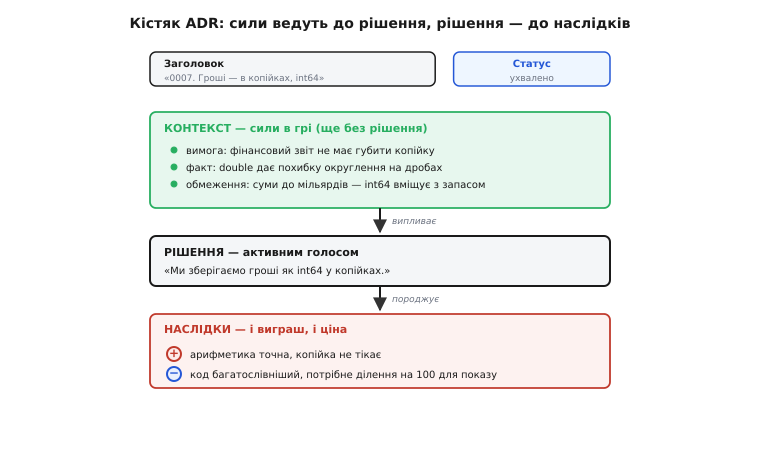
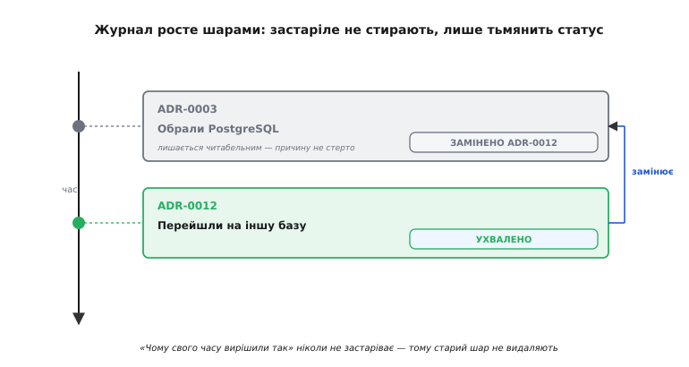

# Журнал архітектурних рішень (ADR)

<preknowlist>
- [Зворотні й незворотні рішення](topic:sf-apps/reversible-irreversible-decisions) — рішення класифікують за вартістю відкату; саме незворотні найважливіше записувати з причинами.
- [Trade-off-аналіз](topic:sf-apps/tradeoff-analysis) — кожне рішення щось віддає за щось; ADR фіксує саме цей обмін і його ціну.
- [Архітектурні драйвери](topic:sf-apps/architectural-drivers) — вимоги, обмеження й ризики, що формують систему; вони і є «силами» в контексті рішення.
</preknowlist>

Через рік після того, як команда обрала базу даних, чи протокол між сервісами, чи спосіб рахувати гроші, до коду приходить нова людина — і бачить рішення, яке з першого погляду виглядає дивним, а то й відверто хибним. Природна реакція: «хто це так зробив і чому не інакше?» І тут з'ясовується найгірше — ніхто вже не пам'ятає. Автор пішов, у голові в решти лишилися хіба уламки, а сам код мовчить: він показує, **що** вирішили, але жодним рядком не каже, **чому саме так** і які варіанти відкинули. Знання, найдорожче з усіх — знання про причини, — випарувалося. І нова людина або сліпо ламає те, що трималося на невидимій підставі, або роками боїться чіпати, бо «раптом там щось важливе».

Журнал архітектурних рішень (англ. *architecture decision record*, ADR) — це прямі й дешеві ліки саме від цієї хвороби. Одне рішення — один короткий текстовий файл, що фіксує не стільки сам вибір, скільки **сили, які до нього привели, і причини, чому переможцем став саме цей варіант, а не інші**. Не документація системи, не інструкція, не діаграма — а слід думки в мить, коли її ще пам'ятали.

## Що саме варто записувати

Перша пастка — думати, що фіксувати треба геть усе. Ні. Записувати варто рішення, які **архітектурно значущі**: ті, що дорого міняти, що зачіпають багатьох, що звужують майбутнє. Формулювання, яке добре це ловить, дав Майкл Найгард (Michael Nygard), автор самої ідеї ADR: значуще те рішення, що впливає на **структуру системи, її нефункціональні властивості, залежності, інтерфейси або техніки побудови**. Вибір бази — так. Рішення винести автентифікацію в окремий сервіс — так. Домовленість, що всі гроші зберігаємо в цілих копійках, а не в дробах, — так. А от назва внутрішньої змінної чи вибір бібліотеки-хелпера для одного модуля — ні: це [двобічні двері](topic:sf-apps/reversible-irreversible-decisions), відкат дешевий, пам'ятати причину не критично.

> 🔧 **Навіщо це.** Груба, але надійна перевірка «чи писати ADR»: уяви, що через рік хтось захоче це рішення скасувати. Якщо відкат дешевий і тихий — не пиши, шкода часу. Якщо відкат болючий, зачіпає багато коду чи чужих людей, а причина неочевидна з самого коду — це рівно той випадок, заради якого ADR існує. Записуй саме незворотне й неочевидне.

## Форма: сили, рішення, наслідки

Найцінніше у формі ADR — те, чого в ній **немає**. У ній немає місця для довгого опису системи, для інструкцій, для маркетингу. Є жорсткий кістяк із кількох розділів, і кожен змушує відповісти на одне конкретне питання.

Найгард запозичив цю форму зі світу, далекого від коду, — з **патернів** архітектора Крістофера Александера (Christopher Alexander), який ще в 1970-х описував рішення для будівель і міст як «набір сил у конфлікті та єдину відповідь на них». Звідси й головна ідея ADR: рішення нецікаве без сил, що його породили. [Як ця форма народилася й розвивалася](topic:sf-apps/architecture-decision-records/hist-adr-origin.md) — від патернів Александера через блог-допис Найгарда 2011 року до пізніших шаблонів на кшталт MADR — винесено окремо. Класичний кістяк, який запропонував Найгард, — п'ять розділів:

```
Заголовок    коротка назва рішення + номер (напр. «0007. Гроші — в копійках, int64»)
Статус       запропоновано / ухвалено / відхилено / застаріло / замінено ADR-0012
Контекст     які сили в грі: вимоги, обмеження, факти, страхи — БЕЗ рішення
Рішення      що саме вирішили, активним голосом: «Ми зберігаємо…»
Наслідки     що з цього випливло — і хороше, і погане, і нейтральне
```

Кожен розділ несе свою вагу, і найважливіші — не ті, що здаються.

**Контекст** — серце ADR, і саме його найчастіше псують. Тут описують **сили**: чому взагалі постало питання, які вимоги тиснуть, які обмеження не обійти, чого команда боїться. Головне правило: у контексті **ще немає рішення**, лише розстановка сил, з якої рішення потім випливе майже неминуче. Хто читає добрий контекст, той сам доходить того ж висновку — і це найкраща ознака, що контекст написаний чесно. Сили тут — це і є [архітектурні драйвери](topic:sf-apps/architectural-drivers): ключові вимоги, тверді обмеження й найризикованіші місця, які й формують систему.

**Наслідки** — розділ, який відрізняє зрілий ADR від наївного. Сюди пишуть не лише те, що рішення дає, а й **ціну, яку воно бере**: що тепер стало важче, яку нову залежність ми завели, від чого відмовилися. Бо кожне архітектурне рішення — це [обмін одного за інше](topic:sf-apps/tradeoff-analysis), і ADR, що описує лише виграш і мовчить про ціну, — це реклама, а не запис рішення. Чесні наслідки з мінусами — ознака того, що автор справді думав, а не виправдовувався.

**Статус** — те, що робить журнал живим у часі. Рішення не вічні: сьогоднішнє через рік застаріє. Але — і в цьому вся суть — застарілий ADR **не видаляють і не переписують**. Йому міняють статус на «застаріло» чи «замінено ADR-0012» і лишають на місці назавжди.


*Форма змушує рухатися в одному напрямку: сили в контексті природно ведуть до рішення, а рішення — до наслідків. Якщо контекст уже містить рішення або наслідки замовчують ціну — запис зіпсовано.*

## Чому не видаляти, а нашаровувати

Ось де ADR ламає звичну інтуїцію про документацію. Зазвичай застарілий документ — це сміття: його чистять, оновлюють, викидають. З ADR — навпаки, і причина глибока.

Звичайна документація відповідає на питання «**як зараз влаштована** система» — і для неї застаріле справді шкідливе, бо бреше про теперішнє. Але ADR відповідає на **інше** питання — «**чому** ми свого часу вирішили так». А на це питання минуле **ніколи не застаріває**: якщо у 2023-му ми обрали PostgreSQL із таких-то причин, то цей факт лишається правдою навіки, навіть коли у 2026-му ми з нього зіскочили. Викинути старий ADR — це стерти саме ту причину, заради збереження якої весь механізм і придумали.

Тому журнал росте, як **геологічні шари**: нове рішення лягає поверх старого, старе тьмяніє під новим статусом, але лишається читабельним. Хто через рік захоче зрозуміти, чому база двічі мінялася, розкопає обидва шари й побачить не лише сьогоднішній вибір, а всю траєкторію — і які сили тиснули тоді, і що змінилося відтоді. Це і є жива [пам'ять еволюції системи](topic:sf-apps/evolutionary-architecture): архітектура ніколи не буває правильною з першого разу, вона змінюється, і ADR-журнал — це її щоденник, а не миттєвий знімок.


*Застарілий ADR не видаляють — йому міняють статус і лишають назавжди. Причина, чому свого часу вирішили саме так, ніколи не застаріває; стерти її означало б знищити те, заради чого журнал і ведуть.*

## ADR у житті коду

Уся сила ADR — у тому, що вони живуть **поруч із кодом**, а не в окремій вікі, яку ніхто не відкриває. Найгард від початку задумав їх як **звичайні текстові файли в репозиторії**, у теці на кшталт `doc/adr/`, пронумеровані по порядку: `0001-…`, `0002-…`. Наслідки з цього виходять напрочуд корисні, і кожен випливає з попереднього.

Раз ADR — файл у репозиторії, він потрапляє в те саме рев'ю, що й код: рішення обговорюють у тому ж пул-реквесті, де його реалізують, і воно проходить ті самі очі. Раз він версіонований системою контролю версій, у нього є автор, дата й історія змін — «хто, коли, чому» дає сам інструмент, безкоштовно. І раз рішення лежить під рукою, а не за три кліки у вікі, є реальний шанс, що наступний розробник його **прочитає**, перш ніж ламати.

Щоб не писати щоразу службові поля вручну, для ADR є простий інструмент — [`adr-tools`](topic:sf-apps/architecture-decision-records/proj-adr-tooling.md) Ната Прайса (Nat Pryce): набір команд оболонки, що заводить теку, нумерує новий запис, проставляє дату й статус і навіть автоматично зшиває «замінено» з «замінює». Але це лише зручність; суть ADR не в інструменті, а в дисципліні записувати причини.

Ось як виглядає код, що дотримується рішення, записаного в ADR, — саме тут журнал стає не паперовим, а живим:

:::tabs
```cpp
// Гроші тримаємо в цілих копійках (int64), а не в double.
// Причини й відкинуті варіанти: doc/adr/0007-money-as-integer-cents.md
//
// Контекст (стисло): double дає похибку округлення на дробах,
// а фінансовий звіт не має права «загубити копійку». int64 вміщує
// суми до ~9.2·10¹⁸ копійок — з величезним запасом на будь-які гроші.

struct Money {
    int64_t cents;                 // рівно копійки, жодних дробів

    // Додавання — точне, бо цілі числа не округлюють:
    Money operator+(Money o) const { return { cents + o.cents }; }
};

// double тут заборонено свідомо — і причина за один клік у ADR-0007,
// а не в чиїйсь пам'яті. Хто захоче «спростити на double» — спершу
// прочитає, чому так робити НЕ можна.
```
```python
# Гроші тримаємо в цілих копійках (int), а не в float.
# Причини й відкинуті варіанти: doc/adr/0007-money-as-integer-cents.md
#
# Контекст (стисло): float дає похибку округлення на дробах,
# а фінансовий звіт не має права «загубити копійку». int у Python —
# без обмеження розрядності, тож будь-які суми вміщуються з запасом.

from dataclasses import dataclass

@dataclass(frozen=True)
class Money:
    cents: int                     # рівно копійки, жодних дробів

    # Додавання — точне, бо цілі числа не округлюють:
    def __add__(self, o: "Money") -> "Money":
        return Money(self.cents + o.cents)

# float тут заборонено свідомо — і причина за один клік у ADR-0007,
# а не в чиїйсь пам'яті. Хто захоче «спростити на float» — спершу
# прочитає, чому так робити НЕ можна.
```
```go
// Гроші тримаємо в цілих копійках (int64), а не в float64.
// Причини й відкинуті варіанти: doc/adr/0007-money-as-integer-cents.md
//
// Контекст (стисло): float64 дає похибку округлення на дробах,
// а фінансовий звіт не має права «загубити копійку». int64 вміщує
// суми до ~9.2·10¹⁸ копійок — з величезним запасом на будь-які гроші.

type Money struct {
	Cents int64 // рівно копійки, жодних дробів
}

// Додавання — точне, бо цілі числа не округлюють
// (у Go немає перевантаження операторів — метод Add):
func (m Money) Add(o Money) Money {
	return Money{m.Cents + o.Cents}
}

// float64 тут заборонено свідомо — і причина за один клік у ADR-0007,
// а не в чиїйсь пам'яті. Хто захоче «спростити на float64» — спершу
// прочитає, чому так робити НЕ можна.
```
```rust
// Гроші тримаємо в цілих копійках (i64), а не в f64.
// Причини й відкинуті варіанти: doc/adr/0007-money-as-integer-cents.md
//
// Контекст (стисло): f64 дає похибку округлення на дробах,
// а фінансовий звіт не має права «загубити копійку». i64 вміщує
// суми до ~9.2·10¹⁸ копійок — з величезним запасом на будь-які гроші.

use std::ops::Add;

#[derive(Clone, Copy)]
struct Money {
    cents: i64, // рівно копійки, жодних дробів
}

// Додавання — точне, бо цілі числа не округлюють:
impl Add for Money {
    type Output = Money;
    fn add(self, o: Money) -> Money {
        Money { cents: self.cents + o.cents }
    }
}

// f64 тут заборонено свідомо — і причина за один клік у ADR-0007,
// а не в чиїйсь пам'яті. Хто захоче «спростити на f64» — спершу
// прочитає, чому так робити НЕ можна.
```
:::

Коментар-посилання на ADR — це місток від коду до причини. Без нього наступний розробник побачить дивний `int64_t` замість природного `double` і «виправить» його, знову впустивши похибку округлення в гроші. З ним — спершу дізнається, чому так зроблено навмисне. Різниця між роками болю й п'ятьма хвилинами читання — часто саме в одному такому рядку.

## Живий журнал проти мертвого

ADR легко перетворити на ще один мертвий обряд — теку файлів, які ніхто не пише щиро й ніхто не читає. Межа між живим журналом і мертвим тонка, і тримається вона на кількох звичках.

Живий ADR пишуть **у мить рішення**, поки сили ще свіжі в голові, а не «колись потім заднім числом» — бо заднім числом контекст завжди виходить причесаним, з нього зникають вагання, глухі кути й справжні страхи, і лишається гладенька вигадана логіка. Живий ADR **короткий** — одна-дві сторінки; довгий ніхто не дочитає, а отже й не напише чесно. Живий ADR **не бреше про наслідки** — у ньому є розділ із мінусами, і він не порожній.

І найголовніше — живий журнал заводять **на прийнятні незворотні рішення, а не на всі підряд**. Спокуса документувати кожен рух убиває практику певніше, ніж лінь: команда тоне в ADR на дрібниці, перестає їх писати щиро, і весь механізм відмирає. Той самий інструмент, що ловить, які рішення варті запису, — питання про вартість відкату: незворотне й неочевидне пишемо, [двобічні двері](topic:sf-apps/reversible-irreversible-decisions) лишаємо коду й пам'яті. Журнал вартий рівно тих рішень, за незнання яких хтось через рік заплатить болем, — і жодним записом більше.

Тоді ADR стає тим, чим має бути: не бюрократією, а **найдешевшою страховкою** від найдорожчої втрати — втрати причин. Одна сторінка тексту, написана в потрібну мить, рятує наступного розробника від того, щоб наосліп ламати те, що трималося на невидимій підставі, — або роками боятися чіпати те, що насправді давно можна змінити.
